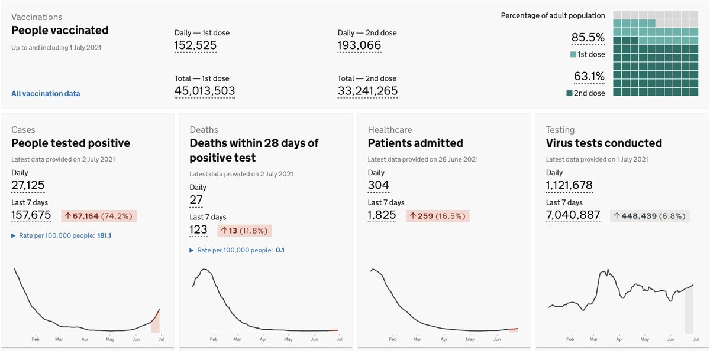
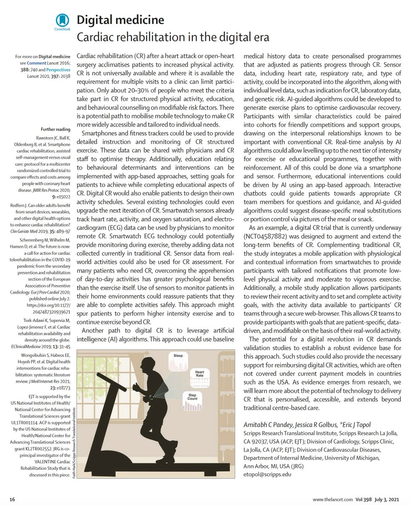

+++
title = "Tweets by Eric Topol July 02"
Summary = ""
tags = ["Twitter"]
category = "Twitter"
+++

---

<a href="https://twitter.com/erictopol/status/1410766785243013121" target="_blank" rel="noreferer">01:06 UCT</a>

The @US_FDA's overdue full approval of mRNA vaccines is holding us back from getting millions of more people protected, at a time of urgent need, with the Delta variant on the rise. My guest essay @nytopinion https://www.nytimes.com/2021/07/01/opinion/fda-vaccines-full-approval.html w/ thanks for editing @jopearl

---

<a href="https://twitter.com/erictopol/status/1410768973424037888" target="_blank" rel="noreferer">01:15 UCT</a>

I start off w/ the paradox of FDA's  accelerated approval of the Alzheimer's drug despite a 10-0 vote against it by their Advisory Committee, 2 clinical trials that did not show clinical benefit, and for any person w/Alzheimer's even though the trials were for early disease, MCI 

<a href="E5QOZXmVUAMBQnv.jpg"  ></img></a>

---

<a href="https://twitter.com/erictopol/status/1410777364955492352" target="_blank" rel="noreferer">01:48 UCT</a>

Then a brief review of the exceptionally large, completed clinical trials and real world evidence for these vaccines—the 1st ever new vaccines to get Emergency Use Authorization (EUA)—now given to hundreds of millions of people /3 

<a href="E5QQCevVgAIIKoJ.jpg"  ></img></a>

---

<a href="https://twitter.com/erictopol/status/1410777370923962371" target="_blank" rel="noreferer">01:48 UCT</a>

A key point is that the FDA began reviewing the full licensure applications (called BLAs) at the end of last year on a rolling, iterative basis. That was started 7 months ago and there was more than ample time to do plant inspections and review manufacturing/production issues /5

---

<a href="https://twitter.com/erictopol/status/1410777369019785216" target="_blank" rel="noreferer">01:48 UCT</a>

The US vaccination campaign has hit a plateau, having peaked in April (up to 4.5 M /day) and fallen off since then, just getting abs over 1 million again today
https://www.nytimes.com/interactive/2020/us/covid-19-vaccine-doses.html /4 

<a href="E5QQ5S7VEAIuGkw.jpg"  ></img></a>

---

<a href="https://twitter.com/erictopol/status/1410777375025942529" target="_blank" rel="noreferer">01:48 UCT</a>

Now we face the Delta variant, the most efficient version of the virus yet for finding new hosts, 40% more contagious than Alpha, need for 2-dose mRNA vaccine for full efficacy
Delta is now &gt;30% of infections, cases are starting to rise in several states
https://www.nytimes.com/interactive/2021/us/covid-cases.html 6 

<a href="E5QTTkHUcAEntOK.jpg"  ></img></a>

---

<a href="https://twitter.com/erictopol/status/1410777379165724679" target="_blank" rel="noreferer">01:48 UCT</a>

The FDA, and @DrWoodcockFDA its acting Director, need to make this the #1 priority, inform the public, provide the timeline. They vigorously defended the Alzheimer's drug misguided approval but have yet to provide 1 word of guidance on this critical matter /f

---

<a href="https://twitter.com/erictopol/status/1410777377559306242" target="_blank" rel="noreferer">01:48 UCT</a>

Full licensure by FDA will lead to required vaccination by health systems, the military, universities, private companies, etc (w/ accommodations of masks + frequent testing for people unwilling or unable to be vaccinated). Tens of millions of Americans will likely get vaxxed /7

---

<a href="https://twitter.com/erictopol/status/1410802213086134279" target="_blank" rel="noreferer">03:27 UCT</a>

The lives and health of millions of Americans rest on the F.D.A.’s decision to fully license these vaccines. https://twitter.com/nytopinion/status/1410800437570244609

---

<a href="https://twitter.com/erictopol/status/1410809259047092229" target="_blank" rel="noreferer">03:55 UCT</a>

@LDelanoWood Much appreciated 🙏

---

<a href="https://twitter.com/erictopol/status/1410948512217370627" target="_blank" rel="noreferer">13:08 UCT</a>

Nothing could make more of a difference for getting US vaccinations amped up right now than the FDA's decision for full approval of vaccines

---

<a href="https://twitter.com/erictopol/status/1410969289041997829" target="_blank" rel="noreferer">14:31 UCT</a>

Update July 2
Cases dropped to 151
Zero deaths (for over a week)

---

<a href="https://twitter.com/erictopol/status/1410988971320954881" target="_blank" rel="noreferer">15:49 UCT</a>

As the UK achieves ~86% adults vaccinated (Israel is also at 85%, the *US 67%*), today showing no increase in new cases (yesterday 27, 989, today 27,125) and that 70% increase in the last week associated w/ 16% rise in hospitalizations 

<a href="E5TWDVAVUAYctoF.jpg"  ></img></a>

---

<a href="https://twitter.com/erictopol/status/1411000739007057926" target="_blank" rel="noreferer">16:36 UCT</a>

@JoshuaPCohen1 These are the data from @PHE_UK from today. Cases are as of July 2nd. What is your source of endpoint data beyond that?

---

<a href="https://twitter.com/erictopol/status/1411012902304174082" target="_blank" rel="noreferer">17:24 UCT</a>

RT @HuffmanLabDU: Great new study on #HEPA air cleaners by Lindsley et al. out today via @CDCMMWR: masks reduced aerosol by 72%, HEPA by 65…

---

<a href="https://twitter.com/erictopol/status/1411013115429355525" target="_blank" rel="noreferer">17:25 UCT</a>

RT @ashishkjha: Awesome @nytopinion piece by @EricTopol 

@US_FDA should fully approve Pfizer/Moderna

We have way more data for these vacc…

---

<a href="https://twitter.com/erictopol/status/1411017478814113796" target="_blank" rel="noreferer">17:42 UCT</a>

What % of US cases are from the Delta variant now?
It could be 47-61%, but the N of samples sequenced is low, so it is hard to know.
2 things are clear: 
1.  increasing exponentially 
2. surveillance is weak
http://outbreak.info
http://covariants.org
http://cov-spectrum.ethz.ch 

<a href="E5TvYXCVcAMOE-J.jpg"  ></img></a>

---

<a href="https://twitter.com/erictopol/status/1411021059214626820" target="_blank" rel="noreferer">17:56 UCT</a>

Meanwhile, the @CDCgov is quoting 25% today
https://www.nbcnews.com/science/science-news/delta-delta-variants-everything-need-know-rcna1281
And there website data are from June 5th!
https://covid.cdc.gov/covid-data-tracker/#variant-proportions
And they were given $1,200,000,000 to fix this on March 21, 2021 

<a href="E5TzhuWVUAcsOVY.png"  ></img></a><a href="E5TzshjUUAEk-oC.jpg"  ></img></a>

---

<a href="https://twitter.com/erictopol/status/1411023701630341121" target="_blank" rel="noreferer">18:07 UCT</a>

@roby_bhatt @CDCgov "nowcast" in quotes is appropriate ;-)

---

<a href="https://twitter.com/erictopol/status/1411034908789592064" target="_blank" rel="noreferer">18:51 UCT</a>

RT @DrTomFrieden: Vaccines Stop Cases…If They’re Given

The Delta variant poses a huge threat—but not to vaccinated people. Unvaccinated pe…

---

<a href="https://twitter.com/erictopol/status/1411039210392276993" target="_blank" rel="noreferer">19:08 UCT</a>

Cardiac rehab has been unchanged for 50 years. It's high time to move forward. 
Our latest digital medicine essay @TheLancet  https://www.thelancet.com/journals/lancet/article/PIIS0140-6736(21)01437-9/fulltext
@AmitabhCPandey @JRGolbus @scrippsresearch @ScrippsRTI @umichmedicine 

<a href="E5UEXCsUYAI7IXB.jpg"  ></img></a>

---

<a href="https://twitter.com/erictopol/status/1411044776208527360" target="_blank" rel="noreferer">19:31 UCT</a>

Cerebral venous sinus thrombosis (CVST) is rare. In the pandemic, it cropped us as occurring in &lt;1% of severe covid cases and as a very rare adverse effect with adenoviral-vector vaccines. Clinical features and treatment reviewed well in this week's @NEJM
https://www.nejm.org/doi/full/10.1056/NEJMra2106545?query=featured_home 

<a href="E5UHd1FVEAI1ch-.jpg"  ></img></a><a href="E5UJVtZUYAE3ZyA.jpg"  ></img></a>

---

<a href="https://twitter.com/erictopol/status/1411053894331813889" target="_blank" rel="noreferer">20:07 UCT</a>

Southern Africa is one of the worst-hit regions of the world now, led by Namibia (per capita). The Delta variant is playing a significant role. The absence of our help with vaccines is palpable. 

<a href="E5UQ3KSVcAEdSvv.jpg"  ></img></a><a href="E5UR2K_VoAYPRz1.jpg"  ></img></a>

---

<a href="https://twitter.com/erictopol/status/1411054785369808898" target="_blank" rel="noreferer">20:10 UCT</a>

I meant to include Botswana 

<a href="E5USw3IVgAMi5bC.jpg"  ></img></a><a href="E5UStm1VUAARfY0.jpg"  ></img></a>

---

<a href="https://twitter.com/erictopol/status/1411061477998424065" target="_blank" rel="noreferer">20:37 UCT</a>

Color Δ
The wavefront of states moving to higher risk is increasing, all w/ sub-average 1st dose vaccination (shown, US overall 57%) and with the Delta variant ranging 35-70% prevalence
The good part is the case burden is still low, Nevada is max 16/100K. But rising.
@CovidActNow 

<a href="E5UXeBWUcAUt5bD.jpg"  ></img></a>