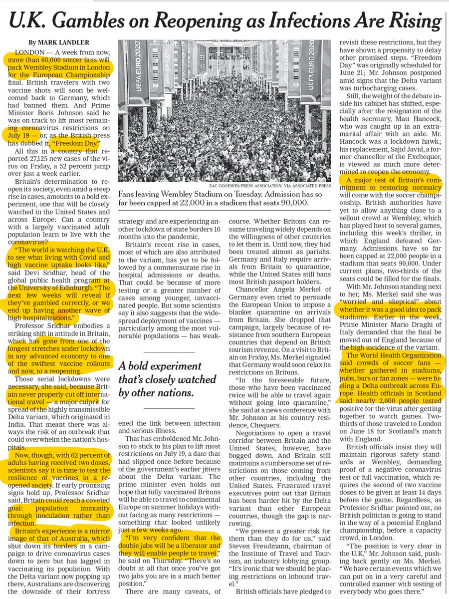
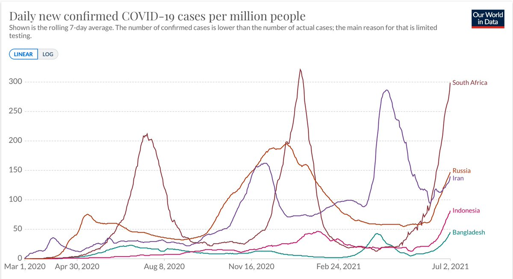
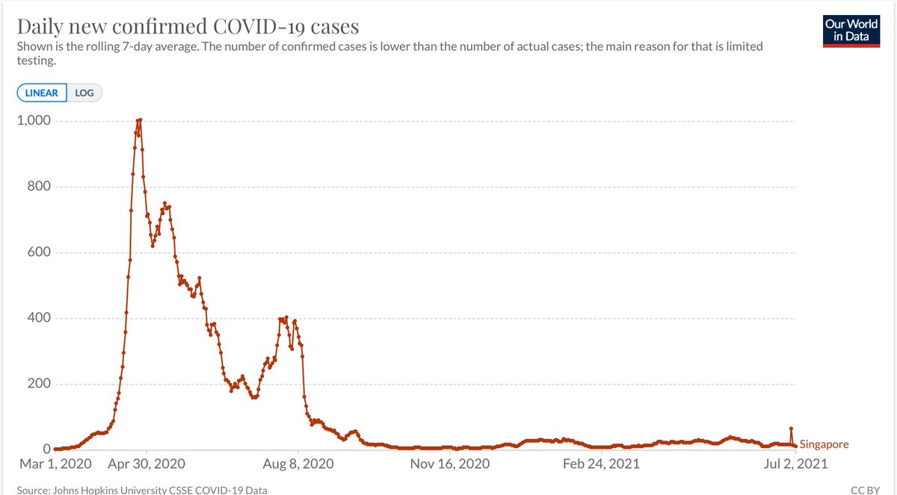
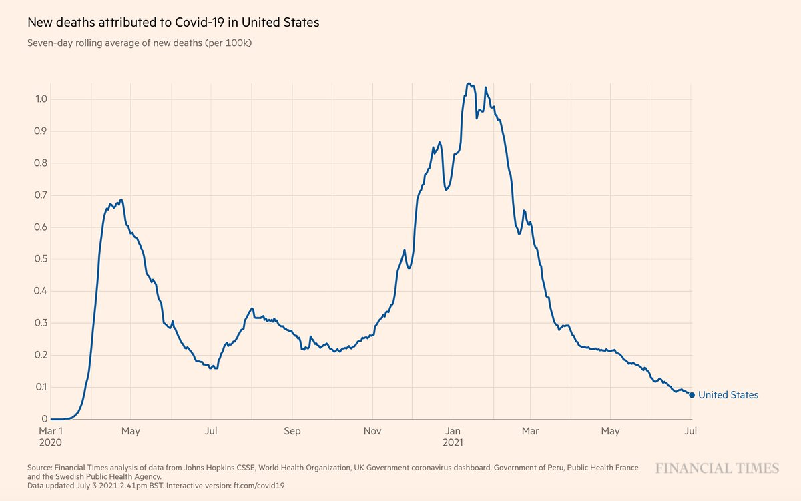
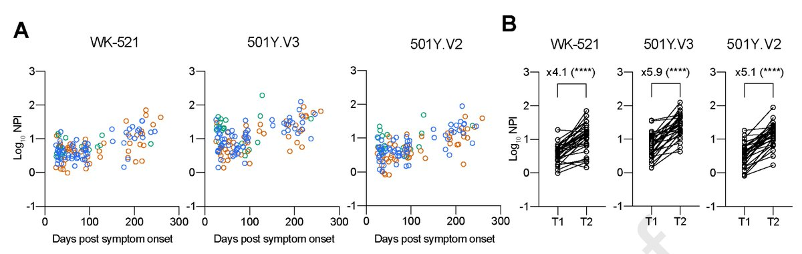
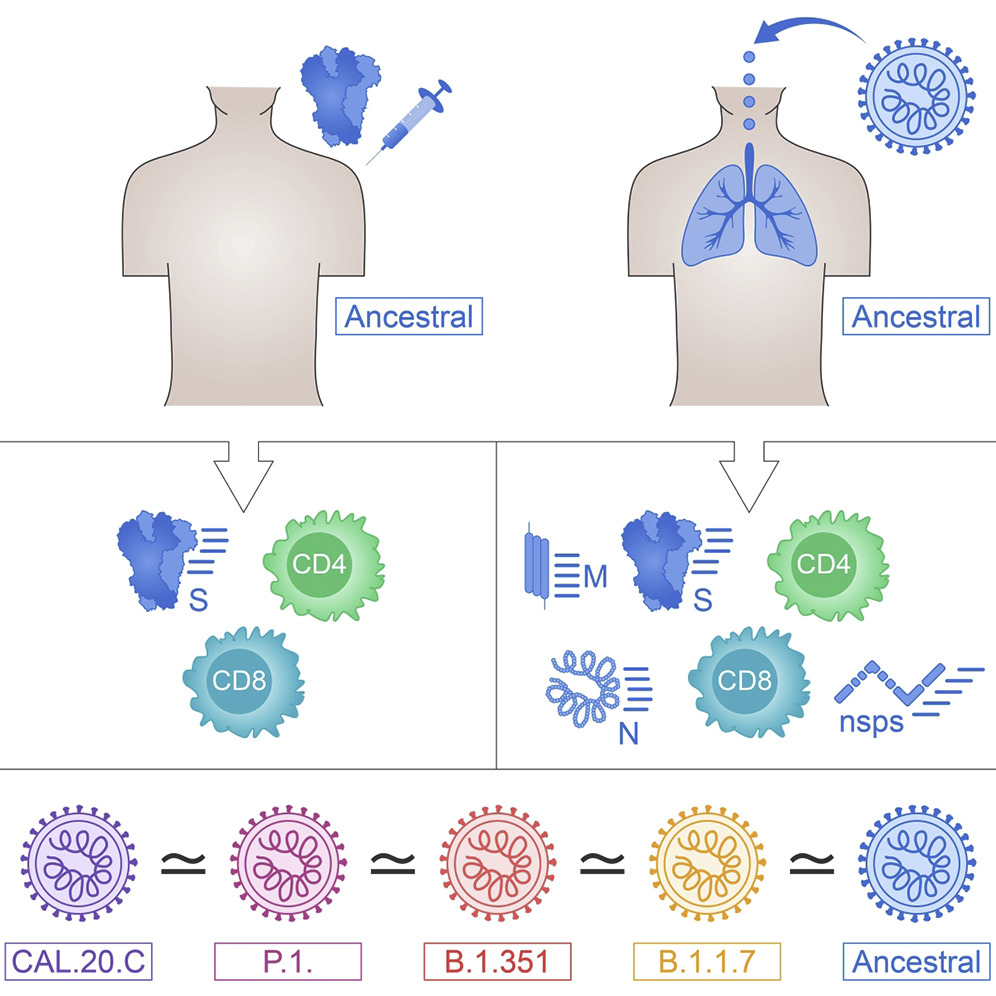
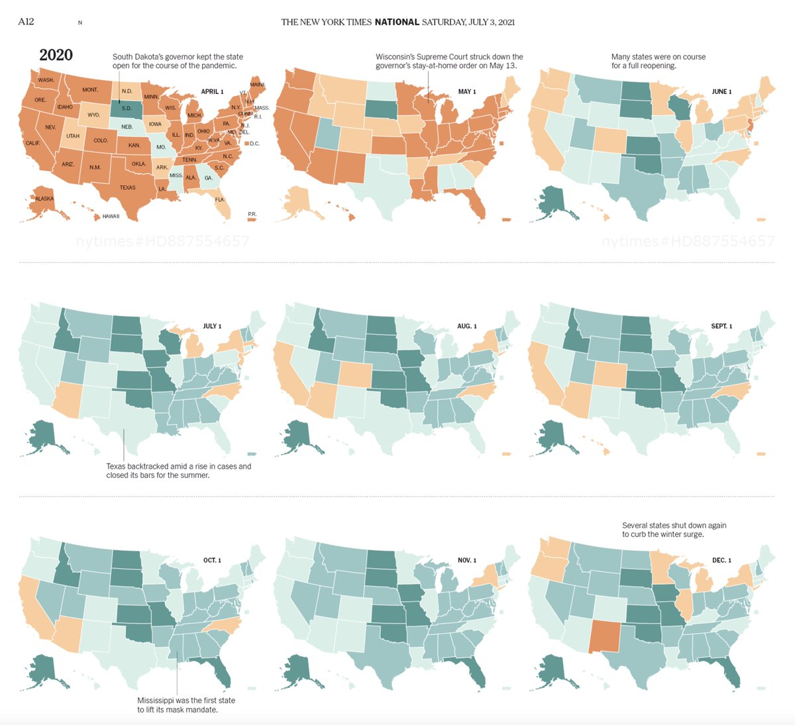
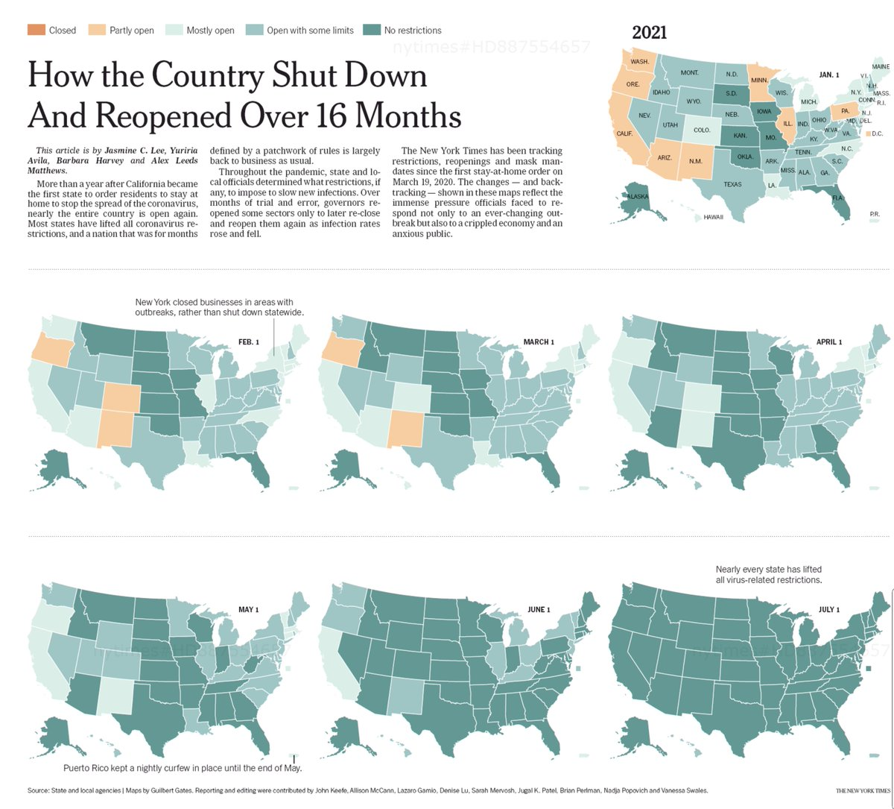
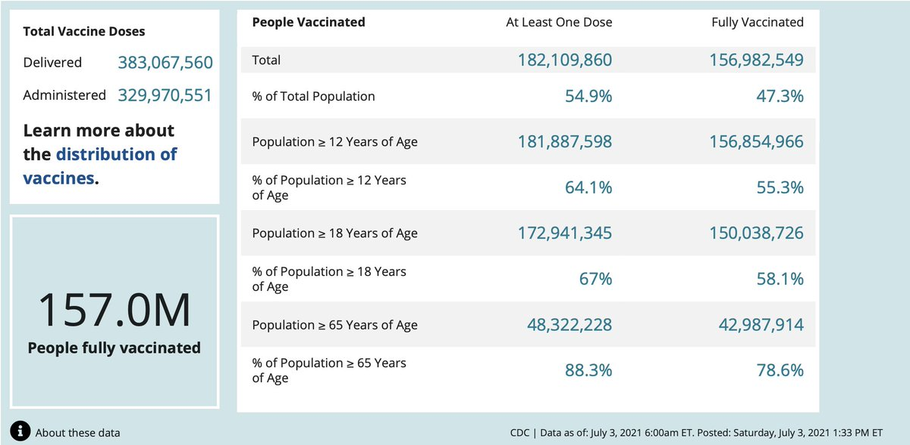
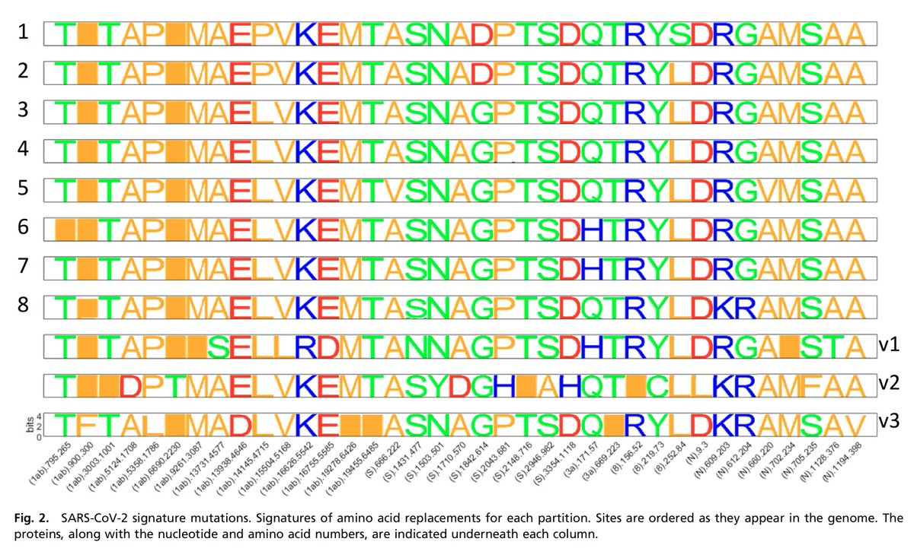

+++
title = "Tweets by Eric Topol July 03"
Summary = ""
tags = ["Twitter"]
category = "Twitter"
+++

---

<a href="https://twitter.com/erictopol/status/1411324281733091331" target="_blank" rel="noreferer">14:01 UCT</a>

The high prevalence of the Delta variant in many US states.
The trends are likely right but, in most states, the number of sequenced samples is very low, leading to overestimates of the per cent
https://www.ft.com/content/7c3a7e3a-6cef-48ae-89a6-01e1a6f15959 by @TWenseleers 
and http://outbreak.info for N samples 

<a href="E5YGYSHVIAMh70K.jpg"  ></img></a>

---

<a href="https://twitter.com/erictopol/status/1411330209287077893" target="_blank" rel="noreferer">14:25 UCT</a>

Spotlight on Missouri, which along with Nevada, has been the leading edge of the US Delta rise. One of the lowest states for vaccination. Limited samples, wide 95% CI and some bias of those sequenced make for uncertainty of Delta prevalence point estimates
https://www.wsj.com/articles/delta-variant-fuels-missouris-covid-19-uptick-11625304601?mod=hp_lead_pos4

---

<a href="https://twitter.com/erictopol/status/1411335124319309836" target="_blank" rel="noreferer">14:44 UCT</a>

"The world is watching the U.K. to see what living with Covid and high vaccine uptake looks like”—@devisridhar  
https://www.nytimes.com/2021/07/02/world/europe/coronavirus-britain-reopening-delta-variant.html?action=click&module=RelatedLinks&pgtype=Article by @MarkLandler 

<a href="E5YQ3rBVgAAAcHX.jpg"  ></img></a>

---

<a href="https://twitter.com/erictopol/status/1411336262036852744" target="_blank" rel="noreferer">14:49 UCT</a>

@TWenseleers Thanks Tom. I hope you are right but the number of samples and which ones were sequenced makes me think your model has US overestimates. If these prevalence point estimates are accurate, it's good news in many states which have yet to see any uptick in cases

---

<a href="https://twitter.com/erictopol/status/1411338284286963719" target="_blank" rel="noreferer">14:57 UCT</a>

@TWenseleers Yes. There are little to no random samples getting sequenced here. Our genomic "surveillance" is still way off the mark.

---

<a href="https://twitter.com/erictopol/status/1411341422964269058" target="_blank" rel="noreferer">15:09 UCT</a>

RT @nytopinion: In the history of medicine, few biologics have been scrutinized as much as the coronavirus vaccines from Pfizer and Moderna…

---

<a href="https://twitter.com/erictopol/status/1411351101576646667" target="_blank" rel="noreferer">15:48 UCT</a>

Some places where Delta is high and vaccinations are low are experiencing new surges or their worst Covid wave yet
@OurWorldInData 

<a href="E5YfpiAVkAQShYJ.jpg"  ></img></a>

---

<a href="https://twitter.com/erictopol/status/1411355584381607938" target="_blank" rel="noreferer">16:06 UCT</a>

In contrast, Singapore
A notable example of a country now with &gt;90% Delta and &gt;60% of total population vaccinated, seeing little impact 

<a href="E5YkM22VgAQ5PB0.jpg"  ></img></a>

---

<a href="https://twitter.com/erictopol/status/1411361111648083969" target="_blank" rel="noreferer">16:28 UCT</a>

Despite the rise of Delta in the US, the death rate keeps declining. 
Let's hope this continues. 

<a href="E5YpDAQUcAQWn6L.jpg"  ></img></a>

---

<a href="https://twitter.com/erictopol/status/1411374762975137793" target="_blank" rel="noreferer">17:22 UCT</a>

Over time, in people with prior covid, there is increased neutralization antibody potency to variants of concern (Alpha, Beta, Gamma). New @ImmunityCP (and good to see)
https://www.cell.com/immunity/fulltext/S1074-7613(21)00259-4 

<a href="E5Y1t8cVEAIp5S2.jpg"  ></img></a>

---

<a href="https://twitter.com/erictopol/status/1411377452622909442" target="_blank" rel="noreferer">17:33 UCT</a>

Just like the UK......
We have states now that have high Delta variant prevalence, sharp increase in cases and clear upticks in hospitalizations. All have below average vaccination rates (and average, 55% total population, is suboptimal) 

<a href="E5Y302yVEAAIAXQ.jpg"  ></img></a>

---

<a href="https://twitter.com/erictopol/status/1411380301423468547" target="_blank" rel="noreferer">17:44 UCT</a>

Is the T cell response (CD4+/CD8+) materially affected by key variants in people with prior covid or mRNA vaccinees?
Short answer is good: No. 👍
https://www.cell.com/cell-reports-medicine/fulltext/S2666-3791(21)00204-4 @SetteLab @ljiresearch @aetarke @CellRepMed 

<a href="E5Y54xWUUAUCJqx.jpg"  ></img></a>

---

<a href="https://twitter.com/erictopol/status/1411393139458199556" target="_blank" rel="noreferer">18:35 UCT</a>

Tracking the US open-&gt; close -&gt; re-opening
@jasmineclee @yag1310 @barbaraaharvey @alex_leedsmatts @nytgraphics 

<a href="E5ZGfbdVoAA5l-K.jpg"  ></img></a><a href="E5ZGTvqVcAEJwoQ.jpg"  ></img></a>

---

<a href="https://twitter.com/erictopol/status/1411416528495333376" target="_blank" rel="noreferer">20:08 UCT</a>

Good to see new data for the AZ vaccine, aka Covishield, with strong neutralizing antibody (NAb) response to the Delta variant. People with prior Covid had NAbs augmented by vaccination. 
20 breakthrough cases with high NAbs
https://www.biorxiv.org/content/10.1101/2021.07.01.450676v1 preprint 

<a href="E5ZaqmwUYAEZ7RS.jpg"  ></img></a>

---

<a href="https://twitter.com/erictopol/status/1411431112136564736" target="_blank" rel="noreferer">21:06 UCT</a>

This will help. Almost 1.2 million more vaccinations reported today, with 460,000 newbies.
Having 157 million Americans fully vaccinated and an untold (large) number of prior covid people who didn't get vaccinated is our Delta wall to further build on 

<a href="E5ZpDbAUUAA8VcY.jpg"  ></img></a>

---

<a href="https://twitter.com/erictopol/status/1411441631438409731" target="_blank" rel="noreferer">21:48 UCT</a>

The evolution of #SARSCoV2 variants over the course of the pandemic. Not just in the spike protein, but also nucleocapsid. The likely effects of genomic interactions, potential for variant-specific vaccines, &amp; prolonging the pandemic if🦠not contained
https://www.pnas.org/content/118/29/e2104241118 

<a href="E5Zxw9HVgAA3ZHx.jpg"  ></img></a><a href="E5Zxyb_UcAMMoLY.jpg"  ></img></a>