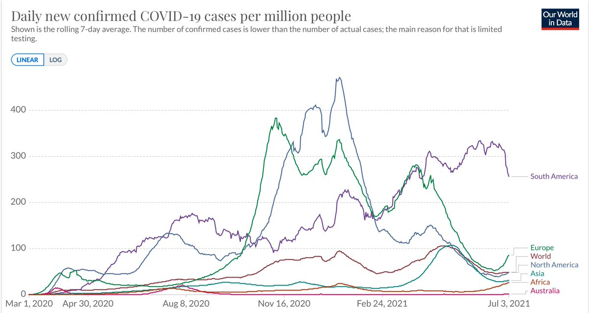

+++
title = "Tweets by Eric Topol" 
data = 2021-07-04T01:18:27+00:00
category = "Twitter"
+++

---

<a href="https://twitter.com/erictopol/status/1411494583914041344" target="_blank" rel="noreferer">01:18 UCT</a>

Defining a solid Delta wall, now confronting 60% prevalence
With a fully vaccinated 85% adult population
Zero deaths 9 days in a row https://twitter.com/EricTopol/status/1410694245346734082

---

<a href="https://twitter.com/erictopol/status/1411684772779159561" target="_blank" rel="noreferer">13:54 UCT</a>

Celebrating Great Immigrants, Great Americans, the essential contributions immigrants to American Life
Such as @kkariko pioneer of mRNA used for vaccines, @CarlosdelRio7 a guiding force during the pandemic, @K_JeanPierre @WhiteHouse and so many more 

<a href="E5dOk2hVEAcyEDH.jpg"  ></img></a>

---

<a href="https://twitter.com/erictopol/status/1411693840767995905" target="_blank" rel="noreferer">14:30 UCT</a>

Worth emphasizing 1000X on long-term safety of vaccines:
"In the history of vaccines, side effects have always appeared within two months of administration"—@DrPaulOffit 
https://www.sandiegouniontribune.com/news/health/story/2021-05-31/misinformation-remains-the-biggest-hurdle-as-vaccination-effort-turns-to-cash-incentives 

<a href="E5dXVj-VIAI9yGk.jpg"  ></img></a>

---

<a href="https://twitter.com/erictopol/status/1411695941594226701" target="_blank" rel="noreferer">14:38 UCT</a>

RT @Kasparov63: America literally would not be America without immigrants. And it wouldn’t be America spiritually without generations of st…

---

<a href="https://twitter.com/erictopol/status/1411703393035321345" target="_blank" rel="noreferer">15:08 UCT</a>

What drives or detracts from vaccine trust? 
A large survey of 13,000 Americans and Danes
"The strongest predictors of vaccine skepticism ... were individual differences in political cynicism.. and in conspiratorial thinking"
https://www.pnas.org/content/118/29/e2024597118
@M_B_Petersen @Fly_Lindholt 

<a href="E5dfkiXVkAELRuD.jpg"  ></img></a><a href="E5dfnQzUUAYDSzt.jpg"  ></img></a>

---

<a href="https://twitter.com/erictopol/status/1411709433768398848" target="_blank" rel="noreferer">15:32 UCT</a>

The heightened infectiousness of the Delta variant is reflected by its rapid and diffuse spread throughout the world towards global dominance. Except for South America, new cases are now moving in the wrong direction.
https://cov-lineages.org/global_report_B.1.617.2.html
@OurWorldInData 

<a href="E5dlMaNUYAUSYr6.jpg"  ></img></a><a href="E5dlWHXVEAEltci.jpg"  ></img></a>

---

<a href="https://twitter.com/erictopol/status/1411723141458448387" target="_blank" rel="noreferer">16:26 UCT</a>

So true.
https://www.nytimes.com/2021/07/03/opinion/covid-vaccine-us-hesitancy.html @nytopinion 

<a href="E5dyoFSUUAEvBlT.png"  ></img></a>

---

<a href="https://twitter.com/erictopol/status/1411725660062556162" target="_blank" rel="noreferer">16:36 UCT</a>

RT @TheLancet: Multiple clinic visits and limited service availability can obstruct participation in cardiac rehabilitation (CR). Could mob…

---

<a href="https://twitter.com/erictopol/status/1411731941506752518" target="_blank" rel="noreferer">17:01 UCT</a>

While Delta is a formidable version of the virus, we have the tools to take it on.
Besides masks and distancing, there are 5 vaccines with some proof of protection against the Delta variant. 

<a href="E5d5jiTUYAQC6o7.png"  ></img></a>

---

<a href="https://twitter.com/erictopol/status/1411731945076056071" target="_blank" rel="noreferer">17:01 UCT</a>

Latest report here on Covaxin
https://www.wsj.com/articles/indias-bharat-biotech-says-vaccine-is-effective-against-delta-variant-11625325879 by @pokharelkrishna

---

<a href="https://twitter.com/erictopol/status/1411738297123053569" target="_blank" rel="noreferer">17:26 UCT</a>

The 3 states leading the ascent of Delta cases in the US, with 23-46% rise in hospitalizations in the past 2 weeks.
Each are &gt;80% Delta prevalence now http://outbreak.info
Arkansas, now at the top, with one of the lowest vaccination rates in the country 

<a href="E5d_c6KVUAYuAto.jpg"  ></img></a>

---

<a href="https://twitter.com/erictopol/status/1411744255694061569" target="_blank" rel="noreferer">17:50 UCT</a>

Test positivity in Arkansas now 15%
Missouri 11%
Nevada 10%
National average is 2.3% 

<a href="E5eFd5FVkAQ4jT1.jpg"  ></img></a>

---

<a href="https://twitter.com/erictopol/status/1411746049425698821" target="_blank" rel="noreferer">17:57 UCT</a>

Make that 10 days in a row https://twitter.com/EricTopol/status/1411494583914041344

---

<a href="https://twitter.com/erictopol/status/1411767824377208837" target="_blank" rel="noreferer">19:24 UCT</a>

Moderna and J&amp;J vaccines haven’t published clinical effectiveness studies yet but they are undoubtedly protective, as each of the vaccine’s lab studies (in sera from vaccinees) has been predictive for all variants to date

---

<a href="https://twitter.com/erictopol/status/1411820173464461312" target="_blank" rel="noreferer">22:52 UCT</a>

The overwhelming net benefit for vaccination in kids.  Outstanding, by ⁦@jeremyfaust⁩ ⁦@celinegounder⁩ ⁦Katie Dickerson Mayes @nytopinion⁩  https://www.nytimes.com/2021/07/04/opinion/covid-vaccine-kids-risks.html

