+++
title = "Tweets by Eric Topol July 06"
Summary = ""
tags = ["Twitter"]
category = "Twitter"
+++

---

<a href="https://twitter.com/erictopol/status/1412226732149534721" target="_blank" rel="noreferer">01:47 UCT</a>

How can "most" infections occur in vaccinated individuals and still represent very high vaccine effectiveness?
Not hard when most people are vaccinated.
It's all about fractions and denominators 

<a href="E5k8JjkUYAIqQQ4.jpg"  >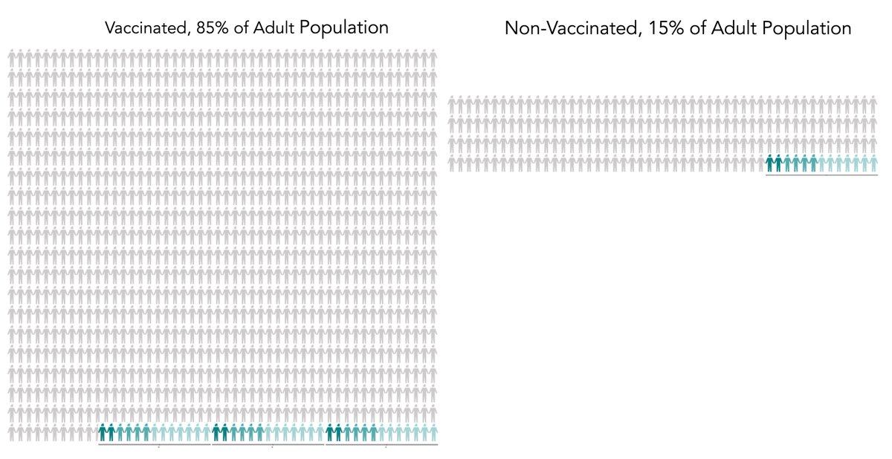</img></a>

---

<a href="https://twitter.com/erictopol/status/1412401014032900096" target="_blank" rel="noreferer">13:20 UCT</a>

The UK's  challenge with 99% Delta variant as basis for cases and 86% adults vaccinated ≥ 1 dose
Currently pushing 30,000 new cases/day. Will it rise to  50K or 100K/day?
One thing's very clear: #VaccinesWork to blunt impact with much less severe illness 

<a href="E5naCLJUUAotbX7.jpg"  >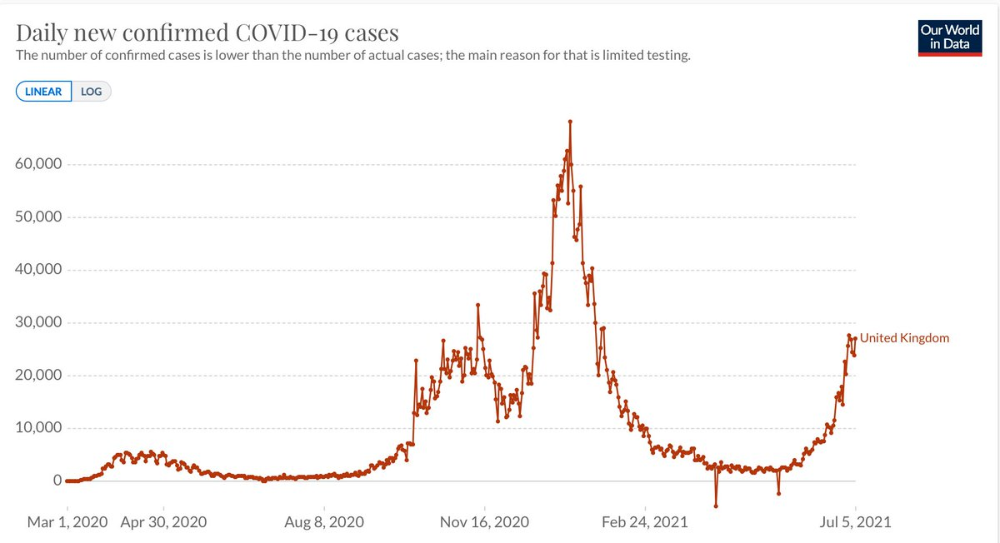</img></a><a href="E5naIQ4VoAMekN8.jpg"  >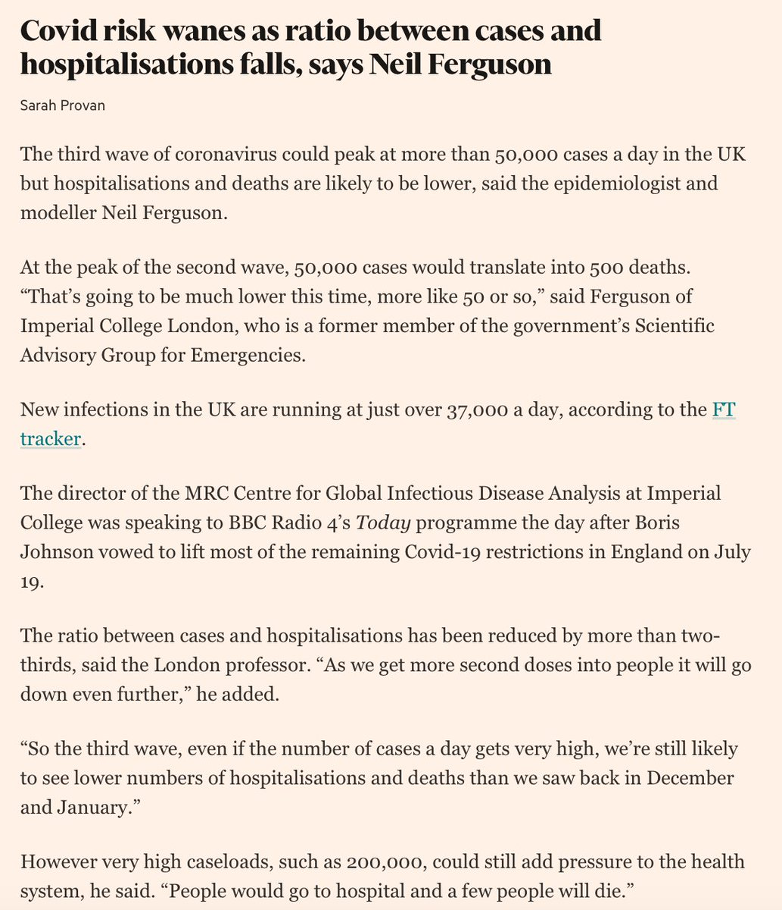</img></a><a href="E5naJk_UYAASQWo.jpg"  >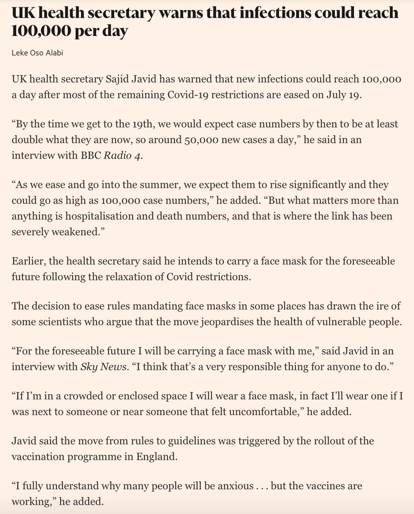</img></a>

---

<a href="https://twitter.com/erictopol/status/1412403144844136449" target="_blank" rel="noreferer">13:28 UCT</a>

Places in the US where people think the pandemic is over and that vaccinations are not vital as the exit strategy are getting a Delta wake up call
https://www.wsj.com/articles/delta-covid-19-variant-gains-ground-among-the-unvaccinated-11625572800?mod=hp_lead_pos7 by @littlewern

---

<a href="https://twitter.com/erictopol/status/1412415450999410697" target="_blank" rel="noreferer">14:17 UCT</a>

More on this @washingtonpost today, by @acellerbeck ,w/@ashishkjha 
https://www.washingtonpost.com/politics/2021/07/06/health-202-fda-could-boost-vaccinations-by-fully-approving-pfizer-vaccine/

---

<a href="https://twitter.com/erictopol/status/1412421242808832002" target="_blank" rel="noreferer">14:40 UCT</a>

"A mutation [T372A in the receptor binding domain] likely contributed to #SARSCoV2’s emergence from animal reservoirs or enabled sustained human-to-human transmission"   from analysis of over 180,000 sequences
Just out @CellCellPress 
https://www.cell.com/cell/fulltext/S0092-8674(21)00833-3?rss=yes&utm_source=dlvr.it&utm_medium=twitter 

<a href="E5ns0KGXEAsllNX.jpg"  >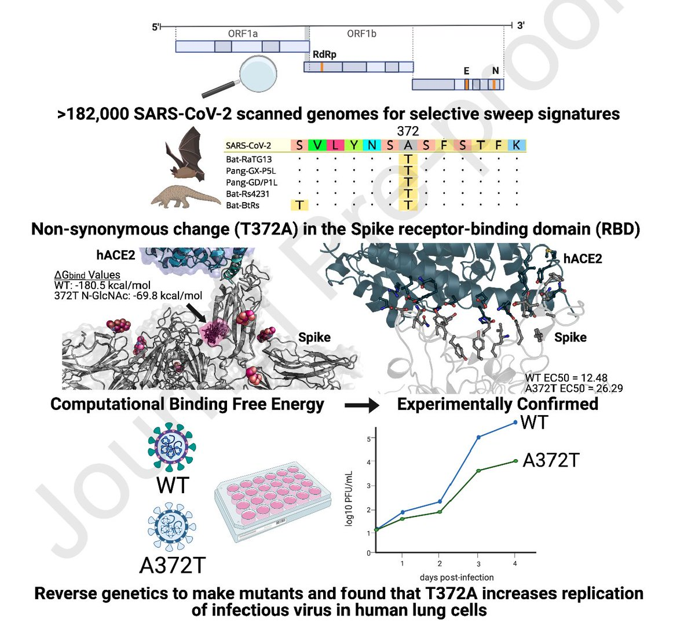</img></a><a href="E5nsvqdXMAUPcRj.jpg"  >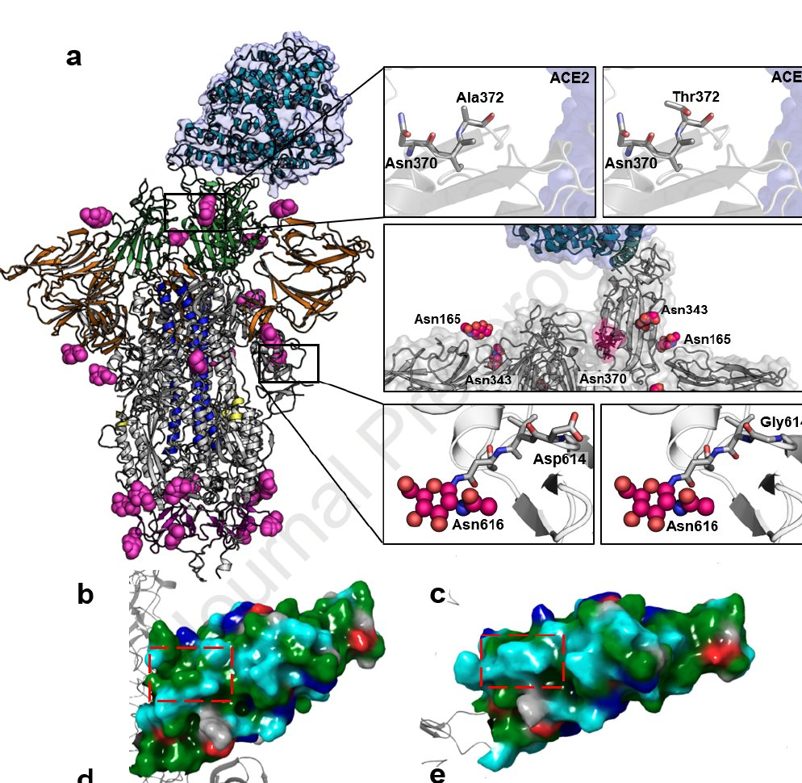</img></a>

---

<a href="https://twitter.com/erictopol/status/1412438037682819077" target="_blank" rel="noreferer">15:47 UCT</a>

To try &amp; stay ahead of the Delta variant, it's important to test more, not less, to isolate new cases, contact trace, prevent outbreaks
Rate of testing (@OurWorldinData)
UK 3,415/1000 people
Israel 2,100/1000 people
US 1,419/ 1000 people
(testing has been trending down as +⬆️) 

<a href="E5n8IykUcAQ9szX.jpg"  >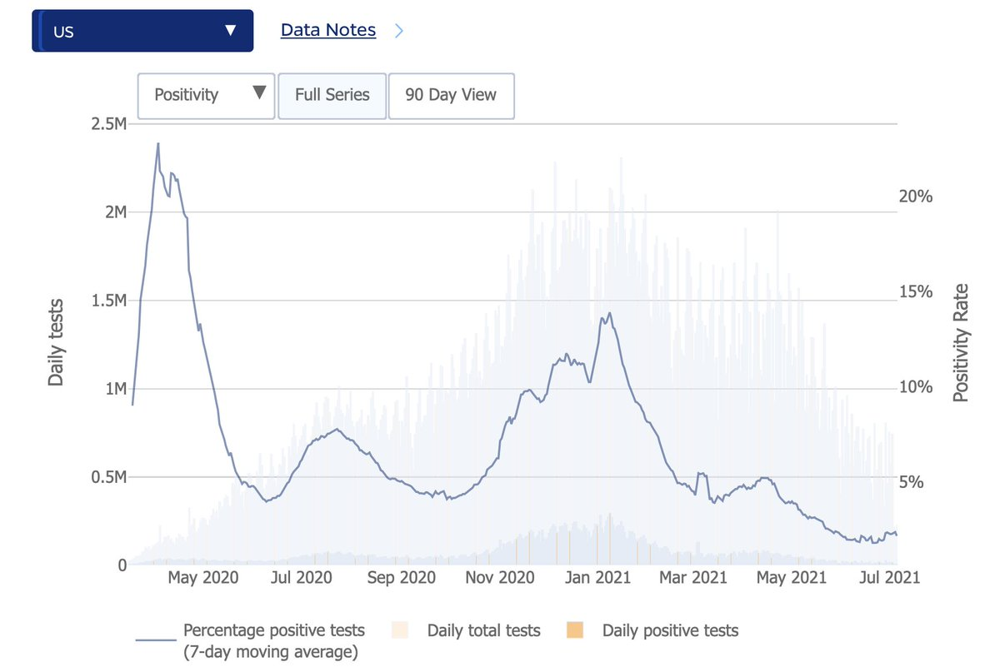</img></a>

---

<a href="https://twitter.com/erictopol/status/1412440349784428546" target="_blank" rel="noreferer">15:56 UCT</a>

Who among the health care workforce are at highest risk for covid infections? A large study from Italy of &gt;140,000 HCW https://jamanetwork.com/journals/jamanetworkopen/fullarticle/2781622 @JAMANetworkOpen by @polettipiero and colleagues 

<a href="E5n-gvoVkAkR0cA.jpg"  >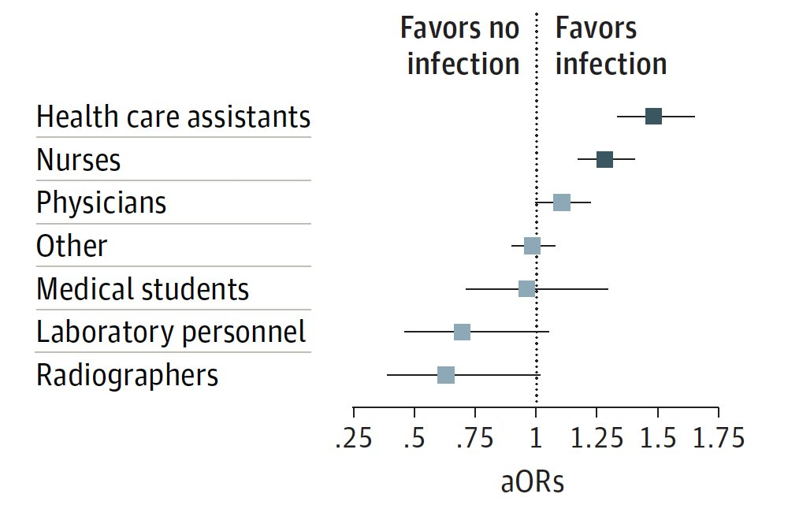</img></a><a href="E5n-i1lUcAYX_UV.jpg"  >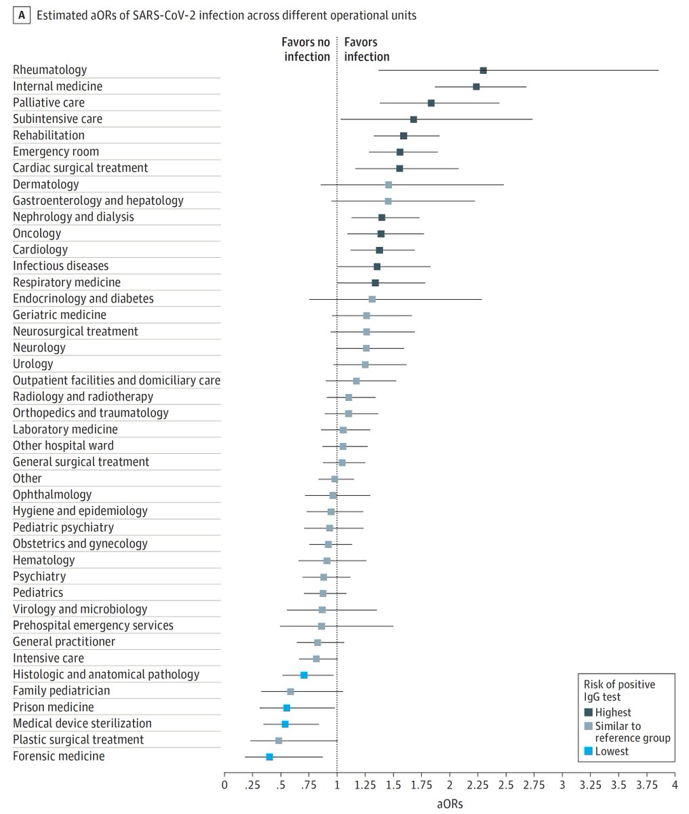</img></a>

---

<a href="https://twitter.com/erictopol/status/1412445812634750980" target="_blank" rel="noreferer">16:18 UCT</a>

While Arkansas leads the US Delta case and hospitalization rise, Florida has now joined the mix as #3 state 

<a href="E5oD4l7VgAolThS.jpg"  >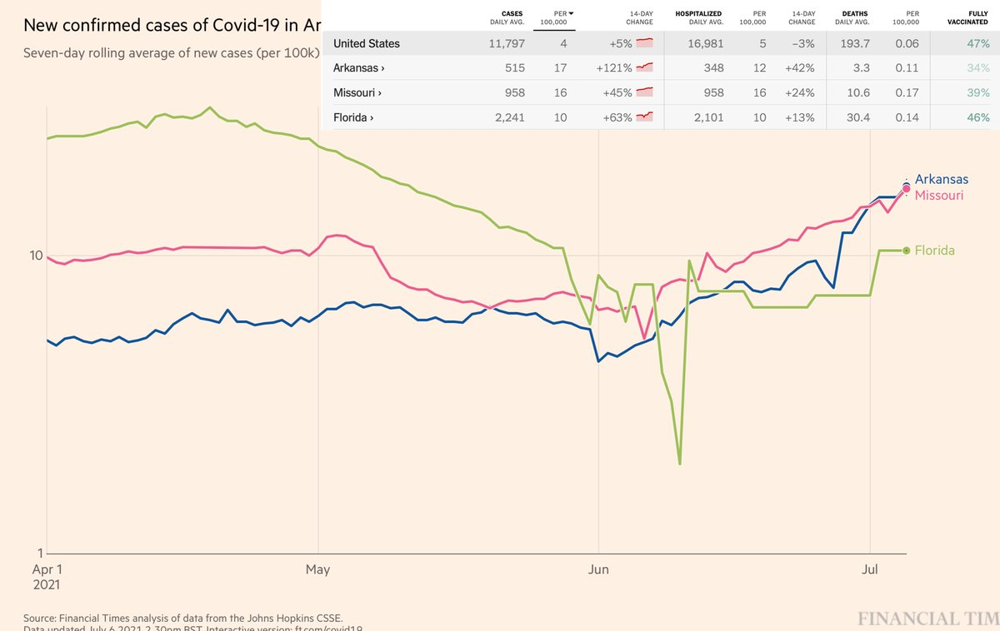</img></a>

---

<a href="https://twitter.com/erictopol/status/1412451511087497217" target="_blank" rel="noreferer">16:40 UCT</a>

Today's @CDCMMWR report with the Table that breaks it down for benefit to risk, by age group and sex https://www.cdc.gov/mmwr/volumes/70/wr/mm7027e2.htm?s_cid=mm7027e2_w  https://twitter.com/EricTopol/status/1411820173464461312

<a href="E5oJCjKVIAAH2bw.png"  >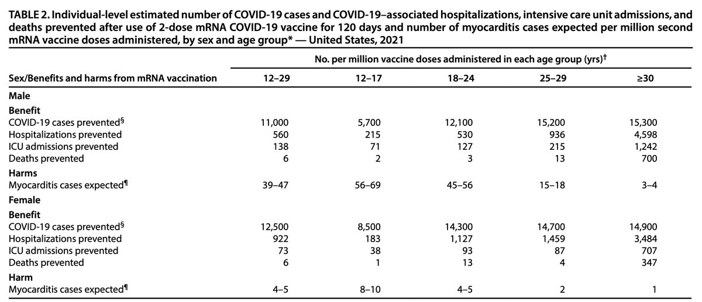</img></a>

---

<a href="https://twitter.com/erictopol/status/1412464915852394496" target="_blank" rel="noreferer">17:34 UCT</a>

Although Delta (B.1.617.2) is dominant in the US at 53% now, there is marked heterogeneity between states
Latest data http://outbreak.info
Missouri &gt;90%
Arkansas &gt;80%
Nevada ~80%
Utah ~70%
Florida 25% 

<a href="E5oVTkXUUAUUxVX.jpg"  >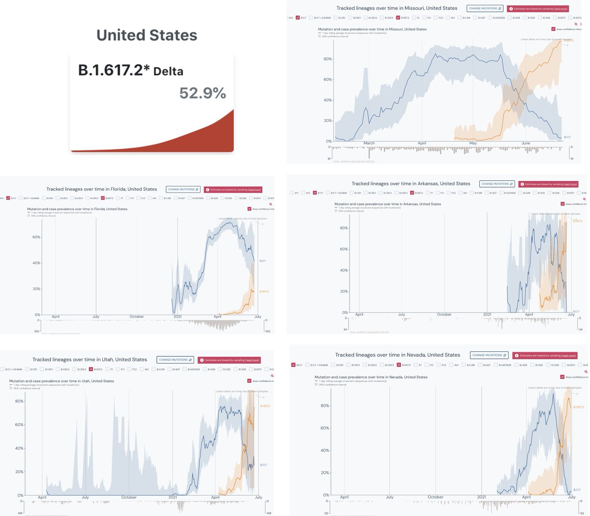</img></a>

---

<a href="https://twitter.com/erictopol/status/1412485858406457347" target="_blank" rel="noreferer">18:57 UCT</a>

After &gt;18 months, it amazes me that people still think a rise in cases is an innocuous "casedemic," negating:
—#LongCovid occurs in 10-30% of cases
—Cases = infections and beget more cases
—They inevitably lead to more hospitalizations and deaths, although &lt;&lt; pre-💉levels

---

<a href="https://twitter.com/erictopol/status/1412500833489457152" target="_blank" rel="noreferer">19:56 UCT</a>

Important context, analysis issues regarding yesterday's Israel MoH report of a drop in vaccination effectiveness for Delta infections. It's still uncertain.
Both from @nataliexdean and @ShalitUri 👇 https://twitter.com/nataliexdean/status/1412498386683514882

---

<a href="https://twitter.com/erictopol/status/1412517951563919362" target="_blank" rel="noreferer">21:04 UCT</a>

RT @drninashapiro: @EricTopol And more cases will beget more variants…

---

<a href="https://twitter.com/erictopol/status/1412523068900057089" target="_blank" rel="noreferer">21:25 UCT</a>

Good news on Israel today, holding up to Delta &gt;90%
427 cases (496 yesterday)
No deaths (that's 13 of 14 days with zero)

---

<a href="https://twitter.com/erictopol/status/1412559031177121792" target="_blank" rel="noreferer">23:48 UCT</a>

Finally the @CDCgov is posting current Delta variant data, has US at 52% as of 3 July.
https://covid.cdc.gov/covid-data-tracker/#variant-proportions 

<a href="E5pqQk_VcAAnkCc.jpg"  >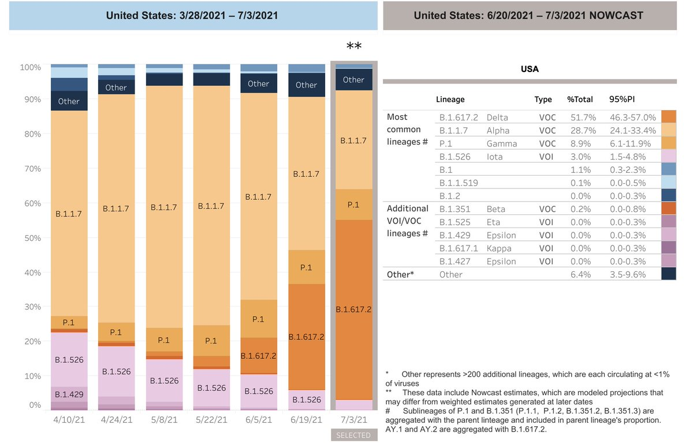</img></a>