+++
title = "Tweets by Eric Topol July 09"
Summary = ""
tags = ["Twitter"]
category = "Twitter"
+++

---

<a href="https://twitter.com/erictopol/status/1413304993742872577" target="_blank" rel="noreferer">01:12 UCT</a>

Good to see the @US_FDA and @CDCgov weigh in on this @Pfizer annoucement H/T @sciencecohen 
https://twitter.com/PeterSullivan4/status/1413297642566791170

---

<a href="https://twitter.com/erictopol/status/1413329669454143490" target="_blank" rel="noreferer">02:50 UCT</a>

A few weeks ago, every US state was heading in right direction. Then things changed, abruptly. Many with  hospitalizations rising (15 in double digit %).
The Alpha variant bump  in the US was largely confined to Michigan. This Delta one is looking more diffuse. 

<a href="E50m3EoVcAQWTwv.jpg"  >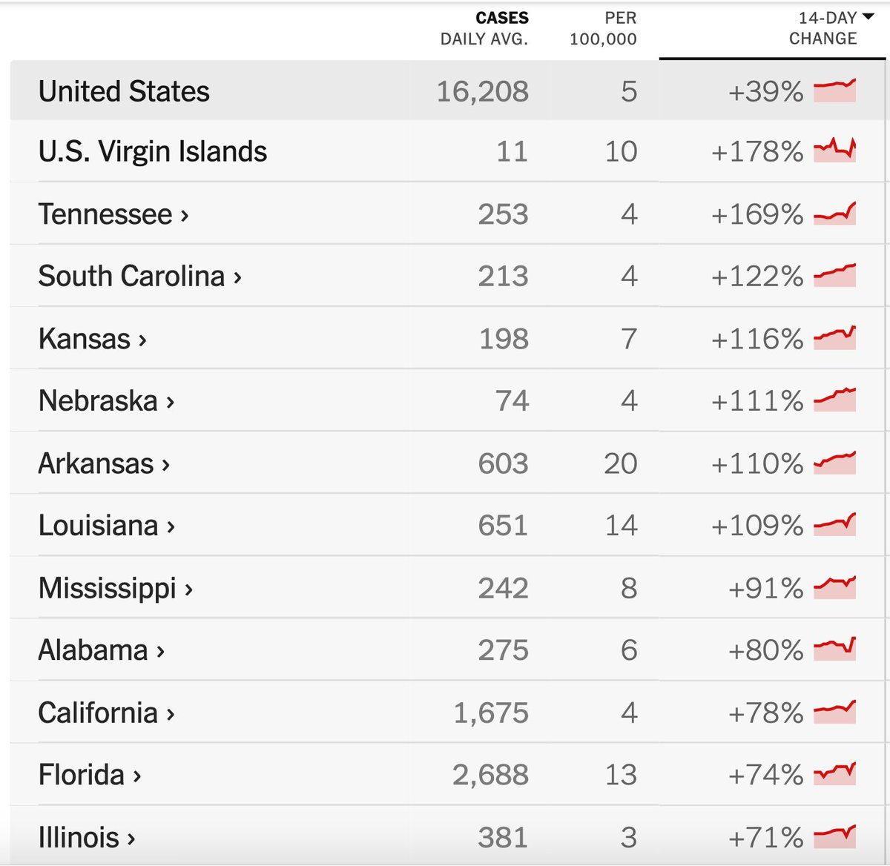</img></a>

---

<a href="https://twitter.com/erictopol/status/1413477751550398475" target="_blank" rel="noreferer">12:38 UCT</a>

What's bigger news than the Delta variant? ;-)
Here in San Diego, the hometown Padres relief pitcher's first ever career hit is a grand slam 

<a href="E52uI5_VEAEnrMn.jpg"  ></img></a>

---

<a href="https://twitter.com/erictopol/status/1413481507600011264" target="_blank" rel="noreferer">12:53 UCT</a>

Just published @NatureMedicine 
A large Qatar @moderna_tx vaccine effectiveness study shows how well protection holds up to the Gamma and Beta variants, 2-doses 96-100% vs severe illness
https://www.nature.com/articles/s41591-021-01446-y 

<a href="E52x3pFVIAcxy0e.jpg"  >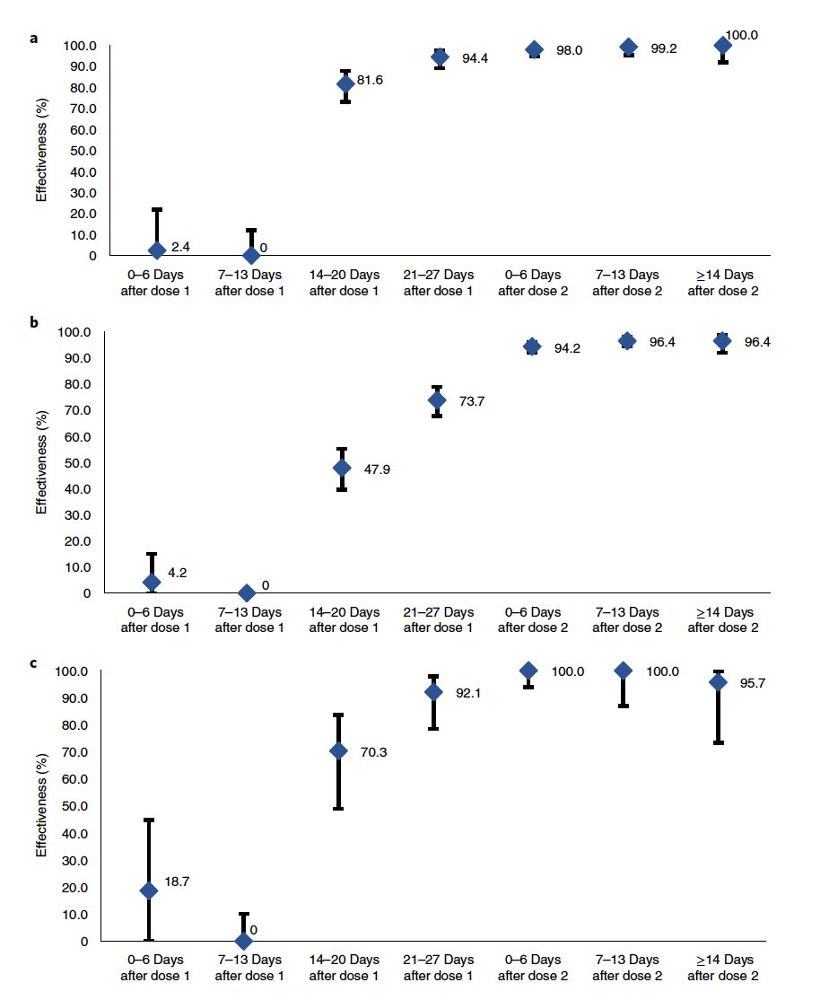</img></a>

---

<a href="https://twitter.com/erictopol/status/1413483794535915525" target="_blank" rel="noreferer">13:02 UCT</a>

Summary @FT of vaccine effectiveness, AZ &amp; mRNA, against Delta in multiple reported studies. The Israel MoH is an outlier. The others all show high levels of protection with 2 doses vs severe illness; mRNA vs infection ~85-90%
https://www.ft.com/content/5a24d39a-a702-40d2-876d-b12a524dc9a5 @donatopmancini @jburnmurdoch 

<a href="E52yzdHUcAA0drn.jpg"  >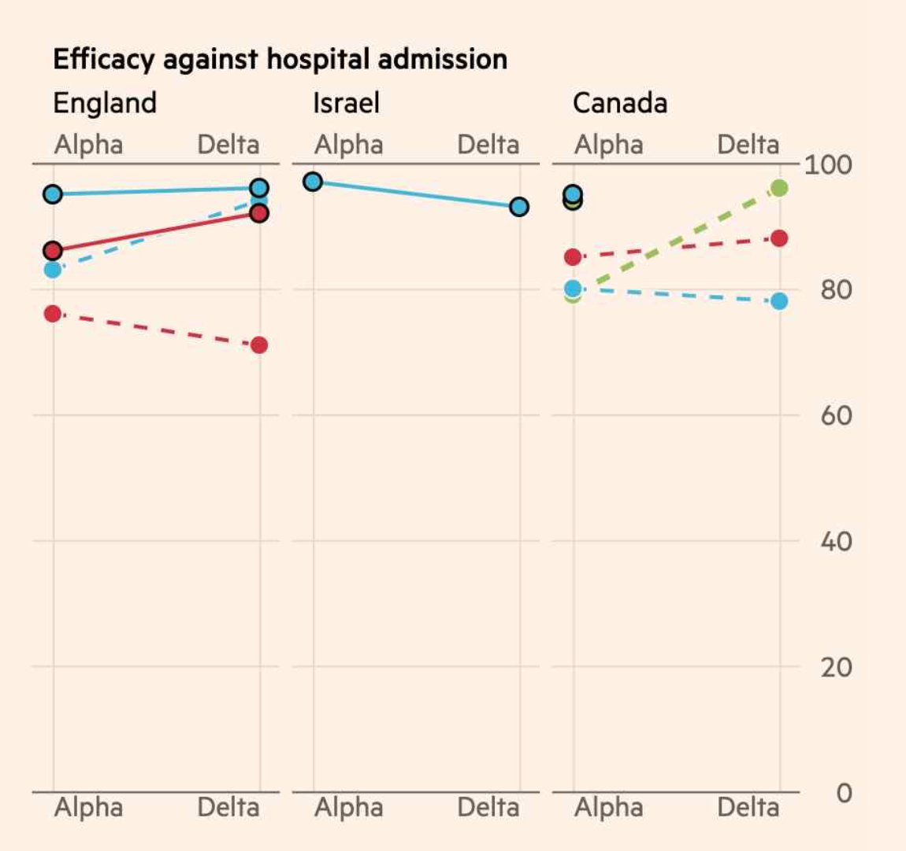</img></a><a href="E52yjlfVIAMia71.jpg"  >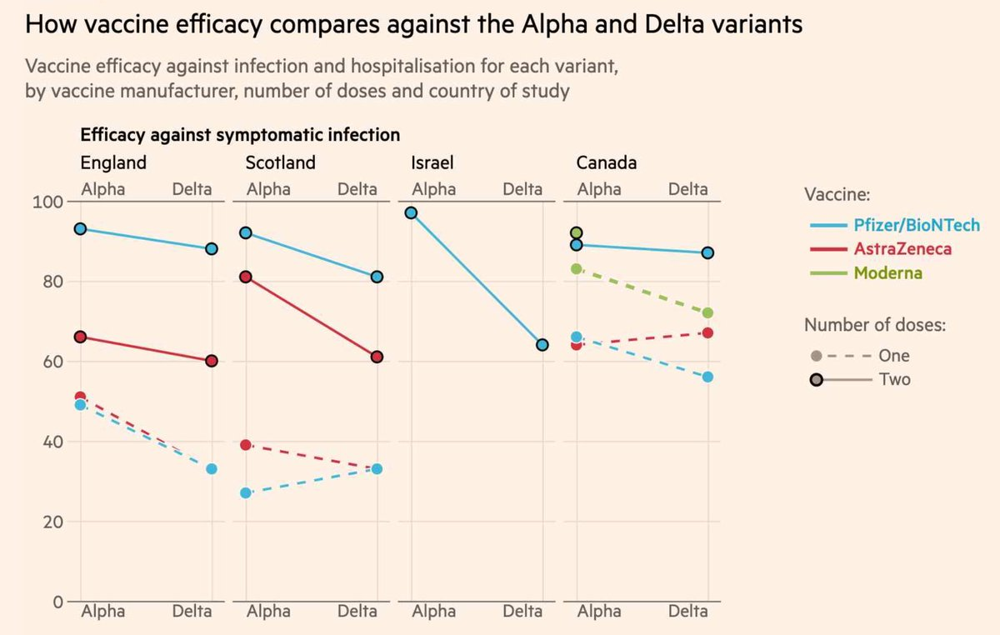</img></a>

---

<a href="https://twitter.com/erictopol/status/1413493440751431687" target="_blank" rel="noreferer">13:41 UCT</a>

The new @PHE_Uk report today
https://assets.publishing.service.gov.uk/government/uploads/system/uploads/attachment_data/file/1000678/Variants_of_Concern_VOC_Technical_Briefing_18.pdf
Good to see Delta's secondary attack rate (an indicator of transmissibility) has continued to drop and now similar to that of Alpha 

<a href="E528tkcUUAIVZhL.jpg"  >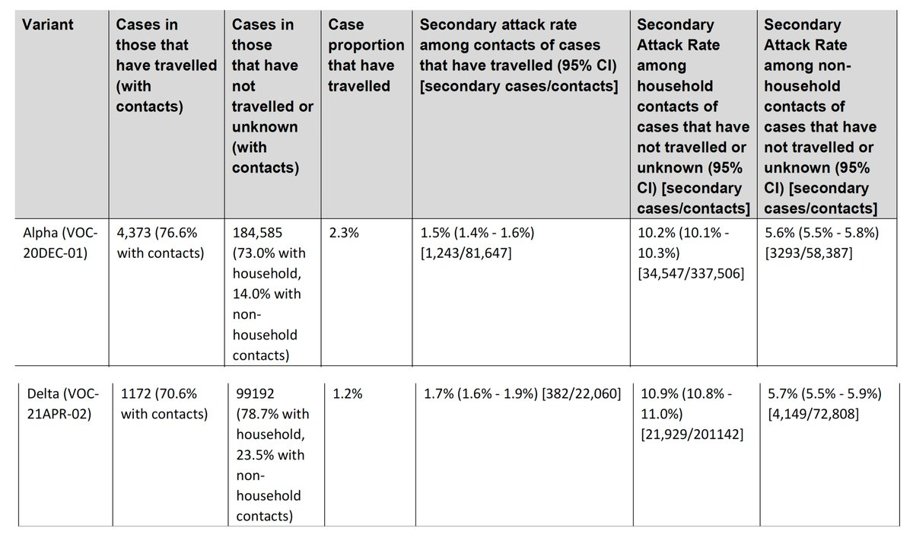</img></a>

---

<a href="https://twitter.com/erictopol/status/1413506194451288066" target="_blank" rel="noreferer">14:31 UCT</a>

Part of the challenge that Delta presents may be tied to this finding
The variant's viral load ~1,000X higher than previous strains (reflected by low CTs), more infectious in the early stages of the illness
https://virological.org/t/viral-infection-and-transmission-in-a-large-well-traced-outbreak-caused-by-the-delta-sars-cov-2-variant/724 

<a href="E53HuYRUcAQ4osv.png"  >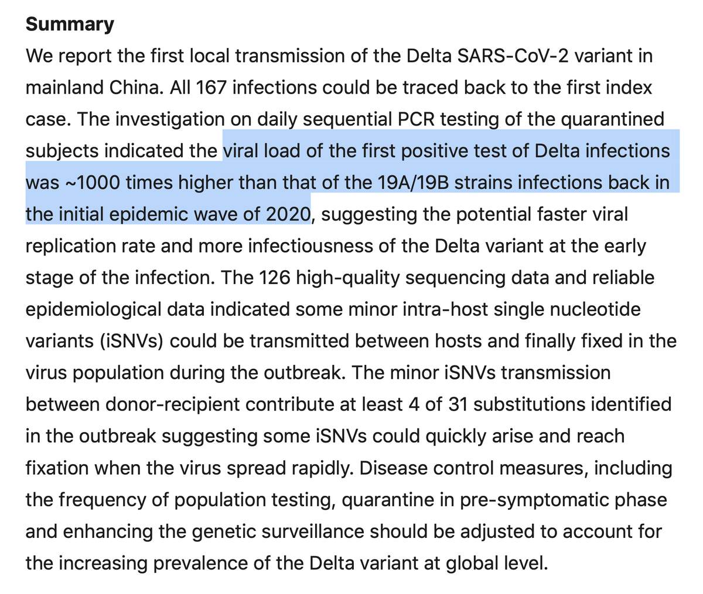</img></a><a href="E53Hv4vUcAEkcWo.jpg"  >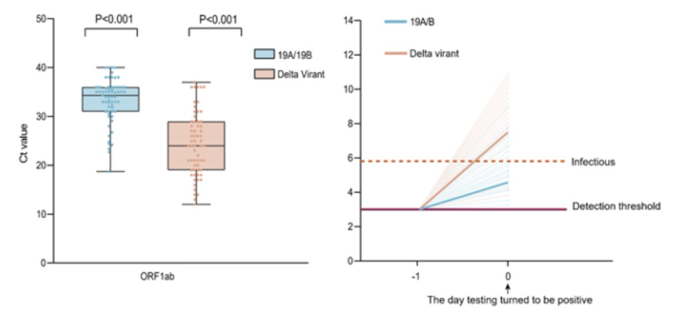</img></a>

---

<a href="https://twitter.com/erictopol/status/1413513168828080128" target="_blank" rel="noreferer">14:59 UCT</a>

The 3rd wave in South Africa, along with many other neighboring countries (especially Namibia), is the worst yet, attributable to the Delta variant, and without the US and international support that it desperately needs 

<a href="E53OXfMUUAI2BgO.jpg"  >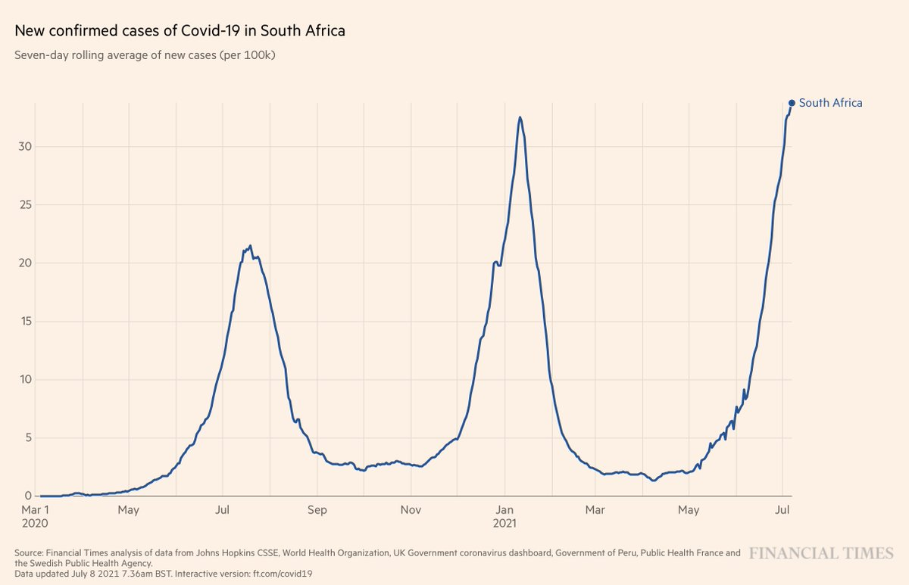</img></a>

---

<a href="https://twitter.com/erictopol/status/1413515595904000001" target="_blank" rel="noreferer">15:09 UCT</a>

New @CDCMMWR report of a Delta variant outbreak in a gymnastic facility, back in April/May: 47 infections; 91% among non-vaccinated or partially vaccinated; mostly in young and only 2 severe
https://www.cdc.gov/mmwr/volumes/70/wr/mm7028e2.htm?s_cid=mm7028e2_w 

<a href="E53QqEWUUAAwZxs.png"  >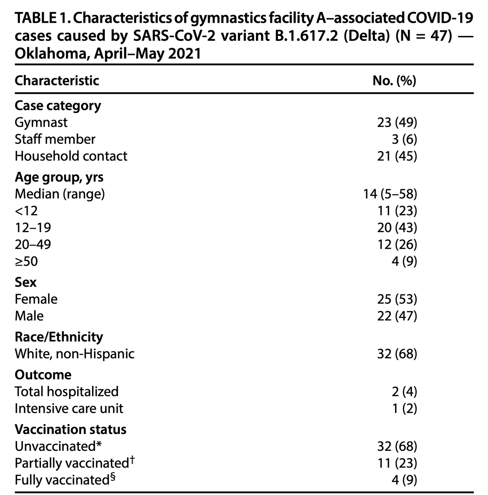</img></a>

---

<a href="https://twitter.com/erictopol/status/1413523131784851462" target="_blank" rel="noreferer">15:39 UCT</a>

The US covid fatalities, which have steadily declined for months, are starting to climb again. % Delta shown, and trends in death rates for 3 countries
Fully vaccinated adults 
US 59%
UK 62%
Israel 85%
(graph at right shows timing for total population) 

<a href="E53XSXgUYAcVFPc.jpg"  >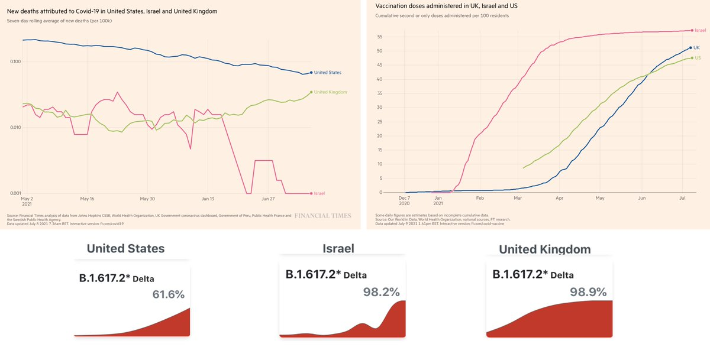</img></a>

---

<a href="https://twitter.com/erictopol/status/1413537810296950786" target="_blank" rel="noreferer">16:37 UCT</a>

Also the case fatality rate for Delta continues to lessen, 0.2% compared with 1.9% Alpha, predominantly due to younger people getting infected. There are NO data to suggest Delta is more deadly than prior virus strains. 

<a href="E53kxgaVIAoXBFy.jpg"  >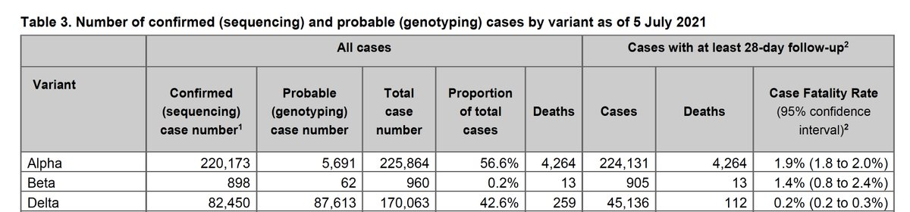</img></a>

---

<a href="https://twitter.com/erictopol/status/1413542264014479361" target="_blank" rel="noreferer">16:55 UCT</a>

The @US_FDA responds today to my @nytopinion essay asking for full approval of mRNA vaccines
https://www.nytimes.com/2021/07/09/opinion/letters/fda-covid-vaccines.html
oped https://www.nytimes.com/2021/07/01/opinion/fda-vaccines-full-approval.html
The message "get vaccinated right now" would really work well when full approval was granted 

<a href="E53orcBVoAQwQcO.jpg"  ></img></a><a href="E53os3JUYAIDVcb.jpg"  >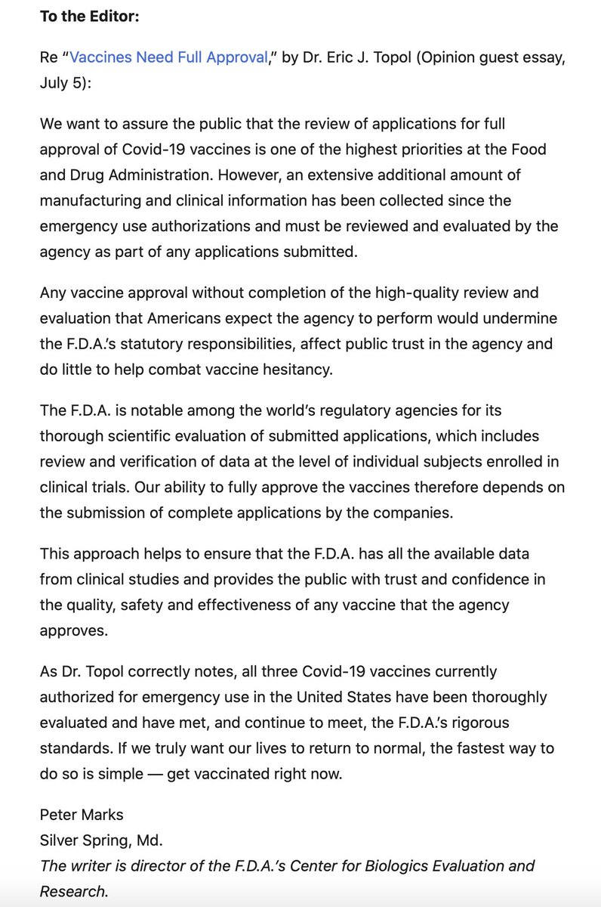</img></a>

---

<a href="https://twitter.com/erictopol/status/1413543252272181250" target="_blank" rel="noreferer">16:59 UCT</a>

@Tuliodna Sure, Tulio, can you send me that data?

---

<a href="https://twitter.com/erictopol/status/1413580463893991427" target="_blank" rel="noreferer">19:27 UCT</a>

RT @JamesSurowiecki: The FDA says all three vaccines have been "thoroughly evaluated" and "meet the FDA's rigorous standards," but also say…

---

<a href="https://twitter.com/erictopol/status/1413593695060860929" target="_blank" rel="noreferer">20:19 UCT</a>

Time for 1001 https://twitter.com/EricTopol/status/1411693840767995905

---

<a href="https://twitter.com/erictopol/status/1413602438322409475" target="_blank" rel="noreferer">20:54 UCT</a>

When was the last time a company announced it would file an EUA (@Pfizer, vaccine booster) and there was a coordinated @CDCgov—@US_FDA response that no booster is needed, all within 3 hours?
Never.
https://www.washingtonpost.com/health/2021/07/09/pfizer-booster-shots-hhs/ by @Carolynyjohnson

---

<a href="https://twitter.com/erictopol/status/1413607417720446978" target="_blank" rel="noreferer">21:14 UCT</a>

You can't make this stuff up.
Meanwhile, the @US_FDA Center of Biologics staff (same division as vaccines and monoclonal antibodies) could have been helping to get the BLA review of the vaccines for full approval 

<a href="E54jtjYUUAQ30ic.jpg"  >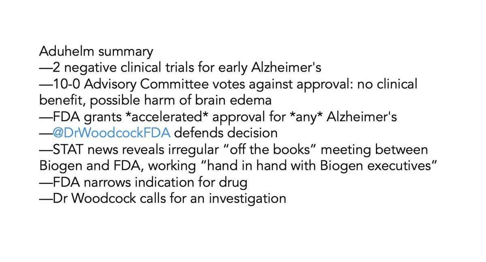</img></a>

---

<a href="https://twitter.com/erictopol/status/1413611075300331524" target="_blank" rel="noreferer">21:28 UCT</a>

@ZivGanOr @US_FDA They requested it but only FDA sets indications

---

<a href="https://twitter.com/erictopol/status/1413613598476177409" target="_blank" rel="noreferer">21:38 UCT</a>

One way #SARSCoV2 can achieve immune evasiveness is via its nucleocapsid protein and MAVS, inhibiting our innate immunity, 1st line of defense (type 1 interferon)
https://www.nature.com/articles/s41556-021-00712-y @NatureCellBio by @laoneill111 and colleagues 

<a href="E54payLUcAAo473.jpg"  >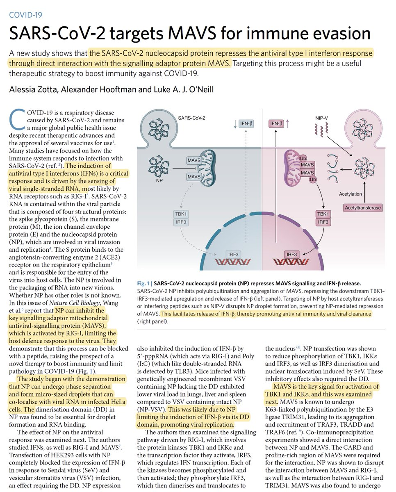</img></a><a href="E54pdYTVoAQ0mlW.jpg"  >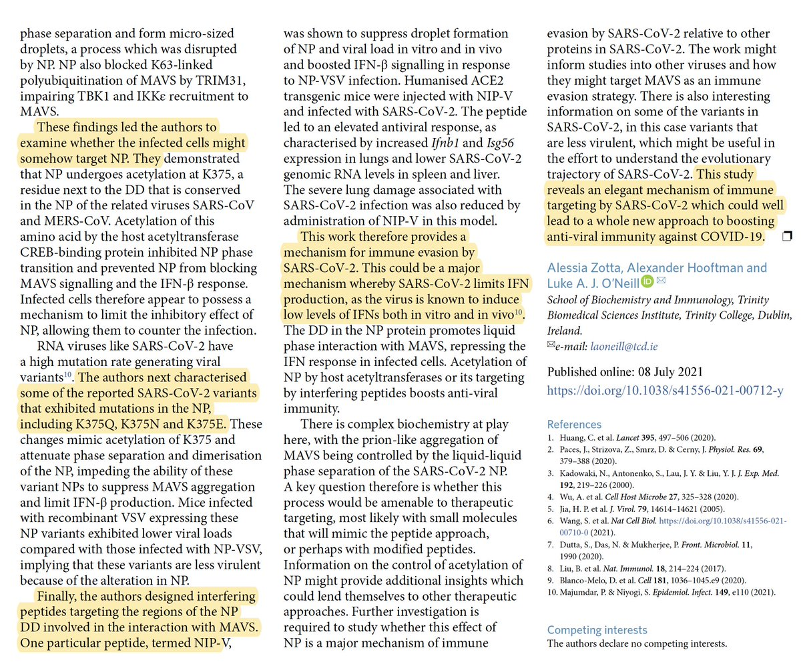</img></a>