+++
title = "Tweets by Eric Topol July 10"
Summary = ""
tags = ["Twitter"]
category = "Twitter"
+++

---

<a href="https://twitter.com/erictopol/status/1413705652984188928" target="_blank" rel="noreferer">03:44 UCT</a>

Hoping that Arkansas is not representative for where US is headed for Delta's impact
Highest in US cases 23/100,000, &gt;20% test positivity, hospitalizations up 44% past 2 weeks, deaths increasing, near lowest vaccinated state at 35% 2-doses
https://coronavirus.jhu.edu/testing/individual-states/arkansas 

<a href="E5584FQVUAkNaV5.jpg"  >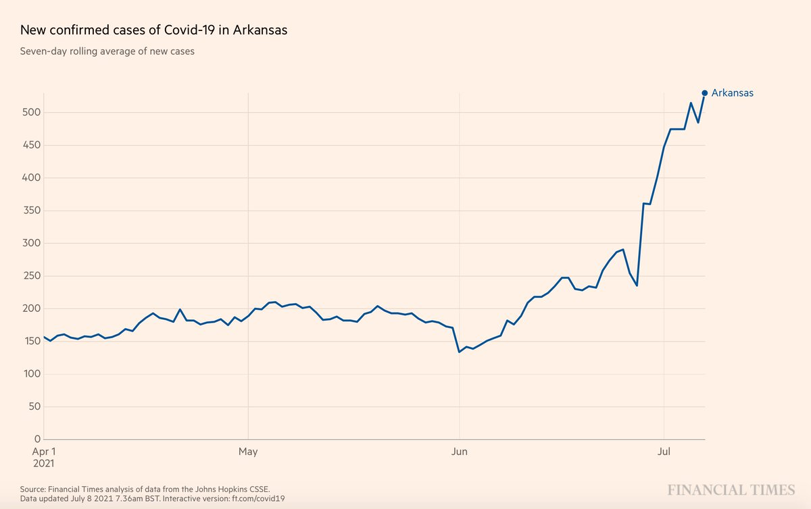</img></a><a href="E558579VkAE43SO.jpg"  >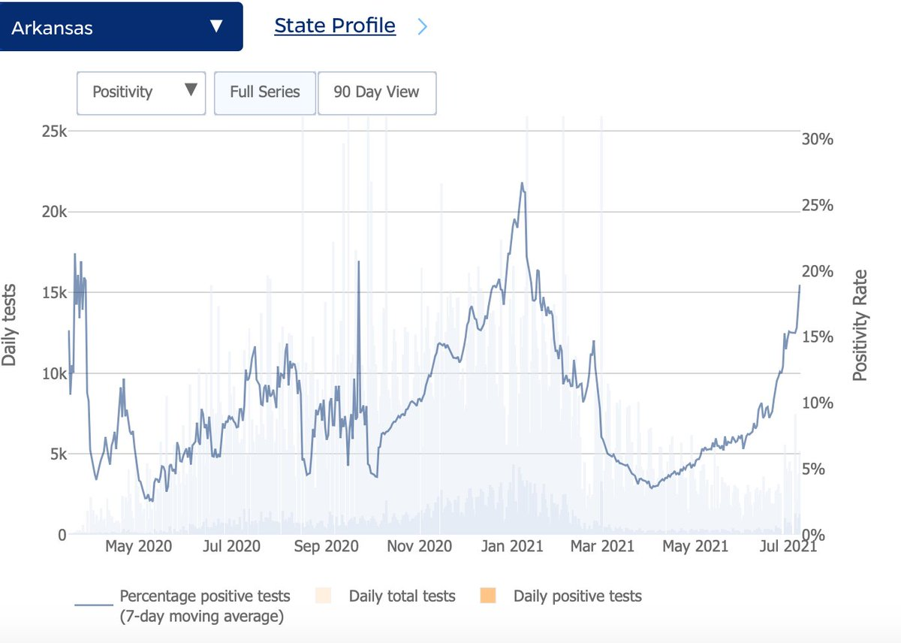</img></a>

---

<a href="https://twitter.com/erictopol/status/1413869722664247301" target="_blank" rel="noreferer">14:36 UCT</a>

RT @paulg: Fitbit data showed it took "79 days, on average" for people's resting heart rates to return to normal after catching Covid-19.…

---

<a href="https://twitter.com/erictopol/status/1413881307608719364" target="_blank" rel="noreferer">15:22 UCT</a>

2 countries with &gt;95% Delta variant have thus far maintained containment, have few if any deaths (Israel 2 in &gt;2 weeks, Singapore 0), with high rates of vaccination, nearly all mRNA 

<a href="E58dgLGVoAM_pSM.jpg"  >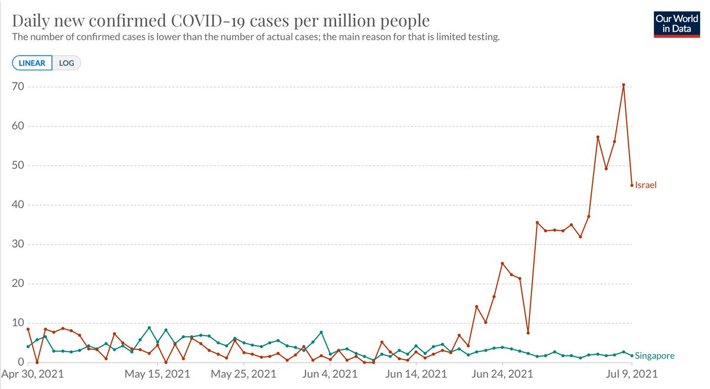</img></a><a href="E58cvmRVgAc5gB5.jpg"  >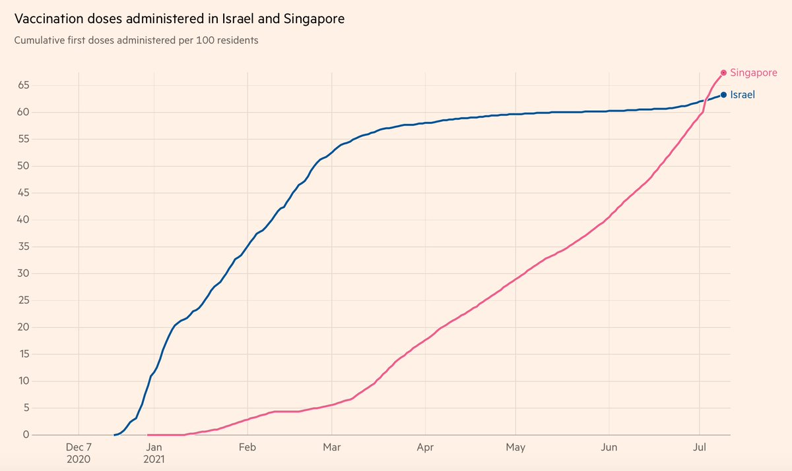</img></a>

---

<a href="https://twitter.com/erictopol/status/1413889144011382791" target="_blank" rel="noreferer">15:53 UCT</a>

The UK's reopening dilemma https://www.ft.com/content/9d7c5a19-c717-4809-a087-92571979c878 by @clivecookson @GeorgeWParker 
with @EckerleIsabella @GuptaR_lab @doctor_oxford 

<a href="E58jcKbUUAIbUZ_.jpg"  >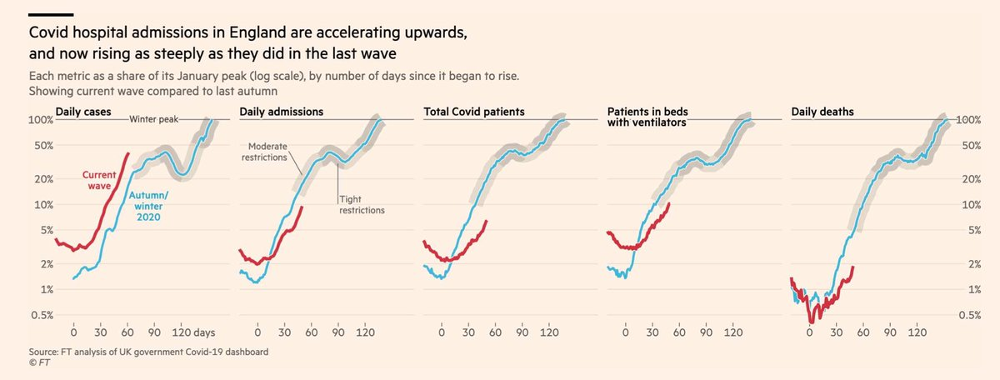</img></a>

---

<a href="https://twitter.com/erictopol/status/1413905227686703110" target="_blank" rel="noreferer">16:57 UCT</a>

Seeing and quantifying #SARSCoV2 spike protein binding to ACE2 receptor in live cells
https://www.cell.com/cell-chemical-biology/fulltext/S2451-9456(21)00307-X
New @CellChemBiol 

<a href="E58y5zrUYAIqelV.jpg"  >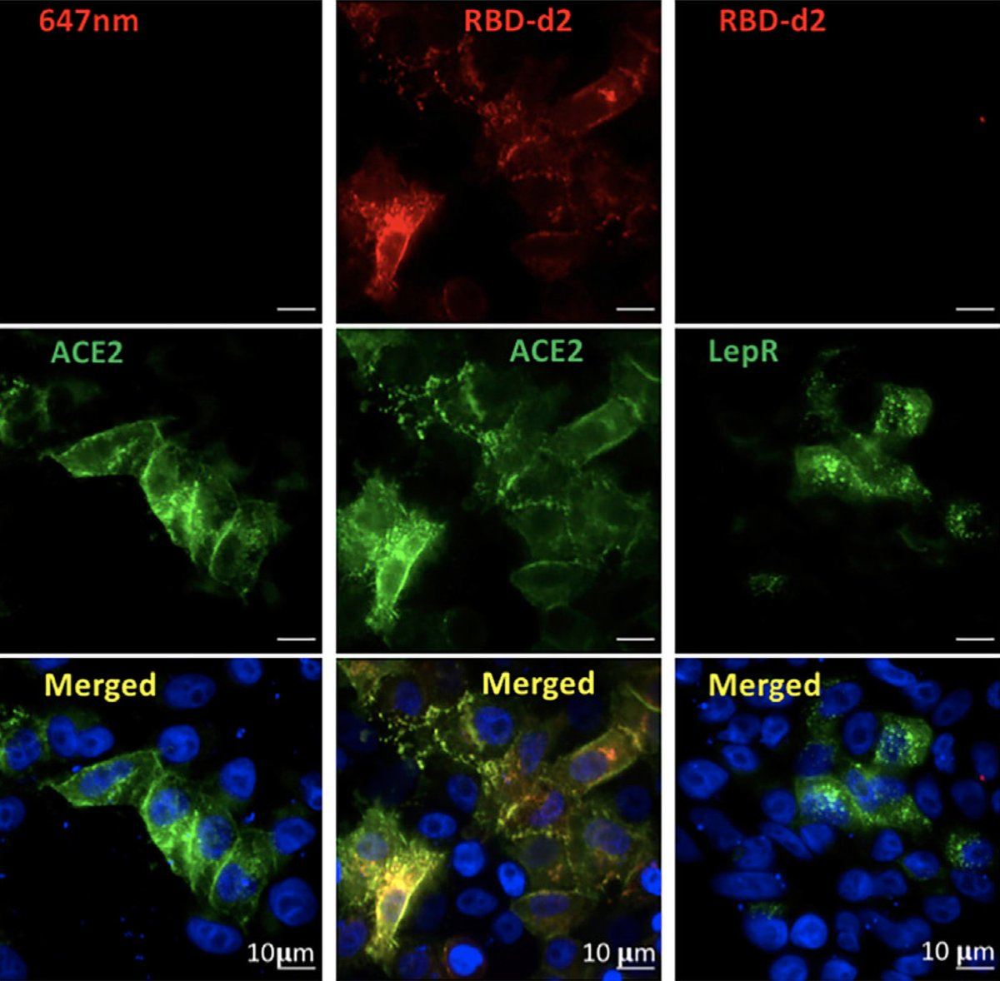</img></a>

---

<a href="https://twitter.com/erictopol/status/1413910228911886341" target="_blank" rel="noreferer">17:17 UCT</a>

The Delta variant is spreading throughout Western Europe but the rise in cases in not well correlated with its prevalence. The Netherlands, for example, has a steep ascent, but 24% Delta.
@OurWorldInData 

<a href="E583jrXVkAMViFS.jpg"  >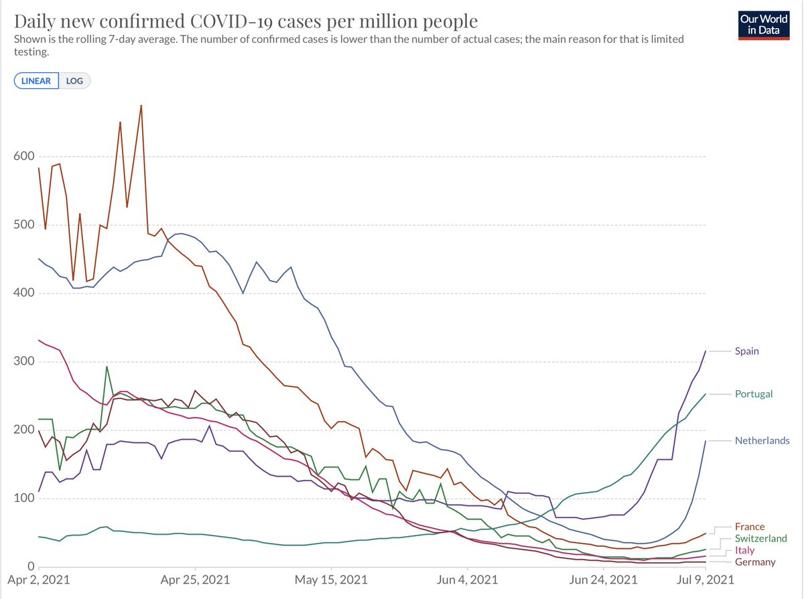</img></a><a href="E583sb7UYAATKH6.jpg"  >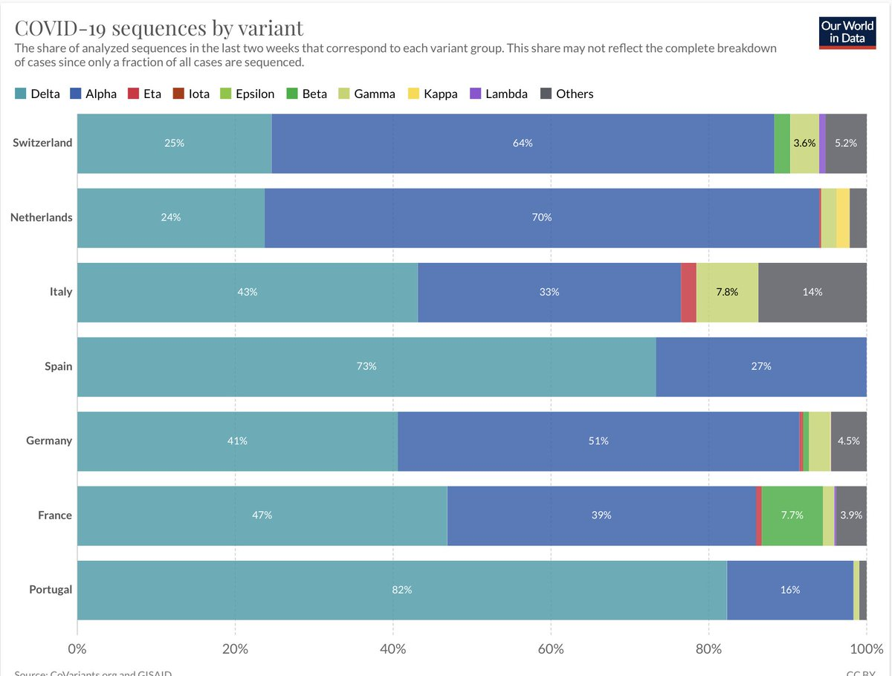</img></a>

---

<a href="https://twitter.com/erictopol/status/1413913780656906244" target="_blank" rel="noreferer">17:31 UCT</a>

Good figure to show the mutations in Delta that differ from the other major variants (Alpha, Beta, Gamma). T478K in the receptor binding domain, P681R at S1/S2 and multiple in N-terminal domain thought to be key
from https://www.nature.com/articles/s41586-021-03792-w @Nature 

<a href="E586ZSMVoAEXols.jpg"  >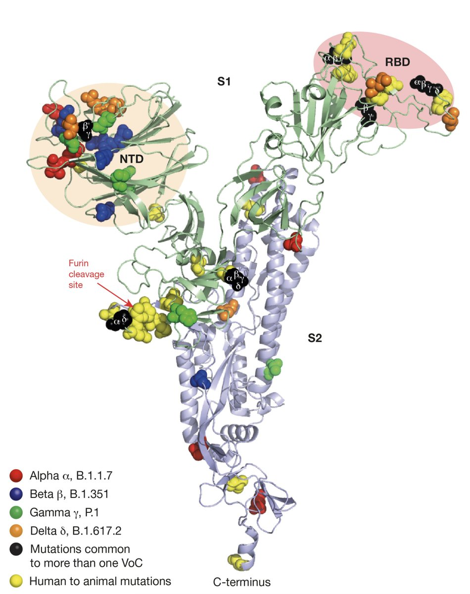</img></a>

---

<a href="https://twitter.com/erictopol/status/1413915448643506178" target="_blank" rel="noreferer">17:38 UCT</a>

More up-to-date data at http://outbreak.info has the Netherlands at 60% Delta. But there Germany is also at ~60% with little rise in cases to date. 

<a href="E587-RBVoAAgSEV.jpg"  >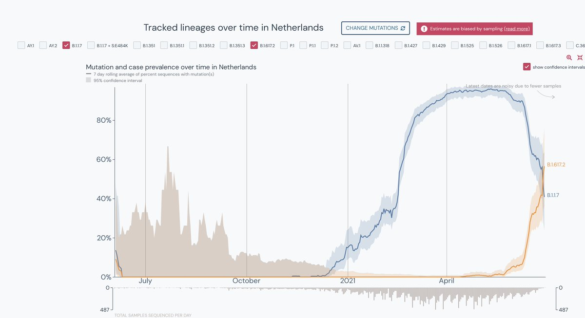</img></a>

---

<a href="https://twitter.com/erictopol/status/1413917224947970055" target="_blank" rel="noreferer">17:45 UCT</a>

Big implications for accelerating global vaccinations
https://www.nature.com/articles/d41586-021-01893-0 @Nature by @ElieDolgin w/ @SarahCobey @profshanecrotty 
https://twitter.com/bencowling88/status/1412202994192420868 

<a href="E58-Kx5VcAAyB-L.jpg"  >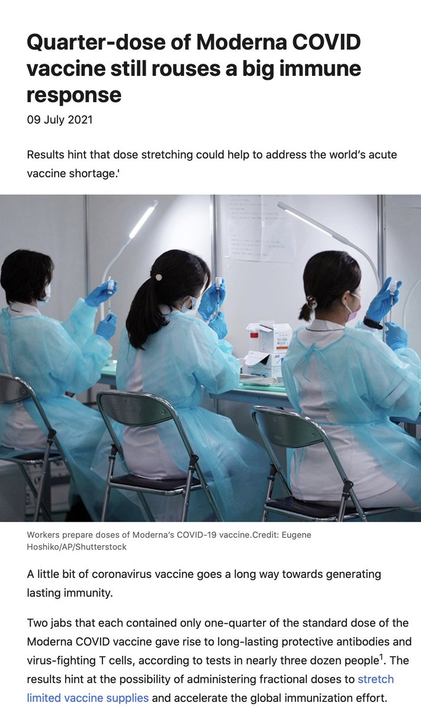</img></a>

---

<a href="https://twitter.com/erictopol/status/1413919810098929665" target="_blank" rel="noreferer">17:55 UCT</a>

A fun conversation with @Robert_Graboyes that we just had on covid, technology, #AI, US healthcare and the patient-doctor relationship https://www.discoursemagazine.com/culture-and-society/2021/07/09/fortress-and-frontier-healthcares-reluctant-revolution/ with transcript @mercatus

---

<a href="https://twitter.com/erictopol/status/1413925899443916800" target="_blank" rel="noreferer">18:19 UCT</a>

The level of neutralizing antibodies induced by covid vaccines correlates with protection from symptomatic infection, 2 important papers with independent replication
https://www.sciencedirect.com/science/article/pii/S0264410X21006587?via%3Dihub
https://www.nature.com/articles/s41591-021-01377-8
@NatureMedicine 1/2 

<a href="E59EvyhVEAAn2fM.jpg"  ></img></a>

---

<a href="https://twitter.com/erictopol/status/1413925906221916162" target="_blank" rel="noreferer">18:19 UCT</a>

And @florian_krammer has an insightful perspective piece on the implications of these 2 reports, a first step towards a correlate of protection
https://www.nature.com/articles/s41591-021-01432-4 @NatureMedicine 

<a href="E59FTMnVEAEETcm.jpg"  >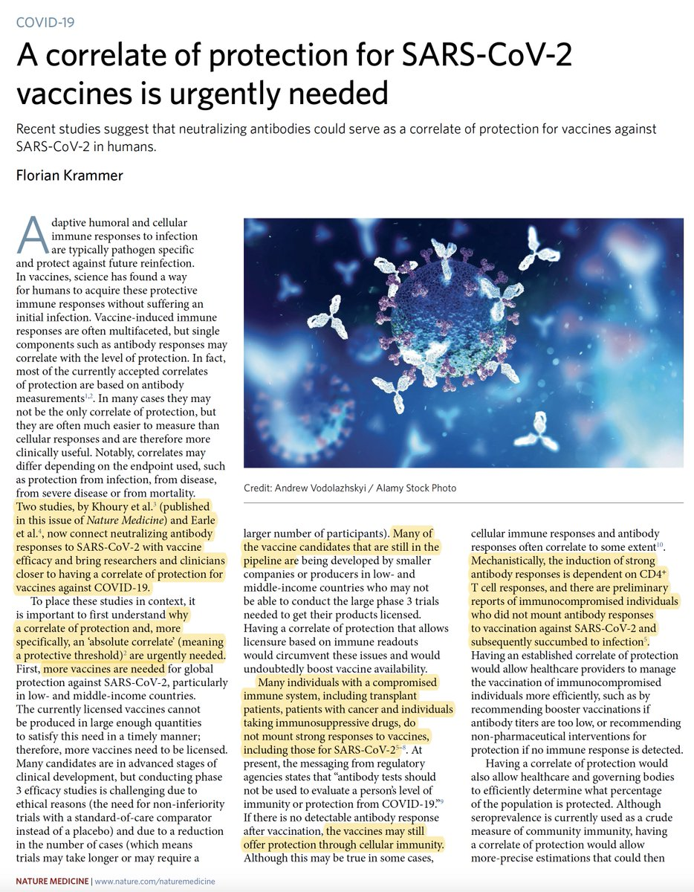</img></a><a href="E59FVljUcAAQAyK.jpg"  >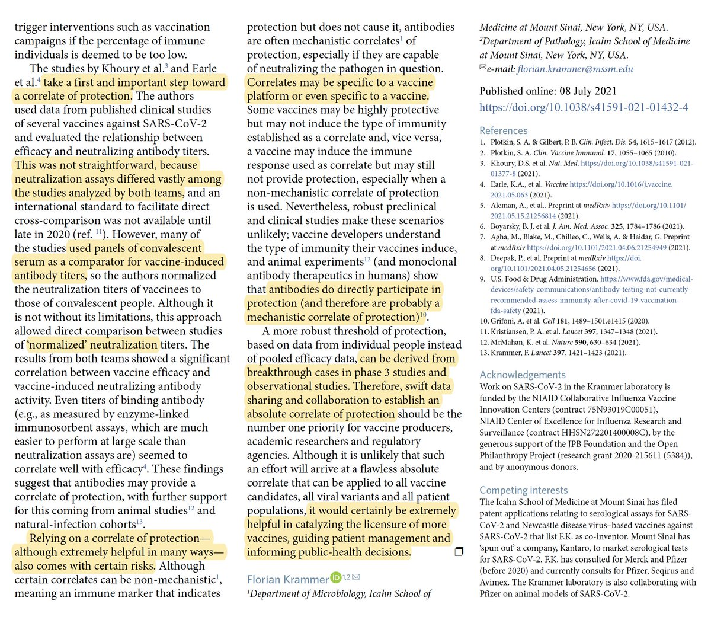</img></a>

---

<a href="https://twitter.com/erictopol/status/1413968623815647235" target="_blank" rel="noreferer">21:09 UCT</a>

#VaccinesWork vs Delta
A summary table I put together for vaccine protection from the Delta variant from publications and preprints.
5 vaccines—neutralizing antibodies well above threshold (lab studies) 
3 vaccines—clinical effectiveness
will update as more data becomes available 

<a href="E59qsFDUUAA26El.jpg"  >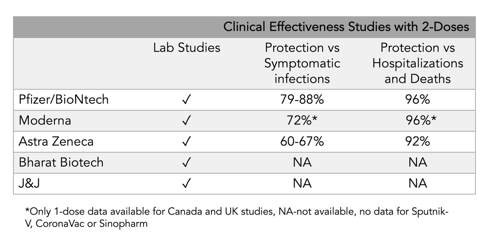</img></a>

---

<a href="https://twitter.com/erictopol/status/1413973382622715904" target="_blank" rel="noreferer">21:28 UCT</a>

@dr_kkjetelina where are the clinical effectiveness reports for J&amp;J?

---

<a href="https://twitter.com/erictopol/status/1413973883225448448" target="_blank" rel="noreferer">21:30 UCT</a>

@TWenseleers @OurWorldInData Thanks, Tom. The most updated data I could find was ~60% Delta from our tracking http://outbreak.info,  so this helps put it in perspective

---

<a href="https://twitter.com/erictopol/status/1413978802107998212" target="_blank" rel="noreferer">21:49 UCT</a>

@TWenseleers @OurWorldInData Right, I checked that against @OurWorldInData and it had the same low prevalence of Delta, 21.6% today
https://cov-spectrum.ethz.ch/explore/Netherlands/AllSamples/AllTimes/variants/json=%7B%22variant%22%3A%7B%22name%22%3A%22P.1%22%2C%22mutations%22%3A[]%7D%2C%22matchPercentage%22%3A1%7D 

<a href="E592I7iUUAIuh7u.jpg"  >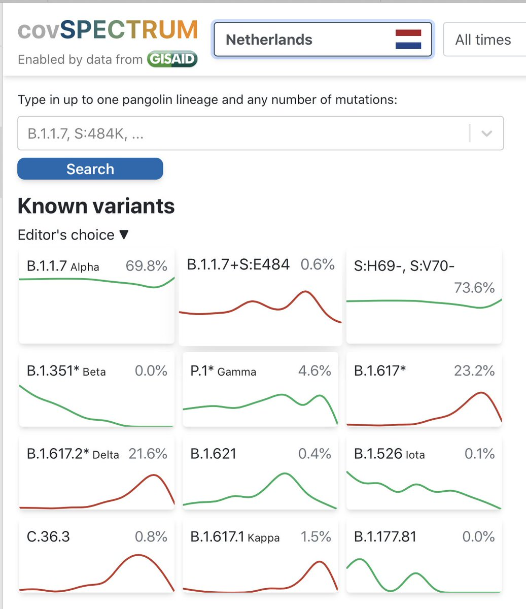</img></a>

---

<a href="https://twitter.com/erictopol/status/1413979912663310336" target="_blank" rel="noreferer">21:54 UCT</a>

July 10 update
 Israel: 388 cases without rise (prior days 611, 390) and 1 death
Singapore: 6 cases (prior days 16 and 10), no deaths

---

<a href="https://twitter.com/erictopol/status/1413987819622584320" target="_blank" rel="noreferer">22:25 UCT</a>

"No evidence so far suggests that the coronavirus is systematically evolving to become more malicious"
https://www.theatlantic.com/science/archive/2021/06/coronavirus-evolution-virulence/619301/ @KatherineJWu 
Many uncertainties in this preprint which suggests otherwise, such as no sequencing &amp; analytic issues rvw'd above https://www.medrxiv.org/content/10.1101/2021.07.05.21260050v1 

<a href="E598LPSUYAUu6WH.jpg"  >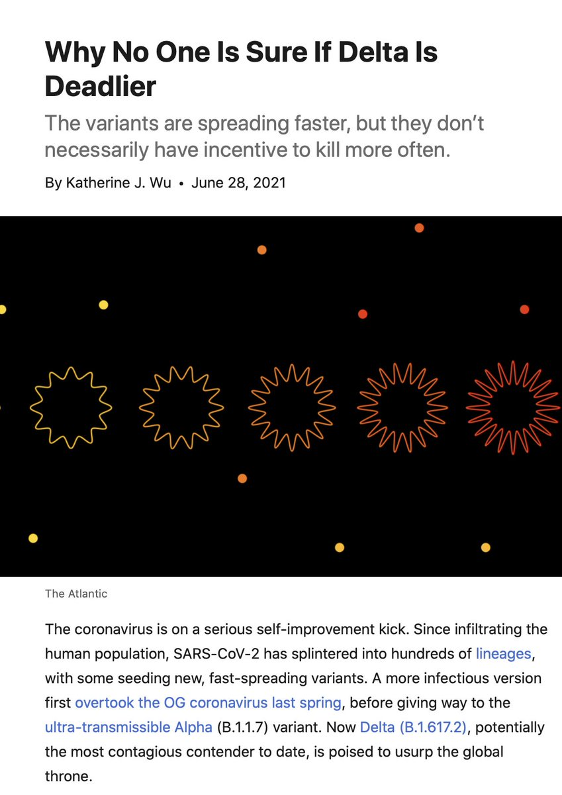</img></a><a href="E598MsiUcAEkBGv.png"  >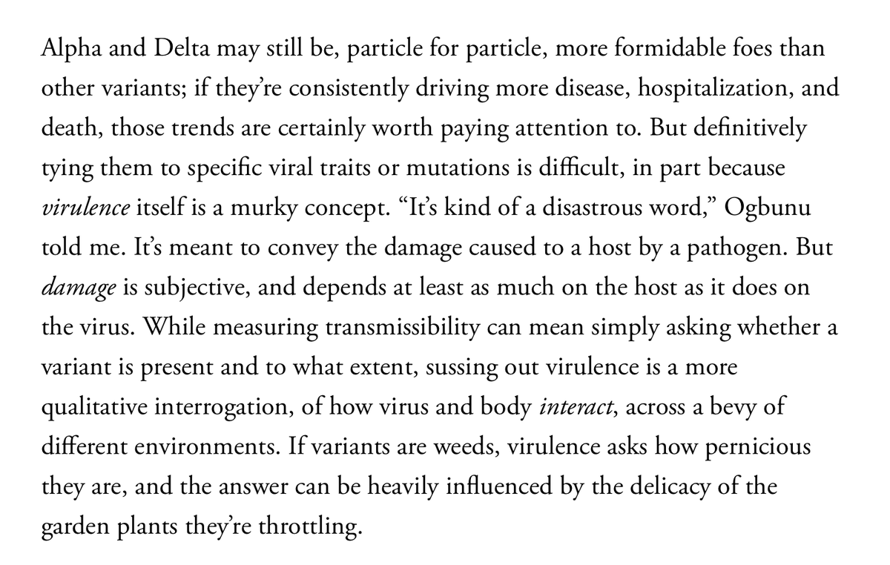</img></a>