+++
title = "Tweets by Eric Topol July 11"
Summary = ""
tags = ["Twitter"]
category = "Twitter"
+++

---

<a href="https://twitter.com/erictopol/status/1414055508865032192" target="_blank" rel="noreferer">02:54 UCT</a>

Delta in Arkansas and Missouri now is starting to look like Alpha in Michigan a few months ago 

<a href="E5-7ymrVoAEq1Fz.jpg"  >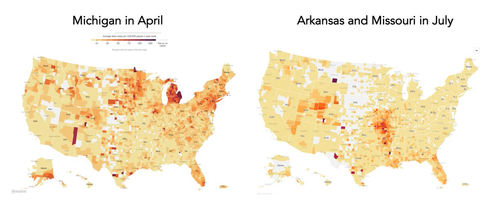</img></a>

---

<a href="https://twitter.com/erictopol/status/1414060888101842948" target="_blank" rel="noreferer">03:16 UCT</a>

@sayan94194742 Thanks. Can you send the link to this report?

---

<a href="https://twitter.com/erictopol/status/1414107657963597825" target="_blank" rel="noreferer">06:21 UCT</a>

@sayan94194742 Thanks!

---

<a href="https://twitter.com/erictopol/status/1414215202116014086" target="_blank" rel="noreferer">13:29 UCT</a>

Our covid times :-(
by @planteink 

<a href="E6BNKhOVEAEQzln.jpg"  >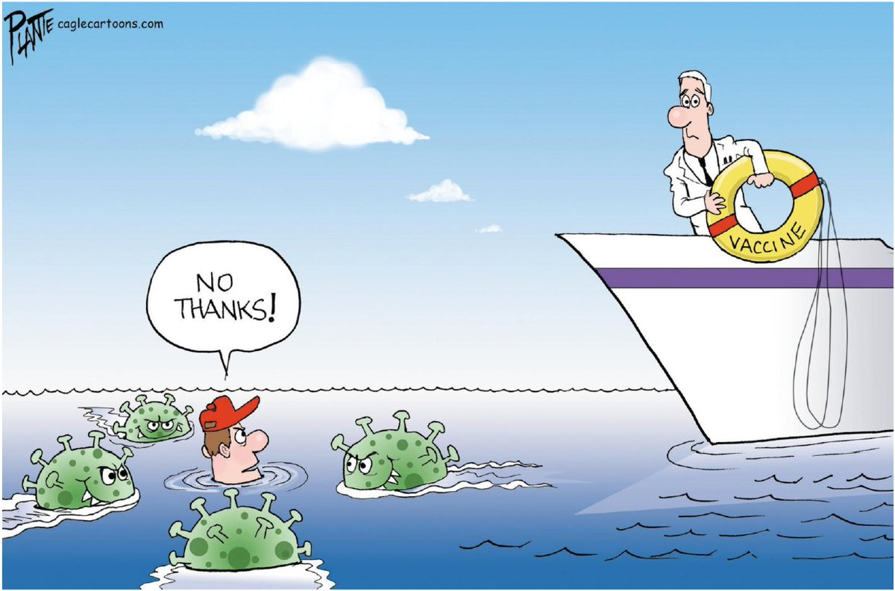</img></a>

---

<a href="https://twitter.com/erictopol/status/1414220378830884865" target="_blank" rel="noreferer">13:49 UCT</a>

@kaitlancollins That's nice, but won't cut it. Words and full approvals  matter. The FDA  should have done those certain things by now
https://www.nytimes.com/2021/07/01/opinion/fda-vaccines-full-approval.html 

<a href="E6BR36qVEAA7KCb.jpg"  >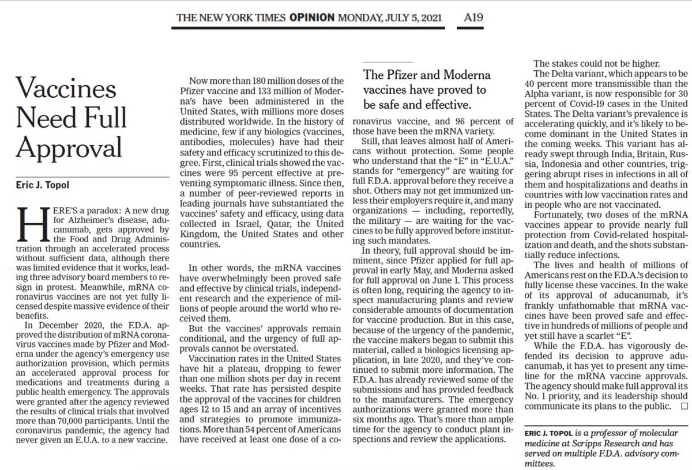</img></a>

---

<a href="https://twitter.com/erictopol/status/1414227531448786945" target="_blank" rel="noreferer">14:18 UCT</a>

A meeting is scheduled Monday by @Pfizer to present unpublished data on the need for a vaccine booster to Tony Fauci, @NIHDirector, @vivek_murthy, @CDCDirector, @DrWoodcockFDA for elderly and vulnerable 
https://www.washingtonpost.com/health/2021/07/10/covid-booster-shot-pfizer/ @yabutaleb7 @tylerpager @lauriemcginley2 @bylenasun

---

<a href="https://twitter.com/erictopol/status/1414229272672145410" target="_blank" rel="noreferer">14:25 UCT</a>

It seems to be a very unusual way to resolve "an unusually public spat" is to have a private meeting with lack of transparency of the data that support a booster for certain people. No less a highly irregular way for any company to proceed in pursuit of an EUA.

---

<a href="https://twitter.com/erictopol/status/1414237083279925250" target="_blank" rel="noreferer">14:56 UCT</a>

Canada's vaccinations have reached 70% of their total population (the US is at 55%) for 1st dose —moving at a very fast pace for 2nd doses, vaccinating &gt;1.2% Canadians each day (US 0.2%) 

<a href="E6BgB7TUUA0lkYO.jpg"  >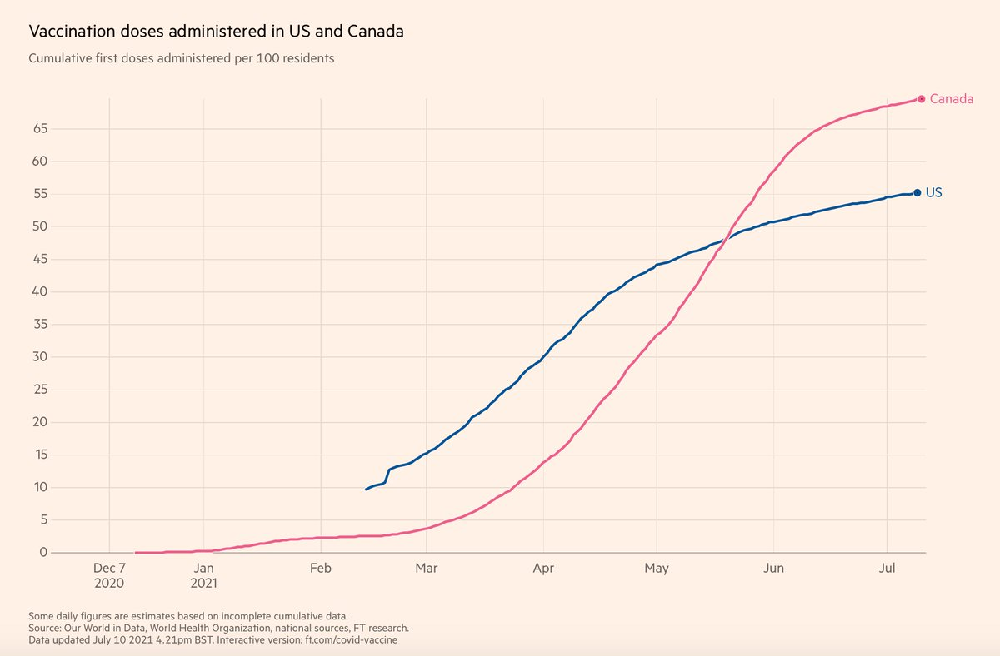</img></a><a href="E6BgEdeUUAAVE4s.jpg"  >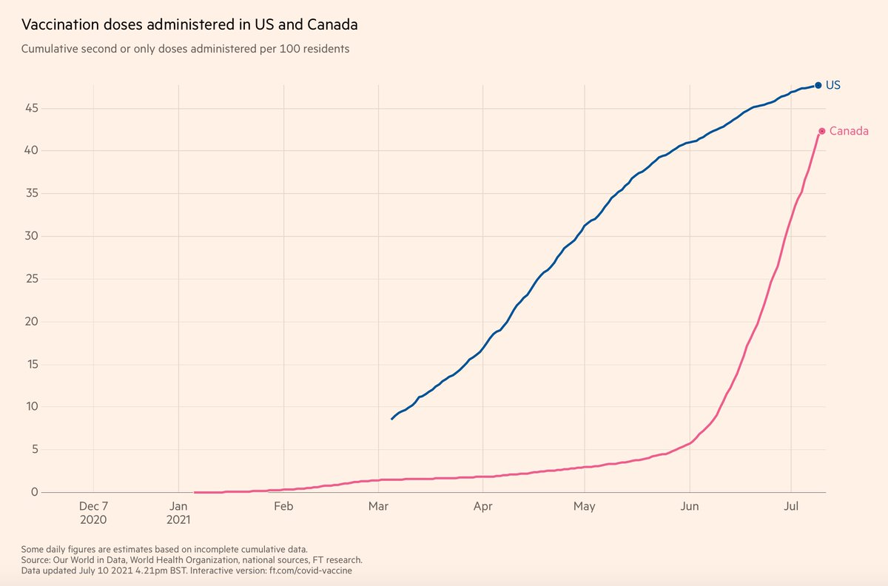</img></a><a href="E6BgLfSVEAooO1l.jpg"  >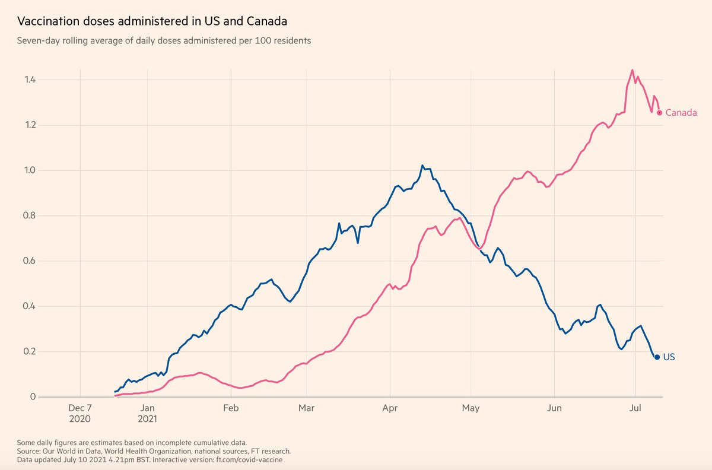</img></a>

---

<a href="https://twitter.com/erictopol/status/1414239689880399872" target="_blank" rel="noreferer">15:06 UCT</a>

@herf @Nature @damicollier @GuptaR_lab @isabella_atmf Yes, supportive data. I think it's great to have a booster available. My concerns are only about the process. Show the data and be clear this is for particular subgroups, not all people

---

<a href="https://twitter.com/erictopol/status/1414251862505582595" target="_blank" rel="noreferer">15:54 UCT</a>

The @sdut editorial today calling for full FDA approval of vaccines https://www.sandiegouniontribune.com/opinion/editorials/story/2021-07-09/fda-approve-covid-19-vaccines-to-lower-vaccine-hesitancy
supporting @nytopinion https://www.nytimes.com/2021/07/01/opinion/fda-vaccines-full-approval.html 🙏 

<a href="E6BuEOFVcAE-edF.jpg"  >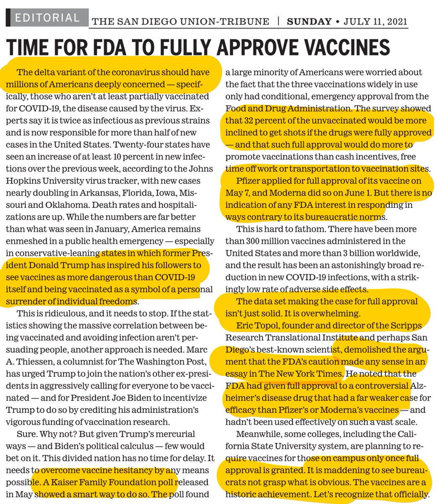</img></a>

---

<a href="https://twitter.com/erictopol/status/1414254993536786433" target="_blank" rel="noreferer">16:07 UCT</a>

Updating #VaccinesWork vs Delta
4 vaccines with clinical effectiveness data
https://www.medrxiv.org/content/10.1101/2021.06.30.21259439v1 via @sayan94194742  https://twitter.com/EricTopol/status/1413968623815647235

<a href="E6BxRfGVcAETQrs.jpg"  >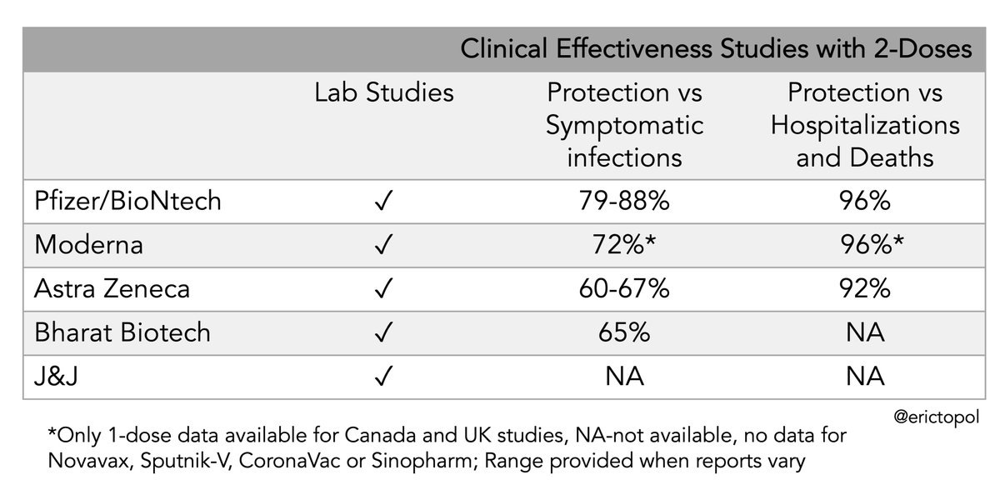</img></a>

---

<a href="https://twitter.com/erictopol/status/1414259816835411970" target="_blank" rel="noreferer">16:26 UCT</a>

That's nearly 5 years.
For symptomatic prior covid: "[we] estimate that neutralizing [PRNT50] antibody will remain detectable for around 1,717 days after symptom onset" https://papers.ssrn.com/sol3/papers.cfm?abstract_id=3881728
BTW For prior covid, neutralizing antibodies markedly higher w/ 1-dose vaccine 

<a href="E6B0lz4UcAMN2dw.jpg"  >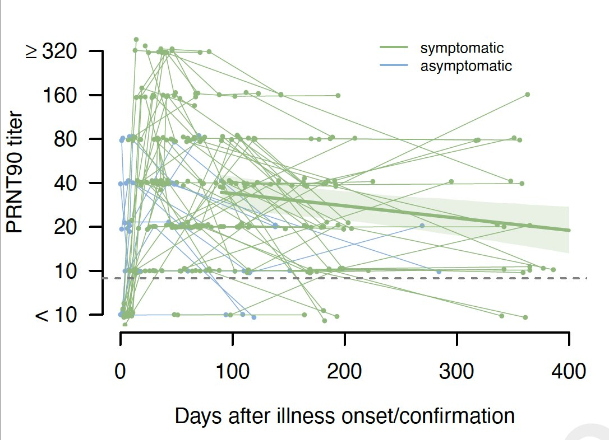</img></a>

---

<a href="https://twitter.com/erictopol/status/1414267335200763909" target="_blank" rel="noreferer">16:56 UCT</a>

@csylong_mk Wrong. https://www.cidrap.umn.edu/sites/default/files/public/downloads/cidrap-covid19-viewpoint-report7.pdf 

<a href="E6B8ny1VoAE8_K-.jpg"  >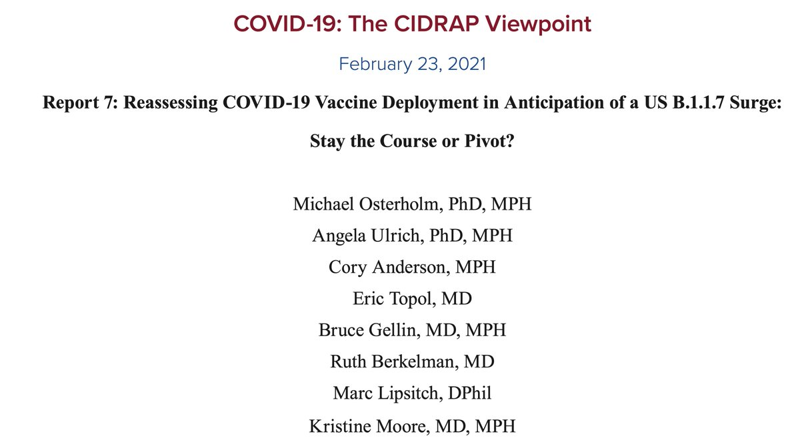</img></a>

---

<a href="https://twitter.com/erictopol/status/1414274021777035266" target="_blank" rel="noreferer">17:22 UCT</a>

The Delta hit to the US is now extending from cases to hospitalizations, 13 states with &gt;65% Delta prevalence now with ≥25% increase of hospitalizations over past 14 days 

<a href="E6CCi3QVIAYBZGl.jpg"  >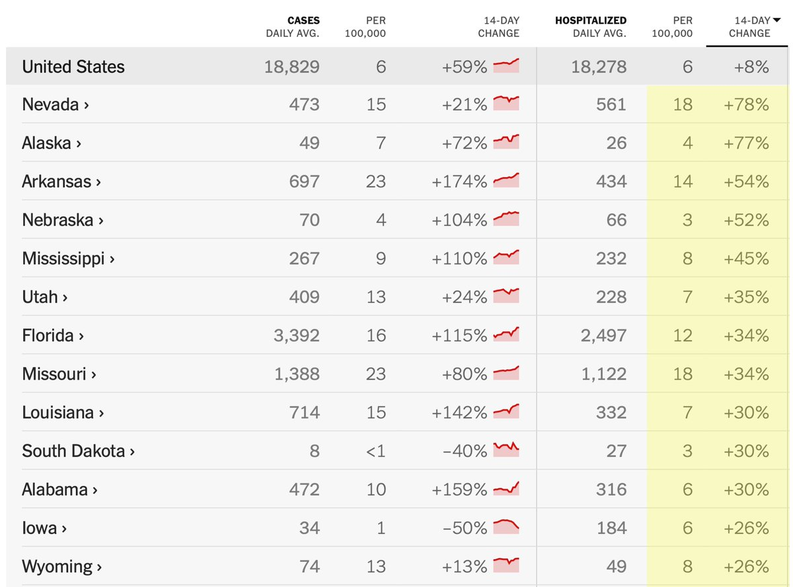</img></a>

---

<a href="https://twitter.com/erictopol/status/1414328561167593475" target="_blank" rel="noreferer">20:59 UCT</a>

RT @florian_krammer: Well, they should make that a public meeting. Like a VRBPAC or ACIP meeting. Also, they should publish the data. This…

---

<a href="https://twitter.com/erictopol/status/1414353013817319428" target="_blank" rel="noreferer">22:36 UCT</a>

History will look back on the US, with its overabundant supply of potent and safe vaccines, and wonder how it didn't adequately apply the tools to squash Delta in its tracks 

<a href="E6DJ86zUUAEWjUT.jpg"  >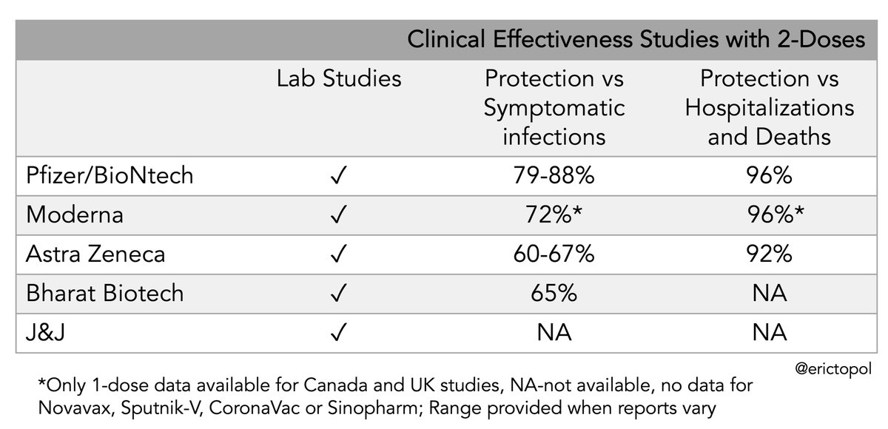</img></a>