+++
title = "Tweets by Eric Topol July 12"
Summary = ""
tags = ["Twitter"]
category = "Twitter"
+++

---

<a href="https://twitter.com/erictopol/status/1414397579119325184" target="_blank" rel="noreferer">01:33 UCT</a>

Duration of Delta variant dominance (green) in 4 countries with high vaccination rates vs case rise.  Singapore and UK &gt;95% for longest period, divergent curves. Israel &gt;95% but more recent. US ~70%, least duration
@OurWorldInData and  http://covariants.org lastest July update 

<a href="E6DyvnUVgAAsT9Y.jpg"  >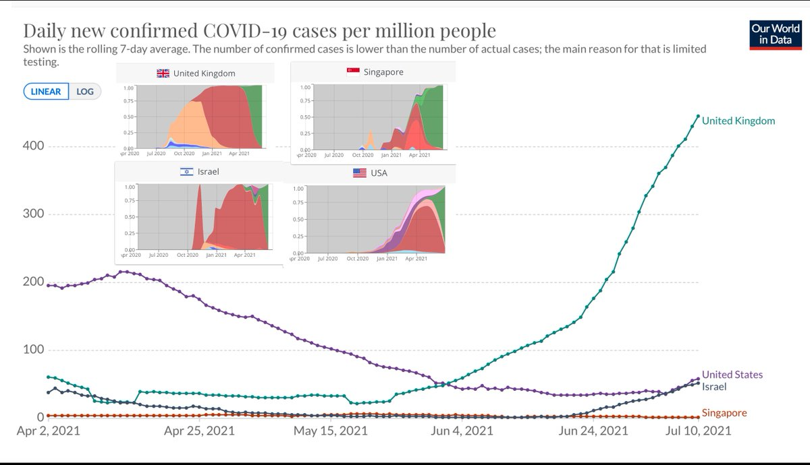</img></a>

---

<a href="https://twitter.com/erictopol/status/1414407955328372738" target="_blank" rel="noreferer">02:15 UCT</a>

RT @ashishkjha: These states where hospitalizations are rising?

Not a single one hit the President's goal of 70% of adults with 1 shot.…

---

<a href="https://twitter.com/erictopol/status/1414566519678259206" target="_blank" rel="noreferer">12:45 UCT</a>

This will play prominently as part of the explanation
https://www.nytimes.com/2021/07/11/business/media/vaccines-fox-news-hosts.html?searchResultPosition=3 by  @tiffkhsu A1 today on @FoxNews 

<a href="E6GMTWuVgAYIvFS.jpg"  >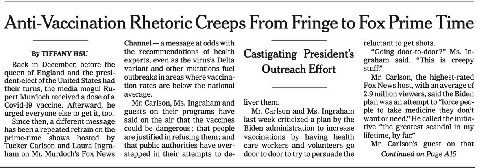</img></a>

---

<a href="https://twitter.com/erictopol/status/1414570199458598916" target="_blank" rel="noreferer">12:59 UCT</a>

Just published @Nature 
The enhanced interferon innate immune response induced by the 2nd (booster) dose of mRNA (@BioNTech_Group/@Pfizer) vaccine w/ single-cell seq, transcriptional signatures and comparison to other vaccines
https://www.nature.com/articles/s41586-021-03791-x 

<a href="E6GQEcPUYAU-pdr.jpg"  >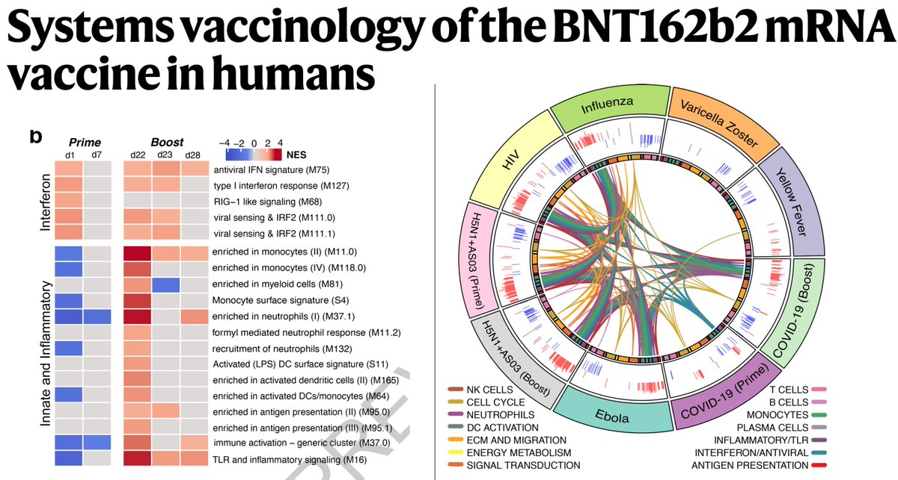</img></a>

---

<a href="https://twitter.com/erictopol/status/1414575476534747141" target="_blank" rel="noreferer">13:20 UCT</a>

Ahead of this meeting, Israel moves forward with 3rd vaccine dose for people with immunodeficiency and "serious prior medical conditions" 
Of their Delta outbreak, 1.2% (47 of 4,000) cases were seriously ill https://www.ft.com/content/79574dc0-375a-47f7-b572-cbd259a92e0b by @NeriZilber @FT 

<a href="E6GT-BCVgA0nqh1.jpg"  >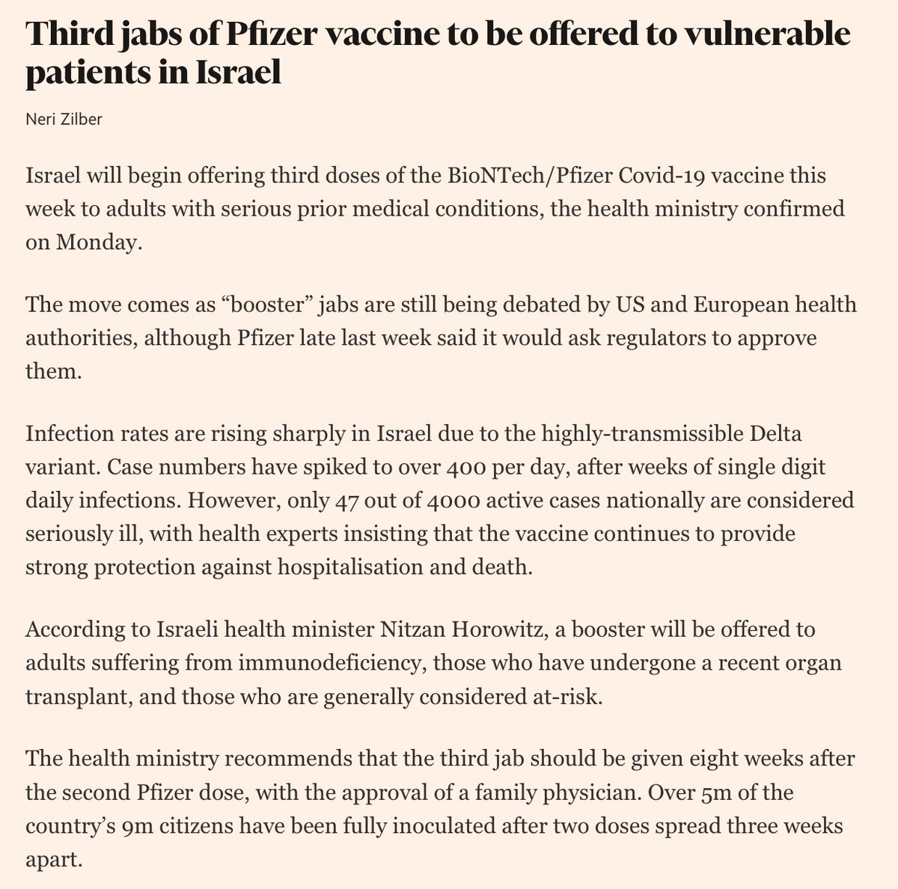</img></a>

---

<a href="https://twitter.com/erictopol/status/1414580044366684166" target="_blank" rel="noreferer">13:38 UCT</a>

A succinct summary of the salient lessons on #LongCovid  https://twitter.com/Dr2NisreenAlwan/status/1414526933619126273

<a href="E6GY0hBVUAAlCf5.jpg"  >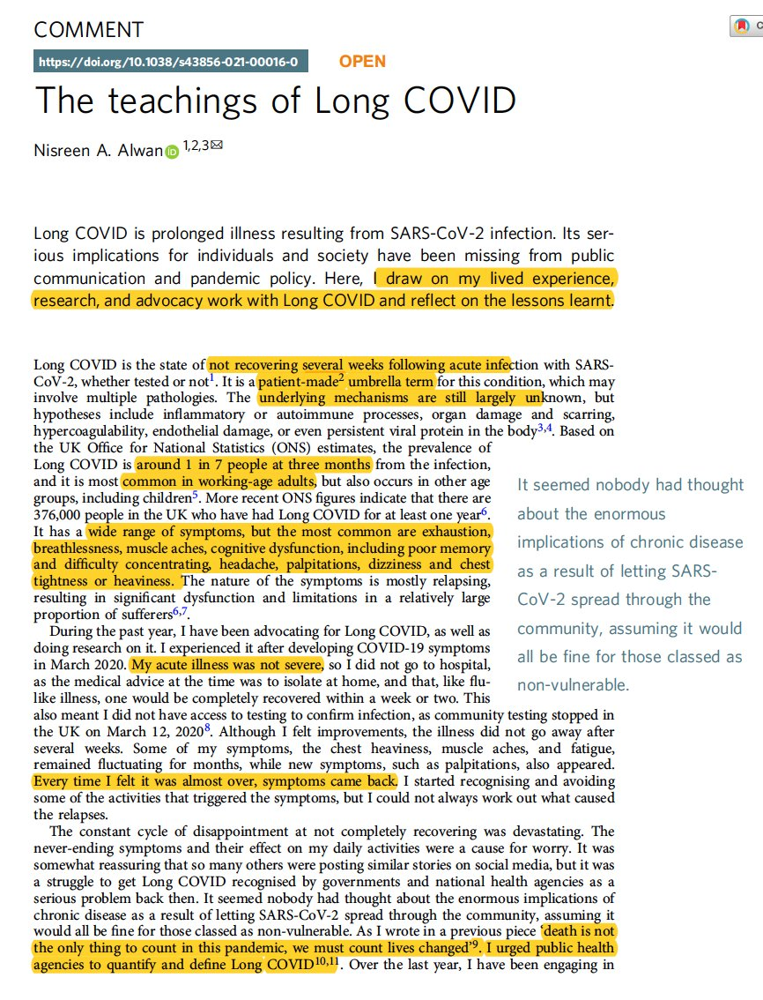</img></a><a href="E6GY2puVgAId7Wr.jpg"  >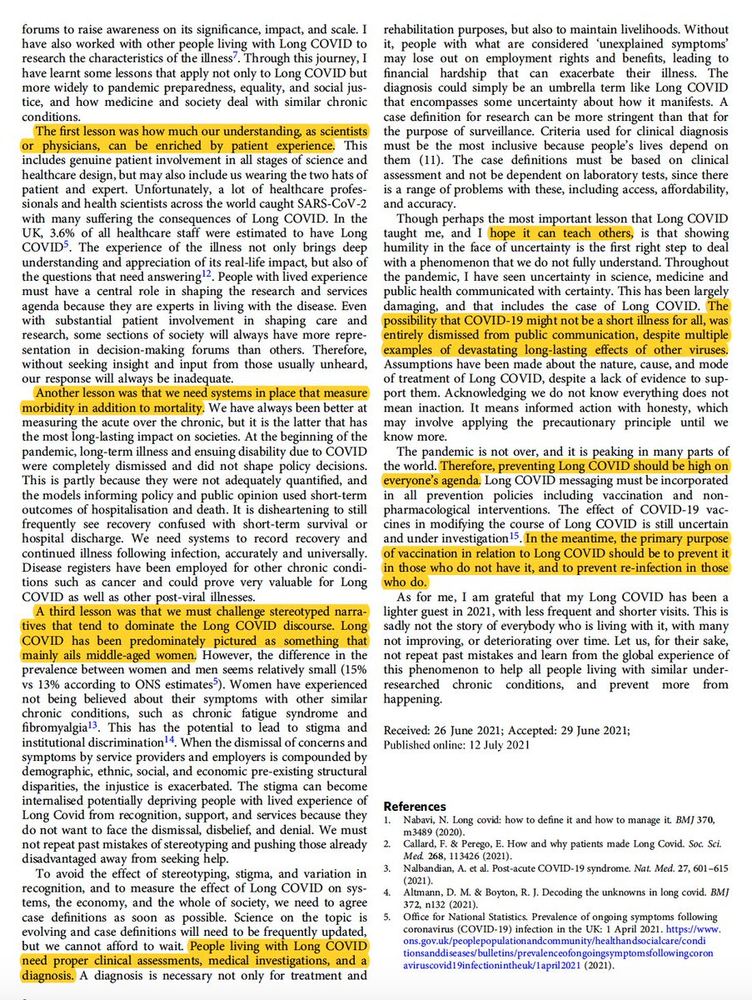</img></a>

---

<a href="https://twitter.com/erictopol/status/1414584254835544068" target="_blank" rel="noreferer">13:55 UCT</a>

Here are the data on deaths. Important to consider Delta dominance duration as part of explanation for difference in patterns between countries as this strain becomes dominant throughout the world. 

<a href="E6GccB3VIAkY7GW.jpg"  >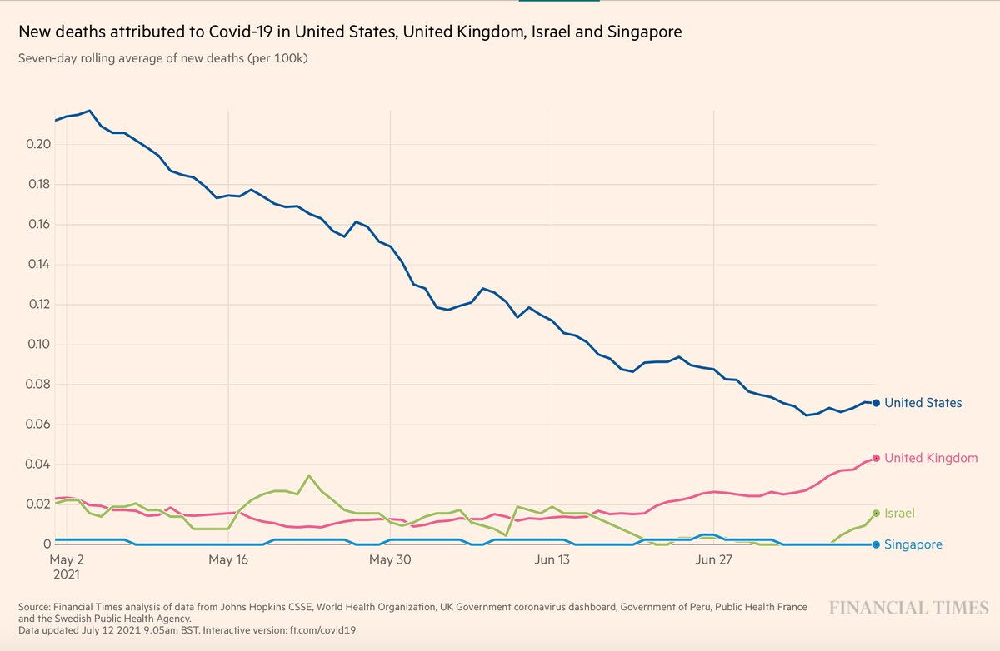</img></a>

---

<a href="https://twitter.com/erictopol/status/1414587623436292097" target="_blank" rel="noreferer">14:09 UCT</a>

Arkansas and Missouri still stand out among the others for case growth 
One metric to keep in mind on hospitalizations is that at it worst in the 3rd wave, the US was at 40/100,000 people
Arkansas is 15, Missouri 19 currently
https://www.nytimes.com/interactive/2021/us/covid-cases.html 

<a href="E6Gf22sVkAM54QY.jpg"  >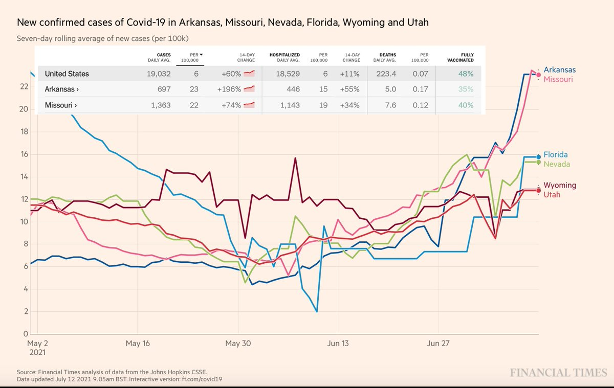</img></a>

---

<a href="https://twitter.com/erictopol/status/1414612664718794755" target="_blank" rel="noreferer">15:48 UCT</a>

Asian countries, well known for containment throughout the pandemic, now experiencing record outbreaks. The Delta variant is playing a significant role.
@OurWorldInData 

<a href="E6G2L37VoAIAzjS.jpg"  >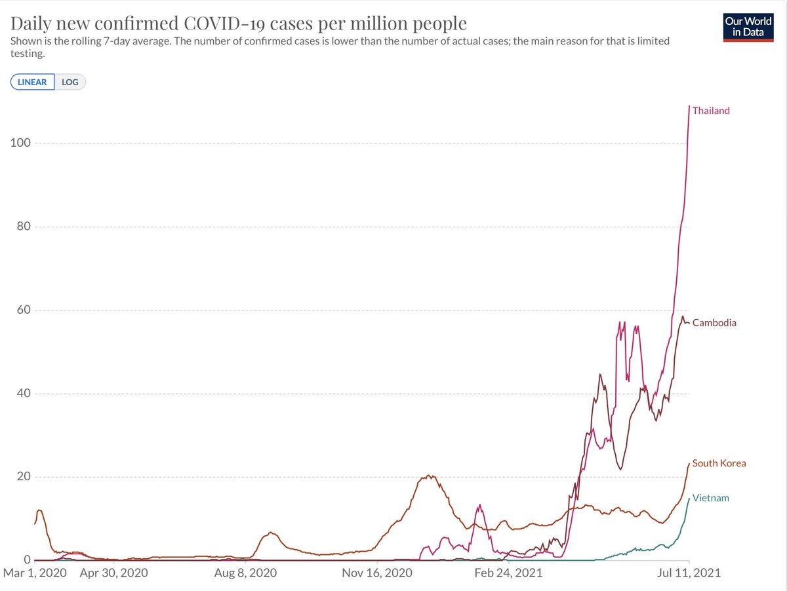</img></a>

---

<a href="https://twitter.com/erictopol/status/1414616180891938823" target="_blank" rel="noreferer">16:02 UCT</a>

Encouraging to see this graph from @TWenseleers that the ratio of cases to hospitalizations in England is declining across all age groups 

<a href="E6G5nK_UYAgWgEj.png"  >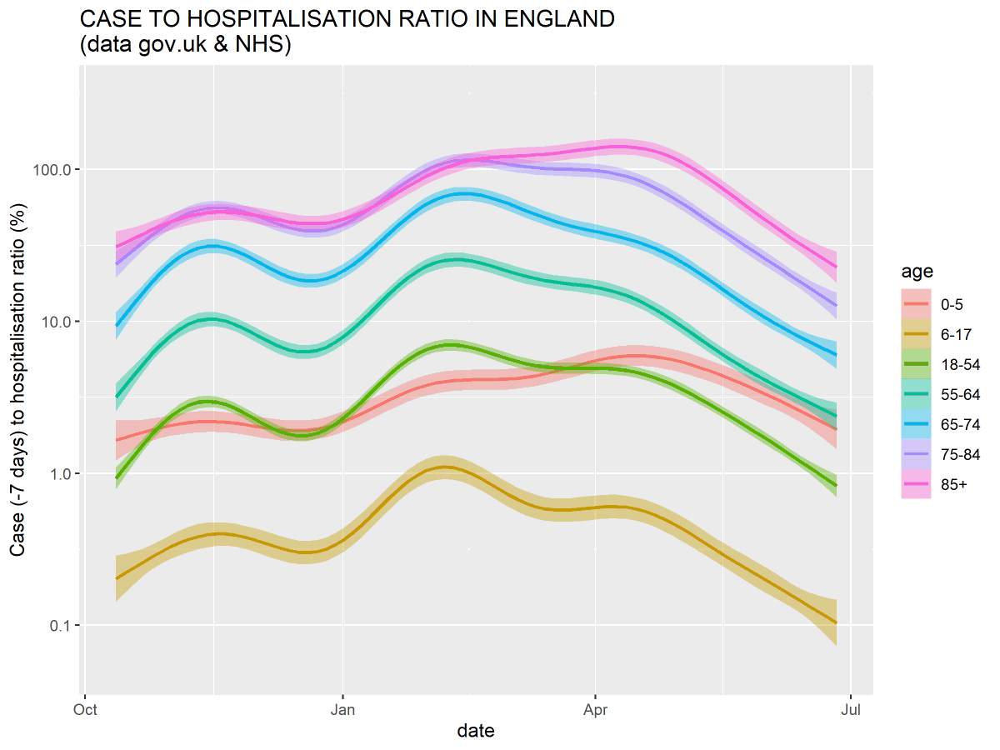</img></a>

---

<a href="https://twitter.com/erictopol/status/1414622957033324552" target="_blank" rel="noreferer">16:29 UCT</a>

@df3n5 @TWenseleers The same pattern as seen in Israel. 
https://twitter.com/erictopol/status/1402968040308809728
https://twitter.com/erictopol/status/1395785022397878282?lang=en

---

<a href="https://twitter.com/erictopol/status/1414637836582617088" target="_blank" rel="noreferer">17:28 UCT</a>

This report from a month ago is so damn important and seems to have been missed by many https://twitter.com/EricTopol/status/1402968040308809728

---

<a href="https://twitter.com/erictopol/status/1414644718437236736" target="_blank" rel="noreferer">17:55 UCT</a>

Good graph to show current Delta wave vs Alpha wave relationship between cases vs hospitalizations (H) and deaths (D) in England (and impact of vaccinations)
August 2020-March 2021
Per 1000 cases: 81 H, 18 D

April 2021-now 
Per 1000 cases: 45 H, 4 D
https://www.economist.com/graphic-detail/2021/07/12/england-faces-the-sternest-test-of-its-vaccination-strategy 

<a href="E6HTSLRVkAIYS60.jpg"  >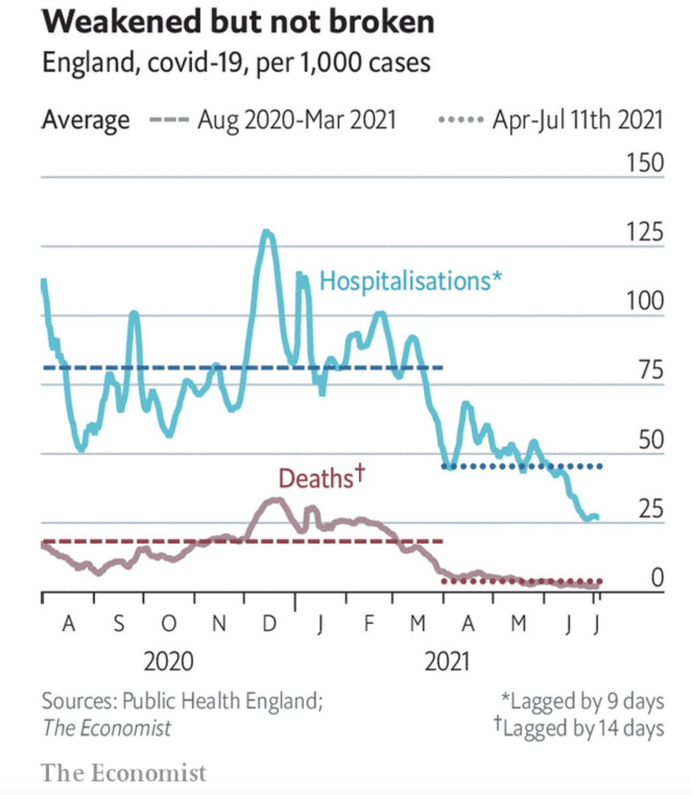</img></a>

---

<a href="https://twitter.com/erictopol/status/1414653058445824000" target="_blank" rel="noreferer">18:29 UCT</a>

The US by cases/100,000 people and fully vaccinated status
https://theuscovidatlas.org/map
No surprise why Arkansas and Missouri are the hot zones currently and pretty straightforward where others will be (and not be) cropping up 

<a href="E6Ha40yVIA0K0wx.jpg"  >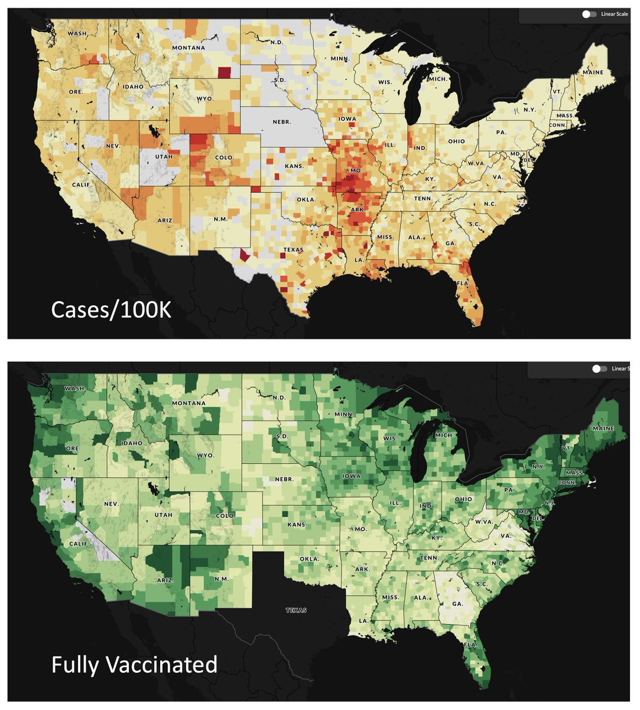</img></a>

---

<a href="https://twitter.com/erictopol/status/1414669755135320068" target="_blank" rel="noreferer">19:35 UCT</a>

The countries currently leading the world in cases per capita, and on the rise 

<a href="E6HqWSWVIAADhu9.jpg"  >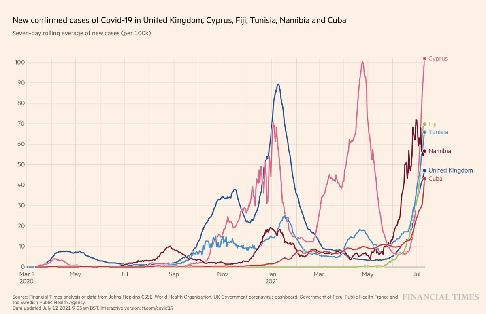</img></a>

---

<a href="https://twitter.com/erictopol/status/1414674010483220480" target="_blank" rel="noreferer">19:52 UCT</a>

A do-it-yourself covid test for $1.50 in 6.5 minutes with promising accuracy data from either saliva or nasal swab
https://www.pnas.org/content/118/30/e2106724118 just out @PNASNews Why we still do not have such tests in wide and frequent use is unexplainable

---

<a href="https://twitter.com/erictopol/status/1414700872790003732" target="_blank" rel="noreferer">21:39 UCT</a>

The case for mandating covid vaccination for the healthcare workforce https://www.acpjournals.org/doi/10.7326/M21-2366 @AnnalsofIM by @DeptPopMed's Michael Klompas and colleagues 
"Now is the time to ready themselves to adopt mandatory vaccination policies as soon as full approval is granted" 💯 

<a href="E6IF4mtVUCE8km7.jpg"  >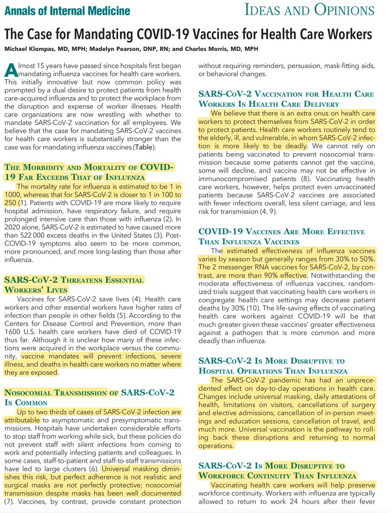</img></a><a href="E6IF6gQVUA8j-_5.jpg"  >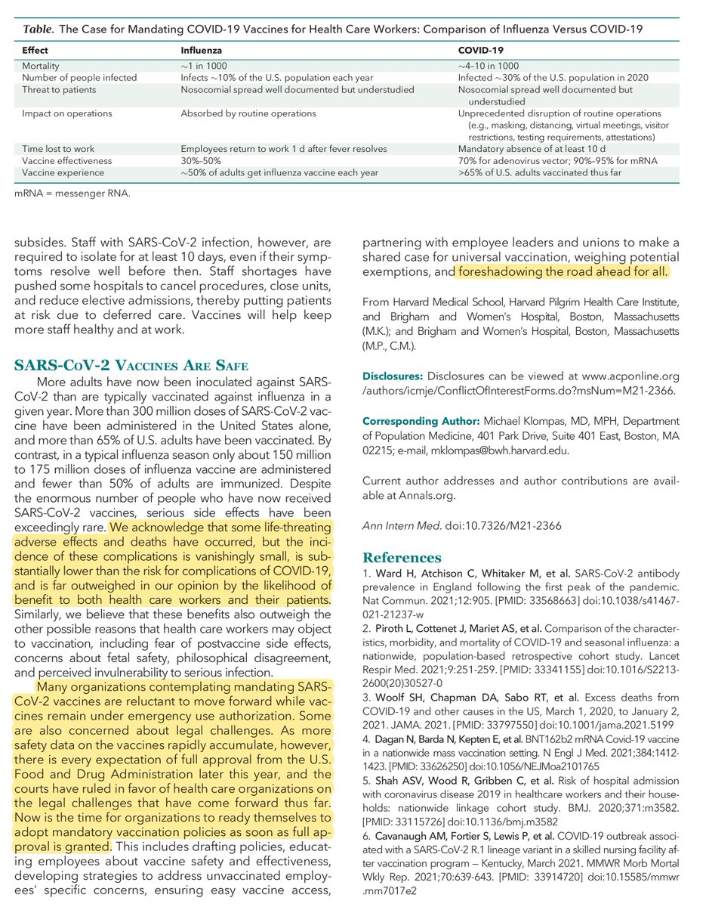</img></a>

---

<a href="https://twitter.com/erictopol/status/1414726871841837057" target="_blank" rel="noreferer">23:22 UCT</a>

Our covid times :-)
by @thePatByrnes 

<a href="E6IelB5VcAQvECp.png"  >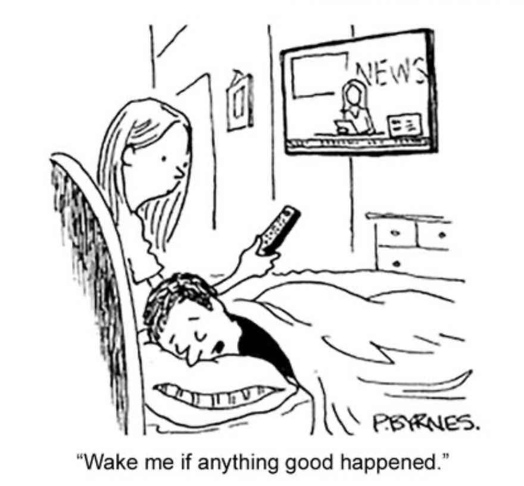</img></a>

---

<a href="https://twitter.com/erictopol/status/1414727166072287243" target="_blank" rel="noreferer">23:23 UCT</a>

That's good. https://twitter.com/kaitlancollins/status/1414726658951684096

