+++
title = "Tweets by Eric Topol July 13"
Summary = ""
tags = ["Twitter"]
category = "Twitter"
+++

---

<a href="https://twitter.com/erictopol/status/1414775258058346497" target="_blank" rel="noreferer">02:34 UCT</a>

The most abrupt rise in test positivity in the US pandemic (some states, such as AK, AL now &gt;20%) coincides with Delta variant reaching ~80% prevalence for basis of new cases
https://coronavirus.jhu.edu/testing/individual-states/usa
http://outbreak.info 

<a href="E6JKASMVkAANekO.jpg"  >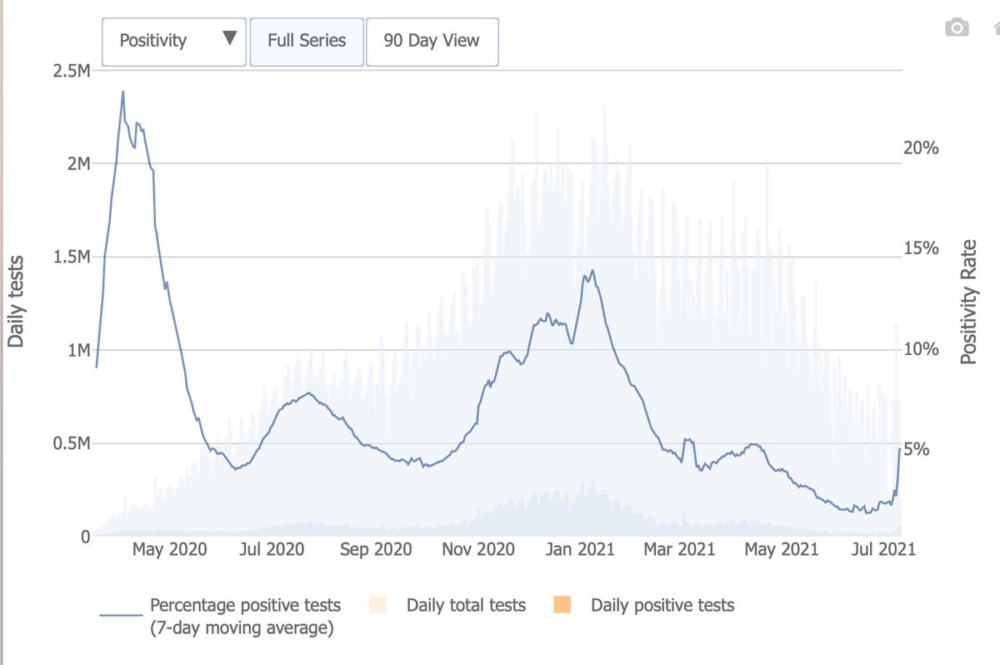</img></a><a href="E6JKFfGVgAA0csw.jpg"  >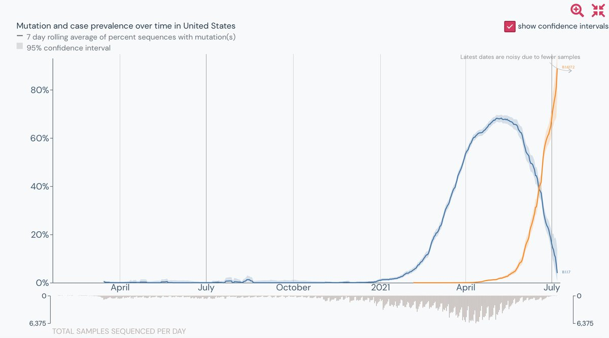</img></a>

---

<a href="https://twitter.com/erictopol/status/1414777177204162563" target="_blank" rel="noreferer">02:42 UCT</a>

That's AR, Arkansas which is leading the Delta wave now &gt;27 cases/100,000 people, 67% increased hospitalizations past 14 days, and only 35% fully vaccinated
https://www.nytimes.com/interactive/2021/us/covid-cases.html 

<a href="E6JLld3VoAoxKJl.jpg"  >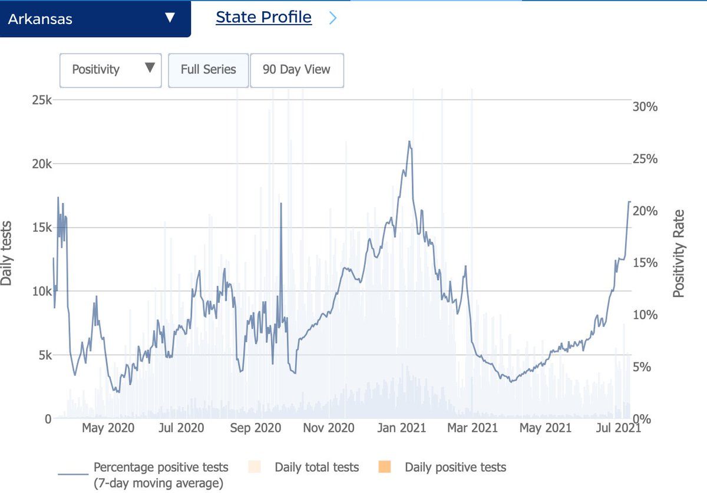</img></a><a href="E6JMIXzVoAw2lCz.jpg"  >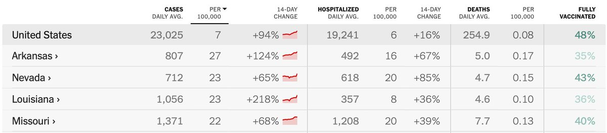</img></a>

---

<a href="https://twitter.com/erictopol/status/1414780511973646358" target="_blank" rel="noreferer">02:55 UCT</a>

And these from @JamesWard73 showing the slowing of case growth by age groups in England 

<a href="E6JPSyiVoAM5WH0.png"  >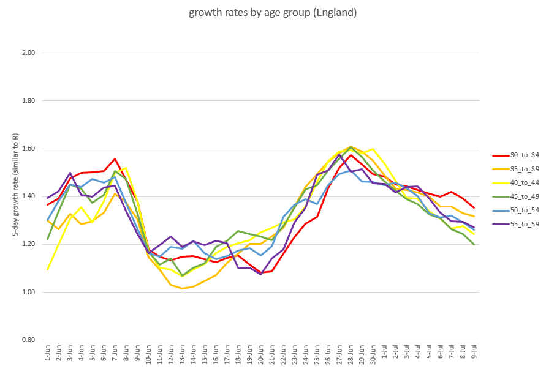</img></a><a href="E6JPUUrVoBUi2gK.png"  >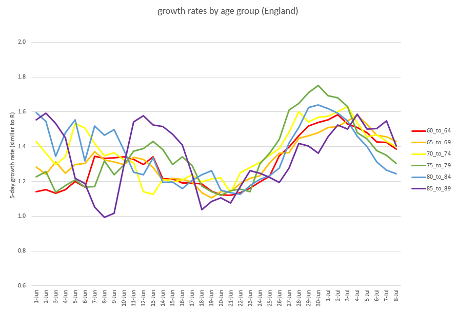</img></a>

---

<a href="https://twitter.com/erictopol/status/1414786904638119943" target="_blank" rel="noreferer">03:20 UCT</a>

@statesdj @PNASNews Quoting directly from the paper. Period. 

<a href="E6JU-9LUUAIZe_L.png"  >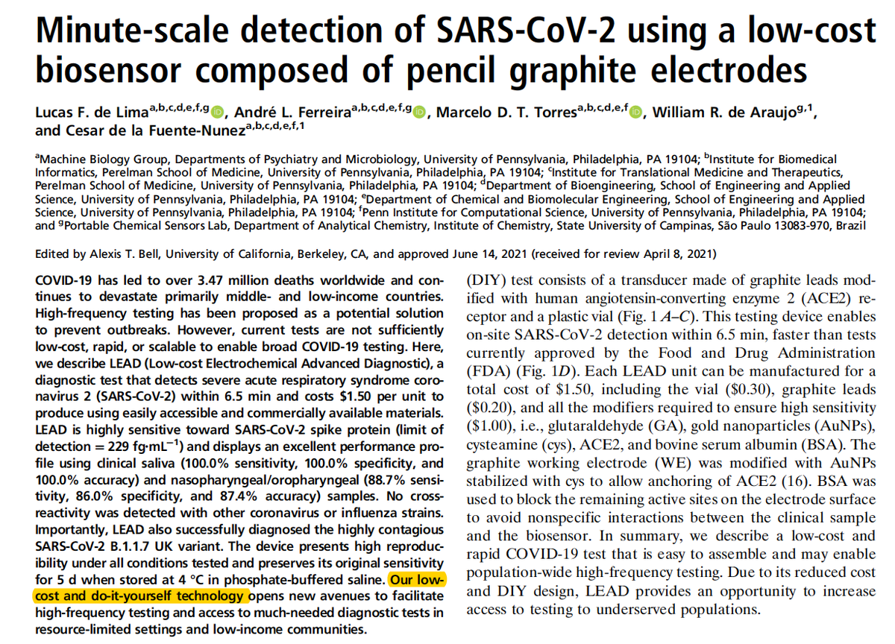</img></a>

---

<a href="https://twitter.com/erictopol/status/1414830664466112517" target="_blank" rel="noreferer">06:14 UCT</a>

"Pfizer Pushes" for 3rd dose in private with insufficient evidence, without publication, CDC and FDA pushes back
Front page tomorrow
https://www.nytimes.com/2021/07/12/us/politics/pfizer-booster-shots.html?action=click&module=Spotlight&pgtype=Homepage  by  @SherylNYT @SharonLNYT 2/ @CarlosdelRio7 
Let's see the data.
https://twitter.com/EricTopol/status/1413250865142538240 

<a href="E6J8MjhVcAI29_j.jpg"  >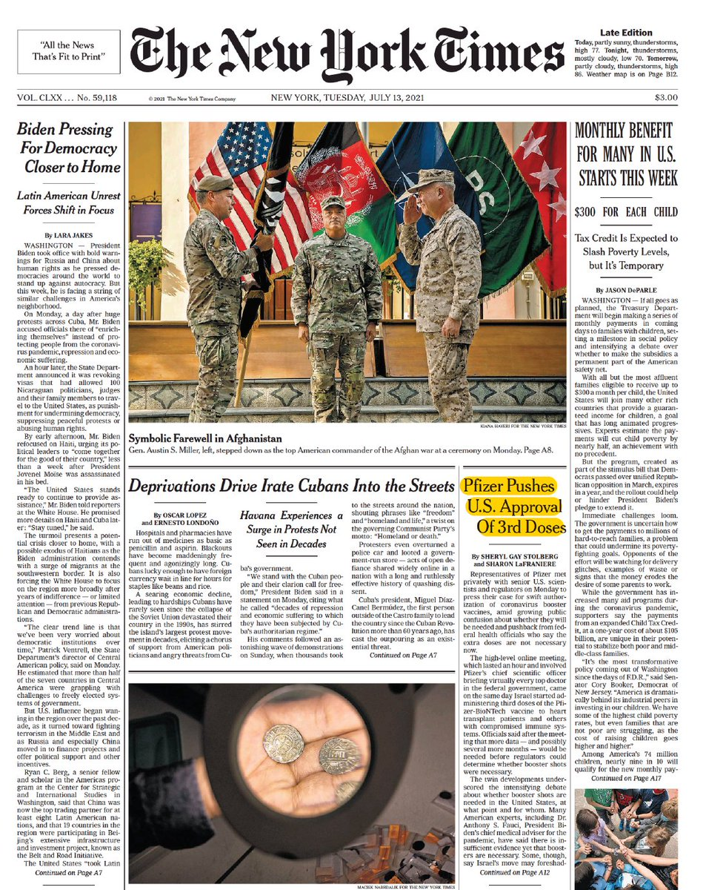</img></a>

---

<a href="https://twitter.com/erictopol/status/1414932618827632649" target="_blank" rel="noreferer">12:59 UCT</a>

Our covid times :-)
by @Hilary_Price and @stephanpastis 

<a href="E6LZgqwUUAM5dZq.jpg"  >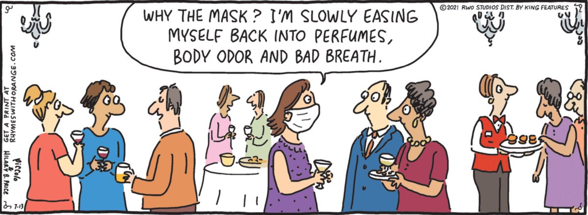</img></a><a href="E6LZq2pUcAIuGak.jpg"  >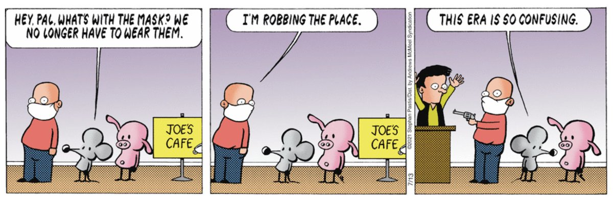</img></a>

---

<a href="https://twitter.com/erictopol/status/1414934684081917958" target="_blank" rel="noreferer">13:08 UCT</a>

How not to stay ahead of the Delta outbreak
https://www.ft.com/content/f8e83ce5-037f-469d-bee9-aaa37f6e2554 by @nikasgari @FT 

<a href="E6LbKrXVIAcy0DX.jpg"  >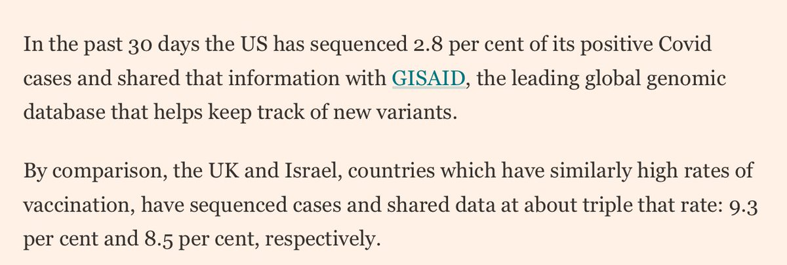</img></a>

---

<a href="https://twitter.com/erictopol/status/1414939633272561664" target="_blank" rel="noreferer">13:27 UCT</a>

Sure hope not, @halltoons 
Cases in Tokyo and Japan are 40% Delta, with prevalence rising quickly, with 10 days before #TokyoOlympics begins 

<a href="E6LfnWWUUAQ56OA.jpg"  ></img></a>

---

<a href="https://twitter.com/erictopol/status/1414947666723676160" target="_blank" rel="noreferer">13:59 UCT</a>

Just the trajectory of the Netherlands case rise tells you how formidable Delta is 

<a href="E6LnVu7X0Aw0-NS.jpg"  >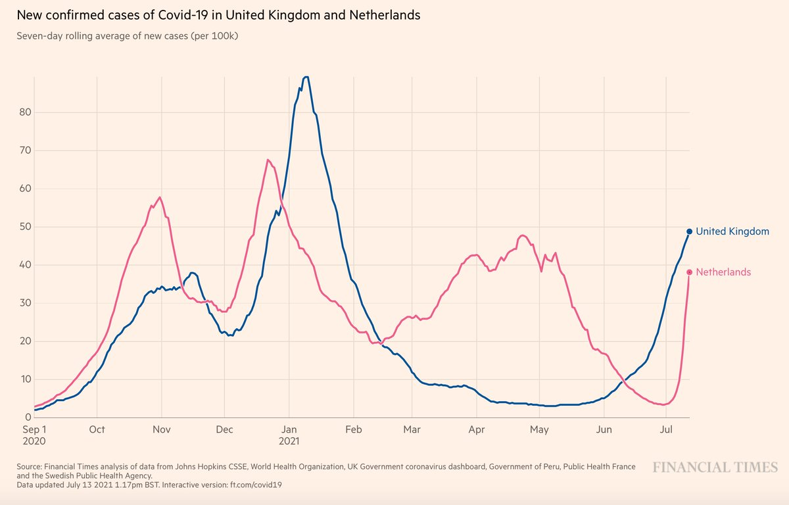</img></a>

---

<a href="https://twitter.com/erictopol/status/1414948858644160513" target="_blank" rel="noreferer">14:04 UCT</a>

@FrankfurtZack Wrong. 

<a href="E6Loe2IX0AoyQSa.jpg"  ></img></a>

---

<a href="https://twitter.com/erictopol/status/1414948996582232064" target="_blank" rel="noreferer">14:05 UCT</a>

@hubertlepicki wrong. 

<a href="E6Lomp_XMAM4Cw_.jpg"  >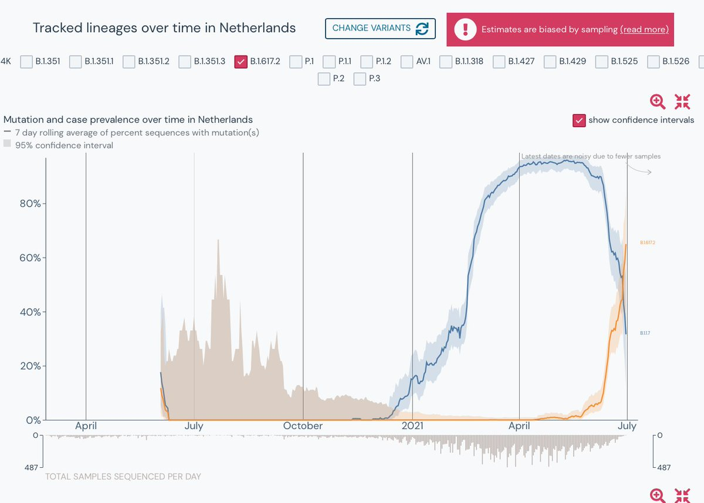</img></a>

---

<a href="https://twitter.com/erictopol/status/1414951428318056449" target="_blank" rel="noreferer">14:14 UCT</a>

Or the new records of deaths each day for multiple countries with &gt;90% Delta and very low rates of vaccination
@OurWorldInData 

<a href="E6LqrzRXEAQTpmY.jpg"  >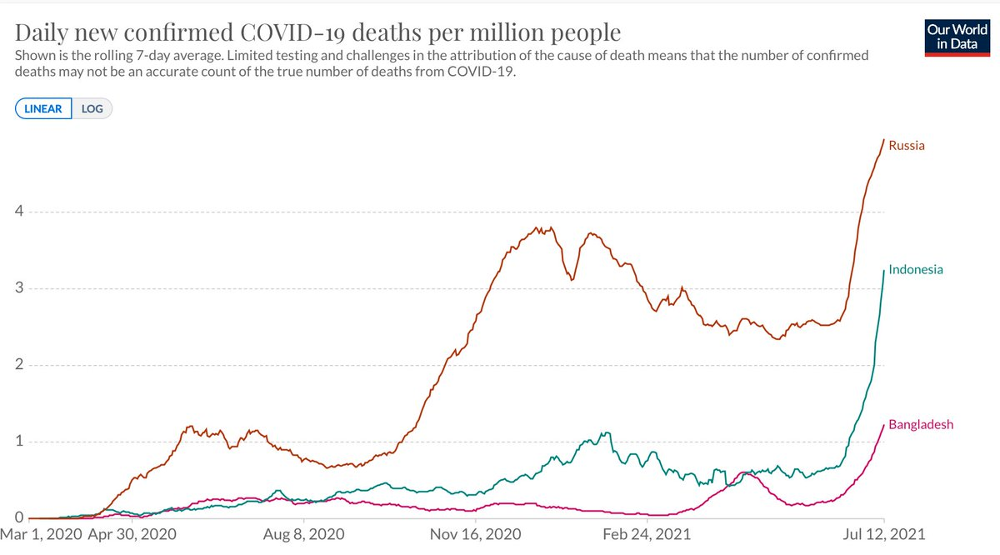</img></a>

---

<a href="https://twitter.com/erictopol/status/1414956383108141056" target="_blank" rel="noreferer">14:34 UCT</a>

It's possible
To have &gt;90% Delta and maintain solid containment 

<a href="E6LugDlWQA4lh5j.jpg"  >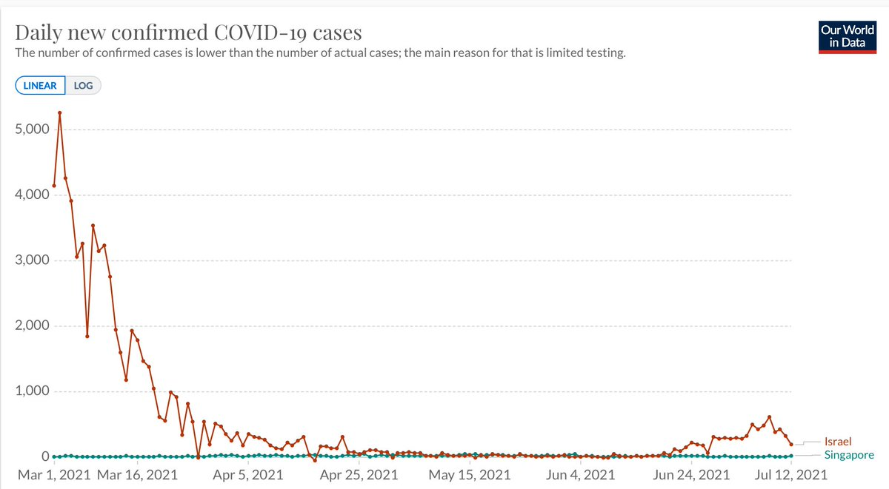</img></a>

---

<a href="https://twitter.com/erictopol/status/1414977511973289988" target="_blank" rel="noreferer">15:58 UCT</a>

The outliers, the "extreme phenotypes": we're not learning enough from them in the pandemic and beyond. Breakthrough infections from vaccines and centenarians who resist covid are great examples, by @rkhamsi @nytopinion 
https://www.nytimes.com/2021/07/12/opinion/covid-unusual-cases-study.html?searchResultPosition=1 

<a href="E6MCKWcVEAQUlso.jpg"  >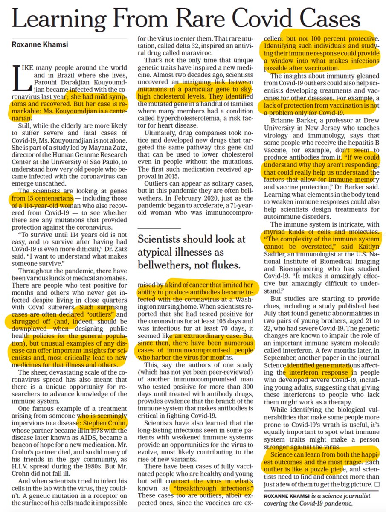</img></a>

---

<a href="https://twitter.com/erictopol/status/1414991102155780099" target="_blank" rel="noreferer">16:52 UCT</a>

The US Delta wave epicenter in Arkansas and Missouri is spreading to Louisiana. Nevada on its own is heating up to round out the top 4 states, all &gt;22 cases/100K people and rising hospitalizations, low vaccination
https://theuscovidatlas.org
https://www.nytimes.com/interactive/2021/us/covid-cases.html 

<a href="E6MO4D8VkAUiLdH.jpg"  >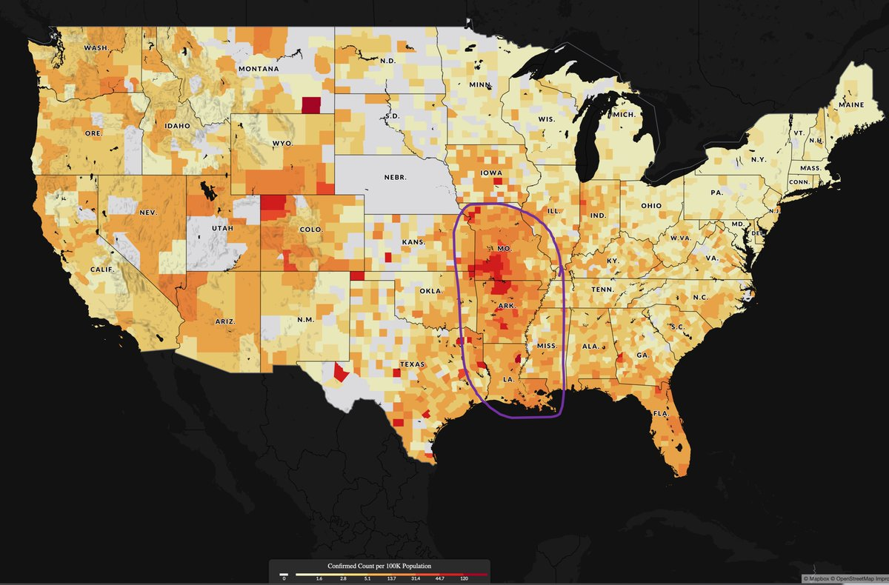</img></a><a href="E6MOVlIVoAEB3xN.jpg"  >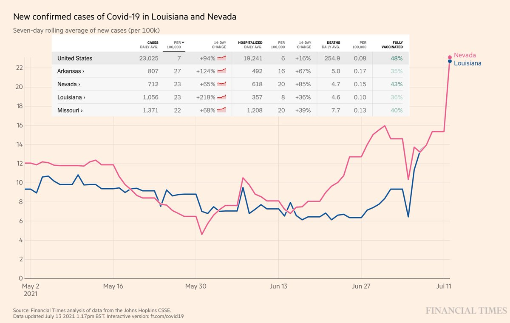</img></a>

---

<a href="https://twitter.com/erictopol/status/1415015970414886912" target="_blank" rel="noreferer">18:31 UCT</a>

@thehowie @WadeFink 726 cases today after declines the past 4 days according to @OurWorldInData 
That's still pretty good relative to UK's surge, but clearly not &lt;1/100K where they got down to
https://datadashboard.health.gov.il/COVID-19/general

---

<a href="https://twitter.com/erictopol/status/1415025204586115072" target="_blank" rel="noreferer">19:07 UCT</a>

"The potential role of reactivated viruses is worth studying" as a potential mechanism for #LongCovid 
https://www.wsj.com/articles/are-latent-viruses-causing-long-covid-19-symptoms-patient-groups-push-for-testing-11626181200?mod=hp_listc_pos1 by @rddysum 

<a href="E6Mrbo_VUAgjx8r.jpg"  >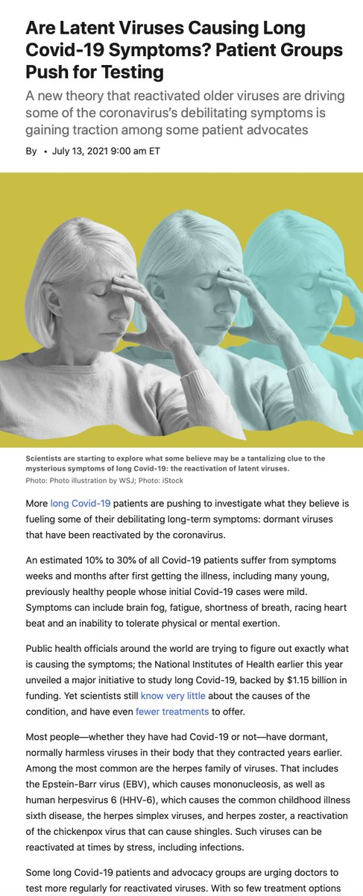</img></a>

---

<a href="https://twitter.com/erictopol/status/1415037059102773248" target="_blank" rel="noreferer">19:54 UCT</a>

After multiple days of declines, the update from Israel today isn't good, 1,198 cases, which is the highest since March. 
1 Death 

<a href="E6M4ba7VIAAvn7S.jpg"  >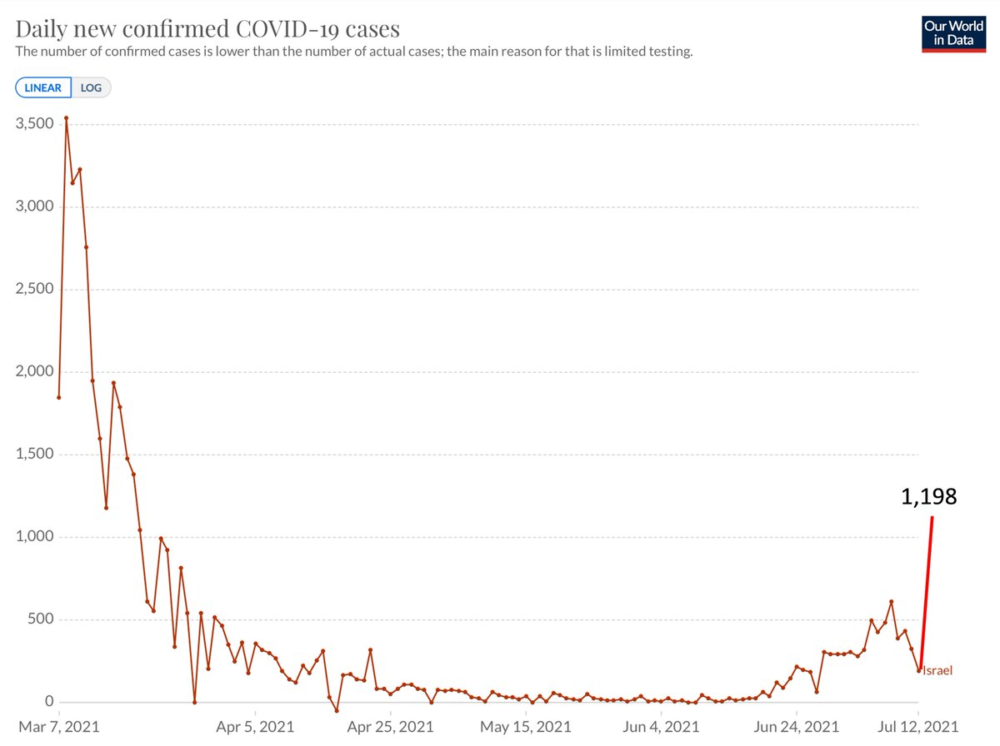</img></a>

---

<a href="https://twitter.com/erictopol/status/1415068885779316737" target="_blank" rel="noreferer">22:01 UCT</a>

@feldman_gil Why are there so many different reports? 

<a href="E6NVpKeVgAE3m0c.jpg"  >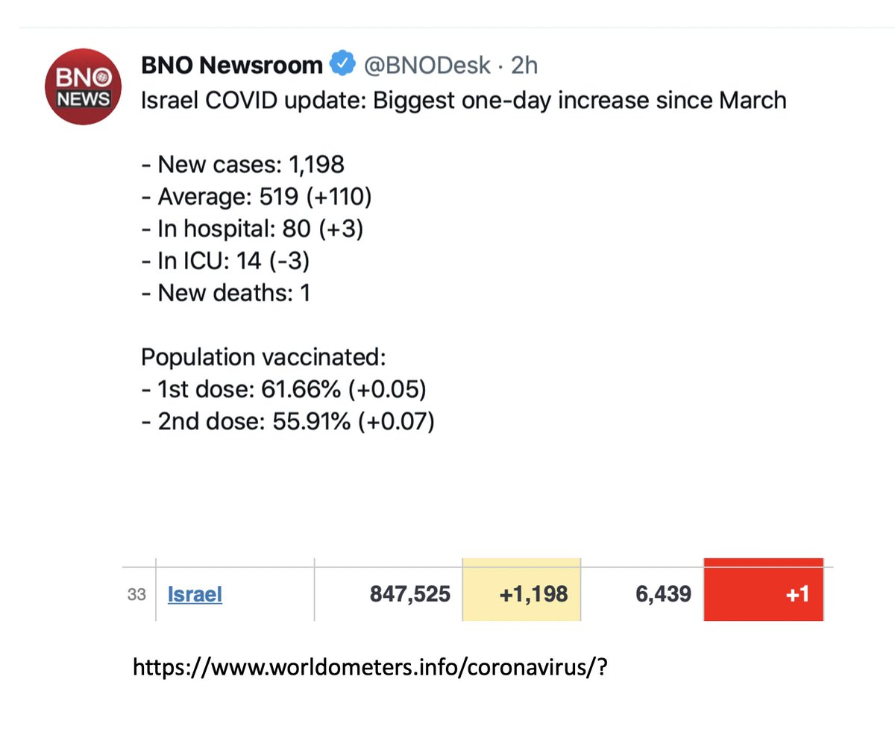</img></a>

---

<a href="https://twitter.com/erictopol/status/1415079477202198529" target="_blank" rel="noreferer">22:43 UCT</a>

Is remote home monitoring for Covid safe and effective for avoiding hospitalization? A systematic review of 27 studies leaves this question unanswered.
https://www.thelancet.com/journals/eclinm/article/PIIS2589-5370(21)00245-5/fulltext @EClinicalMed 

<a href="E6Ne6VEVIAAh9Al.jpg"  >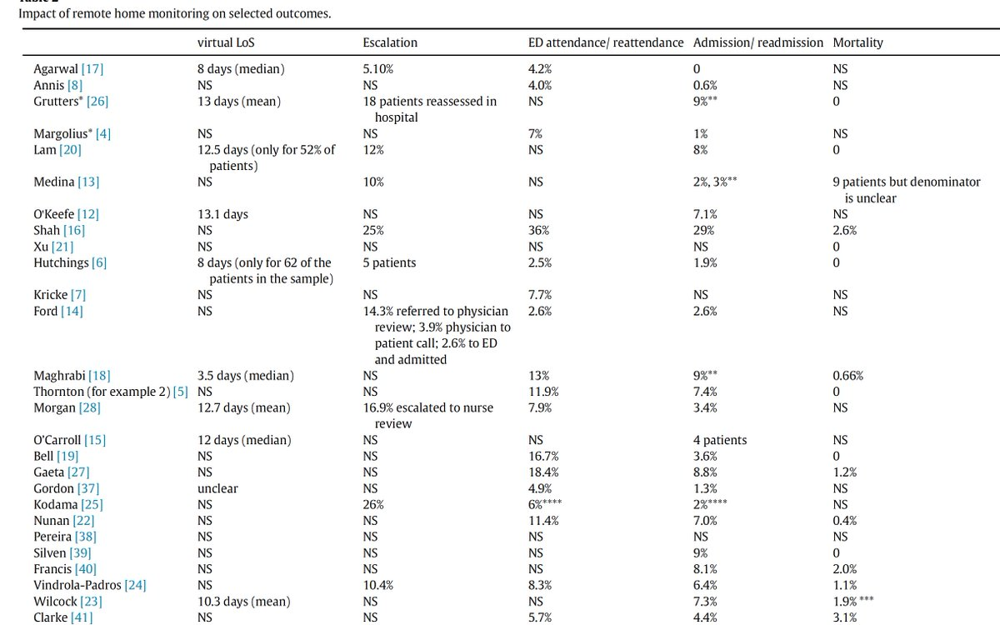</img></a>

---

<a href="https://twitter.com/erictopol/status/1415082250907963393" target="_blank" rel="noreferer">22:54 UCT</a>

It's pretty clear that people with solid organ transplant will benefit from a 3rd dose. Today, in contrast, some new data @TheLancet that 2-doses of mRNA vaccine may be adequate for protection in stem cell transplant patients https://www.thelancet.com/journals/lancet/article/PIIS0140-6736(21)01594-4/fulltext 

<a href="E6Nhqk8UYAIAwyl.jpg"  >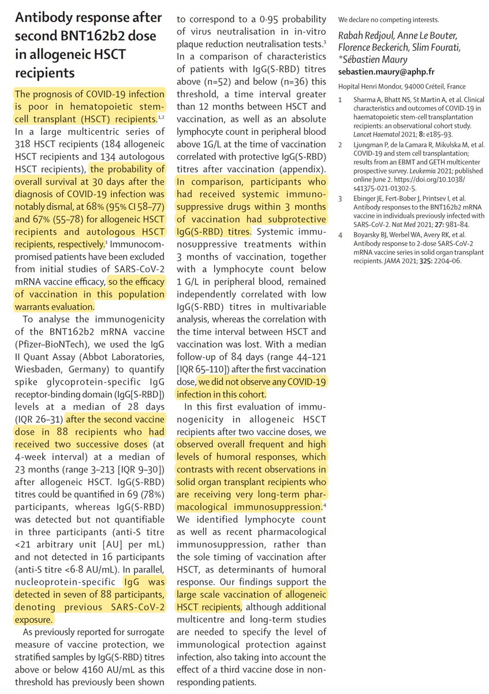</img></a>

---

<a href="https://twitter.com/erictopol/status/1415096408021995521" target="_blank" rel="noreferer">23:50 UCT</a>

Correction: despite multiple reports of 1,198 cases from Israel today @BNODesk,  @Worldometers, and elsewhere, it appears that combines 2 days and the actual number of cases today was ~726 (still an increase) 

<a href="E6Nt4qLVUAAEuvX.jpg"  ></img></a>

---

<a href="https://twitter.com/erictopol/status/1415098495942283264" target="_blank" rel="noreferer">23:59 UCT</a>

@BNODesk @Worldometers Thanks for the explanation and all the great tracking work you do for the pandemic throughout the world

