+++
title = "Tweets by Eric Topol July 14"
Summary = ""
tags = ["Twitter"]
category = "Twitter"
+++

---

<a href="https://twitter.com/erictopol/status/1415128028892467204" target="_blank" rel="noreferer">01:56 UCT</a>

I spoke to my colleagues in New Zealand today @AucklandUni.  Not a single community transmission &gt;120 days. No Delta. Envious.

A positive outlier cf many countries who achieved containment thru 2020 but now under Delta pressure
(S Korea, Vietnam, Thailand, Cambodia, others) 

<a href="E6OK6VkVUAAd7tF.jpg"  >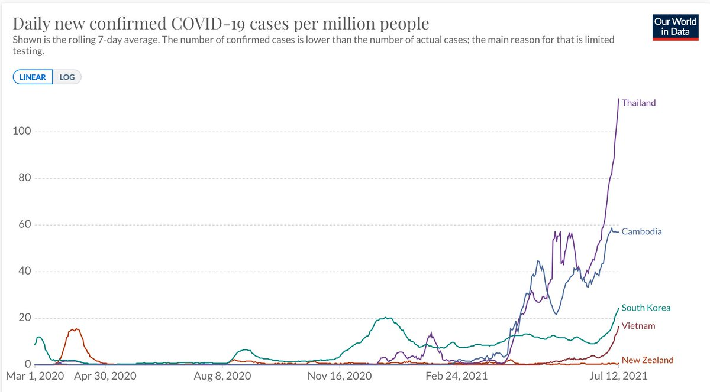</img></a>

---

<a href="https://twitter.com/erictopol/status/1415148244141678593" target="_blank" rel="noreferer">03:16 UCT</a>

The Delta variant impact in Arkansas  (US leading edge)  is resembling that of the UK's more with each passing day. 
Cases/100,000 here. Similar pattern for hospitalizations and deaths, too.
http://outbreak.info 

<a href="E6OcJdWUYAE4Xzm.jpg"  >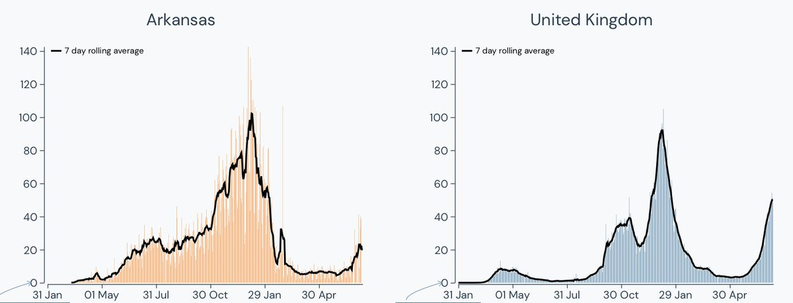</img></a>

---

<a href="https://twitter.com/erictopol/status/1415294577997582337" target="_blank" rel="noreferer">12:58 UCT</a>

Just published @Nature 
Discovery of a pan-sarbecovirus antibody (S2H97) with implications for both prevention/treatment and a vaccine that would be effective against #SARSCoV2 future variants, preempting immune escape
https://www.nature.com/articles/s41586-021-03807-6 

<a href="E6QirzfVIAQAAW-.jpg"  >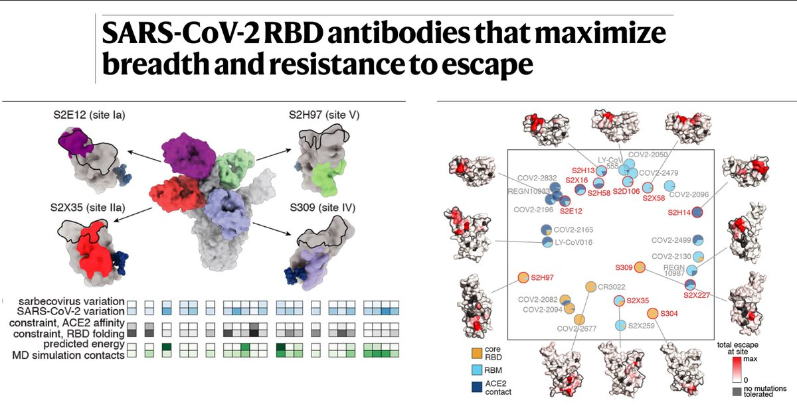</img></a>

---

<a href="https://twitter.com/erictopol/status/1415297187718696964" target="_blank" rel="noreferer">13:08 UCT</a>

Mix and match vaccines? 
2 doses AZ vs AZ and then Pfizer:
"BNT162b2 induced significantly higher frequencies of spike-specific CD4+ and CD8+ T cells and, in particular, high titers of neutralizing antibodies against the B.1.1.7, B.1.351 and P.1 variants" 
https://www.nature.com/articles/s41591-021-01449-9 

<a href="E6Qkn6AUUAMpdXA.jpg"  >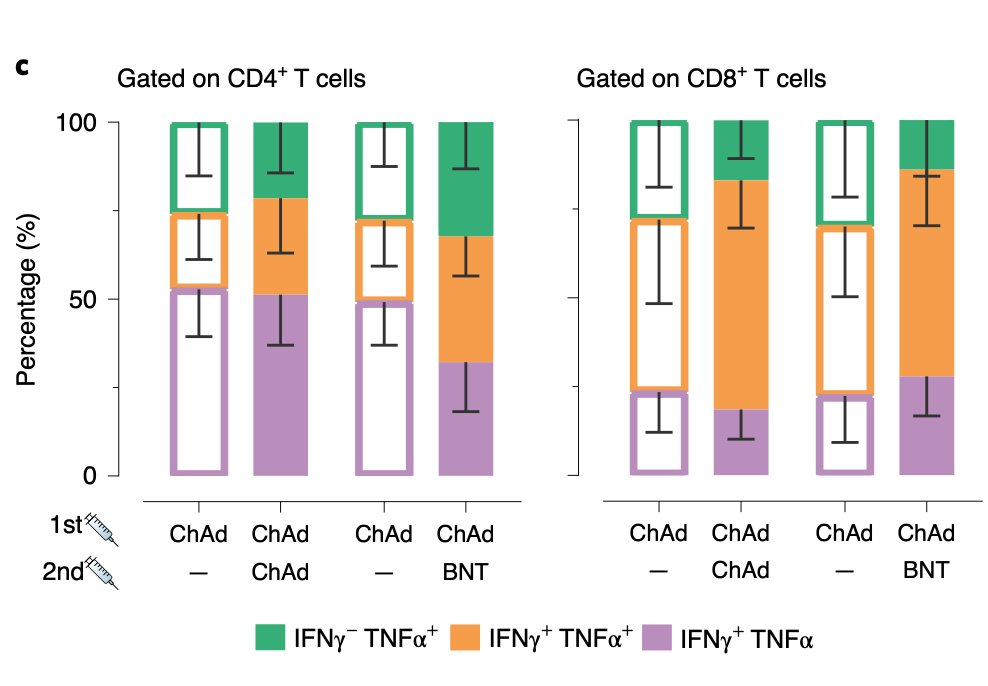</img></a><a href="E6Qk2rUVcAEEqcK.jpg"  >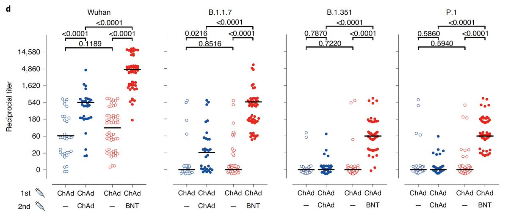</img></a>

---

<a href="https://twitter.com/erictopol/status/1415298537516982278" target="_blank" rel="noreferer">13:14 UCT</a>

The implications of the new report are notable. Whereas there were concerns previously about mixing doses of different vaccines, these results support important advantages for protection. 
One caveat is that the people who were studied were healthy, young HCWs

---

<a href="https://twitter.com/erictopol/status/1415307065665363968" target="_blank" rel="noreferer">13:47 UCT</a>

New cases are Delta (nearly 100%) in these 2 countries but the pattern of spread to date remains quite different
@OurWorldInData 

<a href="E6QtylkVIAoQgRE.jpg"  >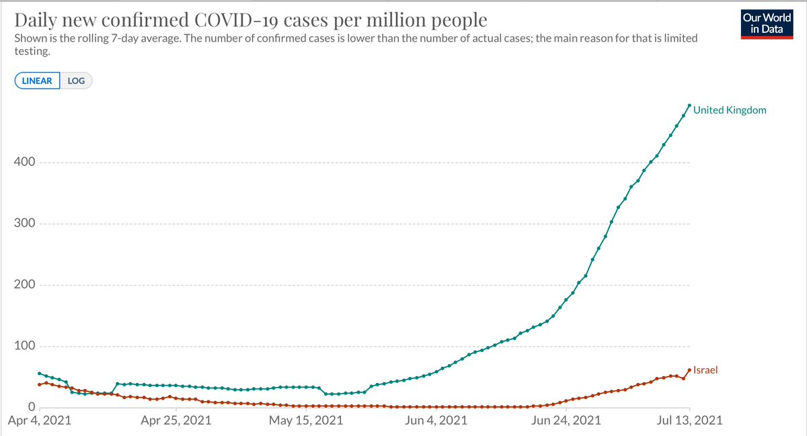</img></a>

---

<a href="https://twitter.com/erictopol/status/1415310735626760195" target="_blank" rel="noreferer">14:02 UCT</a>

Increasing calls around the world for mandatory vaccination for the healthcare workforce, and for all people who work at healthcare facilities
https://www.cambridge.org/core/journals/infection-control-and-hospital-epidemiology/article/multisociety-statement-on-covid19-vaccination-as-a-condition-of-employment-for-healthcare-personnel/690D1804B72FFF89C5FC0AED0043AD62 

<a href="E6QxNl3VgAQJWag.jpg"  >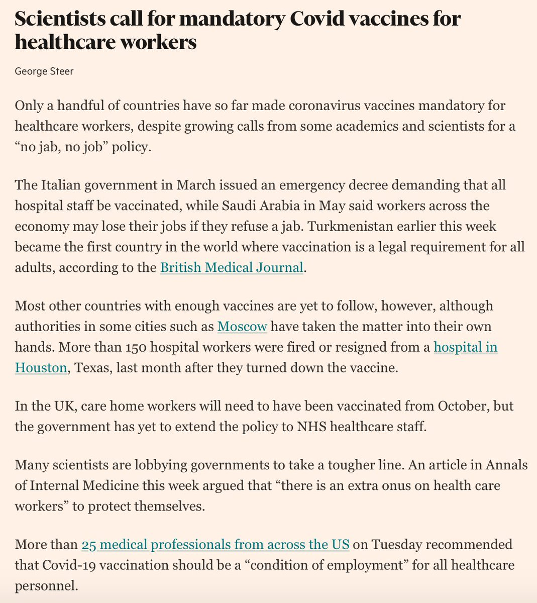</img></a><a href="E6QxZVWVIAITJf7.jpg"  >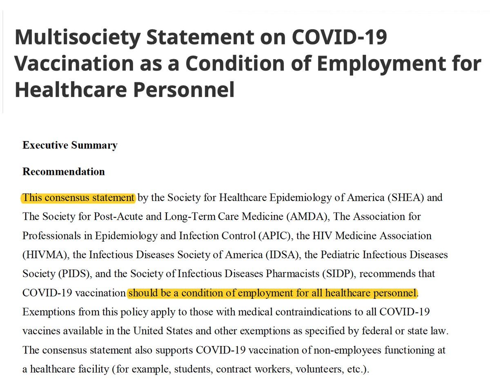</img></a>

---

<a href="https://twitter.com/erictopol/status/1415316058953568263" target="_blank" rel="noreferer">14:23 UCT</a>

The Delta rise in new cases is now diffuse throughout the US.
But states with the highest vaccination rates also happen to have the lowest hospitalizations in the country
https://www.nytimes.com/interactive/2021/us/covid-cases.html
(Arkansas|Missouri, 2 of the lowest vaccination % , are 17 and 20 per 100,000 people) 

<a href="E6Q1YvtVcAIdSSU.jpg"  >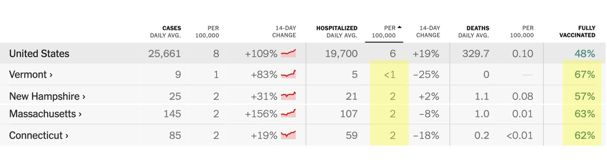</img></a>

---

<a href="https://twitter.com/erictopol/status/1415332118658306054" target="_blank" rel="noreferer">15:27 UCT</a>

@mraustin @jgjmanlv @OurWorldInData Agree, this is likely a key factor, but not the full explanation
https://twitter.com/EricTopol/status/1414397579119325184

---

<a href="https://twitter.com/erictopol/status/1415341017822162946" target="_blank" rel="noreferer">16:02 UCT</a>

Good review of the prior reports and trials in progress
https://www.nature.com/articles/d41586-021-01805-2
@Nature by @dyanilewis 

<a href="E6RM-KoVIAMUEz9.jpg"  >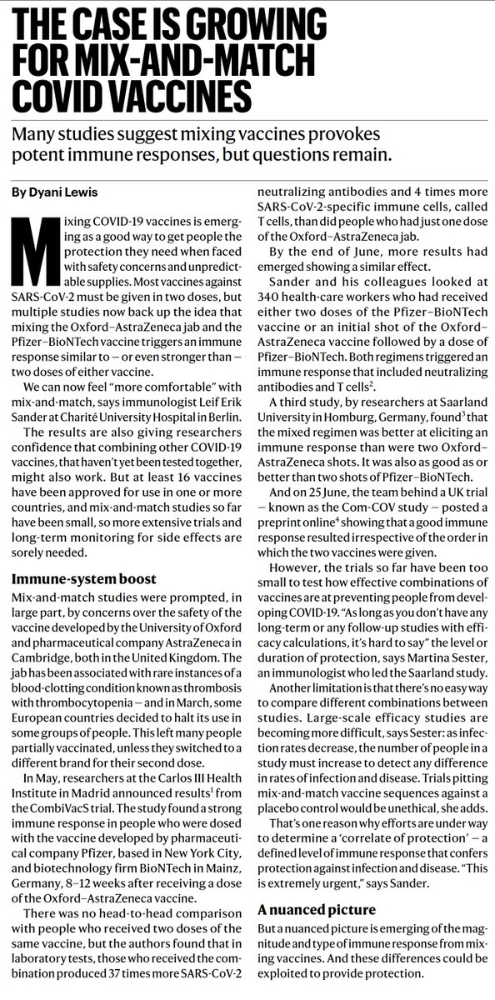</img></a><a href="E6RM_jbUUAEJONX.jpg"  >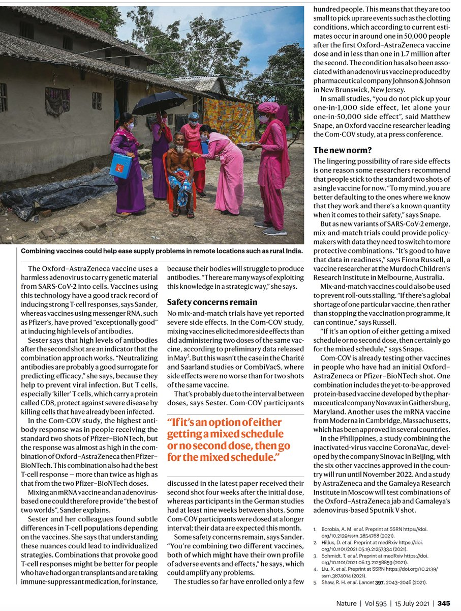</img></a>

---

<a href="https://twitter.com/erictopol/status/1415342839593005059" target="_blank" rel="noreferer">16:10 UCT</a>

Very good title (and article)
https://newrepublic.com/article/162975/alzheimers-fda-covid-vaccines by @m_scribe w/ @gregggonsalves 

<a href="E6ROxiQUUAEvhaw.jpg"  >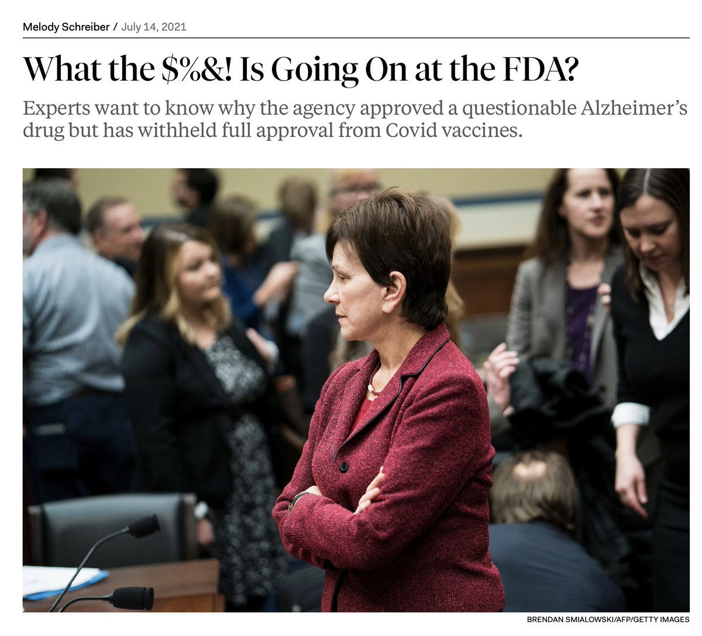</img></a>

---

<a href="https://twitter.com/erictopol/status/1415349533937004545" target="_blank" rel="noreferer">16:36 UCT</a>

The Delta deluge, likely coming to a country near you.
The UK crosses the 40,000 new case mark today 
(42,302) 
Were it not for vaccine protection, blunting the toll of severe illness, this would be a far worse situation 

<a href="E6RSE3JVoAAS5W3.jpg"  >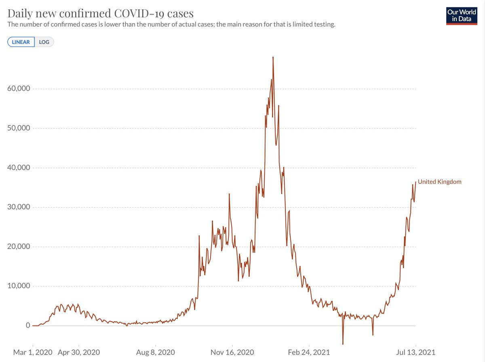</img></a>

---

<a href="https://twitter.com/erictopol/status/1415353838798721027" target="_blank" rel="noreferer">16:53 UCT</a>

Is AR a bellwether for Delta in the US?
Sharp increases in both places with corresponding rise in hospitalizations and deaths, both to lesser levels than in prior surges. Time in Delta dominant much less in AR 

<a href="E6RYqlPVcA4ezXV.jpg"  >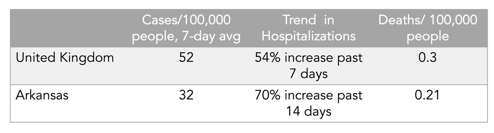</img></a>

---

<a href="https://twitter.com/erictopol/status/1415372236131758084" target="_blank" rel="noreferer">18:06 UCT</a>

Speaking of Arkansas, like UK, new record of cases for past several months
98.3% of people hospitalized were unvaccinated
https://www.arkansasonline.com/news/2021/jul/14/states-count-of-new-cases-jumps-1476/

---

<a href="https://twitter.com/erictopol/status/1415380943280295937" target="_blank" rel="noreferer">18:41 UCT</a>

RT @EricTopol: History will look back on the US, with its overabundant supply of potent and safe vaccines, and wonder how it didn't adequat…

---

<a href="https://twitter.com/erictopol/status/1415400815766867969" target="_blank" rel="noreferer">20:00 UCT</a>

Not a good sign when the largest county in the United States, with above average vaccination, is demonstrating a significant Delta hit. 
Over 99% of hospitalizations are in unvaccinated individuals.
https://www.nytimes.com/interactive/2021/us/los-angeles-california-covid-cases.html 

<a href="E6SClBkVgAIJI_2.jpg"  >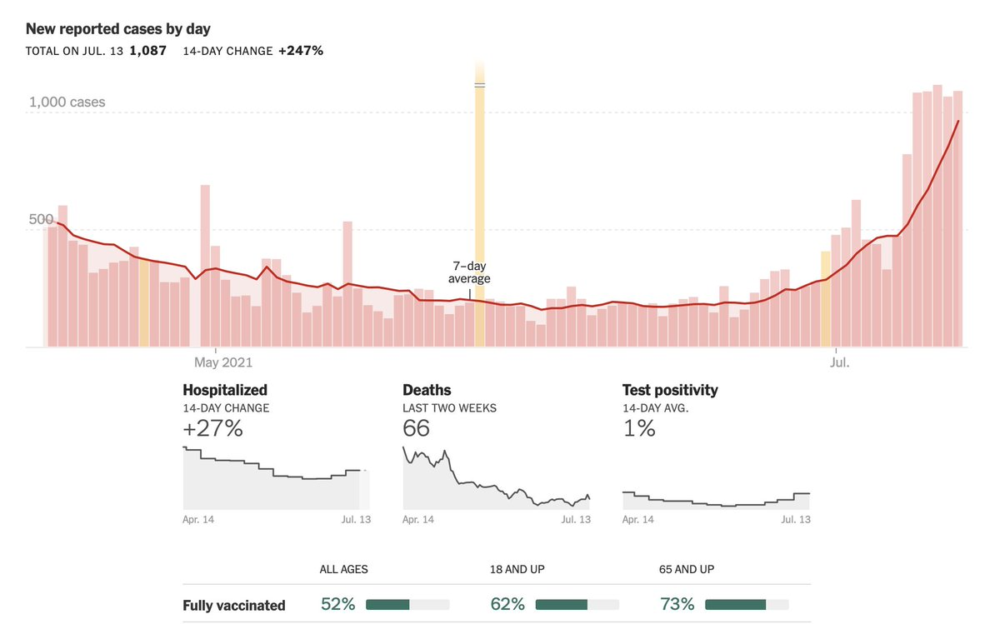</img></a>

---

<a href="https://twitter.com/erictopol/status/1415409825836531716" target="_blank" rel="noreferer">20:36 UCT</a>

With Canada vaccinating 1.2% of their population each day, and US &lt;0.2%, they will exceed US fully vaccinated in the next 2 days. 
1st dose, total population: Canada 70% vs US 55% 

<a href="E6SK8y4VcAM-8g8.jpg"  >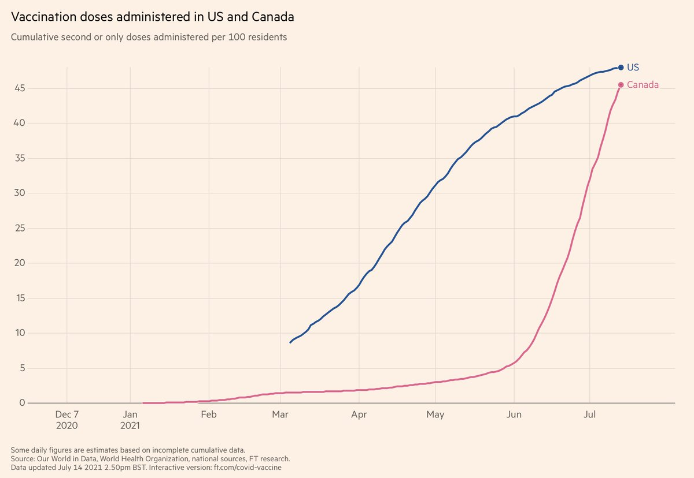</img></a><a href="E6SK3FbVgAA5PaZ.jpg"  >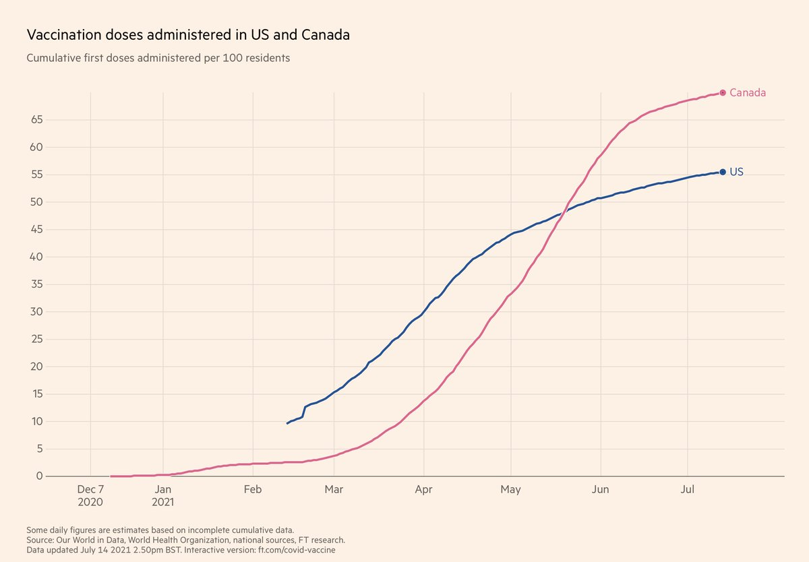</img></a>

---

<a href="https://twitter.com/erictopol/status/1415416033892986881" target="_blank" rel="noreferer">21:00 UCT</a>

Just out @NEJM 
New data for J&amp;J vaccine:
—High titers of neutralizing antibody to Delta variant, improvement in these levels seen over time
—The antibody and T cell response was durable for at lest 8 months
https://www.nejm.org/doi/full/10.1056/NEJMc2108829?query=featured_home 

<a href="E6SNi4RUcAIRwyQ.jpg"  >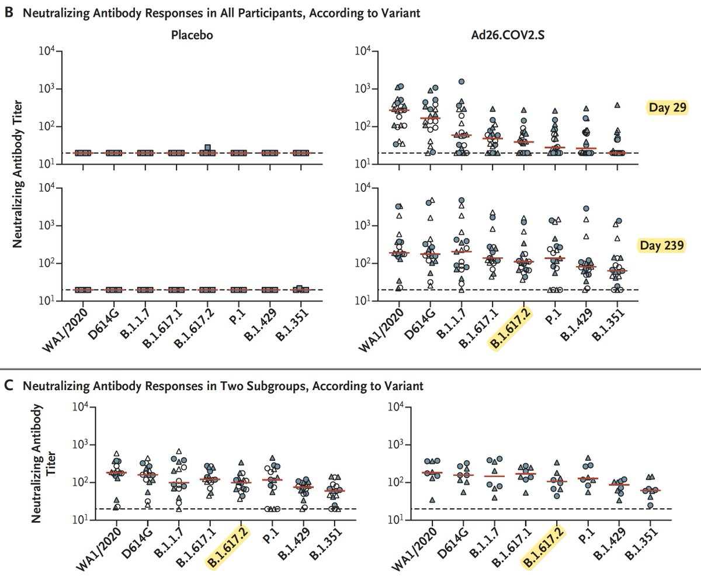</img></a>

---

<a href="https://twitter.com/erictopol/status/1415416995915259904" target="_blank" rel="noreferer">21:04 UCT</a>

New mix and match vaccine data today @NEJM for Moderna after AZ
Like the @Nature report below, significantly higher neutralizing antibody levels for AZ + Moderna compared with 2 doses AZ , and better protection vs the Beta (B.1.351) variant
https://www.nejm.org/doi/full/10.1056/NEJMc2110716?query=featured_home  https://twitter.com/EricTopol/status/1415297187718696964

<a href="E6SQuIyUYAEcvW5.jpg"  >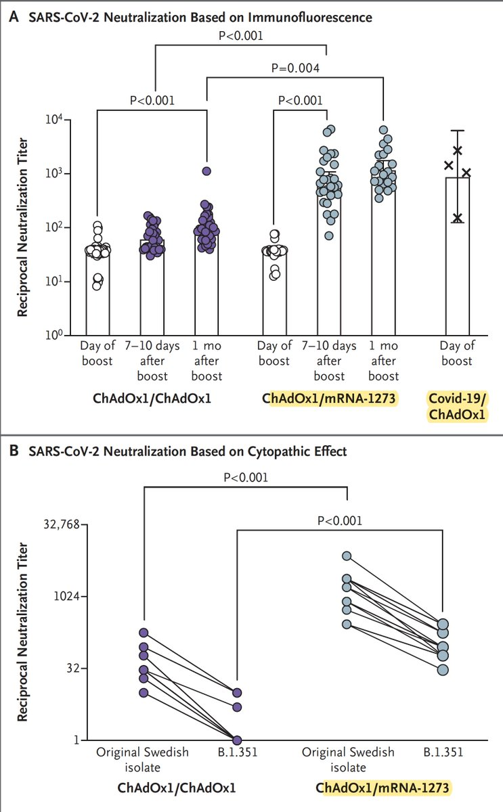</img></a>

---

<a href="https://twitter.com/erictopol/status/1415419714671546368" target="_blank" rel="noreferer">21:15 UCT</a>

Significant reduction in hospitalizations and deaths, and viral load,  in a randomized, placebo-controlled trial of combination monoclonal antibodies in high-risk outpatients with covid
https://www.nejm.org/doi/full/10.1056/NEJMoa2102685?query=featured_home 

<a href="E6SUEHJVEAE_B92.jpg"  >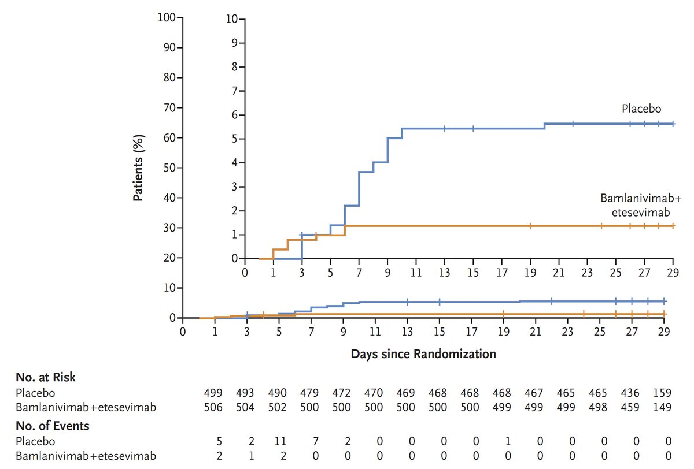</img></a>

---

<a href="https://twitter.com/erictopol/status/1415421375297241094" target="_blank" rel="noreferer">21:22 UCT</a>

@jimcramer That’s a good plan, Jim

---

<a href="https://twitter.com/erictopol/status/1415424134268416000" target="_blank" rel="noreferer">21:33 UCT</a>

That is Los Angeles.
This is Florida, which is at average levels of vaccination for the country, but experiencing a rapid rise in cases (today &gt;6,400) and hospitalizations https://www.nytimes.com/interactive/2021/us/florida-covid-cases.html 

<a href="E6SXhMMVEAMj6lu.jpg"  >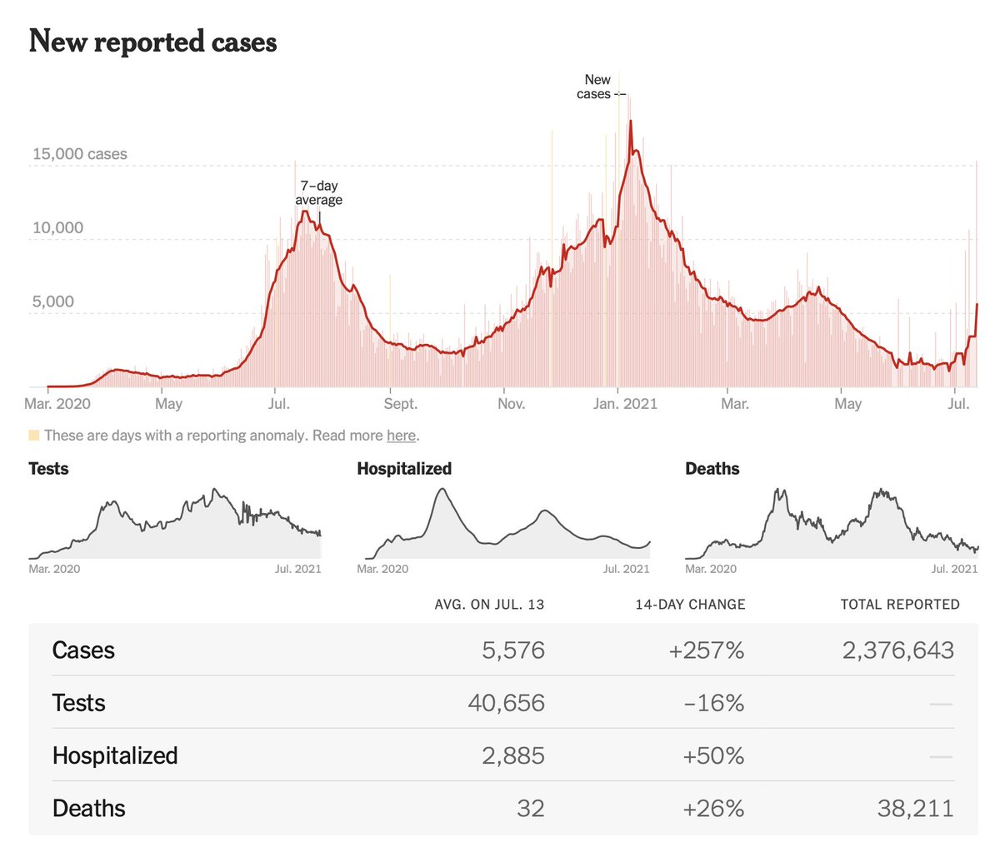</img></a>

---

<a href="https://twitter.com/erictopol/status/1415424798046392320" target="_blank" rel="noreferer">21:35 UCT</a>

The term "breakthrough" is not good for post-vaccine infections, most of which are without symptoms or mild.

But is does apply well to what Delta is doing in many parts of the US right now, and it's still early.  Breaking through an insufficient Delta immunity wall.

---

<a href="https://twitter.com/erictopol/status/1415454415209697283" target="_blank" rel="noreferer">23:33 UCT</a>

A UK national prospective study of brain involvement in children hospitalized with covid: wide range of neurologic complications in 51 kids
https://www.thelancet.com/journals/lanchi/article/PIIS2352-4642(21)00193-0/fulltext @LancetChildAdol 

<a href="E6SwDTDUUAIELLc.jpg"  >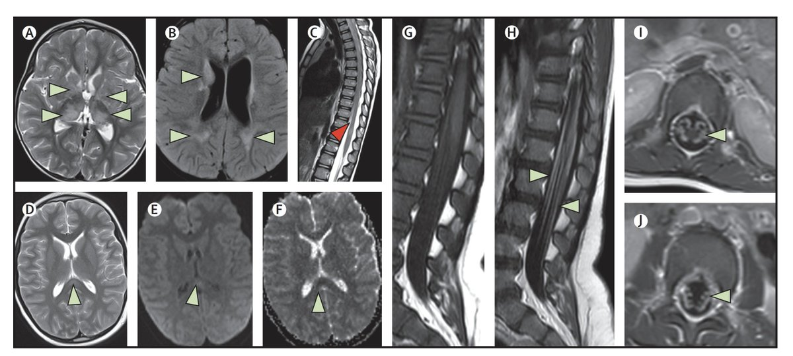</img></a><a href="E6S0RAlVgAEzqt8.jpg"  >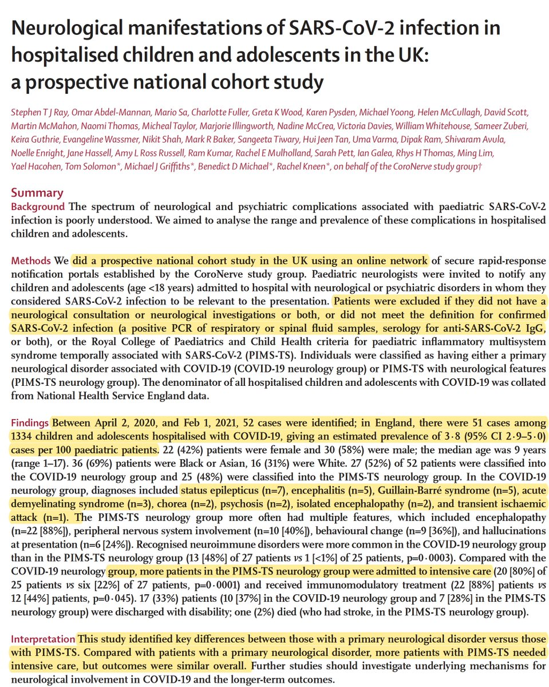</img></a>

---

<a href="https://twitter.com/erictopol/status/1415455534812073984" target="_blank" rel="noreferer">23:37 UCT</a>

This is long overdue. @PeterHotez has been leading a counter-offensive to disinformation on a daily basis. We both have been pleading US gov't officials for months to move aggressively on this. Finally 🙏 https://twitter.com/kaitlancollins/status/1415348599567831043

