+++
title = "Tweets by Eric Topol July 15"
Summary = ""
tags = ["Twitter"]
category = "Twitter"
+++

---

<a href="https://twitter.com/erictopol/status/1415473237186646017" target="_blank" rel="noreferer">00:48 UCT</a>

We needed some good news for this vaccine. This is it.
No sign a booster vs Delta is necessary (study is limited by small number of participants) 
@FT by @nikasgari 

<a href="E6TFTFgVIAEhkbe.jpg"  >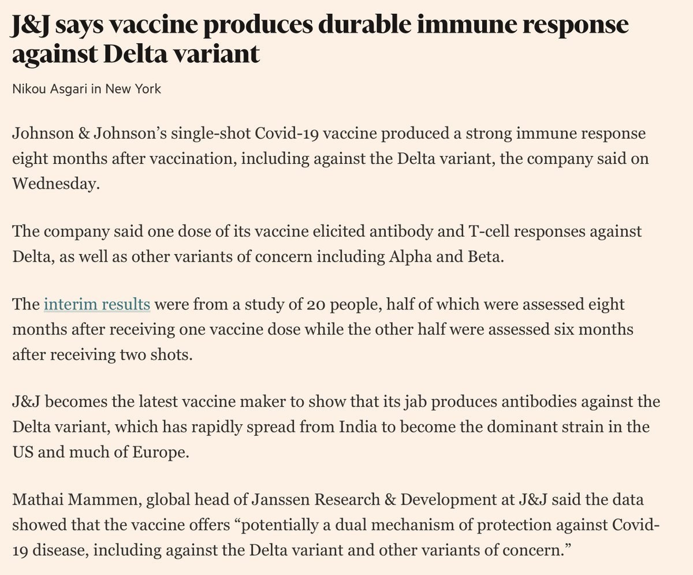</img></a>

---

<a href="https://twitter.com/erictopol/status/1415475734135541765" target="_blank" rel="noreferer">00:58 UCT</a>

There are places in the epicenter of the US Delta wave with vaccination rates as low as 15%
https://theuscovidatlas.org/map 

<a href="E6THhNuUYAQpmaY.jpg"  >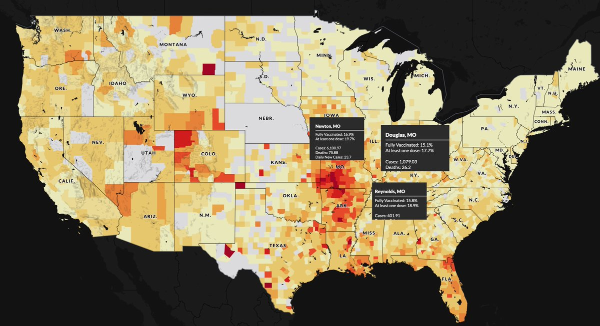</img></a>

---

<a href="https://twitter.com/erictopol/status/1415665138414194692" target="_blank" rel="noreferer">13:30 UCT</a>

Does the Delta variant cause more severe illness than prior versions of the virus? @DLeonhardt has a great explainer
Short answer: No
https://www.nytimes.com/2021/07/15/briefing/delta-variant-spread-contagious.html?action=click&module=Top%20Stories&pgtype=Homepage w/ @PaulSaxMD @BillHanage @AaronRichterman @RebeccaWurtz @Bob_Wachter 

<a href="E6Vygo3UYAQE-Md.jpg"  >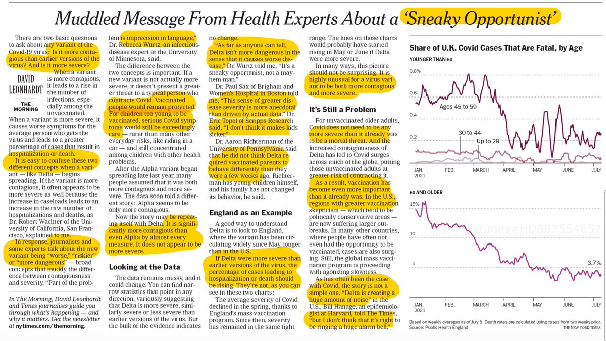</img></a>

---

<a href="https://twitter.com/erictopol/status/1415669685819830273" target="_blank" rel="noreferer">13:48 UCT</a>

@DFisman @notdred @DLeonhardt @PaulSaxMD @BillHanage @AaronRichterman @RebeccaWurtz @Bob_Wachter I think it would be good to acknowledge that full adjustment is very difficult (i.e.there still is uncertainty) and that your report did not have actual sequencing data

---

<a href="https://twitter.com/erictopol/status/1415671040441675785" target="_blank" rel="noreferer">13:54 UCT</a>

Yes, for certain there are and will be more deaths and more hospitalizations than prior virus versions. And more breakthrough infections after vaccines. But all of that can be explained by its very high transmissibility and immune evasiveness without invoking heightened virulence

---

<a href="https://twitter.com/erictopol/status/1415673269328379911" target="_blank" rel="noreferer">14:03 UCT</a>

Yes, Delta is as bad a killer as Alpha. It's a horrible strain, the worst we've seen, that is wreaking havoc all over the world, no question. And more to come as it becomes globally dominant. But we don't have to make it worse than it already is without adequate data and proof

---

<a href="https://twitter.com/erictopol/status/1415677526689517568" target="_blank" rel="noreferer">14:19 UCT</a>

Parallel lines suggest replication is in the works.
Also seen with deaths. 

<a href="E6V-201VgAQuxDU.jpg"  >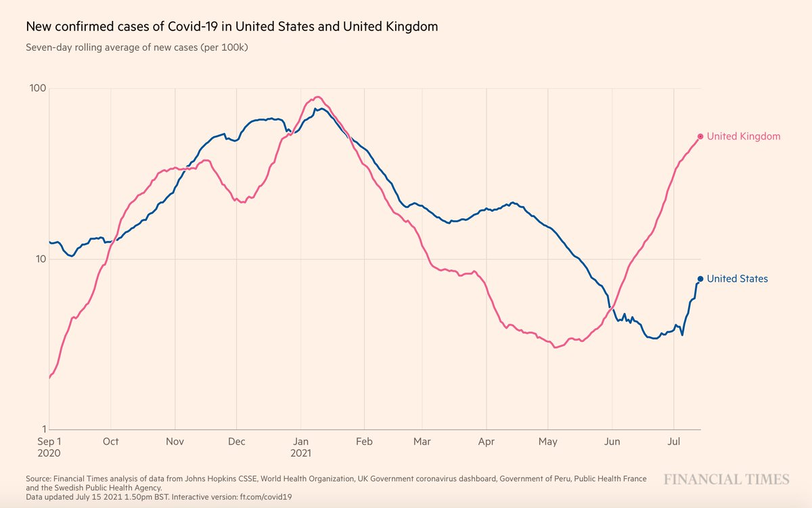</img></a>

---

<a href="https://twitter.com/erictopol/status/1415680028021387267" target="_blank" rel="noreferer">14:29 UCT</a>

If you haven't been following Delta in the UK closely, it  looks like this, now &gt;50 cases/100,000 people and still rising despite some slowing of growth 

<a href="E6WBaynUYAEknIX.jpg"  >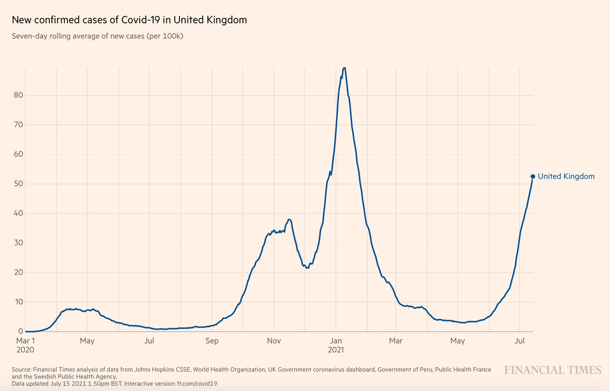</img></a>

---

<a href="https://twitter.com/erictopol/status/1415681816606887944" target="_blank" rel="noreferer">14:37 UCT</a>

The main mitigating and positive factor is the weaker link between cases and hospitalizations/deaths now that there are a high level of vaccinations compared with prior waves
https://www.economist.com/graphic-detail/2021/07/12/england-faces-the-sternest-test-of-its-vaccination-strategy?utm_campaign=editorial-social&utm_medium=social-organic&utm_source=twitter&%3Ffsrc%3Dscn%2F=tw%2Fdc 

<a href="E6WDBHKUcAc8Q5q.jpg"  >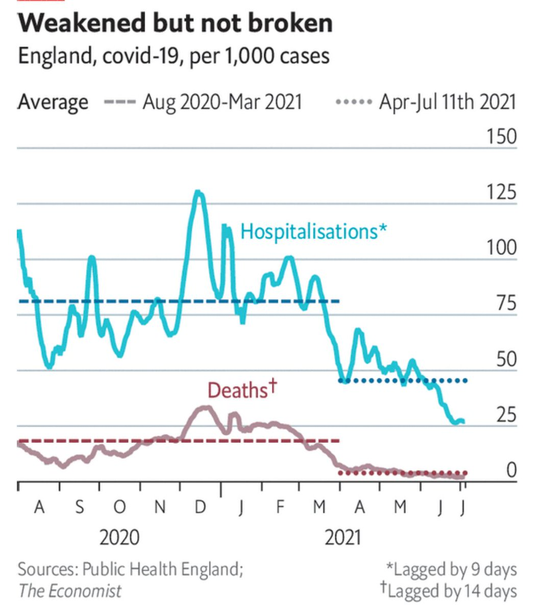</img></a>

---

<a href="https://twitter.com/erictopol/status/1415690014474727435" target="_blank" rel="noreferer">15:09 UCT</a>

New @CellRepMed 
The durable immune response to covid lasting at least 8 months, with memory B cells and polyfunctional T cells
https://www.cell.com/cell-reports-medicine/fulltext/S2666-3791(21)00203-2
@fredhutch @EmoryVaccineCtr 

<a href="E6WJp6mVoAUYTcr.jpg"  >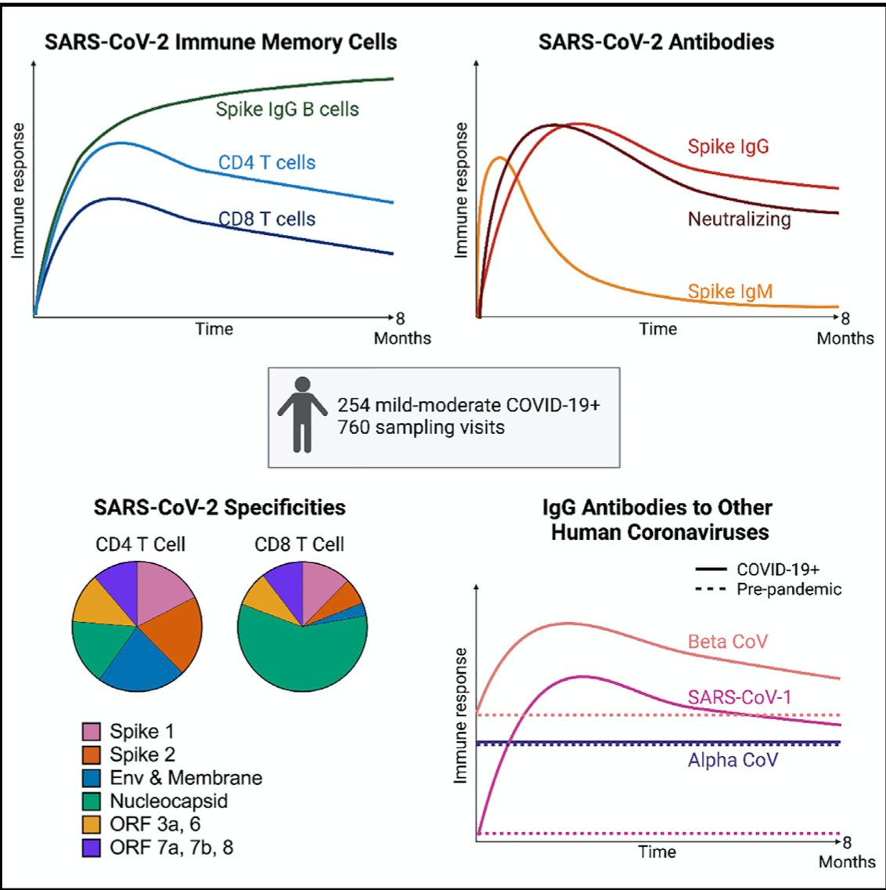</img></a>

---

<a href="https://twitter.com/erictopol/status/1415695579569524738" target="_blank" rel="noreferer">15:31 UCT</a>

The Netherlands has now caught up to the UK for its Delta wave and both countries had new record cases today. 
UK 48,553, Netherlands 11,064 

<a href="E6WPWb9VEAUaL1D.jpg"  >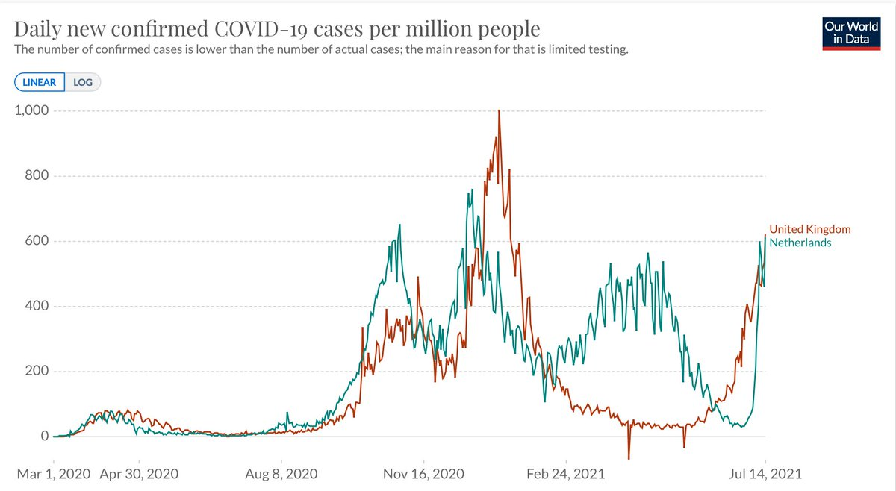</img></a>

---

<a href="https://twitter.com/erictopol/status/1415697130425970691" target="_blank" rel="noreferer">15:37 UCT</a>

In the annals of going vertical in the pandemic, this is notable 

<a href="E6WQ_Y8UcAA1-pf.jpg"  >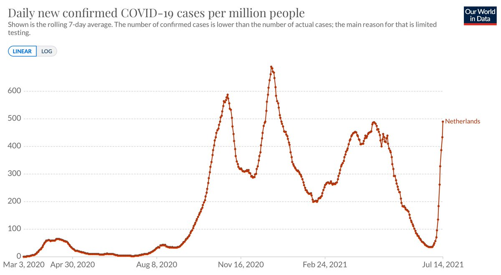</img></a>

---

<a href="https://twitter.com/erictopol/status/1415701231859761154" target="_blank" rel="noreferer">15:54 UCT</a>

@Surgeon_General @CT_Bergstrom Reminds me of our conversation back on May 10th, Vivek. So glad you are on it

---

<a href="https://twitter.com/erictopol/status/1415716214475681792" target="_blank" rel="noreferer">16:53 UCT</a>

@aihsan_goker In full agreement
https://twitter.com/erictopol/status/1406648039725359107

---

<a href="https://twitter.com/erictopol/status/1415718995383123973" target="_blank" rel="noreferer">17:04 UCT</a>

Why is this noteworthy?
—The UK's case/100K (and still on this rise) translates to &gt;200,000 cases in the US
—UK's testing is 2X US, a country that is 1/5th population
—See @AdamJKucharski's thread for why this is happening https://twitter.com/AdamJKucharski/status/1415587167863283713 https://twitter.com/EricTopol/status/1415677526689517568

---

<a href="https://twitter.com/erictopol/status/1415720494637084672" target="_blank" rel="noreferer">17:10 UCT</a>

Rapid case growth is quite consistent across countries with Delta variant dominance 
(log-plot, best way to see this) 

<a href="E6WmDjjVUAUbX5U.jpg"  >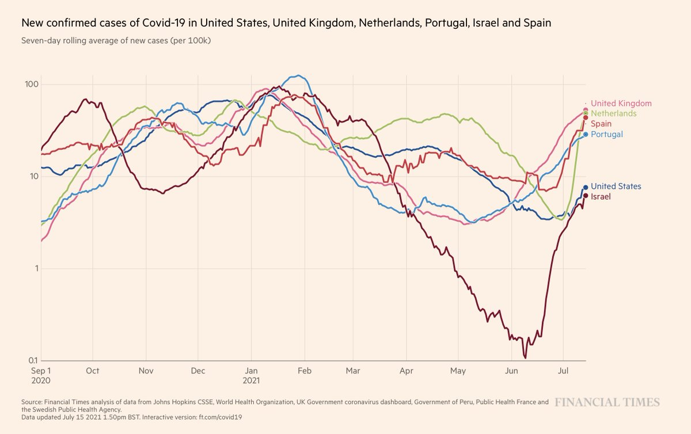</img></a>

---

<a href="https://twitter.com/erictopol/status/1415732633305190405" target="_blank" rel="noreferer">17:58 UCT</a>

A big day for 3D protein structure prediction via #AI deep learning. Down to atomic accuracy w/ open-source code,  methodology @nature @ScienceMagazine 
@DeepMind @UWproteindesign @demishassabis @UWBiochemistry 
https://www.nature.com/articles/s41586-021-03819-2
https://science.sciencemag.org/content/early/2021/07/14/science.abj8754 

<a href="E6Ws3kRUcAI6lEp.jpg"  >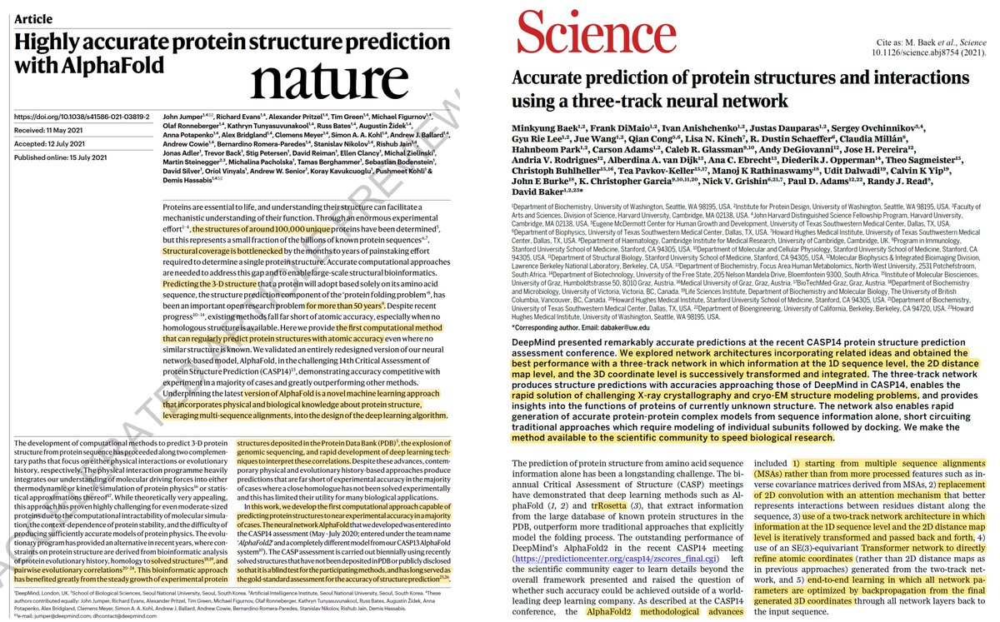</img></a>

---

<a href="https://twitter.com/erictopol/status/1415735058338484225" target="_blank" rel="noreferer">18:08 UCT</a>

Good summary of the 2 methods, AlphaFold and RoseTTA-fold, that have big implications for catalyzing and advancing genomics, drug discovery, protein engineering and beyond
https://science.sciencemag.org/content/373/6552/262.summary @ScienceMagazine by @epennisi 

<a href="E6WygZ7VcAAS14l.jpg"  >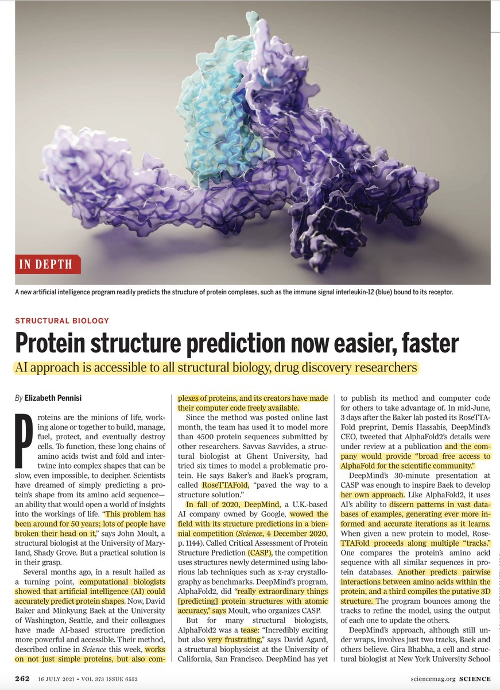</img></a><a href="E6WyhoWVEAIqDDM.jpg"  >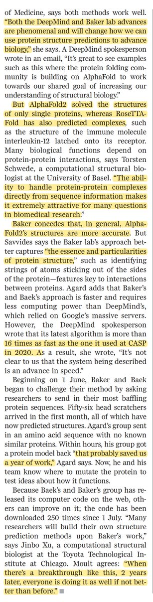</img></a>

---

<a href="https://twitter.com/erictopol/status/1415736014639820803" target="_blank" rel="noreferer">18:12 UCT</a>

The anti-vax delusion
https://www.economist.com/united-states/2021/07/17/the-republican-anti-vax-delusion

---

<a href="https://twitter.com/erictopol/status/1415736012869799937" target="_blank" rel="noreferer">18:12 UCT</a>

Our covid times :-)
by @BillBramhall 

<a href="E6WzwVfVIAA5-_a.jpg"  >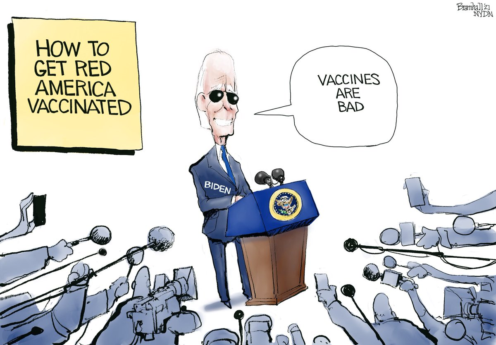</img></a>

---

<a href="https://twitter.com/erictopol/status/1415737852529238019" target="_blank" rel="noreferer">18:19 UCT</a>

Hey, that's our study!
@TheEconomist on our @JAMANetworkOpen paper on prolonged heart rate (79 days) after covid thru @fitbit and wrist sensors, @jmradin @GiorgioQuer @SteveSteinhubl @ScrippsRTI @scrippsresearch #LongCovid
https://www.economist.com/graphic-detail/2021/07/17/a-new-study-using-wearable-devices-could-help-to-define-long-covid 

<a href="E6W2DnfVIAUB3ab.jpg"  >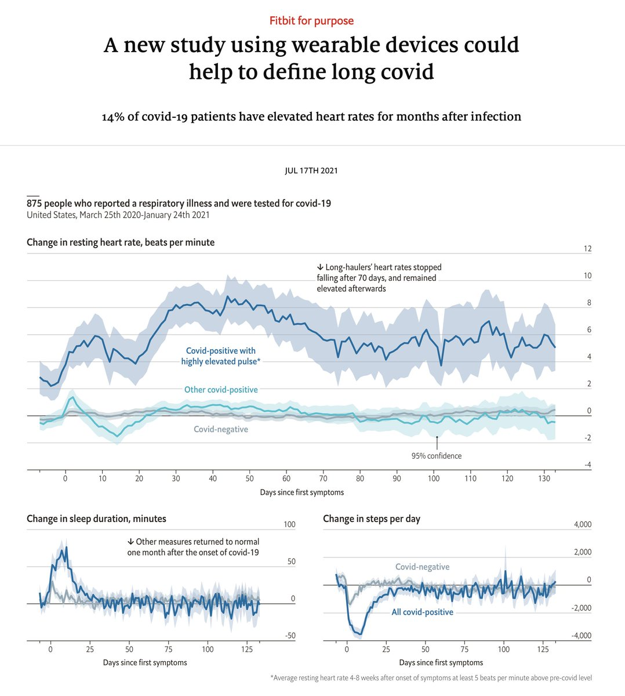</img></a>

---

<a href="https://twitter.com/erictopol/status/1415737859252768770" target="_blank" rel="noreferer">18:19 UCT</a>

Link to paper
https://jamanetwork.com/journals/jamanetworkopen/fullarticle/2781687
and text of Economist piece 

<a href="E6W1uTYVoAEWb28.png"  >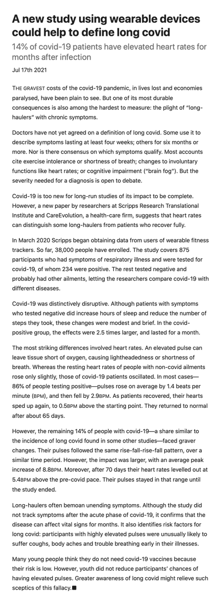</img></a>

---

<a href="https://twitter.com/erictopol/status/1415740451248762883" target="_blank" rel="noreferer">18:30 UCT</a>

@AaronRichterman @trvrb @famulare_mike @DLeonhardt @PaulSaxMD @BillHanage @RebeccaWurtz @Bob_Wachter Great point, Aaron.
I find making statistical adjustments for the 134 hospitalized cases a strain, to say the least (not a pun)
Similar issues with the other reports (Canada, Singapore) 

<a href="E6W4IhJUYAIOE27.png"  >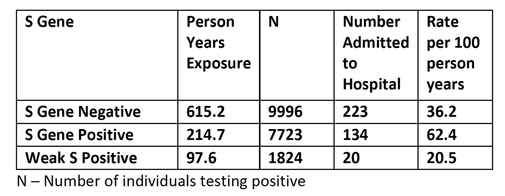</img></a>

---

<a href="https://twitter.com/erictopol/status/1415768722434793474" target="_blank" rel="noreferer">20:22 UCT</a>

The other graphic in the @TheEconomist piece
The @NYTScience coverage by @EmilyAnthes 
on the 79-day average it took for resting heart rate to come back to normal after covid
https://www.nytimes.com/2021/07/07/health/covid-fitbit-wearables.html?searchResultPosition=1
(from a paper rejected by 3 journals before accepted) 

<a href="E6XQlzRVUAAWuRv.jpg"  >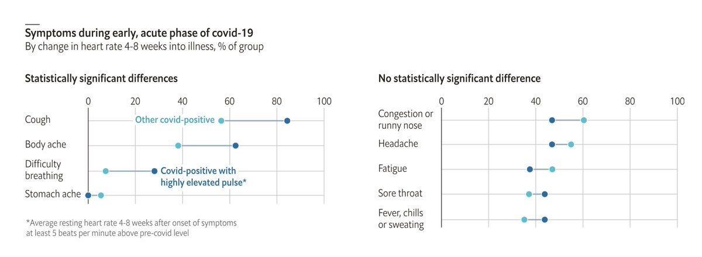</img></a><a href="E6XRascUYAEKzKQ.jpg"  >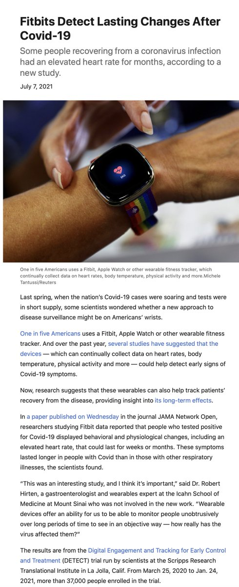</img></a><a href="E6XRyLeUcAAQWlG.jpg"  >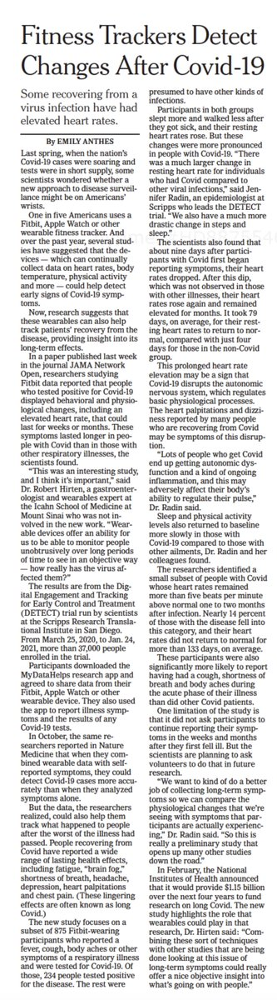</img></a>

---

<a href="https://twitter.com/erictopol/status/1415792928295845889" target="_blank" rel="noreferer">21:58 UCT</a>

Would suggest this as the prudent country-wide approach as the Delta hit is very diffuse, now over 20 states with &gt;100% increase in past 2 weeks and that's even occurring in 2 of the most vaccinated (VT and MA) 😷 indoors
https://www.nytimes.com/interactive/2021/us/covid-cases.html  https://twitter.com/ZekeJMiller/status/1415789532377763848

<a href="E6Xns4RVoAAIb8W.jpg"  >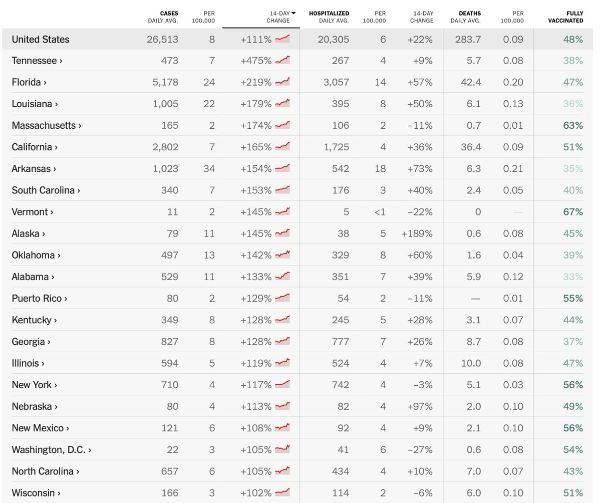</img></a>

---

<a href="https://twitter.com/erictopol/status/1415804770674122752" target="_blank" rel="noreferer">22:45 UCT</a>

New @TheLancet 
Waning of spike antibody after 2nd dose of vaccines, btwn 20-70 days 
2-fold with Pfizer/@BioNTech_Group 
5-fold with AZ
https://www.thelancet.com/journals/lancet/article/PIIS0140-6736(21)01642-1/fulltext
Clinical correlation uncertain, not assessed: breakthroughs, or memory B cells /T cells, as part of vaccine response 

<a href="E6XxFKdVcAEQjkG.jpg"  >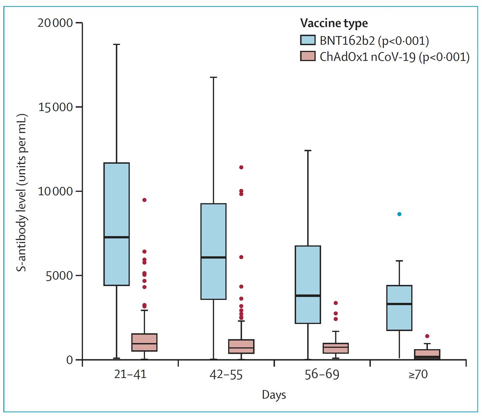</img></a>

---

<a href="https://twitter.com/erictopol/status/1415804778580307968" target="_blank" rel="noreferer">22:45 UCT</a>

Full text and more granular data on the decline by vaccine and demographics from supplementary material 

<a href="E6XyW-6UUAIUiIT.jpg"  >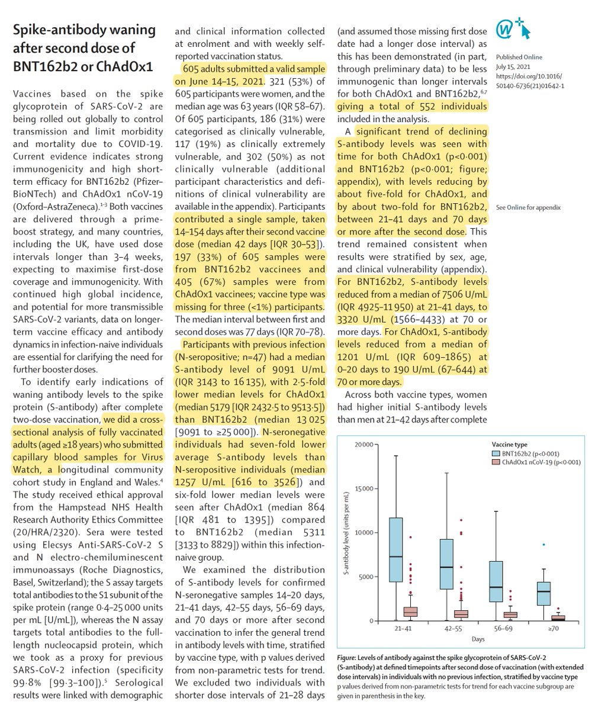</img></a><a href="E6XyYzoVIAsVWxk.jpg"  >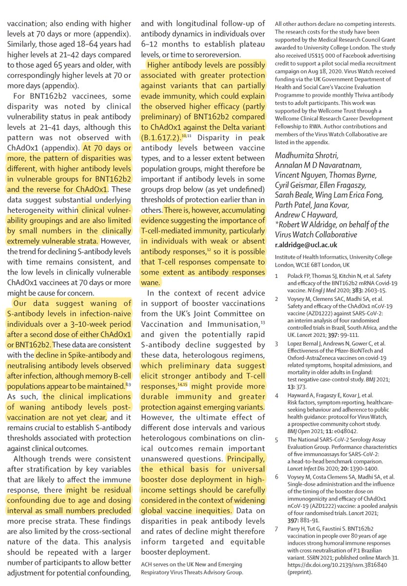</img></a><a href="E6Xya6MUcAAIE04.png"  >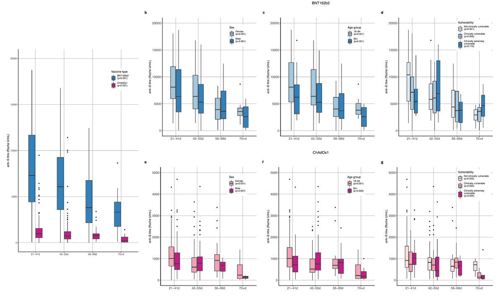</img></a>

---

<a href="https://twitter.com/erictopol/status/1415807713515171841" target="_blank" rel="noreferer">22:57 UCT</a>

The vaccine-induced immune response, a comparison of mRNA (Pfizer/BioNTech) with inactivated virus (CoronaVac), shows marked differences "that could translate into substantial differences in vaccine effectiveness."  Just out @LancetMicrobe 
https://www.thelancet.com/journals/lanmic/article/PIIS2666-5247(21)00177-4/fulltext @weywenlim 

<a href="E6X0REEVkAAKokB.jpg"  >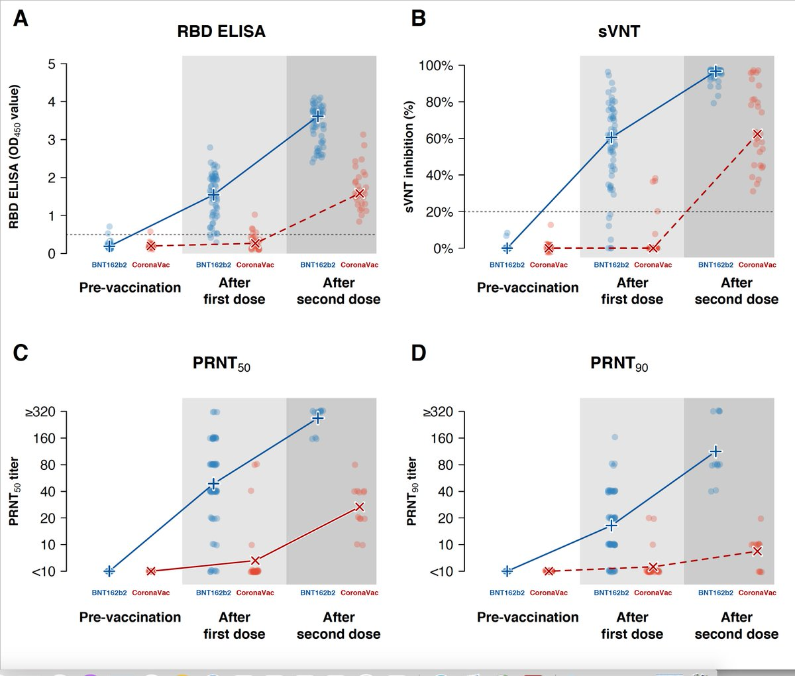</img></a>

---

<a href="https://twitter.com/erictopol/status/1415808852851793920" target="_blank" rel="noreferer">23:01 UCT</a>

Just published @TheLancet 
A large prospective report of over 73,000 people hospitalized with covid in &gt;300 UK facilities shows that half had complications, even in young, particularly kidney, lung, systemic, heart, neurological and GI
https://www.thelancet.com/journals/lancet/article/PIIS0140-6736(21)00799-6/fulltext 

<a href="E6XwF6sUUAEmmd8.jpg"  >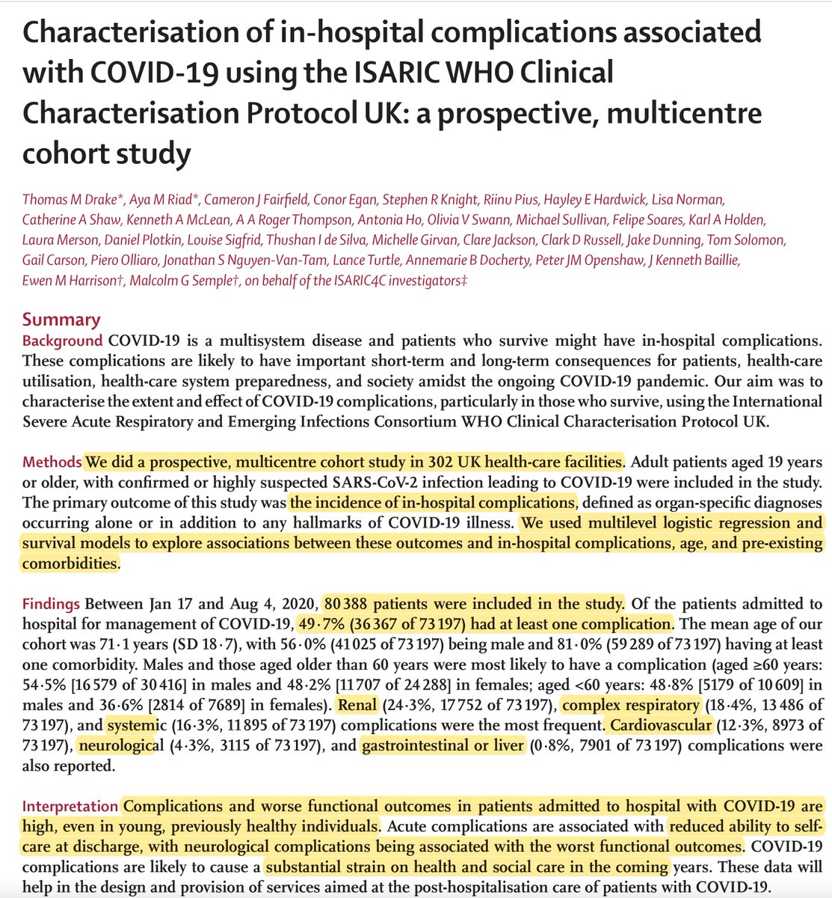</img></a><a href="E6XvWZ_UcAEu1fZ.jpg"  >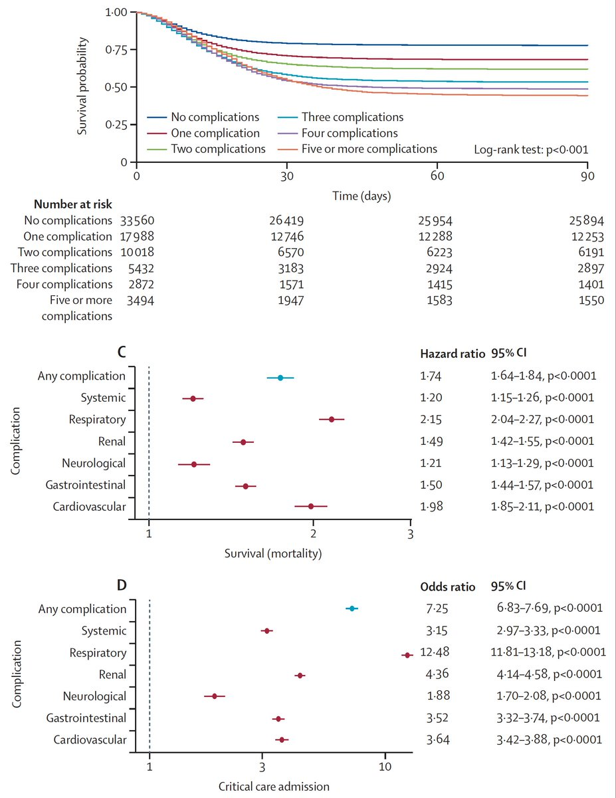</img></a>

---

<a href="https://twitter.com/erictopol/status/1415817617349087233" target="_blank" rel="noreferer">23:36 UCT</a>

This thread by @angie_rasmussen is far better and more instructive than my 1 sentence summary
https://twitter.com/angie_rasmussen/status/1415672461111271424

