+++
title = "Tweets by Eric Topol July 16"
Summary = ""
tags = ["Twitter"]
category = "Twitter"
+++

---

<a href="https://twitter.com/erictopol/status/1415841910971723780" target="_blank" rel="noreferer">01:13 UCT</a>

Instead of achieving population-level (herd) immunity, whereby &gt;70% vaccinated wind up protecting those w/o immunity, the very high contagiousness of Delta has flipped the model—"un-herd" immunity—the unvaccinated are infecting each other and the vaccinated.

---

<a href="https://twitter.com/erictopol/status/1415881589112725506" target="_blank" rel="noreferer">03:50 UCT</a>

I'm all for reassurance and vaccines are holding up well to Delta, but this op-ed needs a little editing
https://www.wsj.com/articles/delta-variant-hospitalizations-covid-coronavirus-vaccine-immunity-11626374706?mod=opinion_lead_pos5 by @LeslieBienen @MonicaGandhi9 
It's early in Delta dominance; hospitalizations are starting to surge among non-vaccinated. 
And there's #LongCovid 

<a href="E6Y4SesVIAETzkd.jpg"  >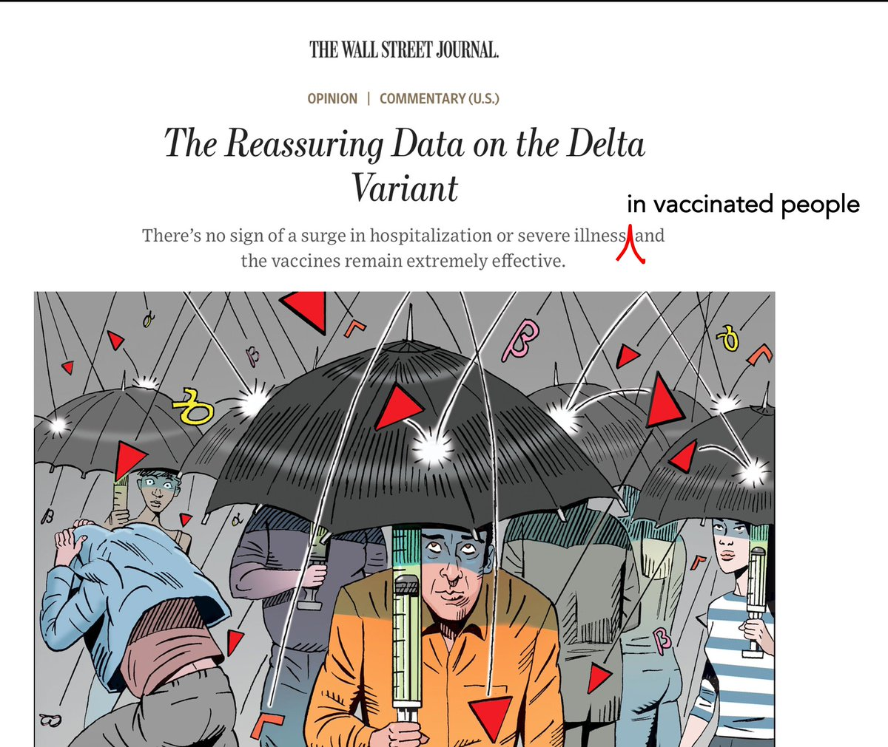</img></a><a href="E6Y3pr6VkAEyk0b.jpg"  >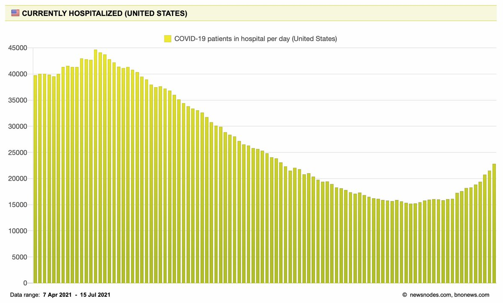</img></a>

---

<a href="https://twitter.com/erictopol/status/1415901319190118403" target="_blank" rel="noreferer">05:09 UCT</a>

@MonicaGandhi9 Thanks!

---

<a href="https://twitter.com/erictopol/status/1416026533534130180" target="_blank" rel="noreferer">13:26 UCT</a>

Covid (δ) in California (and the US)
X  Bad
✓ Good 

<a href="E6a8XToVIAM7U-r.jpg"  >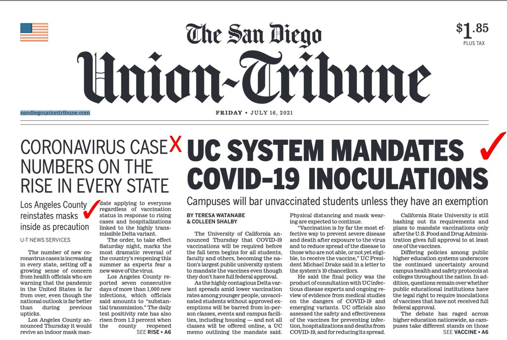</img></a>

---

<a href="https://twitter.com/erictopol/status/1416029202613096448" target="_blank" rel="noreferer">13:37 UCT</a>

@TheRickWilson @PreetBharara @washingtonpost @PostOpinions today 

<a href="E6a-3ndVIAAYMni.jpg"  >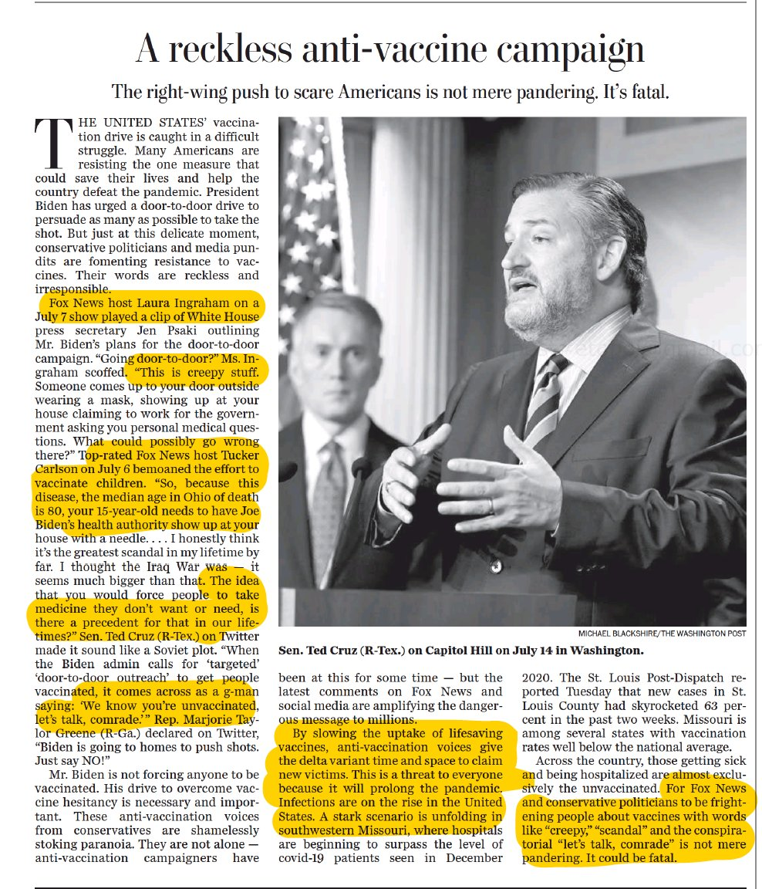</img></a>

---

<a href="https://twitter.com/erictopol/status/1416030348480184331" target="_blank" rel="noreferer">13:41 UCT</a>

Independent replication for these differences via head-to-head comparison for immune response
https://papers.ssrn.com/sol3/papers.cfm?abstract_id=3884943 

<a href="E6a_0cRUcAIbqIH.jpg"  >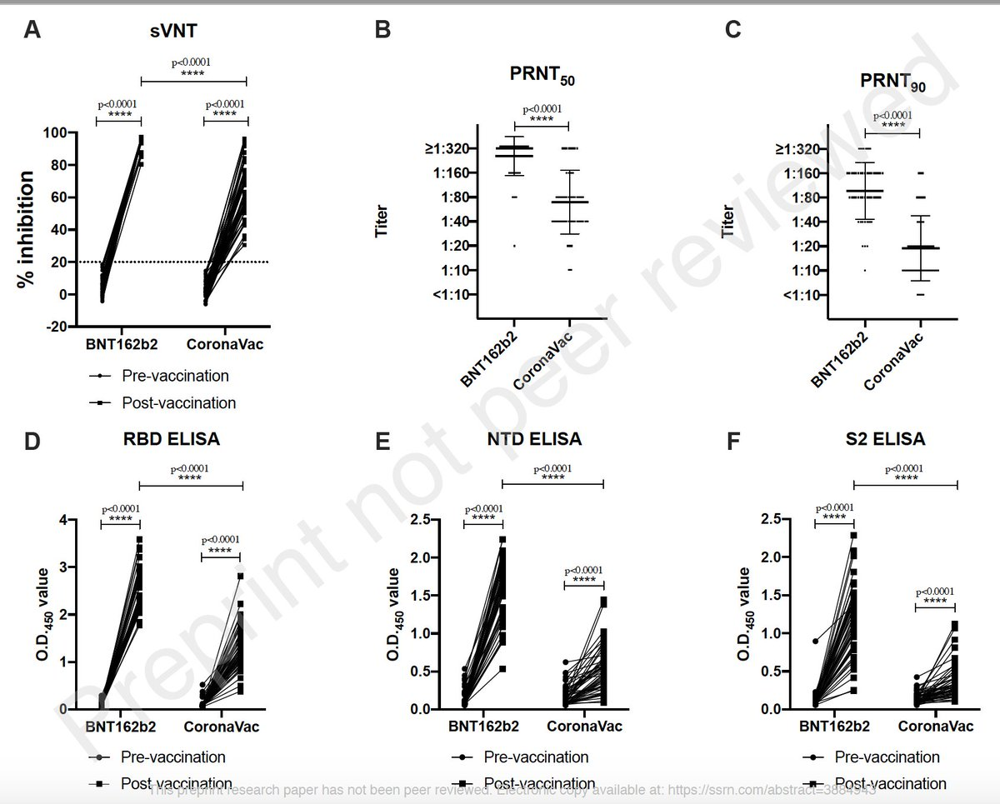</img></a>

---

<a href="https://twitter.com/erictopol/status/1416036156144164868" target="_blank" rel="noreferer">14:05 UCT</a>

The horrific tragedy in Indonesia, population 271 million, 4th largest in the world, &gt;90% Delta, 15% 1st dose vaccination, new records of cases and deaths again today
https://www.wsj.com/articles/indonesias-hospitals-overflow-with-covid-19-patients-as-gravediggers-work-into-the-night-11626355571?mod=searchresults_pos2&page=1 by @JonathanEmont 

<a href="E6bDVqbUYAA6VCX.jpg"  >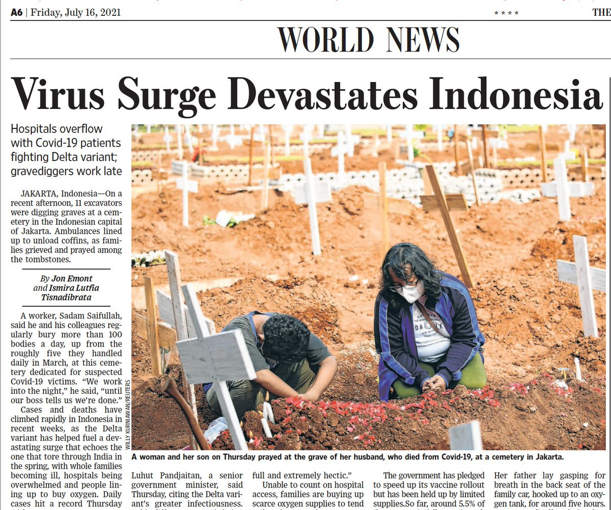</img></a><a href="E6bEk_DVEAER0j0.jpg"  >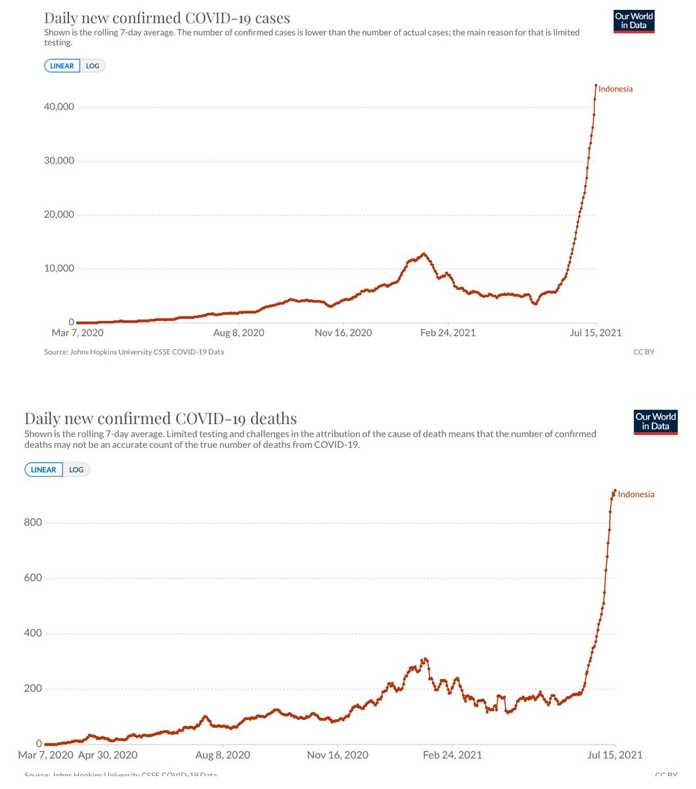</img></a>

---

<a href="https://twitter.com/erictopol/status/1416040089835106310" target="_blank" rel="noreferer">14:20 UCT</a>

Applauding 2 @openscience methods with complementarity to tackle the essential structure-function challenges in life science
https://www.nature.com/articles/d41586-021-01968-y
@Nature by @ewencallaway 
And further #AI work this week @NatComputSci  https://www.nature.com/articles/s43588-021-00098-9 

<a href="E6bIjpgVgAECufW.jpg"  ></img></a><a href="E6bI47GUcAA1prf.jpg"  ></img></a>

---

<a href="https://twitter.com/erictopol/status/1416047347641905153" target="_blank" rel="noreferer">14:49 UCT</a>

The D in Delta: it's Different and its very high contagiousness is not adequately appreciated
1. Aircraft carrier https://www.dailymail.co.uk/news/article-9786425/Covid-19-outbreak-Royal-Navy-led-Carrier-Strike-Group.html
2. Outdoor wedding https://www.forbes.com/sites/brucelee/2021/07/12/outdoor-wedding-6-fully-vaccinated-infected-with-covid-19-delta-variant/?sh=558387f16c49
3. Pool party https://www.businessinsider.com/covid-vaccine-breakthrough-infection-delta-variant-fully-vaccinated-las-vegas-2021-7
4. Quarantine hotel
https://www.abc.net.au/news/2021-06-08/melbourne-covid-outbreak-delta-strain-link-hotel-quarantine/100183468 

<a href="E6bOOe0VoAIJzJM.png"  >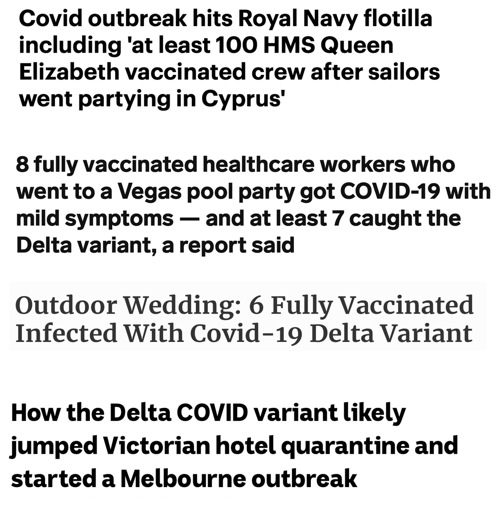</img></a>

---

<a href="https://twitter.com/erictopol/status/1416062063558893569" target="_blank" rel="noreferer">15:47 UCT</a>

I can't emphasize enough how well vaccines are working against Delta, especially preserving their &gt; 90% effectiveness vs severe illness. 
Its high transmissibility (cf prior variants) &amp; prevalence is leading to more infections among vaccinees that are mostly w/o symptoms or mild. 

<a href="E6bbSELVUAEgJGr.jpg"  >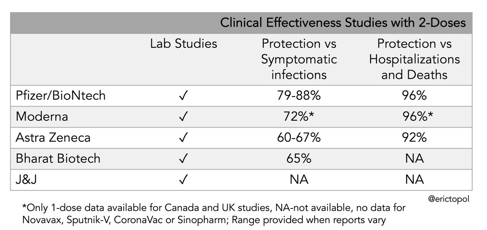</img></a>

---

<a href="https://twitter.com/erictopol/status/1416064849264607232" target="_blank" rel="noreferer">15:59 UCT</a>

@DrLeanaWen 💯, Leana. But this "by January  2022 date" isn't very helpful.
At least they have spoken for the first time on this issue and the priority review designation reflects the urgency. 

<a href="E6bfQIBVgAUTkZw.jpg"  >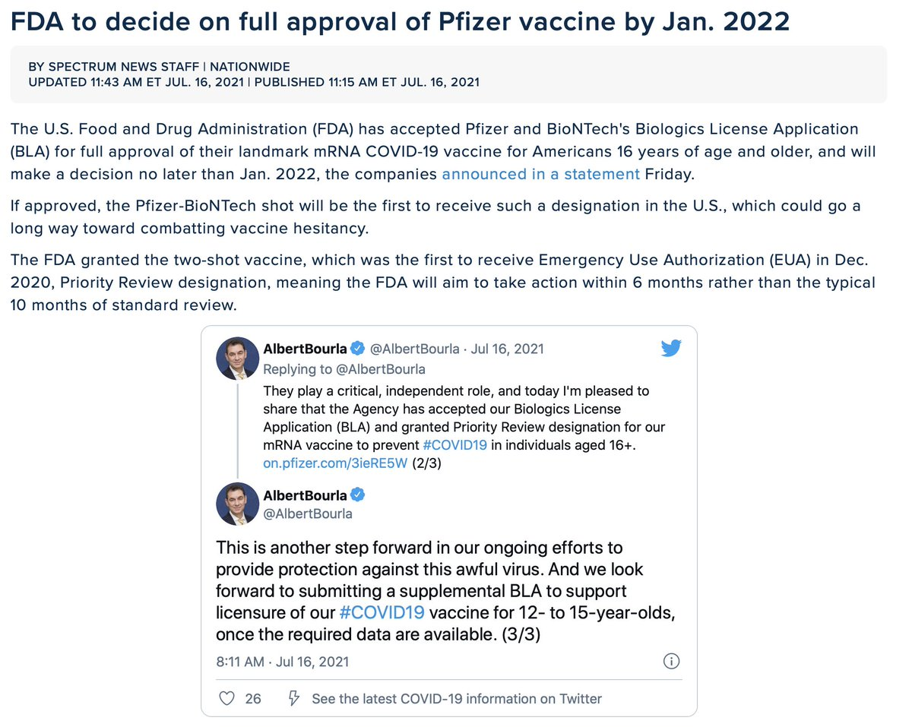</img></a>

---

<a href="https://twitter.com/erictopol/status/1416082437847670785" target="_blank" rel="noreferer">17:08 UCT</a>

The US "pandemic of the unvaccinated" in not just about the soaring case numbers (with markedly lower testing), but also hospitalizations, led, per capita, by Nevada,  Missouri and Arkansas
https://www.ft.com/content/f45b93d1-2839-4359-9132-3744014cb789 @FT 
https://www.nytimes.com/interactive/2021/us/covid-cases.html 

<a href="E6buFeQVUAExqPZ.jpg"  >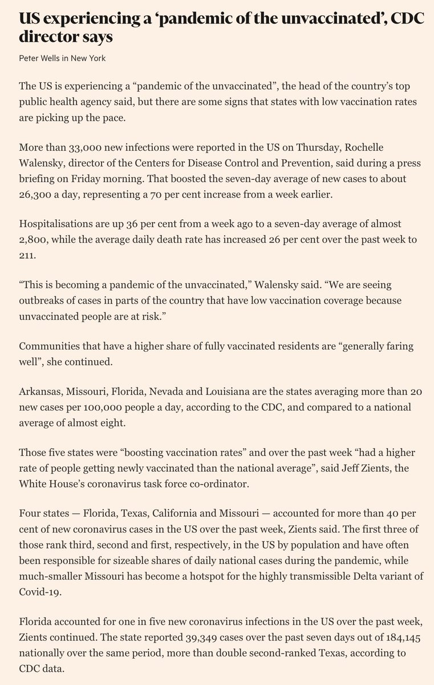</img></a><a href="E6bu1uYUcAAWBDM.jpg"  >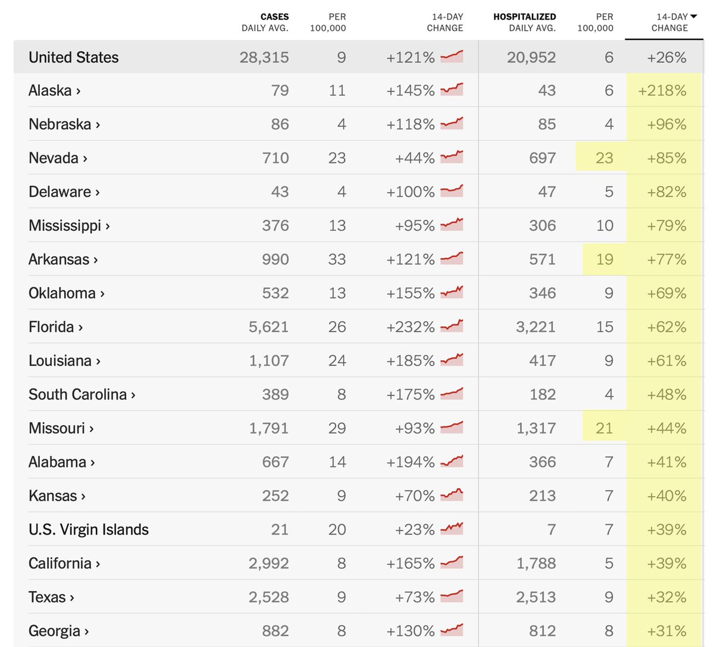</img></a>

---

<a href="https://twitter.com/erictopol/status/1416084655078473728" target="_blank" rel="noreferer">17:17 UCT</a>

Good graphic summary of the monoclonal antibodies vs #SARSCoV2 and their binding sites and variant/mutation resistance
https://www.cell.com/cell-host-microbe/fulltext/S1931-3128(21)00283-3#relatedArticles @cellhostmicrobe 

<a href="E6bxDmpUcAA1hWO.jpg"  >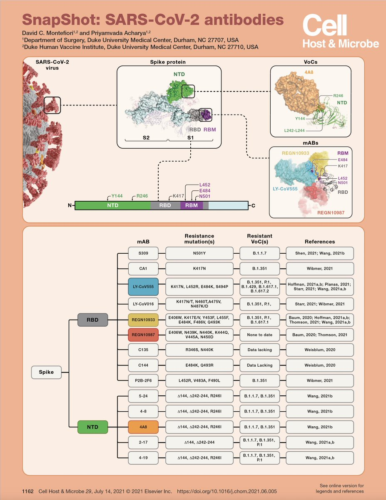</img></a>

---

<a href="https://twitter.com/erictopol/status/1416086829648863232" target="_blank" rel="noreferer">17:26 UCT</a>

What a difference in 2 months as Delta became dominant 
@CovidActNow 

<a href="E6bzbHdVIAEzQgW.jpg"  >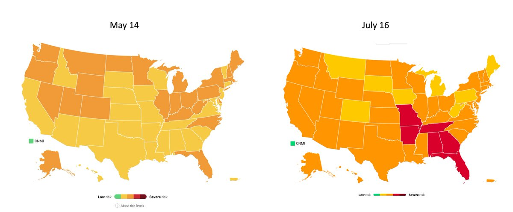</img></a>

---

<a href="https://twitter.com/erictopol/status/1416129279876681729" target="_blank" rel="noreferer">20:15 UCT</a>

Reflecting Delta's challenge &amp; the unvaccinated
The UK's cases &gt;51,000 today, highest since January Even w/ 88% of adults w/ at least 1 dose vaccination, hospitalizations are rising, projected to go much higher after reopening
https://www.ft.com/content/ba99bec3-b9ce-4c49-a5ac-d258e709d266 @FT @GeorgeWParker @Cliffcook 

<a href="E6cYSfyUUAE2w7Y.jpg"  >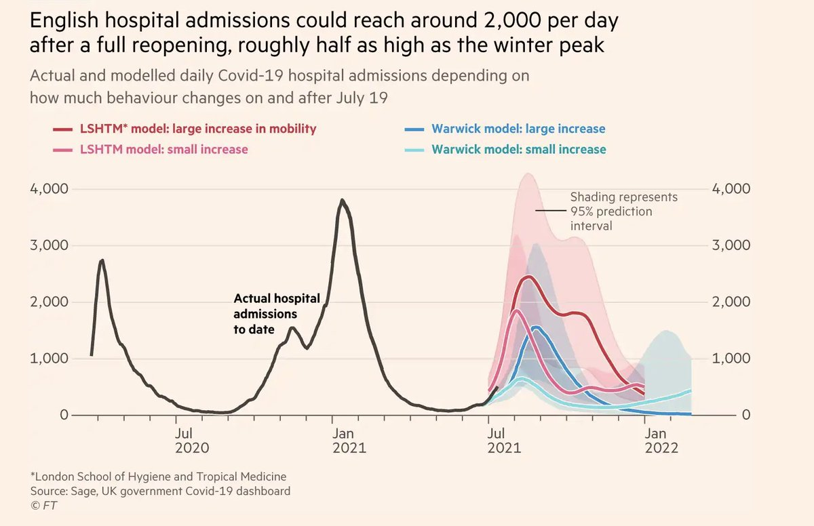</img></a>

---

<a href="https://twitter.com/erictopol/status/1416134334029828096" target="_blank" rel="noreferer">20:35 UCT</a>

How does this relate to the US?
2-dose vaccination for AZ or Pfizer vs Delta &gt;90% effectiveness vs hospitalization
Adults % 
UK 2-dose 67.5
US 2-dose 59.3
States w/ very low vaccination already showing the signs, inc MO, AR, NV, LA (&lt;-today) 

<a href="E6cdvwZVEAEp5hf.jpg"  >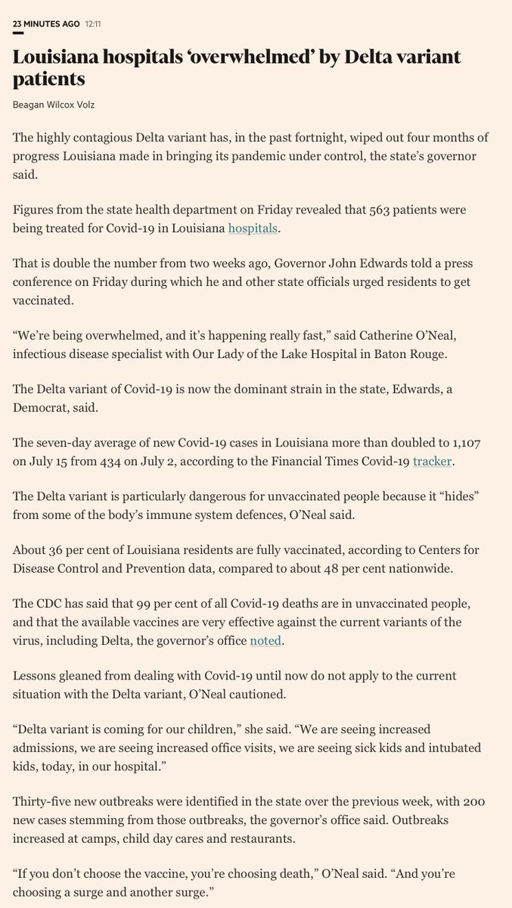</img></a>