+++
title = "Tweets by Eric Topol July 17"
Summary = ""
tags = ["Twitter"]
category = "Twitter"
+++

---

<a href="https://twitter.com/erictopol/status/1416213177398743049" target="_blank" rel="noreferer">01:48 UCT</a>

How to give a potent vaccine a Delta stress test
—Indoors, no 😷, a prolonged time w/ people of unknown vaccination status, w/ poor ventilation, in places of high Delta
—No 😷/ distancing from pre-symptomatic individual(s) w/ a Delta infection (has ~1000X viral load cf prior 🦠)

---

<a href="https://twitter.com/erictopol/status/1416216234111037444" target="_blank" rel="noreferer">02:00 UCT</a>

Reference for Delta's 1000X viral load and pre-infection period 
https://twitter.com/EricTopol/status/1413506194451288066

---

<a href="https://twitter.com/erictopol/status/1416218280839335938" target="_blank" rel="noreferer">02:08 UCT</a>

@TVinsonTV Far more contagious (the high viral load is appears to be a driver for this) but the immune response induced by vaccines are preventing severe illness, minimizing danger. 
Unvaccinated or no prior Covid natural immunity = danger.

---

<a href="https://twitter.com/erictopol/status/1416384341333090304" target="_blank" rel="noreferer">13:08 UCT</a>

We're in this Delta wave together.
Israel started later than UK with a very low case burden but now running parallel, as is the US. High numbers of cases but far lower severe illness than previous waves, thanks to vaccines  https://twitter.com/segal_eran/status/1416358013691219970

<a href="E6gATZ7UYAAwg25.jpg"  >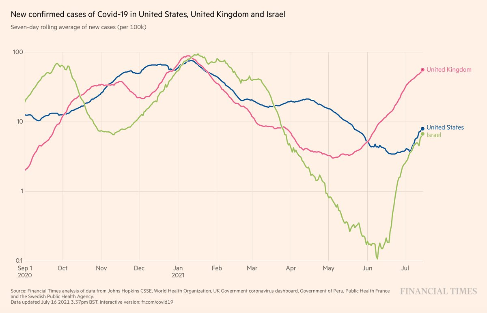</img></a>

---

<a href="https://twitter.com/erictopol/status/1416389192125280260" target="_blank" rel="noreferer">13:27 UCT</a>

6 days to go, not a pretty picture in Tokyo.  1st Olympic village case, over 1,400 new cases in the city, highest in &gt;6 months, Delta prevalence rising and low vaccination rate among residents and many athletes
https://www.usatoday.com/story/sports/olympics/2021/07/17/tokyo-olympic-village-resident-tests-positive-covid-19/8000632002/5 
https://edition.cnn.com/2021/07/17/sport/olympics-tokyo-covid-19-case-intl-hnk/index.html

---

<a href="https://twitter.com/erictopol/status/1416397310448201730" target="_blank" rel="noreferer">14:00 UCT</a>

Los Angeles County, largest in US with 10 million people, 52% fully vaccinated (US 48%), a proxy for a non-epicenter Delta wave. Large case increase to nearly 1,900 yesterday. All hospitalizations in unvaccinated or partially vaccinated people. https://www.nytimes.com/interactive/2021/us/los-angeles-california-covid-cases.html 

<a href="E6gM5c4VkAwo_Y0.jpg"  >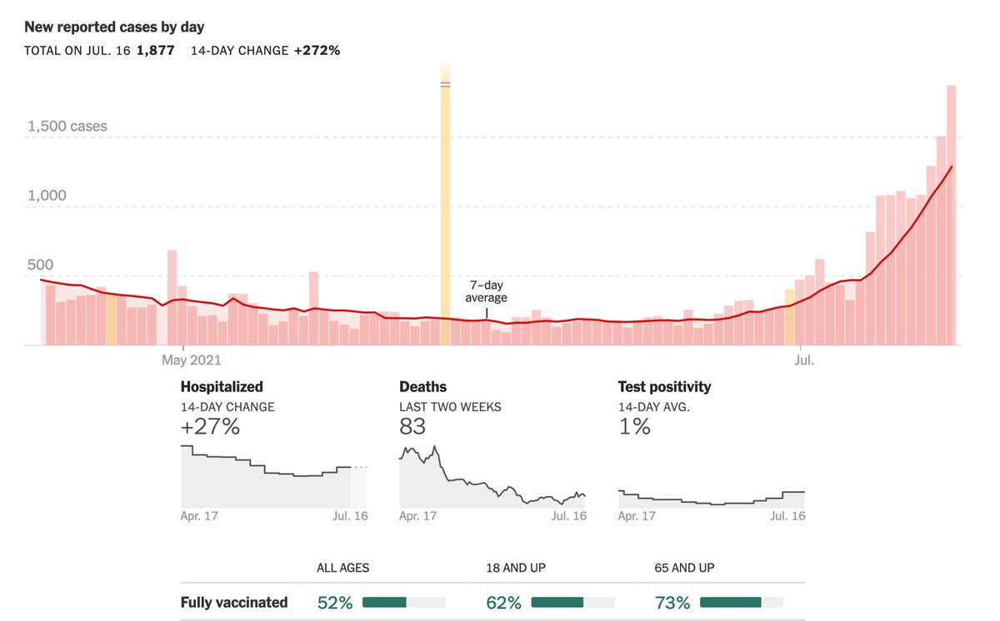</img></a>

---

<a href="https://twitter.com/erictopol/status/1416406598788866049" target="_blank" rel="noreferer">14:37 UCT</a>

The need to think planetary
https://www.washingtonpost.com/opinions/2021/07/16/long-pandemic-rages-around-world-its-threat-everyone/ 

<a href="E6gWNNiVgAAuxgN.jpg"  >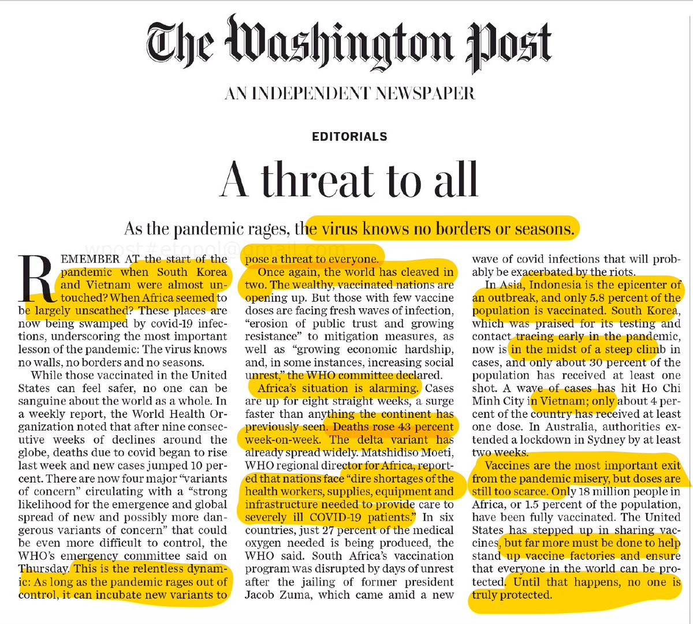</img></a>

---

<a href="https://twitter.com/erictopol/status/1416410895962435585" target="_blank" rel="noreferer">14:54 UCT</a>

Nice that @vivek_murthy @WhiteHouse announced a campaign to stop misinformation https://www.hhs.gov/sites/default/files/surgeon-general-misinformation-advisory.pdf
But until it directly calls out and addresses the principal sources the impact will be de minimus  https://twitter.com/MollyJongFast/status/1416371302563258369

<a href="E6gZ37QVcAIk6af.jpg"  >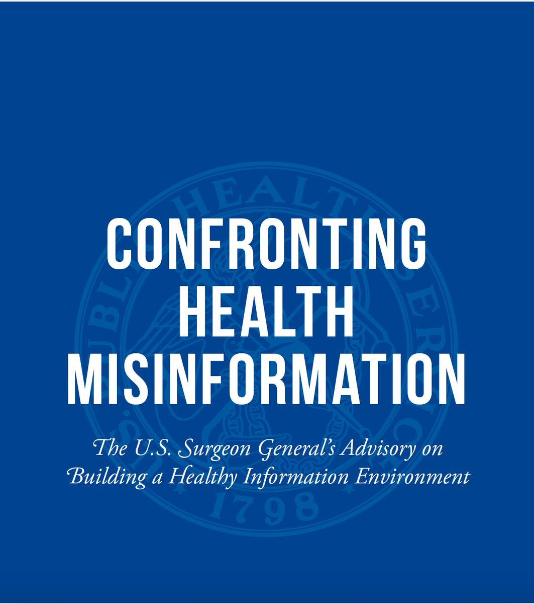</img></a>

---

<a href="https://twitter.com/erictopol/status/1416430341024206848" target="_blank" rel="noreferer">16:11 UCT</a>

No sign of Delta slowing down
https://coronavirus.data.gov.uk  https://twitter.com/BristOliver/status/1416414168442449927

<a href="E6grbbhUcAUutHq.jpg"  >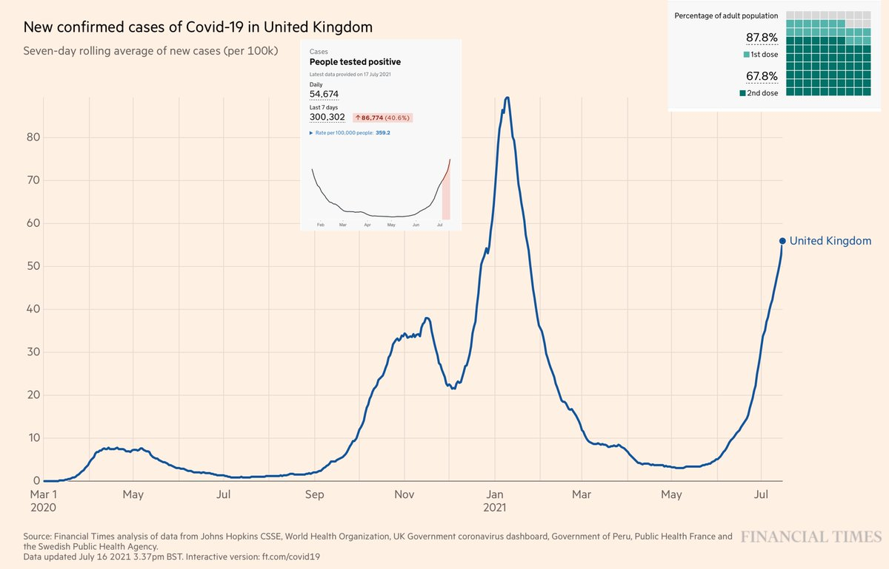</img></a>

---

<a href="https://twitter.com/erictopol/status/1416436527127695360" target="_blank" rel="noreferer">16:35 UCT</a>

@debaajimod 47% of the 68 million people are not fully vaccinated
~32 million people

---

<a href="https://twitter.com/erictopol/status/1416440546445316102" target="_blank" rel="noreferer">16:51 UCT</a>

In case you didn't know
#VaccinesWork against Delta
https://www.nytimes.com/2021/07/17/us/arkansas-covid-19-vaccine.html?action=click&module=Top%20Stories&pgtype=Homepage 

<a href="E6g09ZiVgAIOED7.jpg"  >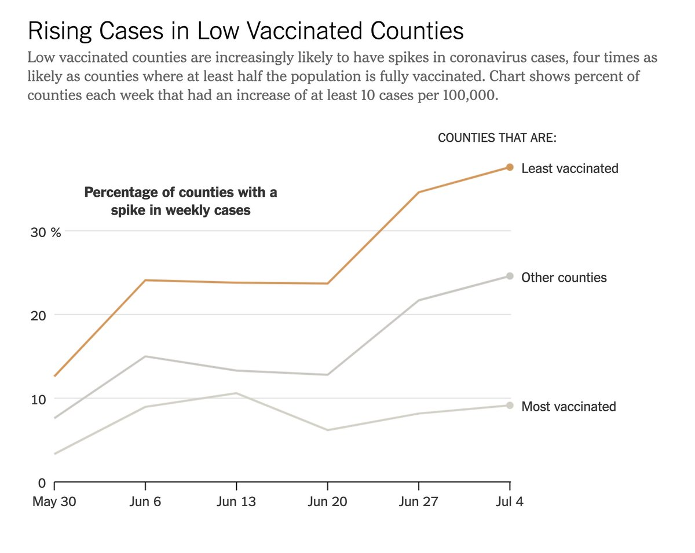</img></a>

---

<a href="https://twitter.com/erictopol/status/1416443085798526976" target="_blank" rel="noreferer">17:02 UCT</a>

But not when they're on shelves in a refrigerator
It takes 2 doses in people 
Over 51% of the US population (41% of adults) still not there 

<a href="E6g2r9yVkAEeXOE.jpg"  >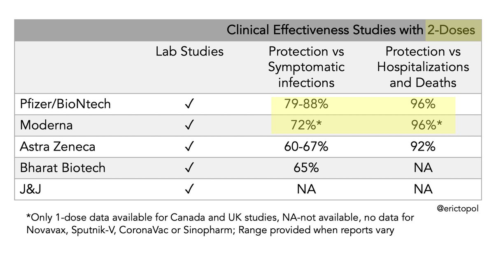</img></a>

---

<a href="https://twitter.com/erictopol/status/1416450150705164288" target="_blank" rel="noreferer">17:30 UCT</a>

Today's the day that Canada exceeded the US for fully vaccinated. Congratulations 🇨🇦
And 15% points ahead in 1st dose.
Your belief in the evidence and support of the science is abundantly clear 👋👋  https://twitter.com/EricTopol/status/1415409825836531716

<a href="E6g8vbBUUAMgQEg.jpg"  >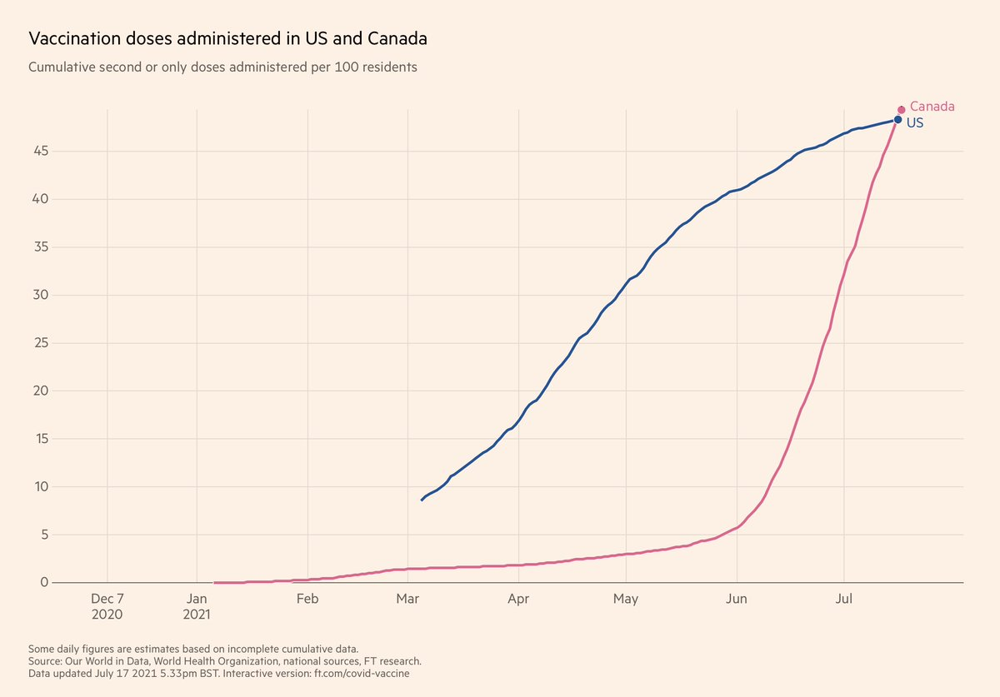</img></a>

---

<a href="https://twitter.com/erictopol/status/1416452236163444737" target="_blank" rel="noreferer">17:38 UCT</a>

Canada looking good and keeping Delta in check 
@OurWorldInData 

<a href="E6g_VkEVoAAvRoI.jpg"  >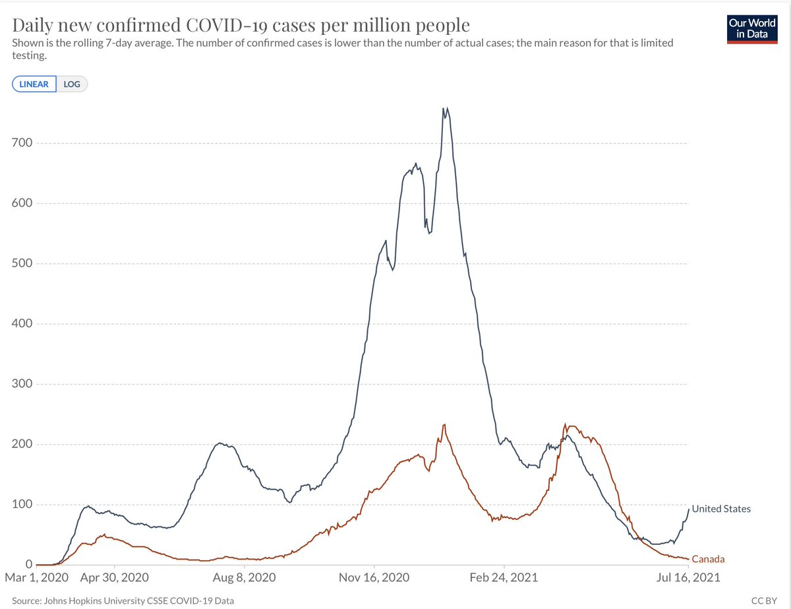</img></a><a href="E6g_vDdUcAESp4b.jpg"  >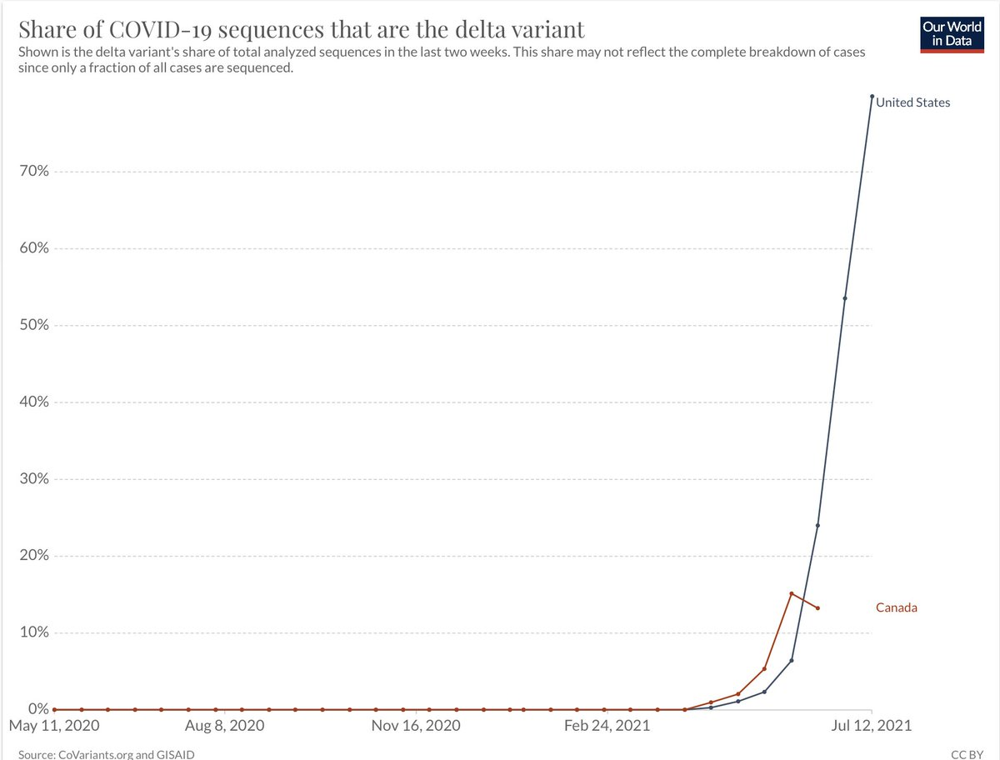</img></a>

---

<a href="https://twitter.com/erictopol/status/1416458676638916614" target="_blank" rel="noreferer">18:03 UCT</a>

That's a ~10X difference, no less the directionality 

<a href="E6hFoKsVIAAAyeJ.jpg"  >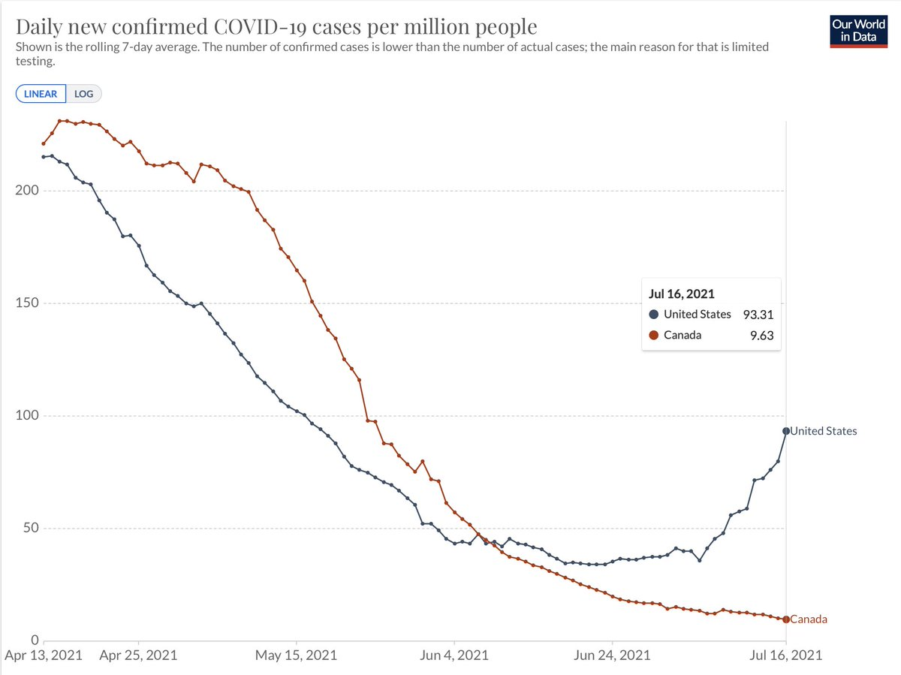</img></a>

---

<a href="https://twitter.com/erictopol/status/1416461183784132609" target="_blank" rel="noreferer">18:13 UCT</a>

@PaulSaxMD @nataliexdean @US_FDA @MassGenBrigham Couldn't agree more, Paul
Add health systems, military, municipalities ... 
Adds up to tens of millions of Americans.
Yesterday's  @US_FDA "priority review" announcement by Jan 2022 was frankly pathetic. 

<a href="E6hHqy6UUAEXa09.jpg"  >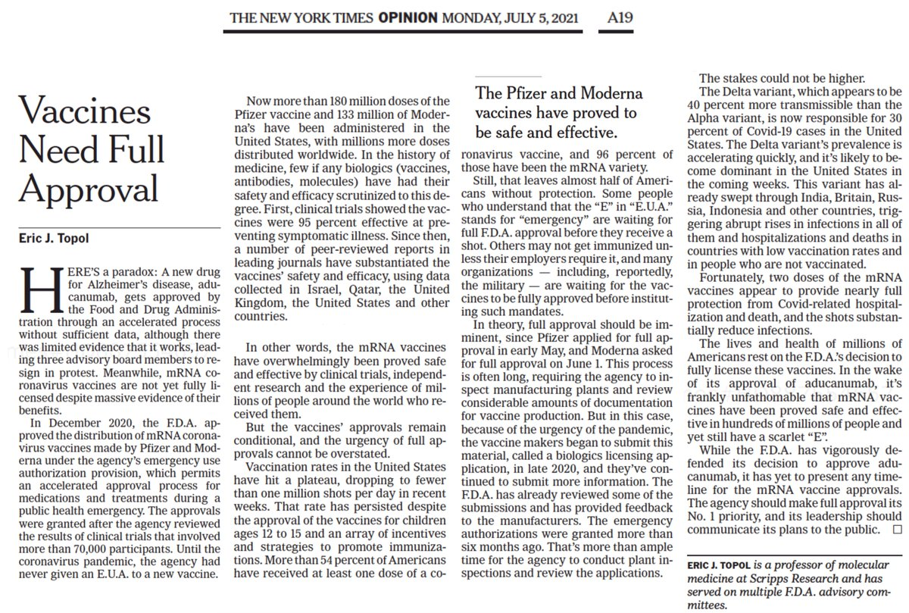</img></a>

---

<a href="https://twitter.com/erictopol/status/1416467052227796992" target="_blank" rel="noreferer">18:37 UCT</a>

Parallel paths 
The UK and the US epicenter
https://outbreak.info/epidemiology?location=USA_US-AR%3BGBR&log=false&variable=confirmed_numIncrease&xVariable=date&fixedY=true&percapita=true 

<a href="E6hNQ-AVIAA2jiL.jpg"  >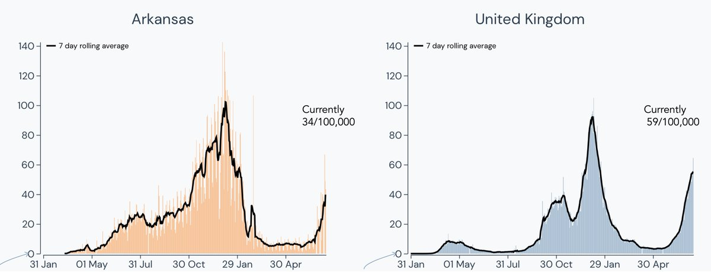</img></a>

---

<a href="https://twitter.com/erictopol/status/1416478107779756032" target="_blank" rel="noreferer">19:21 UCT</a>

@sajidjavid Wishing you well; not a good omen for Monday's reopening

---

<a href="https://twitter.com/erictopol/status/1416486898516652034" target="_blank" rel="noreferer">19:56 UCT</a>

Delta prevalence, US hospitalizations, vaccination rate
Great @nytgraphics #dataviz work today by @LaurenLeatherby and @amyswalk 
https://www.nytimes.com/interactive/2021/07/17/us/delta-variant-us-growth.html
We're ~80% Delta for new cases in the US now http://outbreak.info States w/highest vaccination rates holding up well 

<a href="E6heyyJVIAAdA6A.jpg"  >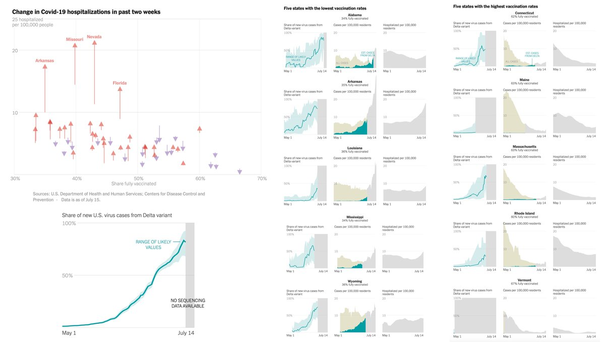</img></a>