+++
title = "Tweets by Eric Topol July 18"
Summary = ""
tags = ["Twitter"]
category = "Twitter"
+++

---

<a href="https://twitter.com/erictopol/status/1416576658308419586" target="_blank" rel="noreferer">01:52 UCT</a>

RT @dpakman: You can buy all the vaccines you want early, but if you're overrun with antivax Americans, eventually Canada catches up https:…

---

<a href="https://twitter.com/erictopol/status/1416763015475523584" target="_blank" rel="noreferer">14:13 UCT</a>

Our covid times
by @sdutBreen @sdut 

<a href="E6laa9JVkAIBkWQ.jpg"  >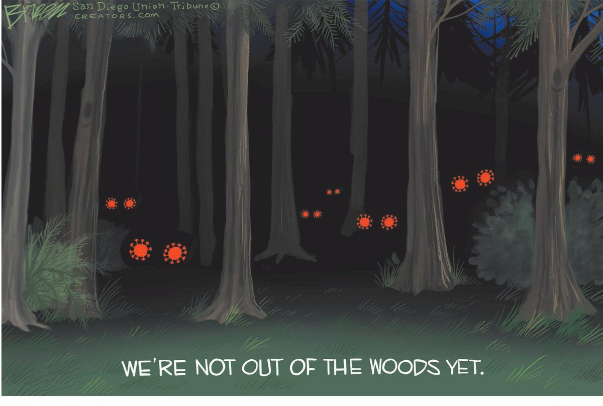</img></a>

---

<a href="https://twitter.com/erictopol/status/1416769157178167297" target="_blank" rel="noreferer">14:37 UCT</a>

The Delta variant and record high deaths in multiple countries with low vaccination, in contrast with those where high vaccination is saving lives by lessening the linkage to infections
by @jburnmurdoch and @davidpilling @FT https://www.ft.com/content/fa4f248a-a476-491d-a5ce-f128360e9f24 

<a href="E6leKRNUcAUYBZp.jpg"  >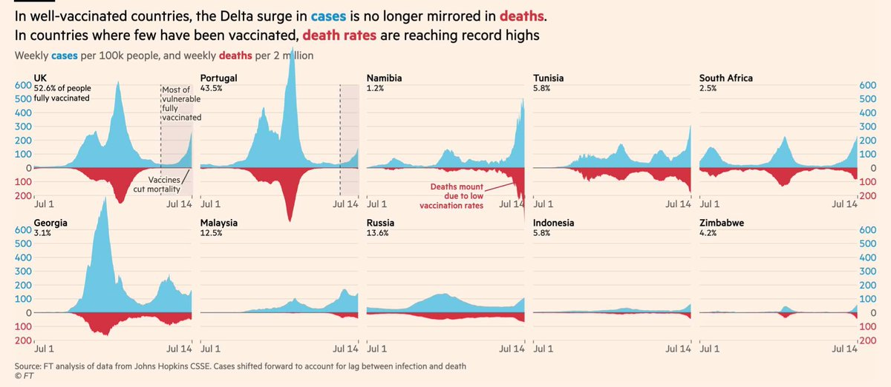</img></a>

---

<a href="https://twitter.com/erictopol/status/1416770508322791438" target="_blank" rel="noreferer">14:43 UCT</a>

"Despite UK daily case rates of more than 40,000 — a figure that before the vaccines rollout would have led to about 800 deaths a day — the current daily tally is about 50."

---

<a href="https://twitter.com/erictopol/status/1416772899583578113" target="_blank" rel="noreferer">14:52 UCT</a>

Canadians didn't just achieve a remarkable pace of vaccinations to protect themselves and one another. Their track record of protection and saving lives, as compared to the US, extends throughout the pandemic
@OurWorldInData  https://twitter.com/EricTopol/status/1416450150705164288

<a href="E6li6GUUUAMWl07.jpg"  >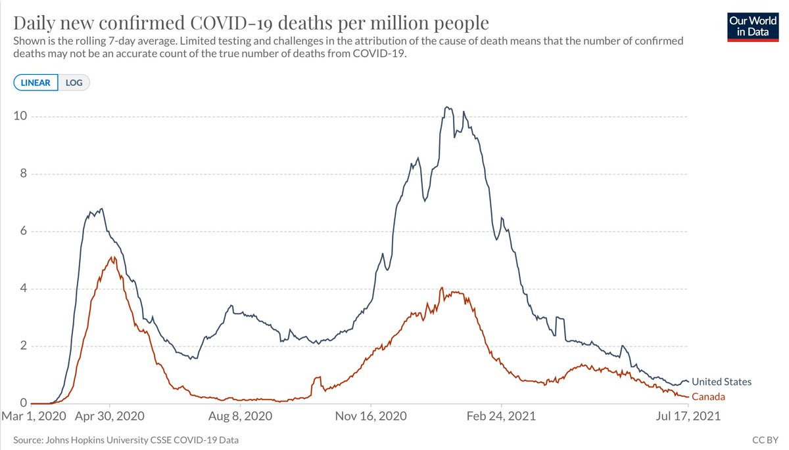</img></a>

---

<a href="https://twitter.com/erictopol/status/1416778938328571910" target="_blank" rel="noreferer">15:16 UCT</a>

South Africa's 3rd wave has been the worst yet, attributable, at least in part, to the dominant Delta variant. The Gauteng province has been worst hit https://www.ft.com/content/fa4f248a-a476-491d-a5ce-f128360e9f24 Vaccine suppliers not coming through played a pivotal role @_HassanF @HealthJusticeIn @GautengHealth 

<a href="E6llCPqVgAE8aZV.jpg"  >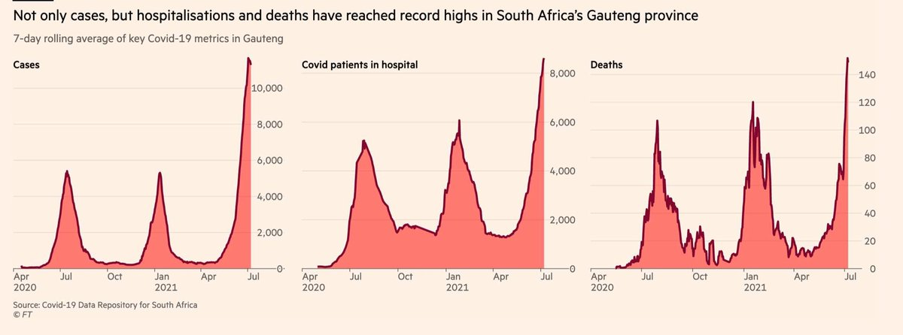</img></a>

---

<a href="https://twitter.com/erictopol/status/1416798011762438144" target="_blank" rel="noreferer">16:32 UCT</a>

The "D" in Delta stands for a detour in genomic mutations.
Instead of the prior major variants which had N501Y, and E484K for Beta and Gamma, this one took a different path in its spike RBD and other key spots (sequences at @scrippsresearch's http://outbreak.info) /1 

<a href="E6l0ivLVEAYvO9h.jpg"  >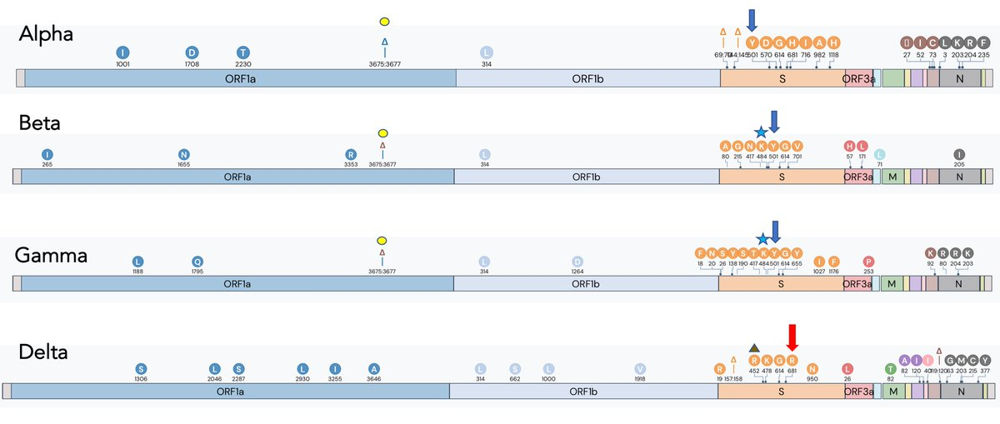</img></a>

---

<a href="https://twitter.com/erictopol/status/1416798017437401089" target="_blank" rel="noreferer">16:32 UCT</a>

You can see (Delta, in orange) the marked differences from the other variants in multiple locations: receptor binding domain (RBD), N-terminal domain (NTD) and in S2 of the spike protein  /2
graphic from @atelentia @Nature https://www.nature.com/articles/s41586-021-03792-w 

<a href="E6l1PbgVkAU146B.jpg"  >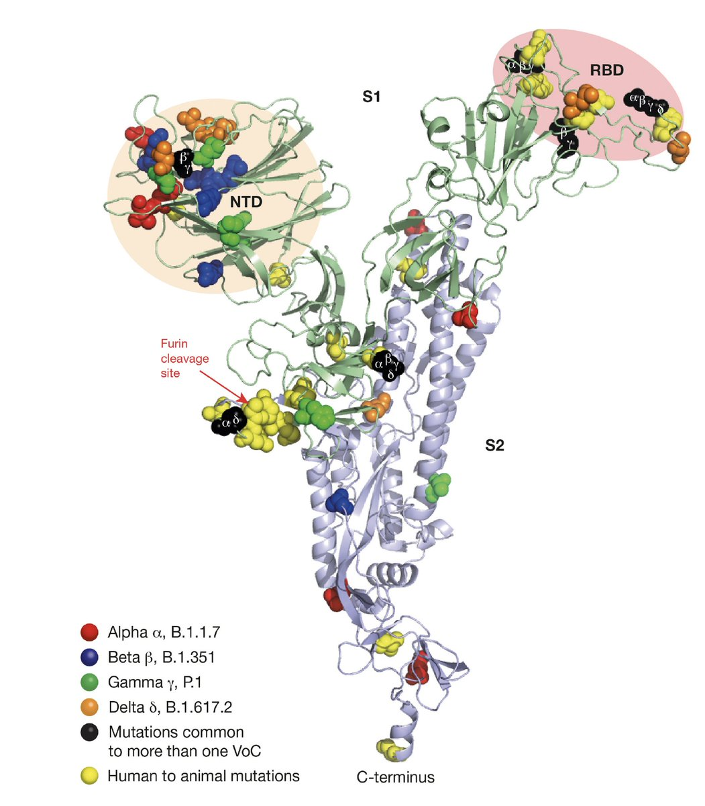</img></a>

---

<a href="https://twitter.com/erictopol/status/1416798023472975872" target="_blank" rel="noreferer">16:32 UCT</a>

We don't know much about the functional significance of the mutations in Lambda (C.37), a variant of interest that emerged in South America, that is also on a new path
https://www.medrxiv.org/content/10.1101/2021.06.26.21259487v1
https://www.nationalgeographic.com/science/article/the-unusual-lambda-variant-is-rapidly-spreading-in-south-america-heres-what-we-know by @Ecquis @NatGeo /3 

<a href="E6l52dPVUAQROG9.jpg"  >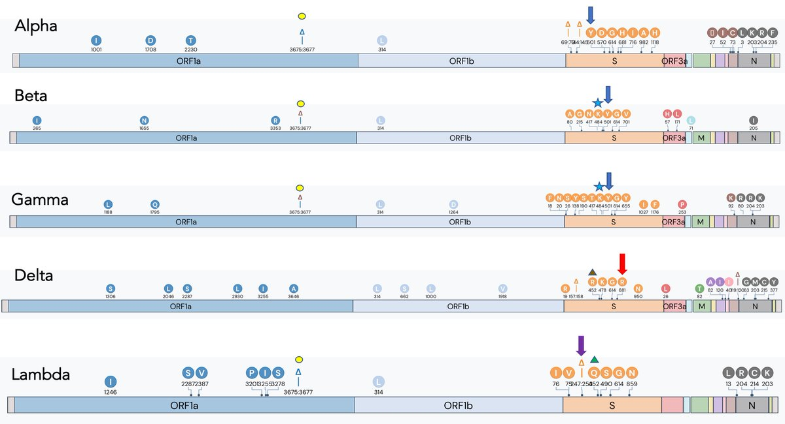</img></a><a href="E6l5-cEVEAQuNXF.jpg"  >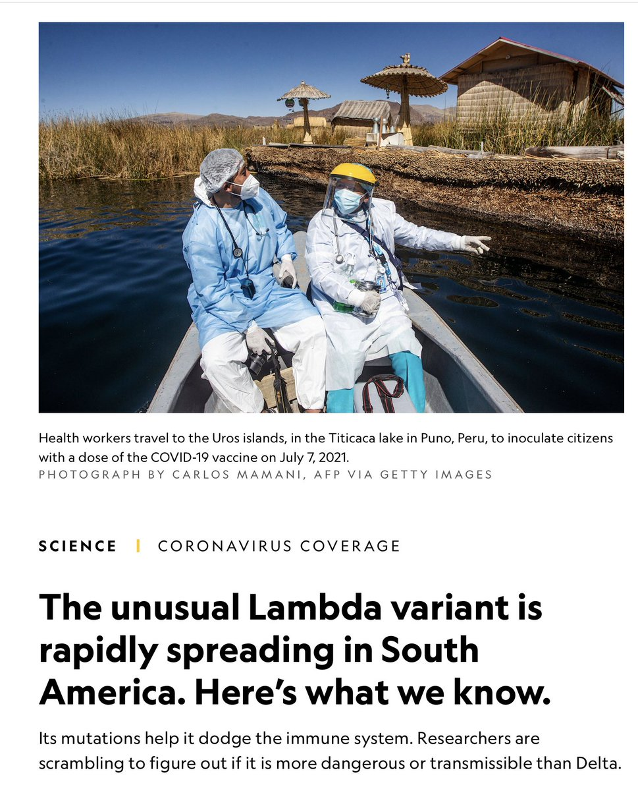</img></a>

---

<a href="https://twitter.com/erictopol/status/1416798033191202817" target="_blank" rel="noreferer">16:32 UCT</a>

One thing for sure: we need to achieve global containment of #SARSCoV2 as soon as possible to avoid further substantive evolution (a term usually connotating slowness but it's been happening fast). Our upbeat perspective @NatureMedicine w/ @RobertoBurioni  https://www.nature.com/articles/s41591-021-01421-7

---

<a href="https://twitter.com/erictopol/status/1416798030687133704" target="_blank" rel="noreferer">16:32 UCT</a>

Good discussion @TheEconomist on the evolution of the variants and their different mutations, N501Y, E484K, P681R, in the trimeric spike protein, and binding to our cells /4
https://www.economist.com/the-economist-explains/2021/07/15/why-do-new-sars-cov-2-variants-spread-more-easily?utm_campaign=coronavirus-special-edition&utm_medium=newsletter&utm_source=salesforce-marketing-cloud 

<a href="E6l4a8zVUAEi6rs.jpg"  >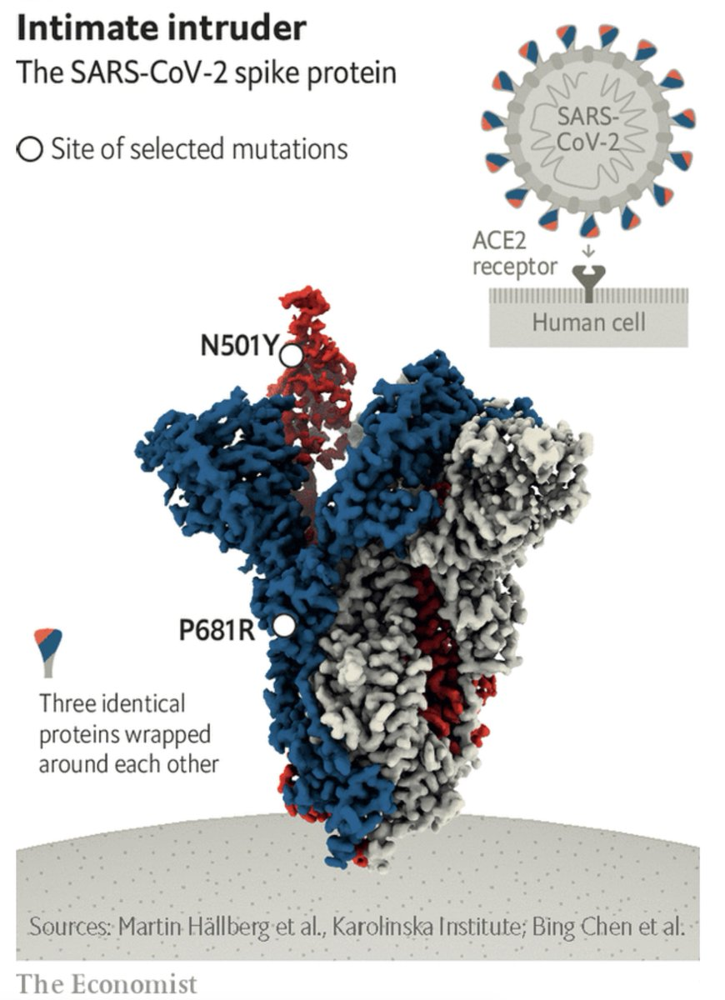</img></a>

---

<a href="https://twitter.com/erictopol/status/1416801104717762565" target="_blank" rel="noreferer">16:44 UCT</a>

No matter how you slice it, by US counties, by US states, by countries, high rates of vaccinations are preventing hospitalizations and are saving lives
https://www.nytimes.com/2021/07/17/us/arkansas-covid-19-vaccine.html?action=click&module=Top%20Stories&pgtype=Homepage
https://www.nytimes.com/interactive/2021/07/17/us/delta-variant-us-growth.html
https://www.ft.com/content/fa4f248a-a476-491d-a5ce-f128360e9f24
If not for yourself, help others stay healthy. Get 💉 

<a href="E6l8lMeUUAARsgc.jpg"  >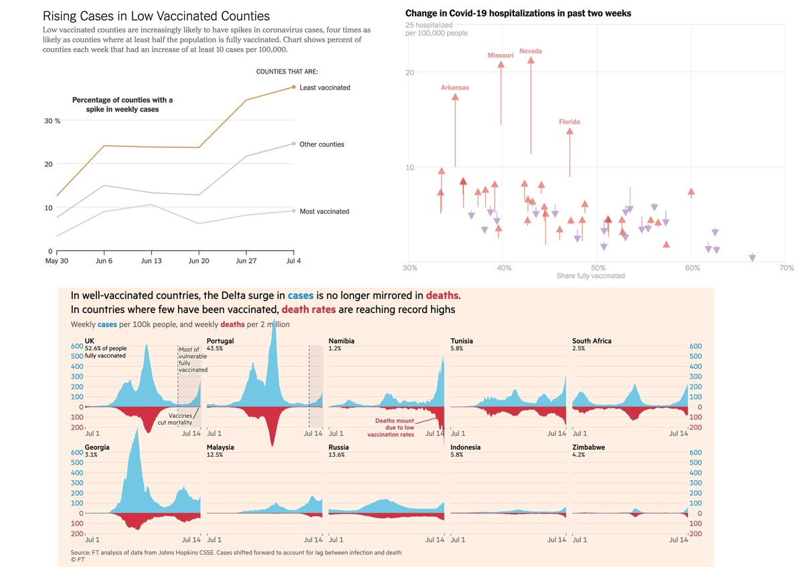</img></a>

---

<a href="https://twitter.com/erictopol/status/1416805435688906752" target="_blank" rel="noreferer">17:01 UCT</a>

Another way to look at Delta's impact in low vs high vaccination countries for deaths
a 3-6 fold difference between low and high, per capita
@OurWorldInData  https://twitter.com/EricTopol/status/1416769157178167297

<a href="E6mAsuLVoAEEPqM.jpg"  ></img></a>

---

<a href="https://twitter.com/erictopol/status/1416806336143106053" target="_blank" rel="noreferer">17:05 UCT</a>

RT @jburnmurdoch: NEW: probably the most important Covid chart I’ve made

As Delta goes global, it’s a tale of two pandemics, as the heavil…

---

<a href="https://twitter.com/erictopol/status/1416807779864506368" target="_blank" rel="noreferer">17:11 UCT</a>

The Delta (4th) wave in the United States is already showing it to be on a path to its the worst yet in its epicenter and low vaccinations states (MO, AR, MS, NV, FL) as reflected by hospitalizations and ICU admissions.
Graph from @jburnmurdoch @FT 

<a href="E6mCf4QVUAU02KC.jpg"  >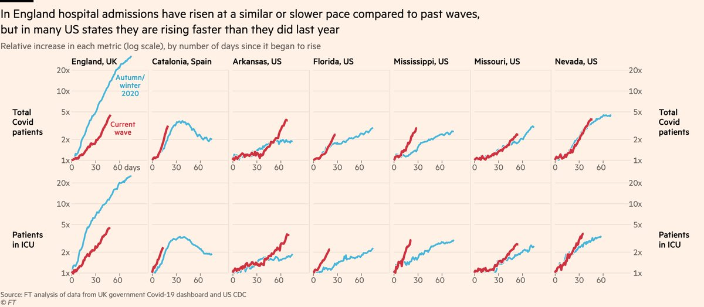</img></a>

---

<a href="https://twitter.com/erictopol/status/1416812875008528388" target="_blank" rel="noreferer">17:31 UCT</a>

More on this. Noting Florida is close to average for vaccinations (47% vs 48% US) states but already &gt;30 cases/100,000 residents, on a very worrisome trajectory
https://www.nytimes.com/interactive/2021/us/florida-covid-cases.html 

<a href="E6mGluWUcAEJFnW.jpg"  >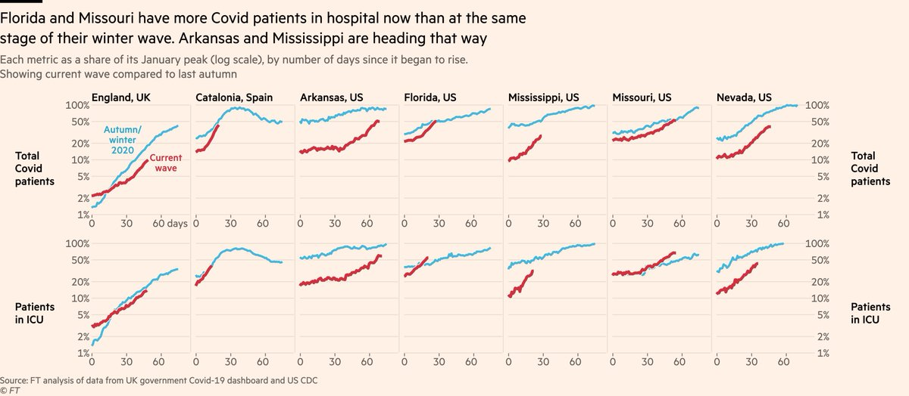</img></a><a href="E6mHiqoVUAIY8s8.jpg"  >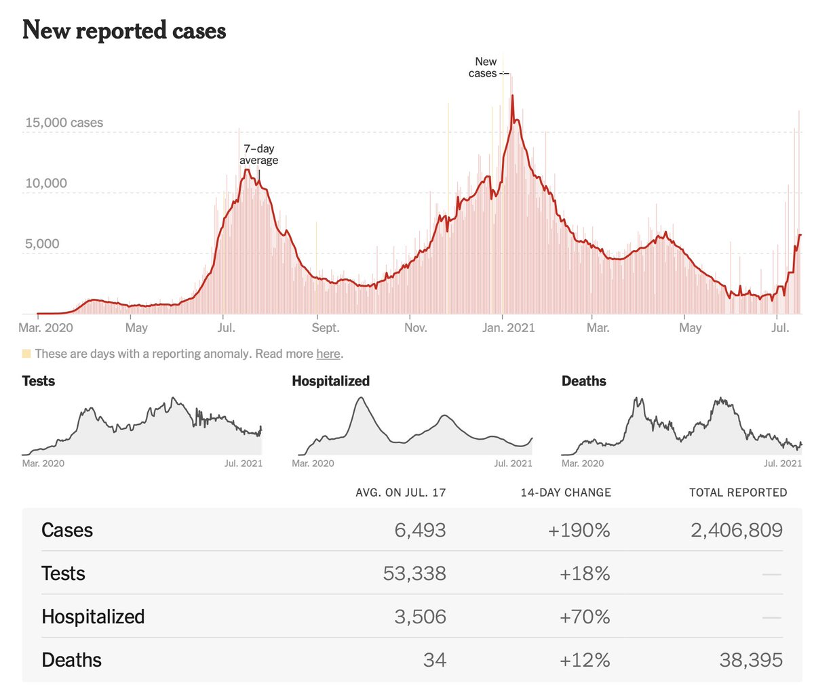</img></a>

---

<a href="https://twitter.com/erictopol/status/1416822255011581959" target="_blank" rel="noreferer">18:08 UCT</a>

How do you spell vulnerability?
Like this
from @jburnmurdoch @FT 

<a href="E6mPu32VkAMJW3C.jpg"  >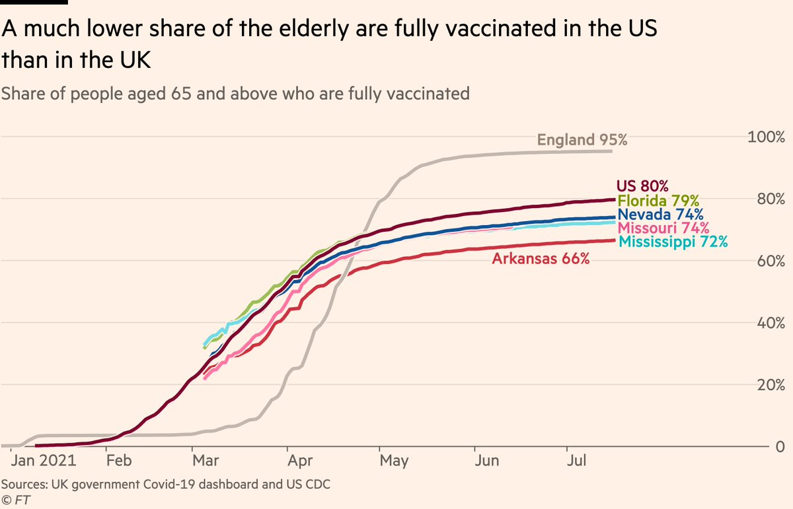</img></a>

---

<a href="https://twitter.com/erictopol/status/1416834361639411712" target="_blank" rel="noreferer">18:56 UCT</a>

This was a big week for #AI advances, with protein structure prediction and direct brain-&gt;speech
https://twitter.com/EricTopol/status/1415732633305190405
https://www.nejm.org/doi/full/10.1056/NEJMoa2027540?query=featured_home @NEJM @ChangLabUcsf @UCSF https://www.nytimes.com/2021/07/14/health/speech-brain-implant-computer.html?searchResultPosition=3 @PamBelluck 
but also 2 caveats /1 

<a href="E6mSvuBUYAEW0oF.jpg"  >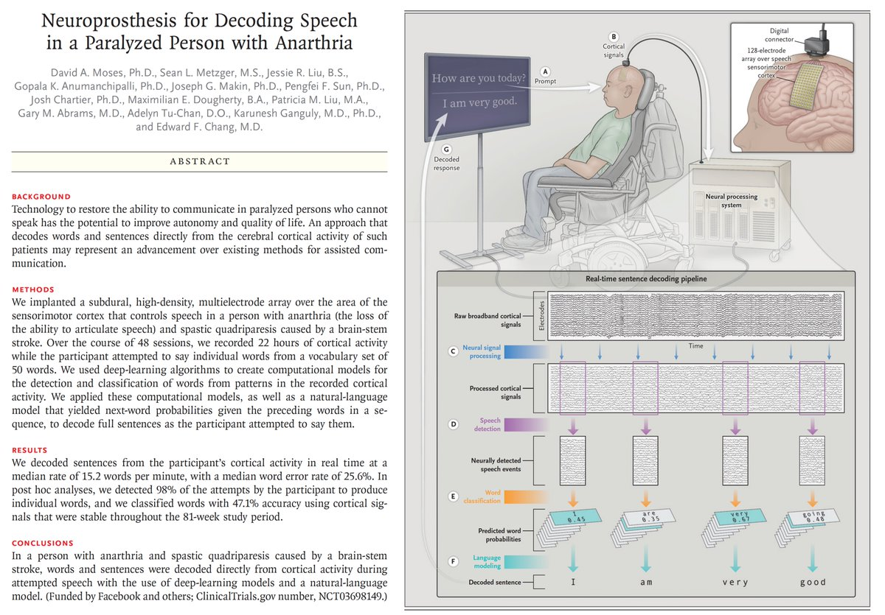</img></a><a href="E6mS9d3VoAIVJES.jpg"  >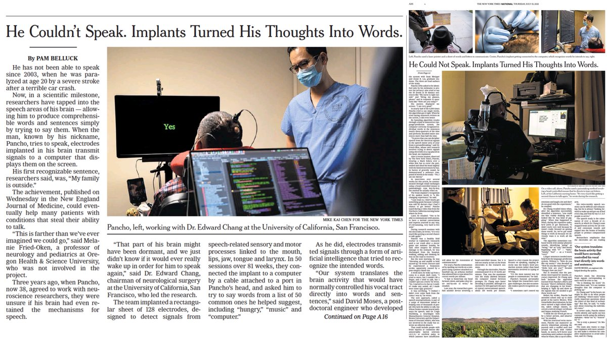</img></a><a href="E6mTdFIVgAAi5CL.jpg"  ></img></a>

---

<a href="https://twitter.com/erictopol/status/1416834370510278656" target="_blank" rel="noreferer">18:56 UCT</a>

—Explainability drawbacks
https://science.sciencemag.org/content/373/6552/284
@ScienceMagazine @gerke_sara @CohenProf 
—Dataset shifts 
https://www.nejm.org/doi/full/10.1056/NEJMc2104626?query=featured_home by @IAmSamFin 
 @zakkohane @kdpsinghlab @suchisaria @NEJM
Summarized so well by @DrXiaoLiu's 🧵
https://twitter.com/DrXiaoLiu/status/1416770766859821057 /2 

<a href="E6mUzpnVkAEAeDl.jpg"  >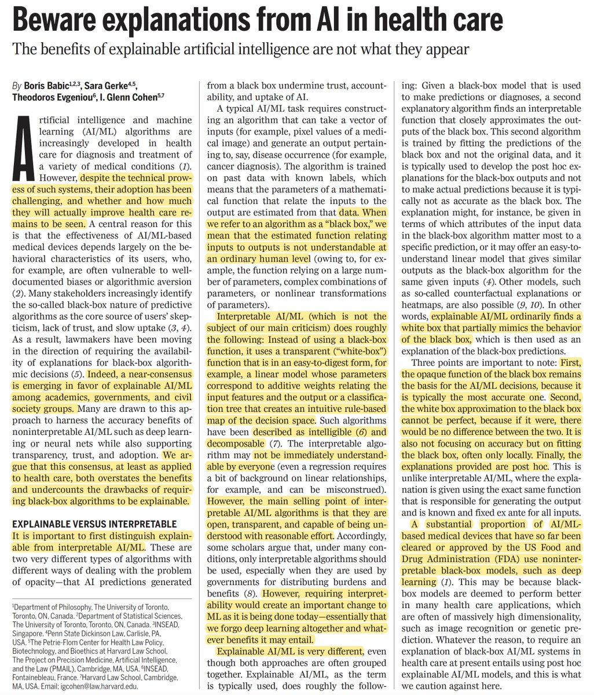</img></a><a href="E6maIdKVEAMP1_f.jpg"  >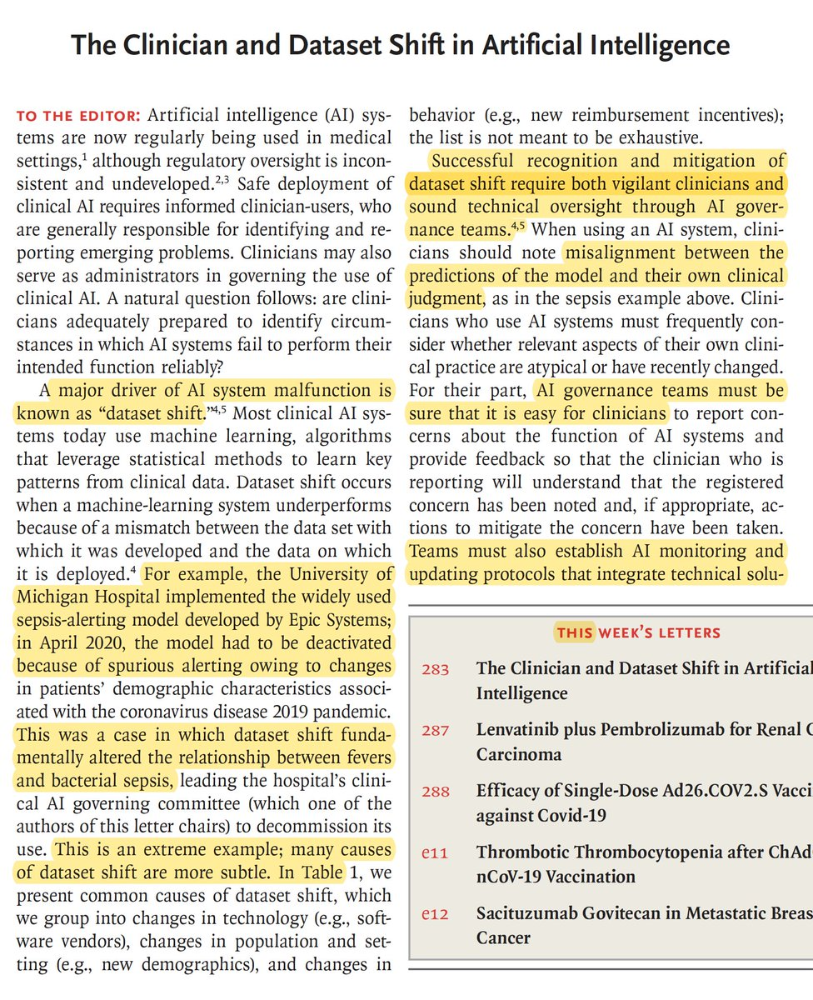</img></a>

---

<a href="https://twitter.com/erictopol/status/1416840563177910272" target="_blank" rel="noreferer">19:21 UCT</a>

PS I am not a Canadian or have any relationship with Canada besides some friendships. But, for whatever reasons, their outperformance vs the US is Captain Obvious.

---

<a href="https://twitter.com/erictopol/status/1416872099201703937" target="_blank" rel="noreferer">21:26 UCT</a>

We have "un-herd" immunity and an unheard-of number or people who are unwilling to get vaccinated to protect others https://twitter.com/EricTopol/status/1415841910971723780

---

<a href="https://twitter.com/erictopol/status/1416874267971489793" target="_blank" rel="noreferer">21:35 UCT</a>

@vidzette You should be ashamed to pass on such misinformation as a "doctor"  Blocked.

