+++
title = "Tweets by Eric Topol July 19"
Summary = ""
tags = ["Twitter"]
category = "Twitter"
+++

---

<a href="https://twitter.com/erictopol/status/1416917815932579841" target="_blank" rel="noreferer">00:28 UCT</a>

Neutralization capacity (antibody and T-cell response) for Prior covid + vaccination &gt; 2-doses vaccine across major variants
"pointing to vaccine boosters as a relevant future strategy"
https://www.medrxiv.org/content/10.1101/2021.07.14.21260307v1
by @carolilucas @NathanGrubaugh @VirusesImmunity @YaleIBIO @YaleMed 

<a href="E6nm54kVoAIz9RL.jpg"  >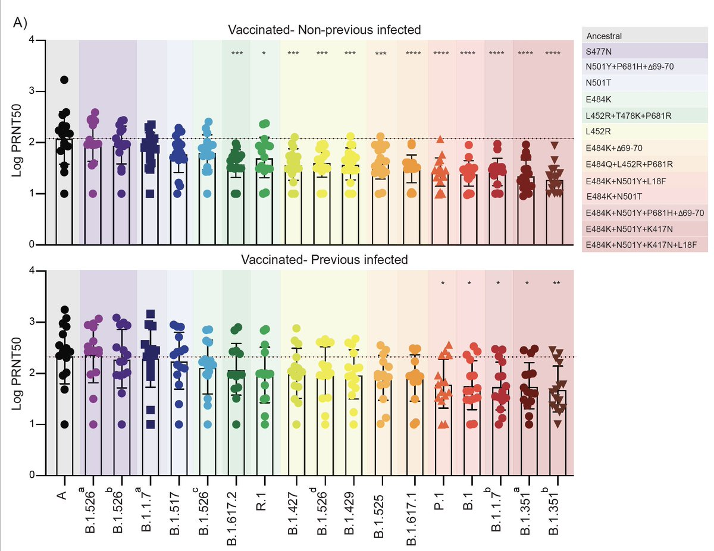</img></a>

---

<a href="https://twitter.com/erictopol/status/1416939137274241025" target="_blank" rel="noreferer">01:53 UCT</a>

How do you keep Delta out of your country?
🇳🇿 knows 

<a href="E6n6cFYVkAI5WIs.jpg"  >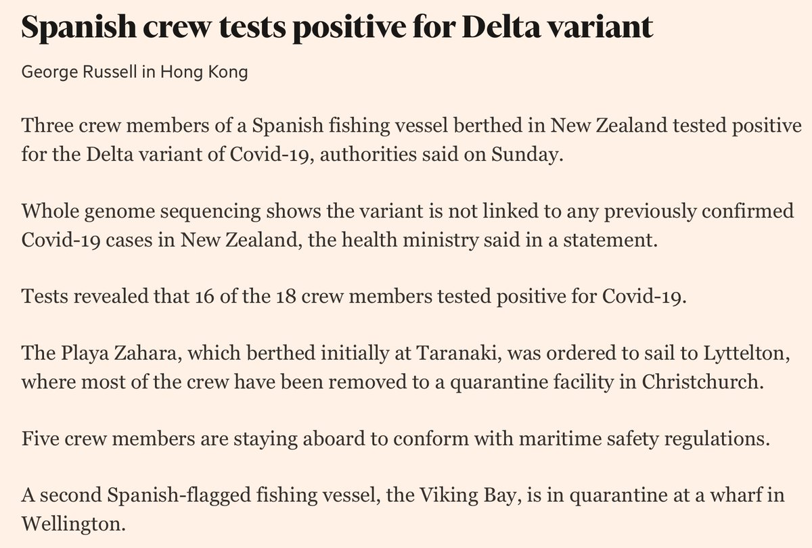</img></a>

---

<a href="https://twitter.com/erictopol/status/1416984828524695552" target="_blank" rel="noreferer">04:54 UCT</a>

RT @holmescnn: The return of mask requirements in parts of the US is the result of the frightening spread of the #COVID19 #DeltaVariant  Me…

---

<a href="https://twitter.com/erictopol/status/1417100127810899969" target="_blank" rel="noreferer">12:32 UCT</a>

Just published @Nature 
Discovery of a very broad neutralizing antibody (bNAb) against the sarbecovirus family, another important step towards a pan-coronavirus vaccine—which we should be aggressively pursuing https://www.nature.com/articles/s41586-021-03817-4 

<a href="E6qL9aFVkAQjnvI.jpg"  >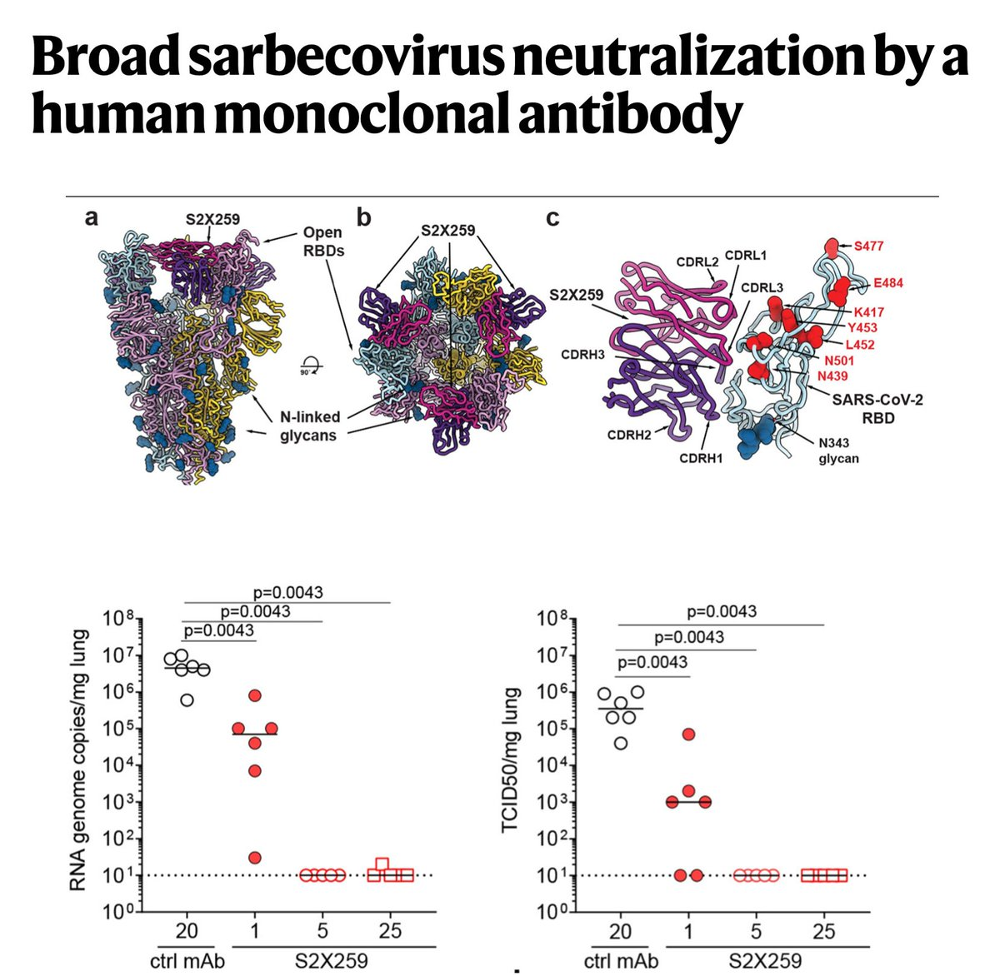</img></a>

---

<a href="https://twitter.com/erictopol/status/1417100130692386816" target="_blank" rel="noreferer">12:32 UCT</a>

This strategy is far better than a variant-specific approach; all recent work indicates that it is clearly attainable
https://www.nature.com/articles/d41586-021-00340-4 @Nature w/ @DennisRBurton

---

<a href="https://twitter.com/erictopol/status/1417112854965018632" target="_blank" rel="noreferer">13:23 UCT</a>

Going back to Vo, Italy, perhaps the most carefully studied town for covid:
98.8% of people who had covid in the 1st wave of the pandemic still showed detectable levels of antibodies at least 9 months later, whether they were initially symptomatic or not.
https://www.nature.com/articles/s41467-021-24622-7

---

<a href="https://twitter.com/erictopol/status/1417139572069179393" target="_blank" rel="noreferer">15:09 UCT</a>

Good news for coffee drinkers ☕️☕️
Debunking the dogma that coffee increases the risk of heart rhythm disturbances, from &gt;386,000 people, 4.5 year follow-up, including putative genomic risk variants
@JAMAInternalMed https://jamanetwork.com/journals/jamainternalmedicine/fullarticle/2782015 @uk_biobank 

<a href="E6qs7K6VoAMNbjV.jpg"  >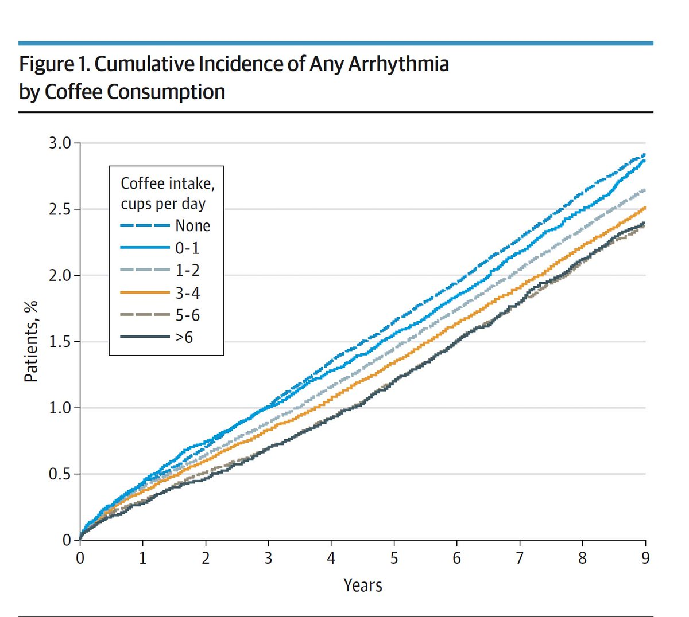</img></a><a href="E6qs8kLVcAQdk-i.jpg"  >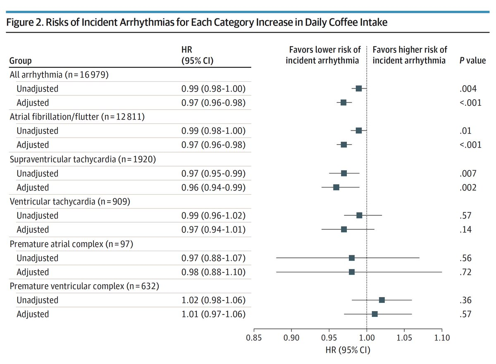</img></a>

---

<a href="https://twitter.com/erictopol/status/1417154000659488770" target="_blank" rel="noreferer">16:06 UCT</a>

Is Delta more deadly than previous versions the virus?
It depends.
In the UK the covid case fatality rate has been reduced an order of magnitude, from 2% to 0.16%. 

<a href="E6q9LwKVgAI5YnU.jpg"  >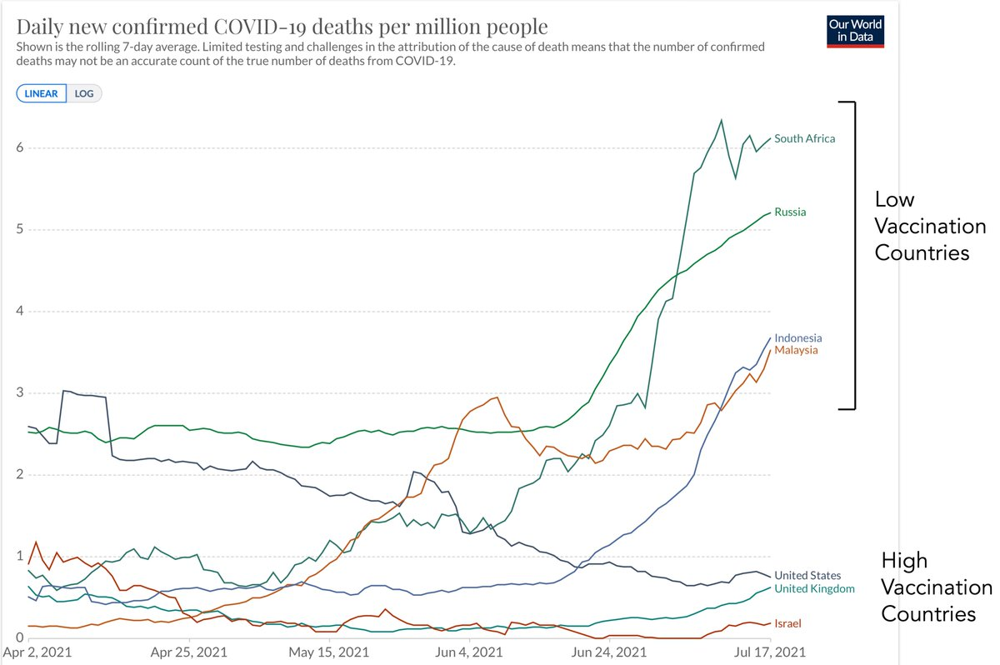</img></a>

---

<a href="https://twitter.com/erictopol/status/1417157170089512961" target="_blank" rel="noreferer">16:19 UCT</a>

Ironic that the data actually suggests the association between more coffee and less arrhythmias. Of course, at an individual level there are people who are unquestionably sensitive to caffeine effects
https://jamanetwork.com/journals/jamainternalmedicine/fullarticle/2782021

---

<a href="https://twitter.com/erictopol/status/1417159783862312977" target="_blank" rel="noreferer">16:29 UCT</a>

Yes, age shift is a big factor, with vaccinations at very high uptake by increasing age groups in high vaccination countries. 
For length of pandemic, now nearly all Delta infections, very low vaccination %,  in 2 countries w/average population age of 22 (Namibia) &amp; 32 (Tunisia) 

<a href="E6rCfKFUUAQa03l.jpg"  >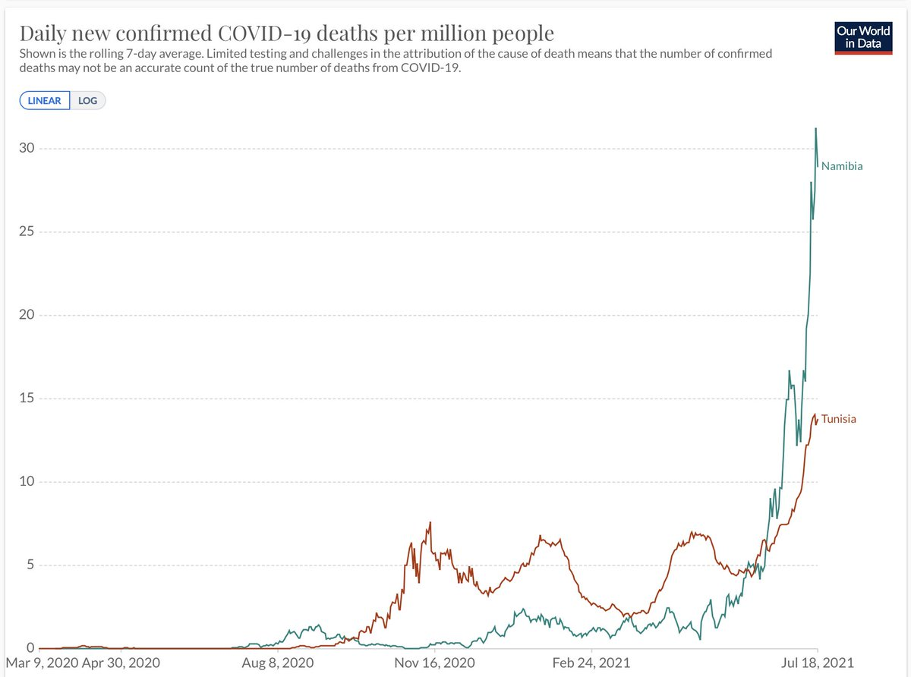</img></a>

---

<a href="https://twitter.com/erictopol/status/1417187671886090254" target="_blank" rel="noreferer">18:20 UCT</a>

In the past 3 weeks as Delta progressed to dominance in the US (now ~80%), covid hospitalizations increased from their pandemic nadir, 15,000, to today over 25,000, a 67% jump
https://newsnodes.com/us 

<a href="E6rcAdXVUAkQEvm.jpg"  >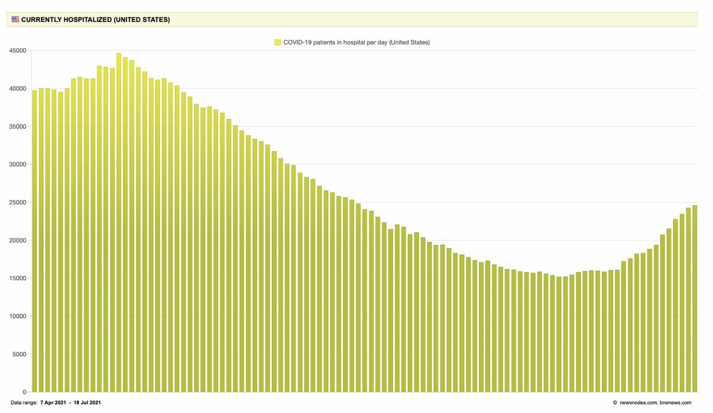</img></a>

---

<a href="https://twitter.com/erictopol/status/1417233388797235217" target="_blank" rel="noreferer">21:22 UCT</a>

New @AnnalsofIM
Extremely high vaccine effectiveness in a large US cohort &gt;108,000 @DeptVetAffairs real world setting for mRNAs, unaffected by age, gender, race, pre-existing conditions
https://www.acpjournals.org/doi/10.7326/M21-1577 

<a href="E6sFqPDVEBUXGFd.png"  >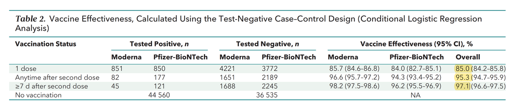</img></a>

---

<a href="https://twitter.com/erictopol/status/1417233966763937798" target="_blank" rel="noreferer">21:24 UCT</a>

Confidence booster for how potent these #VaccinesWork 

<a href="E6sGjsiVEAQz7Jj.jpg"  >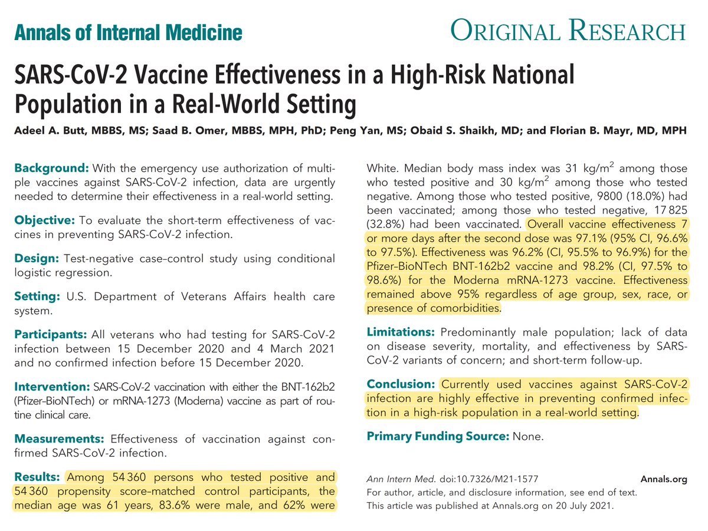</img></a><a href="E6sGlbRVEAkwf0t.png"  >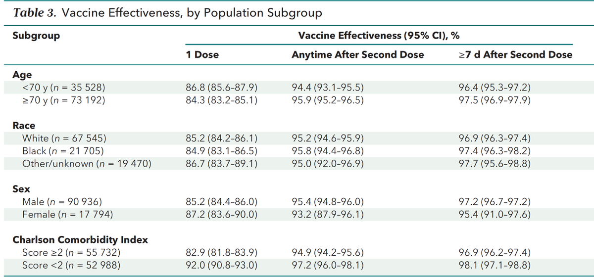</img></a>

---

<a href="https://twitter.com/erictopol/status/1417235797397278725" target="_blank" rel="noreferer">21:31 UCT</a>

The data from this VA study of 2-dose vaccine effectiveness is fully replicated for the Delta variant and mRNA vaccines from @PHE_UK, Israel, and other reports (and more on the way) for prevention of hospitalizations and deaths 

<a href="E6sINjHVEBAy7t5.jpg"  >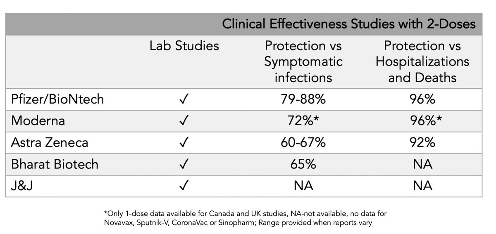</img></a>

---

<a href="https://twitter.com/erictopol/status/1417259307830190115" target="_blank" rel="noreferer">23:05 UCT</a>

How to have a safe indoor music concert with 4,584 people, singing and dancing --&gt; only 6 cases, all unvaccinated
"Same day rapid antigen tests, use of face masks. and improved ventilation can prevent high rates of #SARSCoV2 transmission"
https://www.acpjournals.org/doi/10.7326/M21-2278
@AnnalsofIM 

<a href="E6sdiaJVEAAbkOD.jpg"  >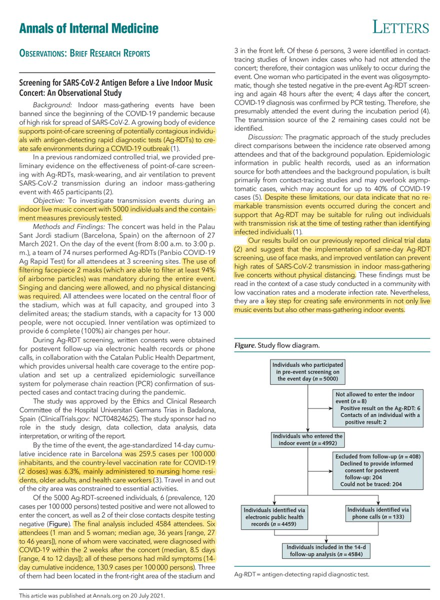</img></a>