+++
title = "Tweets by Eric Topol July 20"
Summary = ""
tags = ["Twitter"]
category = "Twitter"
+++

---

<a href="https://twitter.com/erictopol/status/1417324527118274560" target="_blank" rel="noreferer">03:24 UCT</a>

Spotlight on Nevada, &gt;85% Delta, leading the US in hospitalizations per capita (26/100,000) beyond the US epicenter in Missouri/Arkansas 

<a href="E6tYoSuUUAgDftF.jpg"  >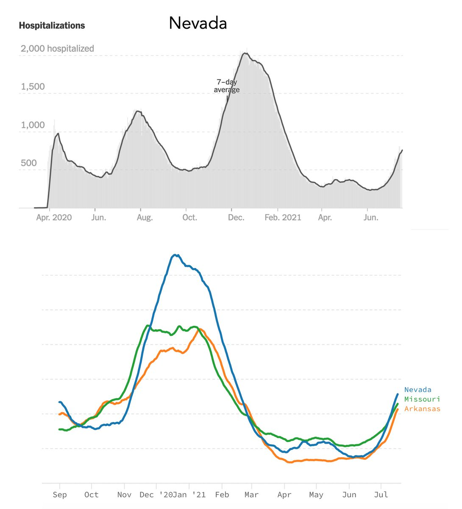</img></a><a href="E6tY30GVgAAp4ki.jpg"  >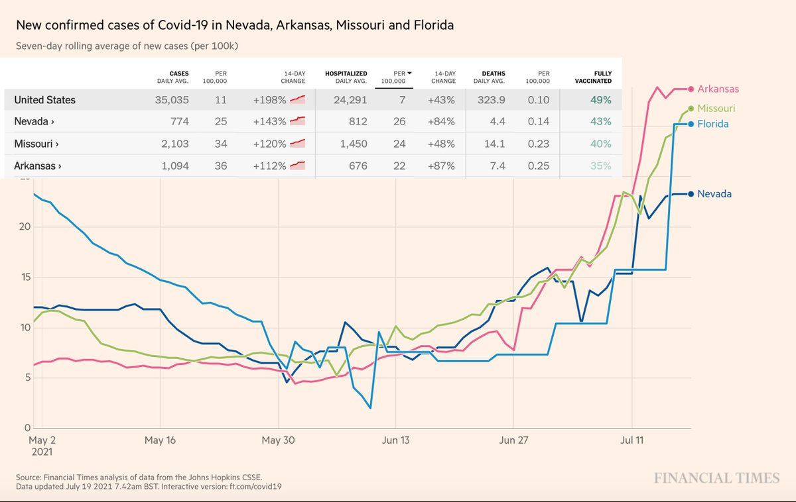</img></a>

---

<a href="https://twitter.com/erictopol/status/1417328230097309701" target="_blank" rel="noreferer">03:39 UCT</a>

All Delta &gt;80% countries w/ high vaccination rates
New cases, log plot, all headed in the same direction   (variation in baseline level, slope of ascent, and current peak)
Far less than the rise in low vaccination countries, but telling as to the challenge that Delta presents 

<a href="E6tcbSfVgAAtjPd.jpg"  >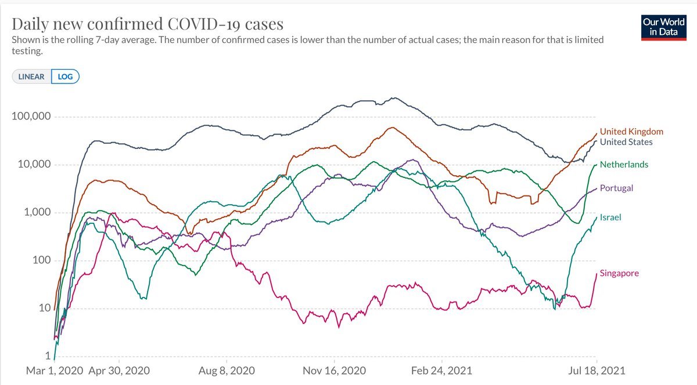</img></a>

---

<a href="https://twitter.com/erictopol/status/1417488894791094272" target="_blank" rel="noreferer">14:17 UCT</a>

The rise in Delta to dominance happened at different times, but the impact on exponential case rise (by slope) is remarkably similar 

<a href="E6vuJejXsAoyufc.jpg"  >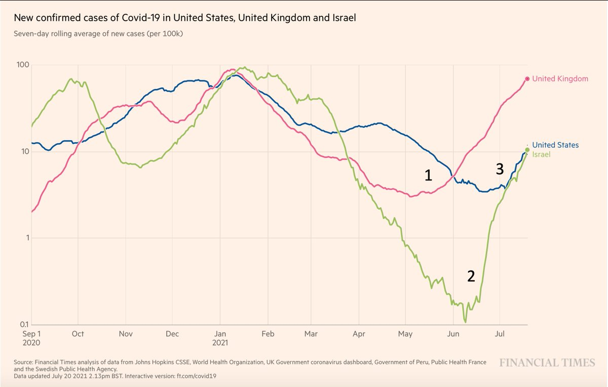</img></a>

---

<a href="https://twitter.com/erictopol/status/1417500274395017216" target="_blank" rel="noreferer">15:02 UCT</a>

That some fully vaccinated people are getting hospitalized is being used to undermine that #VaccinesWork. 
That's not true. 
My simple graphic below and straightforward math 🧵from UK to show 90% preserved effectiveness (an underestimate)
https://twitter.com/PaulMainwood/status/1417368010378121216 https://twitter.com/EricTopol/status/1412226732149534721

---

<a href="https://twitter.com/erictopol/status/1417502988717809664" target="_blank" rel="noreferer">15:13 UCT</a>

The pandemic case peak for the UK was 62,596 in January. 
Today: 46,558. Let's hope this is at or close to peak and for a rapid descent
https://coronavirus.data.gov.uk
@OurWorldInData 

<a href="E6v67tUVIAAXYJ3.jpg"  >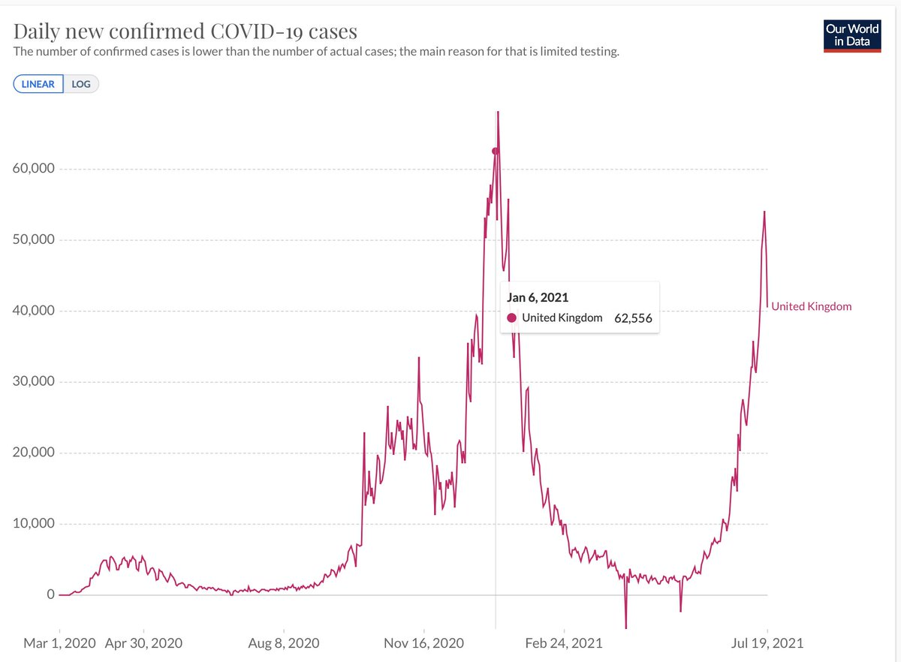</img></a>

---

<a href="https://twitter.com/erictopol/status/1417505301041799173" target="_blank" rel="noreferer">15:22 UCT</a>

Recall India's rapid descent (like its ascent) as Delta and other B.1.617 lineages ripped through its population with little to no vaccination defense 

<a href="E6v9O3RVUAc-Jek.jpg"  >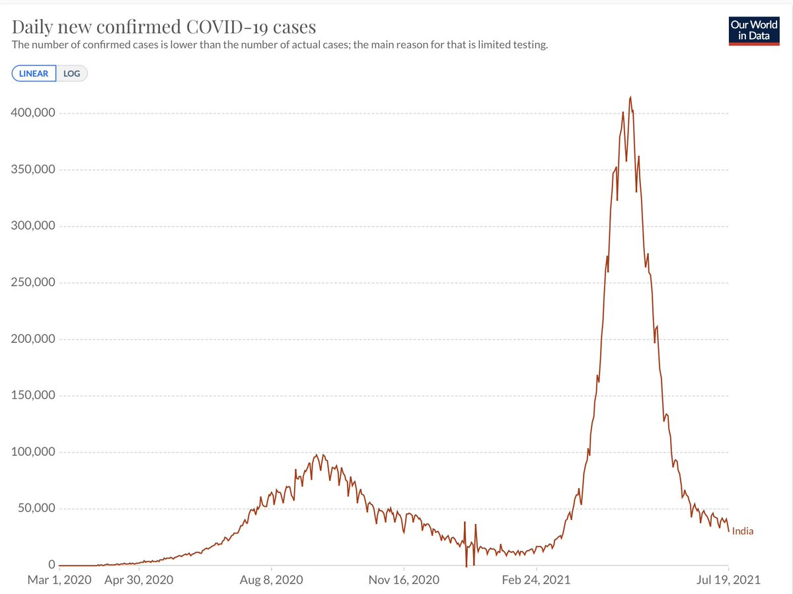</img></a>

---

<a href="https://twitter.com/erictopol/status/1417528085663010825" target="_blank" rel="noreferer">16:53 UCT</a>

How to counter the US exponential rise of Delta to &gt;80% of cases is to stop the denominator of cases, the vicious loop, which drives everything. How to do that: vaccinations, masks and all the things we know work and aren't doing enough of them 

<a href="E6wR_x5VUAsLBNN.jpg"  >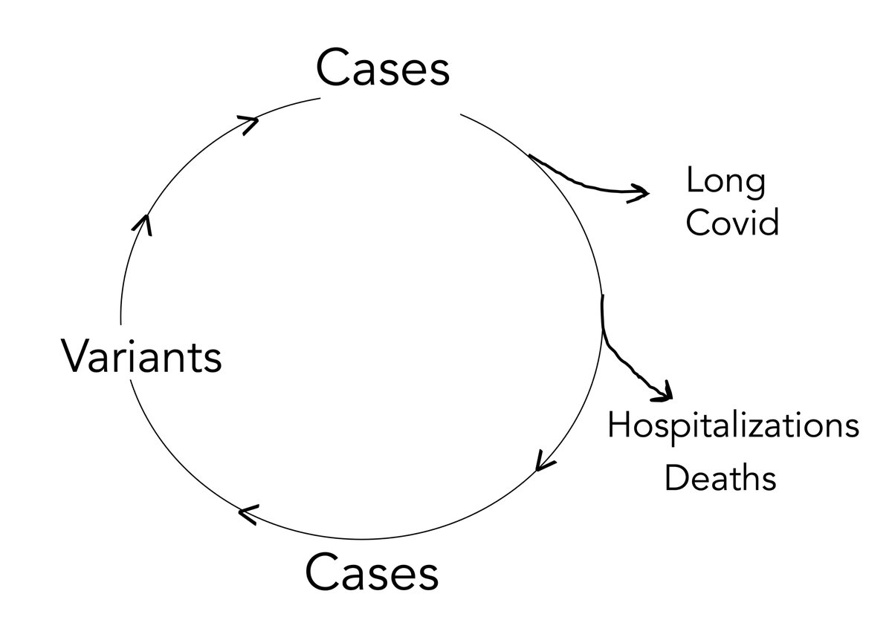</img></a>

---

<a href="https://twitter.com/erictopol/status/1417551725880242176" target="_blank" rel="noreferer">18:27 UCT</a>

Just published @ScienceMagazine 
Discovery of masitinib, from a library of 1,900 drugs, with potent anti-replication activity against #SARSCoV2 (via 3CLpro) and its major variants, and can be given as a pill @justsaysinmice 
https://science.sciencemag.org/content/early/2021/07/19/science.abg5827 

<a href="E6wnHNRVIAYP-P5.jpg"  >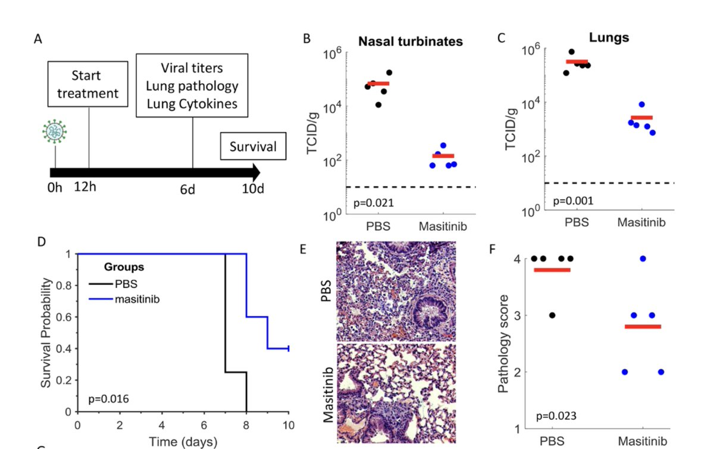</img></a>

---

<a href="https://twitter.com/erictopol/status/1417562950471090179" target="_blank" rel="noreferer">19:11 UCT</a>

Quite a contrast
&gt;90% Delta in Arkansas &amp; Vermont http://covariants.org
Arkansas, 35% fully vaccinated, highest [36] cases/100,000  in the US, rising hospitalization (H) &amp; deaths
Vermont, 67% vaccinated, also seeing case growth to just 2/100K (near lowest) and *less* H 

<a href="E6wx9wbVkAIe5Hf.jpg"  >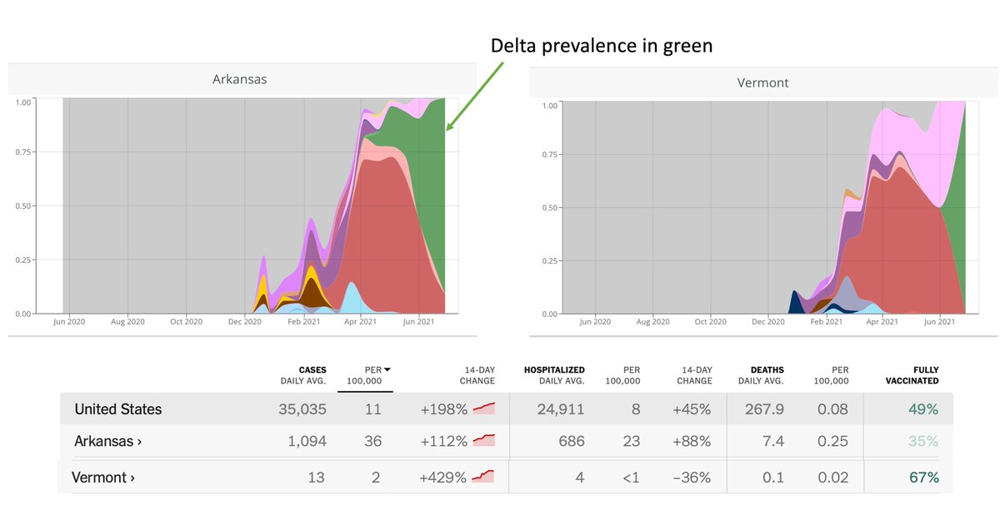</img></a>

---

<a href="https://twitter.com/erictopol/status/1417578635951673347" target="_blank" rel="noreferer">20:14 UCT</a>

Their covid test positivity looks a little different, too
(not just the Y-axis)
https://coronavirus.jhu.edu/testing/individual-states/vermont 

<a href="E6xAP3jUUAAtUCC.jpg"  >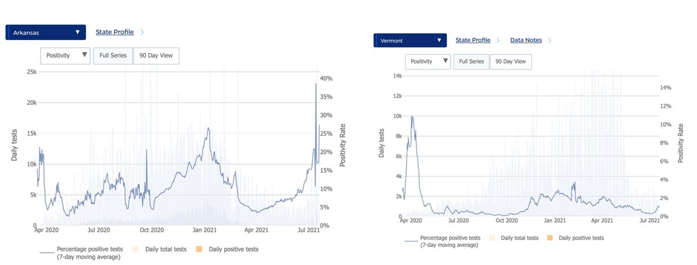</img></a>

---

<a href="https://twitter.com/erictopol/status/1417611945260109826" target="_blank" rel="noreferer">22:26 UCT</a>

A new lab study preprint compares the 2-dose mRNA vaccines with 1-dose J&amp;J for neutralizing antibodies vs Delta https://www.biorxiv.org/content/10.1101/2021.07.19.452771v1 

<a href="E6xYd5yVIAA9QCO.jpg"  >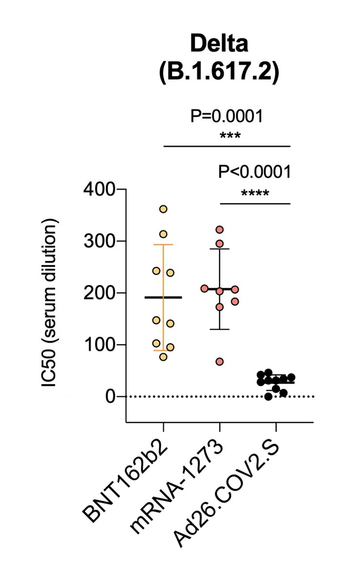</img></a>

---

<a href="https://twitter.com/erictopol/status/1417617792556101634" target="_blank" rel="noreferer">22:49 UCT</a>

This finding on the Lambda variant today is of uncertain significance, as it has not been adequately characterized. It does, however, reinforce the need for genomic surveillance 

<a href="E6xjcxgVIAAQgA0.jpg"  >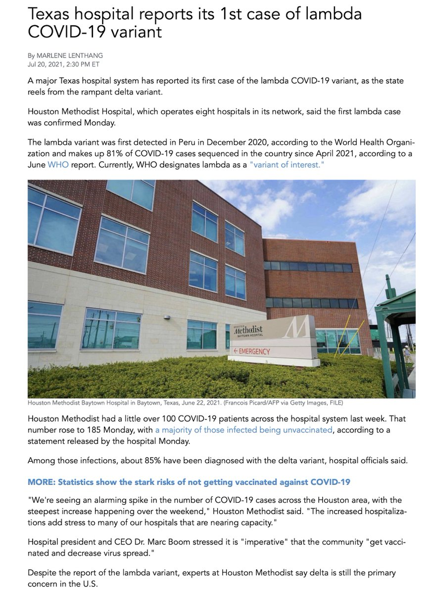</img></a>

---

<a href="https://twitter.com/erictopol/status/1417618505583656964" target="_blank" rel="noreferer">22:52 UCT</a>

@andy_matuschak Exactly. Not happening at once, but there's the liability of non-100% protection and the misunderstanding of why some breakthrough illnesses among a huge denominator (162 million Americans fully vaccinated) should not create a stir.

---

<a href="https://twitter.com/erictopol/status/1417626586292002819" target="_blank" rel="noreferer">23:24 UCT</a>

These new data are not contradictory; the @NEJM report did not compare vs mRNA vaccines. https://www.nytimes.com/2021/07/20/health/coronavirus-johnson-vaccine-delta.html The headline "ineffective" below is misleading: the neutralizing antibodies w/ J&amp;J were above threshold for concern (dotted line) &amp; there's also the T cell response

---

<a href="https://twitter.com/erictopol/status/1417632047720370176" target="_blank" rel="noreferer">23:46 UCT</a>

I miss @COVID19Tracking which provided same day, accurate covid hospitalizations and has not been taken up @CDCgov, as expected. We need this critical data now to follow Delta. Today &gt;27,000, a substantial rise from 15K nadir; we've still got a ways to go to get thru this wave 

<a href="E6xvqIdVUAAUssz.jpg"  >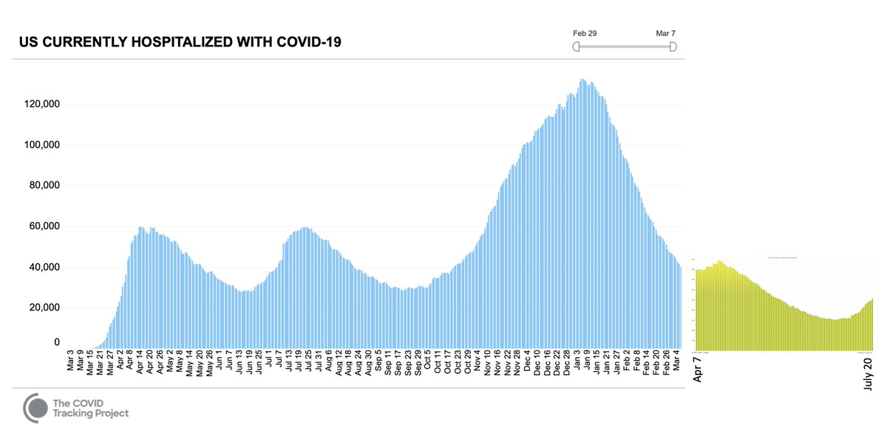</img></a>