+++
title = "Tweets by Eric Topol July 21"
Summary = ""
tags = ["Twitter"]
category = "Twitter"
+++

---

<a href="https://twitter.com/erictopol/status/1417654186930425860" target="_blank" rel="noreferer">01:14 UCT</a>

It has been over 7 months since the US vaccination campaign began. Yet TV and newspaper articles incessantly show people getting needles into their arms. I think we know what that looks like now. Enough

---

<a href="https://twitter.com/erictopol/status/1417661401045225475" target="_blank" rel="noreferer">01:43 UCT</a>

RT @totallyfearless: @EricTopol I think they should show stuff like this https://twitter.com/totallyfearless/status/1417654676703662083

<a href="E6yFaE8WUAoI4Ea.jpg"  >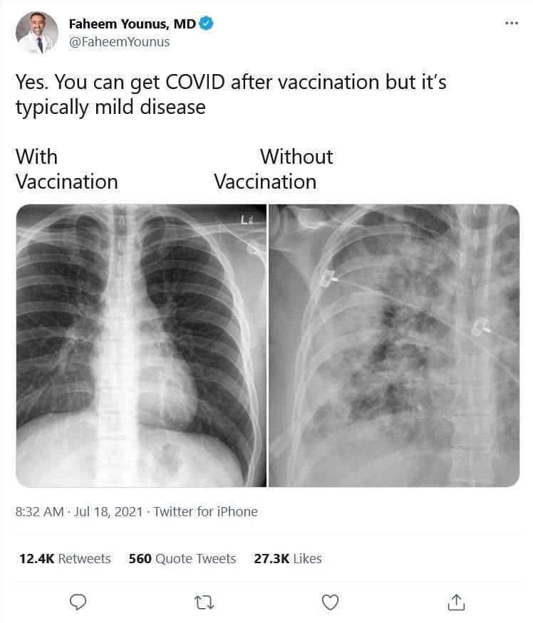</img></a>

---

<a href="https://twitter.com/erictopol/status/1417669343588929537" target="_blank" rel="noreferer">02:14 UCT</a>

@AstroKatie @grundil I wonder how many people even watched their own inoculation, Katie.  No less to watch others non-stop

---

<a href="https://twitter.com/erictopol/status/1417712075791421441" target="_blank" rel="noreferer">05:04 UCT</a>

The 3 states with the lowest (34%) fully vaccinated people in the country https://www.ft.com/content/39ff87ce-57b7-4007-9504-7eb2c7bc911f
"The Delta variant is spreading in our state. The growth of cases is exponential. The rise in hospitalizations is exponential"—@DillahaMD
https://twitter.com/EricTopol/status/1417562950471090179 

<a href="E6y5nJPVoAY7n5h.jpg"  >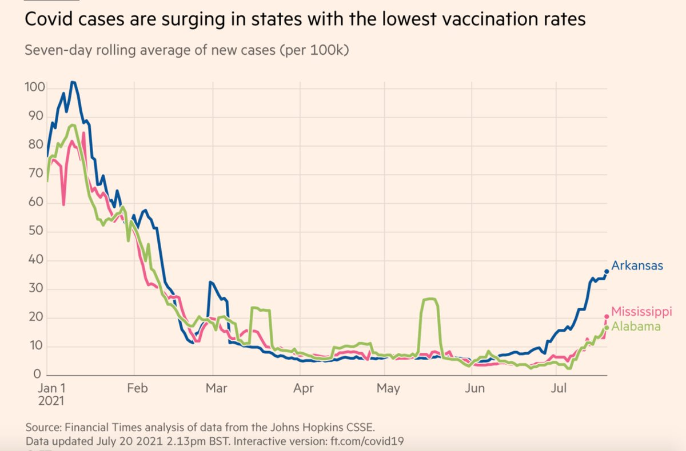</img></a>

---

<a href="https://twitter.com/erictopol/status/1417835595435450371" target="_blank" rel="noreferer">13:15 UCT</a>

The initial aggressive US vaccination rollout, with up to 4.5 million shots per day, essentially squashed the Alpha variant in its tracks, giving the sense the pandemic end was near. 
Little did we know that Delta would be the real Alpha of #SARSCoV2

---

<a href="https://twitter.com/erictopol/status/1417854010451628040" target="_blank" rel="noreferer">14:28 UCT</a>

Proxy for vax efficacy?
"A neut [neutralizing antibody] level that keeps us safe from Alpha won’t necessarily thwart Beta or Delta to the same extent. (There’s at least good news on T cells, which are much harder to stump with mutations)"
https://www.theatlantic.com/science/archive/2021/07/correlates-of-protection-vaccine-immunity/619508/ by @KatherineJWu 

<a href="E606Z_XVIAU8uVY.jpg"  >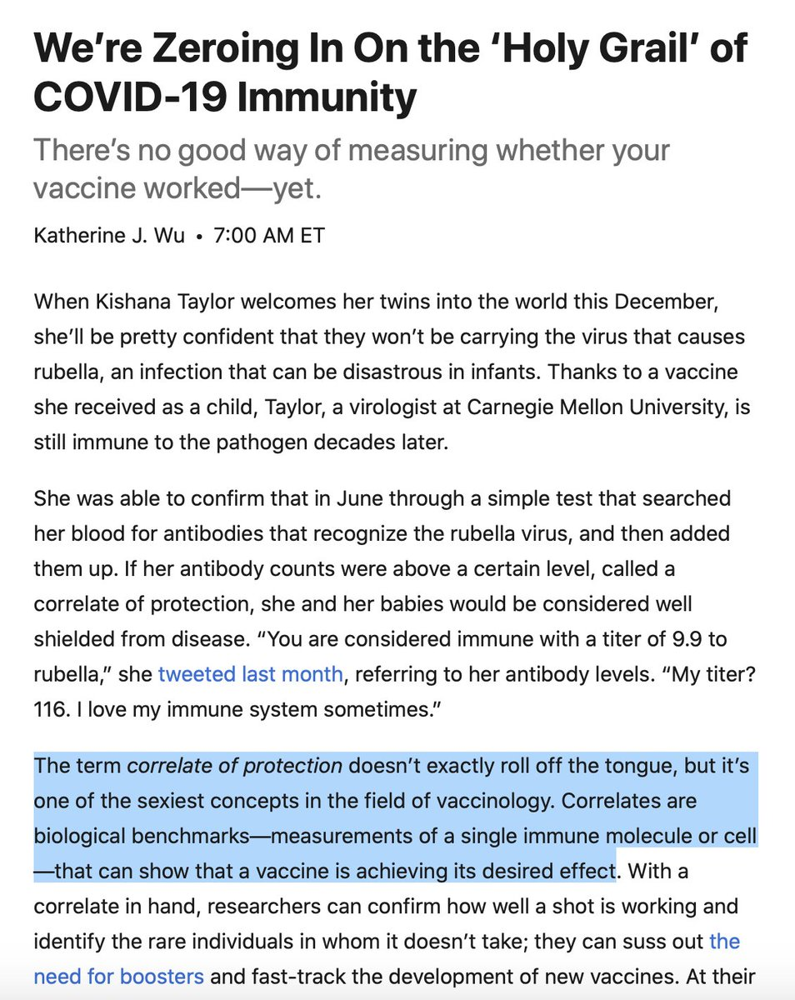</img></a>

---

<a href="https://twitter.com/erictopol/status/1417862154305216525" target="_blank" rel="noreferer">15:00 UCT</a>

Deaths and Delta
Like hospitalizations in the US, they are up &gt;40% in the past 2 weeks, while cases are up 200% https://www.nytimes.com/interactive/2021/us/covid-cases.html?name=styln-coronavirus-live&region=TOP_BANNER&block=storyline_menu_recirc&action=click&pgtype=LegacyCollection&variant=1_Show&is_new=false
The relative values don't convey the remarkable vaccine impact here and in UK, Portugal w/ higher, longer Delta hit 👇 

<a href="E60-2O3VkAgRtOO.jpg"  >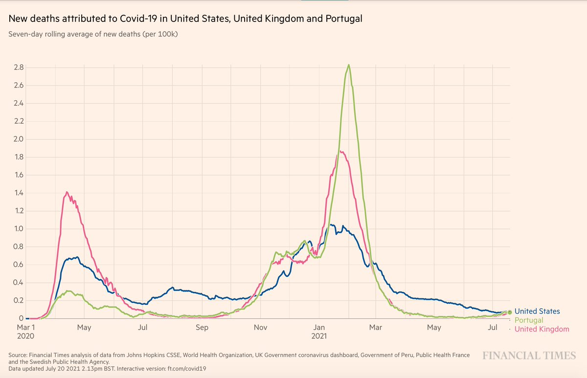</img></a>

---

<a href="https://twitter.com/erictopol/status/1417862158931546114" target="_blank" rel="noreferer">15:00 UCT</a>

We're several weeks behind those countries. This log plot showing replication of UK and Portugal is notable for where we are headed. Nearly all these deaths are among unvaccinated people and are preventable. 

<a href="E61Au7RVgAAWK73.jpg"  >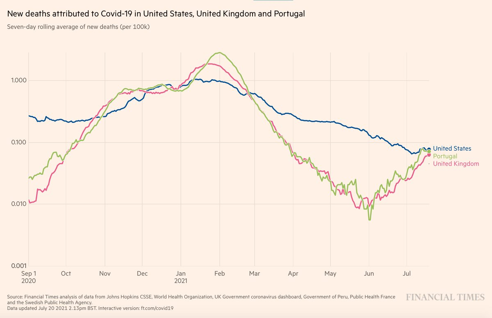</img></a>

---

<a href="https://twitter.com/erictopol/status/1417872882412056582" target="_blank" rel="noreferer">15:43 UCT</a>

RT @DLeonhardt: The contrast between 1) the public statements of @US_FDA leaders about the Covid vaccines and 2) the agency's actions on th…

---

<a href="https://twitter.com/erictopol/status/1417875825060311040" target="_blank" rel="noreferer">15:55 UCT</a>

These states are already at &gt; 50% of their pandemic peak for hospitalizations and the slope of rise is higher than any time previously 
@CovidActNow 

<a href="E61OMI1VgAIB3BS.jpg"  >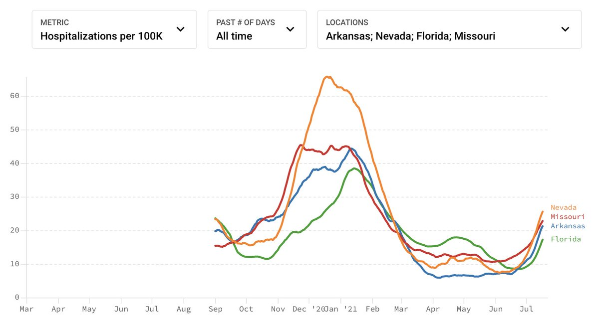</img></a>

---

<a href="https://twitter.com/erictopol/status/1417882807737622535" target="_blank" rel="noreferer">16:22 UCT</a>

RT @DrTomFrieden: I’m hearing from vaccinated people who are frightened about breakthrough cases, the Delta variant, and new waves of Covid…

---

<a href="https://twitter.com/erictopol/status/1417888702735413251" target="_blank" rel="noreferer">16:46 UCT</a>

The #1 strategy to confront the #1 American public health issue. The FDA is a no show. https://twitter.com/DLeonhardt/status/1417873426069573638

---

<a href="https://twitter.com/erictopol/status/1417898752698814464" target="_blank" rel="noreferer">17:26 UCT</a>

On "breakthrough" infections post-vaccination in India.
 ~5% of &gt;28,000 healthcare workers with mild symptoms, 0.29% led to hospitalization, no deaths; they were 83% suppressed by AZ and Bharat Biotech vaccines
https://papers.ssrn.com/sol3/papers.cfm?abstract_id=3889352

---

<a href="https://twitter.com/erictopol/status/1417908439217446912" target="_blank" rel="noreferer">18:04 UCT</a>

@matthewherper @PamBelluck @BySheilaKaplan @RebeccaDRobbins Kudos to @statnews for breaking this important story and @nytimes for staying on it. In my view, the nadir I have seen for FDA in over 3 decades 

<a href="E61r_U4UUAA5Ik2.jpg"  >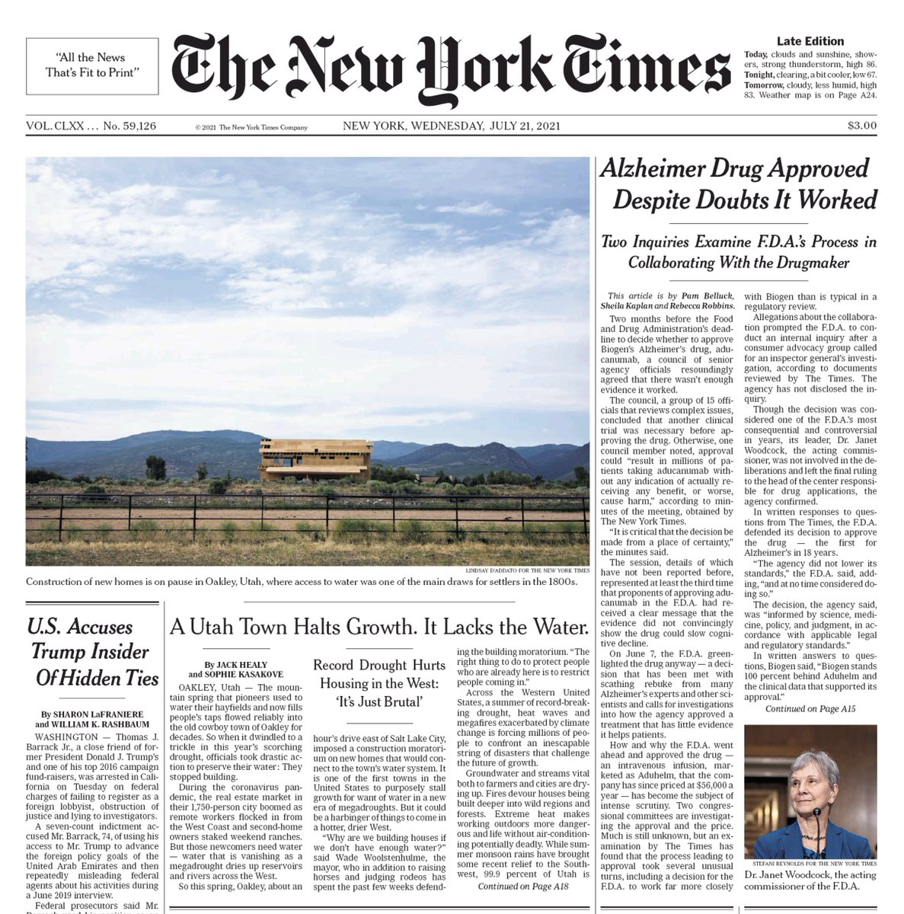</img></a>

---

<a href="https://twitter.com/erictopol/status/1417920130030333954" target="_blank" rel="noreferer">18:51 UCT</a>

This is an encouraging finding from a well regarded group of researchers. The lack of respectful responses is noteworthy and so is the discounting of anything positive by many 

<a href="E611kmUVkAA1-c2.jpg"  >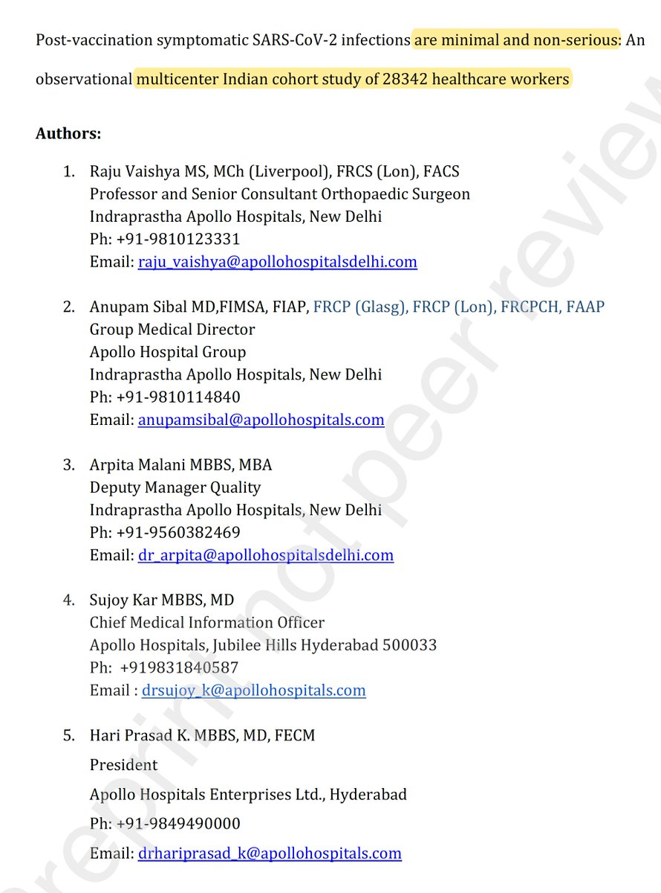</img></a>

---

<a href="https://twitter.com/erictopol/status/1417929984207769600" target="_blank" rel="noreferer">19:30 UCT</a>

@chrislhayes Yes, but....
Would have helped a lot more before Delta reached &gt;85% there
https://outbreak.info/location-reports?loc=USA_US-FL&selected=B.1.1.7&selected=B.1.617.2 

<a href="E61_snDUcAAoPN9.jpg"  >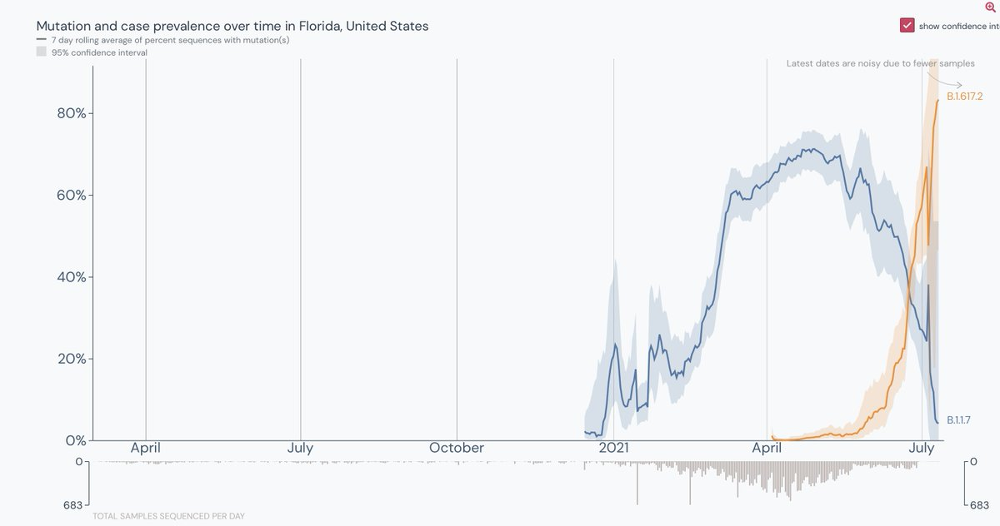</img></a>

---

<a href="https://twitter.com/erictopol/status/1417932158065254401" target="_blank" rel="noreferer">19:39 UCT</a>

Good thread on some of the data we've been hearing about (but not seeing) on the potential of "waning immunity" for people who got vaccinated early in the Israeli campaign. They also happened to be the most vulnerable. 
Still many uncertainties. https://twitter.com/Nadav_Eyal/status/1417923435737534467

---

<a href="https://twitter.com/erictopol/status/1417955897087725569" target="_blank" rel="noreferer">21:13 UCT</a>

Just published @NEJM 
Vaccine protection against the Delta variant from &gt;4,000 cases + comparison w/ Alpha, by @PHE_uk 
—mRNA, 2-dose: 88% effectiveness vs *any* symptomatic infection
—AZ, 2-dose: 67% 

<a href="E62OE-4UYAASgA4.jpg"  >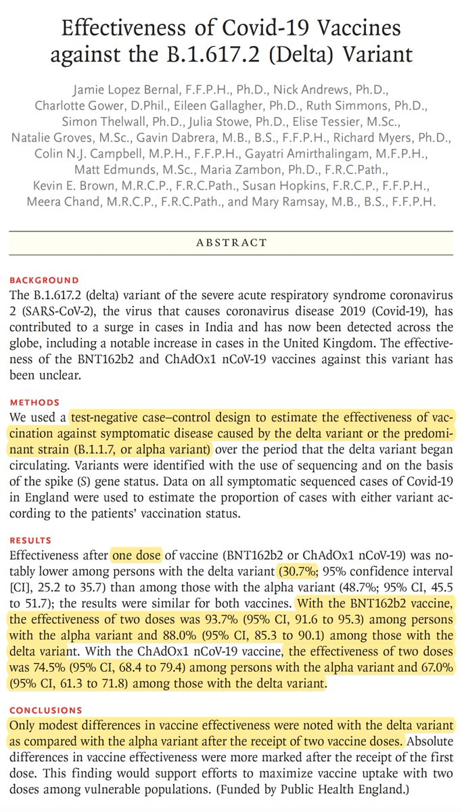</img></a><a href="E62PRckVIAAtPEq.jpg"  >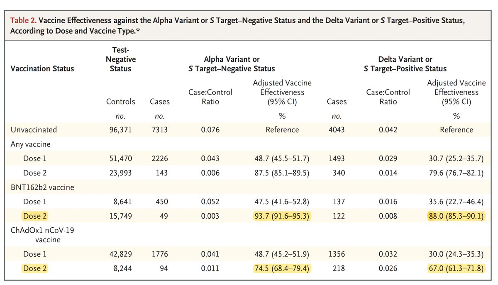</img></a>

---

<a href="https://twitter.com/erictopol/status/1417956870283661312" target="_blank" rel="noreferer">21:17 UCT</a>

link and key figure
https://www.nejm.org/doi/full/10.1056/NEJMoa2108891?query=featured_home 

<a href="E62YMatVEAA_G4C.jpg"  >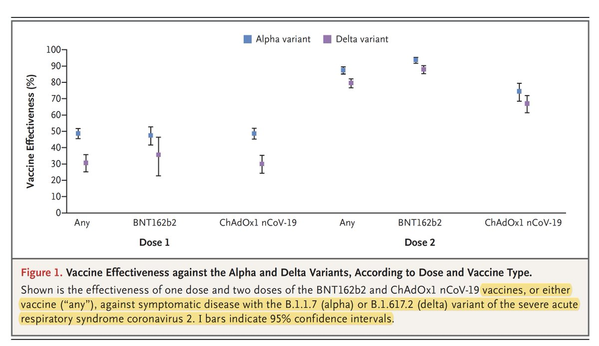</img></a>

---

<a href="https://twitter.com/erictopol/status/1417982497476911107" target="_blank" rel="noreferer">22:59 UCT</a>

Household transmission of covid: tracing camp kids back to home shows their ability to transmit, less for age 7-17 than older, and mitigated by masks and distancing
https://www.nejm.org/doi/full/10.1056/NEJMc2031915?query=featured_home @NEJM today by @CDCgov 

<a href="E62vXW1VUAITeMi.jpg"  >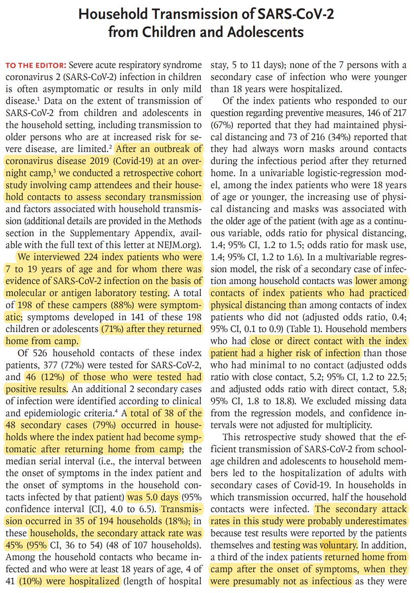</img></a><a href="E62vZAgUcAMCLaq.jpg"  >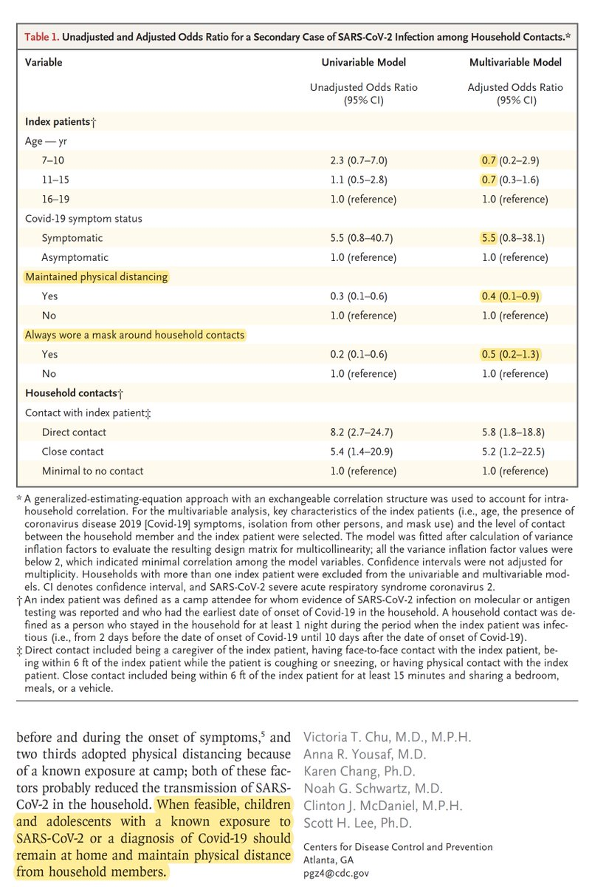</img></a>

---

<a href="https://twitter.com/erictopol/status/1417987504628584454" target="_blank" rel="noreferer">23:19 UCT</a>

This advisory should be issued well beyond New Orleans. Like the US. https://www.ft.com/content/0494876b-6be8-4d42-8d1c-d4be8a955caa @FT 
Had to edit "The Delta variant is alive and very much well in..." 

<a href="E62zv-sVcAUzLdf.jpg"  >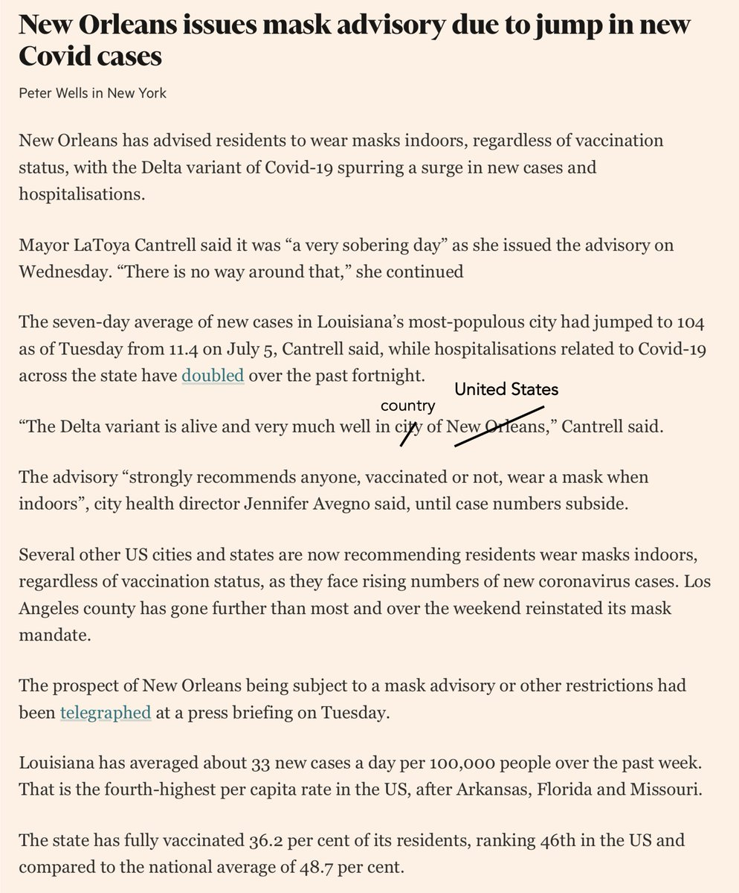</img></a>