+++
title = "Tweets by Eric Topol July 23"
Summary = ""
tags = ["Twitter"]
category = "Twitter"
+++

---

<a href="https://twitter.com/erictopol/status/1418414238113026053" target="_blank" rel="noreferer">03:34 UCT</a>

With 67% of their residents fully vaccinated, highest in the US, Vermont continues to show Delta can be contained and hospitalizations can actually decrease....the only state in the US that has done that
https://newsnodes.com/us_state/VT
(What if the US had 67% instead of 49% fully vexed?) 

<a href="E683pPyUUAEtGLQ.jpg"  >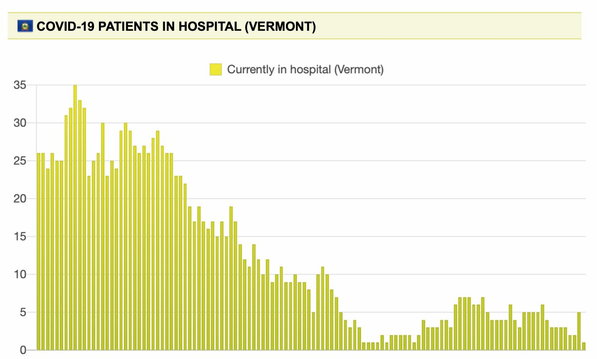</img></a>

---

<a href="https://twitter.com/erictopol/status/1418415230132969474" target="_blank" rel="noreferer">03:38 UCT</a>

sorry, was changed to vexed by autocorrect! Vaxxed. Love #AI 

<a href="E685BD0VoAEFRXR.jpg"  >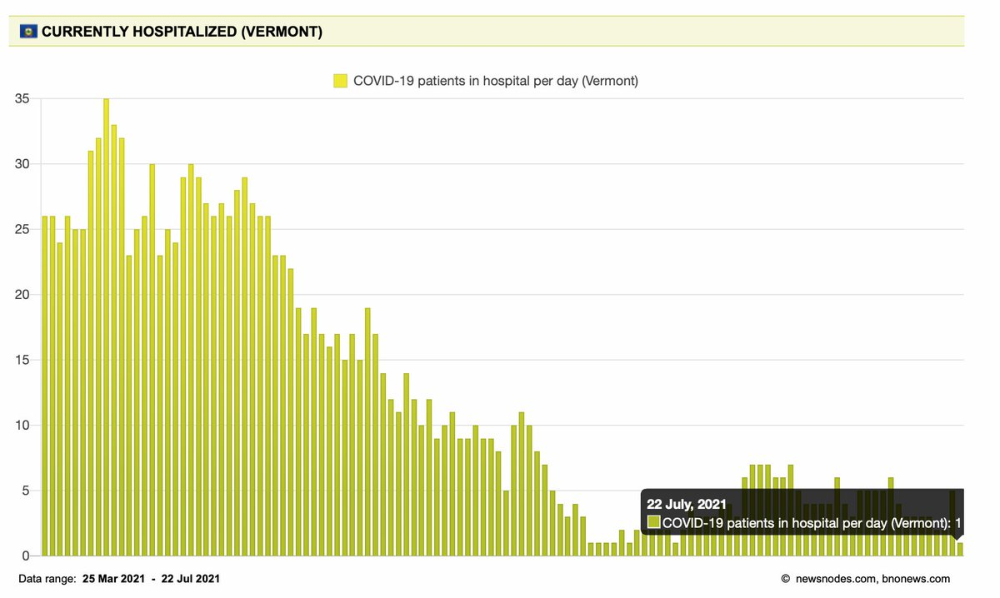</img></a>

---

<a href="https://twitter.com/erictopol/status/1418426634823114753" target="_blank" rel="noreferer">04:23 UCT</a>

@ashishkjha Reminds me of this today https://www.economist.com/graphic-detail/2021/07/24/the-right-and-wrong-ways-to-reduce-vaccine-hesitancy

---

<a href="https://twitter.com/erictopol/status/1418558797102993411" target="_blank" rel="noreferer">13:09 UCT</a>

New @PHE_uk report today: new data on reinfection for prior covid, risk of Delta ~1.5X that of Alpha, particularly if &gt;6 months prior https://assets.publishing.service.gov.uk/government/uploads/system/uploads/attachment_data/file/1005517/Technical_Briefing_19.pdf 

<a href="E6-7Y4sVkAQ7Rip.jpg"  >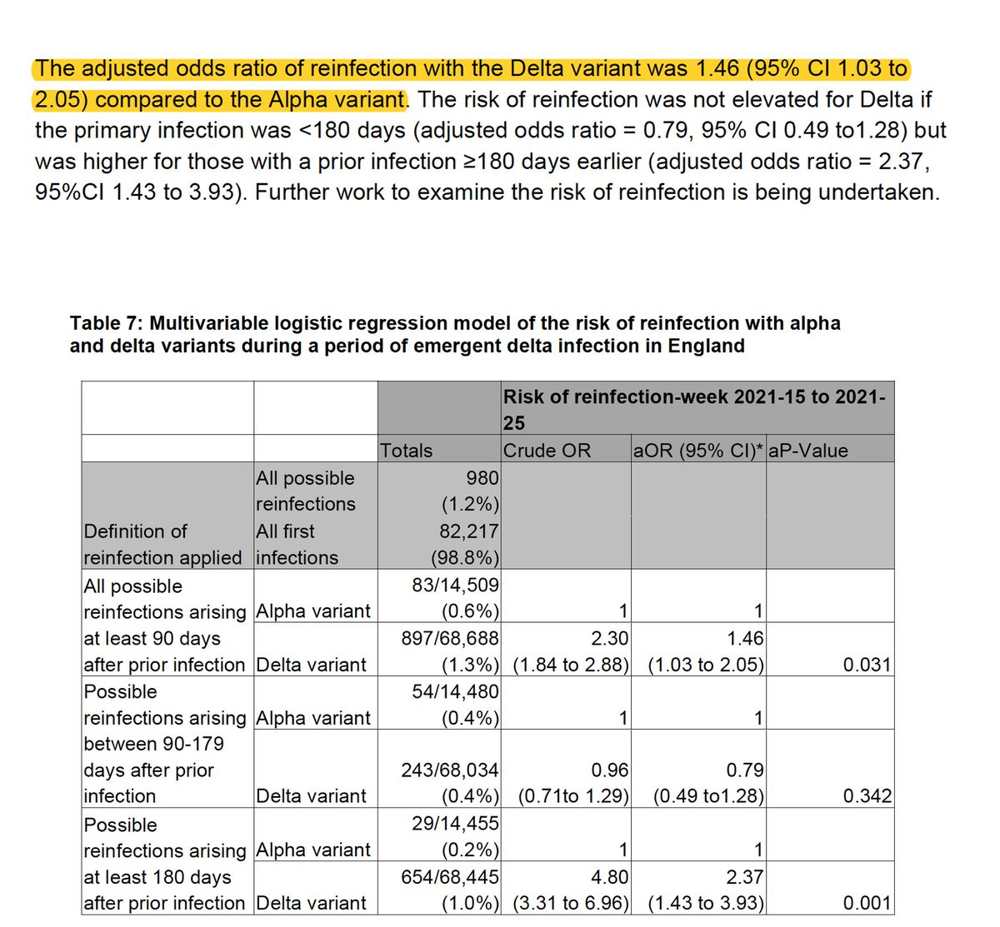</img></a>

---

<a href="https://twitter.com/erictopol/status/1418562402946228236" target="_blank" rel="noreferer">13:23 UCT</a>

Why is "I'm vaccinated, I'm fully protected" wrong?
The pivotal clinical trials, such as with mRNA vaccines, showed a 95% reduction of symptomatic infections, the primary endpoint. Not 100%
That was pre-Delta
https://www.nytimes.com/2021/07/22/health/coronavirus-breakthrough-infections-delta.html?action=click&module=Top%20Stories&pgtype=Homepage/ @apoorva_nyc /1 

<a href="E6--kYQVIAE8Avn.jpg"  >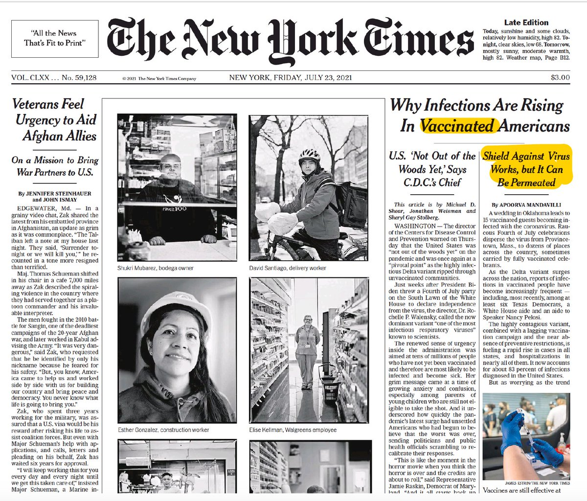</img></a>

---

<a href="https://twitter.com/erictopol/status/1418568439518568456" target="_blank" rel="noreferer">13:47 UCT</a>

We don't have an explanation for this glaring contradiction, which could include demographics, sample size, time from vax, all sorts of things. The delayed 2nd UK dose (8 wk) has been suggested by raising level of immunity. But we don't know yet /3
https://www.bbc.com/news/health-57929953

---

<a href="https://twitter.com/erictopol/status/1418568438025318405" target="_blank" rel="noreferer">13:47 UCT</a>

Now we have conflicting data for protection vs symptomatic infection post-mRNA vaccination for Delta
UK @NEJM 88% protection
https://twitter.com/EricTopol/status/1417955897087725569
Israel 40% protection (unpublished)
https://www.bloomberg.com/news/articles/2021-07-23/pfizer-shot-just-39-effective-in-halting-delta-israel-says /2

---

<a href="https://twitter.com/erictopol/status/1418568444459454464" target="_blank" rel="noreferer">13:47 UCT</a>

It is clear that post-vaccination Delta infections are more common than prior versions of the virus, such as this preprint from yesterday /4 https://www.medrxiv.org/content/10.1101/2021.07.19.21260808v1.full.pdf 

<a href="E6_B80QVEAQez1p.jpg"  >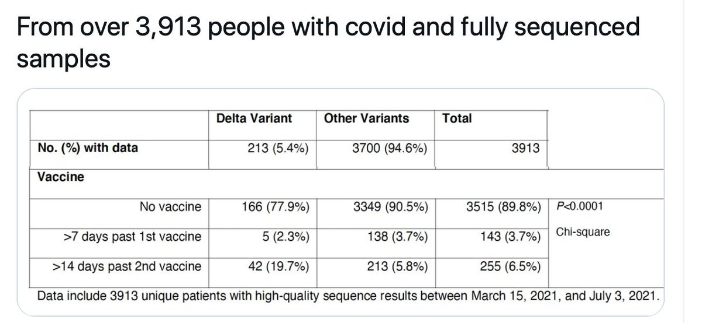</img></a>

---

<a href="https://twitter.com/erictopol/status/1418568448129396736" target="_blank" rel="noreferer">13:47 UCT</a>

So as @ASlavitt reviewed in his excellent thread last night, avoid what I call a Delta stress test for your vaccine- induced immunity, wear a mask indoors until this wave clears and there's low levels of virus around /6
https://twitter.com/ASlavitt/status/1418428400574681090

---

<a href="https://twitter.com/erictopol/status/1418568446799872000" target="_blank" rel="noreferer">13:47 UCT</a>

There is certain risk for infection Delta post-vaccination, even with the most potent vaccines, although the level of risk is uncertain (between 39-88% protection so far. The risk for severe illness (incl hospitalization/death) is extremely low (&lt;-can't be emphasized enough) /5

---

<a href="https://twitter.com/erictopol/status/1418569831297687553" target="_blank" rel="noreferer">13:52 UCT</a>

@ScottGottliebMD Agree, Scott. Reassuring dataset on this concern. Minor point: Alpha wasn't Wuhan (ancestral)

---

<a href="https://twitter.com/erictopol/status/1418572837288222730" target="_blank" rel="noreferer">14:04 UCT</a>

It's counterintuitive but simple math for why many people post-vaccination could be hospitalized for covid and vaccines are still 95% effective in preventing hospitalizations. Explainer: https://www.ft.com/content/a8c0f5f2-d27c-4b13-a1a4-440710bc6967 by @TimHarford @FT 

<a href="E6_IAdmVkAEZusd.jpg"  >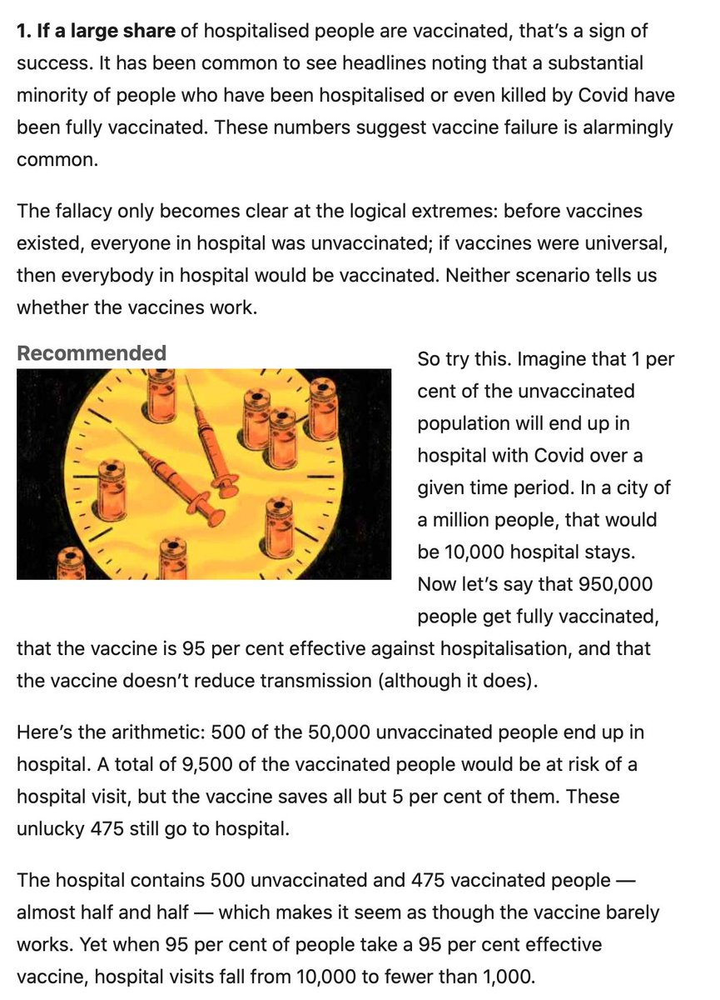</img></a>

---

<a href="https://twitter.com/erictopol/status/1418577210437378075" target="_blank" rel="noreferer">14:22 UCT</a>

I had a chat with @kristy_tea this week about Delta, vaccines, the FDA, masks, but I didn't know it would get turned into this. Thanks @sdut  https://twitter.com/sdutOpinion/status/1418314018012372993

<a href="E6_LeOxUcAcA_px.jpg"  >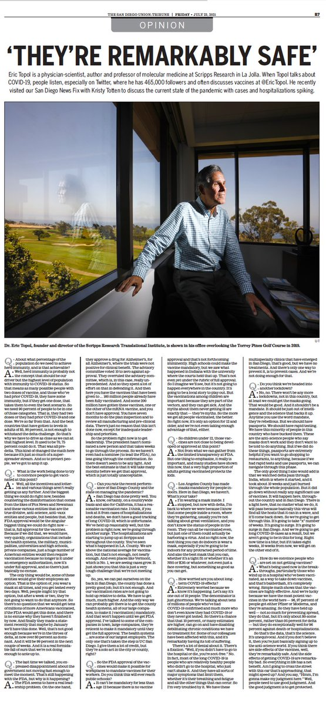</img></a>

---

<a href="https://twitter.com/erictopol/status/1418579374094225419" target="_blank" rel="noreferer">14:30 UCT</a>

From today's @PHE_UK report, who is getting Delta infections? The fundamental message https://twitter.com/kallmemeg/status/1418567528322945031

---

<a href="https://twitter.com/erictopol/status/1418585725411364872" target="_blank" rel="noreferer">14:56 UCT</a>

"What science has given, politics seems to be taking away"—@FareedZakaria (who nails it ★)
https://www.washingtonpost.com/opinions/2021/07/22/anti-vaccine-sentiment-in-the-us-is-unprecedented/
@PostOpinions 

<a href="E6_Sm0IUcAIf4eu.jpg"  >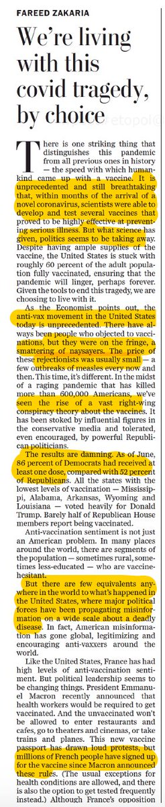</img></a><a href="E6_Soj9VkAMqO0R.jpg"  >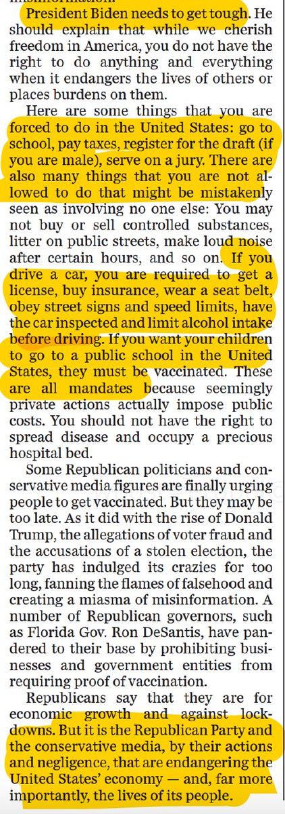</img></a>

---

<a href="https://twitter.com/erictopol/status/1418587094990028805" target="_blank" rel="noreferer">15:01 UCT</a>

@1flapdown77 @BillKristol Vermont is highest in the country at 67% of total population, fully vaccinated. Your 77% refers to only adults and first dose

---

<a href="https://twitter.com/erictopol/status/1418599773053980674" target="_blank" rel="noreferer">15:51 UCT</a>

And better yet today! A 10% drop 🙏🙏  https://twitter.com/EricTopol/status/1418235741138681858

<a href="E6_g5GkVkAMB3bO.jpg"  >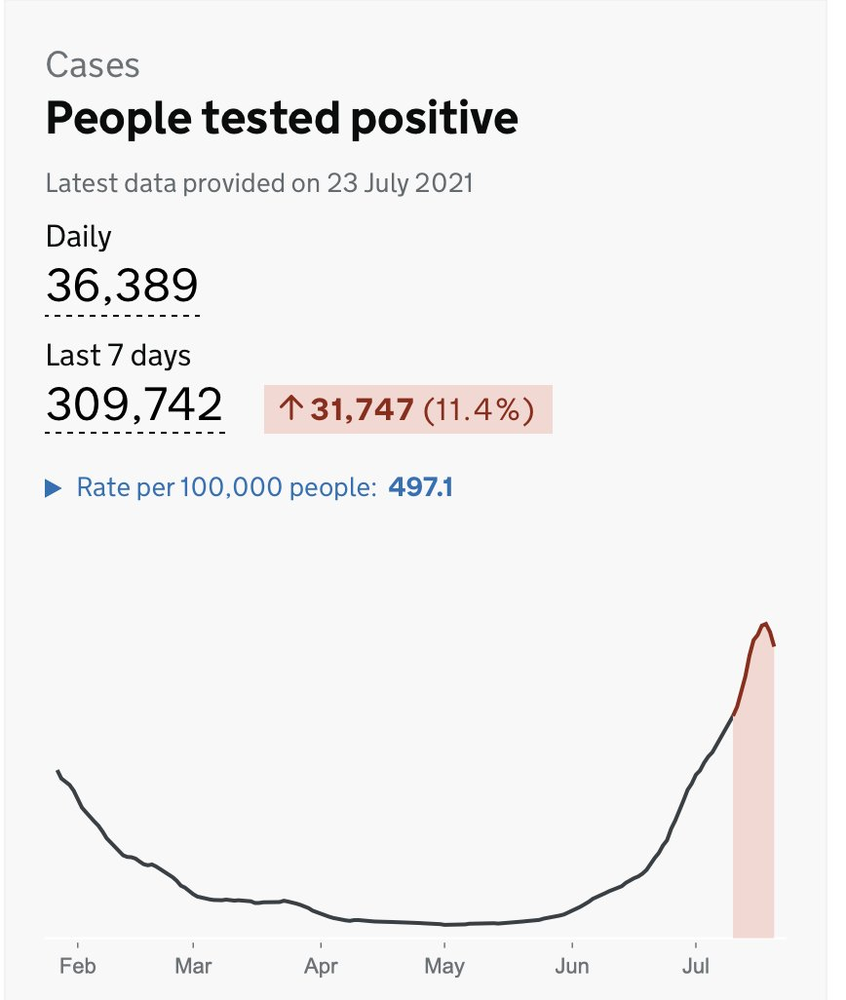</img></a>

---

<a href="https://twitter.com/erictopol/status/1418601456316280838" target="_blank" rel="noreferer">15:58 UCT</a>

Hang in there.
The law of gravity applies to Delta waves.
We'll get through this; it's just a matter of weeks 

<a href="E6_h7FHUcAMSUsq.jpg"  >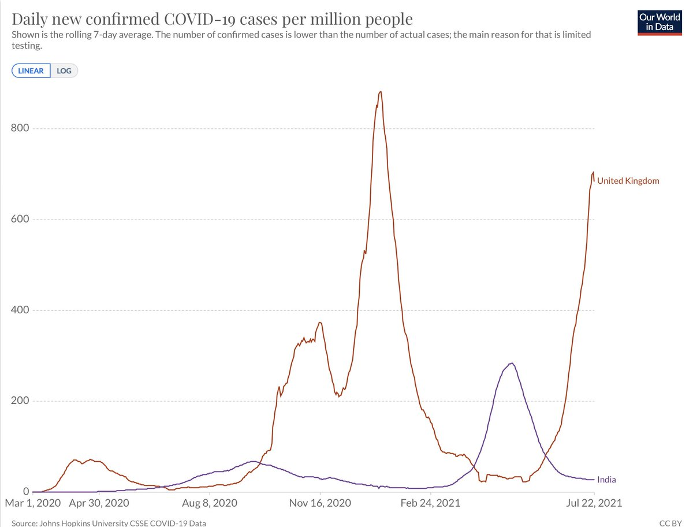</img></a>

---

<a href="https://twitter.com/erictopol/status/1418618678069764096" target="_blank" rel="noreferer">17:07 UCT</a>

A new (preprint) study in 61 people w/ kidney transplants and  3-doses of mRNA vaccines. It's safe and it helps with both antibody response, T cells, and vs variants 
https://papers.ssrn.com/sol3/papers.cfm?abstract_id=3890865 

<a href="E6_x3AuUUAAoHmL.jpg"  >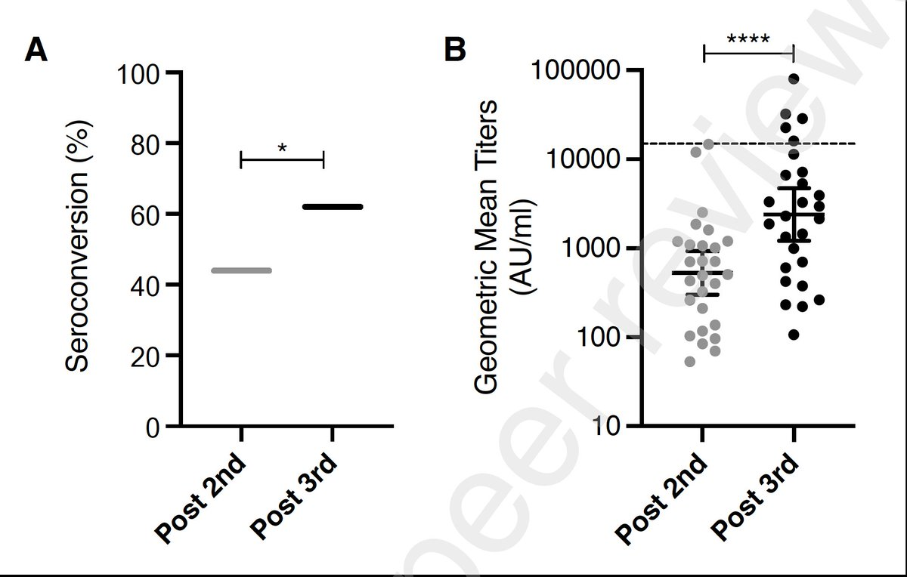</img></a><a href="E6_x4UjVgAMOOyp.jpg"  >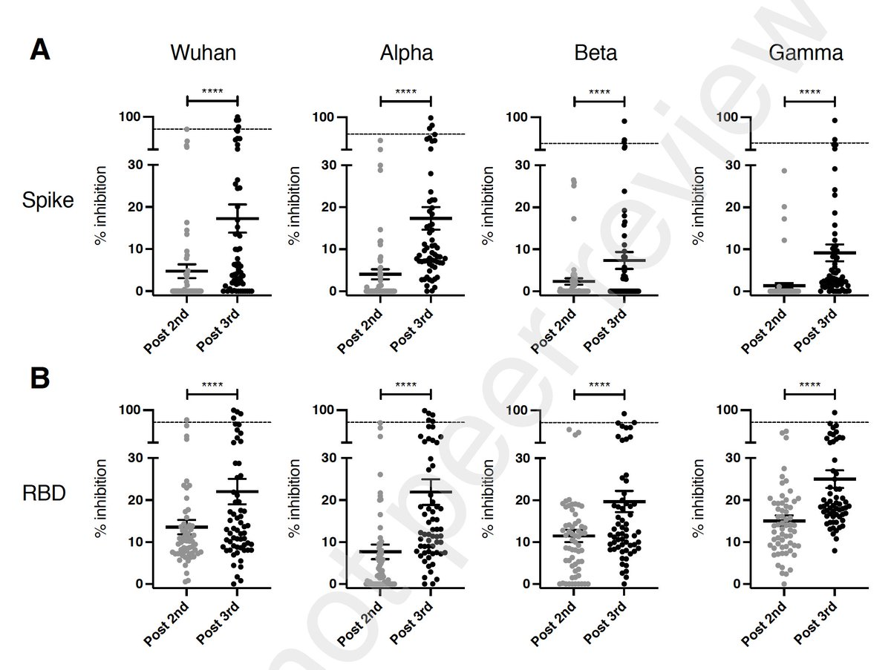</img></a><a href="E6_x64kVkAIYZ_0.jpg"  >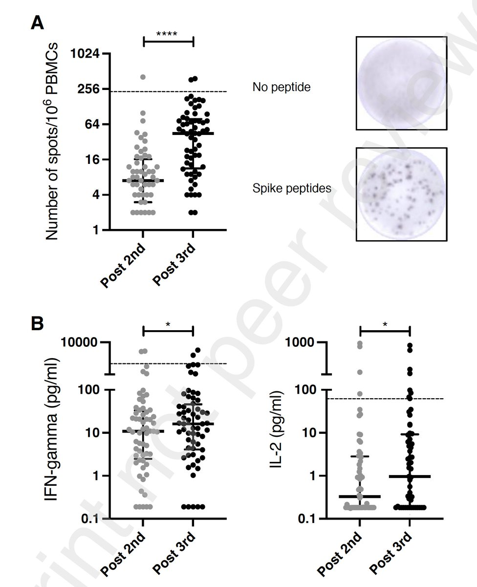</img></a>

---

<a href="https://twitter.com/erictopol/status/1418626369253101574" target="_blank" rel="noreferer">17:37 UCT</a>

More on this here
https://twitter.com/Birdyword/status/1418592323831750664

---

<a href="https://twitter.com/erictopol/status/1418630949726654466" target="_blank" rel="noreferer">17:55 UCT</a>

RT @ASlavitt: My friend the scientist @EricTopol says it this way: just because the vaccines are great doesn’t mean you need to constantly…

---

<a href="https://twitter.com/erictopol/status/1418643203520008193" target="_blank" rel="noreferer">18:44 UCT</a>

RT @SamHarrisOrg: It was great speaking with @EricTopol about COVID misinformation, "vaccine hesitancy," and related issues.

https://t.co/…

---

<a href="https://twitter.com/erictopol/status/1418658327764955137" target="_blank" rel="noreferer">19:44 UCT</a>

And in @JAMANetworkOpen today similar findings in 159 individuals with kidney transplants and 3rd dose mRNA
https://jamanetwork.com/journals/jama/fullarticle/2782538?guestAccessKey=0471fe15-f223-43d7-b5c1-ac42d375e9a9&utm_source=For_The_Media&utm_medium=referral&utm_campaign=ftm_links&utm_content=tfl&utm_term=072321 

<a href="E7AWNtdVkAMUXgi.jpg"  >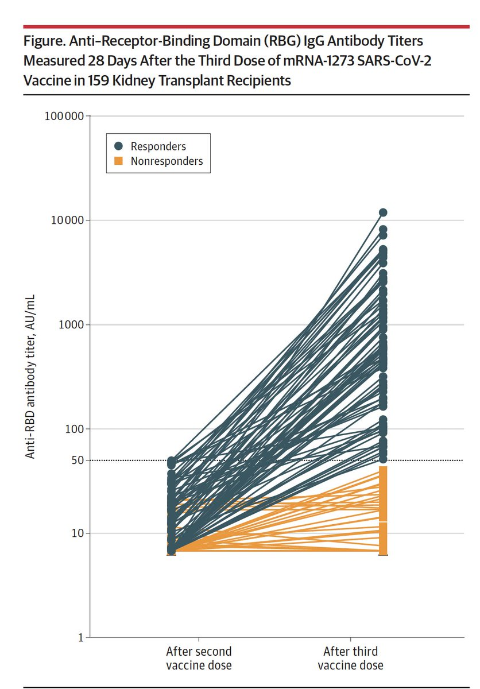</img></a>

---

<a href="https://twitter.com/erictopol/status/1418687703814529027" target="_blank" rel="noreferer">21:41 UCT</a>

Lifesaving impact of full vaccination on a log-plot graph by age, by @mroliverbarnes and @jburnmurdoch @FT
https://www.ft.com/content/0f11b219-0f1b-420e-8188-6651d1e749ff great #dataviz 

<a href="E7AwP0_VgAUHht7.jpg"  >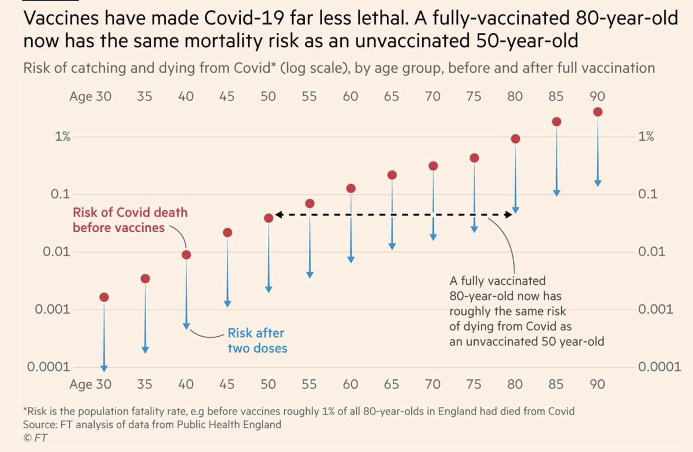</img></a>

---

<a href="https://twitter.com/erictopol/status/1418705030006198282" target="_blank" rel="noreferer">22:50 UCT</a>

Still find this counterintuitive?
Study this diagram by @jburnmurdoch and @mroliverbarnes @FT https://www.ft.com/content/0f11b219-0f1b-420e-8188-6651d1e749ff  https://twitter.com/EricTopol/status/1418572837288222730

<a href="E7BAiFtVgAEYWHE.jpg"  >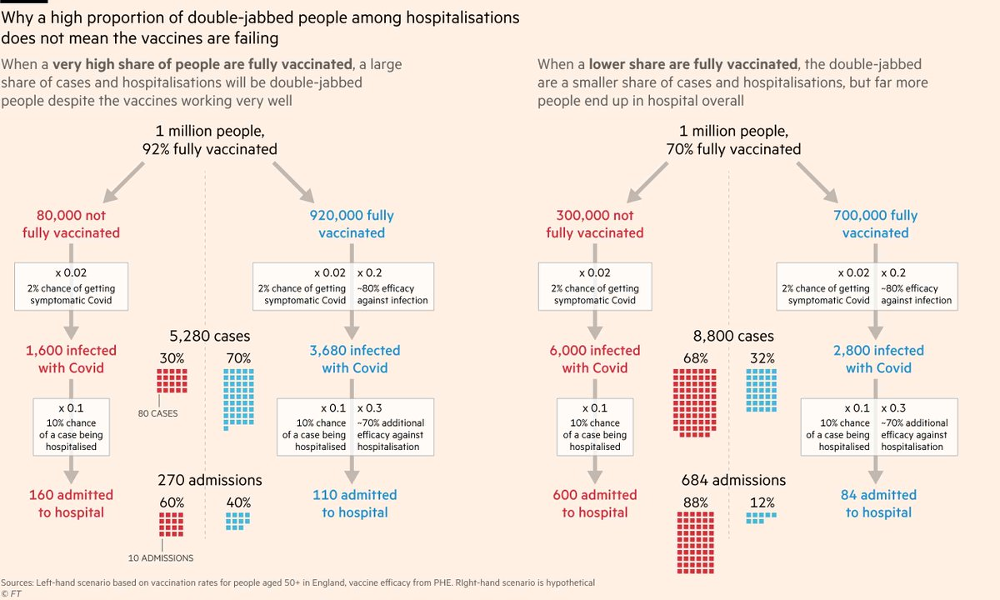</img></a>