+++
title = "Tweets by Eric Topol July 24"
Summary = ""
tags = ["Twitter"]
category = "Twitter"
+++

---

<a href="https://twitter.com/erictopol/status/1418752535611936768" target="_blank" rel="noreferer">01:58 UCT</a>

@joshzepps @AHuber2 There are many, but this says it well, from a leading vaccine expert who is relied on by CDC and FDA https://twitter.com/erictopol/status/1411693840767995905?lang=en

---

<a href="https://twitter.com/erictopol/status/1418757113904439298" target="_blank" rel="noreferer">02:17 UCT</a>

@joshzepps @AHuber2 There’s no difference, widespread use just reinforces administration

---

<a href="https://twitter.com/erictopol/status/1418761316911575042" target="_blank" rel="noreferer">02:33 UCT</a>

Don't get numb about Delta's impact
—Nearly 70,000 US cases today 
—Sharp increases in hospitalizations
—Florida trends for both very concerning
—The epicenter—Arkansas &amp; Louisiana—leading case rise per capita, heading to 50/100K, and hospitalizations        Similar to UK pattern 

<a href="E7By7qJUUAIK72m.jpg"  >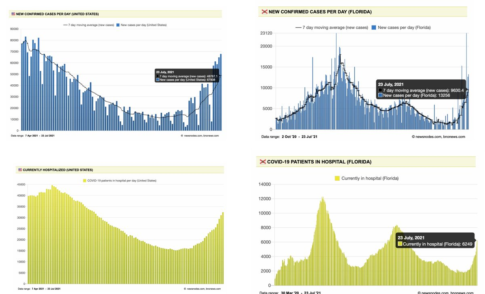</img></a><a href="E7BzlPjUUAICh38.jpg"  >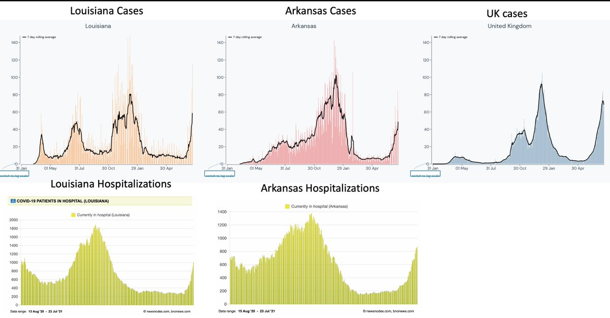</img></a>

---

<a href="https://twitter.com/erictopol/status/1418777384816316420" target="_blank" rel="noreferer">03:37 UCT</a>

2 weeks ago FDA and CDC issued a statement that booster vaccines won't be needed
https://www.cdc.gov/media/releases/2021/s-07082021.html
Today they've apparently changed their mind for "at least some Americans" (we still haven't seen the data)
https://www.nytimes.com/2021/07/23/us/covid-vaccine-boosters.html?action=click&module=Spotlight&pgtype=Homepage by @SharonLNYT 

<a href="E7CBlCOVoAIwIF3.jpg"  >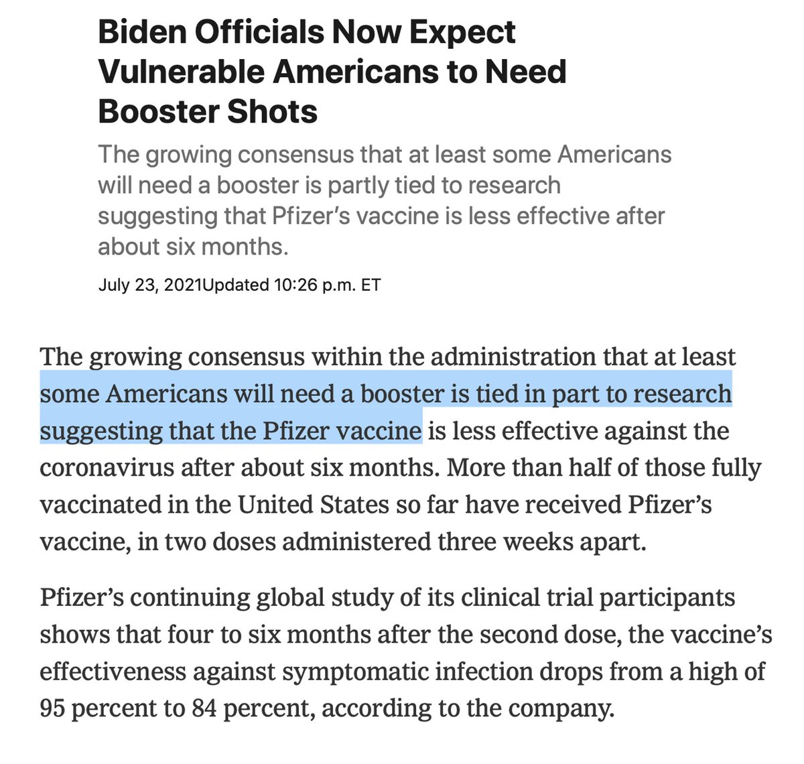</img></a>

---

<a href="https://twitter.com/erictopol/status/1418942529186123777" target="_blank" rel="noreferer">14:33 UCT</a>

Where Delta has led to many of the worst case surges of the pandemic, it is now in descent
@OurWorldInData 

<a href="E7EYdqUWYAUiazz.jpg"  >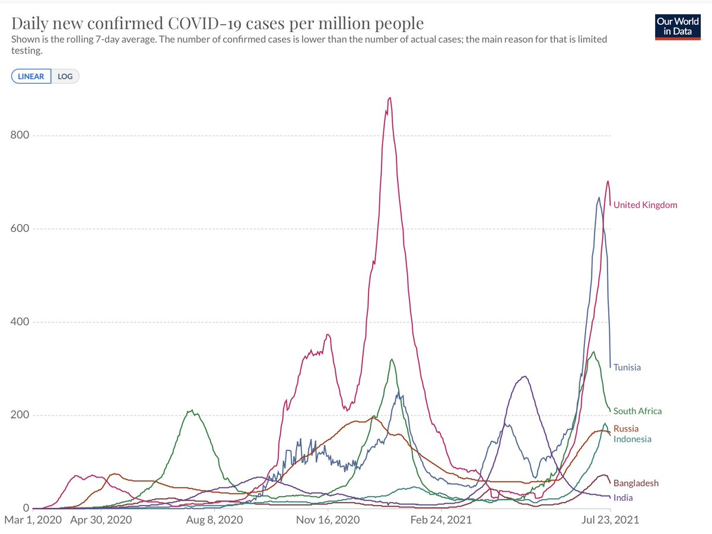</img></a>

---

<a href="https://twitter.com/erictopol/status/1418945846775750656" target="_blank" rel="noreferer">14:47 UCT</a>

Great to see my friend @DrLeanaWen, a leading force promoting American public health, with wisdom well beyond her years, spotlighted here today
https://www.wsj.com/articles/physician-leana-wen-is-a-public-health-pragmatist-11627057715?mod=searchresults_pos1&page=1 w/ @EmilyBobrow 

<a href="E7EbWTZX0AQJGQY.jpg"  ></img></a>

---

<a href="https://twitter.com/erictopol/status/1418954208036884480" target="_blank" rel="noreferer">15:20 UCT</a>

In contrast, the US is still on the Delta sharp ascent and these states are the leading edge. Some had very high peaks in earlier waves, before vaccines. Their rate of rise is at least or higher than anytime previously 

<a href="E7EgOiQX0AobKGC.jpg"  >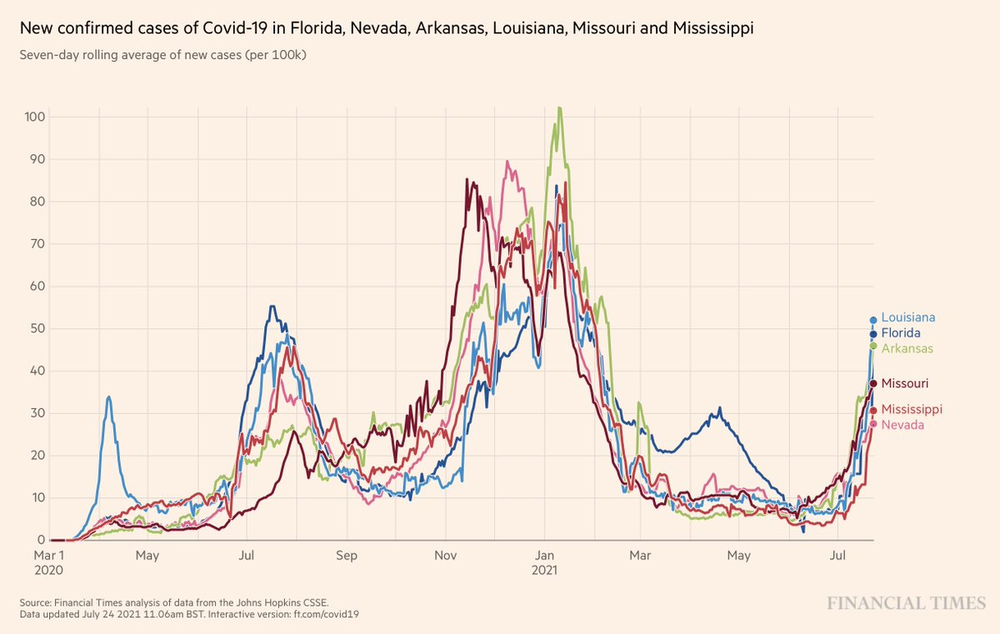</img></a>

---

<a href="https://twitter.com/erictopol/status/1418954215326507008" target="_blank" rel="noreferer">15:20 UCT</a>

Note Florida's slope
All have substantial increases in hospitalizations, led by Nevada 29/100,000; AR, FL and MO ~25 

<a href="E7Ehs8aWQA09z3-.jpg"  >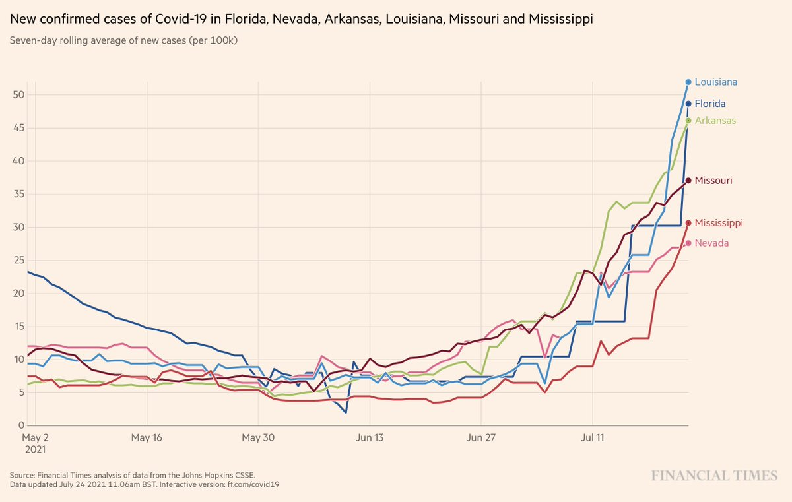</img></a>

---

<a href="https://twitter.com/erictopol/status/1418956708714455040" target="_blank" rel="noreferer">15:30 UCT</a>

Vaccination prevented ~75% of hospitalizations in England's Delta wave, as determined by modeling
https://www.ft.com/content/0f11b219-0f1b-420e-8188-6651d1e749ff @FT @mroliverbarnes @jburnmurdoch 
"@PHE_UK estimates...vaccines being used in the UK are between 91 and 97 per cent effective in preventing hospitalisation." 

<a href="E7Ek8xsXsA00HMH.jpg"  >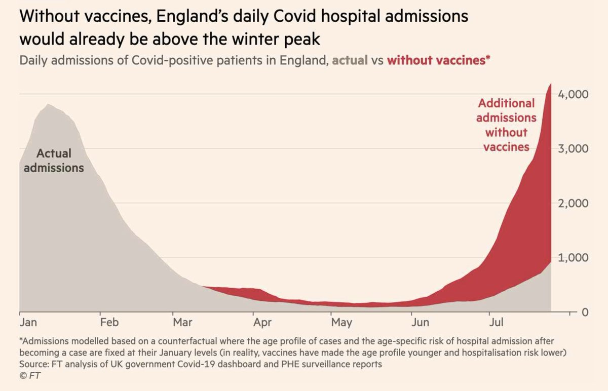</img></a>

---

<a href="https://twitter.com/erictopol/status/1418958320413511680" target="_blank" rel="noreferer">15:36 UCT</a>

And great to see continued signs of Delta descent in the UK today 

<a href="E7Em9W8XMAEDVm1.jpg"  >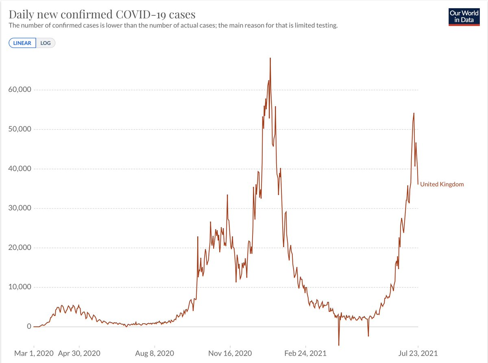</img></a>

---

<a href="https://twitter.com/erictopol/status/1418960966549610497" target="_blank" rel="noreferer">15:47 UCT</a>

"Our study provides direct evidence that #SARSCoV2 infects CMs [heart muscle cells] in vivo and suggests a mechanism of immune-cell infiltration and histopathology in heart tissues of COVID-19 patients."
https://www.cell.com/stem-cell-reports/fulltext/S2213-6711(21)00378-7 @stemcellreports @CellPressNews 

<a href="E7EpV0hWUAEuYHB.jpg"  >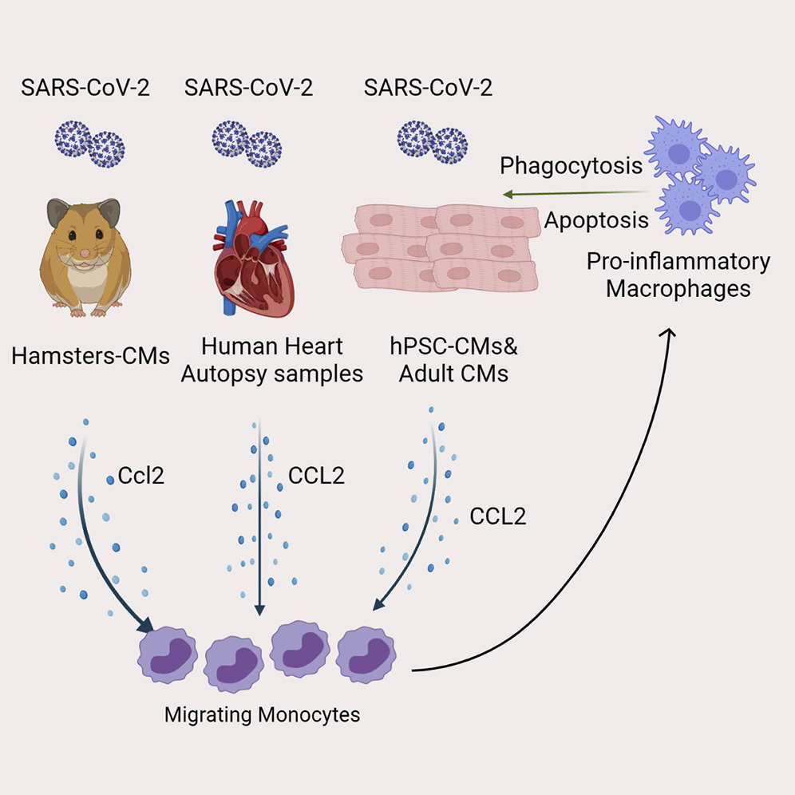</img></a>

---

<a href="https://twitter.com/erictopol/status/1418966772997316611" target="_blank" rel="noreferer">16:10 UCT</a>

RT @ScottGottliebMD: The wide dispersion in models forecasting the Delta wave, released by CDC, are deeply disappointing and not actionable…

---

<a href="https://twitter.com/erictopol/status/1418970092100980736" target="_blank" rel="noreferer">16:23 UCT</a>

Only now, 7+ months into the vaccination campaign, are we seeing the mis/dis-information getting called out and it's not by @WhiteHouse
https://www.thedailybeast.com/team-biden-somehow-failed-to-hire-someone-to-fight-vaxx-disinfo @thedailybeast @scottbix @arawnsley 
https://www.nytimes.com/2021/07/24/technology/joseph-mercola-coronavirus-misinformation-online.html?action=click&module=Spotlight&pgtype=Homepage by @sheeraf re: @mercola and others 

<a href="E7EwU5RXsAA7MRp.jpg"  >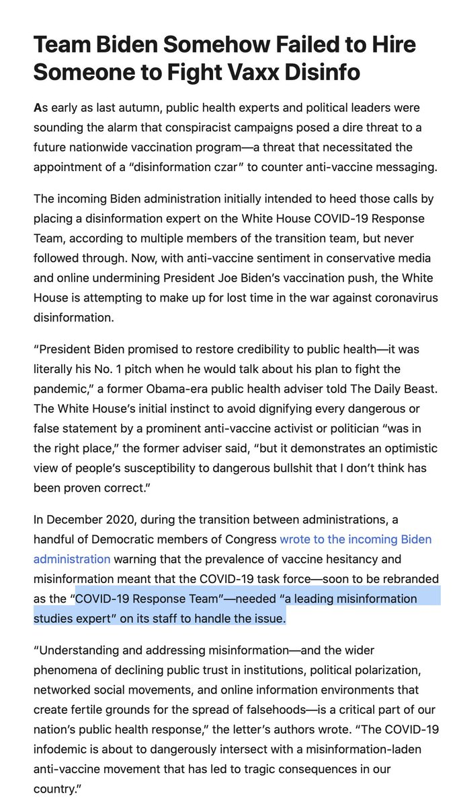</img></a><a href="E7ExBt-XsAI7Rcl.jpg"  >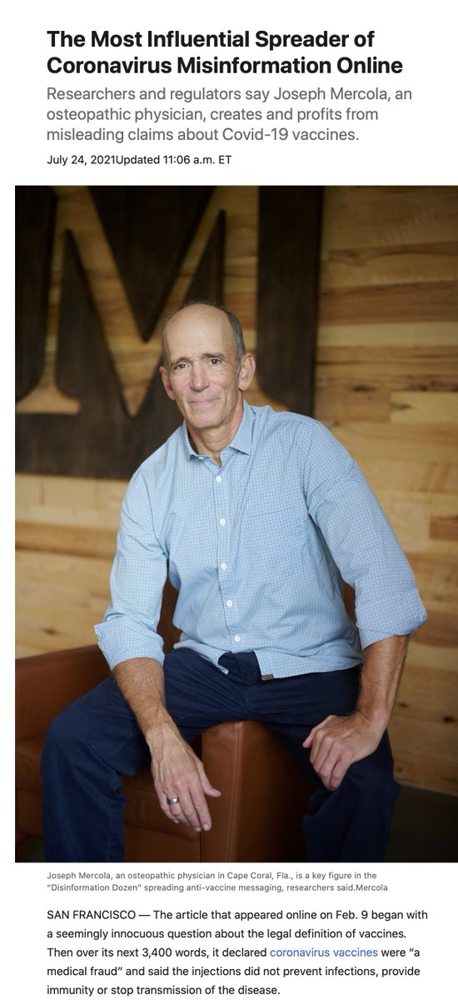</img></a>

---

<a href="https://twitter.com/erictopol/status/1418973129938903040" target="_blank" rel="noreferer">16:35 UCT</a>

Today's the day Canada will surpass the UK for fully vaccinated. Keep showing us the way 🇨🇦
(already ahead of these countries, EU for 1st dose, at 71% total population) 

<a href="E7Ez-2bX0AgmCdV.jpg"  >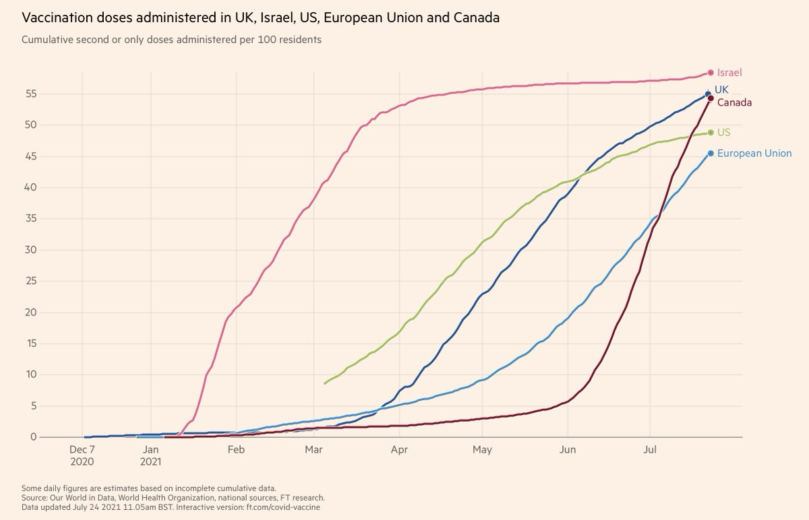</img></a>

---

<a href="https://twitter.com/erictopol/status/1418984691533766666" target="_blank" rel="noreferer">17:21 UCT</a>

RT @dwallacewells: “How Bad Could the Delta Variant Get?” Probably 90% or more of the country’s mortality risk has been eliminated through…

---

<a href="https://twitter.com/erictopol/status/1418992707712606208" target="_blank" rel="noreferer">17:53 UCT</a>

Florida's steep ascent continues with 14,258 new cases today, not seen since January 

<a href="E7FF3TBWYAkHcHp.jpg"  >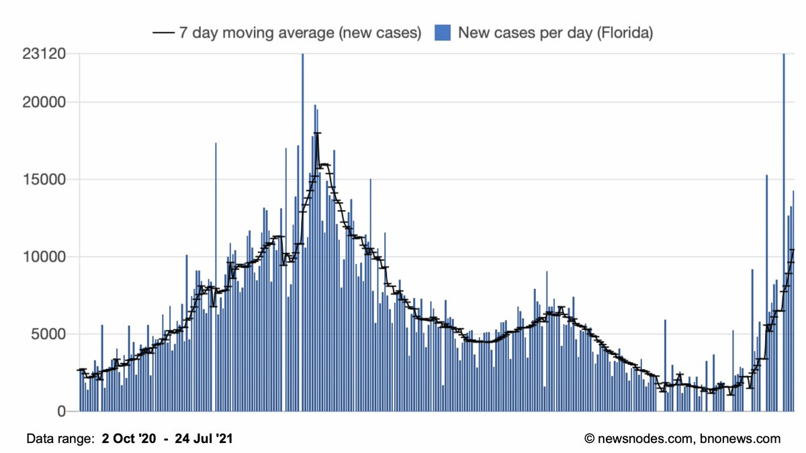</img></a>

---

<a href="https://twitter.com/erictopol/status/1418997501315543040" target="_blank" rel="noreferer">18:12 UCT</a>

Debunking another myth, the mRNA vaccines didn't just suddenly appear in 2020 for covid-19. Many had been  tested years previously for other viruses; status as of 4 years ago in this Table, and shown to be safe https://www.nature.com/articles/nrd.2017.243/tables/2 

<a href="E7FKlYKVUAAMNMZ.jpg"  >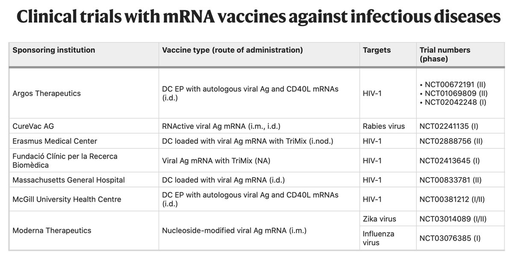</img></a>

---

<a href="https://twitter.com/erictopol/status/1419062510489980930" target="_blank" rel="noreferer">22:30 UCT</a>

On a related matter, Dr. Malone, who asserts he is "the inventor of mRNA vaccines" and actively cultivates vaccine skepticism, is not, and has admitted that fact: https://www.logically.ai/factchecks/library/3aa2eefd
Drs @kkariko and @WeissmanLab are credited with the seminal work that led to mRNA vaccines 

<a href="E7GFTdZUUAIBbCU.jpg"  >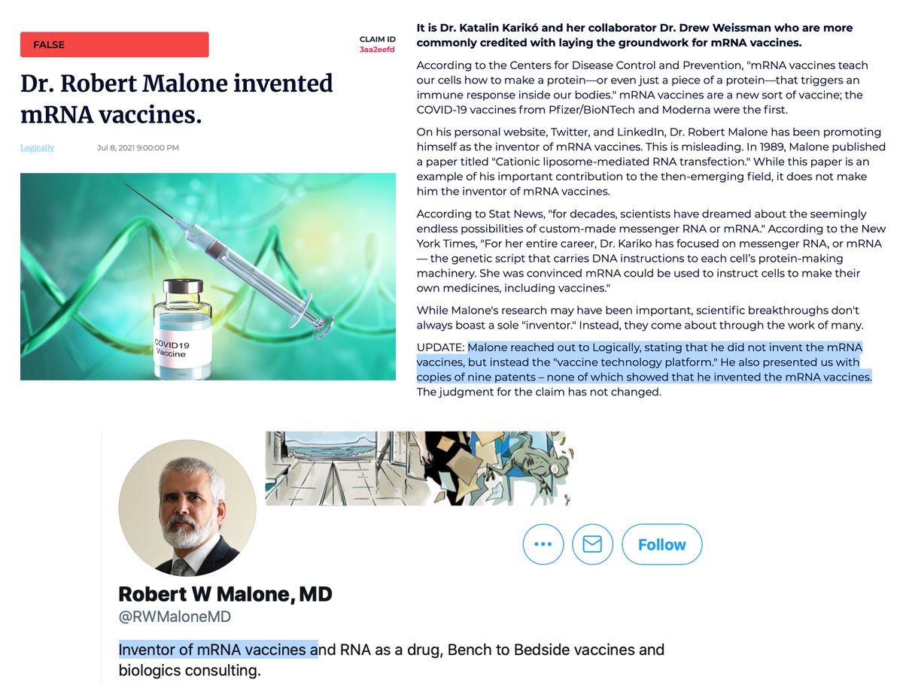</img></a>