+++
title = "Tweets by Eric Topol July 25"
Summary = ""
tags = ["Twitter"]
category = "Twitter"
+++

---

<a href="https://twitter.com/erictopol/status/1419107137301598214" target="_blank" rel="noreferer">01:28 UCT</a>

RT @TheWeekMSNBC: Pres. Biden said the Covid-19 vaccines should have full FDA approval by September or October. “That’s not going to cut it…

---

<a href="https://twitter.com/erictopol/status/1419122055010656263" target="_blank" rel="noreferer">02:27 UCT</a>

Vermont's Delta immunity wall is holding up well, today's hospitalizations, ICUs 

<a href="E7G782RUUAQ9Es6.jpg"  >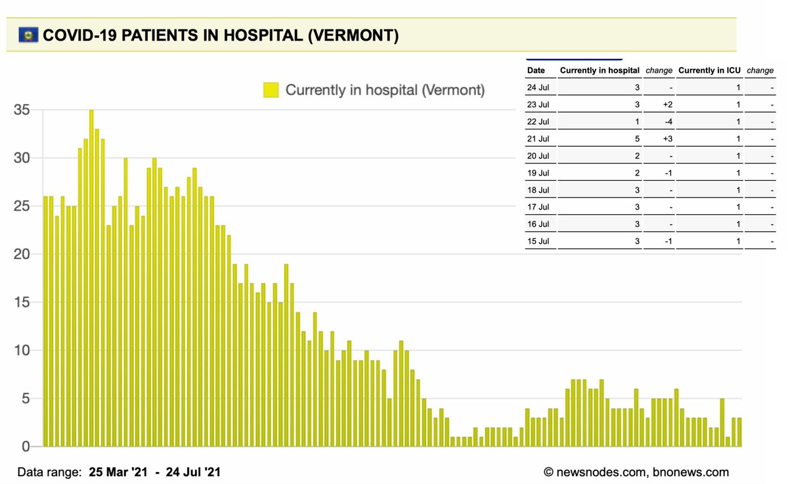</img></a>

---

<a href="https://twitter.com/erictopol/status/1419297596183441409" target="_blank" rel="noreferer">14:04 UCT</a>

"Unlike Pfizer, which advocates for a third dose, Dr. Sahin said that he wouldn’t be giving public advice on whether to use a third shot, known as booster, and that he would only interpret data as they arrive from real-life studies such as the one in Israel."

---

<a href="https://twitter.com/erictopol/status/1419297594568699911" target="_blank" rel="noreferer">14:04 UCT</a>

Good to see
And note quote below, in contrast with @pfizer 
https://www.wsj.com/articles/covid-19-immunity-wanes-but-third-shot-still-rarely-needed-biontech-ceo-says-11627211359 by @bopanc 

<a href="E7JasBDVEAEOozd.jpg"  >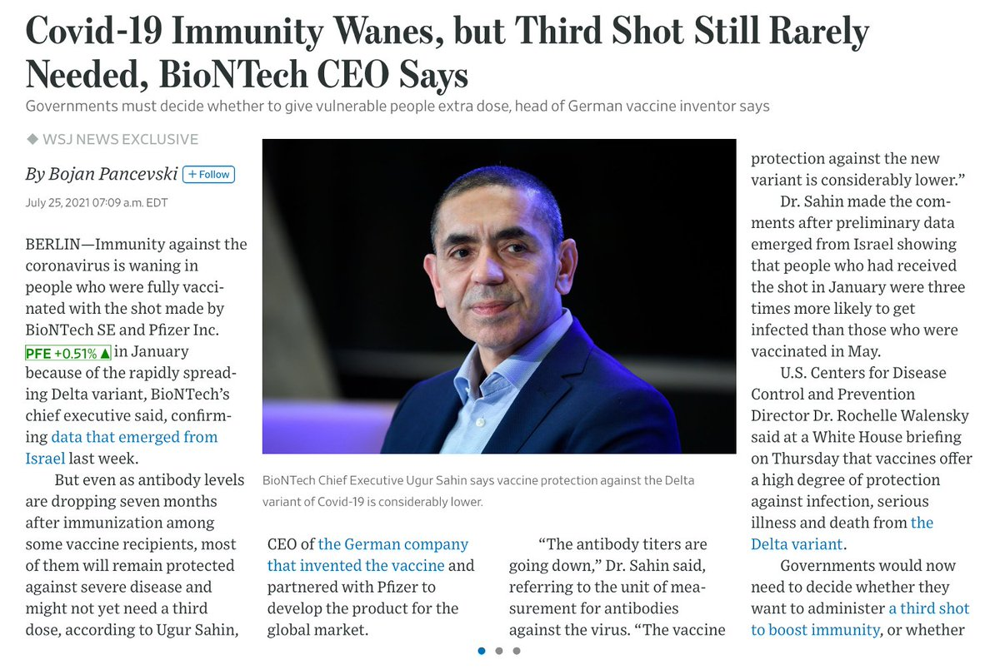</img></a>

---

<a href="https://twitter.com/erictopol/status/1419301928790417411" target="_blank" rel="noreferer">14:22 UCT</a>

There isn't anything good about the Delta variant and its waves, except that
—It descends, sometimes sharply
—#VaccinesWork
(especially for marked reduction of hospitalizations and deaths) 

<a href="E7JVHuUVUBEyeO0.jpg"  >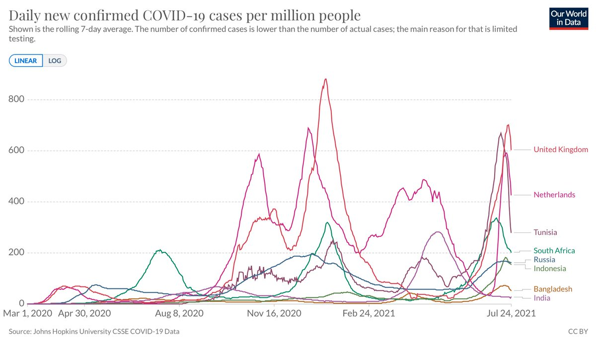</img></a>

---

<a href="https://twitter.com/erictopol/status/1419308647054671874" target="_blank" rel="noreferer">14:48 UCT</a>

Replicated wherever tracked, with gradient increased as infections begin to soar again due to Delta, now 8-fold Δ Our @SanDiegoCounty data @sdut today 

<a href="E7JlTxhVgAghQJw.jpg"  >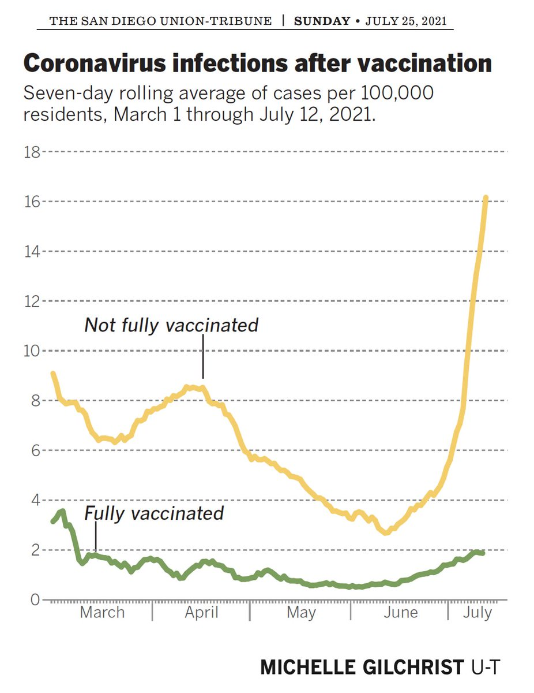</img></a>

---

<a href="https://twitter.com/erictopol/status/1419312208152911880" target="_blank" rel="noreferer">15:02 UCT</a>

Los Angeles County (largest in the US, population nearly 10 million people) 

<a href="E7JorF1VUAk4pq1.jpg"  >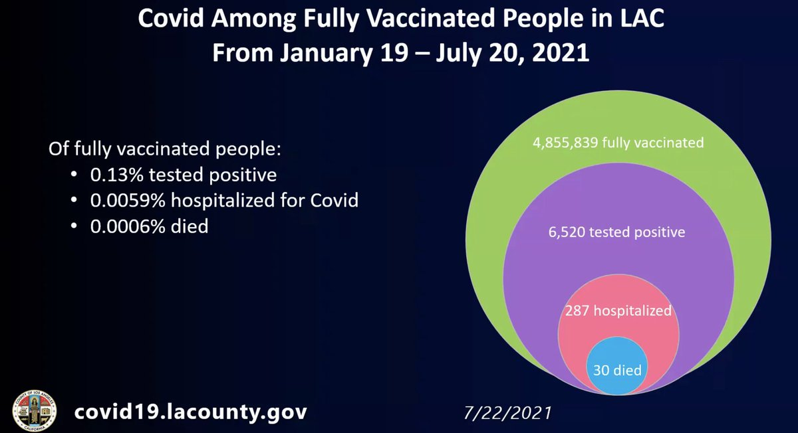</img></a>

---

<a href="https://twitter.com/erictopol/status/1419314704372011012" target="_blank" rel="noreferer">15:12 UCT</a>

@paulg Agree!   I didn’t make the graph but the data at left are telling

---

<a href="https://twitter.com/erictopol/status/1419319408451751944" target="_blank" rel="noreferer">15:31 UCT</a>

RT @charlesornstein: Great graphic. Puts the current surge in context.

---

<a href="https://twitter.com/erictopol/status/1419323737120202752" target="_blank" rel="noreferer">15:48 UCT</a>

Link to the @sdut for San Diego County graph
https://www.sandiegouniontribune.com/news/health/story/2021-07-25/with-coronavirus-increasing-rapidly-will-it-soon-be-masks-up-in-san-diego
and
Fixed version of LA County's graphic here, data unchanged,  but properly proportionately represented 
https://www.reddit.com/r/dataisbeautiful/comments/olvh4p/covid19_among_fully_vaccinated_people_in_la/

---

<a href="https://twitter.com/erictopol/status/1419333535995858945" target="_blank" rel="noreferer">16:27 UCT</a>

Agree w/ @washingtonpost editorial board on full FDA approval of covid vaccines. *It has to be done right.* 
But the review started Dec 2020 w/ sequential submissions of BLA and should have been done by now. That could have prevented much of Delta's hit
https://www.washingtonpost.com/opinions/2021/07/25/fda-must-sprint-not-stumble-approving-covid-19-vaccines/ 

<a href="E7J6z3RVcAcAa8C.jpg"  >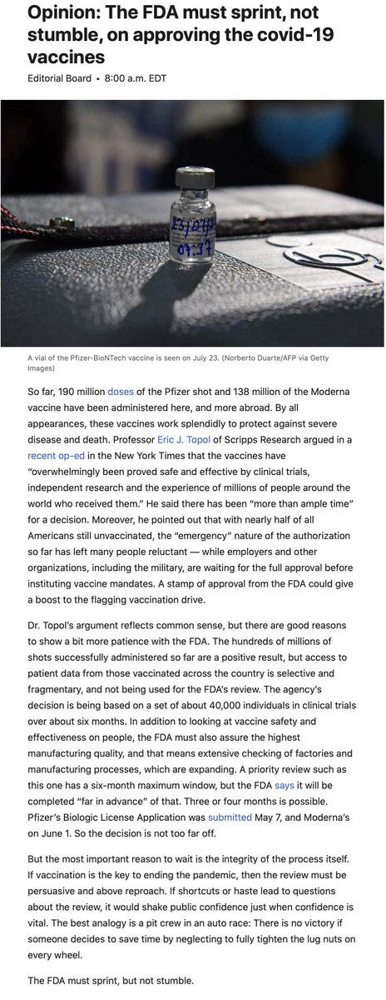</img></a>

---

<a href="https://twitter.com/erictopol/status/1419338123624935430" target="_blank" rel="noreferer">16:45 UCT</a>

The US Delta wave epicenter, led by Arkansas and Louisiana, show no signs of letting up, with near vertical rise in cases per capita. In contrast, the UK, with its peak at a similar level, and far more testing, has started descent
https://outbreak.info/epidemiology?location=USA_US-AR%3BUSA_US-LA%3BGBR&log=false&variable=confirmed_numIncrease&xVariable=date&fixedY=true&percapita=true 

<a href="E7KAVyIUUAQu9rE.jpg"  >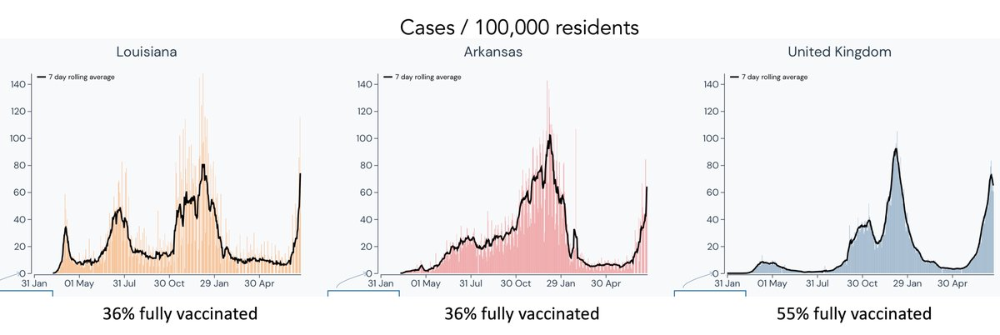</img></a>

---

<a href="https://twitter.com/erictopol/status/1419343146308149255" target="_blank" rel="noreferer">17:05 UCT</a>

Let's compare with Vermont, with its 232% case increase in the past 14-days, 67% vaccinated
https://www.nytimes.com/interactive/2021/us/vermont-covid-cases.html 

<a href="E7KE4TyVoAcS80K.jpg"  >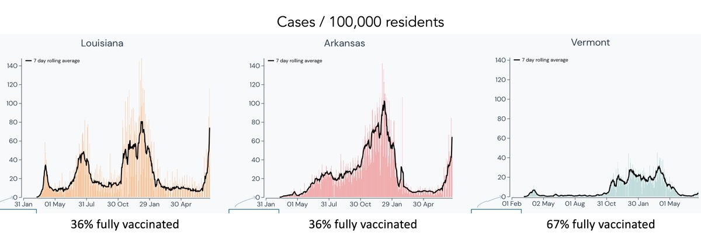</img></a>

---

<a href="https://twitter.com/erictopol/status/1419354694988697604" target="_blank" rel="noreferer">17:51 UCT</a>

RT @TilmannSchober: The EU Medicines Agency @EMA_News has been widely criticized for being to slow last winter approving COVID vaccines - b…

---

<a href="https://twitter.com/erictopol/status/1419358076474331137" target="_blank" rel="noreferer">18:05 UCT</a>

More on heading down in the UK regarding fewer hospitalizations in Scotland from @Birdyword 
https://twitter.com/Birdyword/status/1419249496932986880

---

<a href="https://twitter.com/erictopol/status/1419358074612031491" target="_blank" rel="noreferer">18:05 UCT</a>

"I believe the U.K. is clearly heading down now, which is a quite important prognosticator for the U.S. pattern in the weeks ahead. How many weeks and what will be the peak cases (and other outcomes) is the only unknown in my mind."
https://nymag.com/intelligencer/2021/07/how-bad-could-the-delta-variant-get.html @dwallacewells 

<a href="E7KSNADVcAInV9Y.jpg"  >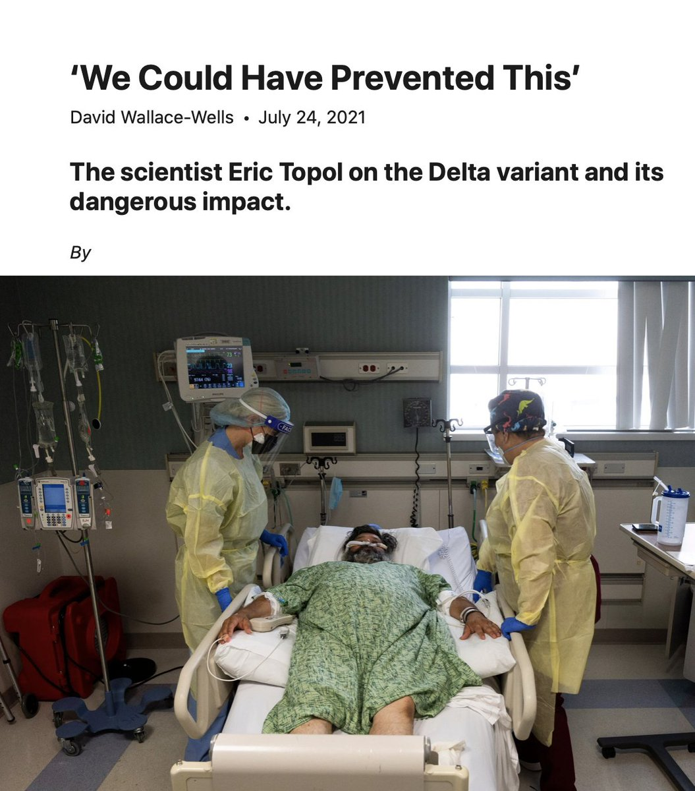</img></a>

---

<a href="https://twitter.com/erictopol/status/1419361432152330245" target="_blank" rel="noreferer">18:18 UCT</a>

CDC, always ahead of the curve. Not. Again.
https://www.ft.com/content/ef8daa94-c28e-4d43-ad11-4ad99c423524 @JamesPoliti @FT 
https://www.nationalgeographic.com/science/article/scientists-urge-local-mask-mandates-as-delta-sweeps-the-us @tarahaelle @NatGeo 

<a href="E7KVSxPUcAAkFV3.jpg"  >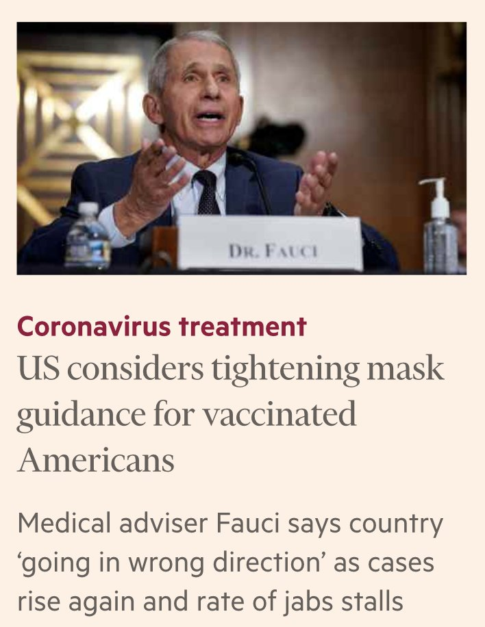</img></a><a href="E7KVVuEUUAUAEoe.jpg"  >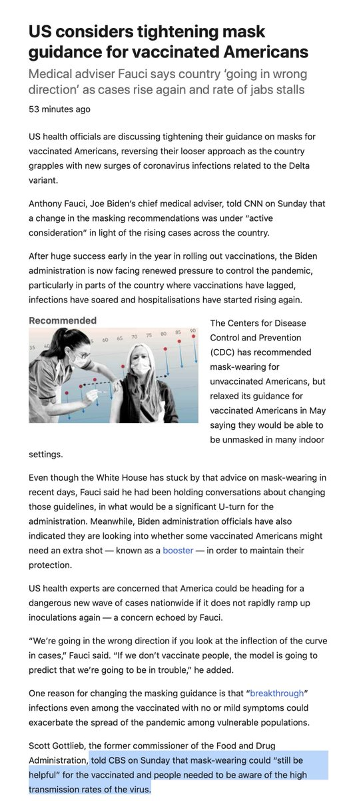</img></a><a href="E7KVXYKUUAIW7n3.jpg"  >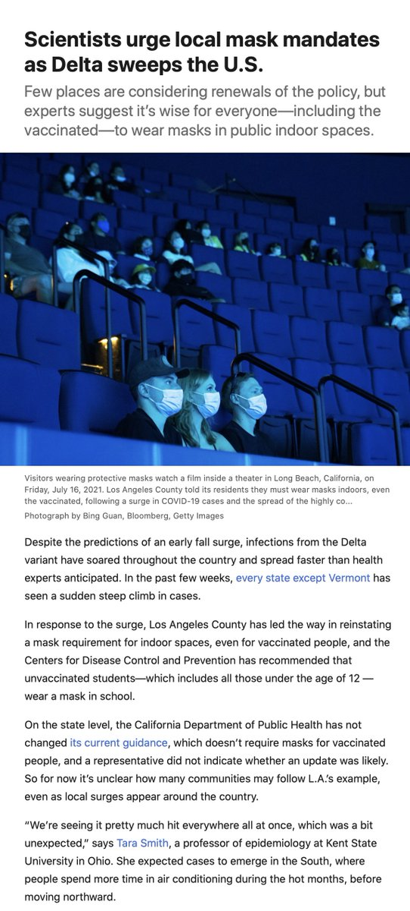</img></a>

---

<a href="https://twitter.com/erictopol/status/1419366043072438276" target="_blank" rel="noreferer">18:36 UCT</a>

How long with the Delta wave last in the US?
It's hard to say with differences in testing, NPIs, vaxx %, vaccines, etc, but we're running in || and the UK is ~5-6 weeks in front before it started descent in recent days
http://covariants.org for timing of Delta dominance 

<a href="E7KZIlOUcAMClbm.jpg"  >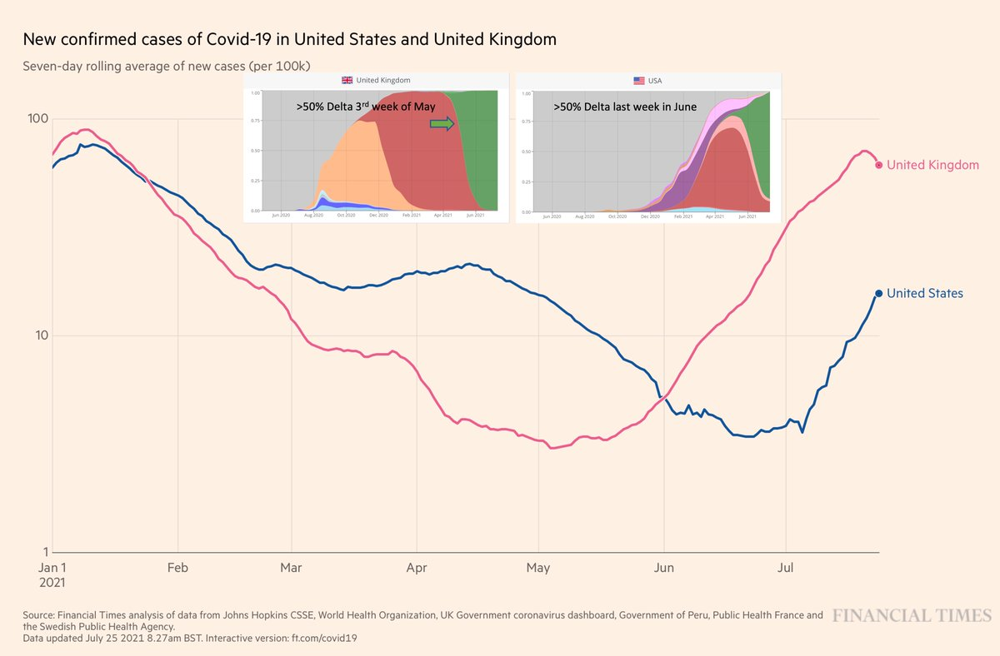</img></a>

---

<a href="https://twitter.com/erictopol/status/1419390174878867456" target="_blank" rel="noreferer">20:12 UCT</a>

The 4 uplifting graphs from this week about the Delta variant....if you are vaccinated
Infections
https://www.sandiegouniontribune.com/news/health/story/2021-07-25/with-coronavirus-increasing-rapidly-will-it-soon-be-masks-up-in-san-diego @sdut 
Vaccine effect
https://www.nejm.org/doi/full/10.1056/NEJMoa2108891?query=recirc_curatedRelated_article @NEJM Hospitalizations
https://www.ft.com/content/0f11b219-0f1b-420e-8188-6651d1e749ff @jburnmurdoch @FT
Deaths
https://www.newstatesman.com/politics/health/2021/07/who-has-been-hit-hardest-uk-s-third-wave-covid-19 @NewStatesman 

<a href="E7KtuYIUUAUjmgP.jpg"  ></img></a><a href="E7Kt4YLUcAAoZfR.jpg"  >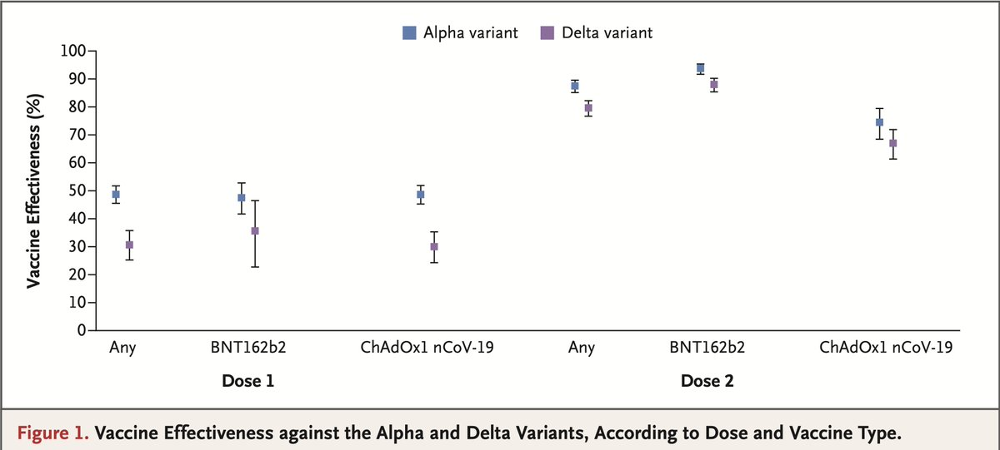</img></a><a href="E7KumxwUcAMYuCY.jpg"  >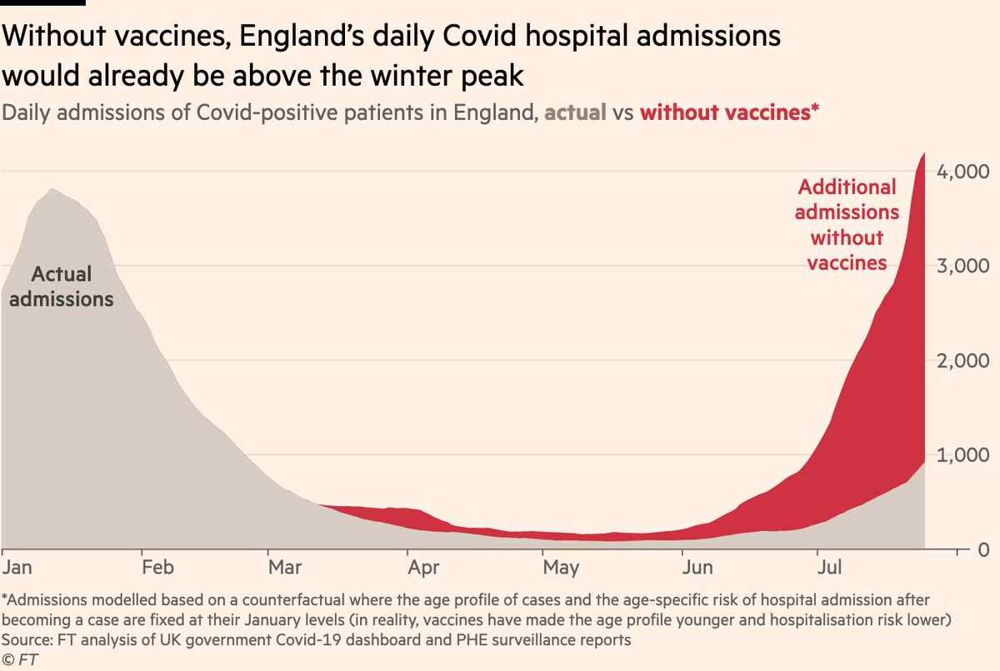</img></a><a href="E7KvZsPVcAA_IIW.jpg"  >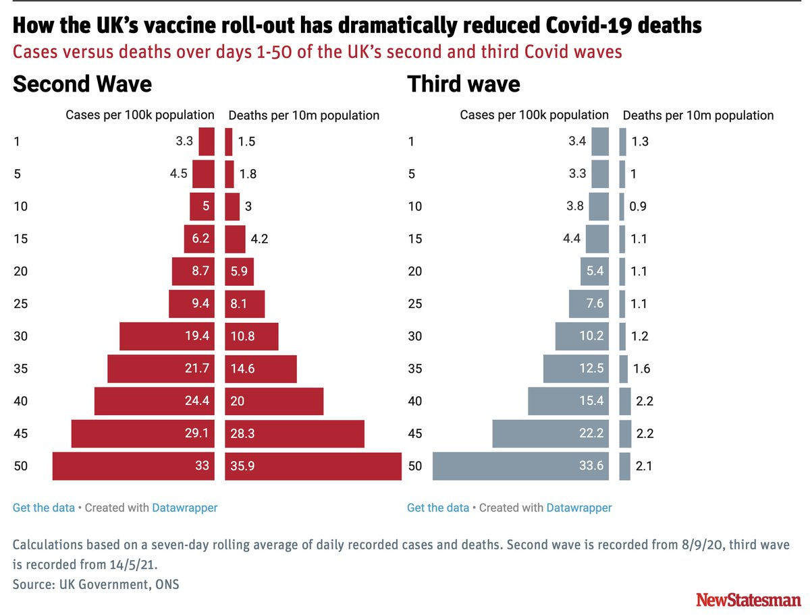</img></a>