+++
title = "Tweets by Eric Topol July 26"
Summary = ""
tags = ["Twitter"]
category = "Twitter"
+++

---

<a href="https://twitter.com/erictopol/status/1419498363821563906" target="_blank" rel="noreferer">03:22 UCT</a>

The US Delta wave's impact on hospitalizations (H), now approaching 35,000 and perhaps more d/t weekend reporting lapses
—Overall still low at 9/100K (60% up past 2 weeks)
—Nevada in front w/ higher H per 100K than cases/100K
—Substantial rises: Missouri/Arkansas/Florida cluster 

<a href="E7MSFwiUUAQUJw9.jpg"  >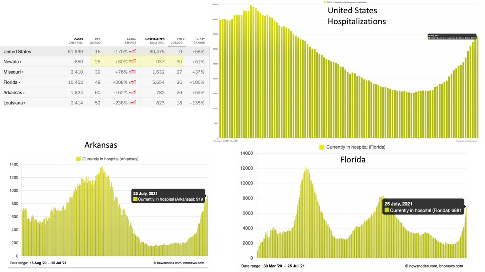</img></a>

---

<a href="https://twitter.com/erictopol/status/1419503489546219520" target="_blank" rel="noreferer">03:42 UCT</a>

I still cannot understand why intranasal vaccines have not been given top priority, given their remarkable allure to block Covid transmission; an excellent explainer for why and status @ScienceMagazine https://science.sciencemag.org/content/373/6553/397
w/@ScienceVisuals 

<a href="E7MWP6wVIAQRmIw.jpg"  >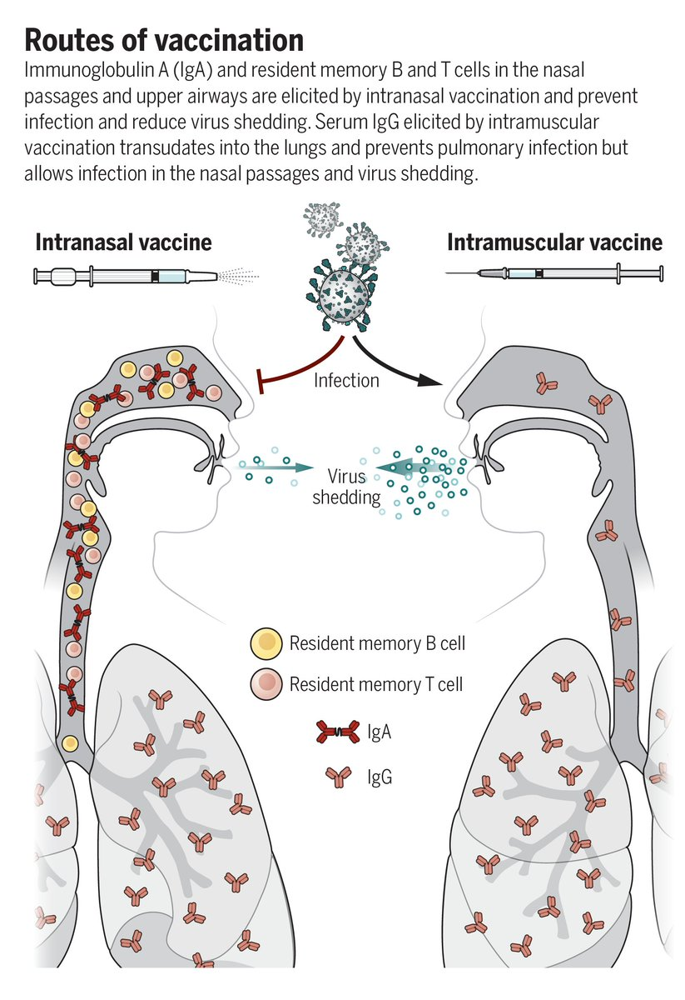</img></a><a href="E7MWOZ7VUAIaRqh.jpg"  >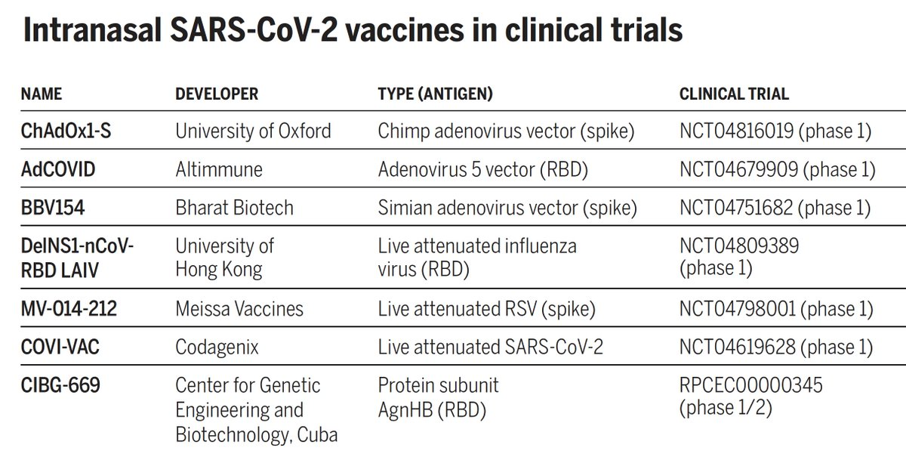</img></a>

---

<a href="https://twitter.com/erictopol/status/1419505318497722370" target="_blank" rel="noreferer">03:50 UCT</a>

We've tried to advocate with no success to date
https://www.scientificamerican.com/article/to-beat-covid-we-may-need-a-good-shot-in-the-nose/ @sciam w/ @danieloran @scrippsresearch @ScrippsRTI

---

<a href="https://twitter.com/erictopol/status/1419639661933195267" target="_blank" rel="noreferer">12:44 UCT</a>

Our covid times :-)
by Elisabeth McNair @NewYorker 

<a href="E7OSCD6VoAUT2Qr.png"  >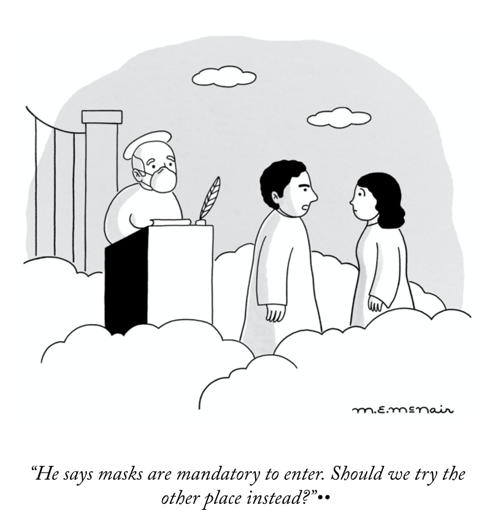</img></a>

---

<a href="https://twitter.com/erictopol/status/1419640765752307713" target="_blank" rel="noreferer">12:48 UCT</a>

Just published  @NatureMedicine
Mix and match AZ (vector) vaccine: Adding mRNA (as 2nd dose) led to a better immune response than 2 AZ doses and CD8+ T cells was even better than 2 mRNA doses. And well tolerated
Prior tweet deleted (not J&amp;J), sorry, too early in the morning here 

<a href="E7OTOhdVoAcXQiq.jpg"  ></img></a>

---

<a href="https://twitter.com/erictopol/status/1419653159971000320" target="_blank" rel="noreferer">13:37 UCT</a>

Insightful commentary on this paper, the whole mix and match vaccine landscape, and its potential to help people with immunocompromised conditions
https://www.nature.com/articles/s41591-021-01463-x 

<a href="E7Oej5vVcAI8q0p.jpg"  >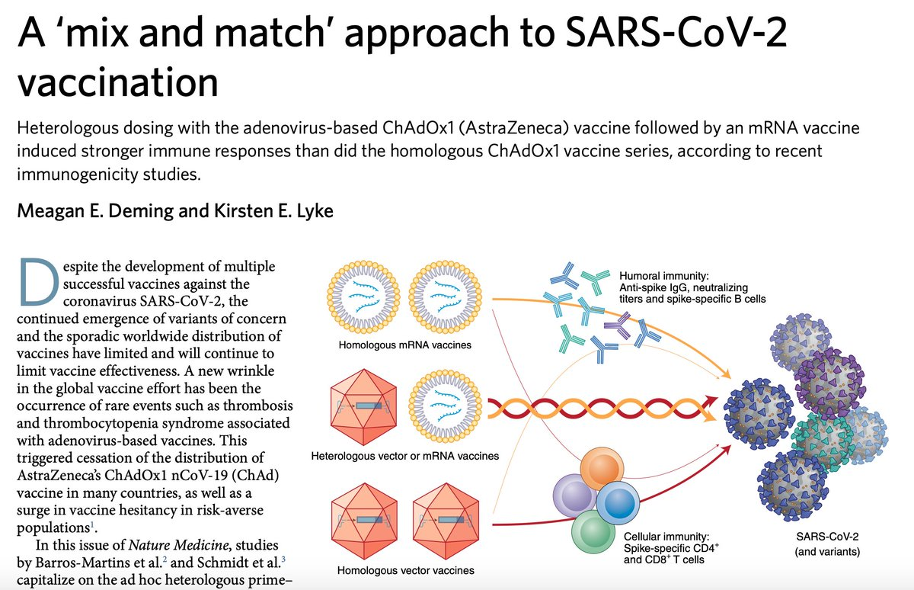</img></a>

---

<a href="https://twitter.com/erictopol/status/1419656684276834308" target="_blank" rel="noreferer">13:51 UCT</a>

In print. 
Thanks @PostOpinions for wishing in on this critical matter 

<a href="E7Oh7VSUUAYQb4H.jpg"  >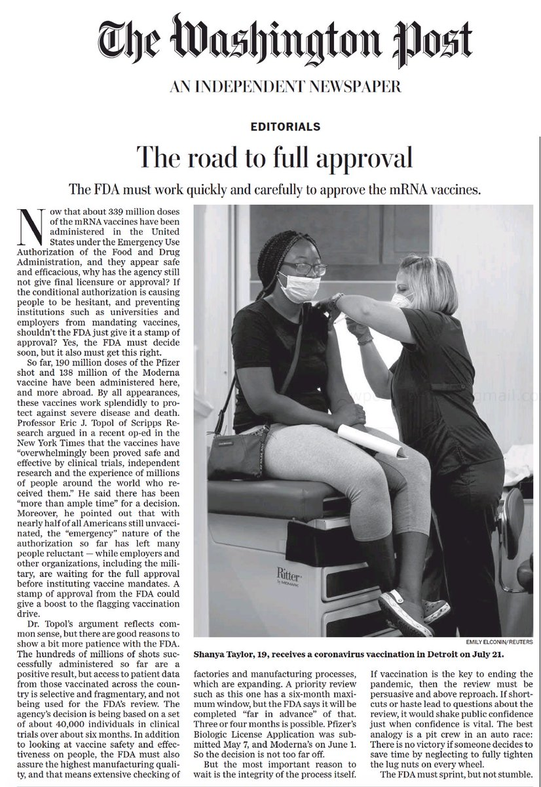</img></a>

---

<a href="https://twitter.com/erictopol/status/1419661167568453632" target="_blank" rel="noreferer">14:09 UCT</a>

Fact checks on @RWMalone's pseudoscience and his lack of credibility
https://debunkingdoomsday.quora.com/The-spike-proteins-in-vaccines-are-harmless-they-are-not-cytotoxic-infodemic-post-by-Robert-Malone-who-claims-to-be

---

<a href="https://twitter.com/erictopol/status/1419666600085524483" target="_blank" rel="noreferer">14:31 UCT</a>

Arkansas: It's the US outlier leading the Delta wave for new cases, now &gt;60% of Alpha wave, but even its very low vaccination rate (36% total) and shift to younger getting covid, is keeping the death rate lower than seen previously 

<a href="E7OpldVUcAAK_KH.jpg"  >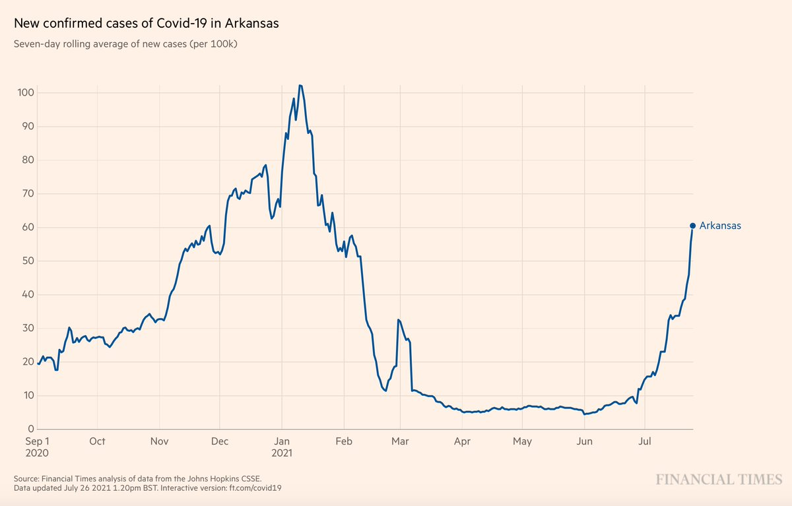</img></a><a href="E7OqWsAUUAkz5Ag.jpg"  >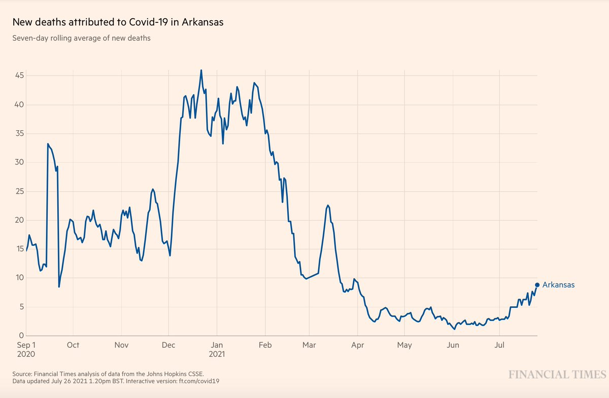</img></a>

---

<a href="https://twitter.com/erictopol/status/1419685199802093571" target="_blank" rel="noreferer">15:45 UCT</a>

For people who had an immediate allergic reaction to a 1st dose mRNA vaccine, a multicenter study shows the 2nd dose can be given safely
https://jamanetwork.com/journals/jamainternalmedicine/fullarticle/2782348 @JAMAInternalMed @KimberlyBlumen1 and colleagues 

<a href="E7O7m5pVkAMgXvh.jpg"  >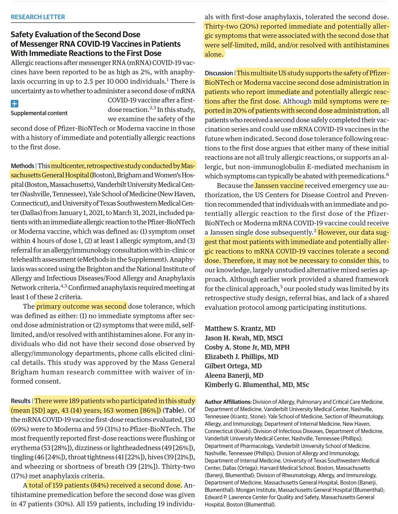</img></a>

---

<a href="https://twitter.com/erictopol/status/1419693780802805763" target="_blank" rel="noreferer">16:19 UCT</a>

Gratifying to see
The UK's sharp descent continues; today's lowest since January 30th, last time &lt;25,000
@OurWorldInData 
https://coronavirus.data.gov.uk  24,950 for July 26th 

<a href="E7PDt7CVoAE-vwF.jpg"  >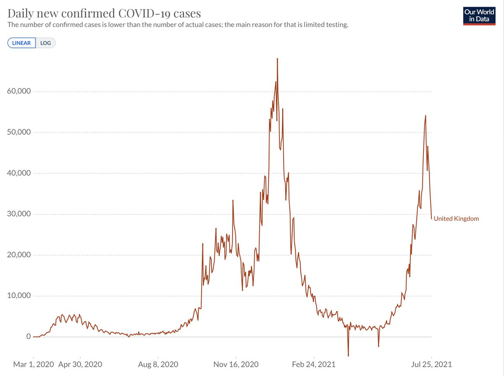</img></a>

---

<a href="https://twitter.com/erictopol/status/1419711314616717312" target="_blank" rel="noreferer">17:28 UCT</a>

RT @NYMag: "This is the movie we all never wanted to see again," explains @EricTopol to @dwallacewells about COVID's Delta wave https://t.c…

---

<a href="https://twitter.com/erictopol/status/1419717402812567560" target="_blank" rel="noreferer">17:53 UCT</a>

The case for a mucosal (intranasal) vaccine for #SARSCoV2 made very well here, along with the unmet need for many other pathogens https://www.nature.com/articles/s41577-021-00583-2?utm_source=dlvr.it&utm_medium=twitter New review @NatRevImmunol via, H/T @RTKase 

<a href="E7PYlwBUUAEKUh6.jpg"  >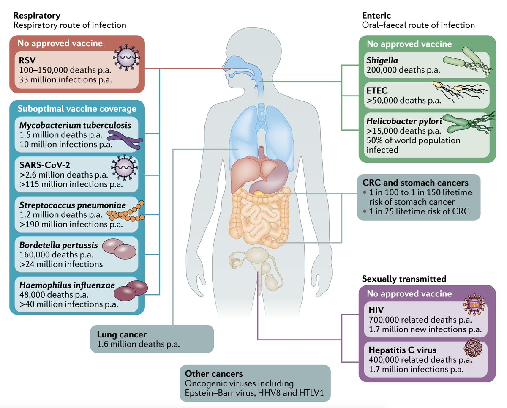</img></a><a href="E7PYnVfVUAURpc9.jpg"  >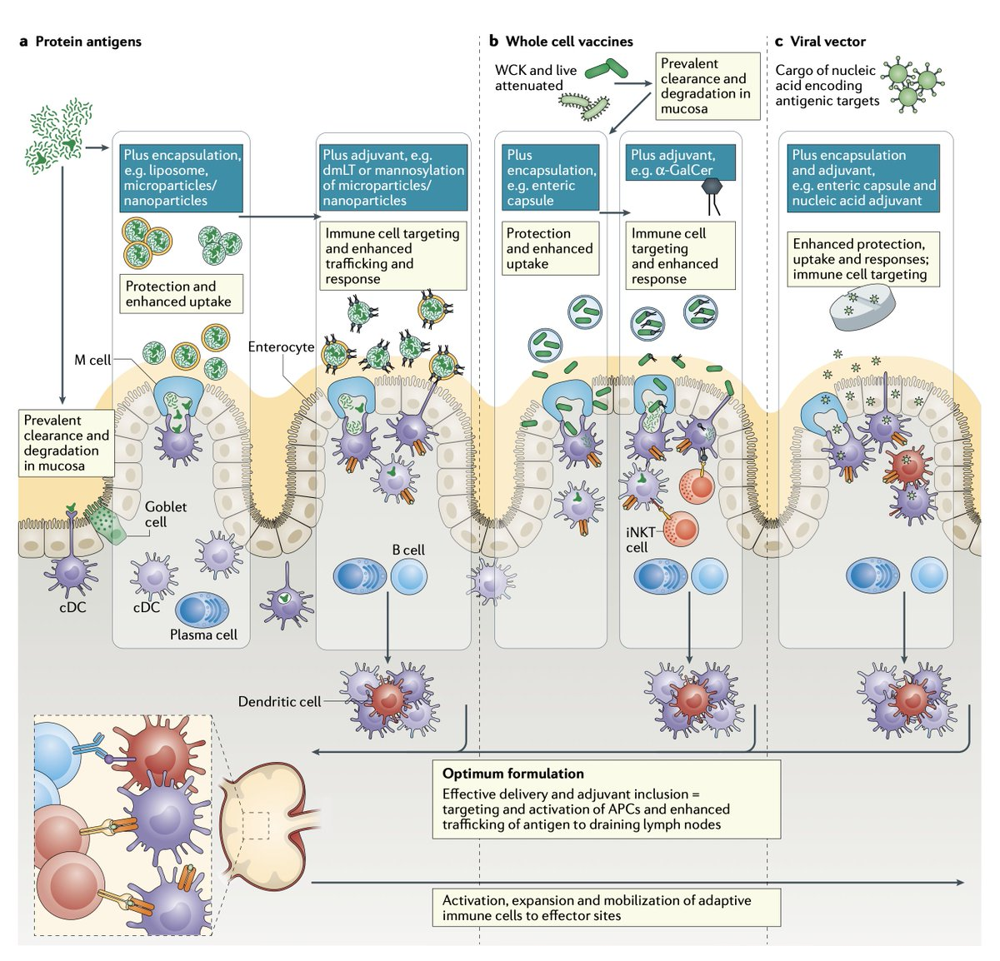</img></a>

---

<a href="https://twitter.com/erictopol/status/1419728111751491587" target="_blank" rel="noreferer">18:35 UCT</a>

@kkariko @WeissmanLab Thanks!

---

<a href="https://twitter.com/erictopol/status/1419728166512316428" target="_blank" rel="noreferer">18:35 UCT</a>

RT @kkariko: @EricTopol @WeissmanLab Important to know that "Cationic liposome-mediated RNA transfection" paper in 1989 failed to mention t…

---

<a href="https://twitter.com/erictopol/status/1419732740866396168" target="_blank" rel="noreferer">18:53 UCT</a>

Concerns re: post-vaxx Delta "breakthru infections" have gone viral
@KatherineJWu has a new calming piece which even mentions a silver lining, their equating to a booster Delta shot. Be clear, though, that's not recommended as the best way to deal w/Delta 
https://www.theatlantic.com/science/archive/2021/07/anatomy-of-a-vaccine-breakthrough/619562/ 

<a href="E7PmOAEVoAErrML.jpg"  >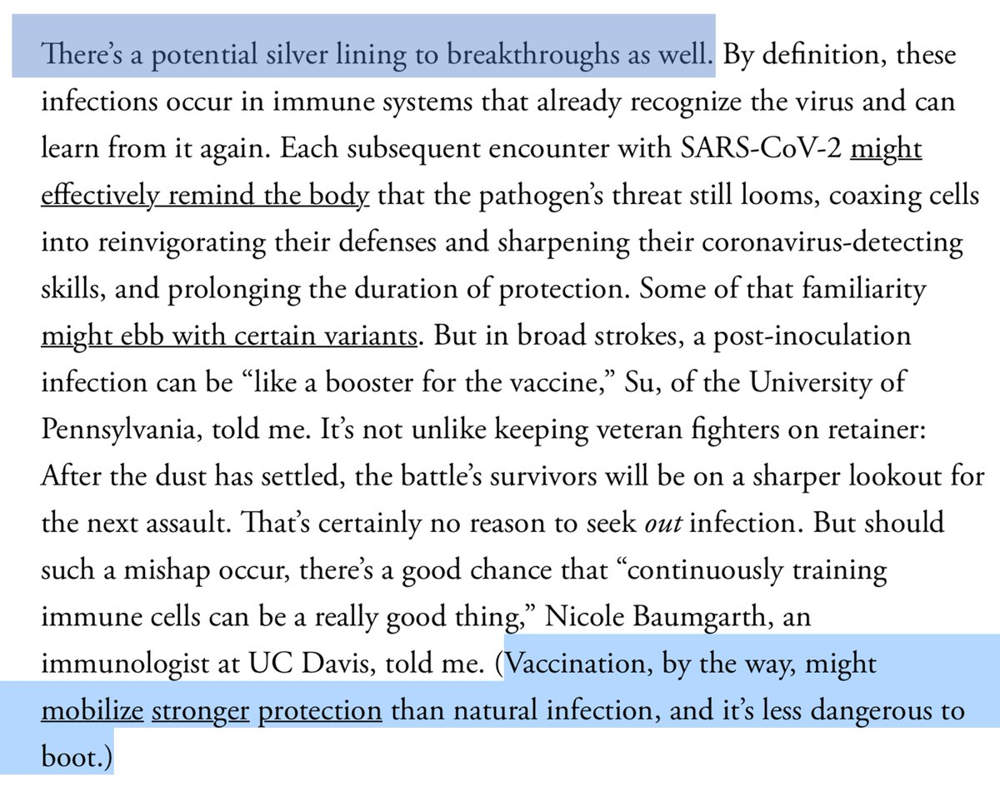</img></a>

---

<a href="https://twitter.com/erictopol/status/1419736454062739457" target="_blank" rel="noreferer">19:08 UCT</a>

Imagine if all these new vaccination mandates today had come out months ago, including @DeptVetAffairs, California, NYC and so many more. 
Now it's in the midst of Delta as 90% new infections instead of preventing them and this wave.
(OK, yes, better late than never) 

<a href="E7Pqs1UVEBIesrb.jpg"  >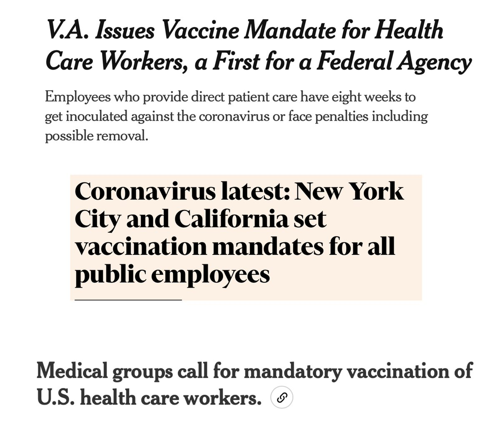</img></a>

---

<a href="https://twitter.com/erictopol/status/1419741030614585345" target="_blank" rel="noreferer">19:26 UCT</a>

How many Americans have had covid infections?
A new @PNAS study suggests ~60% are underreported and that 20% were infected by March 2021 (~66 million), &lt;&lt; @CDCgov estimate of 83 million by December 2020
https://www.pnas.org/content/118/31/e2103272118
by @NicholasJIrons @AdrianRaftery1 @UWStat @UW

---

<a href="https://twitter.com/erictopol/status/1419780275119157276" target="_blank" rel="noreferer">22:02 UCT</a>

Some caution on the UK's outlook, despite the recent case reduction and "92 per cent of adults in England and Wales have antibodies to #SARSCoV2  .. through vaccination or previous infection"
https://www.ft.com/content/cb86d9a8-665d-467e-9b92-4b80e905060c @FT @clivecookson  @jburnmurdoch 
1. Case decline may be slowing 

<a href="E7QPNnTVcB0VmTv.jpg"  >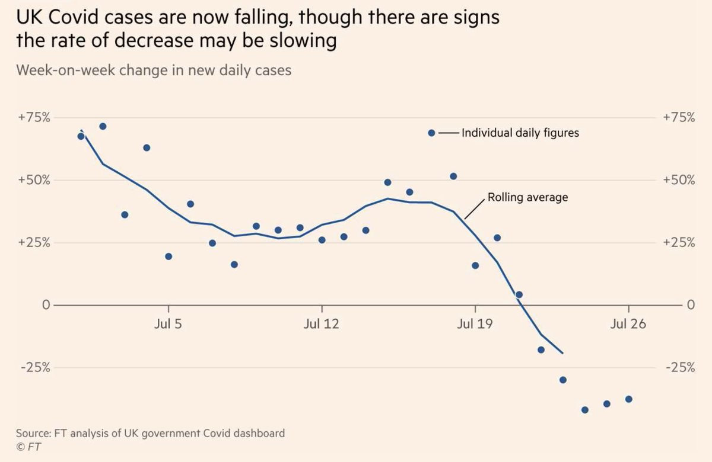</img></a>

---

<a href="https://twitter.com/erictopol/status/1419780280525615114" target="_blank" rel="noreferer">22:02 UCT</a>

2. Hospital admissions starting to drop (✓Good)
Scotland graph via @Birdyword 

<a href="E7QRK9gVcBw0cb-.jpg"  >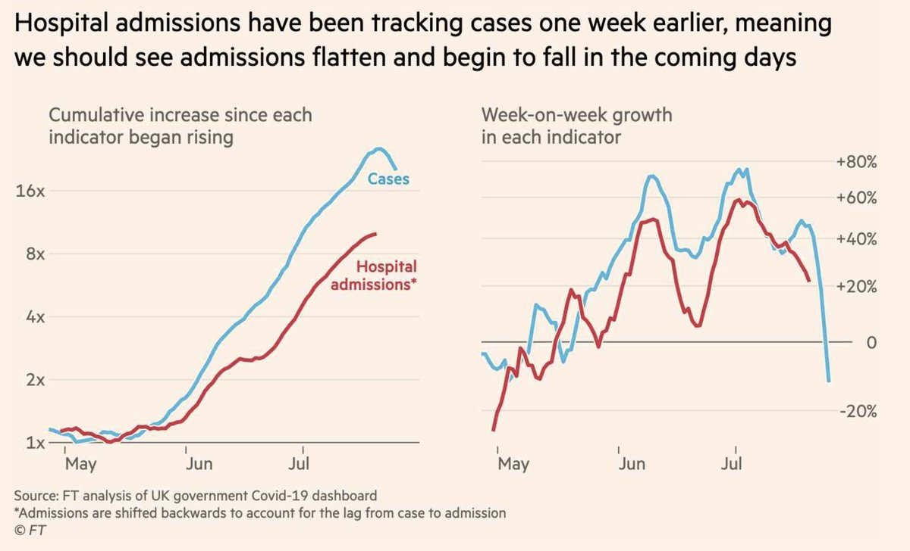</img></a><a href="E7QRlbnVEAAXoTL.png"  >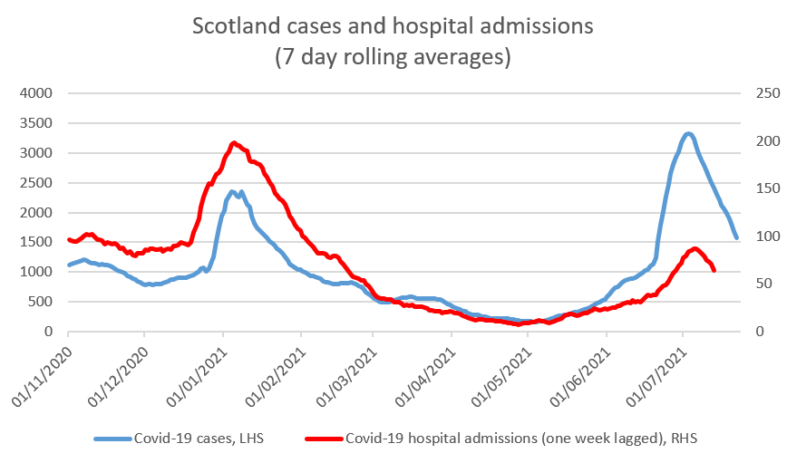</img></a>

---

<a href="https://twitter.com/erictopol/status/1419780285827215371" target="_blank" rel="noreferer">22:02 UCT</a>

3. Might be good to avoid football matches 

<a href="E7QRx5aVcCEzA63.jpg"  >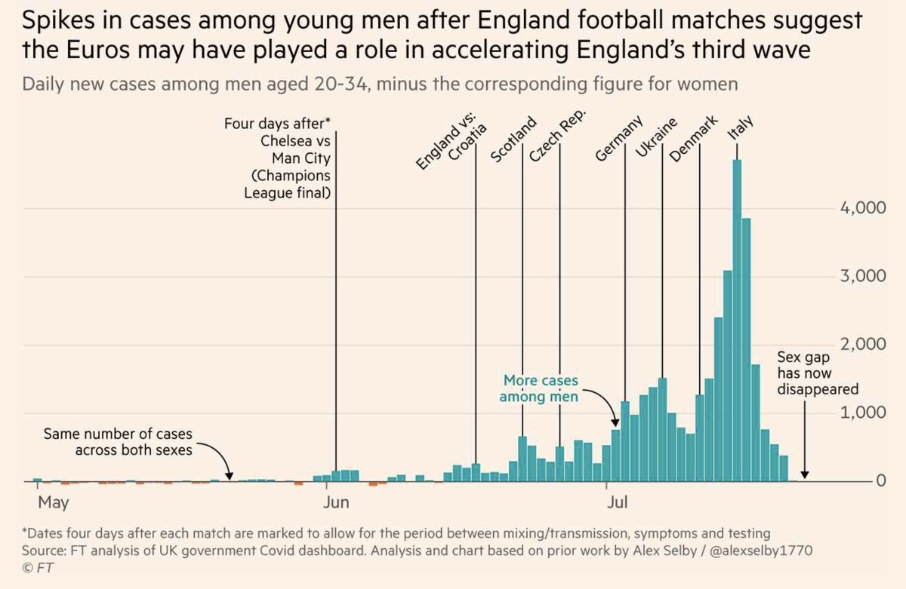</img></a>

---

<a href="https://twitter.com/erictopol/status/1419785348284960770" target="_blank" rel="noreferer">22:23 UCT</a>

New large study of mRNA vaccine effectiveness for people with prior Covid
"Among those vaccinated with BNT162b2, protection against infection was further enhanced and infection incidence was further reduced by prior infection"
https://www.medrxiv.org/content/10.1101/2021.07.25.21261093v1.full.pdf 

<a href="E7QW-86VIAIJdlP.jpg"  >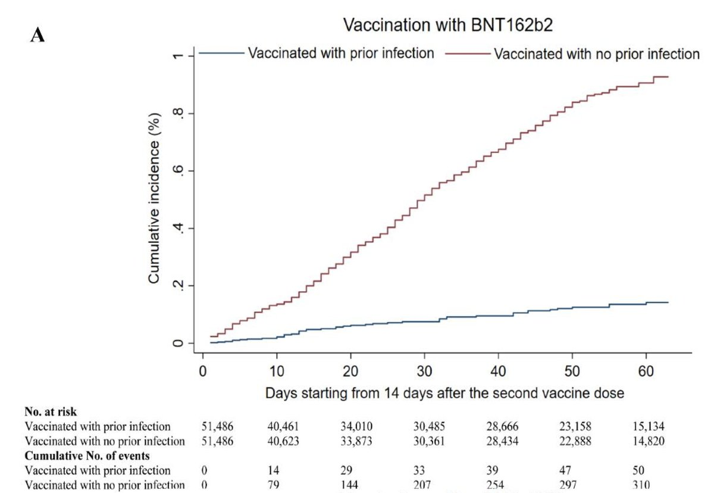</img></a>

---

<a href="https://twitter.com/erictopol/status/1419797201564225537" target="_blank" rel="noreferer">23:10 UCT</a>

Potential eye sign for #LongCovid: Corneal nerve fiber loss and increased dendritic cell density in people with neurologic symptoms https://bjo.bmj.com/content/early/2021/07/08/bjophthalmol-2021-319450 

<a href="E7Qh-h_VgAQ_26M.jpg"  >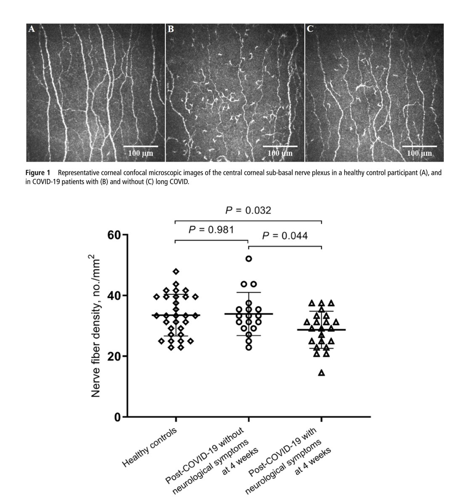</img></a>