+++
title = "Tweets by Eric Topol July 27"
Summary = ""
tags = ["Twitter"]
category = "Twitter"
+++

---

<a href="https://twitter.com/erictopol/status/1419823925547216910" target="_blank" rel="noreferer">00:56 UCT</a>

RT @inthebubblepod: Listen to this can't-miss, in-depth conversation on the #Delta variant. @ASlavitt and @EricTopol cover why it's taking…

---

<a href="https://twitter.com/erictopol/status/1419873999622791170" target="_blank" rel="noreferer">04:15 UCT</a>

RT @xkcdComic: Flawed Data https://xkcd.com/2494/ https://m.xkcd.com/2494/ https://twitter.com/xkcdComic/status/1419868962888699905

<a href="E7RjTEZUYAAVmH0.png"  >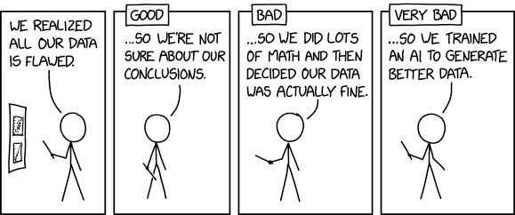</img></a>

---

<a href="https://twitter.com/erictopol/status/1419882156055175168" target="_blank" rel="noreferer">04:47 UCT</a>

The United States, fully warned about the Delta superspreader variant by the UK, shows it is the master of prevention. Not. 

<a href="E7RvQbPUUAYfoHi.jpg"  >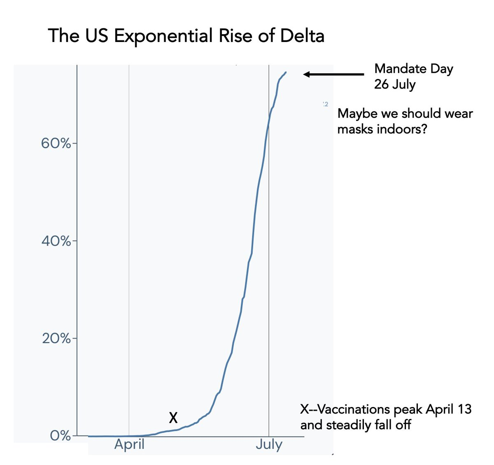</img></a>

---

<a href="https://twitter.com/erictopol/status/1419887785205370883" target="_blank" rel="noreferer">05:10 UCT</a>

Current estimate by sequencing of the virus from cases for Delta prevalence in the US is 92% http://covariants.org 

<a href="E7R0I2HVoAA2av1.jpg"  >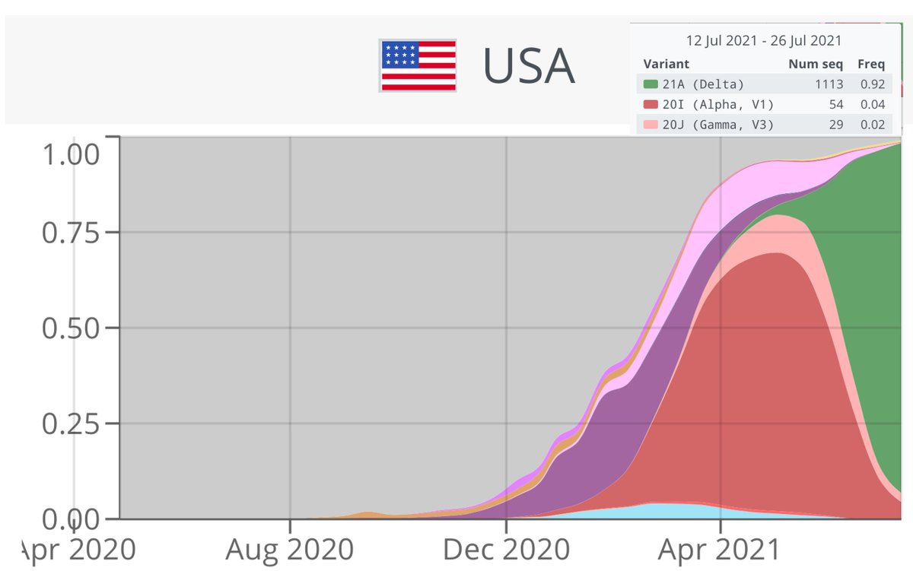</img></a>

---

<a href="https://twitter.com/erictopol/status/1419889147628584961" target="_blank" rel="noreferer">05:15 UCT</a>

@deepbluecea It isn't misleading at all. Of course Delta's rise here for % cases was inevitable. You made my point in parentheses

---

<a href="https://twitter.com/erictopol/status/1419908308735959045" target="_blank" rel="noreferer">06:31 UCT</a>

@jburnmurdoch Sure,  but would those indoor gatherings have occurred without the football matches? 
And thanks for your phenomenal data journalism throughout the pandemic

---

<a href="https://twitter.com/erictopol/status/1420024559017742336" target="_blank" rel="noreferer">14:13 UCT</a>

Adding the CDC dropping masks in May 

<a href="E7TwyD1XIAsnrVc.jpg"  >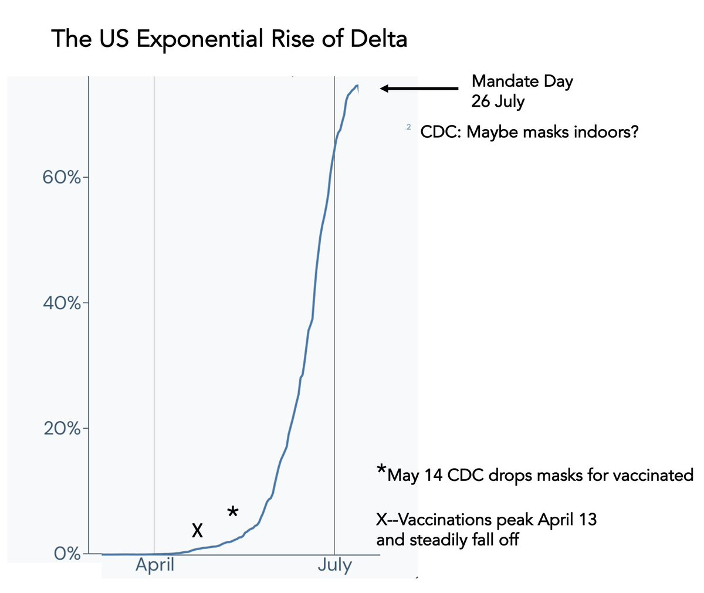</img></a>

---

<a href="https://twitter.com/erictopol/status/1420028728915099648" target="_blank" rel="noreferer">14:30 UCT</a>

Louisiana, now leading the US Delta wave 

<a href="E7T0XwBWEAYESOm.jpg"  >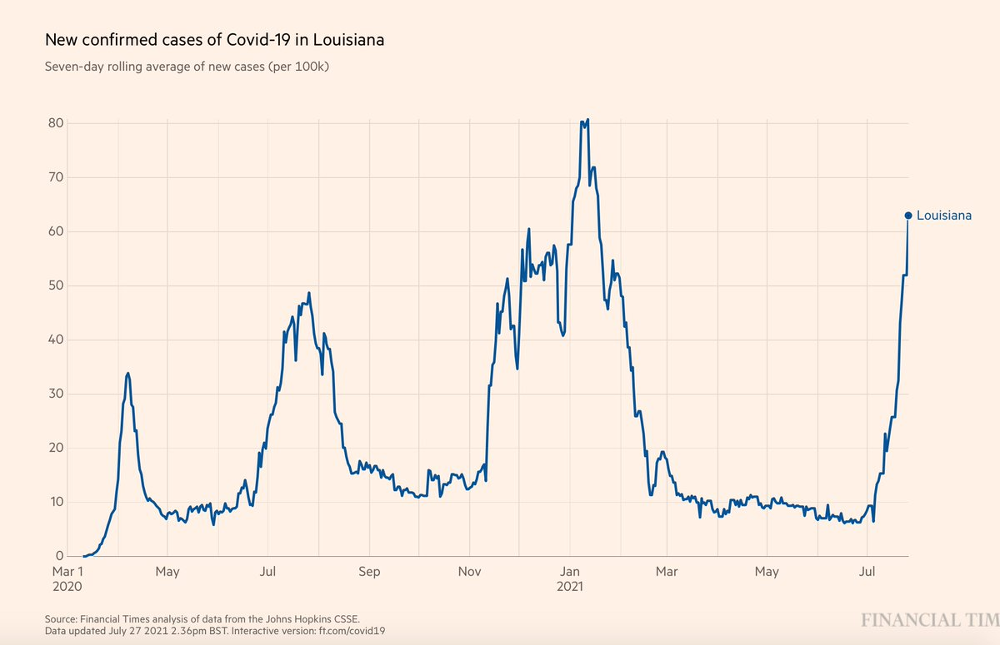</img></a>

---

<a href="https://twitter.com/erictopol/status/1420030716423770112" target="_blank" rel="noreferer">14:38 UCT</a>

It's not just about cases. It never is just about cases. 

<a href="E7T2X5RX0AomGEz.jpg"  >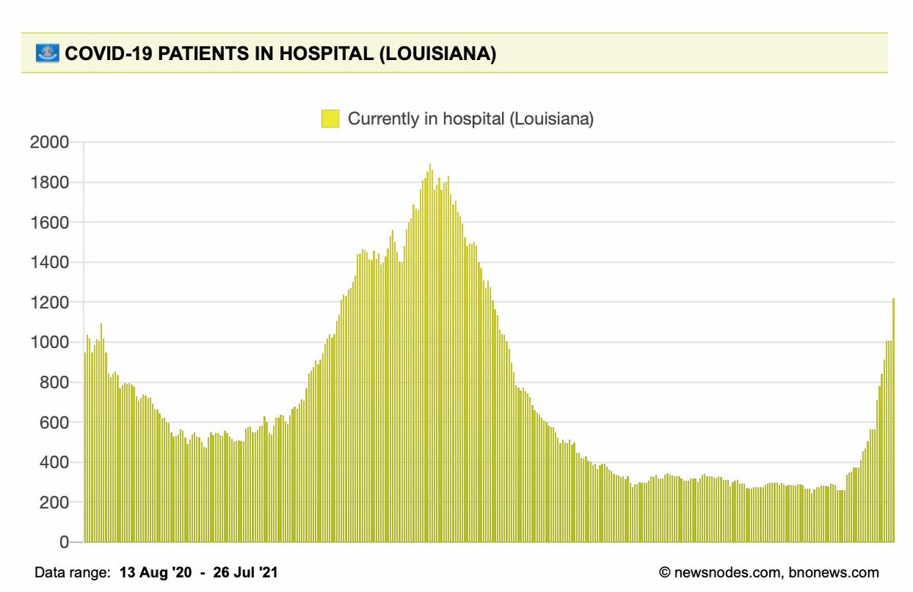</img></a>

---

<a href="https://twitter.com/erictopol/status/1420041565146214400" target="_blank" rel="noreferer">15:21 UCT</a>

This 

<a href="E7UAPnzVgAEvANp.jpg"  >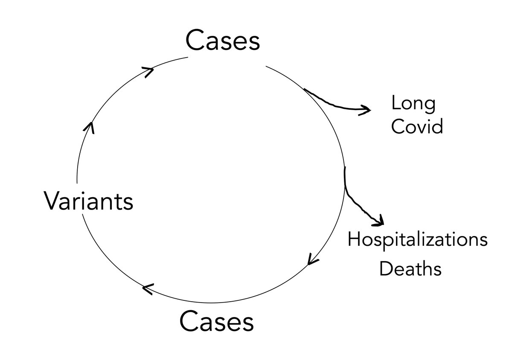</img></a>

---

<a href="https://twitter.com/erictopol/status/1420044483912028167" target="_blank" rel="noreferer">15:32 UCT</a>

How similar are the AZ and J&amp;J adenovirus vector vaccines? An analysis suggests quite different with respect to impurities and vascular permeability (leak)
https://www.researchsquare.com/article/rs-736157/v1 preprint 

<a href="E7UCzl9VoAY8A5l.jpg"  ></img></a>

---

<a href="https://twitter.com/erictopol/status/1420048293355147268" target="_blank" rel="noreferer">15:47 UCT</a>

And it keeps going  https://twitter.com/EricTopol/status/1419693780802805763

<a href="E7UGJH5VIAAfkB2.jpg"  >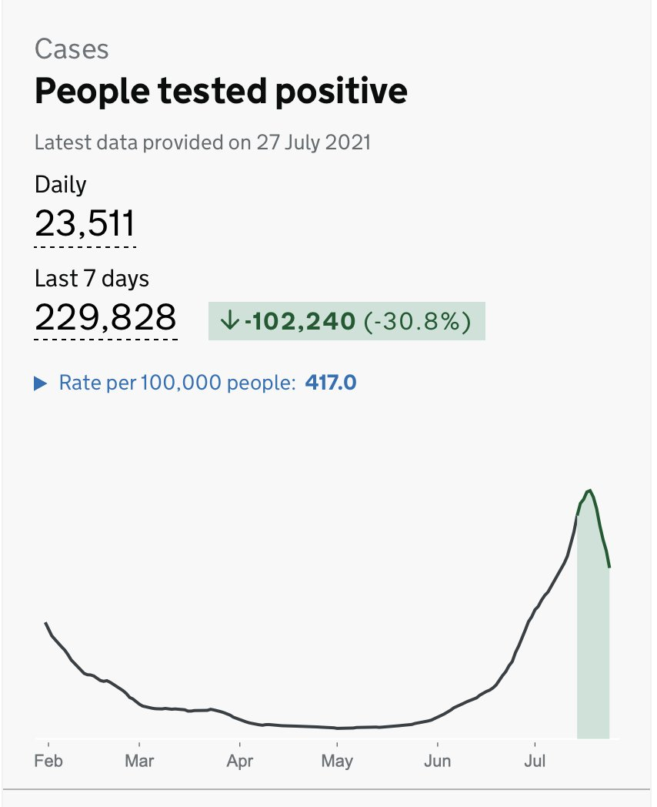</img></a>

---

<a href="https://twitter.com/erictopol/status/1420049387057672200" target="_blank" rel="noreferer">15:52 UCT</a>

This might be a good time to suggest indoor masks ;-)
Thanks CDC, always ahead of the curve.
Especially when they're exponential https://twitter.com/EricTopol/status/1419887785205370883

---

<a href="https://twitter.com/erictopol/status/1420075584751734785" target="_blank" rel="noreferer">17:36 UCT</a>

Avoid the "Delta stress test"
1. This 🦠version is far more transmissible w/ &gt;1000 X viral load than the original
2. Vaccines still are protecting well vs severe illness but we're seeing an increase in breakthroughs &amp; disease
3. 😷 helps;  💉synergy
4. This wave will pass

---

<a href="https://twitter.com/erictopol/status/1420082977879429123" target="_blank" rel="noreferer">18:05 UCT</a>

Delta waves can descend as fast as they rise in some countries with near 100%  prevalence
@OurWorldInData and http://covariants.org 

<a href="E7UlK1DVoAA47gk.jpg"  >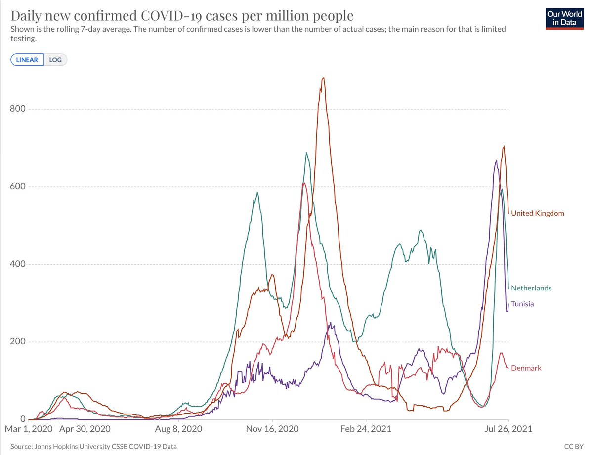</img></a><a href="E7UlzxCVoAMPfGN.jpg"  >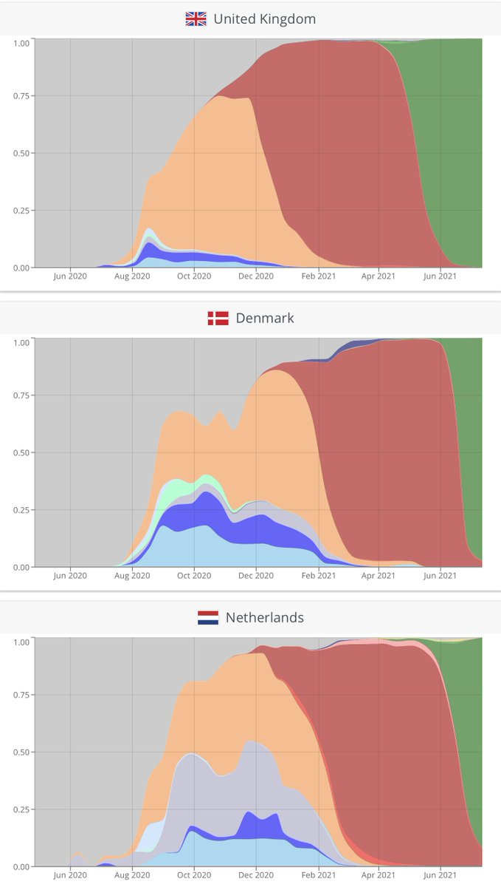</img></a>

---

<a href="https://twitter.com/erictopol/status/1420084389476589569" target="_blank" rel="noreferer">18:11 UCT</a>

@angrybklynmom I just did. Goodbye.

---

<a href="https://twitter.com/erictopol/status/1420086016744980486" target="_blank" rel="noreferer">18:17 UCT</a>

Canada surpasses UK for fully vaccinated. 
Israel in its sight.
Spain has major momentum, too.
Kudos to these countries; it takes massive coordinating efforts and public support 

<a href="E7UoYY6VUAUtlT-.jpg"  >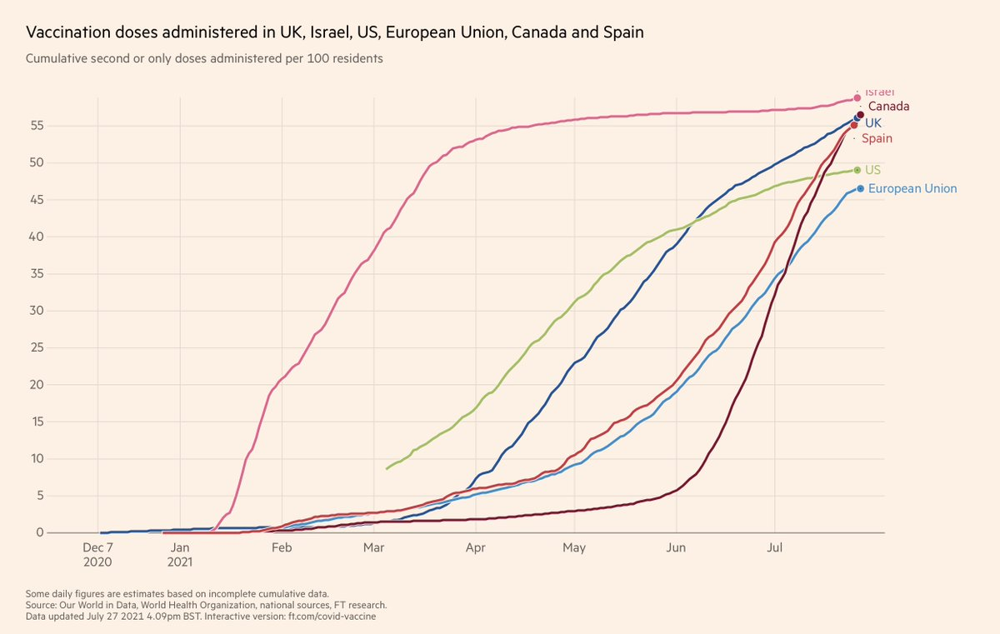</img></a>

---

<a href="https://twitter.com/erictopol/status/1420087558084567040" target="_blank" rel="noreferer">18:23 UCT</a>

RT @ScrippsRTI: In an op-ed in @sciam, @danieloran and @EricTopol share a message to those who are hesitant about vaccination: "Don't let t…

---

<a href="https://twitter.com/erictopol/status/1420103588542435333" target="_blank" rel="noreferer">19:27 UCT</a>

RT @sciam: "The message to those who remain unvaccinated should be: Don’t let the virus use you to harm others." | Opinion by @danieloran a…

---

<a href="https://twitter.com/erictopol/status/1420107145840758786" target="_blank" rel="noreferer">19:41 UCT</a>

Two of the most US fully vaccinated % places (total population): Vermont (67% of ~650K people) and San Francisco Co (69% of ~880K people). 
How are their Delta immunity walls?
Vermont's hospitalizations continue to decline (only place in the US); SF well blunted despite case rise 

<a href="E7U7vFKVcAQYP-B.jpg"  >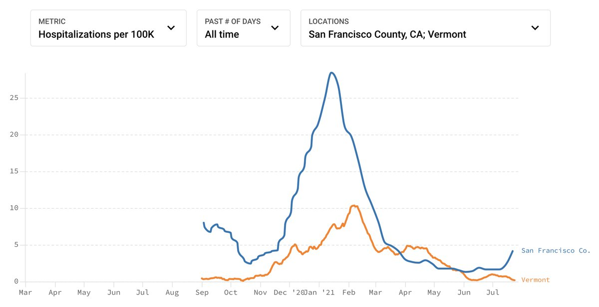</img></a><a href="E7U7xUSUcAAzgB9.jpg"  >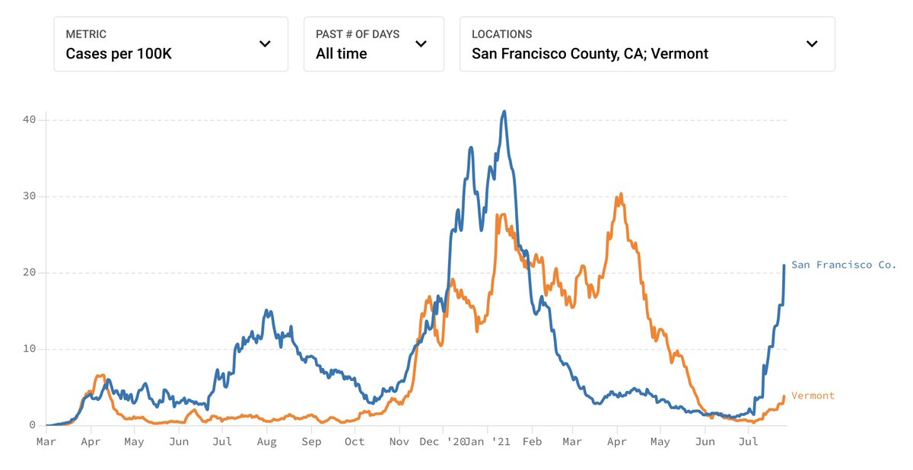</img></a>

---

<a href="https://twitter.com/erictopol/status/1420115752028278787" target="_blank" rel="noreferer">20:15 UCT</a>

Looking for a U-turn via a log-plot. 
Delta dominance order of timing 1. UK, 2. Israel, 3. UK
This shows how closely US and Israel are tracking each other, and in parallel to the UK, despite marked baseline differences 

<a href="E7VDtp2UYAQhLWQ.jpg"  >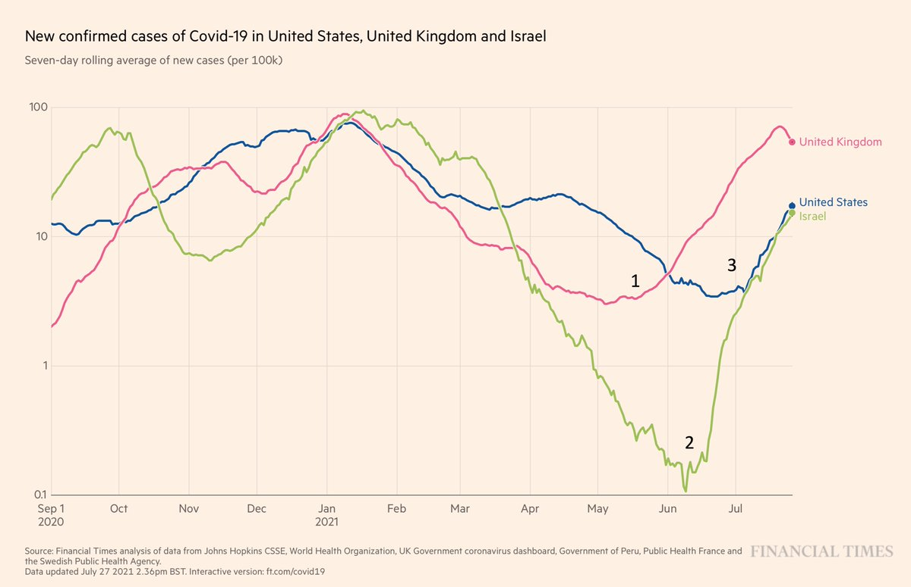</img></a>

---

<a href="https://twitter.com/erictopol/status/1420117988359827459" target="_blank" rel="noreferer">20:24 UCT</a>

What about by vaccinated? Let's look at Israel's latest data, a 4-fold difference
Graph from @yuvharpaz, h/t @segal_eran 

<a href="E7VFUQQVkAAqR-U.png"  >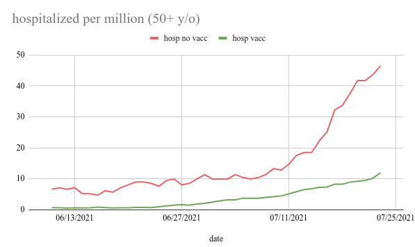</img></a>

---

<a href="https://twitter.com/erictopol/status/1420135595569860610" target="_blank" rel="noreferer">21:34 UCT</a>

Both countries have &gt;92% Delta prevalence and have similar vaccination rates (~49-51% fully vaccinated, total pop). Denmark is on the descent. They rely heavily on free, frequent rapid antigen tests. The US is a no show on these.
@OurWorldInData 

<a href="E7VVF9tVcAM5nNm.jpg"  >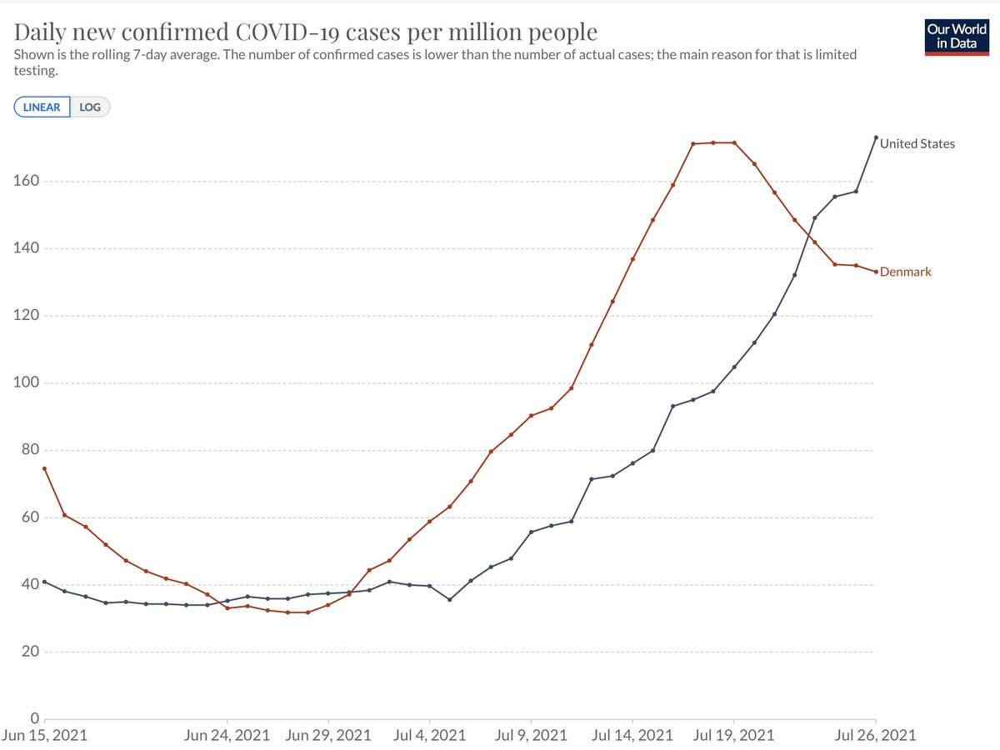</img></a>

---

<a href="https://twitter.com/erictopol/status/1420155248639766528" target="_blank" rel="noreferer">22:52 UCT</a>

Vaccine-induced thrombotic thrombocytopenia (VITT or TTS) events are extremely rare w/ the adenovirus vector vaccines. A new report by @AstraZeneca @TheLancet addresses after 2nd AZ dose w/ details in 13 people
https://www.thelancet.com/journals/lancet/article/PIIS0140-6736(21)01693-7/fulltext
1st dose : 8.1/ million
2nd dose: 2.3/million 

<a href="E7VmXx9VoAU0OVt.jpg"  >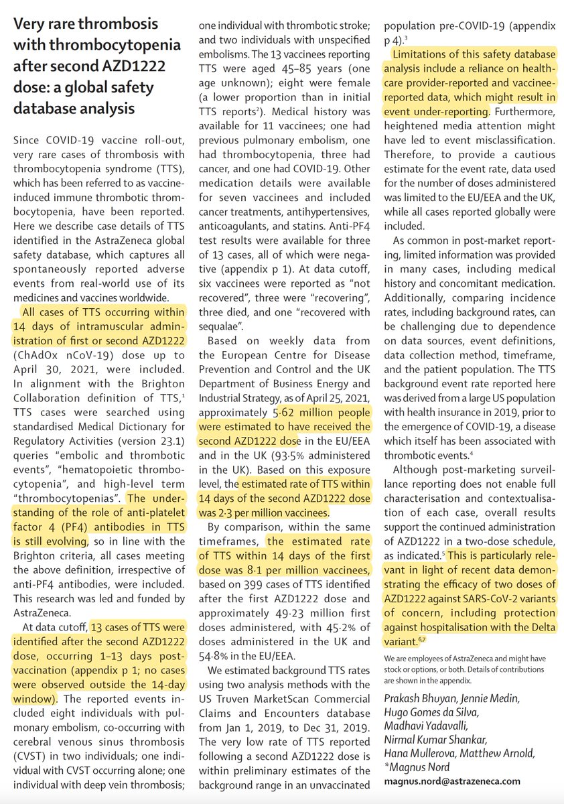</img></a>

---

<a href="https://twitter.com/erictopol/status/1420160102137417729" target="_blank" rel="noreferer">23:12 UCT</a>

Why would frequent rapid tests be so important now?
Delta's very high viral load can override vaccine protection in some people and they can transmit prior to having symptoms.
There's only 1 practical way to know about that
Paging @michaelmina_lab

---

<a href="https://twitter.com/erictopol/status/1420163618734166018" target="_blank" rel="noreferer">23:26 UCT</a>

@alexismadrigal @nataliexdean It is shocking and was preventable, Alexis. Need to bring back the @COVID19Tracking, @kissane and the band ;-)

