+++
title = "Tweets by Eric Topol July 28"
Summary = ""
tags = ["Twitter"]
category = "Twitter"
+++

---

<a href="https://twitter.com/erictopol/status/1420235203075665920" target="_blank" rel="noreferer">04:10 UCT</a>

@angie_rasmussen We agree with all your points 💯 @RobertoBurioni and me @NatureMedicine https://www.nature.com/articles/s41591-021-01421-7

---

<a href="https://twitter.com/erictopol/status/1420367242617782273" target="_blank" rel="noreferer">12:55 UCT</a>

How #SARSCoV2 gets into our cells and Delta's enhanced capability involving its altered furin cleavage site, P681R mutation, and yet to be fully defined mechanism for its very high transmissibility
https://www.nature.com/articles/d41586-021-02039-y
new &amp; outstanding feature @Nature @Scudellari 

<a href="https://twitter.com/erictopol/status/1420367242617782273" target="_blank" rel="noreferer">Annimation or video</a>

---

<a href="https://twitter.com/erictopol/status/1420370364509548546" target="_blank" rel="noreferer">13:07 UCT</a>

Just published @nature
Soon (10-12 days) after 1st dose of an mRNA vaccine, fully functional CD8+ T cells kick in to provide some protection, well before neutralizing antibodies are barely detectable https://www.nature.com/articles/s41586-021-03841-4

---

<a href="https://twitter.com/erictopol/status/1420379159734341632" target="_blank" rel="noreferer">13:42 UCT</a>

New and rigorous review of Ivermectin by @CochraneLibrary @cochranecollab underscores the lack of evidence that it works  https://twitter.com/JeremyFarrar/status/1420333684192907277

<a href="E7YzOB0VcAIrGS2.jpg"  >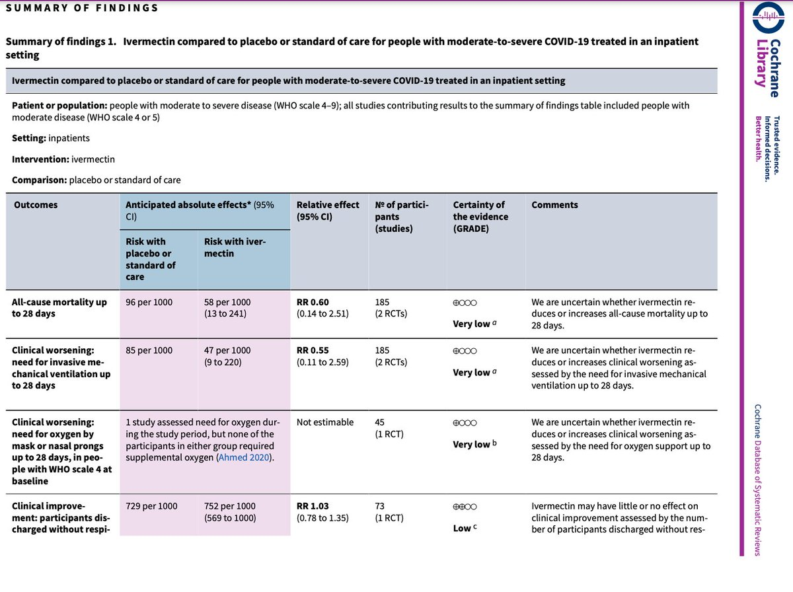</img></a><a href="E7YzQDOUYAEa4H3.jpg"  >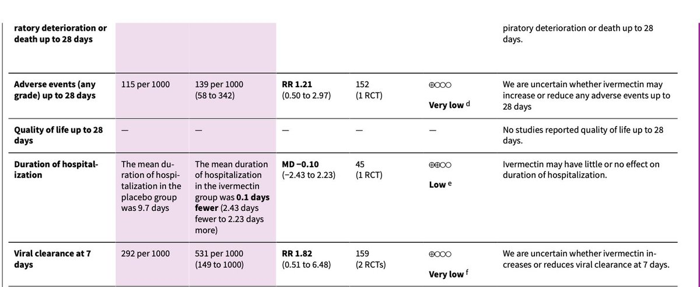</img></a>

---

<a href="https://twitter.com/erictopol/status/1420382653962866693" target="_blank" rel="noreferer">13:56 UCT</a>

We used to refer to a "blockbuster" product of a pharmaceutical company as having $1 billion of sales in a year. Pfizer's vaccine take for 2021 is $33 billion
https://www.ft.com/content/ee45a6f3-1577-4d64-bd1f-462c7440de38 by @donatopmancini @FT 

<a href="E7Y1c-xVoAEOssS.jpg"  >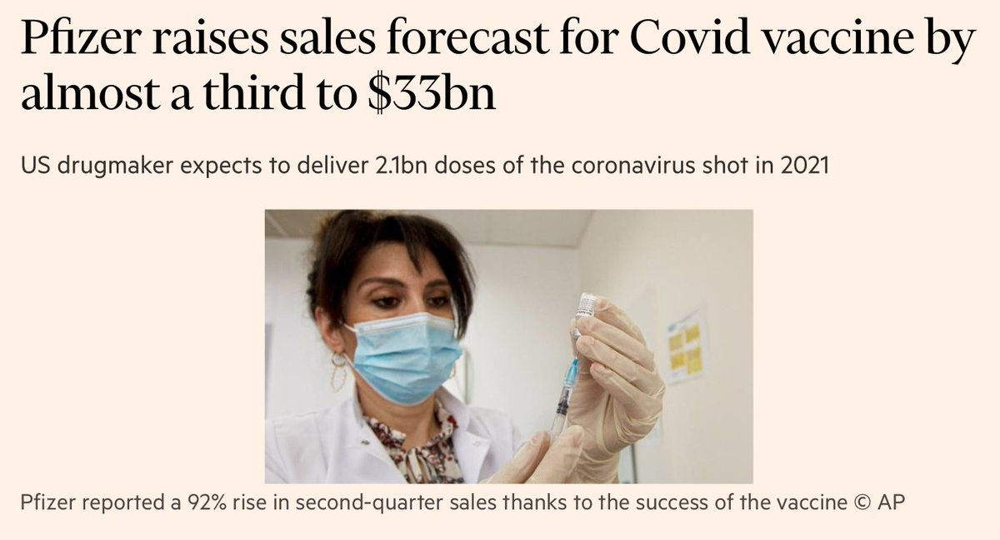</img></a>

---

<a href="https://twitter.com/erictopol/status/1420393830042402819" target="_blank" rel="noreferer">14:40 UCT</a>

I can't remember the last time I agreed with a @WSJopinion but they've got the @US_FDA full approval need right
https://www.wsj.com/articles/to-mandate-or-not-to-mandate-vaccines-11627425858?mod=opinion_lead_pos1 

<a href="E7ZAdwhUcAYpt29.jpg"  >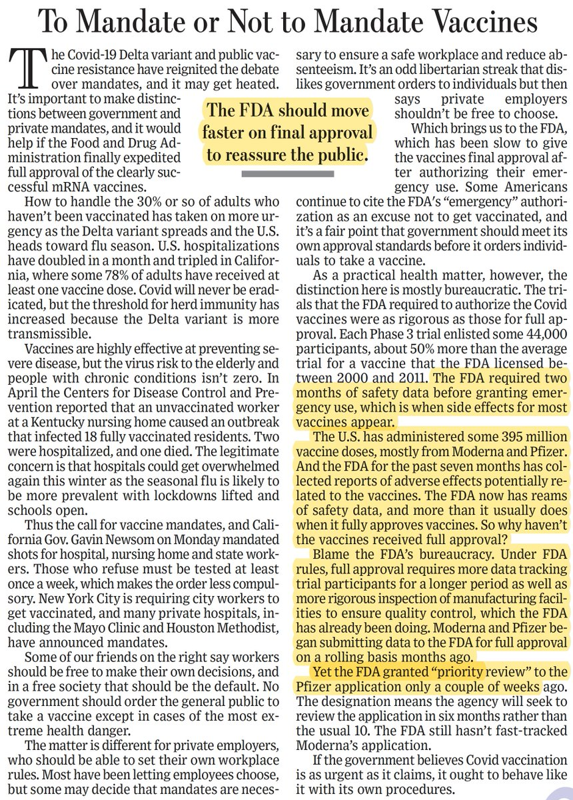</img></a>

---

<a href="https://twitter.com/erictopol/status/1420395392038965254" target="_blank" rel="noreferer">14:47 UCT</a>

This quickly reaching 80 cases/100,000 residents in Louisiana, now exceeding its pandemic peak, and heading due North, is deeply concerning
Arkansas slowing, hope it continues 

<a href="E7ZBu9dVgAUha26.jpg"  >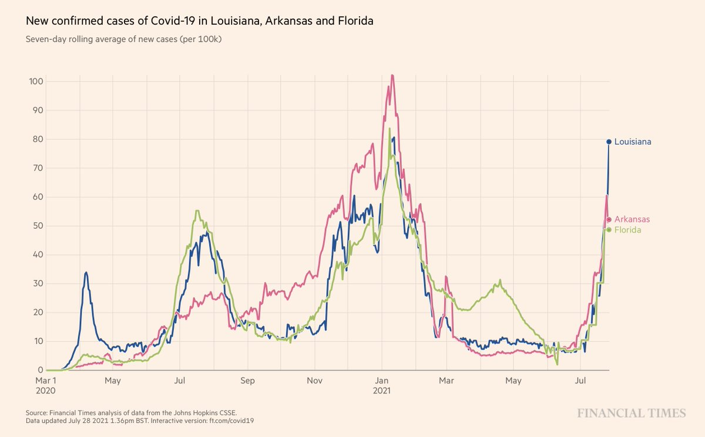</img></a>

---

<a href="https://twitter.com/erictopol/status/1420396535175475201" target="_blank" rel="noreferer">14:51 UCT</a>

And hospitalizations 

<a href="E7ZDFzOVcAMbbby.jpg"  >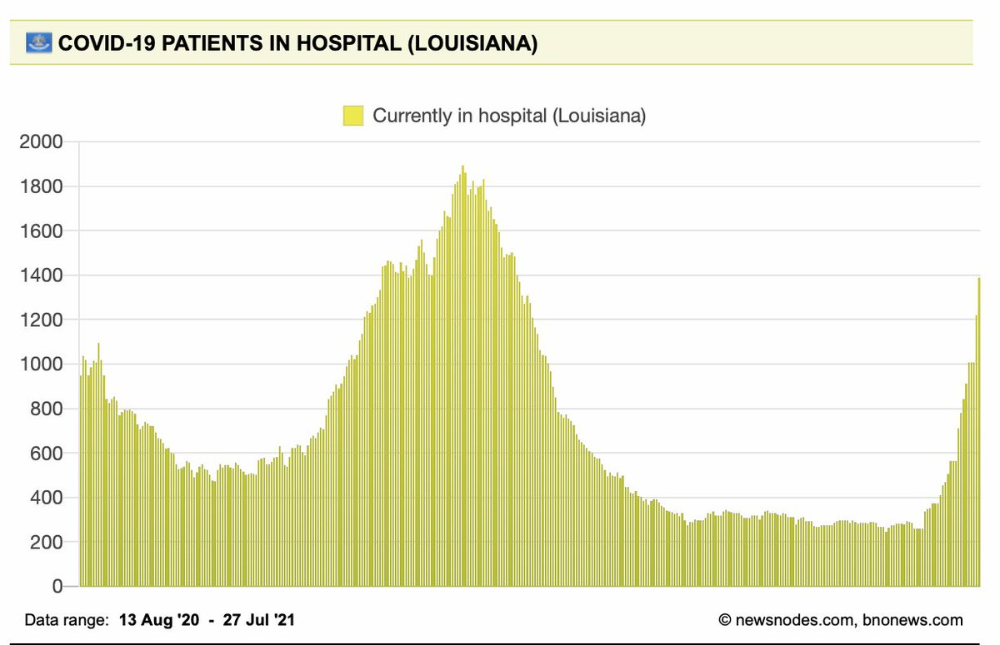</img></a>

---

<a href="https://twitter.com/erictopol/status/1420403211387604997" target="_blank" rel="noreferer">15:18 UCT</a>

How to make a killer virus aesthetic 

<a href="E7ZJEphVIAAmbgz.jpg"  >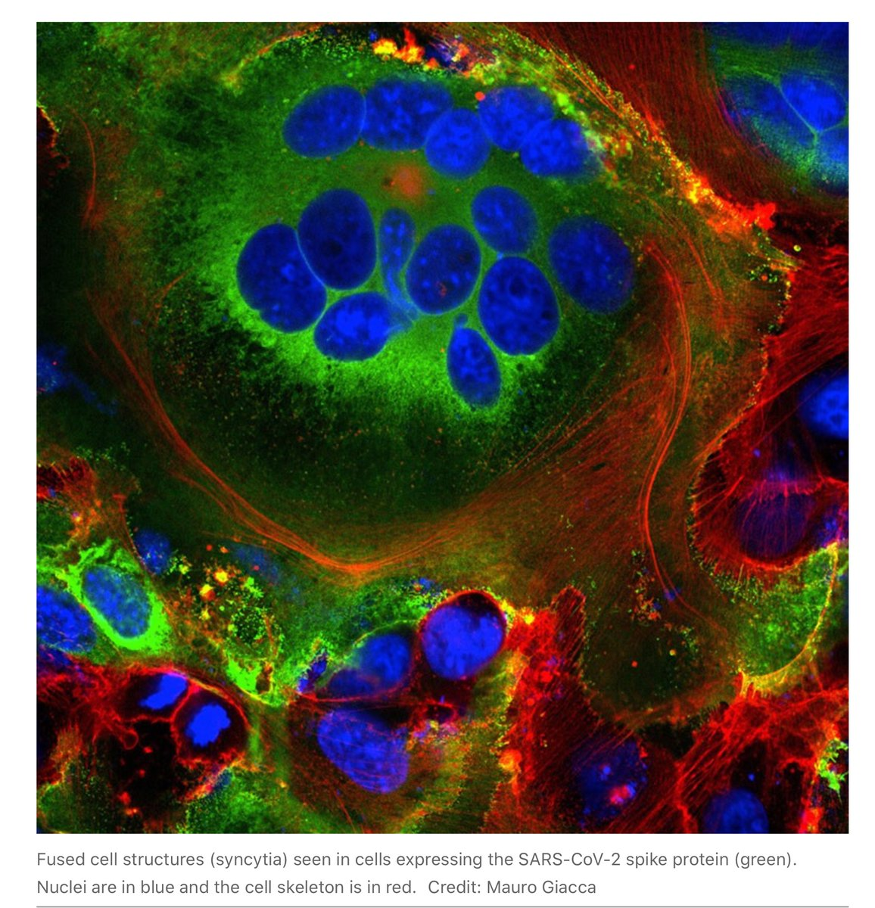</img></a>

---

<a href="https://twitter.com/erictopol/status/1420406285942464513" target="_blank" rel="noreferer">15:30 UCT</a>

This new data from @pfizer on booster shots for increasing levels of neutralizing antibodies by age group in 23 people is not enough to make any call yet. We need to see clinical data to know whether this marker translates to need, and in whom
https://s21.q4cdn.com/317678438/files/doc_financials/2021/q2/Q2-2021-Earnings-Charts-FINAL.pdf 

<a href="E7ZLLryVEAA9N8Y.jpg"  >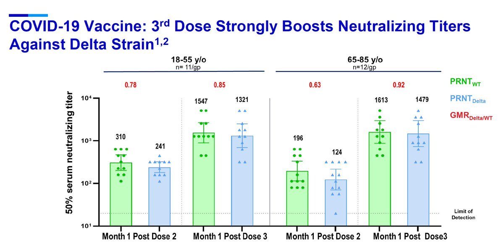</img></a>

---

<a href="https://twitter.com/erictopol/status/1420408515835744259" target="_blank" rel="noreferer">15:39 UCT</a>

Just out @ScienceMagazine
"The overlooked superpower of mRNA vaccines"
Breaking the chain better; all vaccines are ≠
https://www.sciencemag.org/news/2021/07/overlooked-superpower-mrna-vaccines by @meredithwadman w/ @angie_rasmussen @adeelbutt_MD 

<a href="E7ZN7LfVoAEdxyC.jpg"  >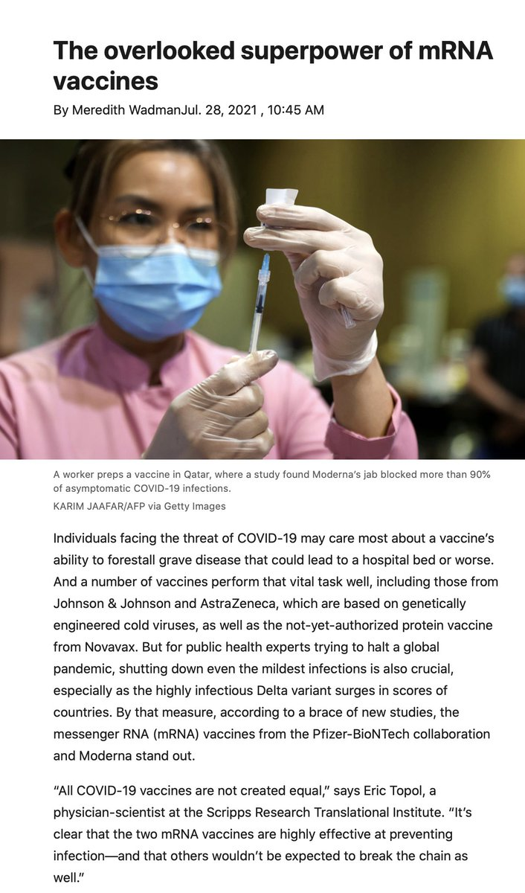</img></a>

---

<a href="https://twitter.com/erictopol/status/1420411194003791872" target="_blank" rel="noreferer">15:49 UCT</a>

The 6 month vaccine efficacy date from @Pfizer/@BioNTech_Group's randomized trial, new preprint
https://www.medrxiv.org/content/10.1101/2021.07.28.21261159v1
Any symptomatic infection
2 months 96%
2-4 months 90%
4-6 months 84%
For protection vs severe illness solid all the way through at least 6 months *97%*

---

<a href="https://twitter.com/erictopol/status/1420412132160540675" target="_blank" rel="noreferer">15:53 UCT</a>

The event curves for symptomatic infections show this change over time. The convergence trend is small relative to the persistent marked gradient between vaccine and placebo 

<a href="E7ZQidWUYAQV0J3.jpg"  >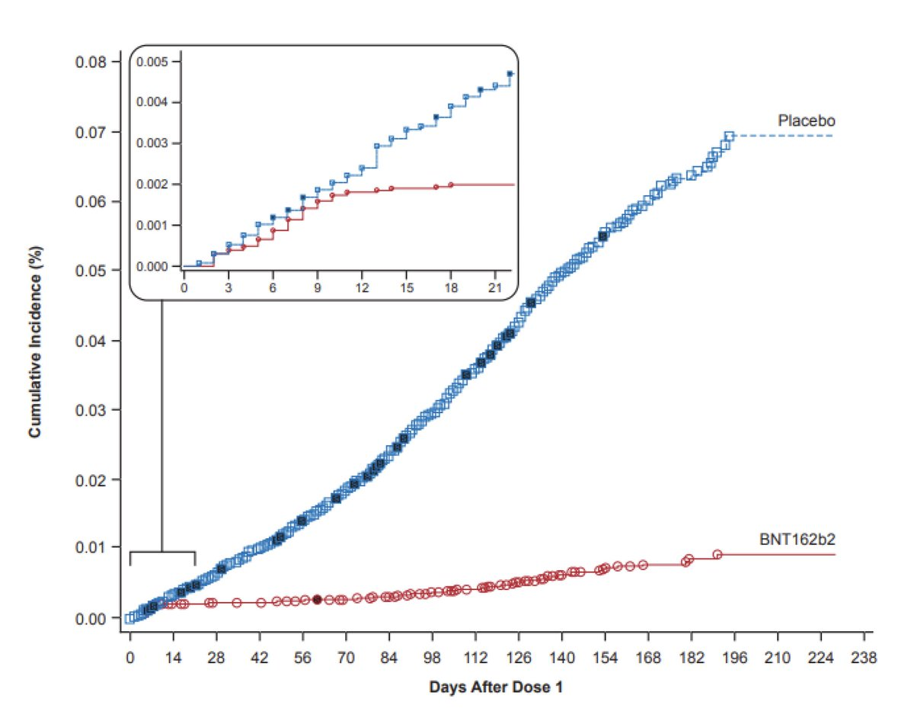</img></a>

---

<a href="https://twitter.com/erictopol/status/1420437259438804992" target="_blank" rel="noreferer">17:33 UCT</a>

Prior covid and a dose of J&amp;J vaccine offers strong neutralizing antibody and T-cell response against Delta (and Beta) variants
https://www.medrxiv.org/content/10.1101/2021.07.24.21261037v1 @virusmonologues and colleagues, preprint 

<a href="E7ZnVTPVgAQv3OB.jpg"  >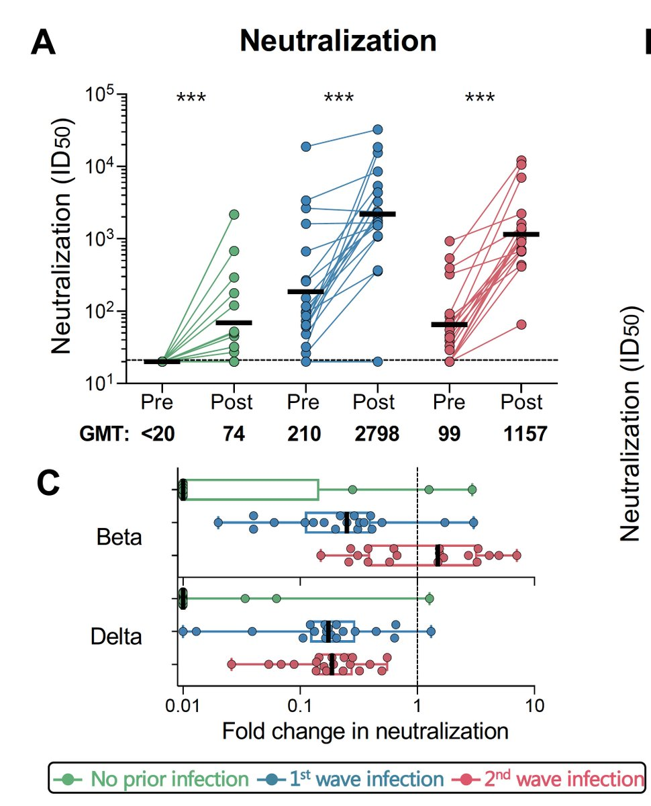</img></a>

---

<a href="https://twitter.com/erictopol/status/1420441288768294915" target="_blank" rel="noreferer">17:49 UCT</a>

@jcbarret I'd say your point is obvious. I was "just" noting a &gt;18% increase in 1 day without evidence there was a backlog, and that we should keep an eye on this......

---

<a href="https://twitter.com/erictopol/status/1420444712855511040" target="_blank" rel="noreferer">18:03 UCT</a>

Delta didn't "erupt" here. Its growth followed an exponential curve, doubling every ~10 days over many weeks since April, and we could precisely predict its dominance and now ~94%
 https://twitter.com/EricTopol/status/1419882156055175168 

<a href="E7ZuDeuVoAI2StQ.jpg"  >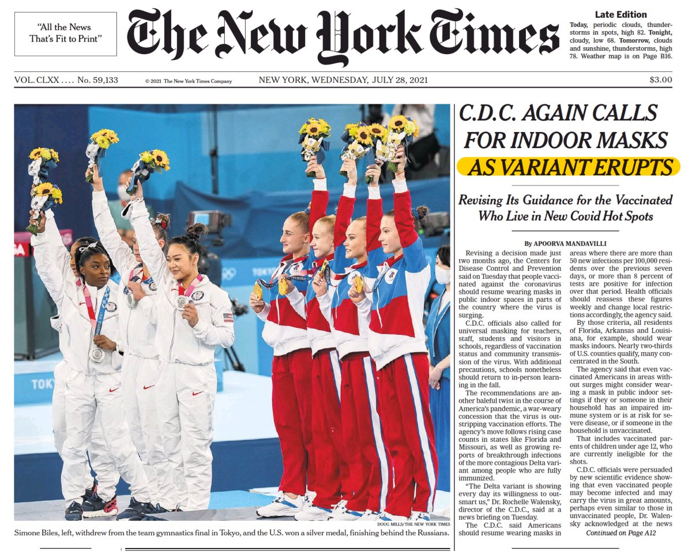</img></a>

---

<a href="https://twitter.com/erictopol/status/1420454068774858754" target="_blank" rel="noreferer">18:40 UCT</a>

I deleted my prior post about the UK cases today which was simply noting the new data point and to keep an eye on this, nothing else, and with hope that the important U-turn keeps going. 

<a href="E7Z26v1UYAEc9HE.jpg"  >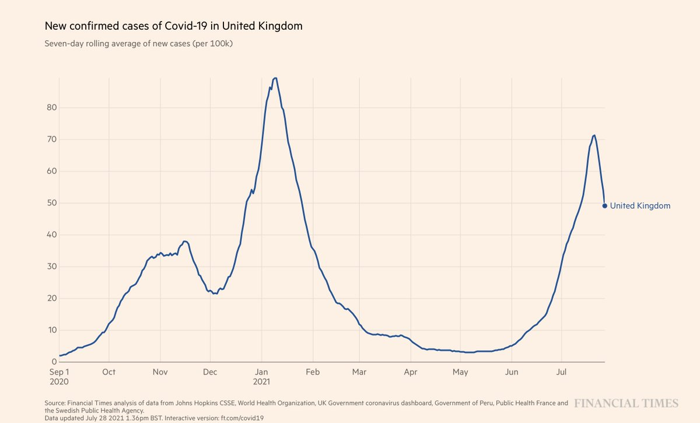</img></a>

---

<a href="https://twitter.com/erictopol/status/1420472100259647491" target="_blank" rel="noreferer">19:51 UCT</a>

Best US vaccination day reported in many weeks with 500,000 newbies and &gt;750,000 total doses, well above current average 👍
A silver lining of Delta along with the new movement towards vaccination requirements by many large entities 

<a href="E7aG3f3UUAASP3z.jpg"  >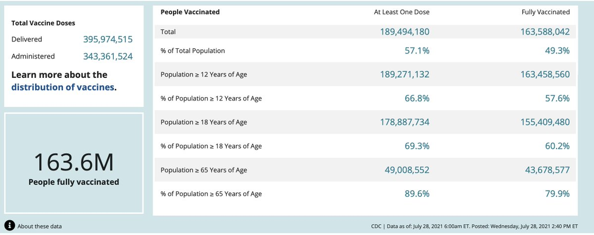</img></a><a href="E7aG7NHVgAIHgJ-.jpg"  >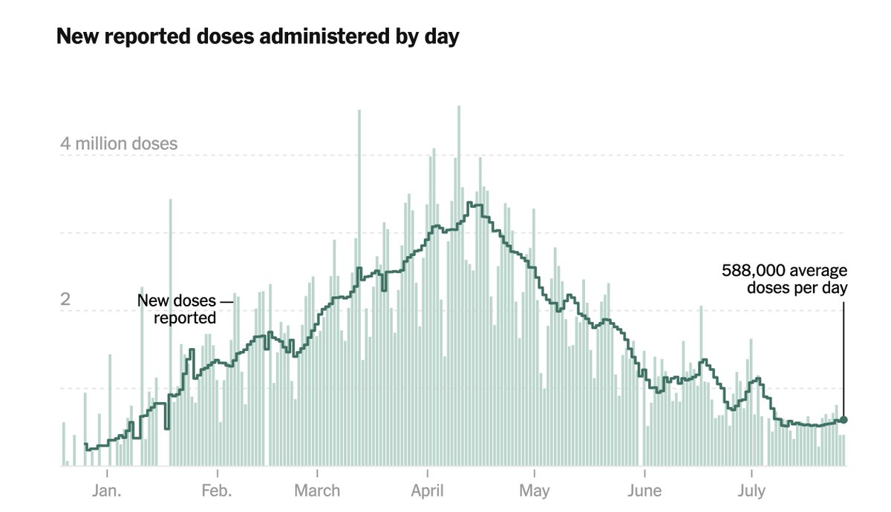</img></a>

---

<a href="https://twitter.com/erictopol/status/1420473122025742336" target="_blank" rel="noreferer">19:55 UCT</a>

A new, related piece @KHNews by @LizSzabo explores the mechanism for Delta's very high contagiousness
https://khn.org/news/article/unraveling-the-mysterious-mutations-that-make-delta-the-most-transmissible-covid-virus-yet/ w/ @angie_rasmussen

---

<a href="https://twitter.com/erictopol/status/1420489406025113601" target="_blank" rel="noreferer">21:00 UCT</a>

Very important @NEJM paper today on breakthrough infections (BTI) post-vaccination in Israeli health care workers. 
5 key points:
1. Of ~1500 people, 0.4% had BIs, sequenced to be Alpha 85% (this was pre-Delta)
https://www.nejm.org/?query=featured_home&doi=10.1056%2FNEJMoa2109072 

<a href="E7aSMyIUYAQkxc3.jpg"  >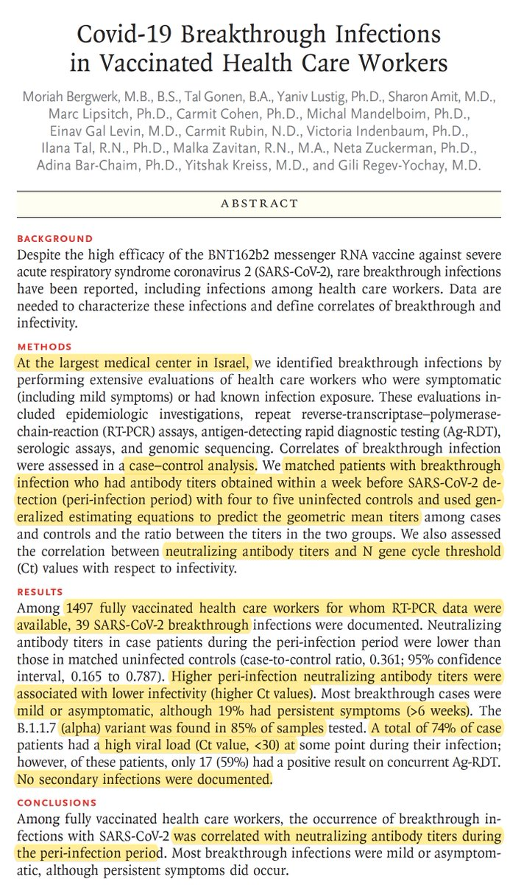</img></a>

---

<a href="https://twitter.com/erictopol/status/1420489410152255488" target="_blank" rel="noreferer">21:00 UCT</a>

2. All these BTIs were mild (67%) or without symptoms (33%), done due to routine testing. No hospitalizations. 

<a href="E7aTiHNVEAAe4Ws.jpg"  >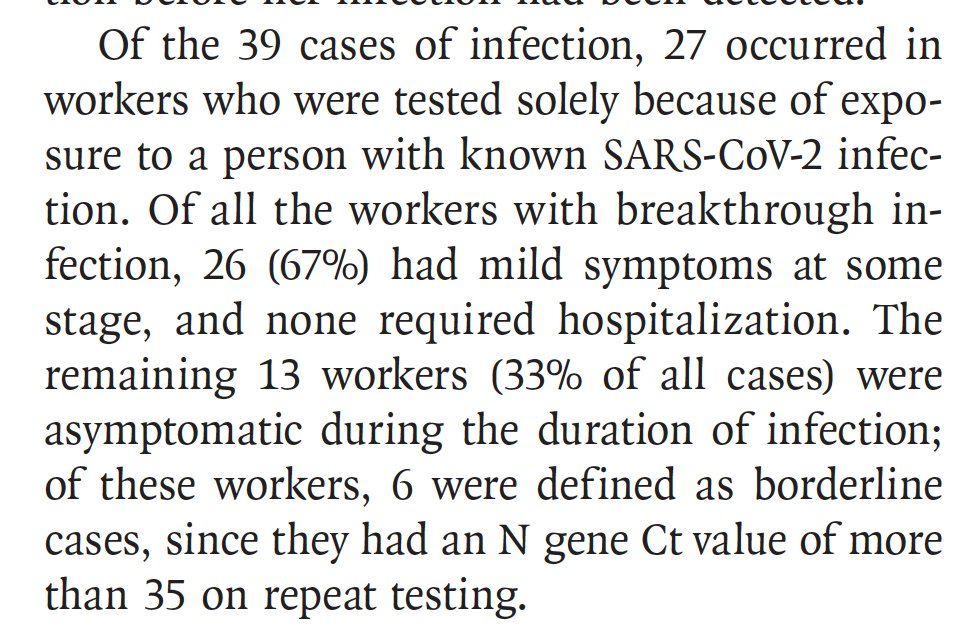</img></a>

---

<a href="https://twitter.com/erictopol/status/1420489413293875201" target="_blank" rel="noreferer">21:00 UCT</a>

3. 7 of 36 (19% ) of BTIs had "persistent symptoms" &gt; 6 weeks. Table below
An indicator for the potential of #LongCovid in BTIs in a few of these people at &gt; 6 weeks, but that's a very limited and early time for assessment. 

<a href="E7aT5gZVgAAE81e.jpg"  >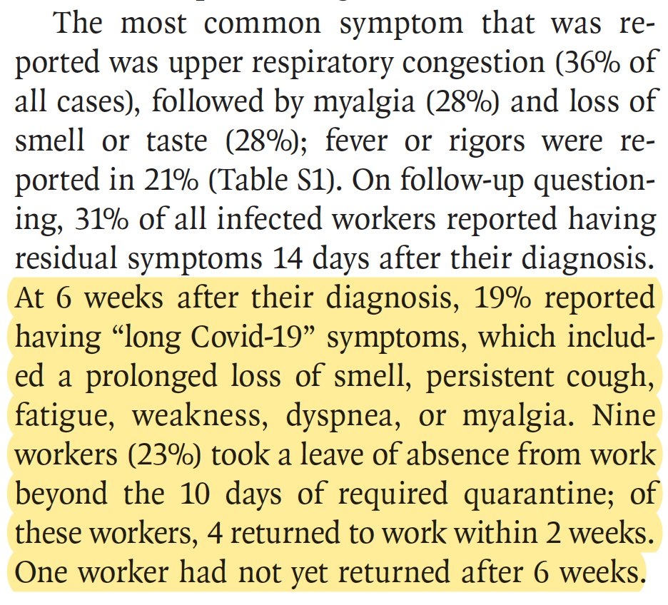</img></a><a href="E7aV-8OUYAAl2ch.jpg"  >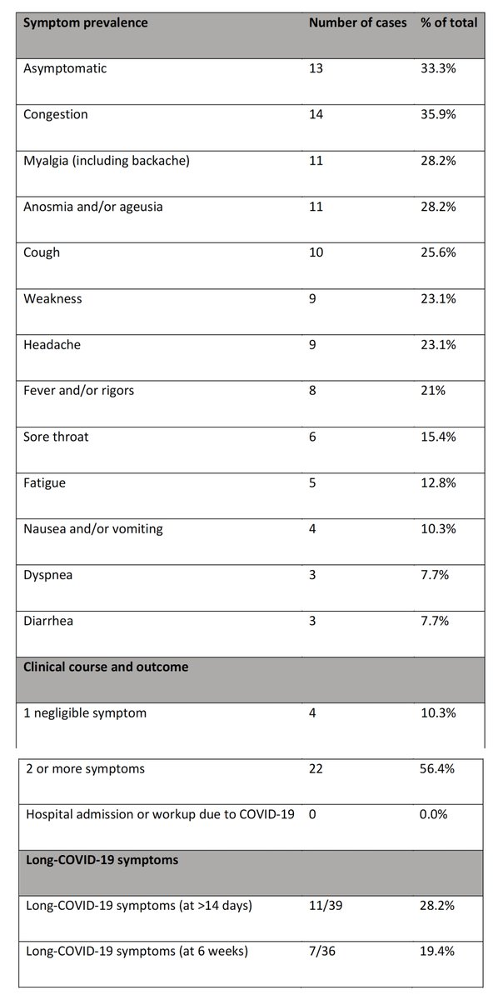</img></a>

---

<a href="https://twitter.com/erictopol/status/1420489417462931458" target="_blank" rel="noreferer">21:00 UCT</a>

4. There were NO secondary attacks, no indication of transmission of BTIs.
5. The neutralizing antibody levels in the people with BTIs were lower than matched controls, raising the question of need for a booster dose. Unsettled. 

<a href="E7aURCYVoAAAorJ.jpg"  >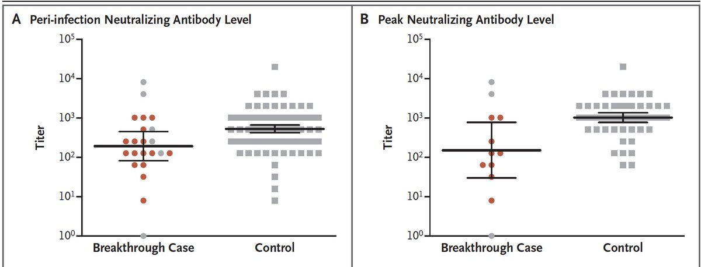</img></a>

---

<a href="https://twitter.com/erictopol/status/1420491920288092161" target="_blank" rel="noreferer">21:10 UCT</a>

#LongCovid from breakthrough infections?
We needed time to determine whether they can occur post-vaccination. This is the 1st report I've seen that suggests that can occur, a preliminary assessment.
All this pertains to Alpha, not Delta, which, of course, will not be as favorable

---

<a href="https://twitter.com/erictopol/status/1420494077137612802" target="_blank" rel="noreferer">21:19 UCT</a>

@LCSlates @NEJM I calculated 2.6% just as you did, but they wrote 0.4%. 

<a href="E7abqQdVIAIdkLI.jpg"  >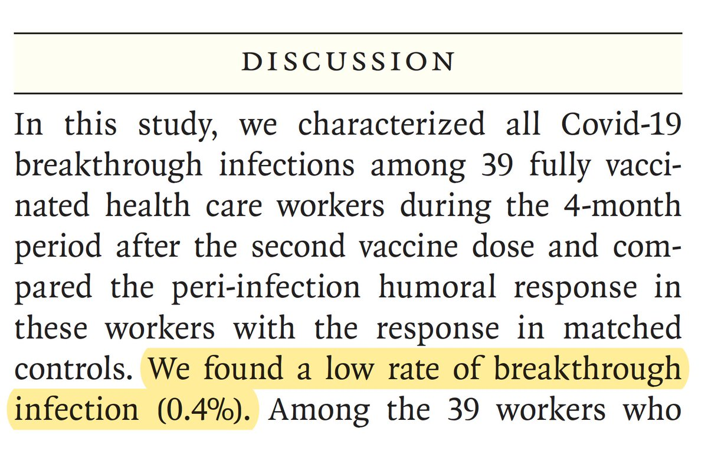</img></a>

---

<a href="https://twitter.com/erictopol/status/1420510006810533895" target="_blank" rel="noreferer">22:22 UCT</a>

Texas, signing onto the Delta wave, with 13,000 new cases today and &gt;80% increase in hospitalizations over the past 2 weeks.
US overall  &gt;63,000/day 7-day average will rise quickly when FL and TX get going like this 

<a href="E7aov1cUYAAeBM2.jpg"  >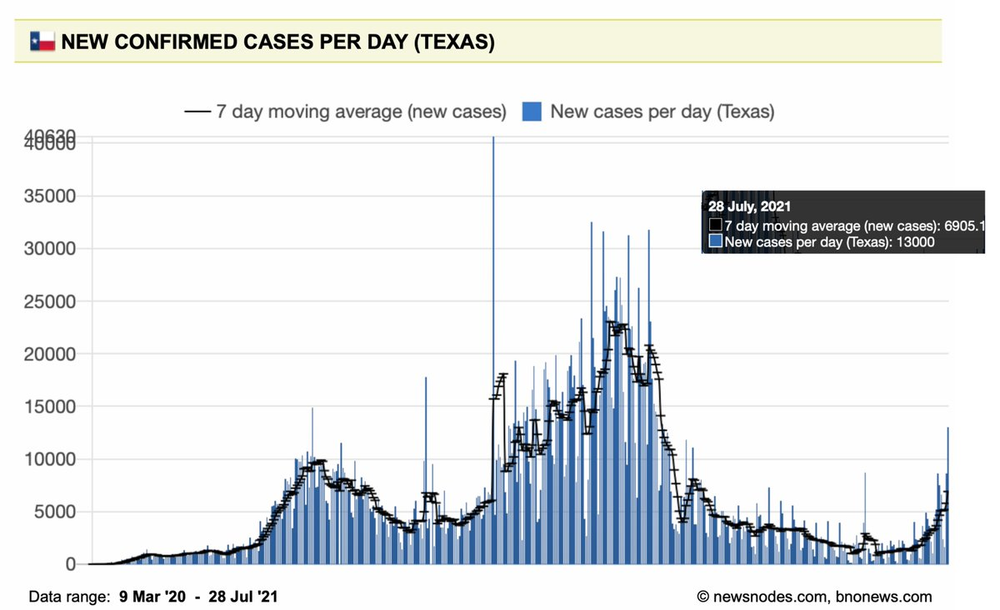</img></a>

---

<a href="https://twitter.com/erictopol/status/1420511110008950787" target="_blank" rel="noreferer">22:26 UCT</a>

From @cohensa
@xkcd is on it! 

<a href="E7arUC8UUAAL-Mp.png"  >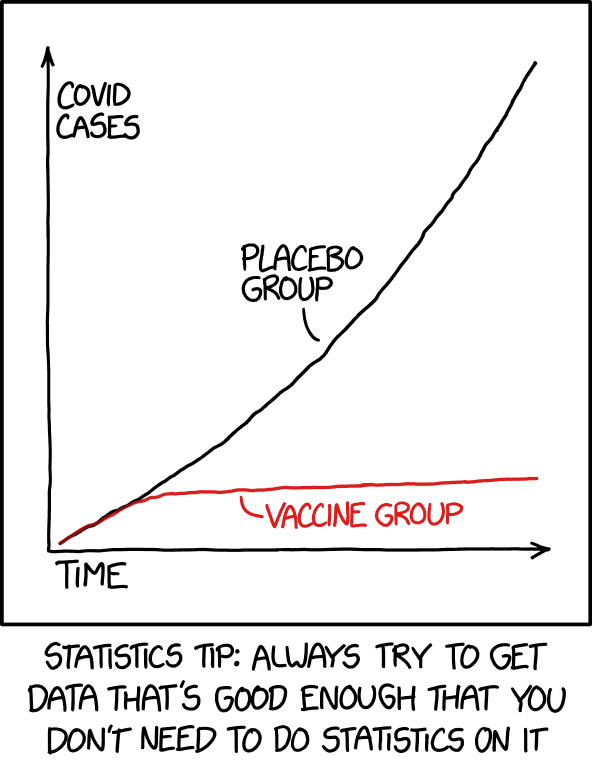</img></a>

---

<a href="https://twitter.com/erictopol/status/1420516224291663875" target="_blank" rel="noreferer">22:47 UCT</a>

More insight on this @npr by @robsteinnews who spoke with the senior author @G_RegevY on their findings 
https://www.npr.org/sections/health-shots/2021/07/28/1021888033/breakthrough-infections-may-cause-long-covid-symptoms-small-study-suggests @npratc #LongCovid 

<a href="E7av4JzVUAI1Fv3.jpg"  >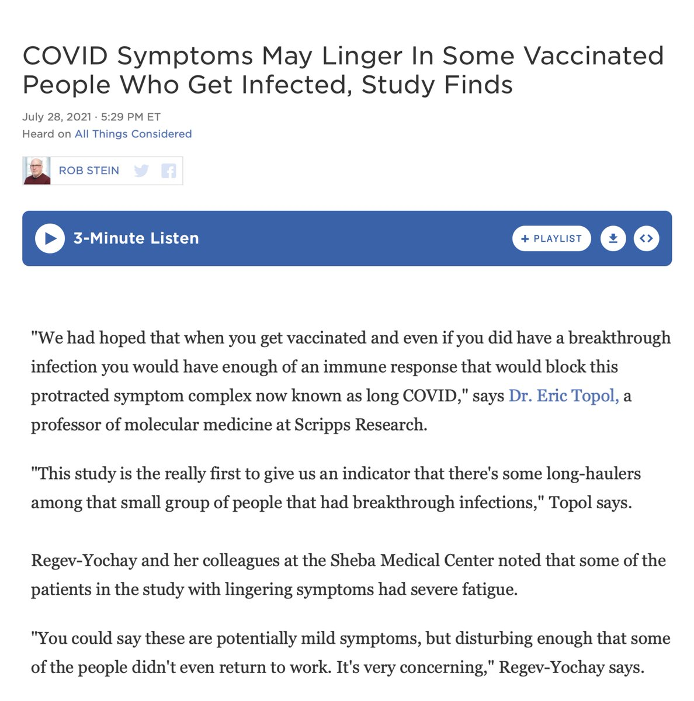</img></a>