+++
title = "Tweets by Eric Topol July 30"
Summary = ""
tags = ["Twitter"]
category = "Twitter"
+++

---

<a href="https://twitter.com/erictopol/status/1420920808629706758" target="_blank" rel="noreferer">01:34 UCT</a>

So much for the unpublished @CDCgov concerns about Delta and  lack of transparency.
https://www.nytimes.com/live/2021/07/29/world/covid-delta-variant-vaccine#the-cdcs-decision-on-masks-rests-on-new-data-showing-the-delta-variant-thrives-in-the-nose-and-throat
Unveiled full slide set @washingtonpost reinforces Delta's heightened contagiousness and ability for vaccinees to transmit
https://www.washingtonpost.com/health/2021/07/29/cdc-mask-guidance/ 

<a href="E7ge_V-UcAETYVB.png"  >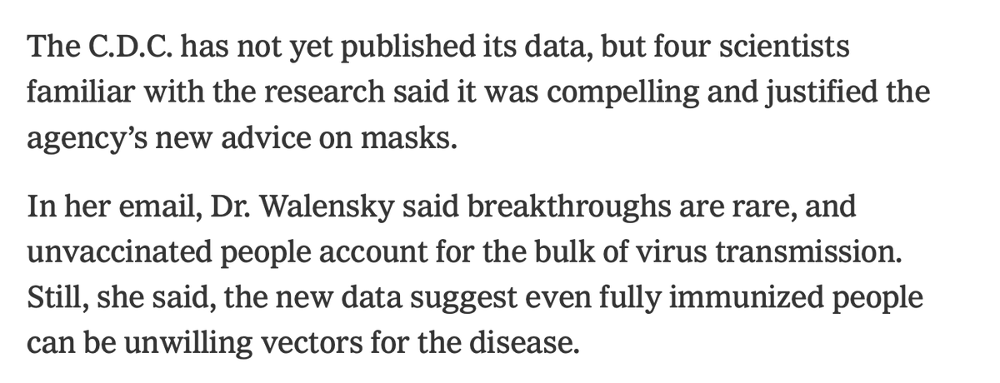</img></a><a href="E7gfm8vVoAYSvtH.jpg"  >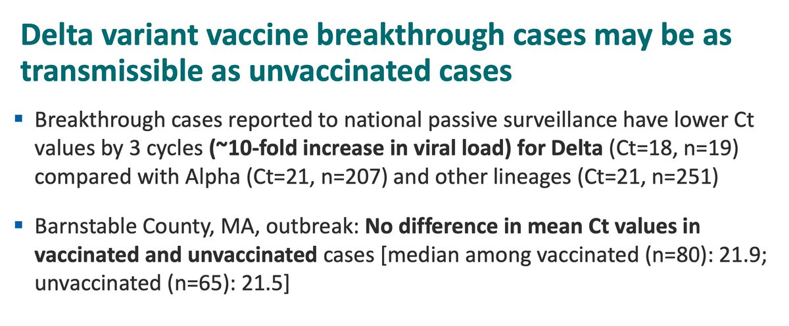</img></a>

---

<a href="https://twitter.com/erictopol/status/1420924193240064010" target="_blank" rel="noreferer">01:48 UCT</a>

The data presented are already published, do not include the new Israeli data for age &gt;60 decline in vaccine protection vs severe illness, and the issue of more severe disease is still unsettled due to confounders 

<a href="E7ghT2BVcAIxlPK.jpg"  >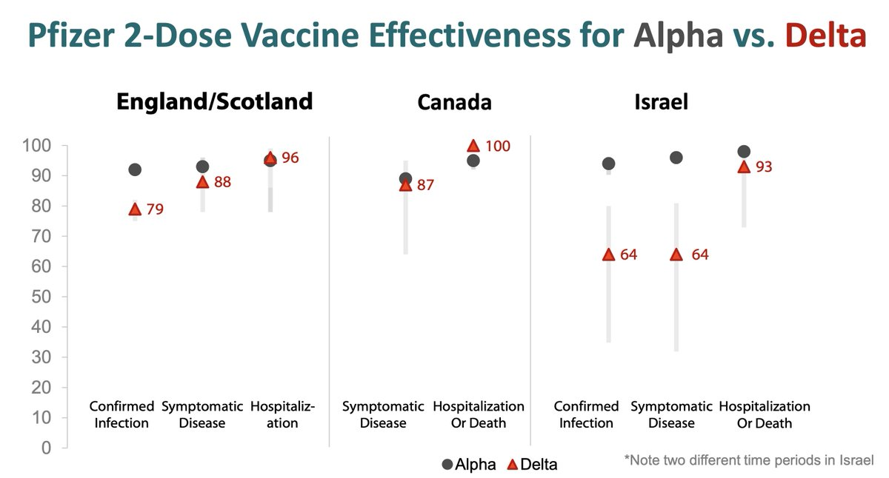</img></a><a href="E7ghVoXVoAUTkX-.jpg"  >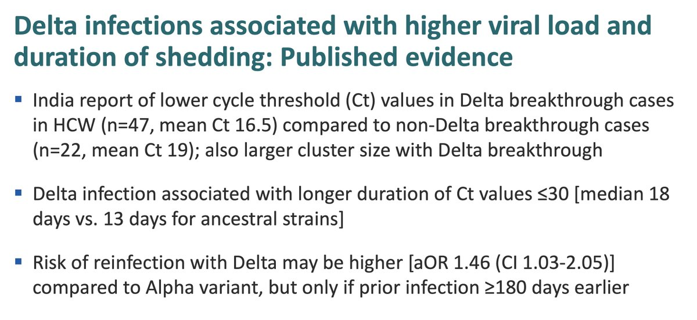</img></a><a href="E7ghXTFVoAA2xLE.jpg"  >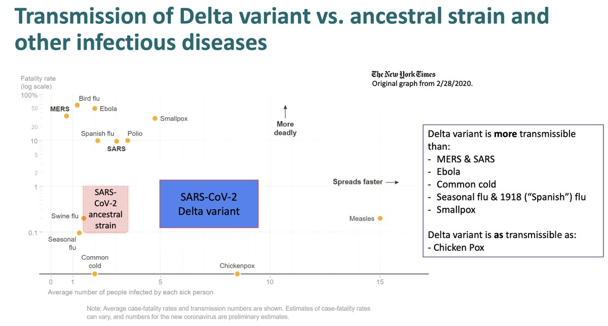</img></a><a href="E7giIDsVUBU5_Mp.jpg"  >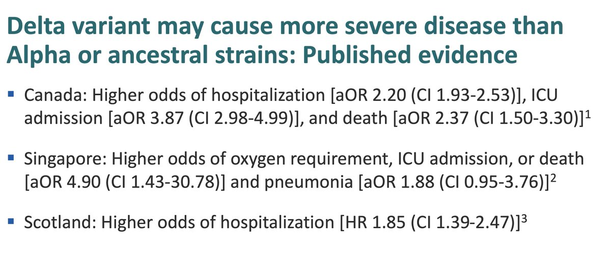</img></a>

---

<a href="https://twitter.com/erictopol/status/1420928478828847106" target="_blank" rel="noreferer">02:05 UCT</a>

RT @Atul_Gawande: Boy, do we need to see the actual data. https://twitter.com/EricTopol/status/1420779380654022659

---

<a href="https://twitter.com/erictopol/status/1420934644480954371" target="_blank" rel="noreferer">02:29 UCT</a>

Countering Delta
Sure 😷help, better fit &amp; quality even better
But how do you tell if a vaccinated person without symptoms is infected w/ Delta?
A rapid home antigen test. 
Free &amp; frequent testing is done in many countries
But not in the US; they're ignored, not a word about them

---

<a href="https://twitter.com/erictopol/status/1420943672367927299" target="_blank" rel="noreferer">03:05 UCT</a>

@_skiptothelou Yes, that's great, but they need to be done very frequently, like daily, to screen for infectiousness. These tests, while accurate, are not affordable for that goal

---

<a href="https://twitter.com/erictopol/status/1420948445020360711" target="_blank" rel="noreferer">03:24 UCT</a>

These observations should lead to acceleration of the universal coronavirus vaccine, based upon broad nAbs, that is eminently doable, but we're not giving it the priority. 
https://mobile.twitter.com/EricTopol/status/1382758611303100416

---

<a href="https://twitter.com/erictopol/status/1420950414908739584" target="_blank" rel="noreferer">03:32 UCT</a>

There are &gt; 50 companies making these, some were ready at scale in May 2020. Some are well validated (vs Ct) for *infectiousness*, which is what we want to know, not PCR +. Saliva or lower nasal. Every household who wants these should have a free and ample supply to test daily

---

<a href="https://twitter.com/erictopol/status/1420964034006814721" target="_blank" rel="noreferer">04:26 UCT</a>

We've known Delta's very high level of contagiousness, Ro of 5-8, for months. There is nothing new about that! https://twitter.com/EricTopol/status/1403725152357998600

---

<a href="https://twitter.com/erictopol/status/1420969982129704964" target="_blank" rel="noreferer">04:50 UCT</a>

This week the sense of urgency to take on Delta finally sunk in. https://twitter.com/EricTopol/status/1406257131565637632

---

<a href="https://twitter.com/erictopol/status/1420972776265973765" target="_blank" rel="noreferer">05:01 UCT</a>

@LogicAL91996674 You're going to do really well. Prior covid plus 1 dose mRNA vaxx leads to an even higher immune response than 2 vaccine doses

---

<a href="https://twitter.com/erictopol/status/1421099255465316363" target="_blank" rel="noreferer">13:23 UCT</a>

Here's the one from earlier this week @NatureMedicine which showed the impact for neutralization antibody and T cell response https://www.nature.com/articles/s41591-021-01464-w 

<a href="E7jBs5qVcAAeDF_.jpg"  ></img></a>

---

<a href="https://twitter.com/erictopol/status/1421099253691150340" target="_blank" rel="noreferer">13:23 UCT</a>

On the mix and match vaccine front, a 2nd new study shows a significantly better immune response for AZ then mRNA than either 2 AZ shots or 2 mRNA shots @TheLancetInfDis 
https://www.nature.com/articles/s41591-021-01464-w 

<a href="E7jCLv5VIAUm9Xi.jpg"  >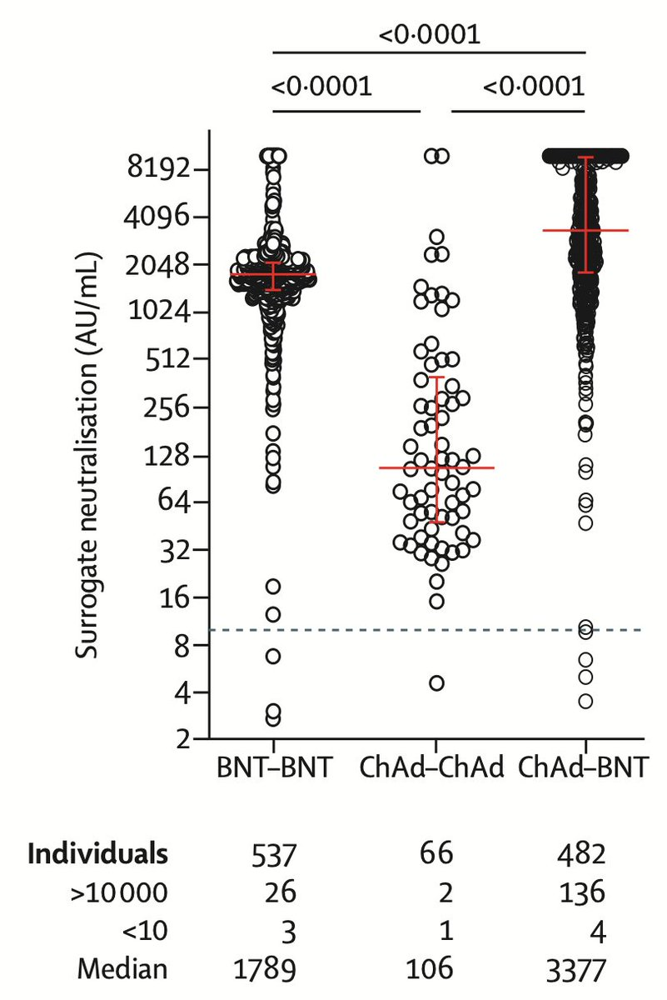</img></a>

---

<a href="https://twitter.com/erictopol/status/1421104827459805184" target="_blank" rel="noreferer">13:46 UCT</a>

The situation in Louisiana is dire.
Hospitalizations are on a similar trajectory. 

<a href="E7jHNJTVUAQPsCv.jpg"  >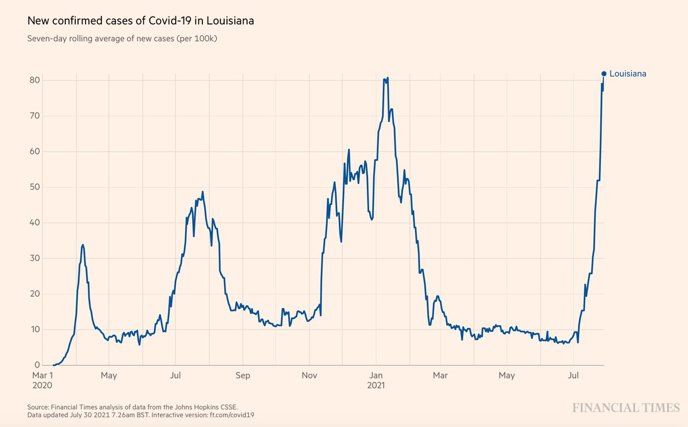</img></a>

---

<a href="https://twitter.com/erictopol/status/1421140593007161346" target="_blank" rel="noreferer">16:08 UCT</a>

More on nAbs @Nature 
https://www.nature.com/articles/d41586-021-02096-3

---

<a href="https://twitter.com/erictopol/status/1421154043422863360" target="_blank" rel="noreferer">17:01 UCT</a>

New @CDCMMWR on the Delta variant public gathering outbreak (incl "densely packed indoor events") in Barnstable Co involving 469 people, 74% among vaccinated, w/ similar viral load (Ct) as non-vaccinated. 
https://www.cdc.gov/mmwr/volumes/70/wr/mm7031e2.htm?s_cid=mm7031e2_w 

<a href="E7jxzUNVEAYNq7t.jpg"  >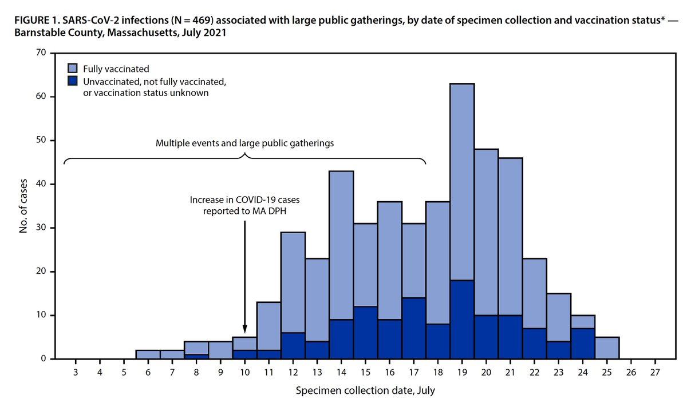</img></a><a href="E7jx1fuUUAMDPnW.jpg"  >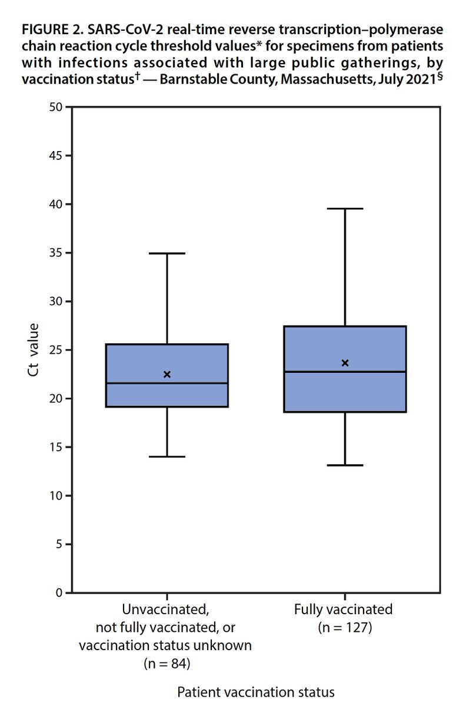</img></a>

---

<a href="https://twitter.com/erictopol/status/1421154047776616451" target="_blank" rel="noreferer">17:01 UCT</a>

Note: Only 4 fully vaccinated breakthrough infections were hospitalized (1.2%)
Some of these data were in the CDC slides WashPo last evening 

<a href="E7jz1zzVUAgaeIM.jpg"  >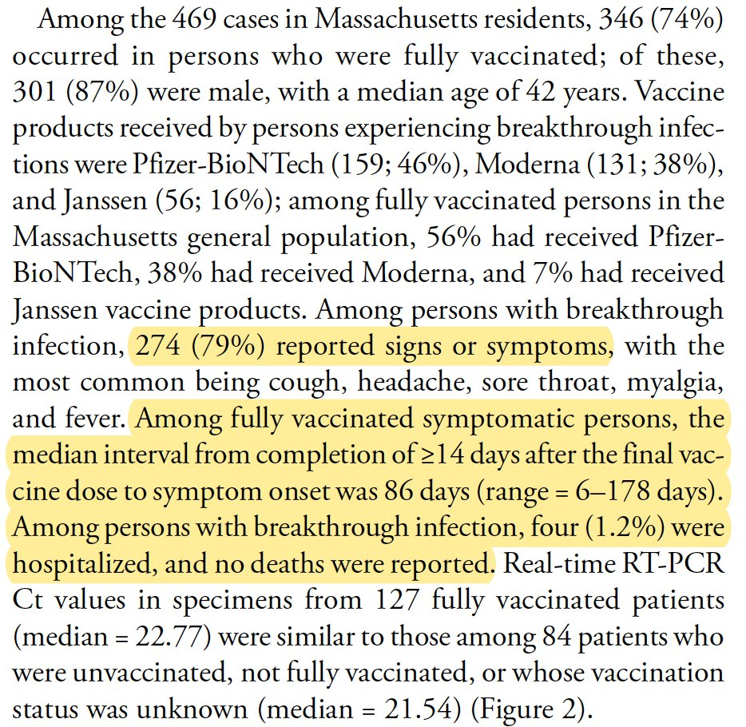</img></a>

---

<a href="https://twitter.com/erictopol/status/1421160668456050688" target="_blank" rel="noreferer">17:28 UCT</a>

This point has been lost. Yes, the Delta strain is more formidable, with much higher viral loads, and contagiousness, but breakthrough infections are still very uncommon. 
It's the unvaccinated (or prior covid) who are so highly vulnerable 

<a href="E7j5lyUUcAwvbVc.jpg"  >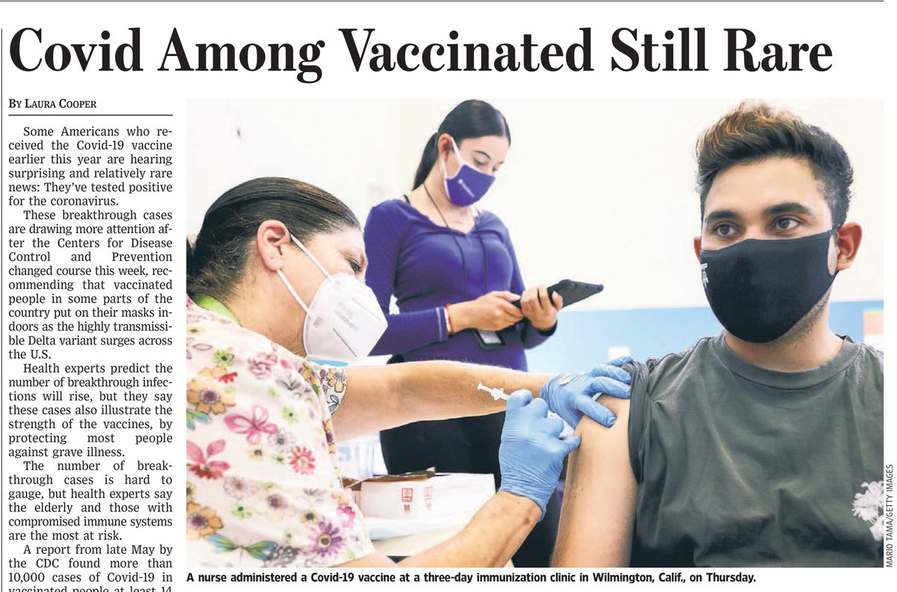</img></a>

---

<a href="https://twitter.com/erictopol/status/1421161887136313345" target="_blank" rel="noreferer">17:32 UCT</a>

Should be: or no prior covid
And there is much evidence for people with prior covid to get 1 shot (even better protection than 2 vaccines)

---

<a href="https://twitter.com/erictopol/status/1421164143785103365" target="_blank" rel="noreferer">17:41 UCT</a>

This very good @bmj_latest #LongCovid review complements Prof Dr. Alwan's perspective piece
https://www.bmj.com/content/374/bmj.n1648 

<a href="E7j9BQYVIAMrdF6.jpg"  >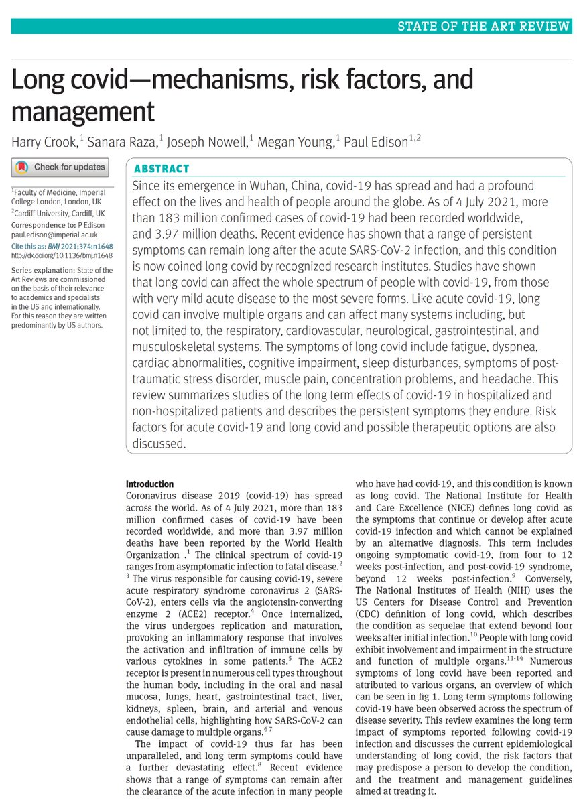</img></a><a href="E7j9CmhVIAg9IkQ.jpg"  >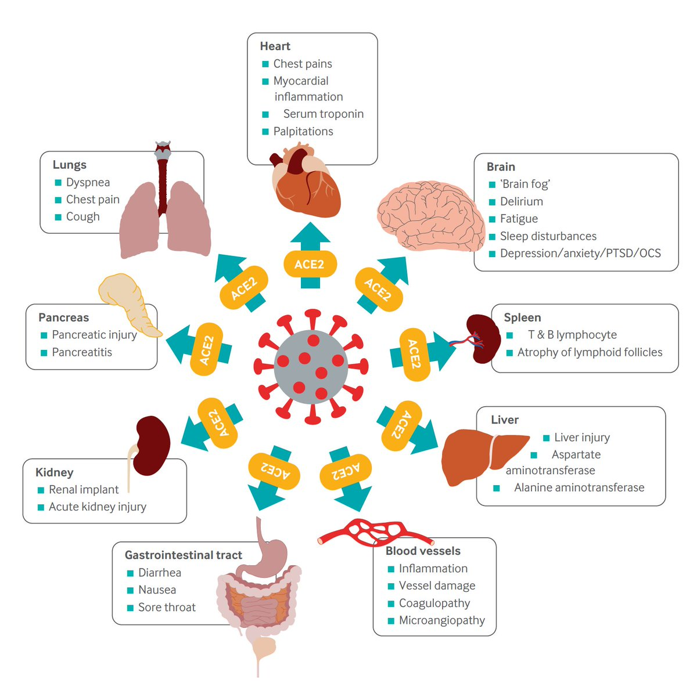</img></a><a href="E7j9EHqVgAIEqeP.jpg"  >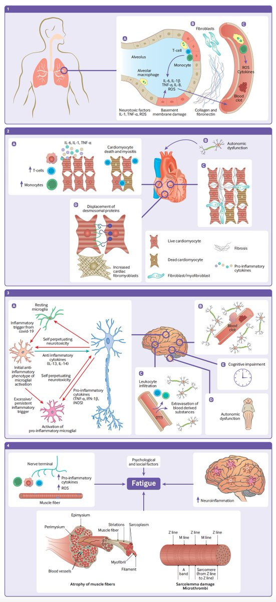</img></a><a href="E7j9Fz1UYAEg-IR.jpg"  >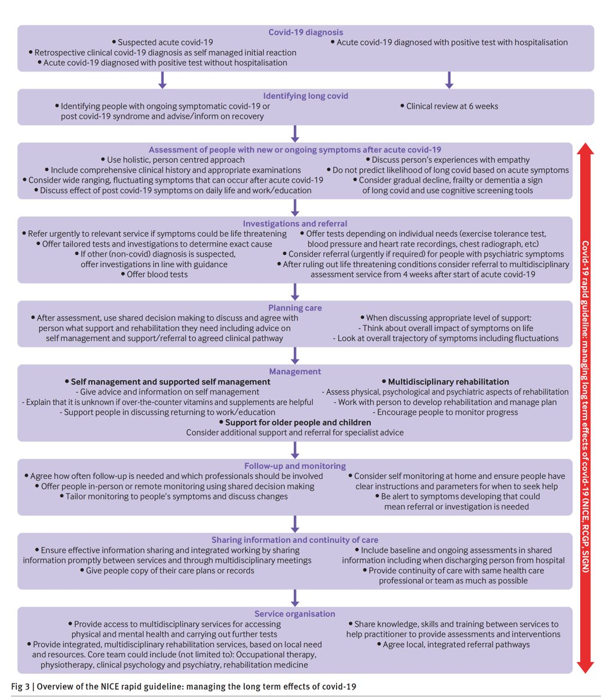</img></a>

---

<a href="https://twitter.com/erictopol/status/1421167922668400643" target="_blank" rel="noreferer">17:56 UCT</a>

What we knew in May is all of a sudden new news.
Yes, Delta is highly infectious.
BTW we have great ways to defend vs Delta.
💉💉 and 😷😷 

<a href="E7j_0x6UYAImxcw.jpg"  >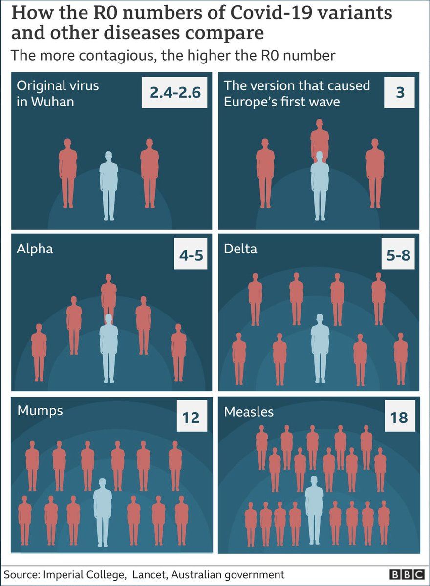</img></a>

---

<a href="https://twitter.com/erictopol/status/1421185965867954176" target="_blank" rel="noreferer">19:08 UCT</a>

PS There is nothing new here either 

<a href="E7kRBsQVcAAXQyZ.jpg"  >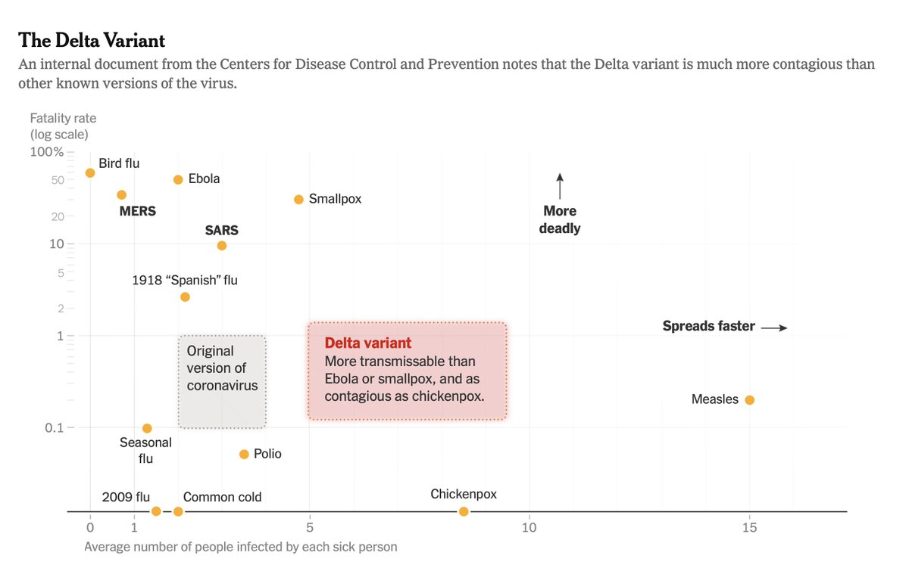</img></a>

---

<a href="https://twitter.com/erictopol/status/1421188503354830850" target="_blank" rel="noreferer">19:18 UCT</a>

The @US_FDA *finally* gets the message that its review for full approval of covid vaccines has to be THE priority (not among them) https://www.statnews.com/2021/07/30/fda-under-pressure-plans-sprint-to-accelerate-review-of-pfizers-covid-19-vaccine-for-full-approval/?utm_content=bufferb95c2&utm_medium=social&utm_source=twitter&utm_campaign=twitter_organic
@statnews @NicholasFlork 
I now expect it'll be done in next 4-6 weeks but should have been by June, before Delta dominance

---

<a href="https://twitter.com/erictopol/status/1421190468130328577" target="_blank" rel="noreferer">19:26 UCT</a>

The UK has a covid U-turn
The US has a mask U-turn
https://www.ft.com/content/b76e7d97-0a51-4000-a120-d94a233baf96 

<a href="E7kU8IlUcAQRZr4.jpg"  >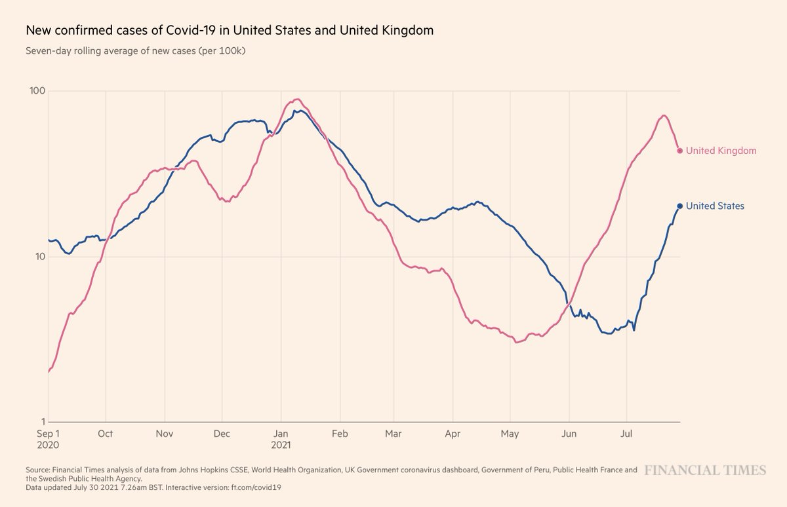</img></a><a href="E7kU-UmVUAExEWF.jpg"  >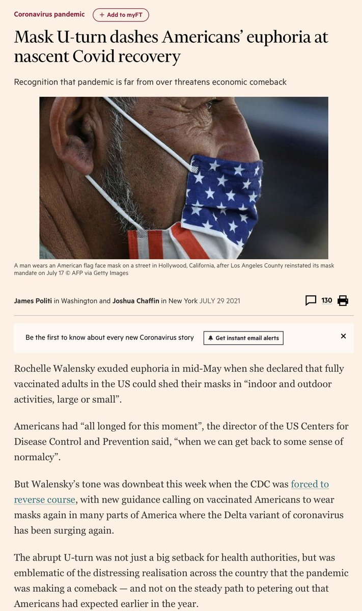</img></a>

---

<a href="https://twitter.com/erictopol/status/1421191724366323712" target="_blank" rel="noreferer">19:31 UCT</a>

@JeremyFarrar Agree, Jeremy.
And congratulations on your new book. And the great reviews
I love the title and cover and can't wait to get into it 

<a href="E7kWEUbVUAIOjFm.jpg"  >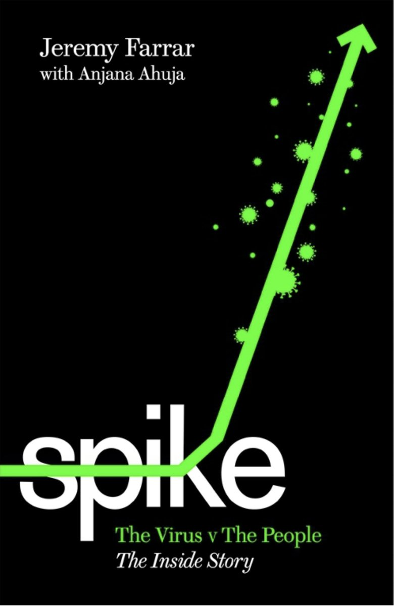</img></a><a href="E7kWLitVoAE11M1.jpg"  >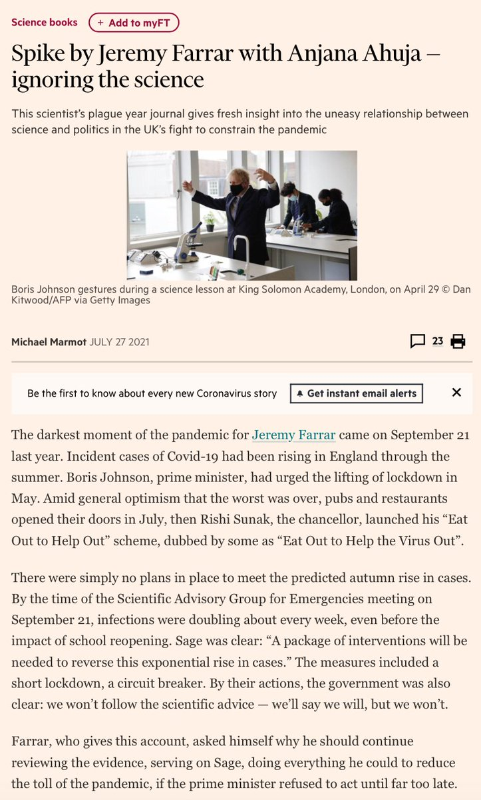</img></a>

---

<a href="https://twitter.com/erictopol/status/1421204708031549441" target="_blank" rel="noreferer">20:23 UCT</a>

One thing Delta and the hullabaloo has brought us: more US vaccinations. Biggest day all month with 560,000 newbies; 860,000 total. 
Finally about to reach the July 4th goal of 70% adults with ≥1 dose 

<a href="E7khd7HVEAElu_Q.jpg"  >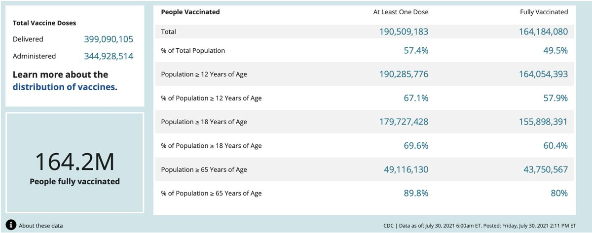</img></a>

---

<a href="https://twitter.com/erictopol/status/1421208637305810945" target="_blank" rel="noreferer">20:38 UCT</a>

While all covid vaccines offer some protection vs hospitalizations and deaths, they differ substantially vs symptomatic infections. This effect correlates w/ neutralizing antibodies, and is present w/ Delta
@meredithwadman explores this @ScienceMagazine 
https://www.sciencemag.org/news/2021/07/overlooked-superpower-mrna-vaccines 

<a href="E7kkqC6VIAILRf3.jpg"  >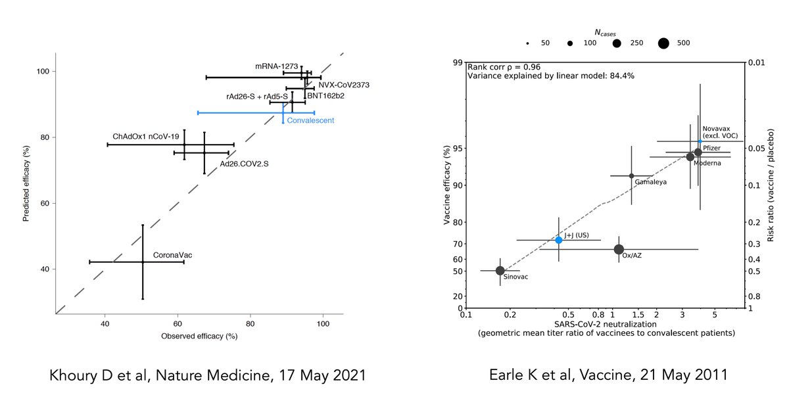</img></a><a href="E7klQ_FVEAIGMEI.jpg"  >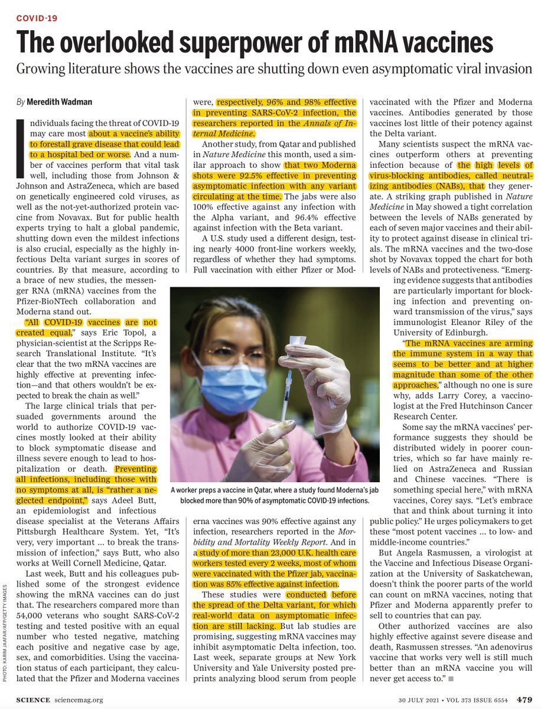</img></a>

---

<a href="https://twitter.com/erictopol/status/1421210388327141376" target="_blank" rel="noreferer">20:45 UCT</a>

Links to the 2 papers in the Figure, another Figure from there @NatureMedicine one below
https://mobile.twitter.com/EricTopol/status/1413925899443916800
And a thread on neutralizing Abs, a key driver
https://twitter.com/EricTopol/status/1420870547039158273 

<a href="E7km6R4UUAIft_e.jpg"  >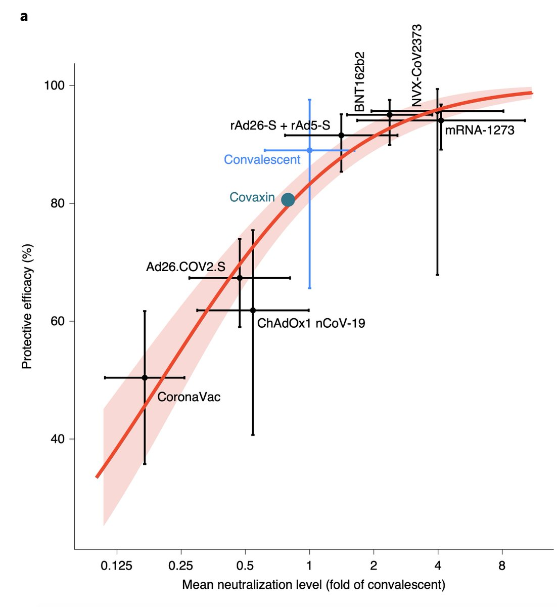</img></a>

---

<a href="https://twitter.com/erictopol/status/1421225604297334788" target="_blank" rel="noreferer">21:46 UCT</a>

But that's not necessarily stable. Some countries ahead of us are already showing signs of that.
So many things we can do, but are not doing, to reduce the hit and achieve containment and stability (will get to those later). 

<a href="E7k1D3GUYAQsaf2.jpg"  >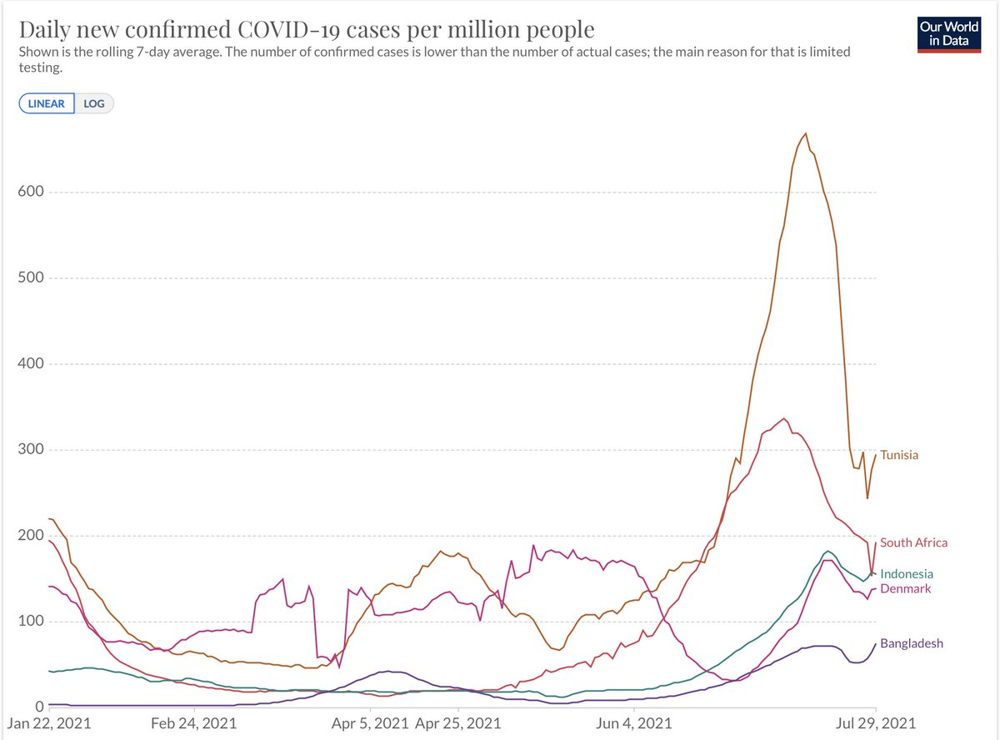</img></a>

---

<a href="https://twitter.com/erictopol/status/1421225602367987713" target="_blank" rel="noreferer">21:46 UCT</a>

We will get thru the US Delta wave in the weeks ahead
@OurWorldInData 

<a href="E7k1A8eVIAAbS92.jpg"  >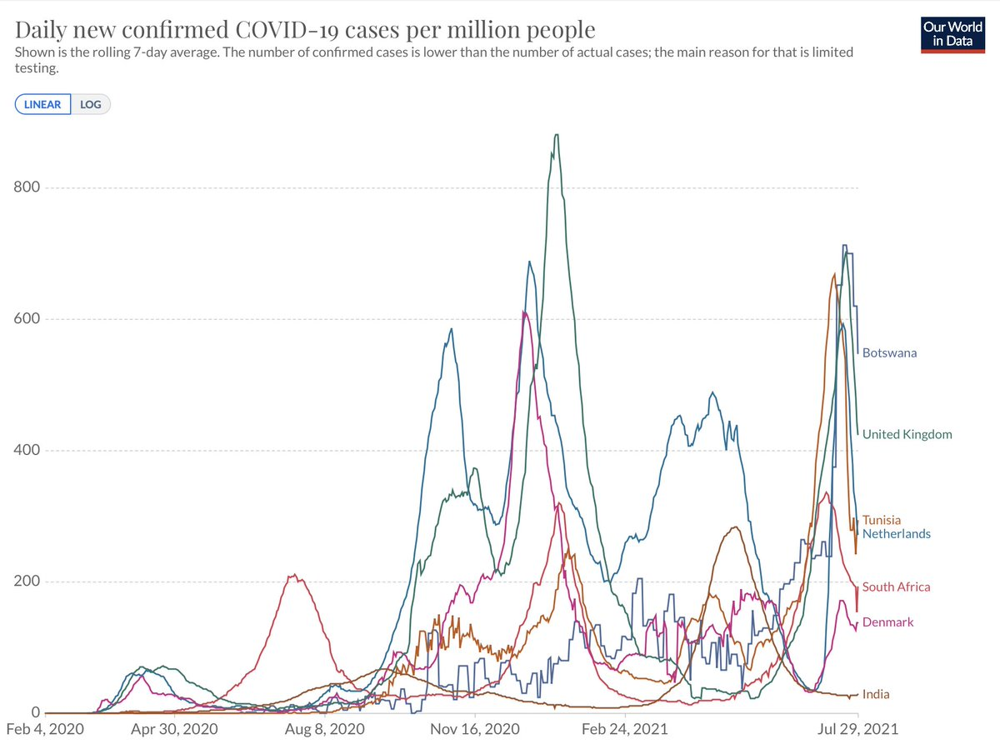</img></a>

---

<a href="https://twitter.com/erictopol/status/1421231902384529409" target="_blank" rel="noreferer">22:11 UCT</a>

Pattern recognition
https://covidactnow.org/?s=21201043 

<a href="E7k6136VIAUhlhu.jpg"  >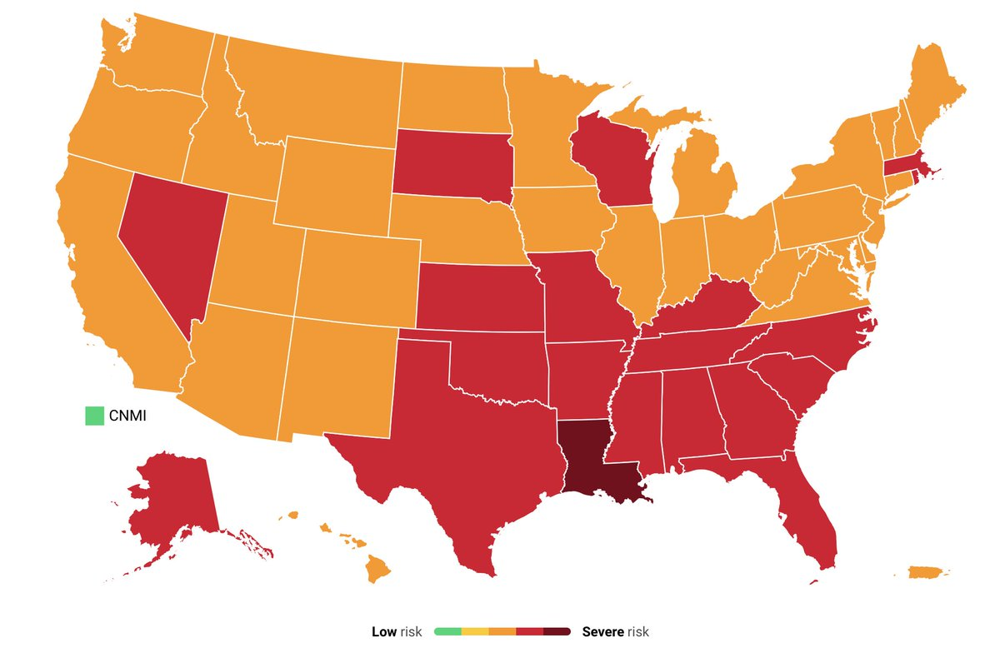</img></a>

---

<a href="https://twitter.com/erictopol/status/1421233328229806080" target="_blank" rel="noreferer">22:16 UCT</a>

Today there are 9,700 patients in Florida hospitals with covid, far exceeding this state's 2nd wave peak, and quickly heading to top its 1st wave (~12,000) 

<a href="E7k70ROVUAcS8YY.jpg"  >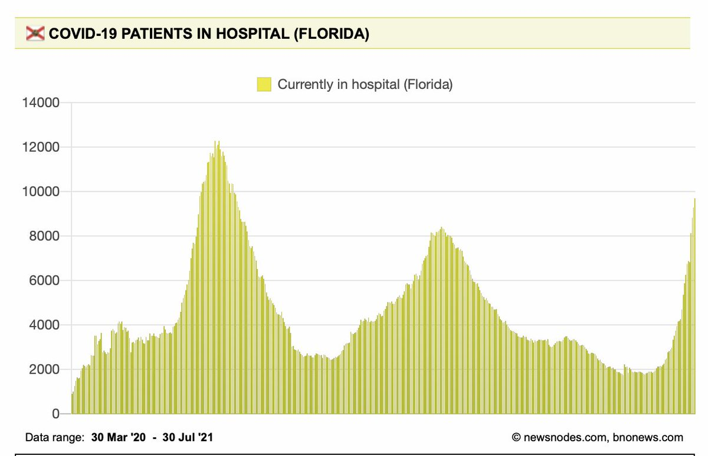</img></a>

---

<a href="https://twitter.com/erictopol/status/1421239658990608391" target="_blank" rel="noreferer">22:41 UCT</a>

Our covid times :-(
by @MatttDavies 

<a href="E7lB3CuVgAE5ntb.jpg"  ></img></a>

---

<a href="https://twitter.com/erictopol/status/1421249677760991233" target="_blank" rel="noreferer">23:21 UCT</a>

RT @CFCHudsonValley: @KittyKicksAss @EricTopol Ditto in Austria. My kid, a teacher there, was tested 1 weekly, as were the students. If you…

---

<a href="https://twitter.com/erictopol/status/1421249743263440897" target="_blank" rel="noreferer">23:21 UCT</a>

RT @KittyKicksAss: @EricTopol In Germany, people can get free tests once a week in town, many bars and restaurants have quick testing - fre…

