+++
title = "Tweets by Eric Topol July 31"
Summary = ""
tags = ["Twitter"]
category = "Twitter"
+++

---

<a href="https://twitter.com/erictopol/status/1421298609820106755" target="_blank" rel="noreferer">02:36 UCT</a>

Let’s do a little math about Delta breakthrough infections:
If 10% of fully vaccinated people got them, and we apply 1.2% getting hospitalized (Provincetown data, perhaps worst case scenario, superspreader event)
Then 99.88% of vaccinated would be protected from hospitalizations

---

<a href="https://twitter.com/erictopol/status/1421470078076284928" target="_blank" rel="noreferer">13:57 UCT</a>

How #SARSCoV2 mutates and what's in store for future variants
"We’ve been humbled by this virus before and no one can predict confidently what will happen in the future.” 
—@pathogenomenick 
https://www.ft.com/content/f6a72bbb-e247-4cc3-b53b-e189795149fb by @clivecookson and @ian_bott_artist 

<a href="E7oTZ41VkAI76iV.jpg"  >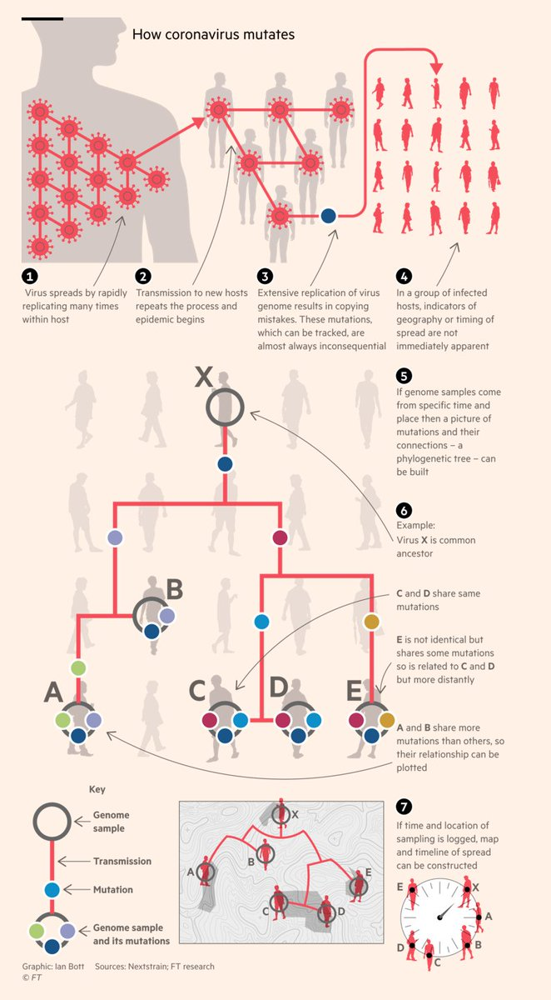</img></a>

---

<a href="https://twitter.com/erictopol/status/1421474782902558723" target="_blank" rel="noreferer">14:16 UCT</a>

A classic Eureka quote, an Aha moment at FDA 
"If all this does is get five to 10 million more people vaccinations down south, that will save lives.”

---

<a href="https://twitter.com/erictopol/status/1421474780797018114" target="_blank" rel="noreferer">14:16 UCT</a>

Now that the Delta variant accounts for 94% of our infections and is ravaging unvaccinated people in many parts of the US, the @US_FDA decides to put "all hands on deck" to expedite full vaccine approval
https://www.washingtonpost.com/health/2021/07/30/fda-vaccine-full-approval/ by @lauriemcginley2 

<a href="E7oVwLrVEAEBRRO.jpg"  >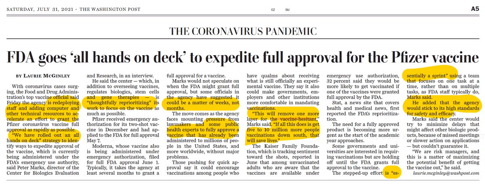</img></a>

---

<a href="https://twitter.com/erictopol/status/1421477375699656709" target="_blank" rel="noreferer">14:26 UCT</a>

Delta's Ro is ~6, meaning an average infected, unvaccinated person, unprotected by prior infection or distancing measures, would pass it on to 6 others 
That's bad enough, don't make it worse:
@CNN keeps saying it's 9.
@CDCgov compared it to chickenpox, which has a Ro of 10-12 

<a href="E7oZugWVUAQxQk7.jpg"  ></img></a>

---

<a href="https://twitter.com/erictopol/status/1421490998035685376" target="_blank" rel="noreferer">15:20 UCT</a>

The 4th wave in Louisiana, the worst spread yet, now 90 cases/100,000 residents and still close to a vertical rise 

<a href="E7ol9EWVUAoOksY.jpg"  >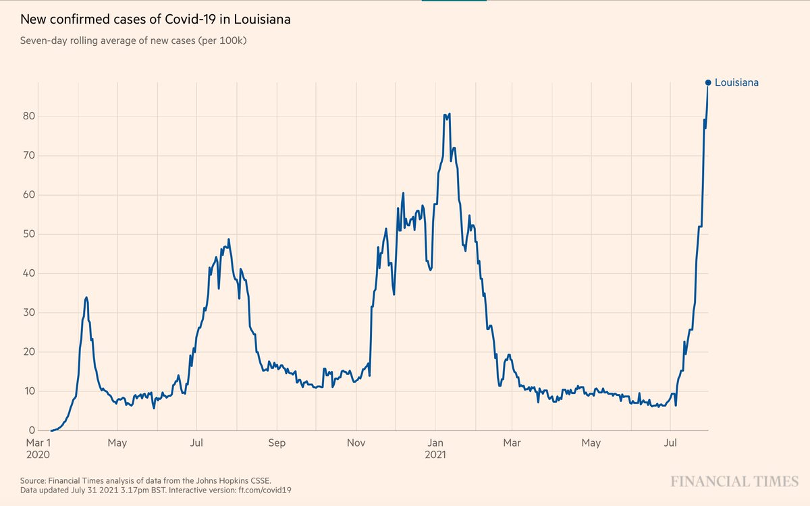</img></a>

---

<a href="https://twitter.com/erictopol/status/1421491569346039808" target="_blank" rel="noreferer">15:22 UCT</a>

Now do hospitalizations 
For the #casedemics who still don't get it 

<a href="E7om_UYVUAYV4Lc.jpg"  >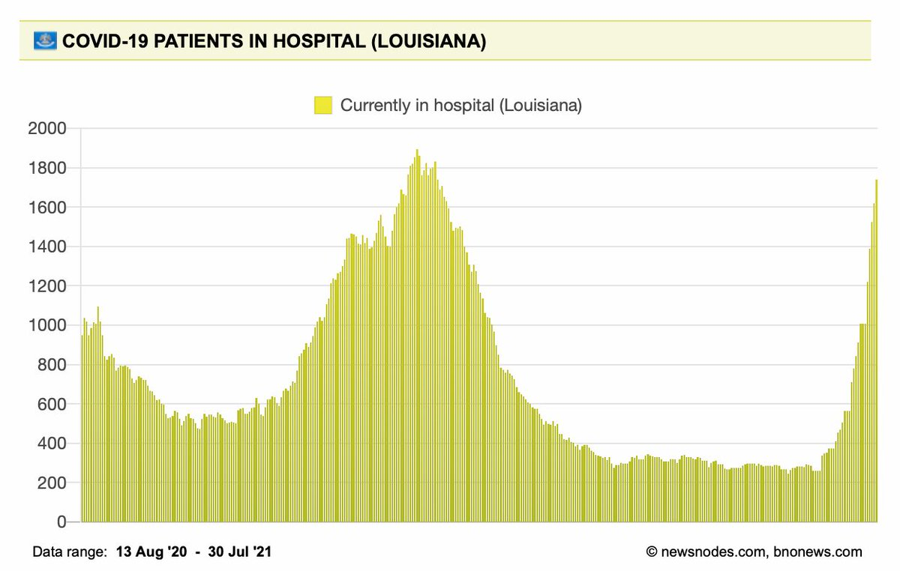</img></a>

---

<a href="https://twitter.com/erictopol/status/1421493183821668364" target="_blank" rel="noreferer">15:29 UCT</a>

How sickening to know that so much of this was eminently preventable

---

<a href="https://twitter.com/erictopol/status/1421495933682937856" target="_blank" rel="noreferer">15:40 UCT</a>

@charlesornstein It’s similar to Michigan and the Alpha variant with marked heterogeneity between states/regions with similar vaccination rates at the time. Explanation unclear but local over-dispersion events as a driver has been suggested

---

<a href="https://twitter.com/erictopol/status/1421499504486883330" target="_blank" rel="noreferer">15:54 UCT</a>

Pretty damn impressive
Thanks Darren Lu @Reddit 

<a href="E7otfnqUYAMSKuG.jpg"  >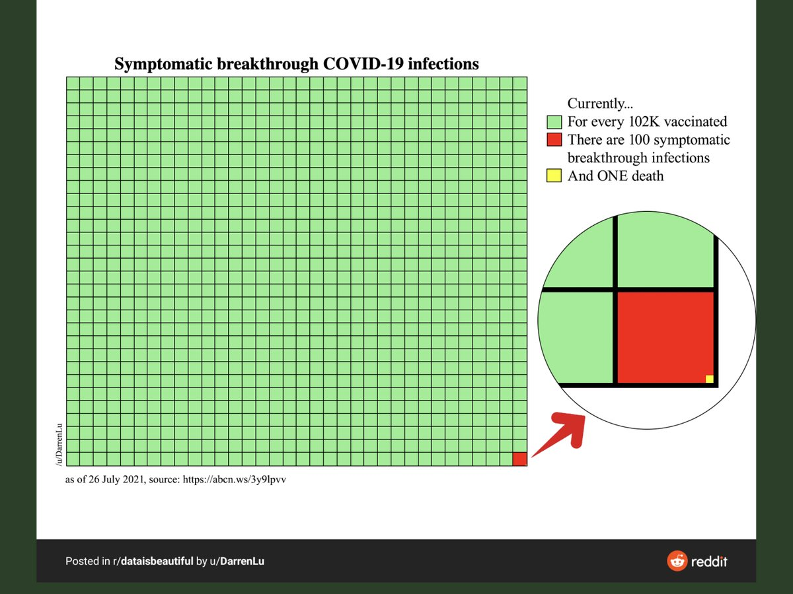</img></a>

---

<a href="https://twitter.com/erictopol/status/1421516206691913734" target="_blank" rel="noreferer">17:00 UCT</a>

More good news in the UK
https://www.wsj.com/amp/articles/u-k-s-delta-variant-wave-appears-to-ebb-offering-hope-covid-19-is-in-retreat-11627650457
https://twitter.com/Birdyword/status/1421128959090208769 

<a href="E7o8a8YVIAA8zUd.jpg"  >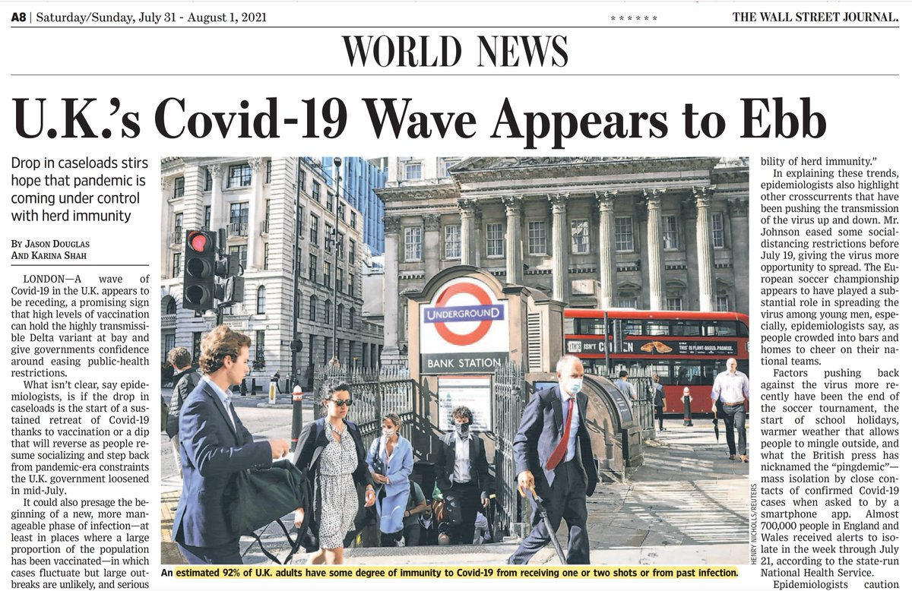</img></a><a href="E7o8c6dVoAEYI3m.jpg"  >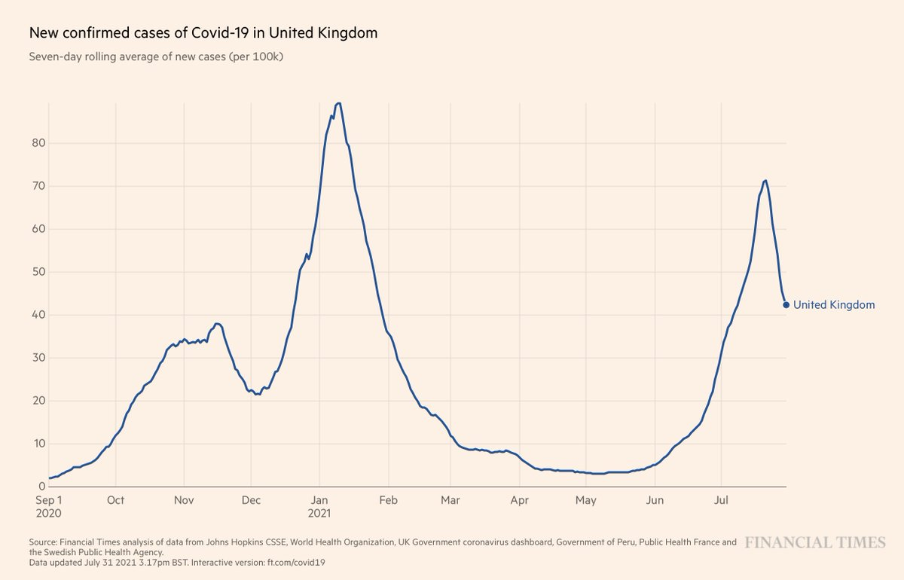</img></a>

---

<a href="https://twitter.com/erictopol/status/1421519569647136771" target="_blank" rel="noreferer">17:14 UCT</a>

After a covid infection, antibodies evolve, exposed to viral proteins that can persist in the gut for months, and some are more potent, better equipped to take on major variants and even neutralize other sarbecoviruses
New @ImmunityCP https://www.cell.com/immunity/fulltext/S1074-7613(21)00294-6 

<a href="E7o_F0oUYAQvpeL.jpg"  >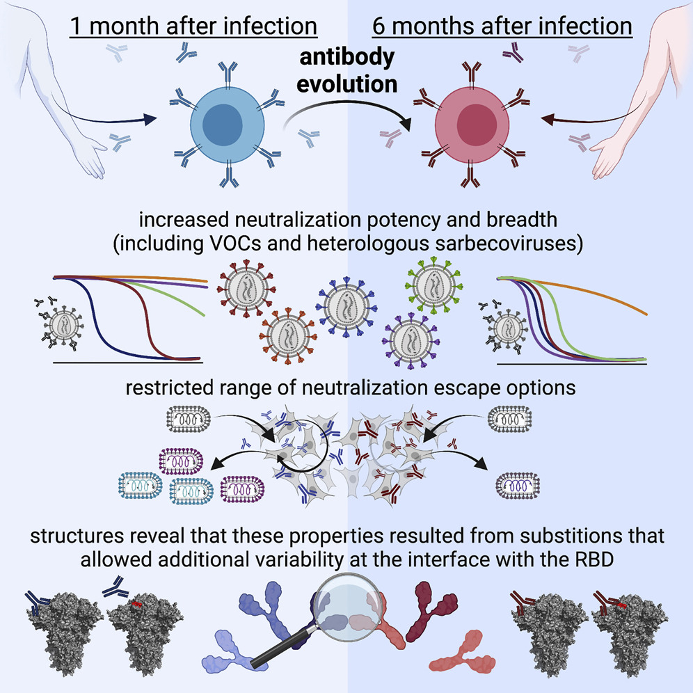</img></a>

---

<a href="https://twitter.com/erictopol/status/1421521703939678212" target="_blank" rel="noreferer">17:22 UCT</a>

Elegant work by @FraukeMuecksch @PaulBieniasz
@NussenzweigL @Rockefeller @bjorkmanlab @Caltech and colleagues with implications for vaccination schedules 

<a href="E7pCZGbVkAkqBPQ.jpg"  >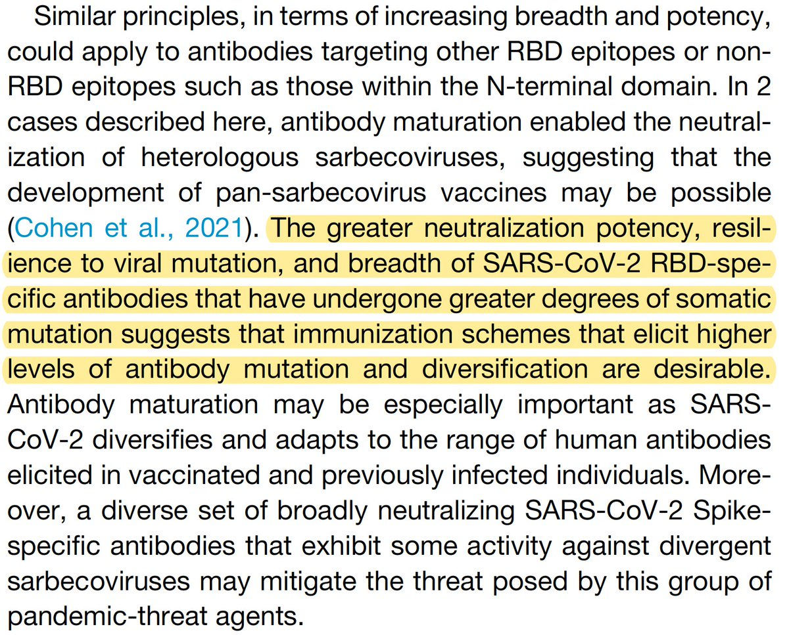</img></a>

---

<a href="https://twitter.com/erictopol/status/1421526589766979586" target="_blank" rel="noreferer">17:42 UCT</a>

When post-vaccination Delta breakthrough infections do occur, they are much shorter in duration (and less potential for spread) than in unvaccinated people. 
https://www.medrxiv.org/content/10.1101/2021.07.28.21261295v1 preprint today 

<a href="E7pGwKdVIAAgih0.jpg"  >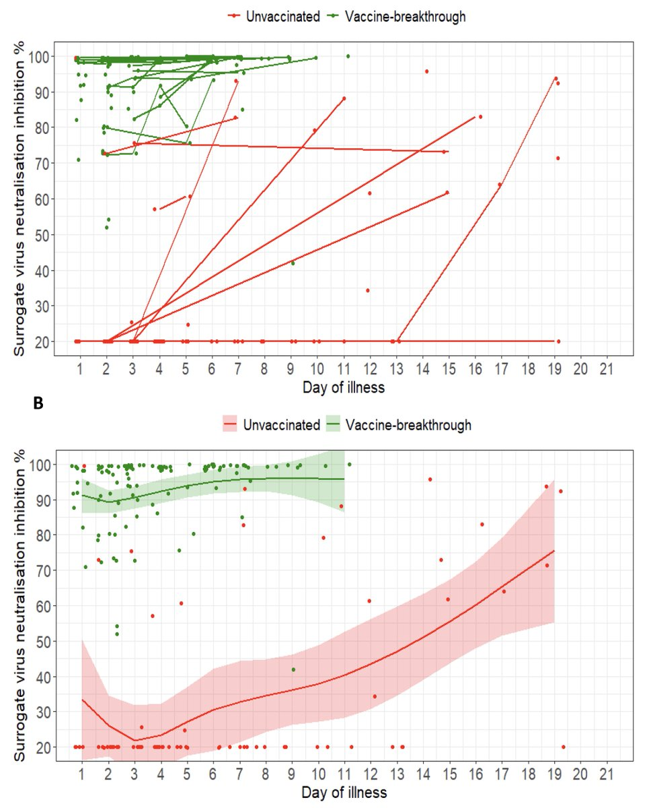</img></a>

---

<a href="https://twitter.com/erictopol/status/1421534095155154944" target="_blank" rel="noreferer">18:11 UCT</a>

One of my favorite mathematicians, @FryRsquared, is profiled @FT. It's rich, but one essential point is the importance of log-plots to understand the pandemic and exponential growth https://www.ft.com/content/a5e33e5a-99b9-4bbc-948f-8a527c7675c3 by @johnthornhillft 

<a href="E7pNVhnVcAcsxQu.jpg"  >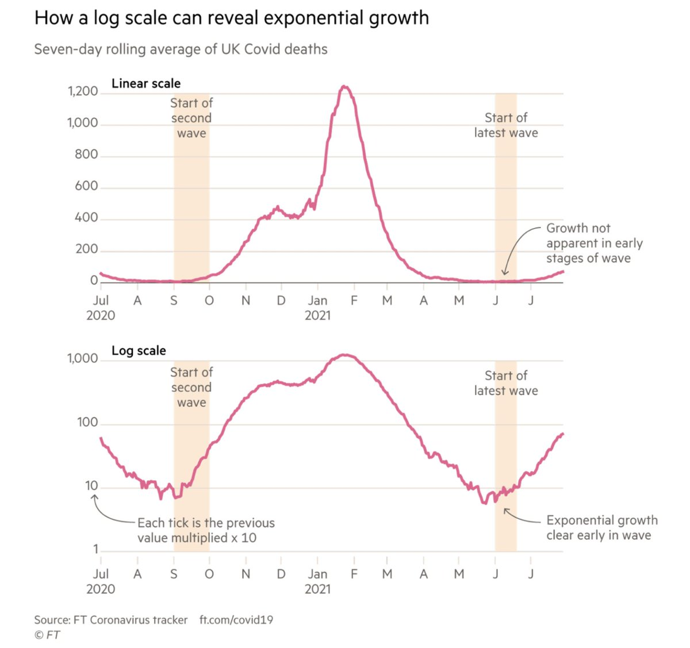</img></a><a href="E7pNXPzUUAIpTTY.jpg"  >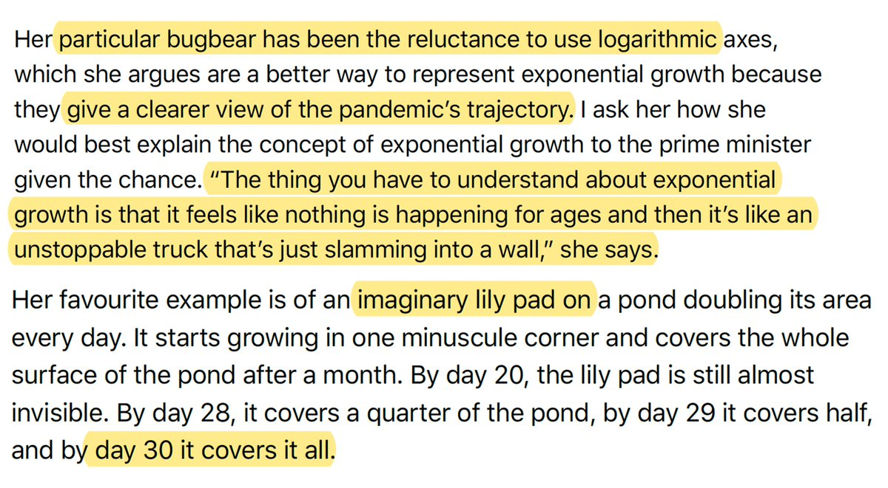</img></a>

---

<a href="https://twitter.com/erictopol/status/1421541130433269762" target="_blank" rel="noreferer">18:39 UCT</a>

Not the best week for #AI  ;-)
@mims https://www.wsj.com/articles/why-artificial-intelligence-isnt-intelligent-11627704050?mod=searchresults_pos1&page=1 @WSJTech 

@strwbilly 
https://www.technologyreview.com/2021/07/30/1030329/machine-learning-ai-failed-covid-hospital-diagnosis-pandemic/
@techreview 

@FrankPasquale @JcMalgieri https://www.nytimes.com/2021/07/30/opinion/artificial-intelligence-european-union.html?action=click&module=Opinion&pgtype=Homepage
@nytopinion 

@ShinjiniKundu 
https://www.nature.com/articles/s41591-021-01461-z @NatureMedicine 

<a href="E7pSSxrUcAE4kSw.jpg"  ></img></a>

---

<a href="https://twitter.com/erictopol/status/1421550606347489283" target="_blank" rel="noreferer">19:17 UCT</a>

The unvaccinated here
https://old.reddit.com/r/dataisbeautiful/comments/osqt5c/oc_covid19_infections_serious_unvaccinated_vs/
For every 102,000 people unvaxxed, 1,603 hospitalizations and 417 deaths 
H/T @GrowlingM1ke 

<a href="E7paezWUcAAar2f.jpg"  >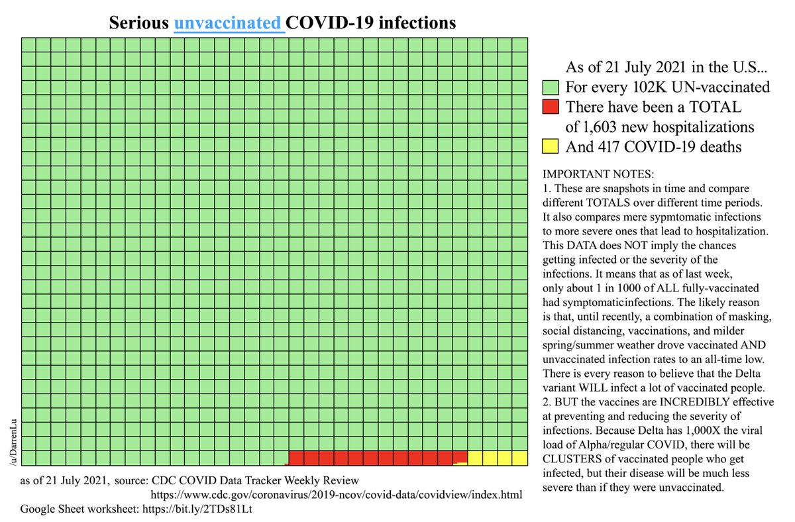</img></a>

---

<a href="https://twitter.com/erictopol/status/1421556585004814338" target="_blank" rel="noreferer">19:41 UCT</a>

Delta in the United States
High vaccination counties: deaths are decreasing, some case growth to 15/100K 
Low vaccination counties: deaths are increasing, cases approaching 40/100K residents
https://www.nytimes.com/interactive/2021/07/31/us/covid-delta-cases-deaths.html?action=click&module=Spotlight&pgtype=Homepage 
by @LaurenLeatherby 

<a href="E7phTe7UcAIkx1R.jpg"  >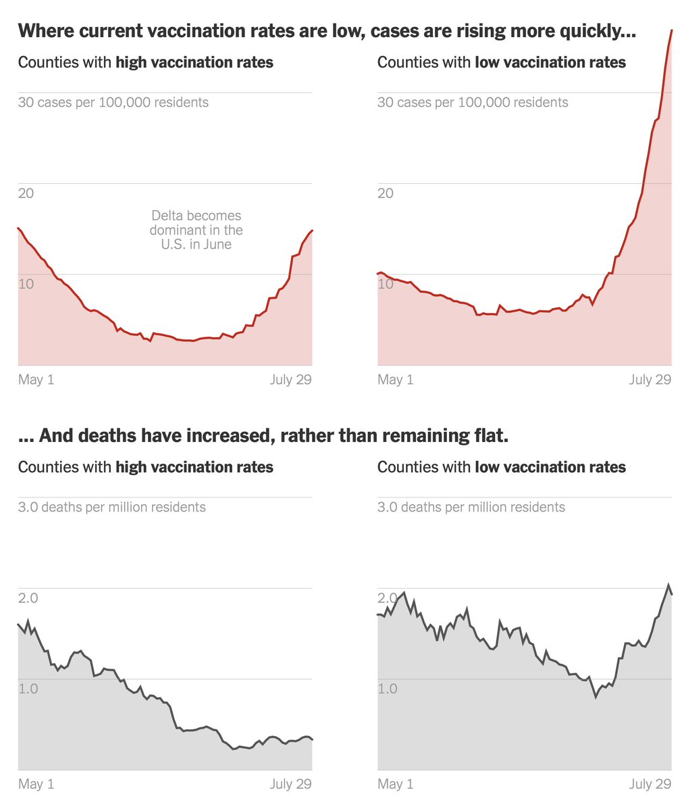</img></a>

---

<a href="https://twitter.com/erictopol/status/1421571826883252224" target="_blank" rel="noreferer">20:41 UCT</a>

Striking, maintained parallelism for these 3 countries for impact of Delta on case growth.
Not so for related deaths, which are far lower than prior waves in each country, but even more so in Israel 

<a href="E7pvruNVkAMFnqM.jpg"  >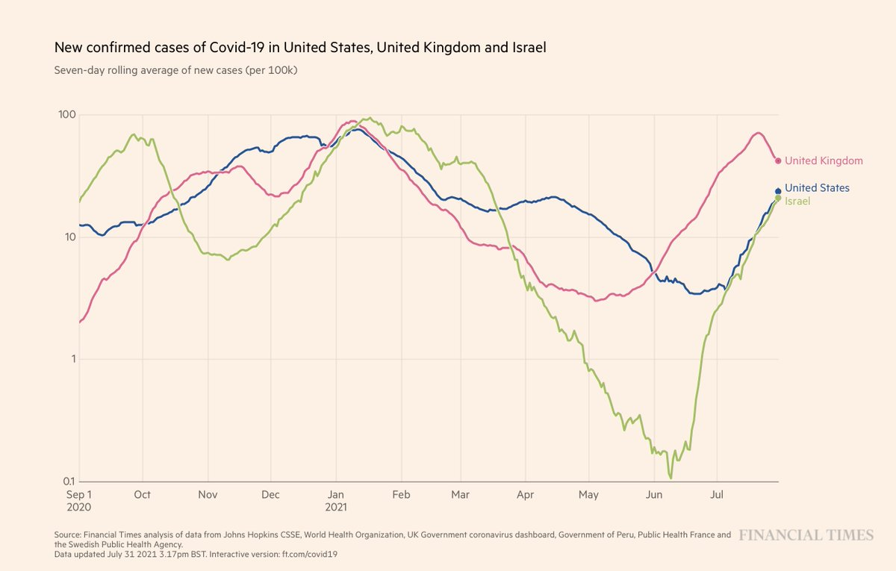</img></a><a href="E7pv95xVEAIlPJG.jpg"  >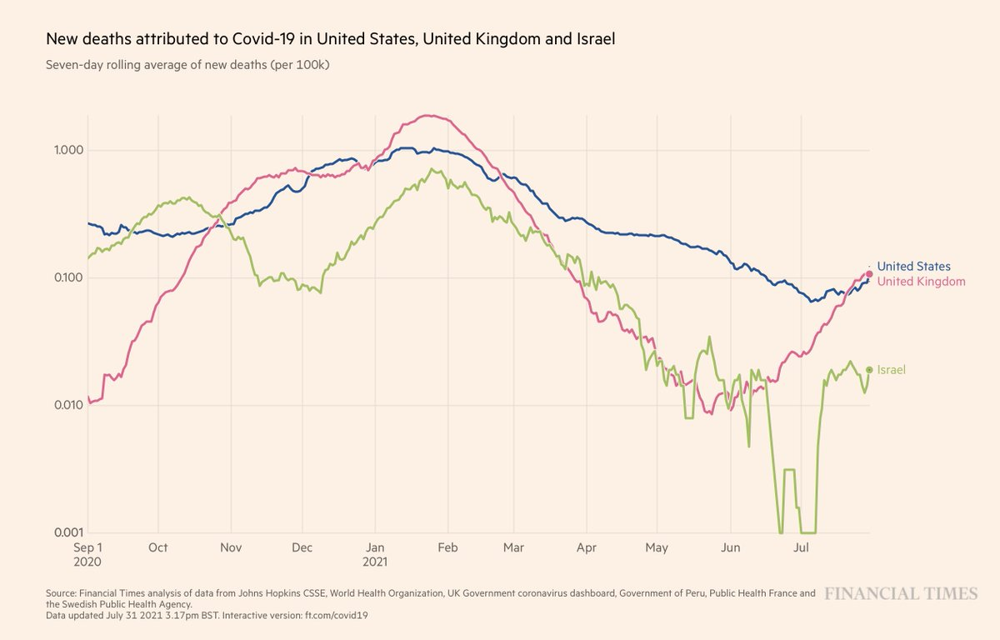</img></a>

---

<a href="https://twitter.com/erictopol/status/1421578126383935488" target="_blank" rel="noreferer">21:06 UCT</a>

Progressive worsening situation in Florida, a 20/10 day:
Over 21,600 new cases
Over 10,000 hospitalized patients,  nearly 500 added today and Table for last 4 days of reporting (unaggregated)  https://twitter.com/EricTopol/status/1421233328229806080

<a href="E7pzTsJUcAE9ggs.jpg"  >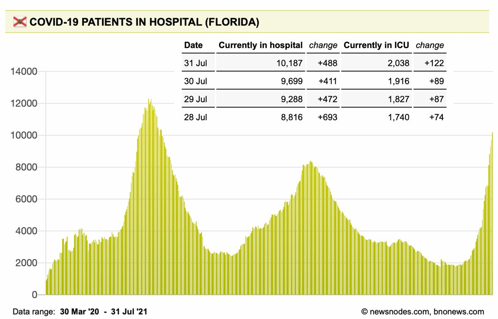</img></a>

---

<a href="https://twitter.com/erictopol/status/1421593304529969155" target="_blank" rel="noreferer">22:07 UCT</a>

With the possible exception of Fiji,  Louisiana presently has a higher case per capita rate that's still rising, compared with any country in the world http://outbreak.info 

<a href="E7qDgiOVkAIy977.jpg"  >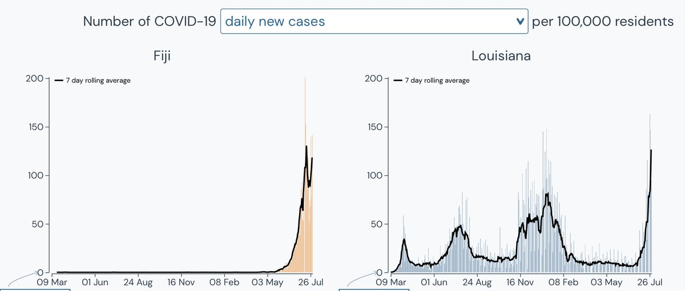</img></a>