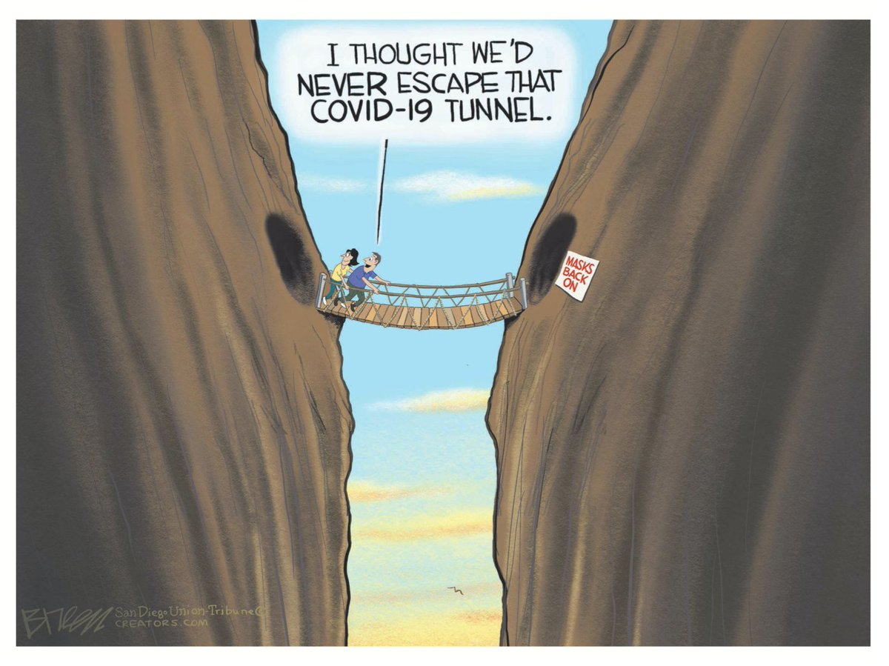
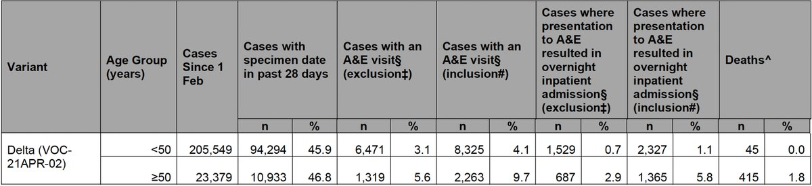
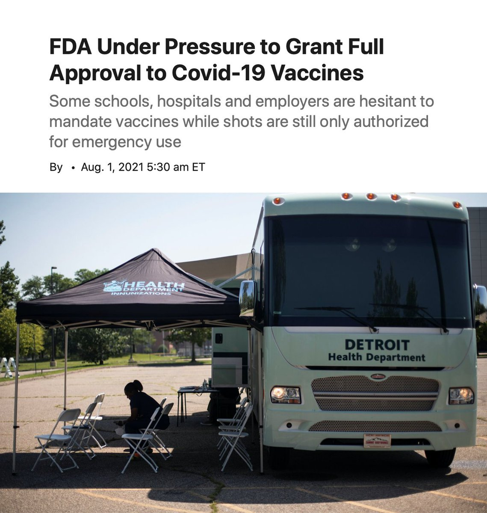
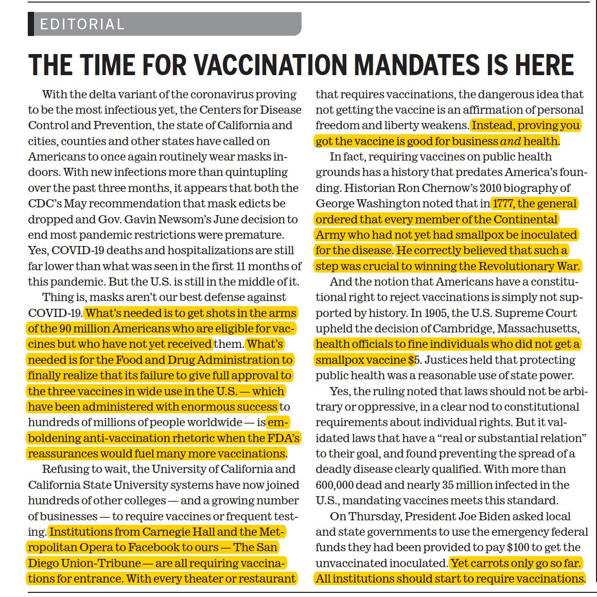
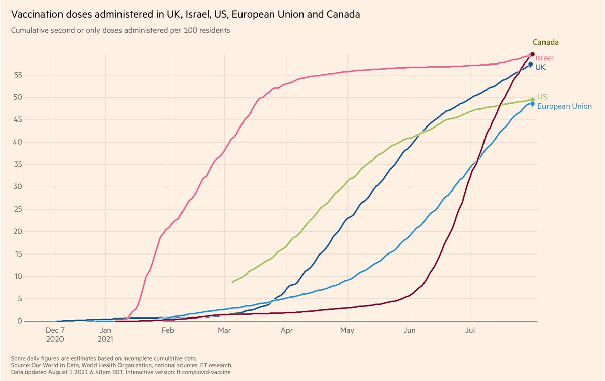
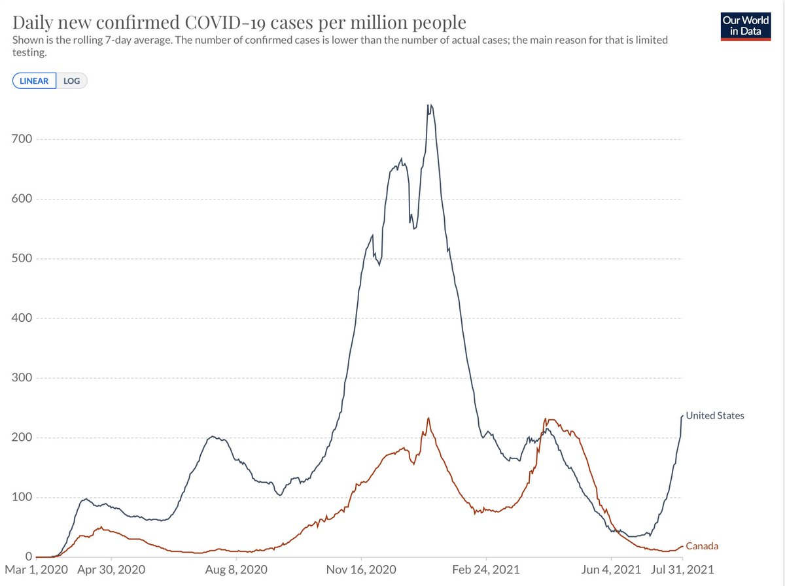
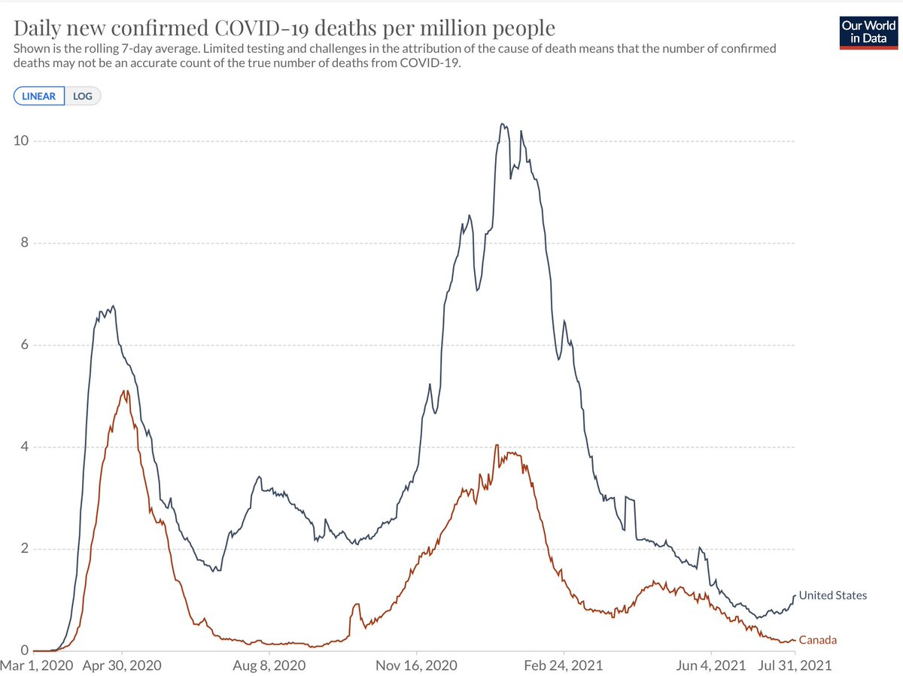
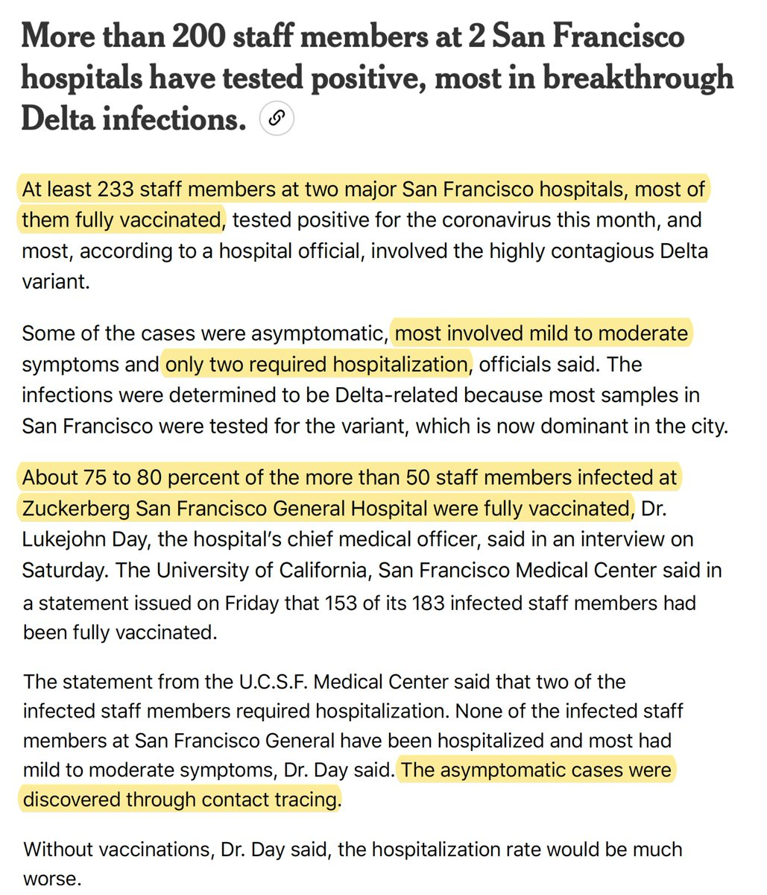
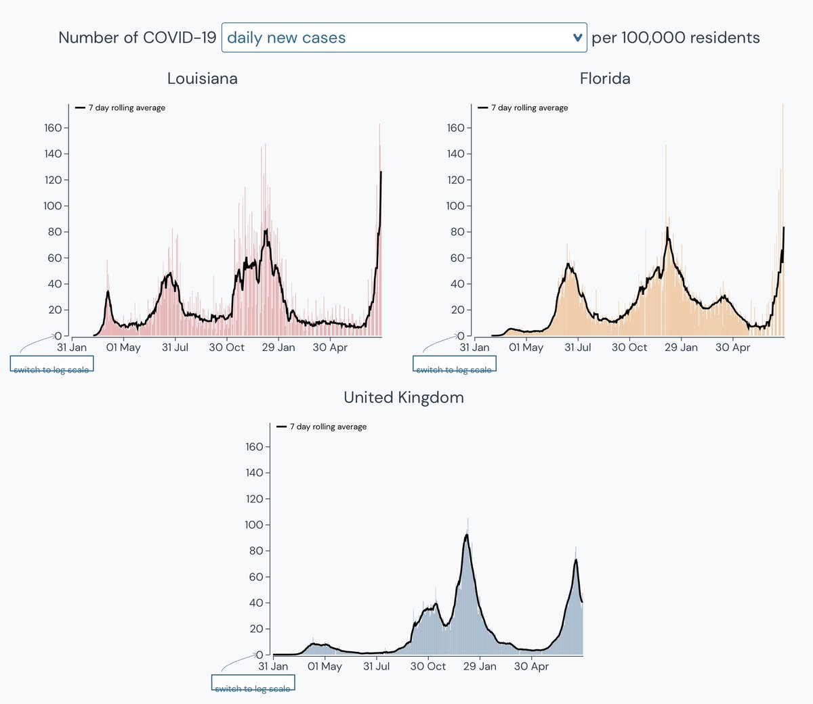

+++
title = "Tweets by Eric Topol Aug 01"
Summary = ""
tags = ["Twitter"]
category = "Twitter"
+++

---

<a href="https://twitter.com/erictopol/status/1421834255127093249" target="_blank" rel="noreferer">14:04 UCT</a>

Our covid times
by @sdutBreen @sdut 

<a href="E7teo1NVcA413pv.jpg"  ></img></a>

---

<a href="https://twitter.com/erictopol/status/1421841172767465474" target="_blank" rel="noreferer">14:32 UCT</a>

How to build a Delta immunity wall.
The state with lowest rate of hospitalizations in the US Delta wave is the one with the highest vaccination (67% of 650,000 population).  
3 covid patients in the whole state of Vermont, 1 in ICU, past 2 weeks here 

<a href="E7tjNMnVgAEbC32.png"  ></img></a>

---

<a href="https://twitter.com/erictopol/status/1421853582916132865" target="_blank" rel="noreferer">15:21 UCT</a>

How do hospitalizations compare for Delta infections without vaccination?
Instead of 1.2/1000 above, if we use most recent @PHE_uk data, 16/1000 overall (&gt;10X)
11/1000 for age &lt;50
58/1000 for age ≥50
https://assets.publishing.service.gov.uk/government/uploads/system/uploads/attachment_data/file/1005517/Technical_Briefing_19.pdf (approximates, d/t small admixture w/ breakthroughs) 

<a href="E7tvVoMUYAQ7yoz.jpg"  ></img></a>

---

<a href="https://twitter.com/erictopol/status/1421857292874440705" target="_blank" rel="noreferer">15:36 UCT</a>

@ScottGottliebMD These data are highly encouraging, Scott, but they don’t reflect or partition Delta, with a clearcut higher breakthrough infection liability. The CDC’s May 1st decision to stop tracking breakthroughs, unless hospitalized, was a significant misstep

---

<a href="https://twitter.com/erictopol/status/1421868708817903616" target="_blank" rel="noreferer">16:21 UCT</a>

Where was the pressure months ago?
The mandates have been proceeding despite FDA's lack of full approval, but would have occurred sooner and been more widespread had that review been completed
https://www.wsj.com/articles/fda-under-pressure-to-grant-full-approval-to-covid-19-vaccines-11627810202?mod=hp_lead_pos10 by @felschwartz  and @sdut editorial today 

<a href="E7t9GQMVIAc9Sac.jpg"  ></img></a><a href="E7t9K1cUYAAxDw4.jpg"  ></img></a>

---

<a href="https://twitter.com/erictopol/status/1421872512393105411" target="_blank" rel="noreferer">16:36 UCT</a>

On May 1 @CDCgov stopped tracking breakthrough infections unless hospitalized. That was a mistake then, but with the increased risk posed by Delta, it's more serious. Complete tracking needs to be reinstated, w/ demographics, PCR Ct results, samples for neutralizing antibodies...

---

<a href="https://twitter.com/erictopol/status/1421874411083161606" target="_blank" rel="noreferer">16:44 UCT</a>

And sequencing as much as possible to determine further evolution of 🦠. We need to know ASAP whether and in whom boosters would be needed. Haven't we had enough of flying blind in this country?

---

<a href="https://twitter.com/erictopol/status/1421884941218947072" target="_blank" rel="noreferer">17:26 UCT</a>

RT @dwallacewells: “The most hopeful and encouraging facts about the Delta surge were even harder to find in the coverage of the CDC slides…

---

<a href="https://twitter.com/erictopol/status/1421903629447962626" target="_blank" rel="noreferer">18:40 UCT</a>

August 1
Florida is adding 400-600 new hospitalized patients per day, ~90 in ICU. If this continues, it's less than a week away from highest in its pandemic.
In the post-vaccination era...... 

<a href="E7udbwVVIAAHs1i.jpg"  ></img></a>

---

<a href="https://twitter.com/erictopol/status/1421906652601544708" target="_blank" rel="noreferer">18:52 UCT</a>

Today, Canada surpassed Israel for fully vaccinated, a very high bar. Congratulations 🇨🇦 

<a href="E7ugdu8VcAQqqSO.jpg"  ></img></a>

---

<a href="https://twitter.com/erictopol/status/1421907746417385473" target="_blank" rel="noreferer">18:56 UCT</a>

It kinda shows up here 

<a href="E7uhccVVUAEbq_b.jpg"  ></img></a>

---

<a href="https://twitter.com/erictopol/status/1421907750049574913" target="_blank" rel="noreferer">18:56 UCT</a>

And here 

<a href="E7uhZAIVcAAu4Y7.jpg"  ></img></a>

---

<a href="https://twitter.com/erictopol/status/1421909735947718657" target="_blank" rel="noreferer">19:04 UCT</a>

@mehdirhasan @Reddit @zeynep We can’t, Mehdi. They are happening below the radar. And there are plenty of them that we are not learning from to prevent more

---

<a href="https://twitter.com/erictopol/status/1421922969341759490" target="_blank" rel="noreferer">19:57 UCT</a>

Delta is daunting: one of the highest % vaccinated in the US, San Francisco
—Most breakthroughs mild/moderate Sx ; ~1% requiring hospitalizations is in keeping w/ other reports
—All healthcare staff must be vaccinated
—Our tracking for these is woeful
https://www.nytimes.com/live/2021/08/01/world/covid-delta-variant-vaccine?type=styln-live-updates&label=coronavirus%20updates&index=0&action=click&module=Top%20Stories&pgtype=Homepage#covid-san-francisco-hospital-delta 

<a href="E7uuGbEVkAEFwTd.jpg"  ></img></a>

---

<a href="https://twitter.com/erictopol/status/1421927284374523904" target="_blank" rel="noreferer">20:14 UCT</a>

RT @arimoin: Agree with @EricTopol 100%. We need to understand transmission real risk of infection, potential for transmission in household…

---

<a href="https://twitter.com/erictopol/status/1421927602709618690" target="_blank" rel="noreferer">20:15 UCT</a>

@CarlosdelRio7 @Bob_Wachter Which explains everything

---

<a href="https://twitter.com/erictopol/status/1421931167855480835" target="_blank" rel="noreferer">20:29 UCT</a>

If you thought the UK's Delta wave was bad, we've got a much worse situation brewing in multiple places, led by LA and FL http://outbreak.info 

<a href="E7u2t1OVIAceGWH.jpg"  ></img></a>

---

<a href="https://twitter.com/erictopol/status/1421934766505398272" target="_blank" rel="noreferer">20:44 UCT</a>

All Delta here in July.
The 8:1 odds are pretty good. 

<a href="E7u6D2HVoAMno7I.jpg"  ></img></a>

---

<a href="https://twitter.com/erictopol/status/1421948565601980417" target="_blank" rel="noreferer">21:38 UCT</a>

Footnotes
1. These are San Diego County data where infections are tracked by vaccination status and has one of the highest sequencing rates of samples in the US
2. The benefit of vaccination for protection vs infections has grown substantially during the Delta wave

---

<a href="https://twitter.com/erictopol/status/1421958102568427521" target="_blank" rel="noreferer">22:16 UCT</a>

RT @DinaPomeranz: This is a nice way to display Covid infections by vaccination status. Hopefully other outlets will follow.

The differenc…

