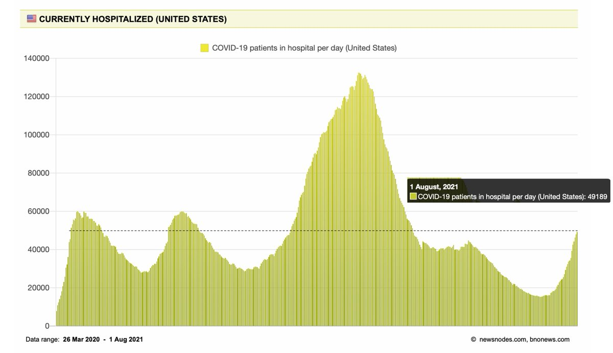
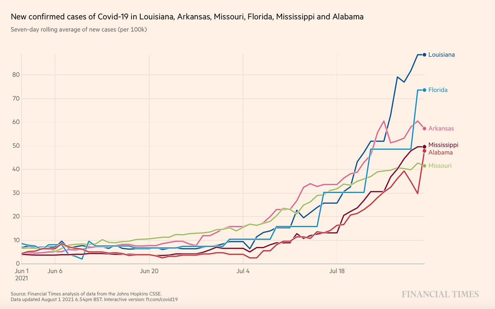
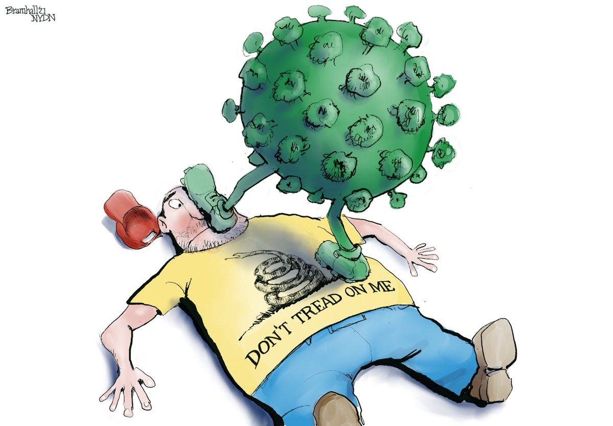
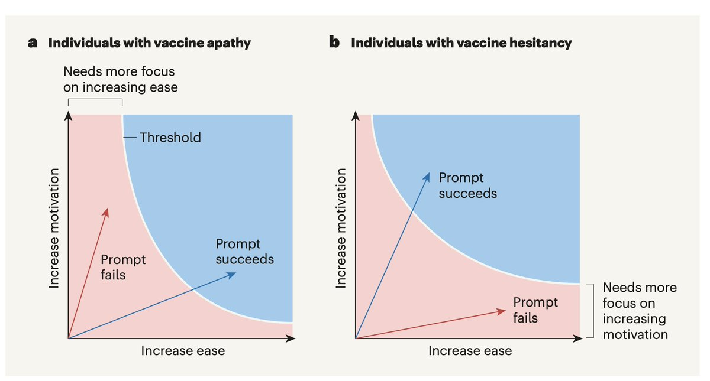
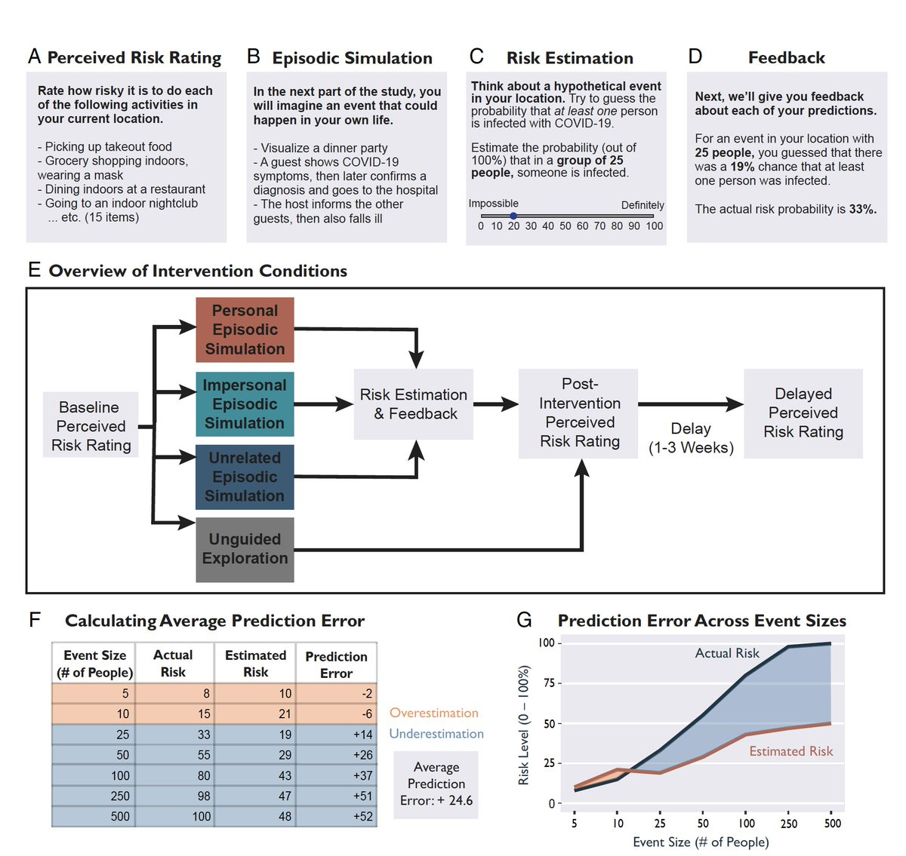
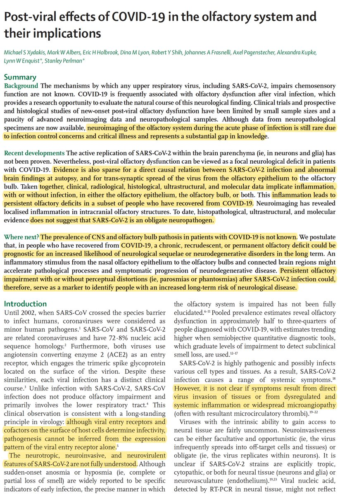

+++
title = "Tweets by Eric Topol Aug 02"
Summary = ""
tags = ["Twitter"]
category = "Twitter"
+++

---

<a href="https://twitter.com/erictopol/status/1421997774434828289" target="_blank" rel="noreferer">00:54 UCT</a>

@zeynep Speaking of vertical
https://twitter.com/EricTopol/status/1421931167855480835

---

<a href="https://twitter.com/erictopol/status/1422000237921464322" target="_blank" rel="noreferer">01:04 UCT</a>

@jenheger @mtosterholm maybe you should read my tweets before posting
cloth face coverings are not garbage
not everyone can afford N95s and KN95s
I've called for our gov't to supply all households with them on multiple occasions
https://twitter.com/EricTopol/status/1420934644480954371

---

<a href="https://twitter.com/erictopol/status/1422033221177413632" target="_blank" rel="noreferer">03:15 UCT</a>

US 4th, Delta wave
Hospitalizations are now &gt;49,000, highest since February,  rising rapidly, and clearly will surpass waves 1 and 2.
It's not too late to double down on all the things we know work💉,😷, distancing, rapid tests to limit the hit 

<a href="E7wRFf2VkAg7gQy.jpg"  ></img></a>

---

<a href="https://twitter.com/erictopol/status/1422041036432367621" target="_blank" rel="noreferer">03:46 UCT</a>

RT @BS_immunized: @EricTopol It's almost like Canadians are willing to do what's best for their society and are less influenced by superflu…

---

<a href="https://twitter.com/erictopol/status/1422177470099251202" target="_blank" rel="noreferer">12:48 UCT</a>

@drandrewb @OurWorldInData @cdavidnaylor @picardonhealth @BlackCreekCHC @thebpao @anishnawbe @jaketapper Wonder where you got the graph that I made or noting this point of progress
Thanks for the attribution
https://twitter.com/EricTopol/status/1421906652601544708

---

<a href="https://twitter.com/erictopol/status/1422187747402391553" target="_blank" rel="noreferer">13:29 UCT</a>

In the states most severely affected by Delta (per capita), there's some signs of slowing of case growth, especially in Missouri and Arkansas, the initial epicenter 

<a href="E7yfo7uVIAEcedj.jpg"  ></img></a>

---

<a href="https://twitter.com/erictopol/status/1422192406548545538" target="_blank" rel="noreferer">13:47 UCT</a>

A tragedy, with no sign of fatalities letting up, not getting enough attention or help from other countries
Indonesia, the 4th largest population in the world, has been devastated by the Delta variant, with only 8% of its population fully vaccinated
@OurWorldInData 

<a href="E7yjGGXVEAEpoLD.jpg"  ></img></a>

---

<a href="https://twitter.com/erictopol/status/1422199045817192449" target="_blank" rel="noreferer">14:14 UCT</a>

@aaronecarroll @megtirrell Thanks for your attribution, Aaron
https://twitter.com/EricTopol/status/1421934766505398272

---

<a href="https://twitter.com/erictopol/status/1422201991220981762" target="_blank" rel="noreferer">14:25 UCT</a>

@aaronecarroll @megtirrell The graph came from the @Sdut, Michelle is the graphic artist who plotted the data from San Diego County, which tracks vaccination status with all testing. I noted its importance, made the photo, purposely put her name at the bottom, and posted it

---

<a href="https://twitter.com/erictopol/status/1422203412821671937" target="_blank" rel="noreferer">14:31 UCT</a>

Our covid times
by @BillBramhall 

<a href="E7yubtbUUAATVt-.jpg"  ></img></a>

---

<a href="https://twitter.com/erictopol/status/1422229497525407747" target="_blank" rel="noreferer">16:15 UCT</a>

Current US test positivity is 8%; we have not seen &gt;20% levels anytime since the 3rd wave, but now Alabama 22%, Oklahoma 22%, Mississippi 20%, Florida 19% and 20 states in double digits. And grossly under-testing in face of Delta's spread.
https://coronavirus.jhu.edu/testing/individual-states
@CovidActNow 

<a href="E7zFp_7VEAE0Cwo.jpg"  ></img></a>

---

<a href="https://twitter.com/erictopol/status/1422231969069338627" target="_blank" rel="noreferer">16:24 UCT</a>

It's not just about vaccines and masks. We need far better testing, and freely available rapid home antigen tests, to counter Delta https://news.bloomberglaw.com/pharma-and-life-sciences/frequent-covid-tests-urged-to-help-curb-spread-of-delta-variant w/ @CarlosdelRio7 
“This has been the biggest missing component of our total strategy in the United States”

---

<a href="https://twitter.com/erictopol/status/1422256298595282944" target="_blank" rel="noreferer">18:01 UCT</a>

San Diego County, the 2nd largest in California, fortunately @SDCountyHHSA tracks infections by vaccination status. In July they're all Delta, fewer in the past week. The odds are now 15:1. The Delta wave has markedly increased the benefit of fully vaccinated status vs infections 

<a href="E7zdxG_VcAMspWZ.jpg"  ></img></a>

---

<a href="https://twitter.com/erictopol/status/1422260012022304768" target="_blank" rel="noreferer">18:16 UCT</a>

RT @GovPhilScott: Vaccines work, and Vermont continues to lead the nation with 84% of the eligible population with at least one dose. 

It…

---

<a href="https://twitter.com/erictopol/status/1422269301931724810" target="_blank" rel="noreferer">18:53 UCT</a>

Delta and vertical lines
Notice something different about the rate of rise in this wave for each of the heavily hit states
The 🦠 is remarkably efficient at finding the vulnerable, faster than any time previously
http://outbreak.info 

<a href="E7zqQ2vVkAEfTTJ.jpg"  ></img></a>

---

<a href="https://twitter.com/erictopol/status/1422302105642012672" target="_blank" rel="noreferer">21:03 UCT</a>

Changing behavior for prevention of covid
—Nudges to improve vaccinations (RCT)
https://www.nature.com/articles/s41586-021-03843-2
https://www.nature.com/articles/d41586-021-02043-2 @Nature  @danielcroymans @miteshspatel 
—Providing actual, not perceived, risk (which are not aligned)
https://www.pnas.org/content/118/32/e2100970118 @PNASNews @GregoryRSL 

<a href="E70F77lVEB4tlEH.jpg"  ></img></a><a href="E70Gl35VEBA1Zbw.jpg"  ></img></a>

---

<a href="https://twitter.com/erictopol/status/1422304219265069061" target="_blank" rel="noreferer">21:12 UCT</a>

@davezatz Prior covid + 1-dose vaccine, when assessed, has had a superior immune response than prior covid alone or 2-doses of vaccine. 
Reinfection with Delta hasn't been prominent, based upon the UK data, but still being tracked via SIREN study

---

<a href="https://twitter.com/erictopol/status/1422312312216555521" target="_blank" rel="noreferer">21:44 UCT</a>

We like any and all good news about Delta https://twitter.com/chrischirp/status/1422223706617696259

---

<a href="https://twitter.com/erictopol/status/1422326474581831687" target="_blank" rel="noreferer">22:40 UCT</a>

The mechanism of loss of smell from Covid, a ★ review pointing to inflammation, w/ or w/o direct infection, that may, if persistent, be a marker for long-term risk of neurological disease
https://www.thelancet.com/journals/laneur/article/PIIS1474-4422(21)00182-4/fulltext @TheLancetNeuro 

<a href="E70c7OiVcC4B7MW.jpg"  ></img></a><a href="E70dvpGVcAYn5UE.jpg"  ></img></a>

---

<a href="https://twitter.com/erictopol/status/1422331684372901888" target="_blank" rel="noreferer">23:01 UCT</a>

Good timing 

<a href="E70jE-QVoAA8nOF.jpg"  ></img></a>