+++
title = "Tweets by Eric Topol Aug 03"
Summary = ""
tags = ["Twitter"]
category = "Twitter"
+++

---

<a href="https://twitter.com/erictopol/status/1422365316546367490" target="_blank" rel="noreferer">01:14 UCT</a>

In the accompanying commentary, a Figure for how long loss of smell lasts from a prospective study of 100 patients https://www.thelancet.com/journals/laneur/article/PIIS1474-4422(21)00202-7/fulltext @TheLancetNeuro 

<a href="E71BniBVgAA8pnJ.jpg"  >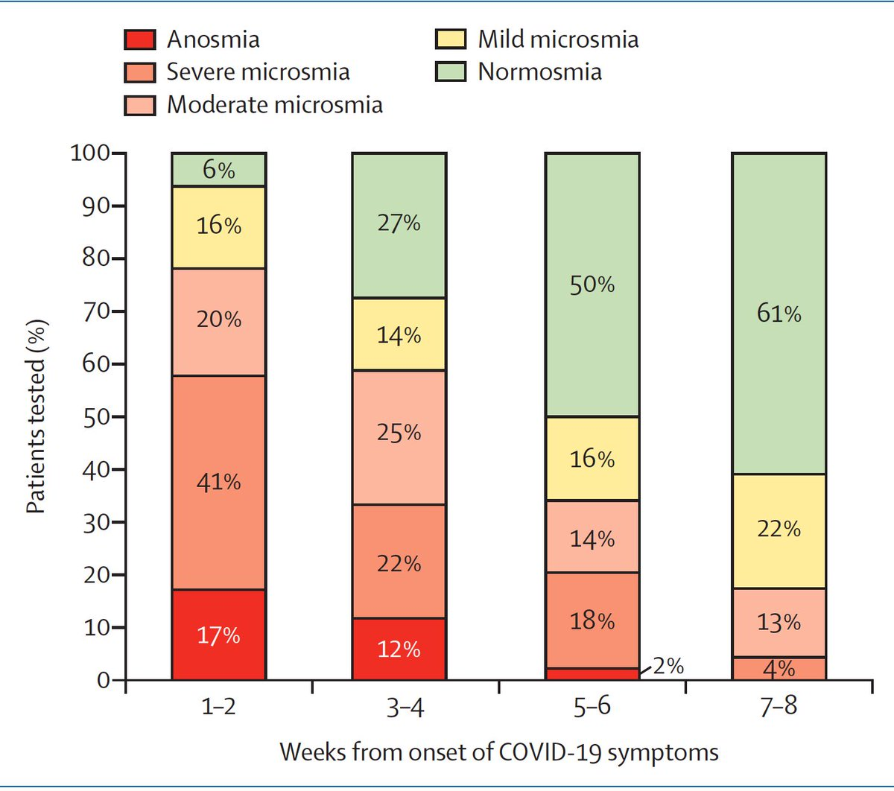</img></a>

---

<a href="https://twitter.com/erictopol/status/1422373901380636673" target="_blank" rel="noreferer">01:48 UCT</a>

A new, brilliant review of lab studies to assess #SARSCoV2's  infectivity @NatureCellBio, from conventional to  3D organoids https://www.nature.com/articles/s41556-021-00721-x
@TheSpenceLab and collaborators 

<a href="E71IJPOVEAITXjI.jpg"  >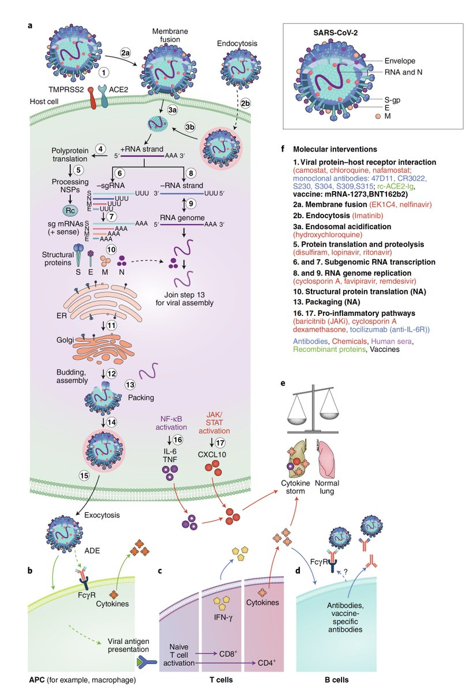</img></a><a href="E71IFCMVoAMLfKt.jpg"  >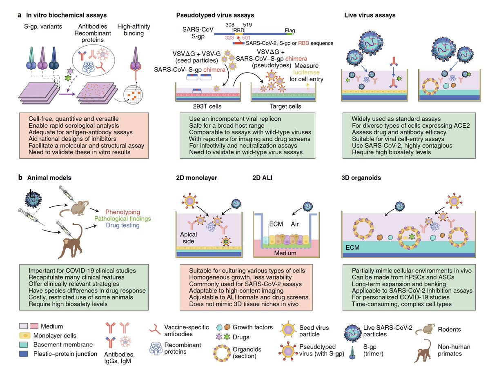</img></a>

---

<a href="https://twitter.com/erictopol/status/1422381493721071625" target="_blank" rel="noreferer">02:19 UCT</a>

Update today, &gt;51,000
Why can't the @CDCgov curate the data and partition it by vaccination status, as done in other countries? 
We know it's &gt;&gt;90% unvaccinated, but this needs close tracking to determine extent of breakthrough illness, demographics, time from vaccination, etc 

<a href="E71Px06VkAUy1-b.jpg"  >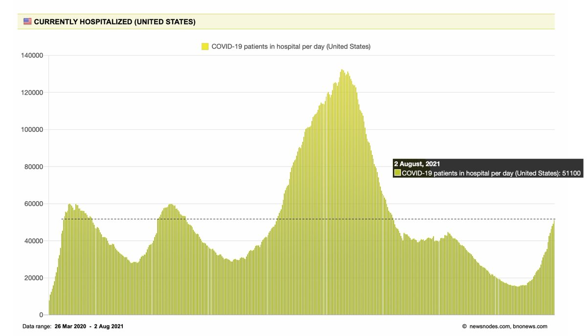</img></a>

---

<a href="https://twitter.com/erictopol/status/1422556760888385537" target="_blank" rel="noreferer">13:55 UCT</a>

💯 They're not rare w/ Delta; clearly they're increasing, but our pathetic tracking leaves us uncertain as to their true incidence, severity, demographics, time from vaccination, Ct/viral load, neutralizing antibodies. All critical data to know, help prevent, decide re: boosters https://twitter.com/Bob_Wachter/status/1422445420593106945

---

<a href="https://twitter.com/erictopol/status/1422559345577926657" target="_blank" rel="noreferer">14:05 UCT</a>

Yet another new report that undermines the T cell narrative for its role in defense against #SARSCoV2 reinfection, an experimental depletion study in macaques
https://journals.asm.org/doi/10.1128/mBio.01503-21 @mbiojournal  https://twitter.com/EricTopol/status/1420870547039158273

<a href="E73x2kuX0AA0Kvx.jpg"  ></img></a><a href="E73x4CHVUAILgyi.jpg"  >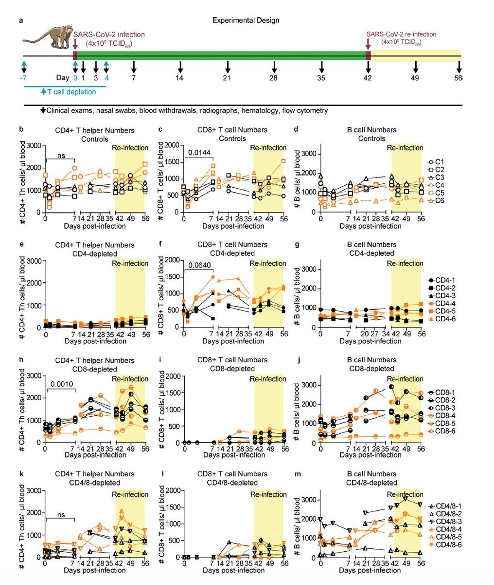</img></a>

---

<a href="https://twitter.com/erictopol/status/1422564476553891843" target="_blank" rel="noreferer">14:26 UCT</a>

The 4th wave
Louisiana, now the highest per capita rate of covid globally (for a state or country). It's also noteworthy that 72% of the world's population hasn't even had its 1st vaccine shot and there are enough here for every American to be fully vaccinated. 

<a href="E732harVIAAdLa8.jpg"  >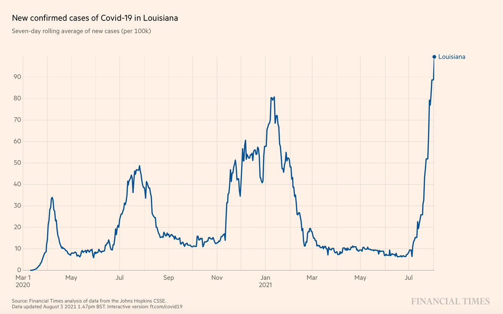</img></a>

---

<a href="https://twitter.com/erictopol/status/1422568213762646016" target="_blank" rel="noreferer">14:41 UCT</a>

RT @rosemaryCNN: As the #DeltaVariant drives up cases across the US we learned Monday 70% of Americans have now received at least one #COVI…

---

<a href="https://twitter.com/erictopol/status/1422578295250382857" target="_blank" rel="noreferer">15:21 UCT</a>

Just published @ScienceMagazine 
The path to a universal, betacoronavirus vaccine made even more likely with this discovery of such potent, stem helix neutralizing antibodies
https://science.sciencemag.org/content/early/2021/08/03/science.abj3321 

<a href="E74C6xnVUAMr2s9.jpg"  ></img></a>

---

<a href="https://twitter.com/erictopol/status/1422593573808005134" target="_blank" rel="noreferer">16:21 UCT</a>

The vicious loop starts with cases. And we'll never get out of this loop until they're controlled. Including breakthroughs. 

<a href="E74RRRTVoAM6wDF.jpg"  >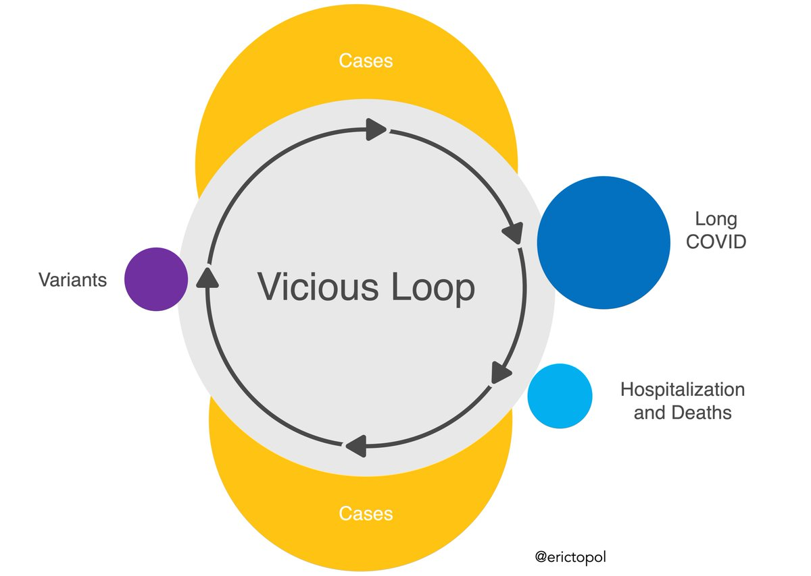</img></a>

---

<a href="https://twitter.com/erictopol/status/1422600017475366915" target="_blank" rel="noreferer">16:47 UCT</a>

The UK and Israel are &gt;20 per cent points higher than the US for fully vaccinated adults. 
That these Delta wave lines remain parallel is fortunate, as we run the risk of being far worse 

<a href="E74Wxn4VUAACURQ.jpg"  ></img></a>

---

<a href="https://twitter.com/erictopol/status/1422602340629061636" target="_blank" rel="noreferer">16:56 UCT</a>

Florida covid hospitalizations today are very close to peak pandemic 

<a href="E74ZGokVEAQ-vcI.jpg"  ></img></a>

---

<a href="https://twitter.com/erictopol/status/1422629147554193408" target="_blank" rel="noreferer">18:43 UCT</a>

Adding to the verticals
via @cmyeaton 
https://twitter.com/cmyeaton/status/1422624128918556684

---

<a href="https://twitter.com/erictopol/status/1422633119308423171" target="_blank" rel="noreferer">18:59 UCT</a>

@chrislhayes Agree, Chris.
Notable that this in occurring in FL with the US avg vaxx rate and reflects how Delta is far more formidable than prior 🦠versions in finding vulnerable hosts

---

<a href="https://twitter.com/erictopol/status/1422644921740136456" target="_blank" rel="noreferer">19:45 UCT</a>

Just published is a superb vaccine review @ImmunityCP by the @NIH's @KarinBok1 @sandra_sitar @BarneyGrahamMD @jrmascola https://www.cell.com/immunity/fulltext/S1074-7613(21)00303-4
Many key points:
1. The Covid mRNA vaccines were a work in progress for decades 

<a href="E74-hyvUcAI-uFG.jpg"  >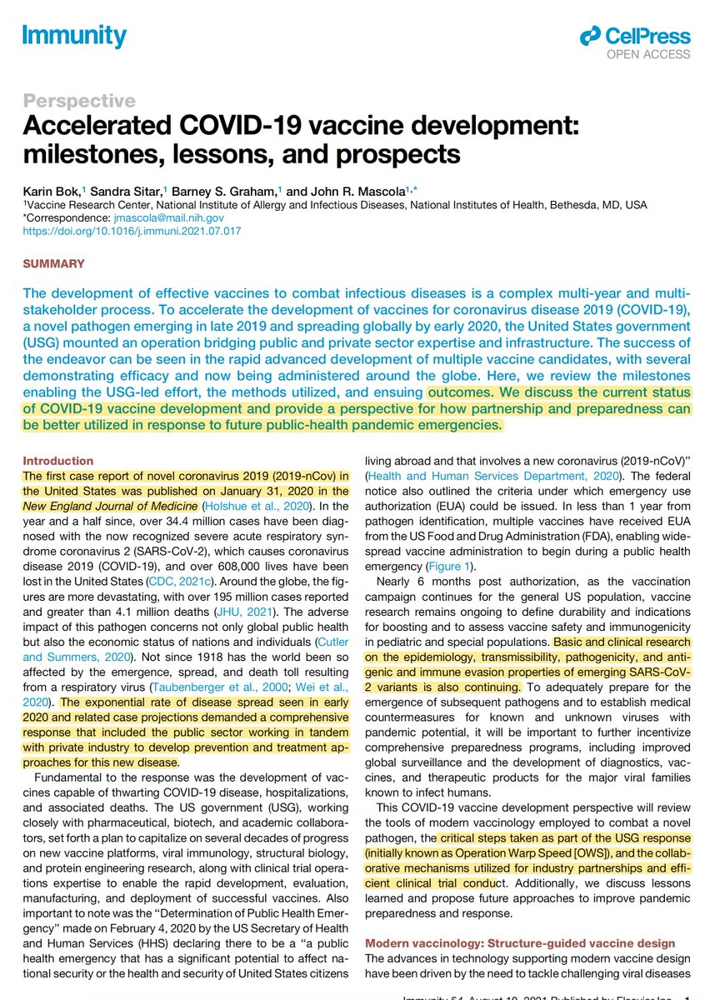</img></a><a href="E74-qQaVEAEbtkp.jpg"  ></img></a>

---

<a href="https://twitter.com/erictopol/status/1422644924575408131" target="_blank" rel="noreferer">19:45 UCT</a>

2. The randomized trials of vaccines vs placebo were predominantly conducted with the primary endpoint of symptomatic infections (not hospitalizations or deaths) 

<a href="E74_A-UVcAIUGbh.jpg"  >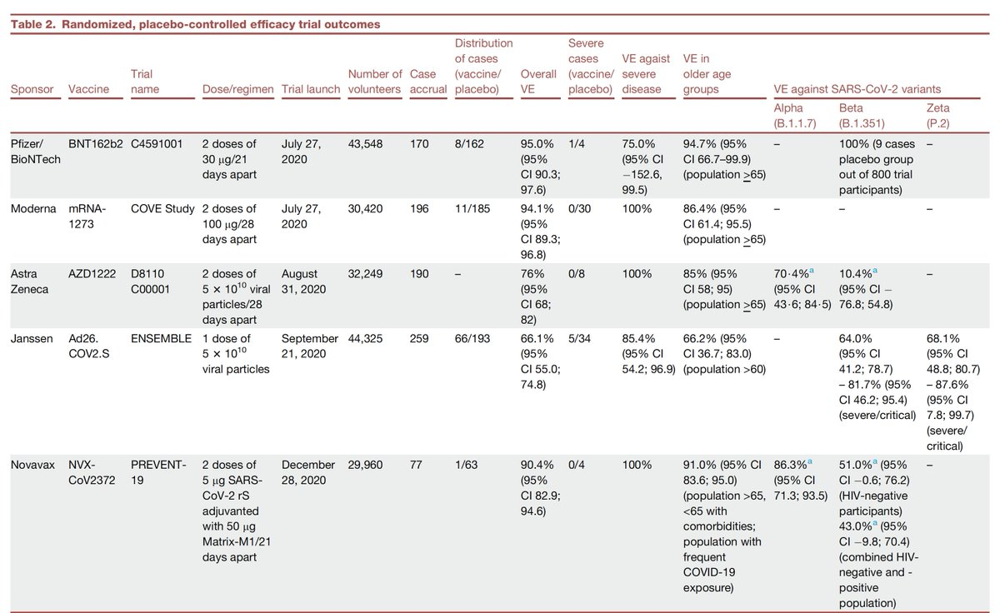</img></a>

---

<a href="https://twitter.com/erictopol/status/1422644930351042565" target="_blank" rel="noreferer">19:45 UCT</a>

3. There are no randomized trials vs Delta; we are relying on real world vaccine effectiveness, for which there has been a reduction in protection vs SI (symptomatic infection). 88% is based on UK data; Israel's is less, unpublished, but used the same dosing 3 wk schedule as US 

<a href="E74_ampVEAgKni7.jpg"  >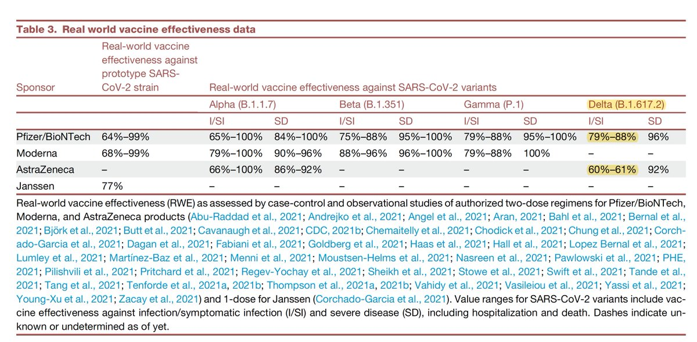</img></a>

---

<a href="https://twitter.com/erictopol/status/1422649912043266051" target="_blank" rel="noreferer">20:05 UCT</a>

@john_actuary @JamesWard73 I sure hope not. Looking at Bangladesh's pattern seems like Delta can finds its way back pretty quickly 

<a href="E75Eg6jVIAU7AEI.jpg"  >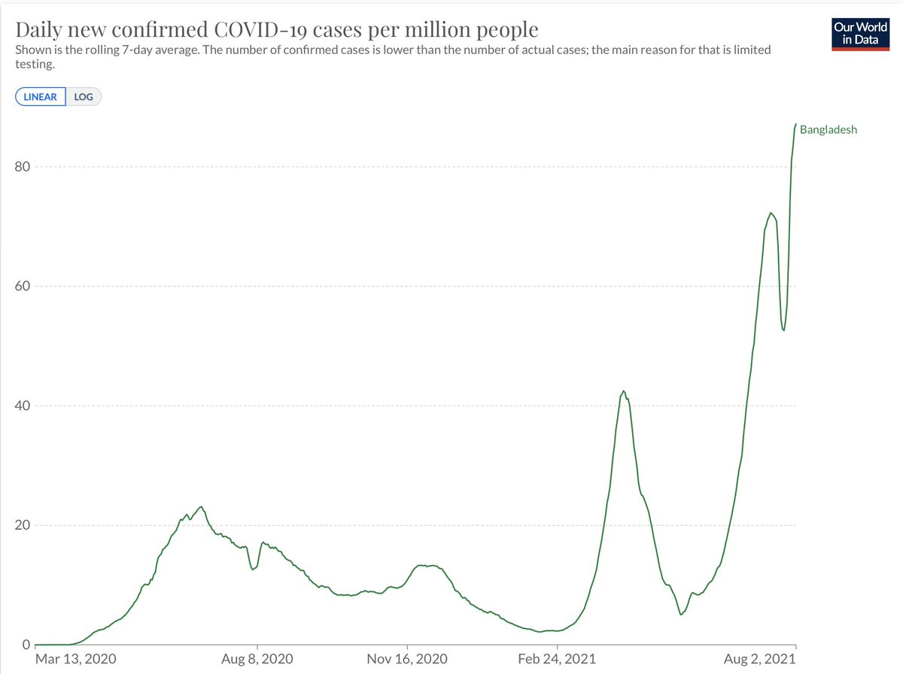</img></a>

---

<a href="https://twitter.com/erictopol/status/1422694271845502980" target="_blank" rel="noreferer">23:02 UCT</a>

New @LancetChildAdol is a very reassuring prospective  study of &gt;250,000  children,  &gt;1700 with + covid test, age  5-17, that shows the risk for chronic Covid symptoms is quite low; 4.4% beyond 4 weeks
https://www.thelancet.com/journals/lanchi/article/PIIS2352-4642(21)00198-X/fulltext 

<a href="E75sAPjVgAE3be5.jpg"  >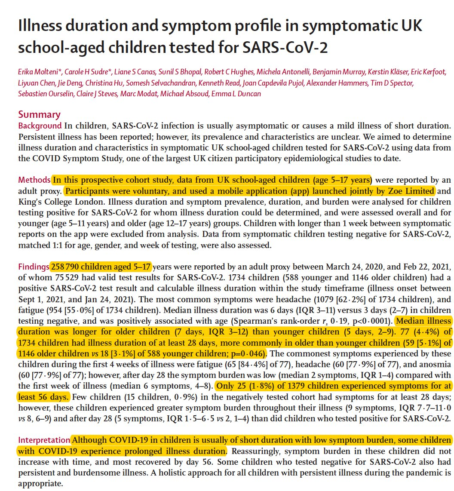</img></a><a href="E75sCFzUYAMq_tB.jpg"  ></img></a>

---

<a href="https://twitter.com/erictopol/status/1422702908643037187" target="_blank" rel="noreferer">23:36 UCT</a>

To understand the complexities of the immune response, antibodies &amp; T cells, natural immunity and vaccine-induced, Delta, and more, we turned to @profshanecrotty for a new podcast https://www.medscape.com/viewarticle/954796
w/@cuttingforstone 
Beyond being a great scientist, he’s a master explainer

