+++
title = "Tweets by Eric Topol Aug 04"
Summary = ""
tags = ["Twitter"]
category = "Twitter"
+++

---

<a href="https://twitter.com/erictopol/status/1422728142901288962" target="_blank" rel="noreferer">01:16 UCT</a>

Only 1.8% of the kids had symptoms at 56 days.
That doesn't mean they won't fully resolve subsequently.
It's too bad that even encouraging new data is so poorly received

---

<a href="https://twitter.com/erictopol/status/1422728868968886277" target="_blank" rel="noreferer">01:19 UCT</a>

This report is not addressing whether children should or should not be vaccinated; that's a very different consideration (e.g. risk of transmission). It simply suggests that the potential for #LongCovid in children exists but fortunately is low.

---

<a href="https://twitter.com/erictopol/status/1422741218232963078" target="_blank" rel="noreferer">02:08 UCT</a>

Hospitalizations in the US Delta, 4th wave are close to the peak of waves 1 and 2, and cases &gt;145/000 in a day with limited testing. The only reassuring data relates to low fatalities (so far), reflecting vaccinations and the disease shift to young https://newsnodes.com/us 

<a href="E76XVMPVoAE4GMc.jpg"  >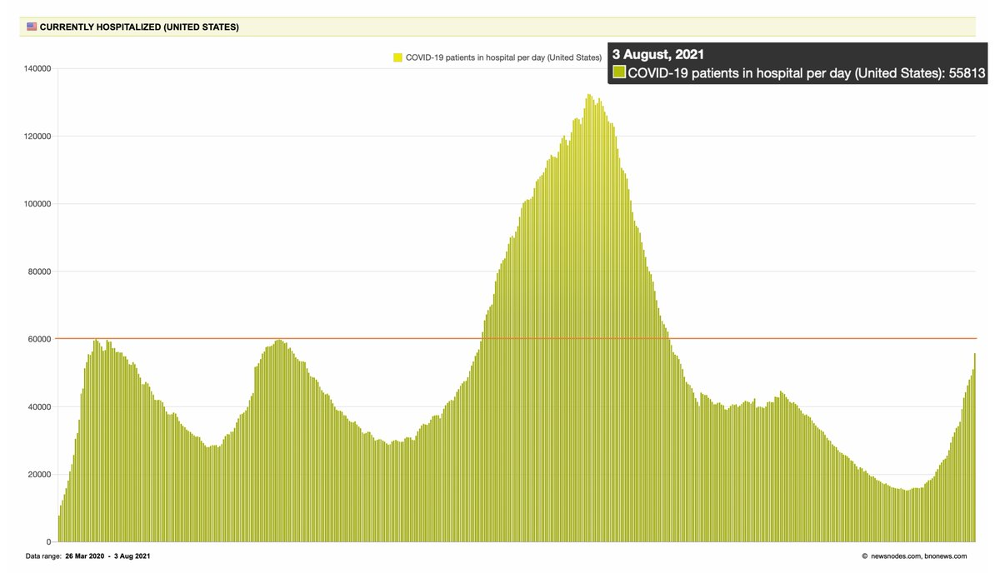</img></a><a href="E76XczxVIAwDM4Z.jpg"  >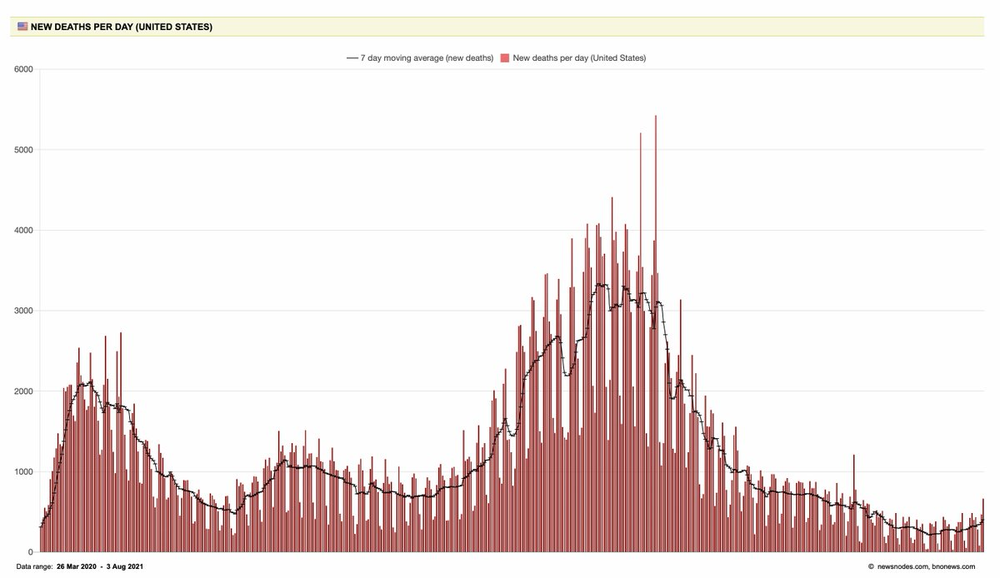</img></a>

---

<a href="https://twitter.com/erictopol/status/1422749170230697985" target="_blank" rel="noreferer">02:40 UCT</a>

Good question: Why is #SARSCoV2 prone to superspreading, following the Pareto 80-20 rule for over-dispersion of infections, but not H1N1 or other pathogens?
https://www.thelancet.com/journals/laninf/article/PIIS1473-3099(21)00406-0/fulltext @TheLancetInfDis by @paulchenz @MarionKoopmans @DFisman @FrankGuLab 

<a href="E76eRT_VgAYCutH.jpg"  >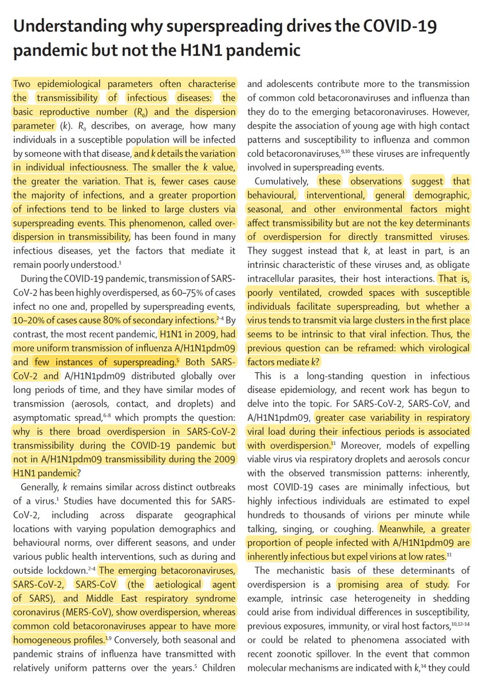</img></a><a href="E76eSu6VkAMeOUF.jpg"  >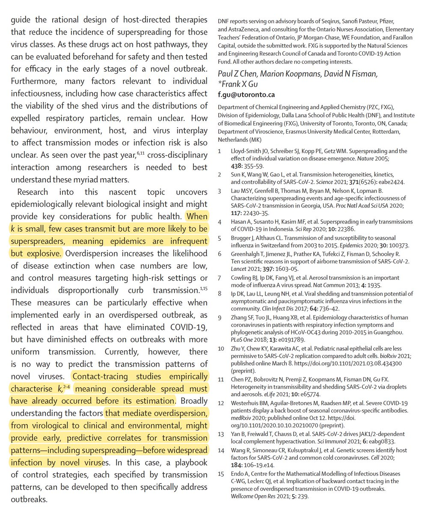</img></a>

---

<a href="https://twitter.com/erictopol/status/1422756107559129095" target="_blank" rel="noreferer">03:07 UCT</a>

A large UK study of vaccination protection from Delta symptomatic breakthrough infections found effectiveness of ~60%  (combines AZ and Pfizer vaccines)
https://www.ft.com/content/df4db947-8697-49a7-b38b-e46bd86ba915
https://www.reuters.com/world/uk/english-study-finds-50-60-reduced-risk-covid-double-vaccinated-2021-08-03/ 

<a href="E76ky5cVkAMzJpc.jpg"  >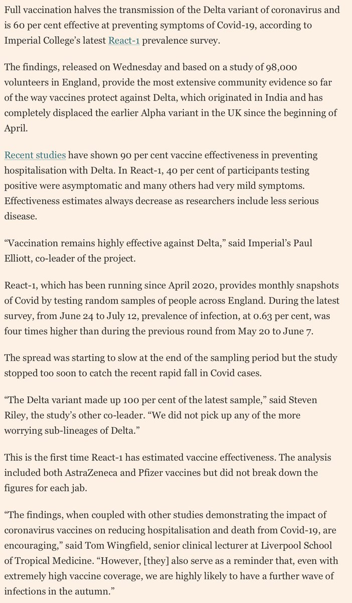</img></a><a href="E76ki6RUcAA-RRx.jpg"  >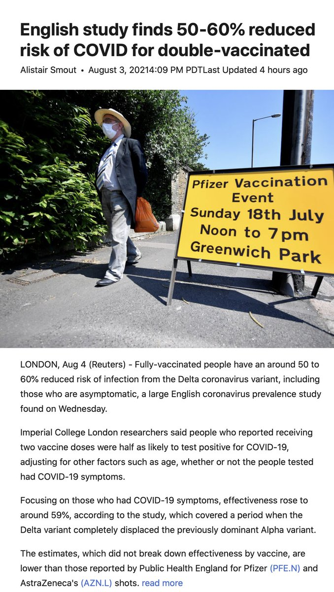</img></a>

---

<a href="https://twitter.com/erictopol/status/1422762334435508232" target="_blank" rel="noreferer">03:32 UCT</a>

Link to the preprint
https://spiral.imperial.ac.uk/bitstream/10044/1/90800/2/react1_r13_final_preprint_final.pdf
Extensive PCR testing showed that fully vaccinated people had lower viral loads than un- or partially vaccinated, supporting decreased potential for Delta transmission

---

<a href="https://twitter.com/erictopol/status/1422921366131515398" target="_blank" rel="noreferer">14:04 UCT</a>

The most rigorous assessment to date for Delta breakthroughs, w/ random sampling. The previous @PHE_uk estimate for vaccine effectiveness vs Delta was 88% for Pfizer, 60% for AZ. Israel's (Pfizer) was 60%, likely accurate. No wonder why we're seeing the increase in breakthroughs 

<a href="E7857_iVcAAejPH.png"  >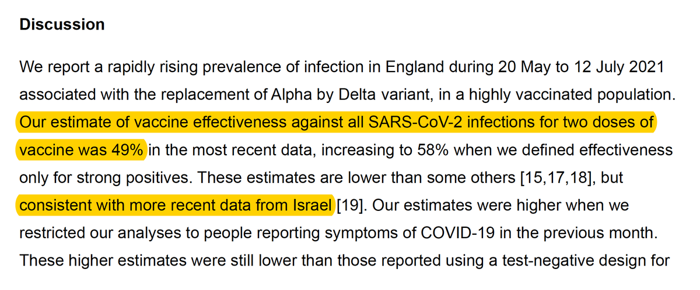</img></a>

---

<a href="https://twitter.com/erictopol/status/1422926162624356357" target="_blank" rel="noreferer">14:23 UCT</a>

The FDA full approval of vaccines in now expected by Labor Day; it took months to get transparency and communication w/ the public
https://www.washingtonpost.com/health/2021/08/02/coronavirus-vaccines-fda-full-approval-timeline/
This Q&amp;A shows the prior lack of understanding of its urgency; also the implications on boosters 

<a href="E78-_N4UYAc1hso.jpg"  >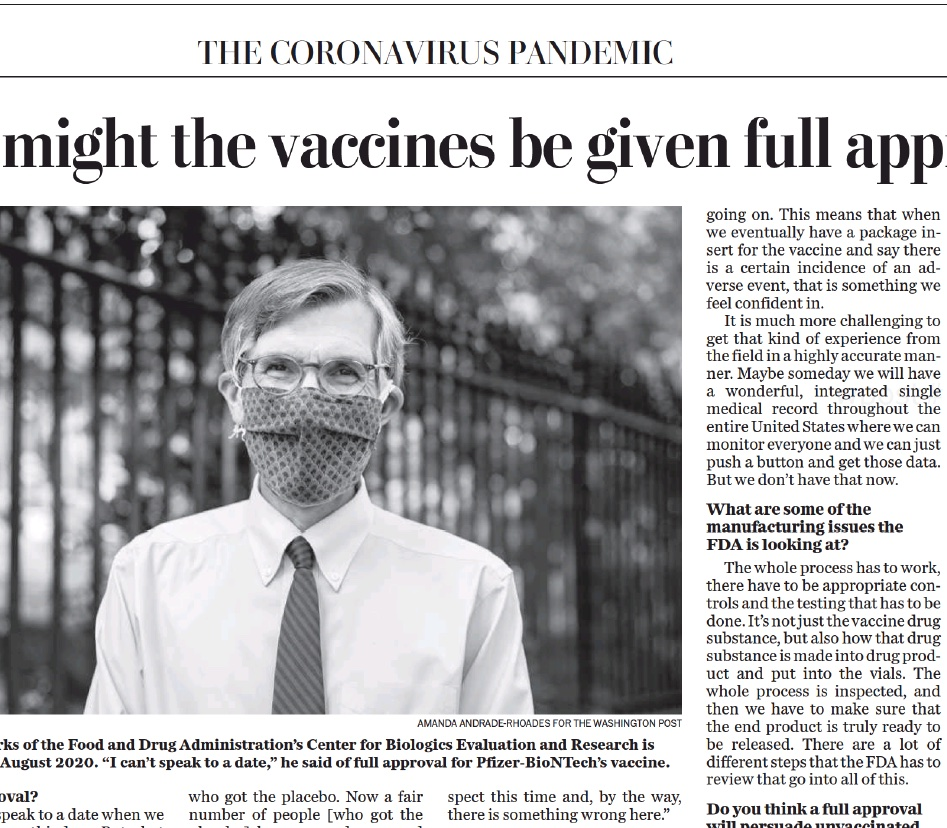</img></a>

---

<a href="https://twitter.com/erictopol/status/1422944272383283203" target="_blank" rel="noreferer">15:35 UCT</a>

Labor Day target (more likely end August)
https://www.nytimes.com/live/2021/08/04/world/covid-delta-variant-vaccine#the-fda-could-grant-full-approval-to-pfizers-vaccine-by-early-september by @SharonLNYT @noahweiland 
https://www.nytimes.com/2021/07/01/opinion/fda-vaccines-full-approval.html @nytopinion 
I applaud the transparency, making it #1 priority.
 It's a shame this wasn't the policy months ago, pre-Delta, when it would have had huge impact 

<a href="E79PU2wUUAMZwuV.jpg"  >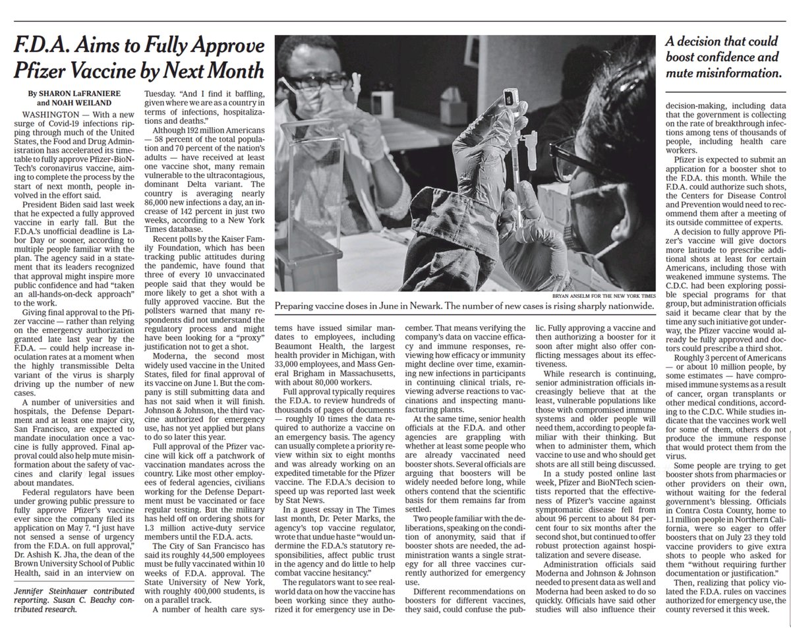</img></a><a href="E79PWZdVIAEGXdf.jpg"  >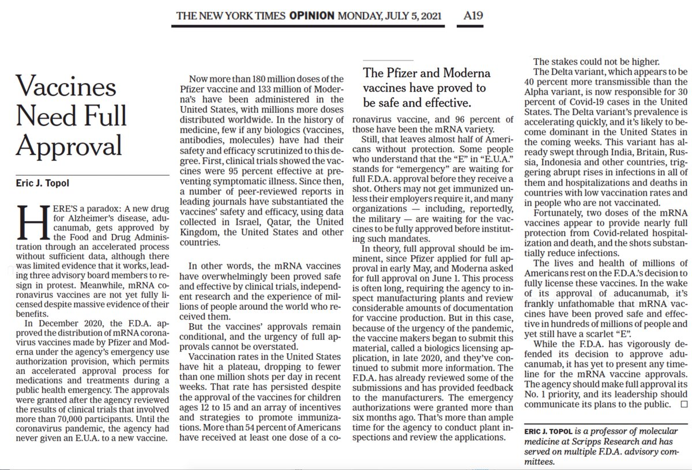</img></a>

---

<a href="https://twitter.com/erictopol/status/1422960935212179457" target="_blank" rel="noreferer">16:41 UCT</a>

Summary Delta breakthrough studies, Ct/viral load,  vaccine effectiveness (VE) 
Only 1 large study of Ct/viral load, shows some vaccine reduction 
VE ranges 39-88%; it's likely ≤ 60% at best for mRNA
More data needed, but points to need for boosters for at least some people 

<a href="E79d4qJUYAIwtQZ.jpg"  >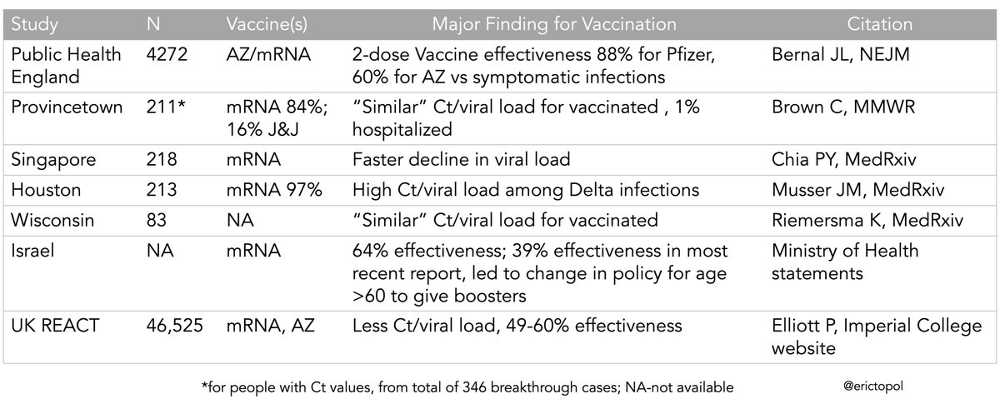</img></a>

---

<a href="https://twitter.com/erictopol/status/1422963770268086272" target="_blank" rel="noreferer">16:52 UCT</a>

Overall, these findings certainly are concordant w/ increased Delta breakthrough symptomatic infections we're seeing and a major decline in protection (~95% w/ mRNA) compared with previous strains, as reviewed here https://twitter.com/EricTopol/status/1422644921740136456

---

<a href="https://twitter.com/erictopol/status/1422965144372404224" target="_blank" rel="noreferer">16:58 UCT</a>

Recall that 1-dose mRNA or AZ had little (30%) efficacy (1st study in Table). All of this reflects Delta's immune evasiveness. We're very lucky it's holding up for reduction of hospitalizations/deaths but this🦠is far more formidable for both transmission and our immune response

---

<a href="https://twitter.com/erictopol/status/1422974969865138179" target="_blank" rel="noreferer">17:37 UCT</a>

@dvir_a I am well aware of that. That's the denominator used to assess VE. I can only fit so much into 1 tweet 

<a href="E79sETzUUAExW3g.jpg"  >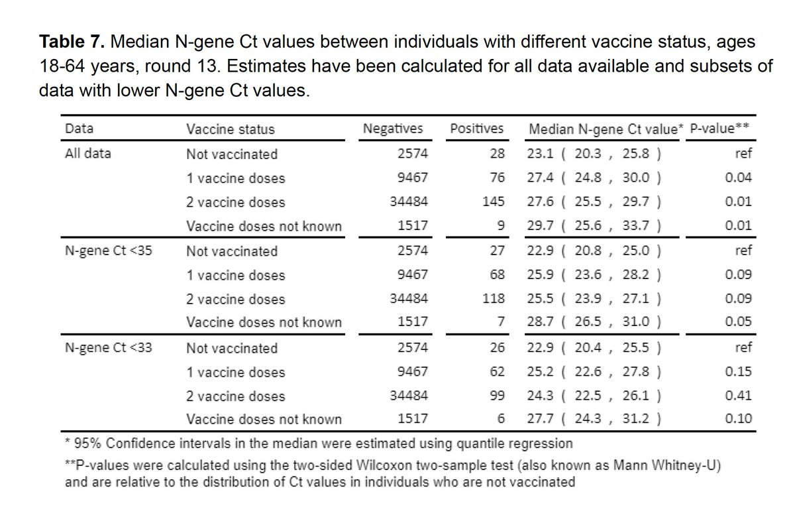</img></a>

---

<a href="https://twitter.com/erictopol/status/1422989657369808901" target="_blank" rel="noreferer">18:35 UCT</a>

There's little good news for the US Delta wave, but we may be seeing the peak case growth rate for the top 2 states, Louisiana and Florida 

<a href="E795ZpGVkAIupGj.jpg"  >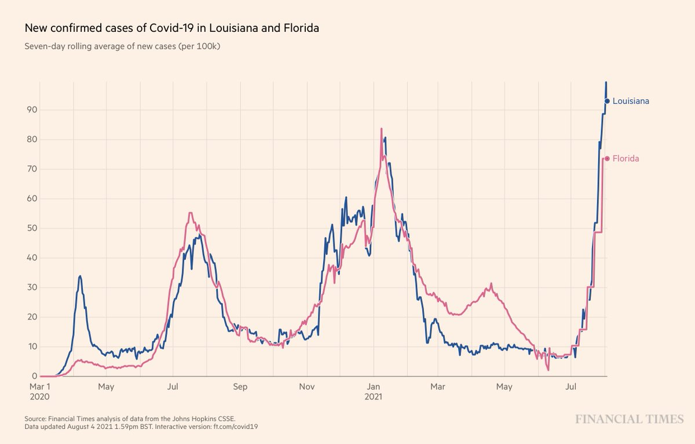</img></a>

---

<a href="https://twitter.com/erictopol/status/1422992503259549696" target="_blank" rel="noreferer">18:47 UCT</a>

Other implications for the VE drop vs infections. 
For awhile we wondered if the mRNA dosing schedule is Israel (3 weeks) vs UK (8-12 weeks) could account for 39-60% vs 88%, respectively. The new UK study doesn't break down vaccine %, but makes this explanation less likely

---

<a href="https://twitter.com/erictopol/status/1422993905495134213" target="_blank" rel="noreferer">18:52 UCT</a>

A better way to see the slowing of case growth is via the log plot, and it looks pretty consistent across the top states 

<a href="E799MOGUcAIHX6K.jpg"  >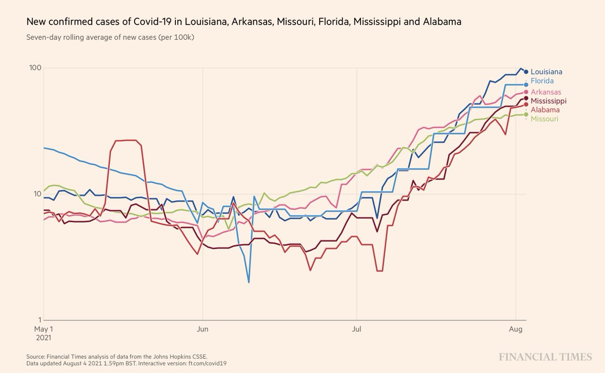</img></a>

---

<a href="https://twitter.com/erictopol/status/1423026091803828228" target="_blank" rel="noreferer">21:00 UCT</a>

Just published @NEJM
Prevention of Covid for household contacts with exposure via a single subcutaneous injection: results of a randomized trial of combination monoclonal antibodies shows marked benefit
 http://www.nejm.org/doi/full/10.1056/NEJMoa2109682 

<a href="E7-UV4IVgAEYNkV.jpg"  >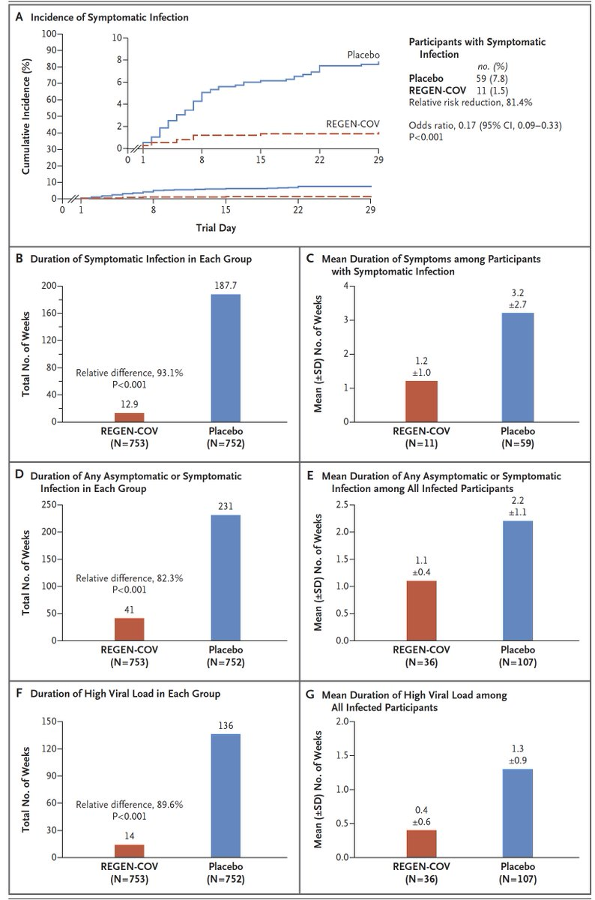</img></a><a href="E7-UXvhUUAM7eGc.jpg"  >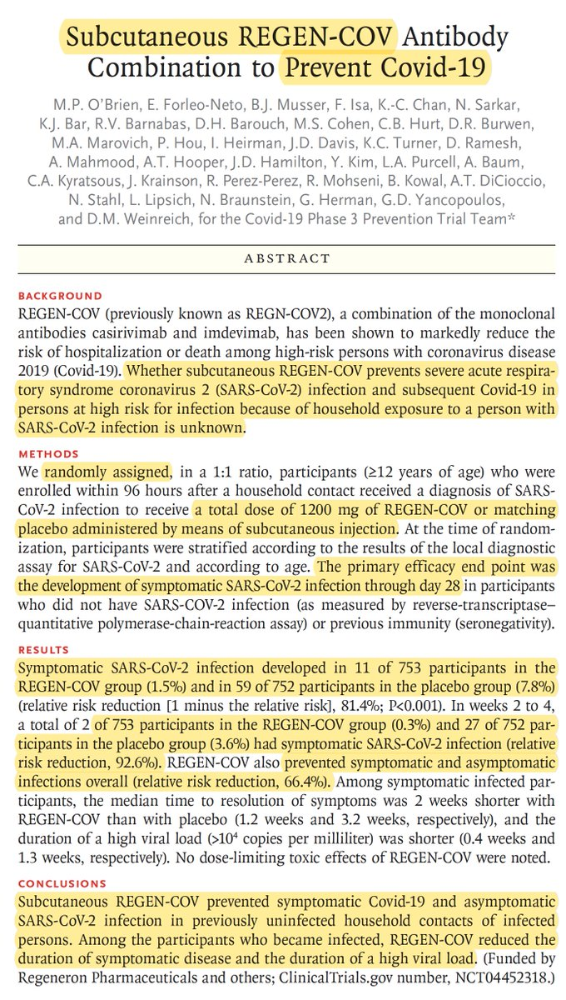</img></a>

---

<a href="https://twitter.com/erictopol/status/1423026381378646016" target="_blank" rel="noreferer">21:01 UCT</a>

fixed link
https://www.nejm.org/doi/full/10.1056/NEJMoa2109682?query=featured_home

---

<a href="https://twitter.com/erictopol/status/1423028440664403968" target="_blank" rel="noreferer">21:09 UCT</a>

In the pandemic, immunocompromised people (~3% of Americans) are not getting adequate recognition for the potential of in-host evolution of the virus (highlighted studies) and the need for far better approaches to protect them https://www.nejm.org/doi/full/10.1056/NEJMsb2104756?query=featured_home @NEJM 

<a href="E7-VPMrVcAAvJ40.jpg"  >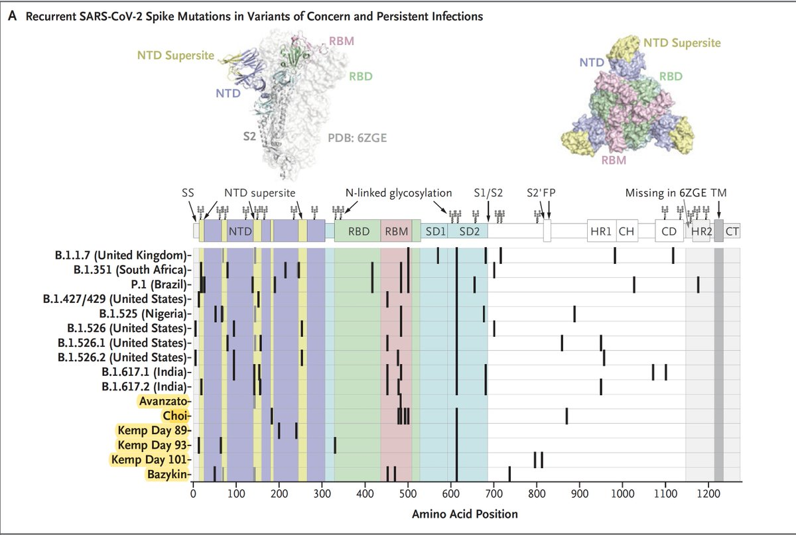</img></a>

---

<a href="https://twitter.com/erictopol/status/1423035331327119360" target="_blank" rel="noreferer">21:37 UCT</a>

This is a 1st in 2 ways
1. Use of a sub-Q (under the skin) injection rather than an intravenous infusion of the antibodies; the requirement for an IV infusion had led to reduced use for treatment
2. *Preventing* covid after exposure 👍

---

<a href="https://twitter.com/erictopol/status/1423039487156707331" target="_blank" rel="noreferer">21:53 UCT</a>

Notable: several countries with Delta waves had abrupt U-turns that were short-lived or are stuttering
@OurWorldInData 

<a href="E7-mclEVEAAK1jw.jpg"  >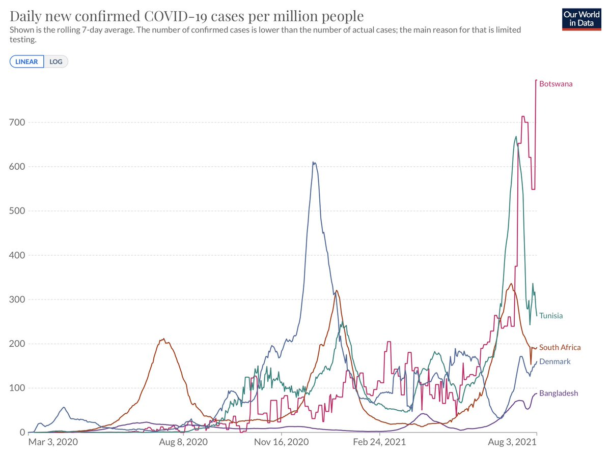</img></a>

---

<a href="https://twitter.com/erictopol/status/1423051289429086208" target="_blank" rel="noreferer">22:40 UCT</a>

During the 3rd wave in the USA, cases got above 300,000 per day and deaths above 4,000.
In the 4th, Delta wave, cases have already reached ~150,000 in a day, with deaths  ~400 (7-day avg)
[and yes, there's a lag; hospitalizations and #LongCovid are a big deal in this wave]

