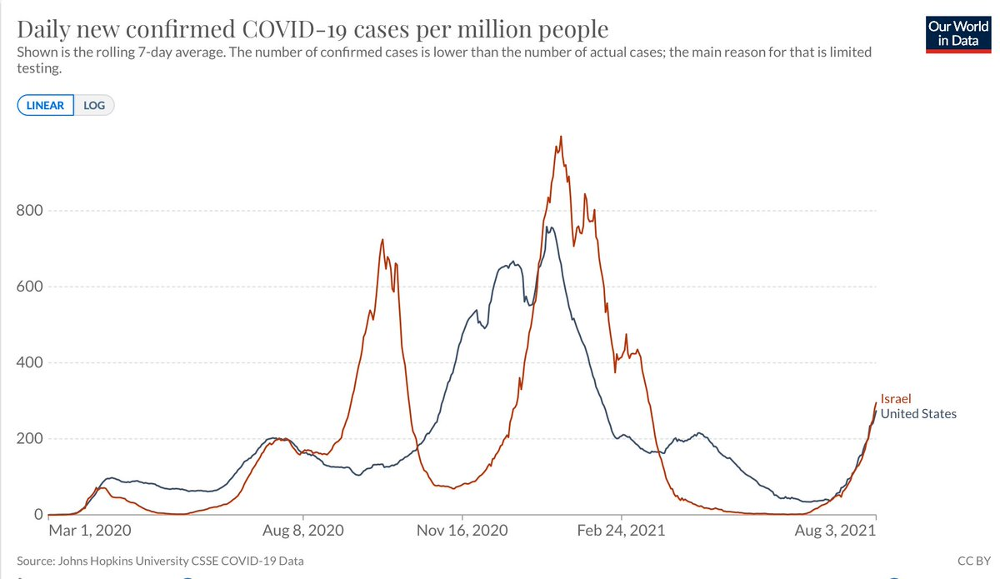
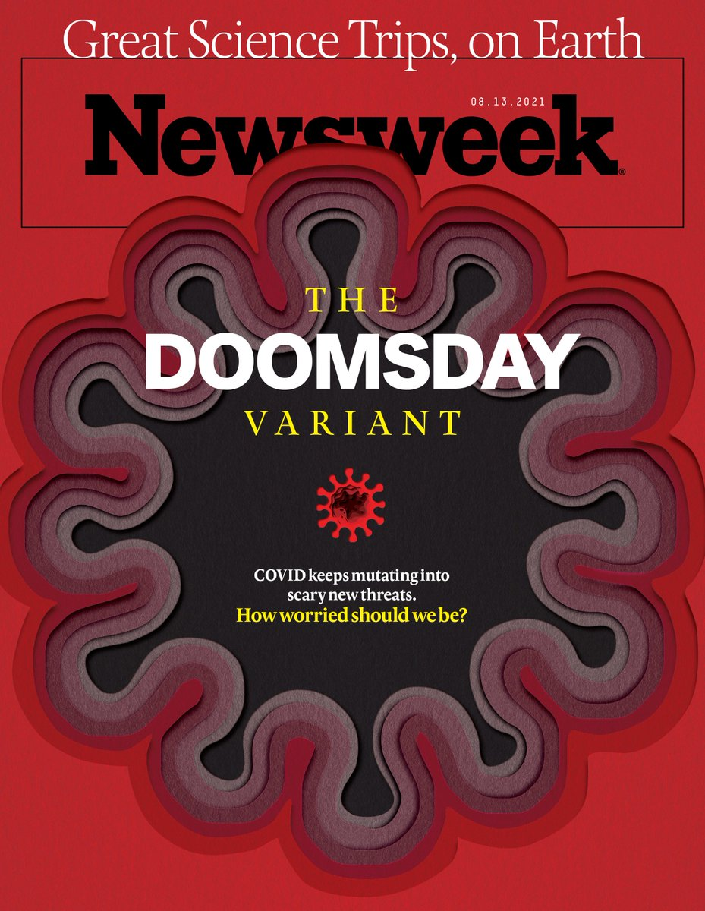
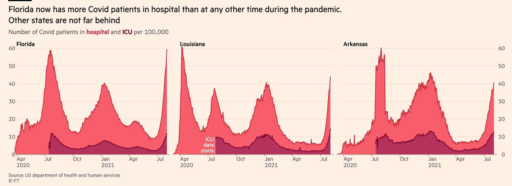
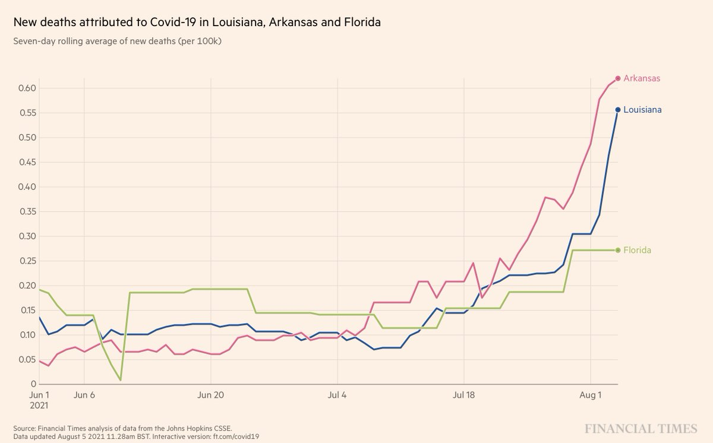
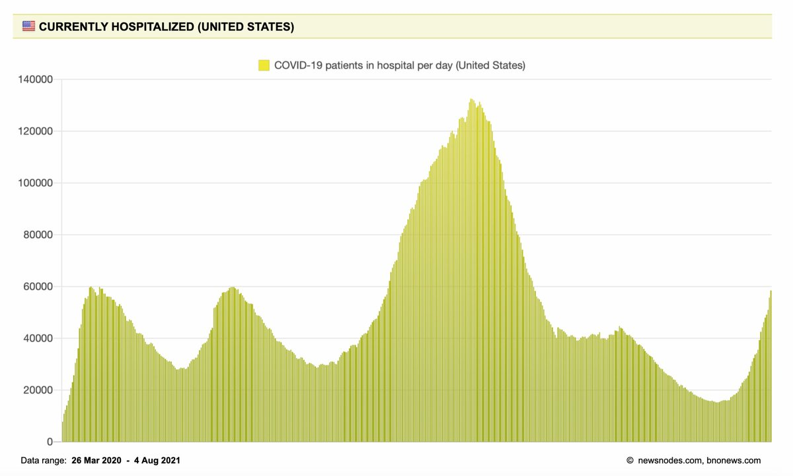
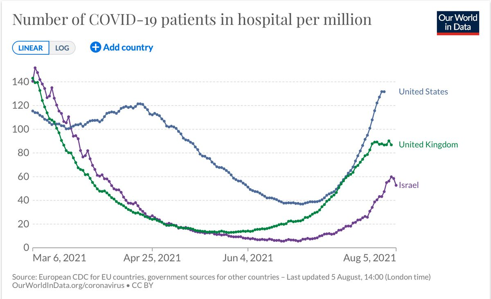
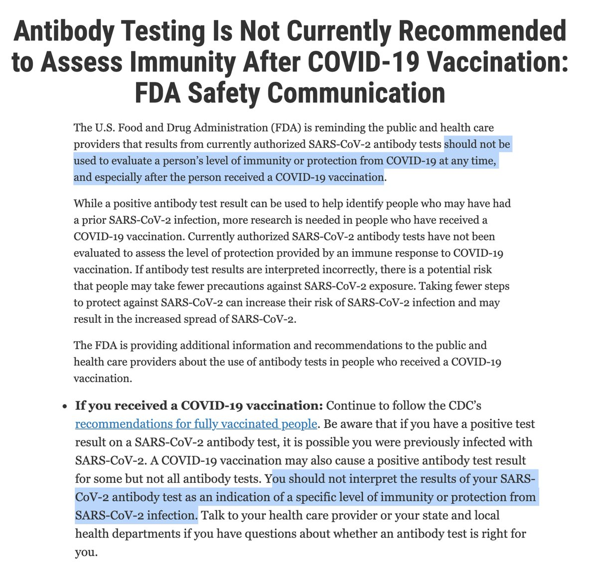
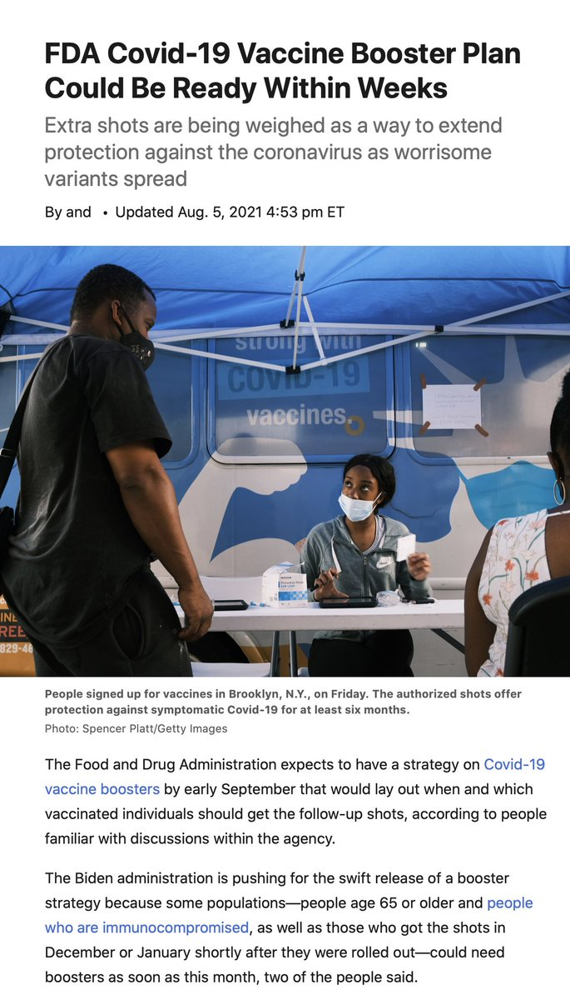
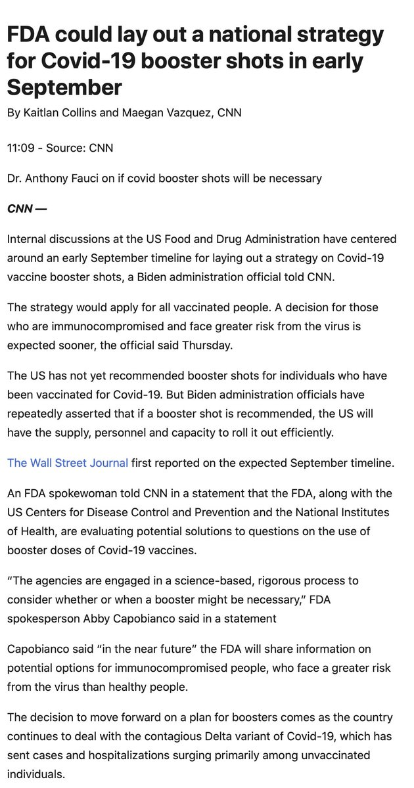

+++
title = "Tweets by Eric Topol Aug 05"
Summary = ""
tags = ["Twitter"]
category = "Twitter"
+++

---

<a href="https://twitter.com/erictopol/status/1423098035408564225" target="_blank" rel="noreferer">01:46 UCT</a>

There really are 2 lines, not 1, for the US and Israel 4th wave ascents.
Israel is quickly getting people age &gt;60 with booster shots, 11% in 3 days; it'll be important to watch for impact in the weeks ahead
https://twitter.com/erlichya/status/1422785542329151490 

<a href="E7_bAouVEAI2J0k.jpg"  ></img></a>

---

<a href="https://twitter.com/erictopol/status/1423117888991367168" target="_blank" rel="noreferer">03:05 UCT</a>

The @Newsweek magazine must be getting desperate for sales to go with this cover. Delta is bad enough; there's no clinical evidence that Delta "Plus" or Lambda provide competition with it. Let's not make bad matters worse and beat this *&amp;^%'in🦠 

<a href="E7_qEZjVgAIcGwC.jpg"  ></img></a>

---

<a href="https://twitter.com/erictopol/status/1423269949384974338" target="_blank" rel="noreferer">13:09 UCT</a>

The striking relationship between vaccination and hospitalization in US states. 
[#VaccinesWork vs Delta, in case you didn't know that]
https://www.ft.com/content/21ed4e9c-2b20-4a9d-bf38-6b76212beef8 by @jburnmurdoch and @nikasgari @FT 

<a href="E8B4AxMVUAANn8_.jpg"  ></img></a>

---

<a href="https://twitter.com/erictopol/status/1423273360918679562" target="_blank" rel="noreferer">13:23 UCT</a>

A preventable pandemic record set in FL with LA and AR not far behind 

<a href="E8B7XeHUUBQSyix.jpg"  ></img></a>

---

<a href="https://twitter.com/erictopol/status/1423278952160788491" target="_blank" rel="noreferer">13:45 UCT</a>

And preventable deaths, too 

<a href="E8CAoceUcAMLnHA.jpg"  ></img></a>

---

<a href="https://twitter.com/erictopol/status/1423287725604544519" target="_blank" rel="noreferer">14:20 UCT</a>

The half-dose might have worked as well (as the full dose) for the 1st and 2nd doses, based on a randomized trial that looked at immune response https://twitter.com/megtirrell/status/1423244672676343812

---

<a href="https://twitter.com/erictopol/status/1423308870944923655" target="_blank" rel="noreferer">15:44 UCT</a>

We've now exceeded hospitalizations in the 1st and 2nd waves, but an additional concern is their rate of rise in the 4th, Delta wave. 
That this has happened w/ a surfeit of vaccines reflects both how formidable this strain is and our big miss in not suppressing it far better 

<a href="E8CZwMAVEAs0YZH.jpg"  ></img></a>

---

<a href="https://twitter.com/erictopol/status/1423323609628483589" target="_blank" rel="noreferer">16:42 UCT</a>

@kaitlancollins That's right. All such data should be partitioned AD and PD (before and after Delta was the dominant strain). That it's not available is yet another serious issue of our tracking deficiency.

---

<a href="https://twitter.com/erictopol/status/1423325690343038978" target="_blank" rel="noreferer">16:51 UCT</a>

The US per capita and rate of rise in its Delta wave is also more pronounced than UK or Israel, both with considerably higher fully vaccination rates 

<a href="E8CrJ-CUYAMqSUE.jpg"  ></img></a>

---

<a href="https://twitter.com/erictopol/status/1423334547962294273" target="_blank" rel="noreferer">17:26 UCT</a>

Off the chart
Good on Canada for needing an expanded Y-axis 

<a href="E8CzC5GVkAIP3X0.jpg"  ></img></a>

---

<a href="https://twitter.com/erictopol/status/1423338168690962434" target="_blank" rel="noreferer">17:40 UCT</a>

@seanmsinden yes, exceeding UK, duly noted

---

<a href="https://twitter.com/erictopol/status/1423349179259129857" target="_blank" rel="noreferer">18:24 UCT</a>

Great to see this profile feature on @j_g_allen in @ScienceMagazine today. He has been a leading light for the pandemic for the importance of air quality, masks, ventilation and more https://science.sciencemag.org/content/373/6555/612
by @douglasstar with @ScienceVisuals 

<a href="E8C_3MmUcAAoVrR.jpg"  ></img></a><a href="E8C_4k3VEAU9CHy.jpg"  ></img></a>

---

<a href="https://twitter.com/erictopol/status/1423366385871200258" target="_blank" rel="noreferer">19:32 UCT</a>

It's August 2021, where are the rapid antigen tests that should have been supplied for free for every household to accurately screen for infectiousness—which is what really matters? The tests that were ready here in May 2020. https://www.wsj.com/articles/demand-for-covid-19-tests-and-wait-times-rebound-as-delta-variant-spreads-11628162222 @sharonterlep @Brabbott42 

<a href="E8DPRHMVoAI23Nu.jpg"  ></img></a>

---

<a href="https://twitter.com/erictopol/status/1423368244803506179" target="_blank" rel="noreferer">19:40 UCT</a>

Fear from Delta plus mandates have led to the best US vaccination day in well over a month, with &gt;580,000 newbies and &gt;860,000 total. We need this trend to continue and get back into the millions/day 

<a href="E8DRRHcVoAAesOl.jpg"  ></img></a>

---

<a href="https://twitter.com/erictopol/status/1423381286371033091" target="_blank" rel="noreferer">20:31 UCT</a>

We still don't know to what extent boosters (vs the original strain) will prevent Delta infections
But we're seeing the start of "booster-mania"
People going to drugstores, lying about their vaccination status
W/ imminent full FDA approval, doctors can prescribe them for anyone

---

<a href="https://twitter.com/erictopol/status/1423415602744492037" target="_blank" rel="noreferer">22:48 UCT</a>

Many people are thinking about or have obtained antibody (Ab) tests after vaccination. This figure is very helpful, but there are a couple of issues
—We don't know correlation of these Abs, or their levels vs Delta
—They are not recommended https://www.fda.gov/medical-devices/safety-communications/antibody-testing-not-currently-recommended-assess-immunity-after-covid-19-vaccination-fda-safety  https://twitter.com/VirusesImmunity/status/1423403916058845184

<a href="E8D8tzrUYAELDO5.jpg"  ></img></a>

---

<a href="https://twitter.com/erictopol/status/1423420208618762243" target="_blank" rel="noreferer">23:06 UCT</a>

You can freely access it here
https://www.sciencemag.org/news/2021/08/scientist-says-cleaning-indoor-air-could-make-us-healthier-and-smarter
It's a good thing he failed his FBI exam!

---

<a href="https://twitter.com/erictopol/status/1423422014690189313" target="_blank" rel="noreferer">23:13 UCT</a>

Good to see a US booster plan is (finally) in the works
https://www.wsj.com/articles/fda-covid-19-vaccine-booster-plan-could-be-ready-within-weeks-11628194767?mod=latest_headlines by @StephArmour1 @JaredSHopkins   https://www.cnn.com/2021/08/05/politics/fda-covid-booster-shot/index.html by @kaitlancollins @maeganvaz 

<a href="E8EB4fkUYAMd3Gu.jpg"  ></img></a><a href="E8ECPDXVkAMinLN.jpg"  ></img></a><a href="E8ECREpVoAMfRBy.jpg"  ></img></a>