+++
title = "Tweets by Eric Topol Aug 06"
Summary = ""
tags = ["Twitter"]
category = "Twitter"
+++

---

<a href="https://twitter.com/erictopol/status/1423438139721281536" target="_blank" rel="noreferer">00:17 UCT</a>

Tomorrow we’ll get a new @PHE_uk report, but I wouldn’t be surprised that the vaccine effectiveness vs Delta infections will have declined, in keeping with the large, new UK study below https://twitter.com/EricTopol/status/1422960935212179457

---

<a href="https://twitter.com/erictopol/status/1423450691574460417" target="_blank" rel="noreferer">01:07 UCT</a>

Exhibit A
https://www.wsj.com/articles/third-covid-shot-vaccine-immunity-israel-study-11628089557 

<a href="E8EcbVtVUAUS8cC.png"  >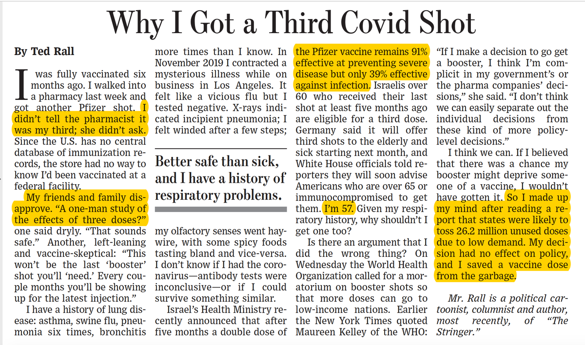</img></a>

---

<a href="https://twitter.com/erictopol/status/1423489026112118789" target="_blank" rel="noreferer">03:40 UCT</a>

We're half-way to the 3rd wave peak in cases/day and doing half as many tests/day as we did at that time 

<a href="E8E_bDiVIAgqy_6.jpg"  >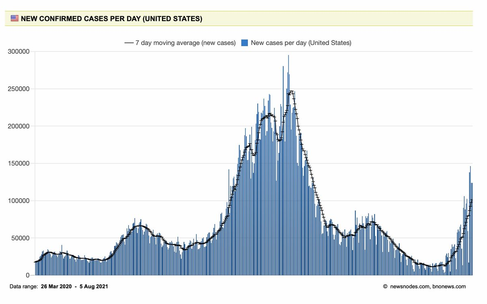</img></a>

---

<a href="https://twitter.com/erictopol/status/1423492365415636992" target="_blank" rel="noreferer">03:53 UCT</a>

And nearly half-way to peak hospitalizations 

<a href="E8FCmVzVoAYb8Qq.jpg"  >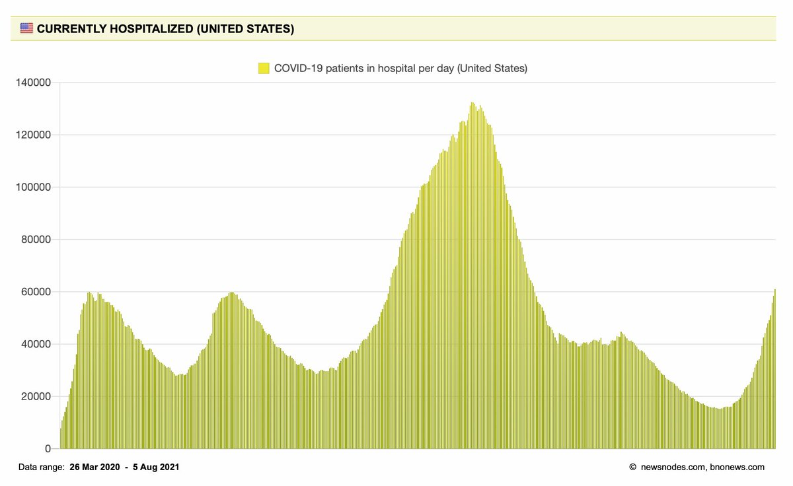</img></a>

---

<a href="https://twitter.com/erictopol/status/1423511369232445444" target="_blank" rel="noreferer">05:08 UCT</a>

The Israeli data for increased mRNA-vaccination breakthrough infections and "waning immunity" is finally available 
https://www.medrxiv.org/content/10.1101/2021.08.03.21261496v1?__cf_chl_jschl_tk__=pmd_e2ea998b4d62d17a2afd596b60deedbd98393a3c-1628225627-0-gqNtZGzNAfijcnBszQfi h/t @Aiims1742 
Overall 2X risk, no statistical significant difference between age groups, but trend of increase w/ age 

<a href="E8FT4xlVkAMuX_W.jpg"  ></img></a>

---

<a href="https://twitter.com/erictopol/status/1423519591414734849" target="_blank" rel="noreferer">05:41 UCT</a>

2 additional points
—There is a major confounder with Delta infections (93% of samples assessed at time of breakthroughs), no linkage with neutralizing antibody data. Cannot conclude “waning immunity” from these data
—The low 2% rate in the midst of Delta is actually reassuring.

---

<a href="https://twitter.com/erictopol/status/1423525698547838979" target="_blank" rel="noreferer">06:05 UCT</a>

@Bob_Wachter I sure hope there's more evidence than this to launch the 3rd shot campaign on the basis of "waning immunity."  There needs to be data to show correlation with nAbs to address the Delta confounder. And there's nothing in the preprint on clinical outcomes.

---

<a href="https://twitter.com/erictopol/status/1423651004428406785" target="_blank" rel="noreferer">14:23 UCT</a>

New data (via press briefing) on the 1-shot J&amp;J vaccine in &gt;477,000 health care workers support high level of protection, including during the South African Delta wave. Look forward to seeing the dataset but certainly encouraging
https://www.reuters.com/business/healthcare-pharmaceuticals/safrican-study-shows-jj-vaccine-protects-against-death-co-lead-investigator-says-2021-08-06/ 

<a href="E8HSRD2VoA4yP9i.png"  >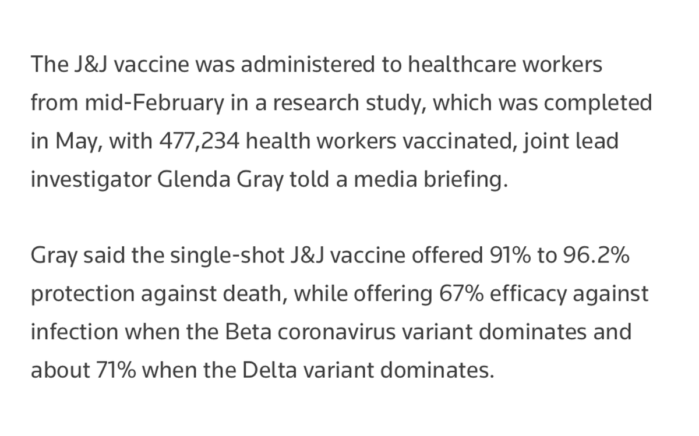</img></a>

---

<a href="https://twitter.com/erictopol/status/1423653927644401674" target="_blank" rel="noreferer">14:35 UCT</a>

The rapid ascent of hospitalizations in the US, already exceeding 60,000, shows no sign of slowing, distinct from the pattern in the UK and Israel to date, 2 countries w/ much higher % fully vaccinated 
@OurWorldInData 

<a href="E8HVamAUUAM0H01.jpg"  >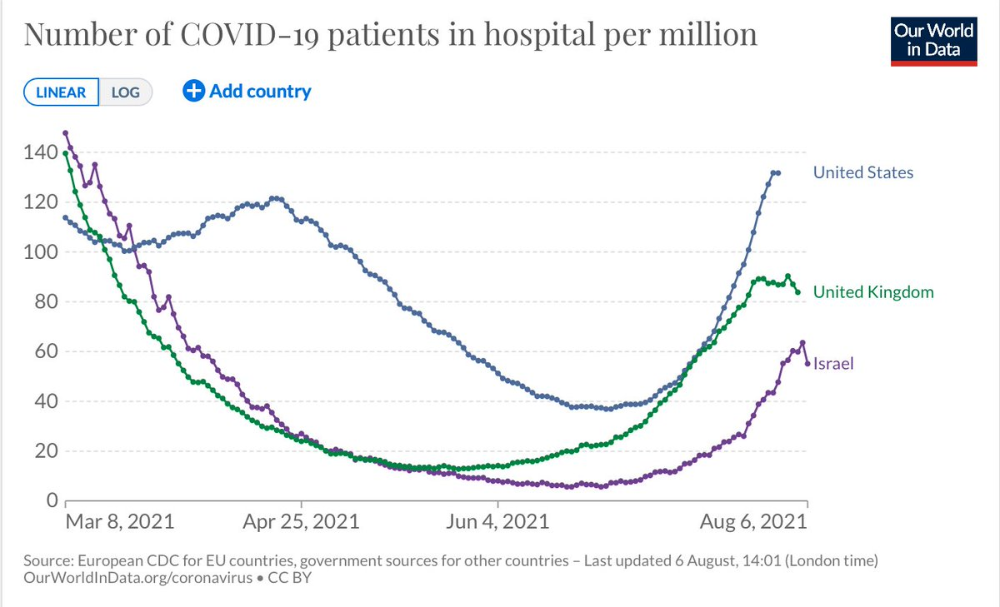</img></a>

---

<a href="https://twitter.com/erictopol/status/1423659302867247108" target="_blank" rel="noreferer">14:56 UCT</a>

There appears to be an important  mistake in @reuters reporting since the data, thanks to flagging by @GuerreiroSuado, shows the 71% pertains to protection from hospitalizations, not infections. That is not high relative to 2 dose AZ and mRNA 90+% 
https://sacoronavirus.co.za/wp-content/uploads/2021/08/Sisonke-Provisional-Results-6-August-2021GG2.pdf 

<a href="E8HaUkpUYAMjZak.jpg"  >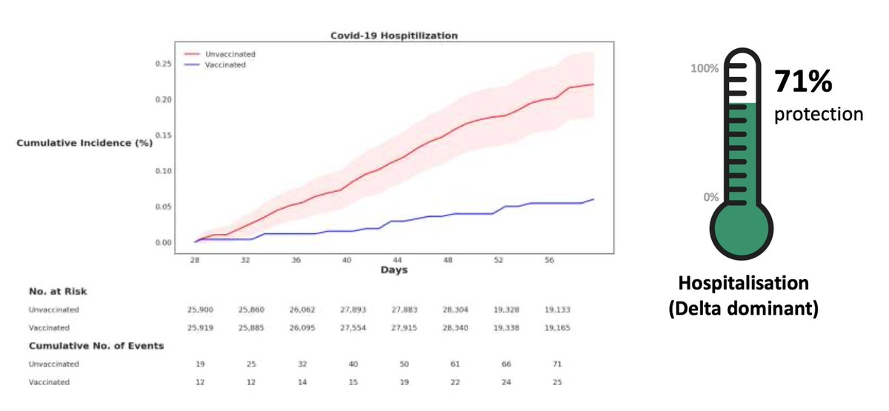</img></a>

---

<a href="https://twitter.com/erictopol/status/1423669985646288907" target="_blank" rel="noreferer">15:39 UCT</a>

New @PHE_uk report today provides data to support the high viral load (low Ct) is similar for Delta infections among unvaccinated (17.8) and vaccinated (18.0) https://assets.publishing.service.gov.uk/government/uploads/system/uploads/attachment_data/file/1009243/Technical_Briefing_20.pdf 

<a href="E8HkBUNVoAc8K-b.jpg"  >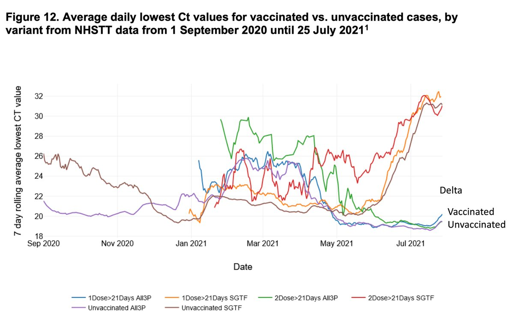</img></a>

---

<a href="https://twitter.com/erictopol/status/1423673657402949644" target="_blank" rel="noreferer">15:53 UCT</a>

From the new variant @PHE_UK report, @GISAID prevalence data on the Lambda variant would argue it is not going to compete with Delta or other circulating variants
https://assets.publishing.service.gov.uk/government/uploads/system/uploads/attachment_data/file/1009063/Variants_of_Concern_Variant_Data_Update_10.pdf 

<a href="E8HnUaFVcAksYN3.jpg"  ></img></a>

---

<a href="https://twitter.com/erictopol/status/1423674399710879744" target="_blank" rel="noreferer">15:56 UCT</a>

This excellent thread by @miamalan presents the data clearly and avoids confusion engendered by the press coverage https://twitter.com/miamalan/status/1423531025313976322

---

<a href="https://twitter.com/erictopol/status/1423698071112753153" target="_blank" rel="noreferer">17:30 UCT</a>

An update on Delta, vaccination protection and viral loads from the aggregate data available, with new @PHE_uk data
1. Delta infections are characterized by very high viral loads (low Cts). When a breakthrough occurs, the load is similar to unvaccinated, but clears more rapidly 

<a href="E8H6Ut-VcAEepPD.jpg"  ></img></a>

---

<a href="https://twitter.com/erictopol/status/1423698078775726080" target="_blank" rel="noreferer">17:30 UCT</a>

3. The totality of the data suggests VE for mRNA vaccines vs Delta infections has been substantially reduced, ~95% vs ancestral strain, now 50-60% vs Delta, particularly noting new REACT data
OTOH VE vs hospitalizations &amp; death is holding up well, &gt; 95% (J&amp;J data today 71%)

---

<a href="https://twitter.com/erictopol/status/1423698076762480644" target="_blank" rel="noreferer">17:30 UCT</a>

2. Although the new @PHE_uk on effectiveness (VE) remains unchanged vs. Delta, it doesn't break out mRNA and AZ
https://assets.publishing.service.gov.uk/government/uploads/system/uploads/attachment_data/file/1008919/Vaccine_surveillance_report_-_week_31.pdf 

<a href="E8H8PStUYAIyski.jpg"  >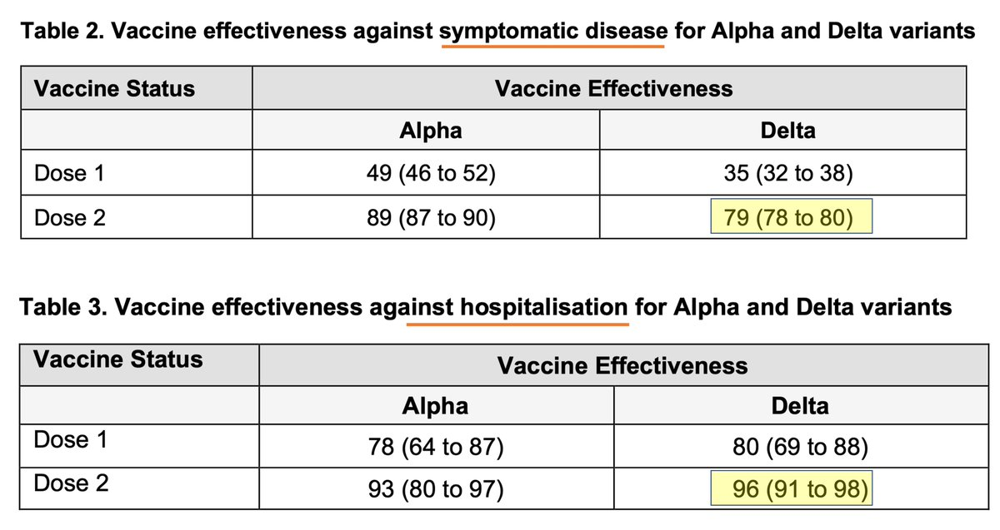</img></a>

---

<a href="https://twitter.com/erictopol/status/1423700729705865217" target="_blank" rel="noreferer">17:41 UCT</a>

4. A new @CDCMMWR report today on Delta outbreak in Mesa County, Colorado has an estimated vaccine effectiveness of 78% (vs symptomatic infection)
https://www.cdc.gov/mmwr/volumes/70/wr/mm7032e2.htm?s_cid=mm7032e2_w
Calls for "masking in indoor settings irrespective of vaccination status" in areas of high Delta incidence

---

<a href="https://twitter.com/erictopol/status/1423708891116818432" target="_blank" rel="noreferer">18:13 UCT</a>

What about B.1.621, a variant w/o a Greek letter, with some key mutations including N501Y, E484K, P681H seen in other major VOCs (mutation map http://outbreak.info)
See @kallmemeg's great🧵on it. One to watch
https://twitter.com/kallmemeg/status/1423614599778160640 

<a href="E8IHObuVcAEe7gr.jpg"  ></img></a>

---

<a href="https://twitter.com/erictopol/status/1423709632921423873" target="_blank" rel="noreferer">18:16 UCT</a>

@JamesSurowiecki Not adjusted, good point, no tracking of this key co-variate

---

<a href="https://twitter.com/erictopol/status/1423710986045825024" target="_blank" rel="noreferer">18:22 UCT</a>

New findings to support why people with prior covid benefit from vaccination: protection from reinfection 
https://www.cdc.gov/mmwr/volumes/70/wr/mm7032e1.htm?s_cid=mm7032e1_w @CDCMMWR 

<a href="E8IJS8fUcAQtBQn.png"  >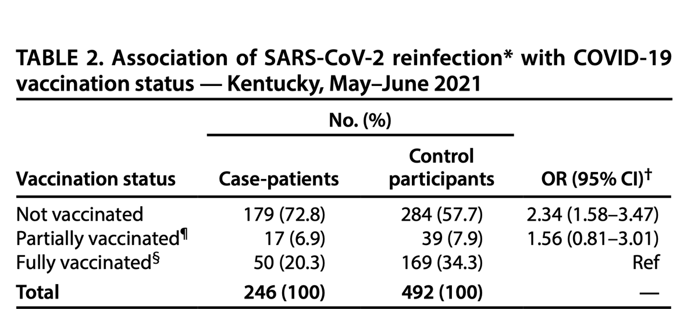</img></a>

---

<a href="https://twitter.com/erictopol/status/1423712894907154435" target="_blank" rel="noreferer">18:29 UCT</a>

We don't yet have data that 3rd shot boosters vs original strain will be effective in preventing Delta infections.
@Pfizer data of higher neutralizing antibodies is based on 23 people. No effectiveness data.
The Israeli preprint doesn't connect the dots
https://twitter.com/EricTopol/status/1423511369232445444 

<a href="E8IKsFWVEAAhcHa.jpg"  >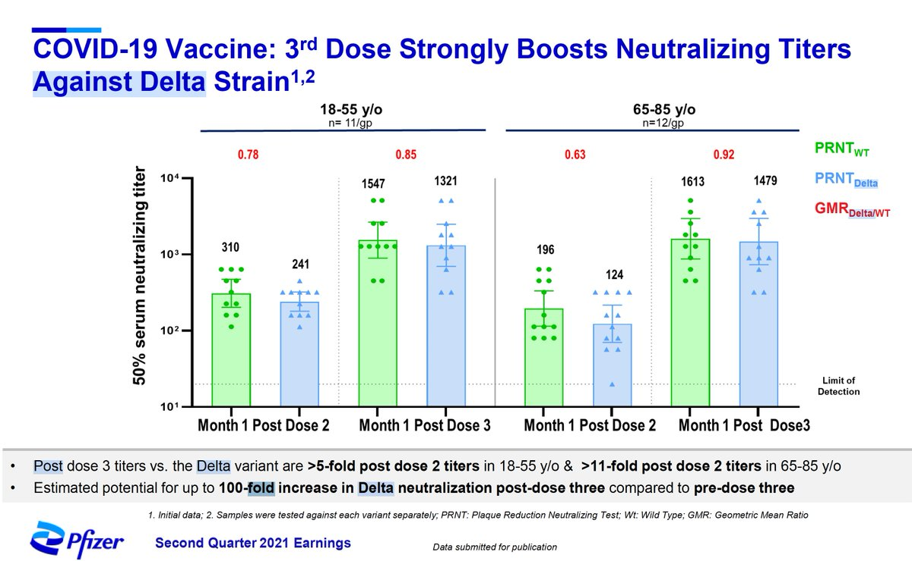</img></a>

---

<a href="https://twitter.com/erictopol/status/1423715825114968068" target="_blank" rel="noreferer">18:41 UCT</a>

@nataliexdean @PHE_uk 💯 Natalie
We'd be totally lost without @PHE_UK, #RECOVERY trials, 
@CovidGenomicsUK, @sangerinstitute, @ICNARC and more. The UK's extraordinary efforts are our guiding light here; if only we heeded their warnings in the US

---

<a href="https://twitter.com/erictopol/status/1423718811006472194" target="_blank" rel="noreferer">18:53 UCT</a>

Well above pandemic peak 
I just hope Florida is not the US Delta wave bellwether 

<a href="E8IQbXTVIAAuBW2.jpg"  >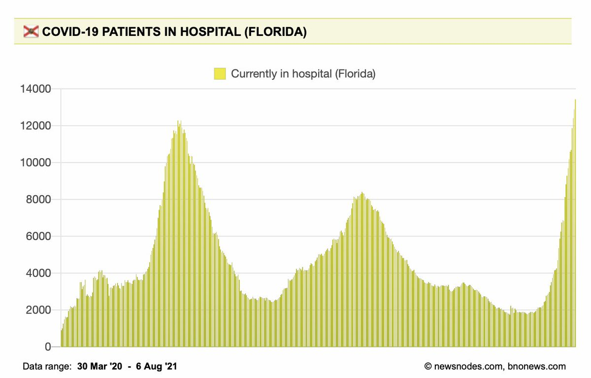</img></a>

---

<a href="https://twitter.com/erictopol/status/1423720474484174853" target="_blank" rel="noreferer">18:59 UCT</a>

@thehowie With test positivity &gt; 22% you can imagine what the real case N is 

<a href="E8IR-dPVkAEAABO.jpg"  >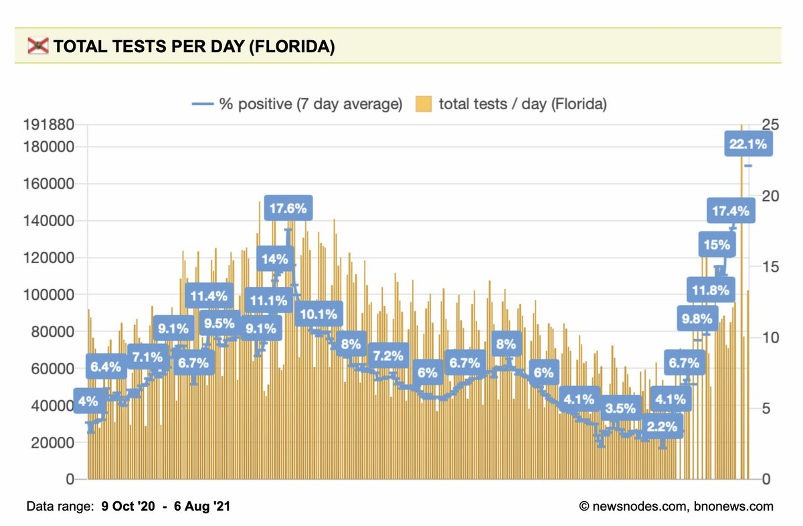</img></a>

---

<a href="https://twitter.com/erictopol/status/1423726051474108417" target="_blank" rel="noreferer">19:21 UCT</a>

Just think we live in a country which is incapable of telling us the per cent vaccinated or unvaccinated who require hospitalization for covid. No less any more data about them. Or track breakthrough infections. Thanks @CDCgov. Where is @COVID19Tracking when we need them?

---

<a href="https://twitter.com/erictopol/status/1423727490422370307" target="_blank" rel="noreferer">19:27 UCT</a>

@annbittinger Horrifying. Tragic. Preventable.

---

<a href="https://twitter.com/erictopol/status/1423735700969558017" target="_blank" rel="noreferer">20:00 UCT</a>

And going beyond natural infection immunity w/ 1-dose mRNA vaccination (better than 2-doses)
https://jamanetwork.com/journals/jamanetworkopen/fullarticle/2782762 @JAMANetworkOpen

---

<a href="https://twitter.com/erictopol/status/1423735699157577737" target="_blank" rel="noreferer">20:00 UCT</a>

On natural immunity from Covid
"Antibody levels and neutralizing capacity are generally maintained up to 7.7 months, and in a substantial number of individuals antibody levels increase after some months after symptom onset"
https://www.nature.com/articles/s41467-021-24979-9 

<a href="E8Ifag_UUAAnn9f.jpg"  ></img></a>

---

<a href="https://twitter.com/erictopol/status/1423742110562324480" target="_blank" rel="noreferer">20:25 UCT</a>

I'd take the 1:10 odds for vaccinated: not vaccinated
Getting a Delta infection in San Diego County (pop 3.5 million), current data 
#VaccinesWork against Delta
@SDCountyHHSA 

<a href="E8IlqTTVEAMiWW2.jpg"  >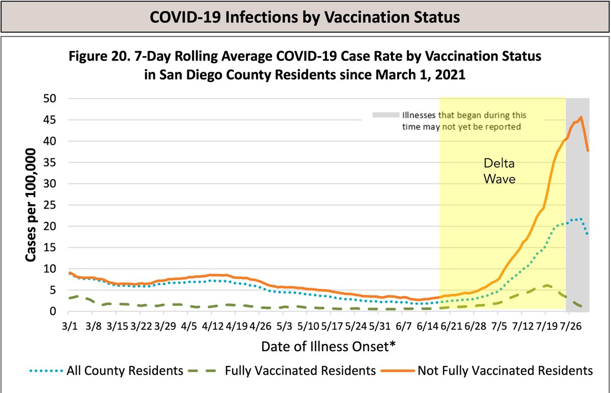</img></a>

---

<a href="https://twitter.com/erictopol/status/1423744034833502208" target="_blank" rel="noreferer">20:33 UCT</a>

@byelin Agree!

---

<a href="https://twitter.com/erictopol/status/1423744908628664321" target="_blank" rel="noreferer">20:36 UCT</a>

Point #2: The protective benefit (gradient of risk) of vaccinations has been augmented during the Delta wave, even with the increasing, yet low per cent of breakthrough infections among fully vaccinated here.
Hello @CDCgov
We need these data for the US!

---

<a href="https://twitter.com/erictopol/status/1423752623803359235" target="_blank" rel="noreferer">21:07 UCT</a>

@MarcGoldwein @JAMANetworkOpen Significantly higher #SARSCoV2 antibody response for prior covid plus one dose vaccination (compared with 2 dose mRNA), a consistent finding across many studies now

---

<a href="https://twitter.com/erictopol/status/1423764222220009478" target="_blank" rel="noreferer">21:53 UCT</a>

Not a good sign when the #2 most populous US state gets to nearly 20,000 cases in a day or the rate of rise in hospitalizations looks like this 

<a href="E8I5-pMVcAE2Bs_.jpg"  >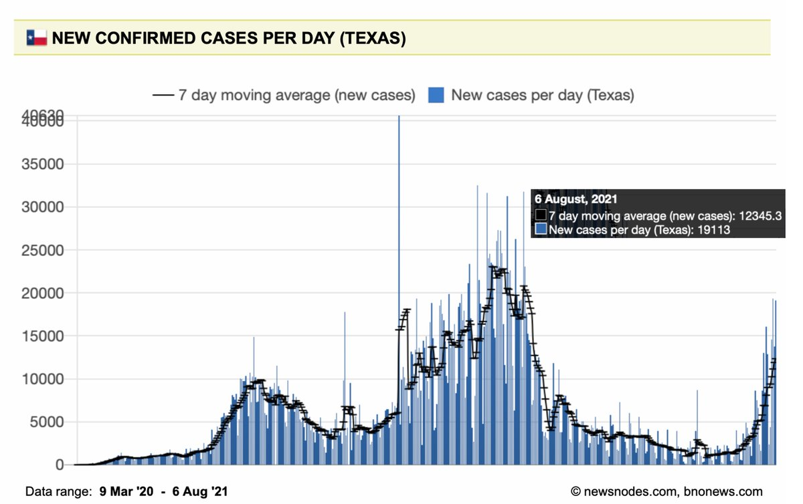</img></a><a href="E8I55HdUUAApvVk.jpg"  ></img></a>

---

<a href="https://twitter.com/erictopol/status/1423765160947163140" target="_blank" rel="noreferer">21:57 UCT</a>

@DrTomFrieden 💯 Tom, yet been unproven
https://twitter.com/EricTopol/status/1423712894907154435

---

<a href="https://twitter.com/erictopol/status/1423765679073730561" target="_blank" rel="noreferer">21:59 UCT</a>

@DMKNOWS There is no ADE. This is bullshit. Goodbye

---

<a href="https://twitter.com/erictopol/status/1423779427096293377" target="_blank" rel="noreferer">22:54 UCT</a>

Just published @TheLancet 
A randomized mix and match trial of AZ and Pfizer vaccination in &gt;800 people shows that mixing is safe and can engender at least as good, if not better, immune response 
https://www.thelancet.com/action/showPdf?pii=S0140-6736%2821%2901694-9 by @XinxueLiu and colleagues 

<a href="E8JGaNsUYAAVGcV.jpg"  >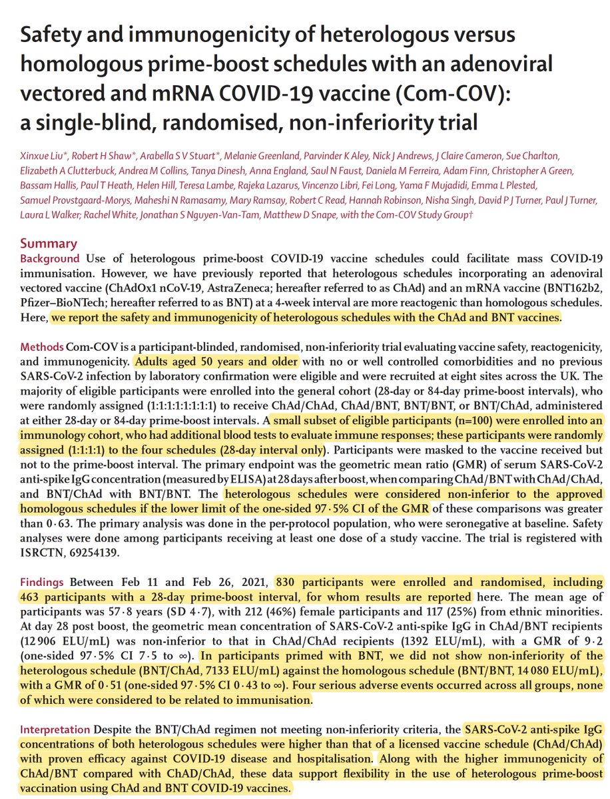</img></a><a href="E8JGY7lVcAAg82P.jpg"  ></img></a>

---

<a href="https://twitter.com/erictopol/status/1423790347386163202" target="_blank" rel="noreferer">23:37 UCT</a>

@FrankLuntz It’s just a guess now, Frank

