+++
title = "Tweets by Eric Topol Aug 07"
Summary = ""
tags = ["Twitter"]
category = "Twitter"
+++

---

<a href="https://twitter.com/erictopol/status/1423818936647254021" target="_blank" rel="noreferer">01:31 UCT</a>

And Delta recurrence in India
https://www.washingtonpost.com/world/2021/08/05/india-delta-variant/ by @NihaMasih and @gerryshih w/ @ashishkjha 

<a href="E8JqVGVVoAMVvPm.jpg"  >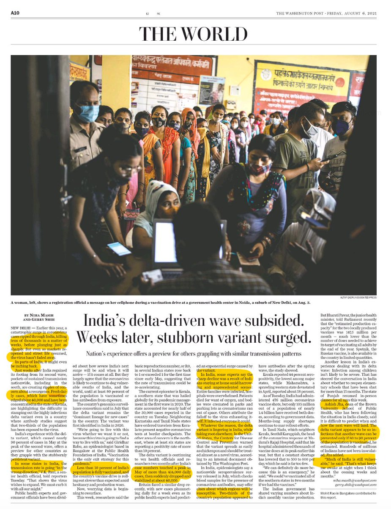</img></a>

---

<a href="https://twitter.com/erictopol/status/1423828289659969538" target="_blank" rel="noreferer">02:08 UCT</a>

Brilliant.  Let's combine a superspreader variant with a superspreader event in the midst of a big surge with over 130,000 new cases today. Only in the USA
https://www.washingtonpost.com/nation/2021/08/06/sturgis-motorocycle-rally-covid-superspreader/ by @TimBella Perfect slogan, too. 

<a href="E8Jz3HtUcAMPjU4.jpg"  >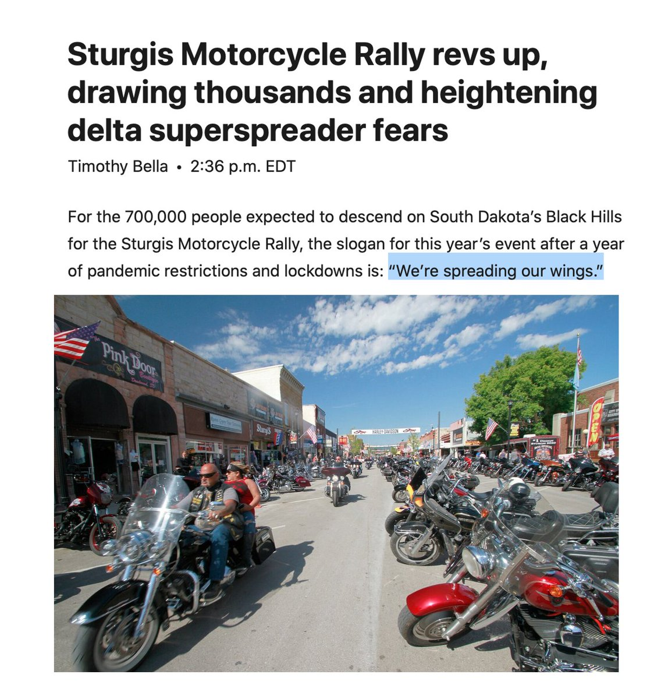</img></a>

---

<a href="https://twitter.com/erictopol/status/1423834171714068483" target="_blank" rel="noreferer">02:31 UCT</a>

This is what happened last year after the rally
The Dakotas had the highest case and death rates in the world; neighboring states affected as well.
Estimated &gt;250,000 new cases 
http://ftp.iza.org/dp13670.pdf
By most accounts, the worst superspreader event in the US pandemic 

<a href="E8J5R3MVkAQViD6.jpg"  >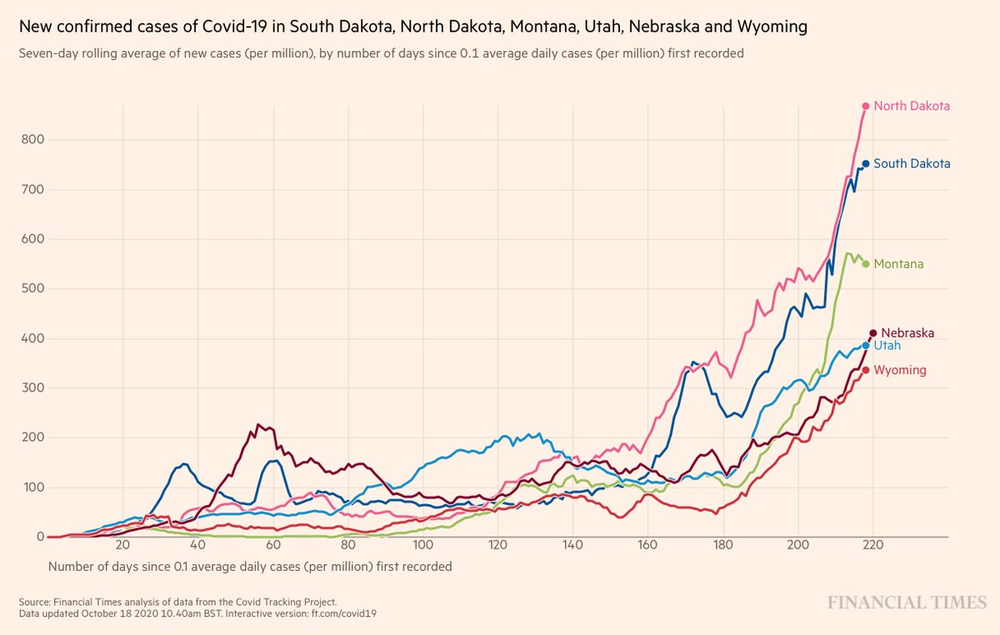</img></a>

---

<a href="https://twitter.com/erictopol/status/1424007107808952325" target="_blank" rel="noreferer">13:58 UCT</a>

The US Delta wave by county vaccination level: relationship with deaths and cases 
https://www.wsj.com/articles/highly-vaccinated-states-keep-worst-covid-19-outcomes-in-check-as-delta-spreads-wsj-analysis-shows-11628328602 

<a href="E8MWmNEUYAAzutS.jpg"  >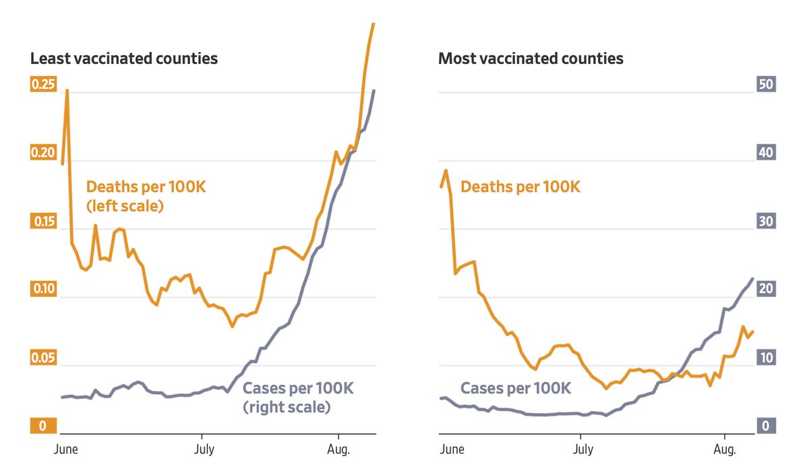</img></a>

---

<a href="https://twitter.com/erictopol/status/1424010346377875457" target="_blank" rel="noreferer">14:11 UCT</a>

"Every state with a higher hospitalization rate than the country overall has a lower vaccination rate"
"Every state with a higher vaccination rate than the country has a lower hospitalization rate"
@WSJGraphics @karadapena @randyyeipWSJ @Brabbott42 @jon_kamp 

<a href="E8MYsafVkAIMLN3.jpg"  >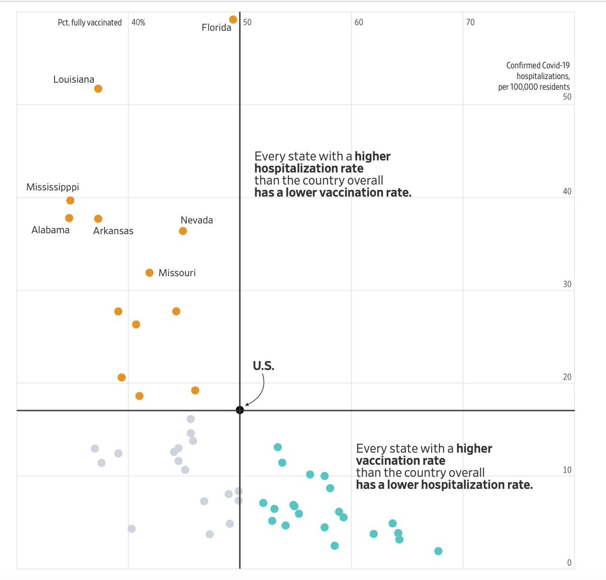</img></a>

---

<a href="https://twitter.com/erictopol/status/1424033514849128449" target="_blank" rel="noreferer">15:43 UCT</a>

Florida is breaking pandemic records each day, not just for hospitalizations. It has the steepest rise of any state for cases, now &gt;90/100,000 Floridians.
Florida &amp; Louisiana have the highest covid cases per capita of any state or country in the world except Botswana (6%💉💉 ) 

<a href="E8MtWlgVIAIamuK.jpg"  >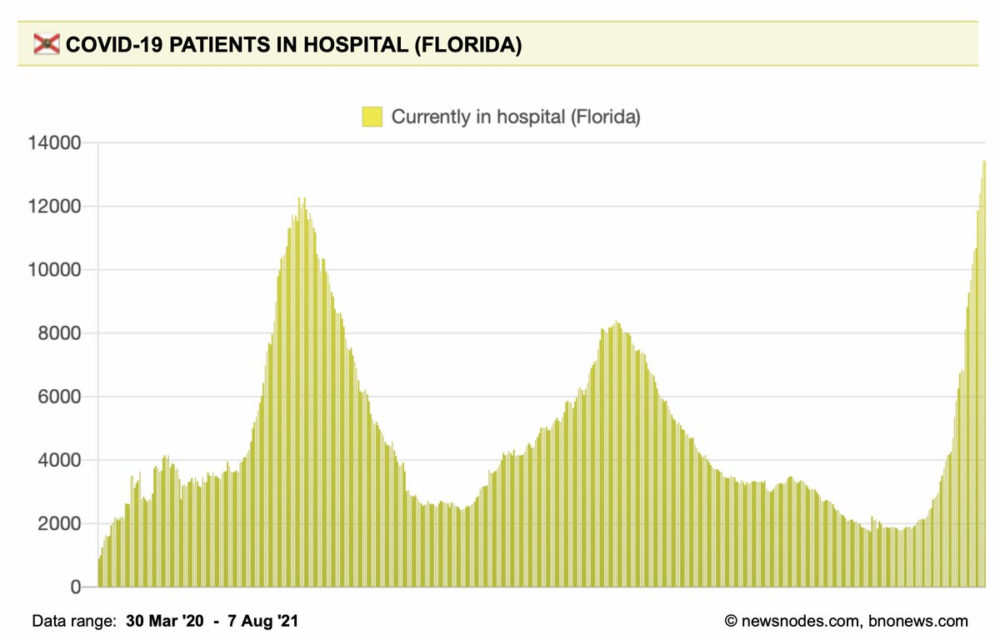</img></a>

---

<a href="https://twitter.com/erictopol/status/1424036875245817863" target="_blank" rel="noreferer">15:57 UCT</a>

The Delta strain is formidable, to say the least. But many countries that are &gt;95% Delta prevalent for infections have turned it around or kept cases in check. It can be done.
@OurWorldInData and % Delta https://cov-spectrum.ethz.ch/explore/Switzerland/AllSamples/AllTimes 

<a href="E8MxnnNVoBQQCpB.jpg"  >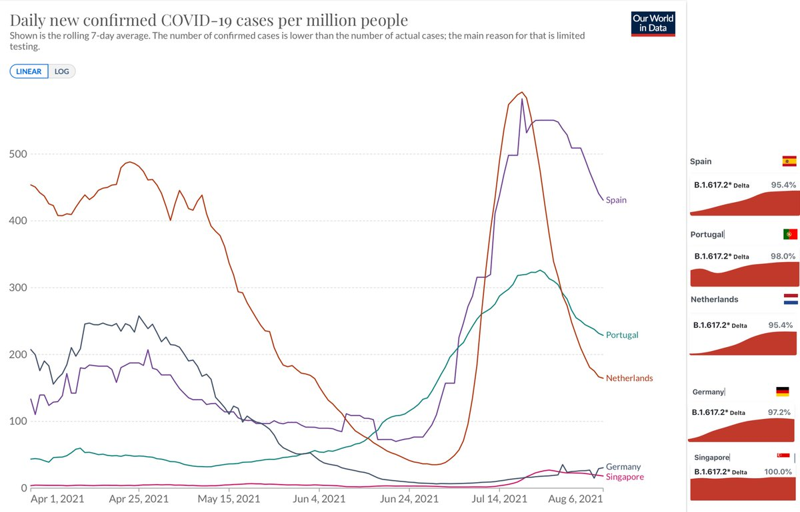</img></a>

---

<a href="https://twitter.com/erictopol/status/1424037875503403011" target="_blank" rel="noreferer">16:01 UCT</a>

"I'm young. I'm healthy. I don't need to be vaccinated or to be worried about getting Delta"
Wrong. 

<a href="E8MyrU-UUAEiabZ.jpg"  >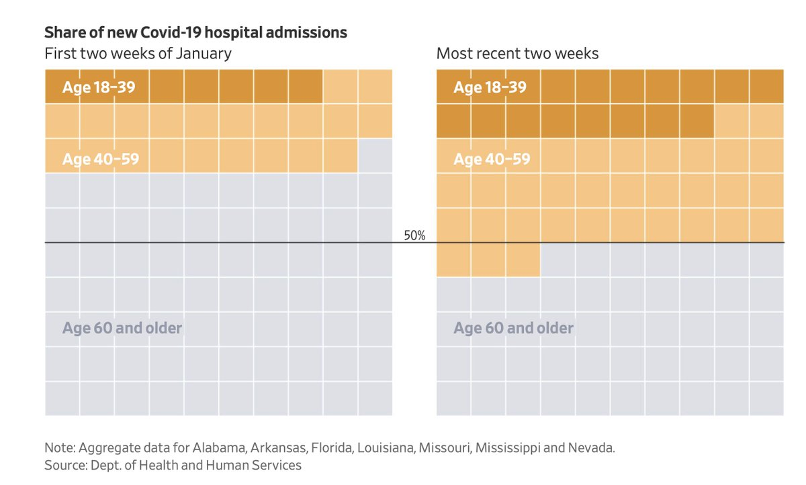</img></a>

---

<a href="https://twitter.com/erictopol/status/1424042230696738816" target="_blank" rel="noreferer">16:18 UCT</a>

Very good interactive infographic for impact of vaccination in 2021 by state https://www.nbcnews.com/specials/data-shows-how-rare-severe-breakthrough-covid-infections-are/index.html by @NBCNews @seenigel @ChicagoEl @pdrbarquinha @jiachuanwu @NBCNewsGraphics 
Here for California: Hospitalizations, deaths and infections 

<a href="E8M16V6VgAg_vBR.jpg"  >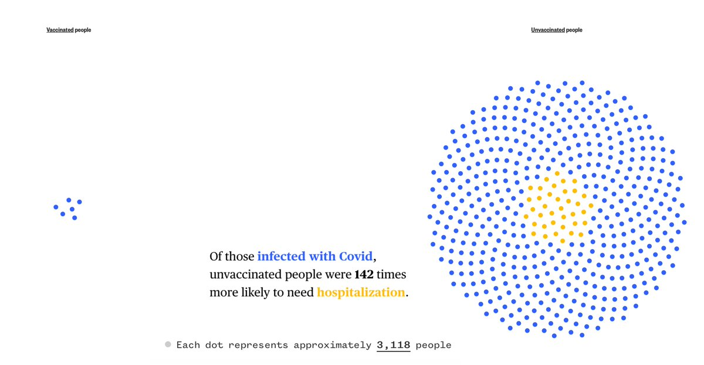</img></a><a href="E8M17z-VUAI-jIm.jpg"  >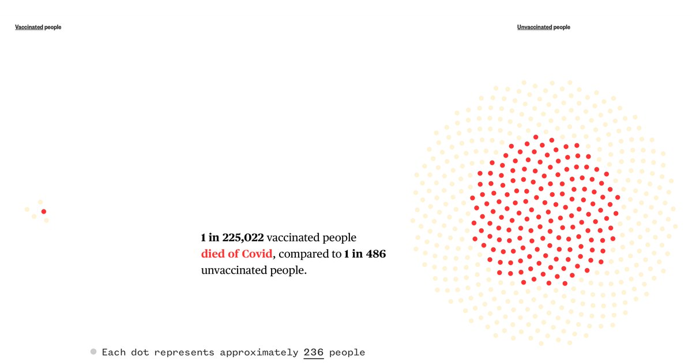</img></a><a href="E8M19GLUcAI1bn0.jpg"  >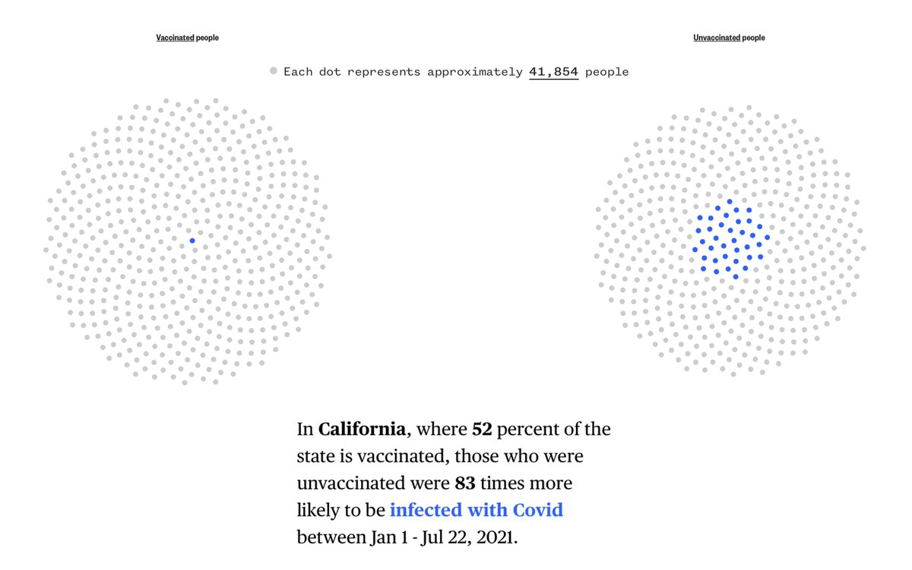</img></a><a href="E8M1-Y1VoAk_Jiz.jpg"  >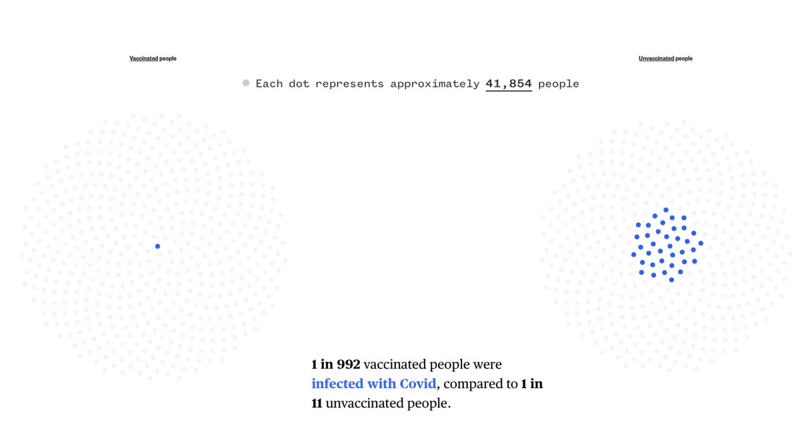</img></a>

---

<a href="https://twitter.com/erictopol/status/1424045874460512257" target="_blank" rel="noreferer">16:32 UCT</a>

"Rapid tests have great potential to help fight the #SARSCoV2 pandemic but only when effective health communication enables people to test and act appropriately." https://www.pnas.org/content/118/32/e2107179118
@PNASNews @CorneliaBetsch @mirjam_jenny @PSprengholz @unierfurt 

<a href="E8M5JUzVoAM7ccs.jpg"  >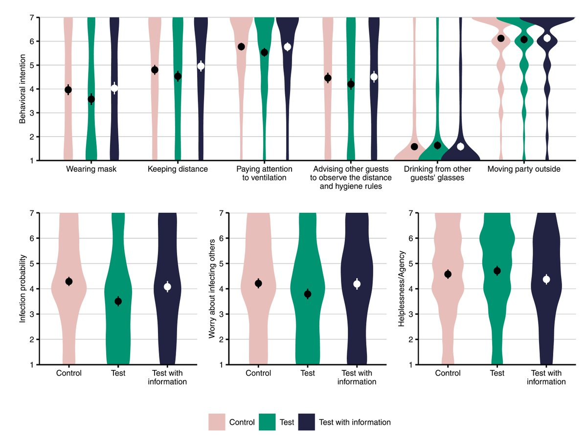</img></a>

---

<a href="https://twitter.com/erictopol/status/1424048240198963200" target="_blank" rel="noreferer">16:42 UCT</a>

New @TheLancet
"The most detailed information reported to date on the clinical and radiological characteristics of vaccine-induced  immune thrombotic thrombocytopenia (VITT)-associated cerebral venous thrombosis"
https://www.thelancet.com/journals/lancet/article/PIIS0140-6736(21)01788-8/fulltext 

<a href="E8M8BxeUYAcfgVP.jpg"  >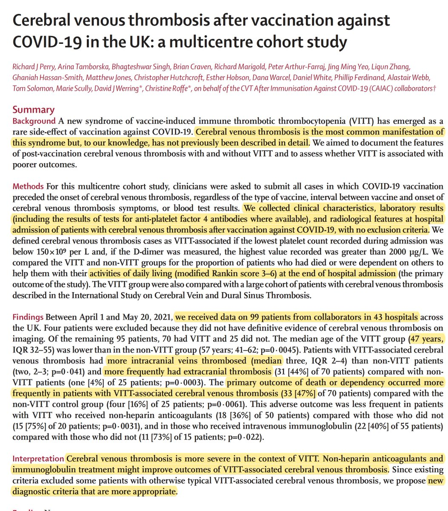</img></a><a href="E8M8DEwVEAIie9f.jpg"  >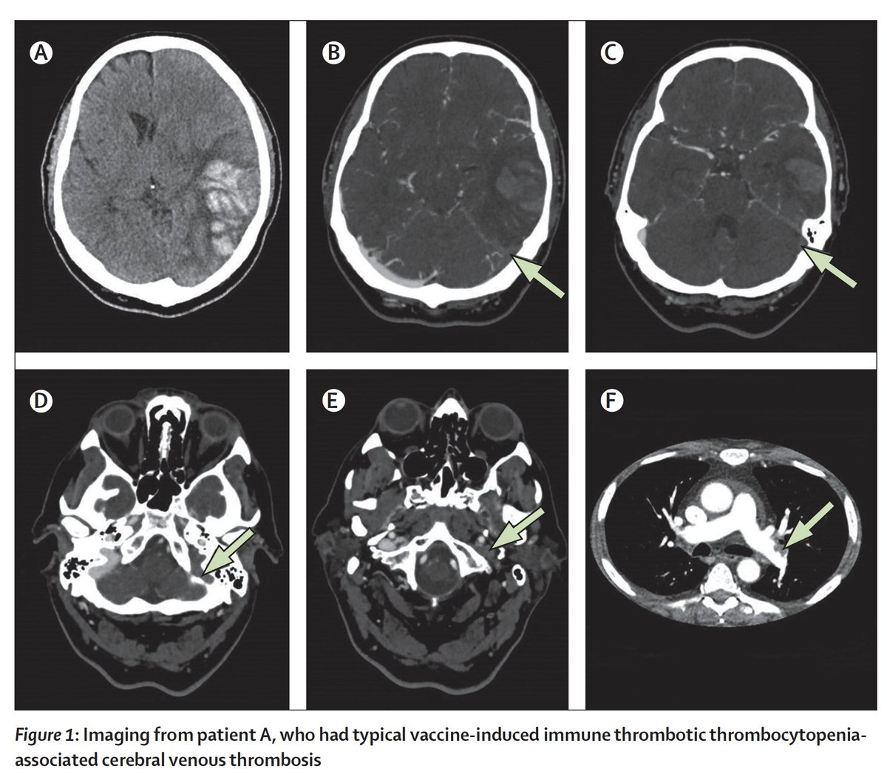</img></a>

---

<a href="https://twitter.com/erictopol/status/1424051658963648515" target="_blank" rel="noreferer">16:55 UCT</a>

Don't give your vaccination a Delta stress test [I should have tm'd that ;-)]
—Mask indoors, highest quality, tightest fit
—Ventilation &amp; air quality/filtration
—Distance whenever possible
—Just because people are vaccinated, doesn't mean they can't be pre-symptomatic or carrier 

<a href="E8M-fmrVcAcrv2W.jpg"  >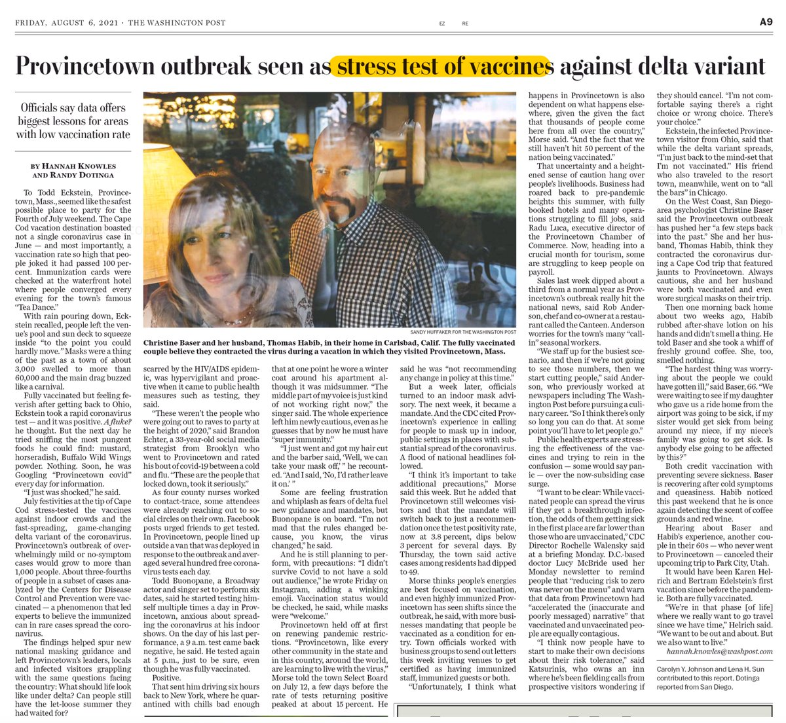</img></a>

---

<a href="https://twitter.com/erictopol/status/1424055824553431041" target="_blank" rel="noreferer">17:12 UCT</a>

This is what you don't want to happen to the cells inside your nose
GIF @nature https://www.nature.com/articles/d41586-021-02039-y 

<a href="https://twitter.com/erictopol/status/1424055824553431041" target="_blank" rel="noreferer">Annimation or video</a>

---

<a href="https://twitter.com/erictopol/status/1424060673005264897" target="_blank" rel="noreferer">17:31 UCT</a>

How are vaccines holding up against Delta?
Updated table with latest data, including new J&amp;J trial.
Notable is the decline for protection of mRNAs vs infections (still very solid vs hospitalizations and deaths)
More on that in 🧵below  https://twitter.com/EricTopol/status/1423698071112753153 

<a href="E8NG9yXUcAYTYON.jpg"  >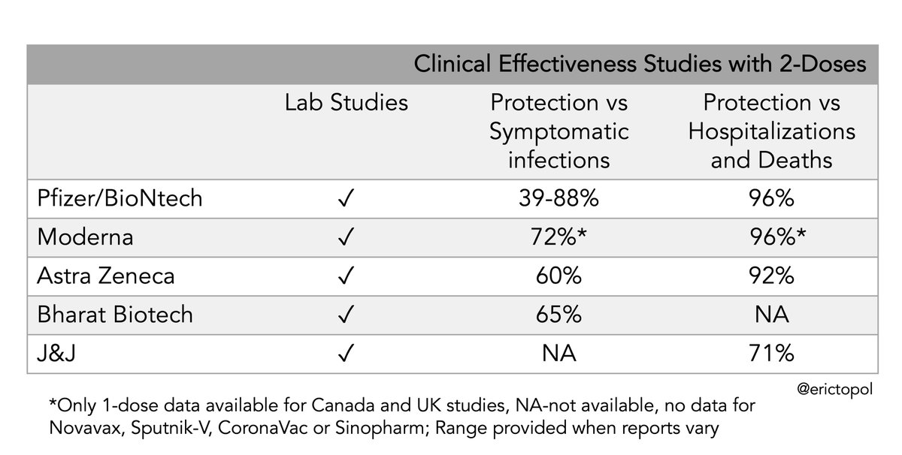</img></a>

---

<a href="https://twitter.com/erictopol/status/1424078985030377473" target="_blank" rel="noreferer">18:44 UCT</a>

Is this 🦠 a challenge?
The situation in Iceland, now vertical in case rise, yet one of the most fully vaccinated countries in the world. No sequence data available http://outbreak.info, assuming this is d/t Delta 

<a href="E8NYIG4UUAEjD55.jpg"  >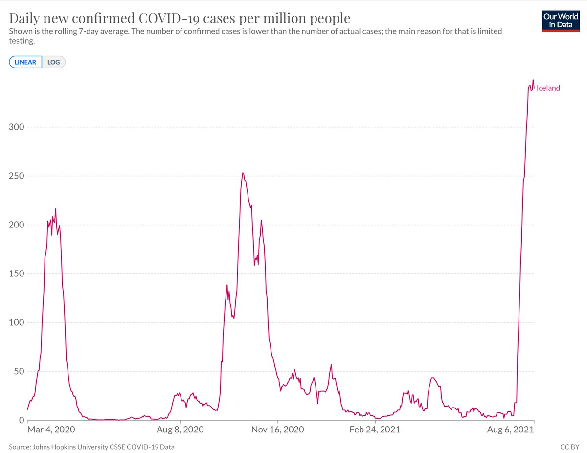</img></a><a href="E8NXoAoUcAETNDt.jpg"  ></img></a>

---

<a href="https://twitter.com/erictopol/status/1424091826810626052" target="_blank" rel="noreferer">19:35 UCT</a>

In other words, don't forget this famous @MackayIM defense and that "no single intervention is perfect at preventing spread" 

<a href="E8NjzQ3VIAM2oNM.jpg"  >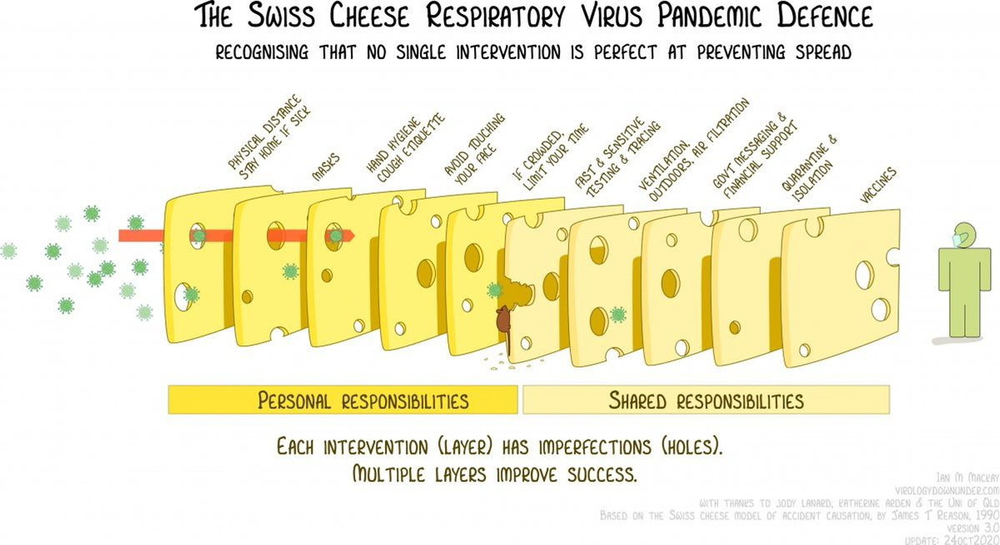</img></a>

---

<a href="https://twitter.com/erictopol/status/1424106174895378434" target="_blank" rel="noreferer">20:32 UCT</a>

@JamesSurowiecki Agree. Just pointing out the challenge even in a country that has had model performance of containment and vaccination throughout the whole pandemic.

---

<a href="https://twitter.com/erictopol/status/1424112178798358530" target="_blank" rel="noreferer">20:56 UCT</a>

Delta D, a sub-lineage or clade that has evolved from Delta (B.1.617.2), has unclear functional significance (vs Delta), and is now accounting for most cases throughout the world
 https://www.medrxiv.org/content/10.1101/2021.08.05.21261642v1 and https://outbreak.info/situation-reports?pango=B.1.617.2 

<a href="E8N1lSmVcAA_iI1.jpg"  >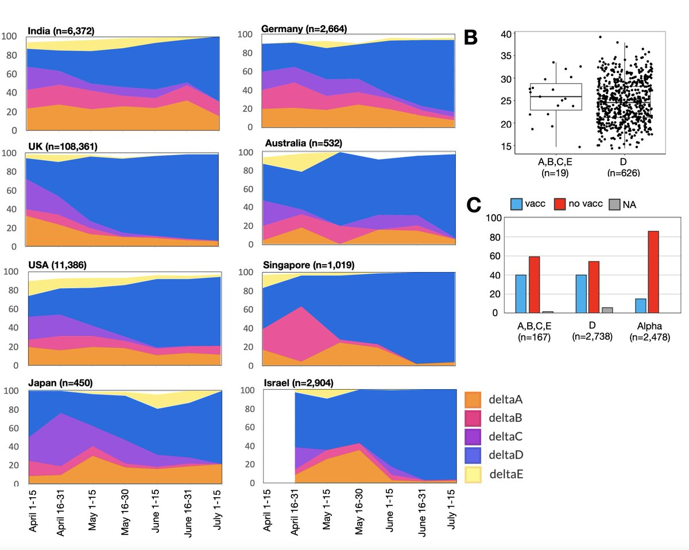</img></a><a href="E8N2WoCUcAEMda8.jpg"  >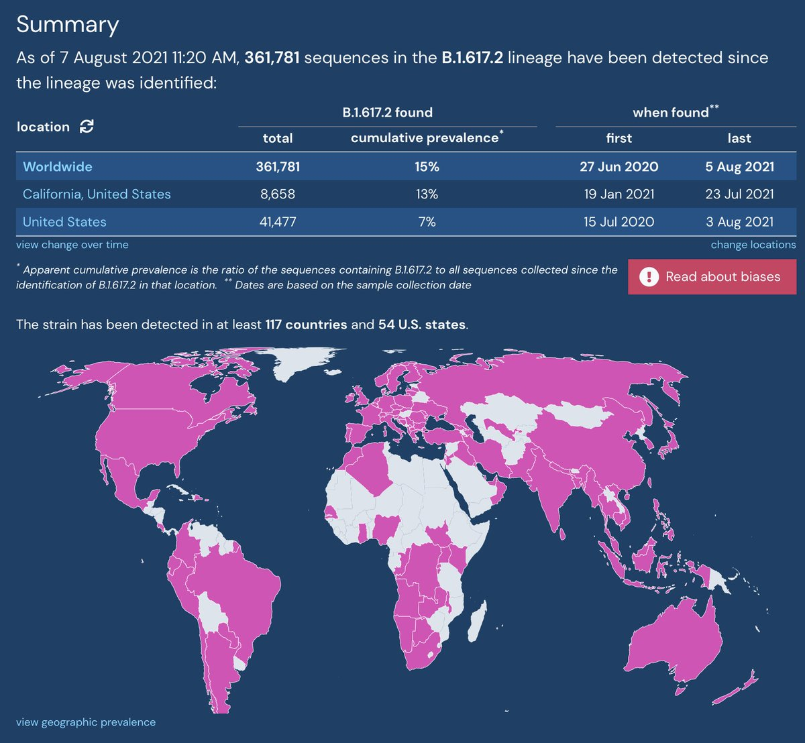</img></a>

---

<a href="https://twitter.com/erictopol/status/1424115176450641922" target="_blank" rel="noreferer">21:08 UCT</a>

What you get for the low, low price of nearly $4 trillion a year
https://www.washingtonpost.com/world/2021/08/05/global-health-rankings/ @commonwealthfnd by @ClaireParkerDC 
https://www.commonwealthfund.org/publications/fund-reports/2021/aug/mirror-mirror-2021-reflecting-poorly 

<a href="E8N3BccVgAEW_dQ.jpg"  >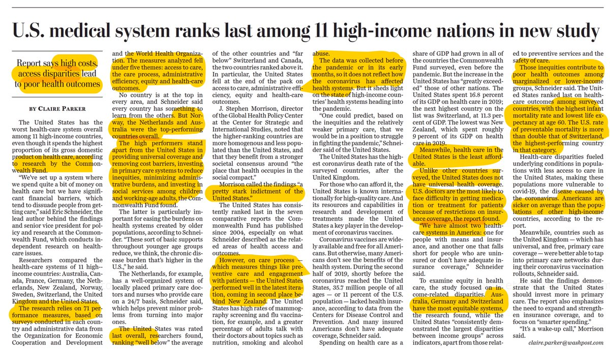</img></a><a href="E8N4_DyUUAQPqLM.jpg"  >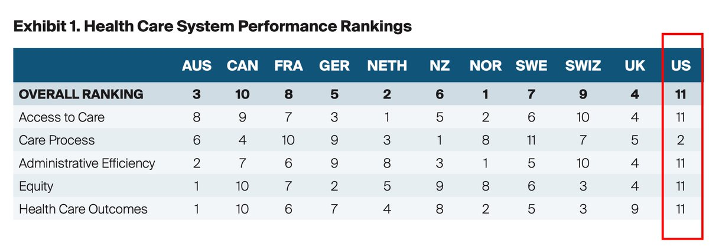</img></a><a href="E8N5BewVEAQ2Yb6.jpg"  ></img></a><a href="E8N5DSJVEAEXhDt.jpg"  ></img></a>

---

<a href="https://twitter.com/erictopol/status/1424120089066967041" target="_blank" rel="noreferer">21:27 UCT</a>

RT @JuliaRaifman: Update: Child hospitalizations are at their highest point of the whole pandemic, with &gt;1450 children hospitalized in the…

---

<a href="https://twitter.com/erictopol/status/1424141528696381440" target="_blank" rel="noreferer">22:52 UCT</a>

A troubling aspect of the US Delta wave's very rapid rise of hospitalizations: the N is  ~half the number of cases. That's the same ratio as the 3rd wave, when there were no vaccines. And quite different from the ratio in the UK and Israel, both with much higher fully vaxxed % 

<a href="E8ONwffVEAU3hsf.jpg"  >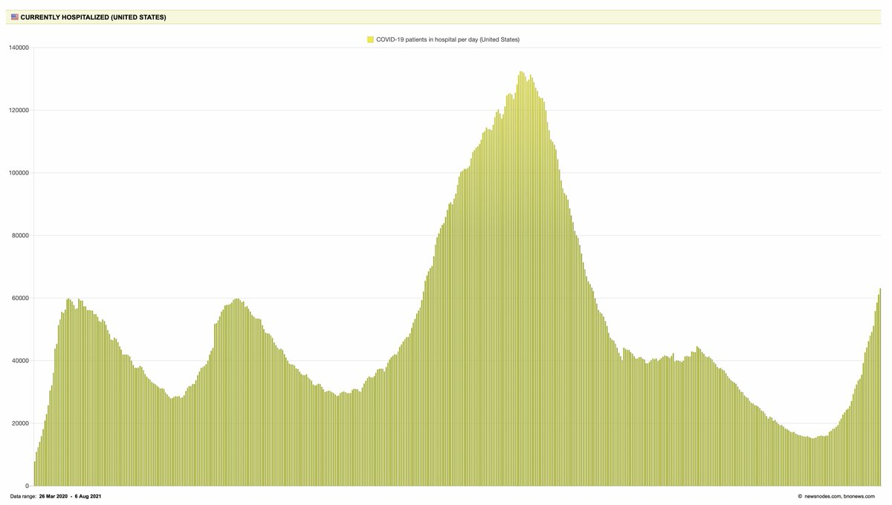</img></a>

---

<a href="https://twitter.com/erictopol/status/1424144894344372230" target="_blank" rel="noreferer">23:06 UCT</a>

Comparing the cases and hospitalizations during the Delta waves for the 3 countries (+ yes, there are marked differences in testing, under in the US)
Ratios (peak) UK ~9, Israel ~6; US currently &lt;2.5 

<a href="E8ORxr_VUAU4FF_.jpg"  >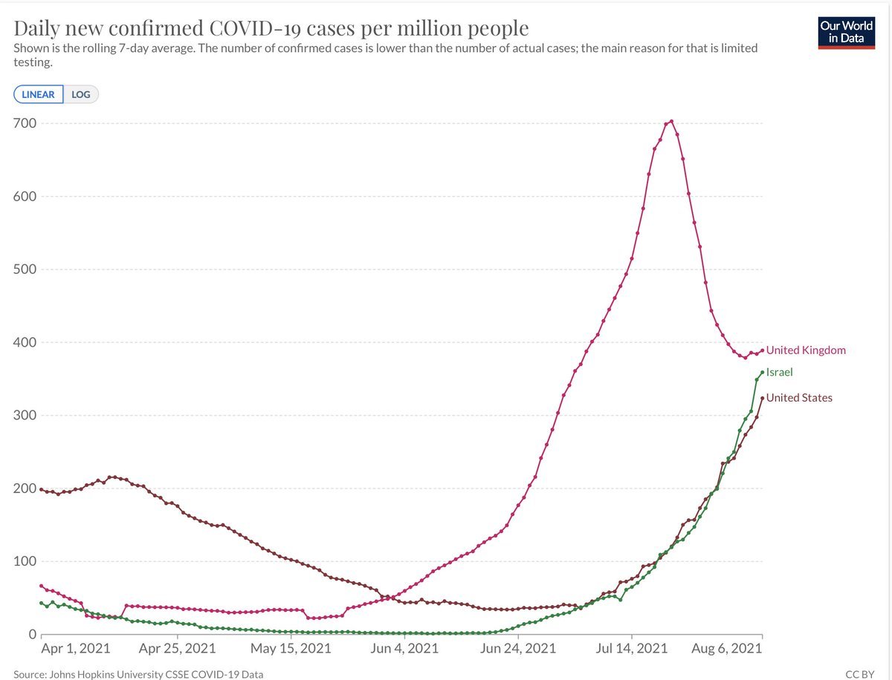</img></a><a href="E8ORpBdVcAEzvW4.jpg"  >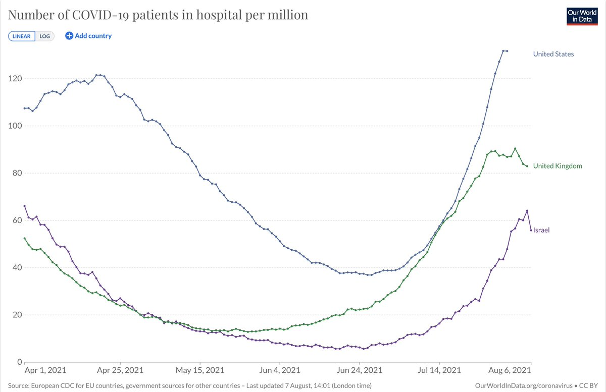</img></a>