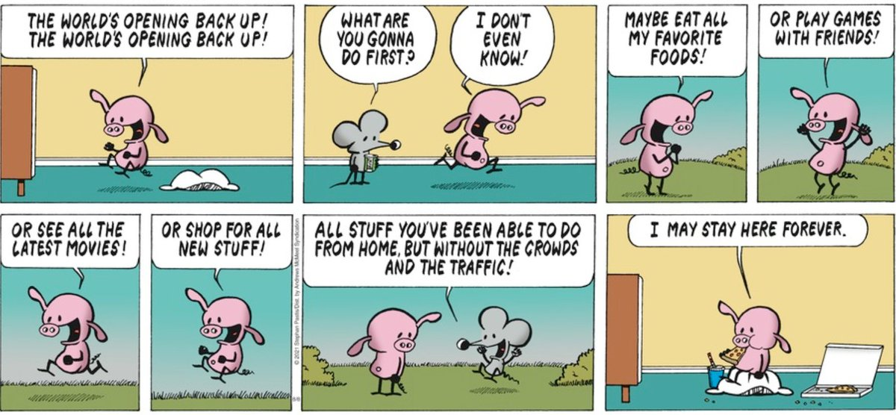
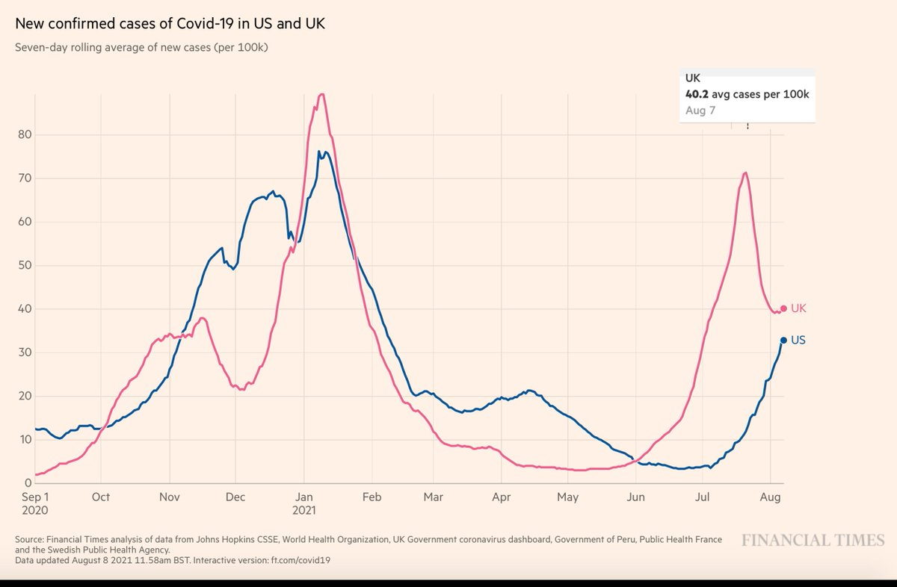
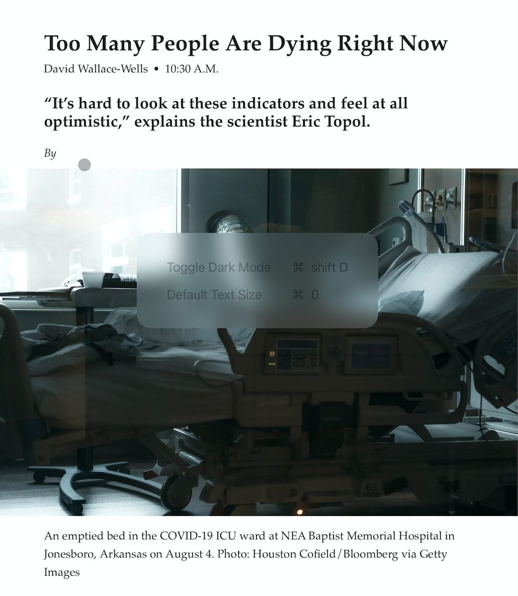
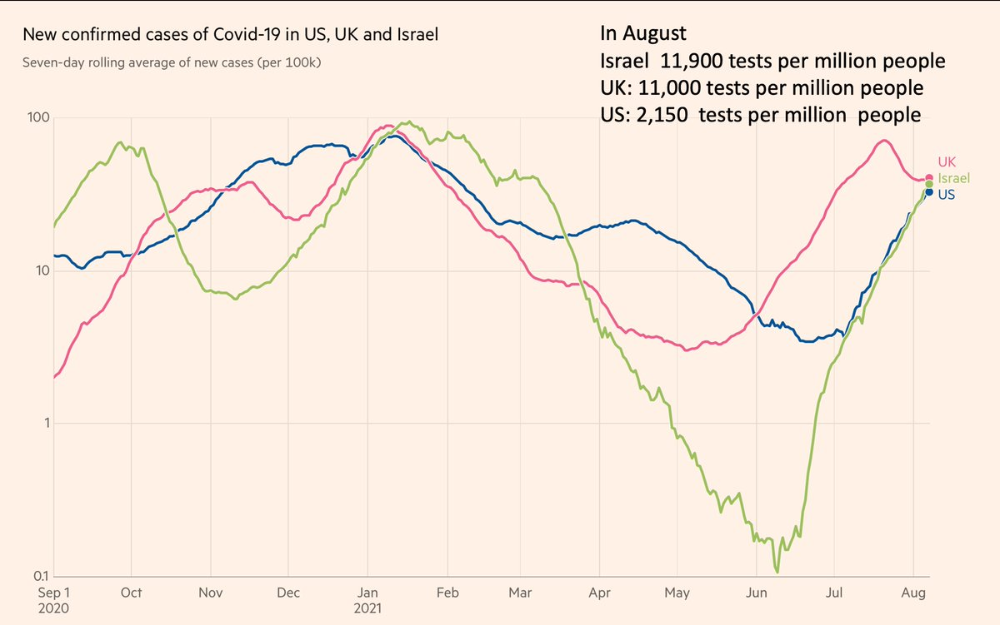
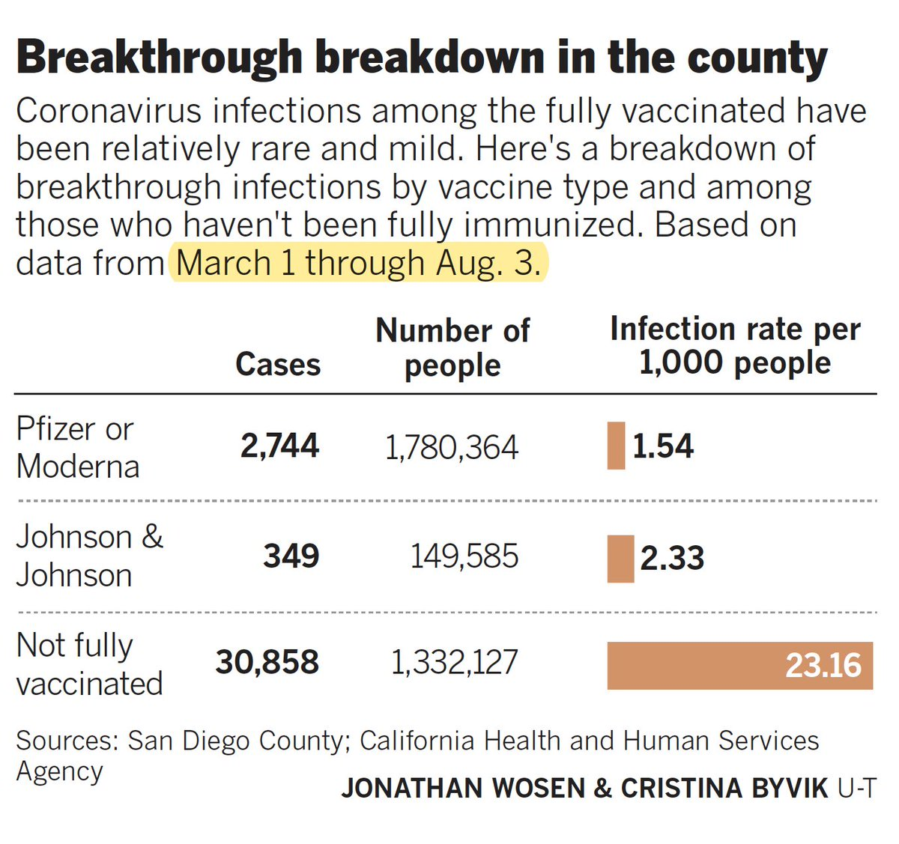
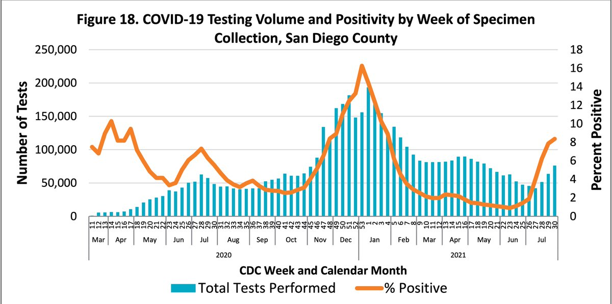
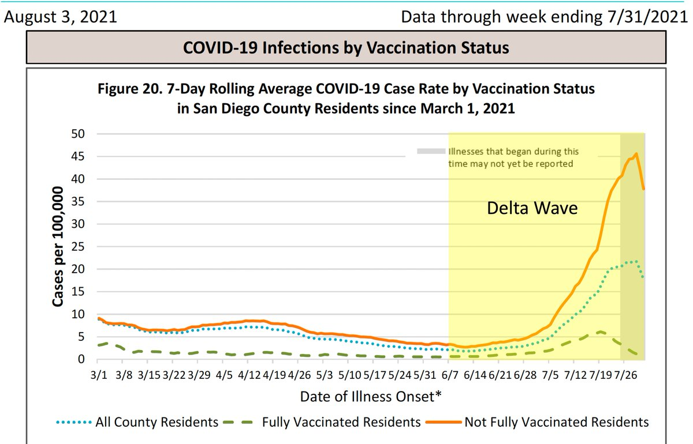

+++
title = "Tweets by Eric Topol Aug 08"
Summary = ""
tags = ["Twitter"]
category = "Twitter"
+++

---

<a href="https://twitter.com/erictopol/status/1424202085541703686" target="_blank" rel="noreferer">02:53 UCT</a>

RT @EricTopol: The US Delta wave by county vaccination level: relationship with deaths and cases 
https://www.wsj.com/articles/highly-vaccinated-states-keep-worst-covid-19-outcomes-in-check-as-delta-spreads-wsj-analysis-shows-11628328602 https://t.co/rn5w…

---

<a href="https://twitter.com/erictopol/status/1424359431035256833" target="_blank" rel="noreferer">13:18 UCT</a>

Our covid times :-)
by @stephanpastis 

<a href="E8RXU0OVUAI8-jI.jpg"  ></img></a>

---

<a href="https://twitter.com/erictopol/status/1424372119677198340" target="_blank" rel="noreferer">14:09 UCT</a>

Highest cases/capita in the world, state or country, with population ≥ 1 million
1.  Louisiana 99/100,000
2. Botswana 98/100,000
3. Florida 90/100,000

---

<a href="https://twitter.com/erictopol/status/1424379275524788225" target="_blank" rel="noreferer">14:37 UCT</a>

@kallmemeg 40.2 according to @FT
https://ig.ft.com/coronavirus-chart/?areas=usa&areas=gbr&areasRegional=usny&areasRegional=usla&areasRegional=usnv&areasRegional=usar&areasRegional=usks&areasRegional=usmo&cumulative=0&logScale=0&per100K=1&startDate=2020-09-01&values=cases 

<a href="E8RpXm6VoAweqLA.jpg"  ></img></a>

---

<a href="https://twitter.com/erictopol/status/1424384555591421962" target="_blank" rel="noreferer">14:58 UCT</a>

The US Delta wave and the unexpected high hospitalizations and deaths https://nymag.com/intelligencer/2021/08/too-many-people-are-dying-of-covid-19-right-now.html by @dwallacewells @NYMag @intelligencer
And David's thread
https://twitter.com/dwallacewells/status/1424381651962970112 

<a href="E8RtN6QVEAEVsUr.jpg"  ></img></a>

---

<a href="https://twitter.com/erictopol/status/1424385997756723203" target="_blank" rel="noreferer">15:04 UCT</a>

@JamesSurowiecki @dwallacewells Sure we've seen a meaningful reduction in risk of hospitalization . But it's not as substantial as that seen in the UK and Israel, the main point. And the reason(s) for that are unclear; marked differences in testing or vaccination % are potential explanations

---

<a href="https://twitter.com/erictopol/status/1424386199771238403" target="_blank" rel="noreferer">15:05 UCT</a>

@dbroockman @dwallacewells Very likely

---

<a href="https://twitter.com/erictopol/status/1424388594102272002" target="_blank" rel="noreferer">15:14 UCT</a>

The illusion of tracking together
It appears that the US and Israel's case curves are superimposed.  But their testing per day is far (5.5X) apart 

<a href="E8RxaRkUUAoHUKh.jpg"  ></img></a>

---

<a href="https://twitter.com/erictopol/status/1424407035991396352" target="_blank" rel="noreferer">16:27 UCT</a>

A marked reduction in testing likely explainer for a ~2:1 ratio for US cases: hospitalizations
Peak 3rd wave: 250,000 cases/7d avg; 125,000 hospitalizations, &gt; 2M tests/day
Current 4th wave: 110,000 cases/7d avg; 63,000 hospitalizations , ~1M tests/day
https://coronavirus.jhu.edu/testing/individual-states

---

<a href="https://twitter.com/erictopol/status/1424415215269998592" target="_blank" rel="noreferer">17:00 UCT</a>

Reassuring. Current data from San Diego County, California's 2nd largest, which tracks vaccinated status and vaccine for new cases, ~58% total population vaccinated (national 50%).
https://www.sandiegouniontribune.com/news/health/story/2021-08-07/some-san-diegans-are-seeking-and-getting-covid-19-vaccine-boosters
But March -&gt; June are before Delta 

<a href="E8SE1wUVoAI55x5.jpg"  ></img></a>

---

<a href="https://twitter.com/erictopol/status/1424415220647092226" target="_blank" rel="noreferer">17:00 UCT</a>

You can see the test positivity rate climbing with Delta to 9% but testing is much less than half of the 3rd wave
https://www.sandiegocounty.gov/content/dam/sdc/hhsa/programs/phs/Epidemiology/COVID-19%20Watch.pdf 

<a href="E8SH2g7UYAExdqu.jpg"  ></img></a>

---

<a href="https://twitter.com/erictopol/status/1424415226649214981" target="_blank" rel="noreferer">17:00 UCT</a>

So while breakthrough infections rose (small %) and the benefit of vaccines is markedly increasing during the Delta wave, we have a denominator, case capture issue 

<a href="E8SJweQVoAspGr_.jpg"  ></img></a>

---

<a href="https://twitter.com/erictopol/status/1424470614010564608" target="_blank" rel="noreferer">20:40 UCT</a>

This should be the norm, supplying high quality masks free charge to all who choose to use them, to help reduce the Delta wave hit https://twitter.com/ScottGottliebMD/status/1424458131434655746

---

<a href="https://twitter.com/erictopol/status/1424480049604947969" target="_blank" rel="noreferer">21:18 UCT</a>

There are 2 levels to flying blind in the Delta wave.
One is the CDC's void of data 👇
The other is our testing, &lt;&lt; 1/2 of 3rd wave, w/
very poor availability 
A no show: home rapid antigen tests, which should be freely provided to every household to help safely open schools https://twitter.com/EricTopol/status/1423726051474108417

---

<a href="https://twitter.com/erictopol/status/1424483206275821568" target="_blank" rel="noreferer">21:30 UCT</a>

May 2020
Rapid antigen tests validated

February 2021
"Biden has proposed spending $50 billion to vastly expand rapid testing as part of his push to return most K-8 students to classes within his first 100 days"
https://apnews.com/article/joe-biden-pandemics-coronavirus-pandemic-b72e56902c9a682201dc7e2e95530551

---

<a href="https://twitter.com/erictopol/status/1424486280813940737" target="_blank" rel="noreferer">21:42 UCT</a>

@mattyglesias @dwallacewells Agree. This became clear to me in subsequently reviewing the marked reduction in US testing and how poor it is (&lt;1/5) compared to the reference countries UK and Israel that I discussed w/ David
https://twitter.com/EricTopol/status/1424407035991396352

---

<a href="https://twitter.com/erictopol/status/1424489006792724485" target="_blank" rel="noreferer">21:53 UCT</a>

RT @kallmemeg: America does not have a national health service. 

If they did, I’ve no doubt they would be tracking the #COVID19 pandemic b…

---

<a href="https://twitter.com/erictopol/status/1424499173378781186" target="_blank" rel="noreferer">22:34 UCT</a>

RT @FinchTH: @EricTopol And Botswana wouldn’t be #2 on that list if it had access to vaccines to the same degree LA and FL do.

