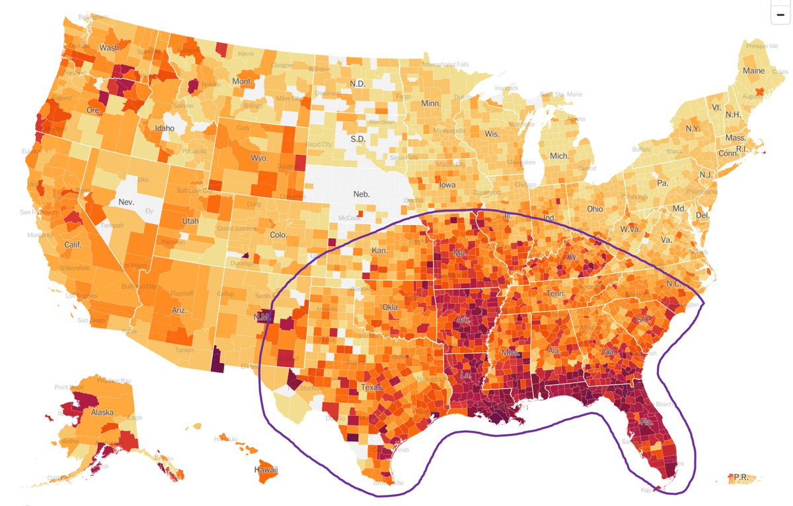
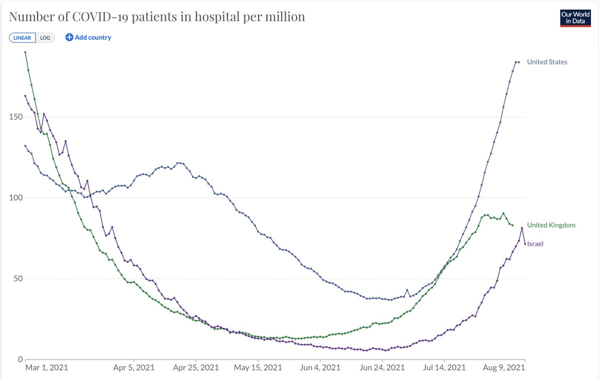
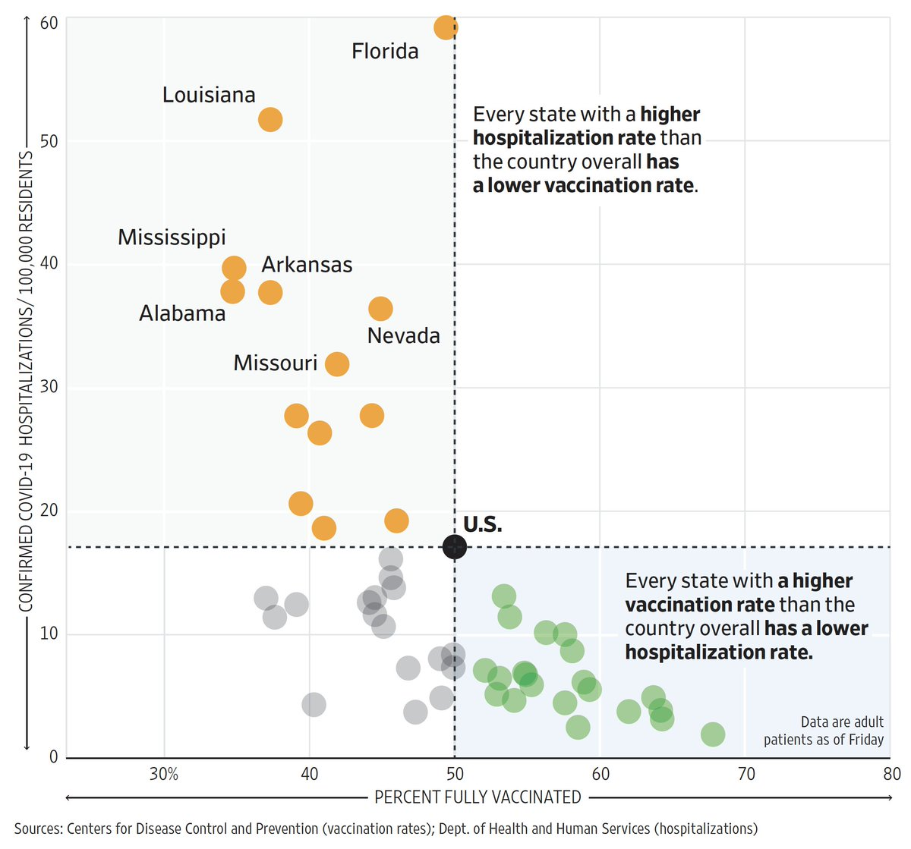
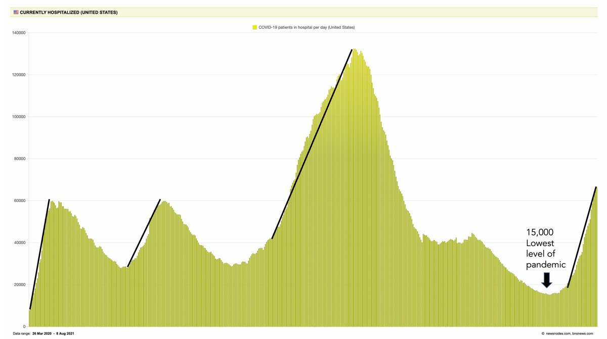
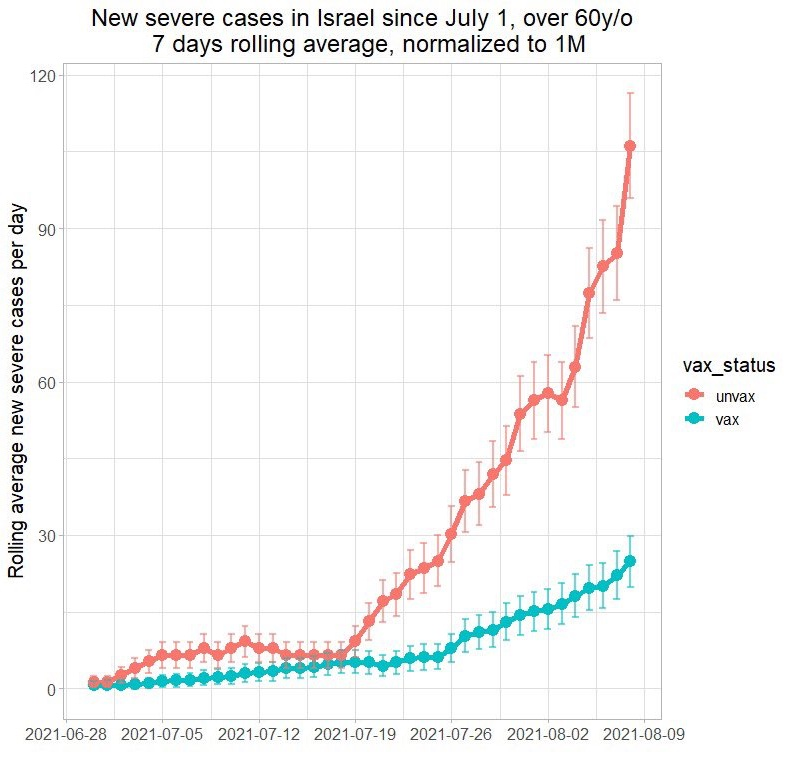
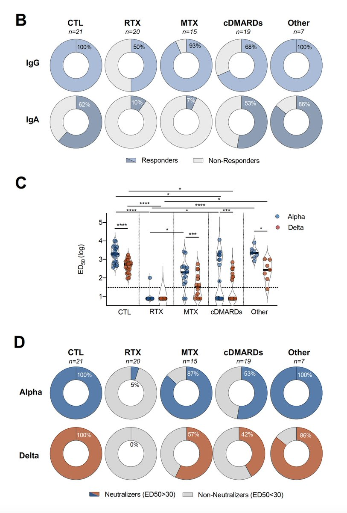
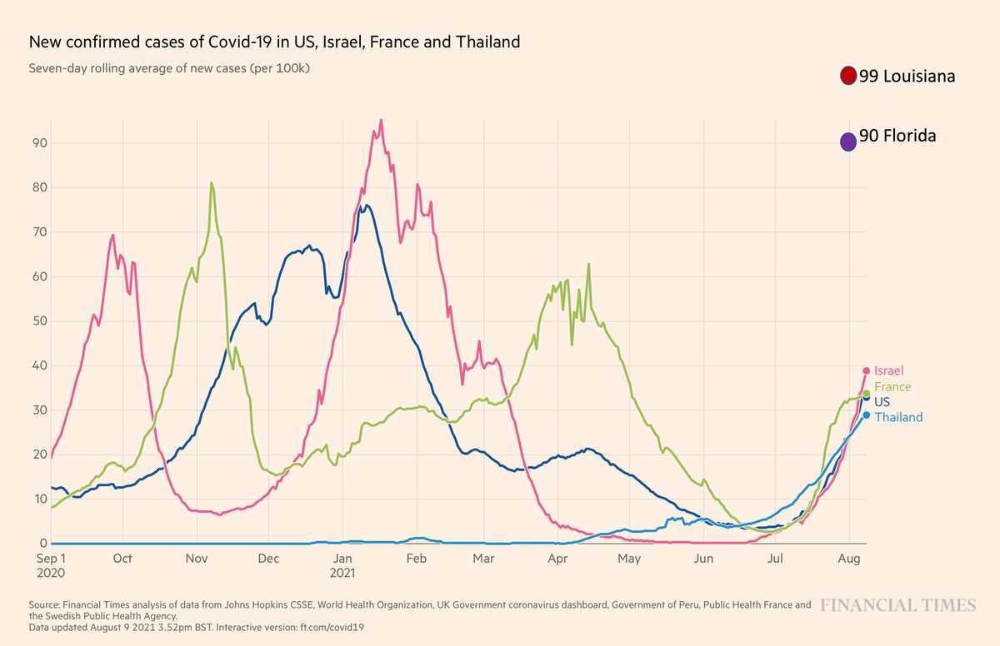
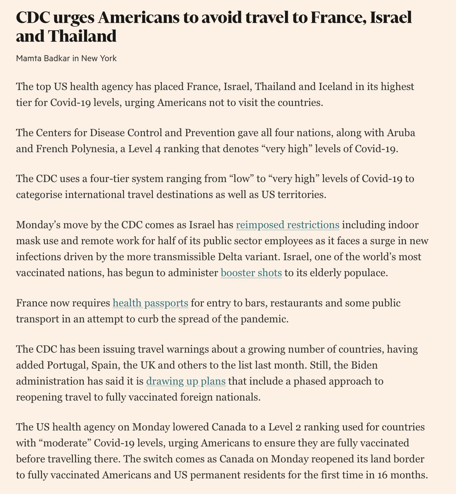
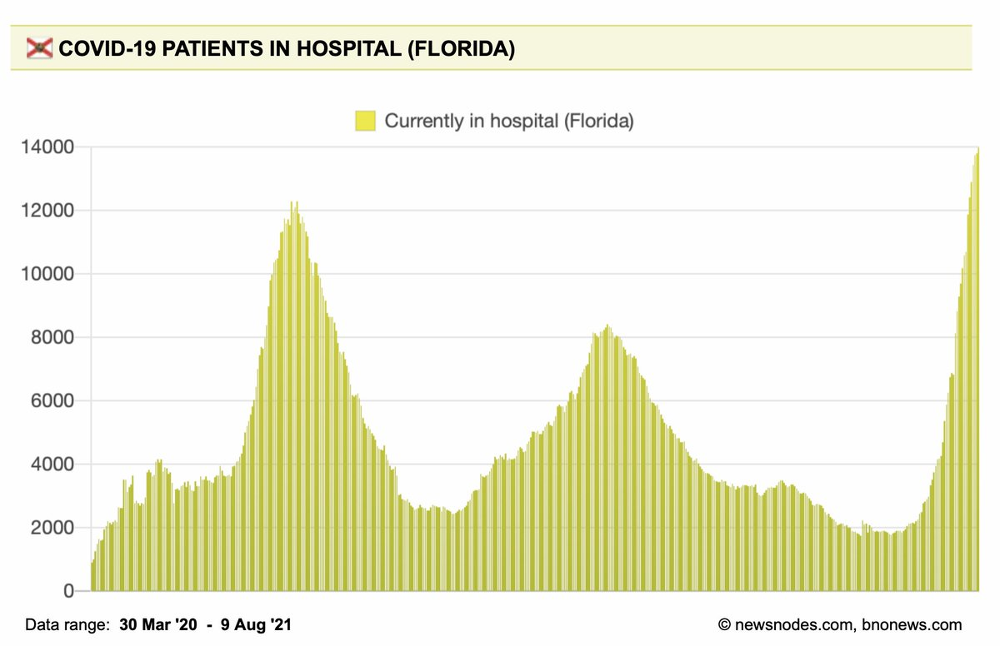

+++
title = "Tweets by Eric Topol Aug 09"
Summary = ""
tags = ["Twitter"]
category = "Twitter"
+++

---

<a href="https://twitter.com/erictopol/status/1424561159508619266" target="_blank" rel="noreferer">02:40 UCT</a>

A picture that denotes the absence of a national strategy, of states rolling on their own, with leaders unwilling to adopt best practices for defending vs Delta, and which puts the whole country in jeopardy of further spread 

<a href="E8UOUZjUcAYYq6m.jpg"  ></img></a>

---

<a href="https://twitter.com/erictopol/status/1424572754733400066" target="_blank" rel="noreferer">03:26 UCT</a>

@MinorLeagueBall Agree. I meant implementing a united, consistent national strategy against this formidable version of the virus, our common enemy

---

<a href="https://twitter.com/erictopol/status/1424602723719073797" target="_blank" rel="noreferer">05:25 UCT</a>

@joshtpm Yes, for the most part

---

<a href="https://twitter.com/erictopol/status/1424718505878777856" target="_blank" rel="noreferer">13:05 UCT</a>

I wrote about the implications of the breakdown at @CDCgov for not tracking breakthrough infections during the Delta wave @guardian 
https://www.theguardian.com/commentisfree/2021/aug/09/america-is-flying-blind-when-it-comes-to-the-delta-variant putting millions of vaccinated Americans at unnecessary risk .... and leaving us without a navigational system

---

<a href="https://twitter.com/erictopol/status/1424757740396695556" target="_blank" rel="noreferer">15:41 UCT</a>

The graph that concerns me most about the US Delta wave. Independent of our profound testing deficit. Hoping for imminent flattening and bending of this curve
@OurWorldInData 

<a href="E8XBAEgVIAIkvZS.jpg"  ></img></a>

---

<a href="https://twitter.com/erictopol/status/1424761003732996096" target="_blank" rel="noreferer">15:54 UCT</a>

Yes, it's worst in states with the lowest vaccination rates.  And largely driven by them. But no state is exempt from being part of the increase
https://www.wsj.com/articles/highly-vaccinated-states-keep-worst-covid-19-outcomes-in-check-as-delta-spreads-wsj-analysis-shows-11628328602 

<a href="E8XEANcVcAUnGbS.jpg"  ></img></a>

---

<a href="https://twitter.com/erictopol/status/1424763995383230468" target="_blank" rel="noreferer">16:06 UCT</a>

@JamesSurowiecki You're spot on here, James. I would just add that we have no idea what per cent of these hospitalizations are in unvaccinated people, which is a big miss to follow/understand what is really going on.

---

<a href="https://twitter.com/erictopol/status/1424769339564040209" target="_blank" rel="noreferer">16:27 UCT</a>

@aravosis @Bob_Wachter Sorry.I thought it was so apparent the legend wasn't necessary. It's all here, just scroll down
https://www.nytimes.com/interactive/2021/us/covid-cases.html?name=styln-coronavirus-live&region=TOP_BANNER&block=storyline_menu_recirc&action=click&pgtype=LegacyCollection&variant=1_Show&is_new=false

---

<a href="https://twitter.com/erictopol/status/1424793011196555265" target="_blank" rel="noreferer">18:01 UCT</a>

Another way is to look at the rate of rise as compared with Waves 1-3, pre-vaccination. 
From 15,000 to 67,000 in 5 weeks 

<a href="E8XhGCCVUAEiwm2.jpg"  ></img></a>

---

<a href="https://twitter.com/erictopol/status/1424795482493112335" target="_blank" rel="noreferer">18:11 UCT</a>

The latest Israeli data that shows sustained high effectiveness of mRNA vaccines vs severe illness in people age &gt; 60, during the Delta wave, but amidst increasing breakthrough cases. Via @AArgoetti and @LittleMoiz 

<a href="E8XjNNQVUAUxbDs.jpg"  ></img></a>

---

<a href="https://twitter.com/erictopol/status/1424798750141153281" target="_blank" rel="noreferer">18:24 UCT</a>

This is quite misleading by admixing all the pre-Delta data when breakthrough infections were rare. I only wish it was true.
https://www.theguardian.com/commentisfree/2021/aug/09/america-is-flying-blind-when-it-comes-to-the-delta-variant https://twitter.com/cnnbrk/status/1424795856214138881

---

<a href="https://twitter.com/erictopol/status/1424840898223898624" target="_blank" rel="noreferer">21:11 UCT</a>

RT @DrAhmedKalebi: “The lack of data around breakthrough infections is giving a false sense of security… Without tracking, we have no idea…

---

<a href="https://twitter.com/erictopol/status/1424841417013137409" target="_blank" rel="noreferer">21:14 UCT</a>

RT @chrischirp: QUICK THREAD ON VACCINES &amp; DELTA: Friday's @PHE_uk report said that viral load in infected vaccinated people was similar to…

---

<a href="https://twitter.com/erictopol/status/1424848126377029637" target="_blank" rel="noreferer">21:40 UCT</a>

More data on the diminished immune response to the Delta variant in vaccinated people on immunosuppression drugs, supporting their need for a booster 
https://www.medrxiv.org/content/10.1101/2021.08.08.21261766v1 

<a href="E8YTn_2VcBMHdAa.jpg"  ></img></a>

---

<a href="https://twitter.com/erictopol/status/1424855514211512325" target="_blank" rel="noreferer">22:10 UCT</a>

These CDC travel advisories are amusing. Specifying countries testing up to 5X more than the US as high risk.
How about domestic travel advisories?
https://www.ft.com/content/11117011-442e-43b4-b7d8-dcd31867ed09 by @mamtabadkar @FT 

<a href="E8Yag5rVcBMXFSl.jpg"  ></img></a><a href="E8YaEjYVcAUWTZM.jpg"  ></img></a>

---

<a href="https://twitter.com/erictopol/status/1424858311350906888" target="_blank" rel="noreferer">22:21 UCT</a>

What worst than worst?
Worster. Florida. 

<a href="E8Yc-S1VcBYcHP_.jpg"  ></img></a>

---

<a href="https://twitter.com/erictopol/status/1424860990596804608" target="_blank" rel="noreferer">22:31 UCT</a>

This is the first look as to whether booster shots are working in people &gt; 60 years old to suppress infections. Encouraging. Preliminary. https://twitter.com/erlichya/status/1424857057149263873

