+++
title = "Tweets by Eric Topol Aug 10"
Summary = ""
tags = ["Twitter"]
category = "Twitter"
+++

---

<a href="https://twitter.com/erictopol/status/1424934533539921923" target="_blank" rel="noreferer">03:24 UCT</a>

An update
Highest cases/capita in the world, state or country, with population ≥ 1 million
1.  Florida      127/100,000
2. Louisiana 116/100,000
3. Botswana  96/100,000

---

<a href="https://twitter.com/erictopol/status/1424935312250212353" target="_blank" rel="noreferer">03:27 UCT</a>

Data sources @nytimes and @BNOdesk https://www.nytimes.com/interactive/2021/us/covid-cases.html?name=styln-coronavirus-live&region=TOP_BANNER&block=storyline_menu_recirc&action=click&pgtype=LegacyCollection&variant=1_Show&is_new=false
https://newsnodes.com/worldmonitor/
Major FL and LA case acceleration since yesterday
https://twitter.com/EricTopol/status/1424372119677198340

---

<a href="https://twitter.com/erictopol/status/1424938092666834944" target="_blank" rel="noreferer">03:38 UCT</a>

@FlxSpartan Talk to the @nytimes, not me https://www.nytimes.com/interactive/2021/us/covid-cases.html?name=styln-coronavirus-live&region=TOP_BANNER&block=storyline_menu_recirc&action=click&pgtype=LegacyCollection&variant=1_Show&is_new=false 

<a href="E8ZlotsUUAs42Kn.jpg"  ></img></a>

---

<a href="https://twitter.com/erictopol/status/1425089101926080514" target="_blank" rel="noreferer">13:38 UCT</a>

Current Israel data for mRNA vaccination in people age &gt;60, 1st to get vaccines  &gt;6 months ago, now confronting Delta infections
1. Vaccines work but their apparent effectiveness is diminished over time + Delta
2. Boosters showing some preliminary evidence of working
via @dvir_a 

<a href="E8btO-rVoAA3-w8.png"  >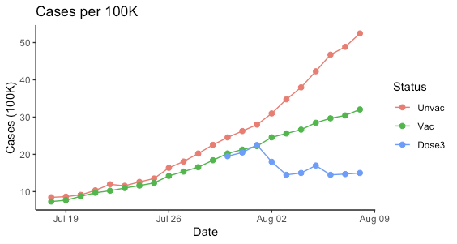</img></a>

---

<a href="https://twitter.com/erictopol/status/1425095385157038080" target="_blank" rel="noreferer">14:03 UCT</a>

Is case growth in the US Delta wave starting to slow?
Testing is up (still way short what it should be) and positivity is declining for the 1st time in the wave 👍
Log-plot: some flattening
https://newsnodes.com/us
Too early to call, but hopeful 

<a href="E8b0T8wXMAw_2e0.jpg"  >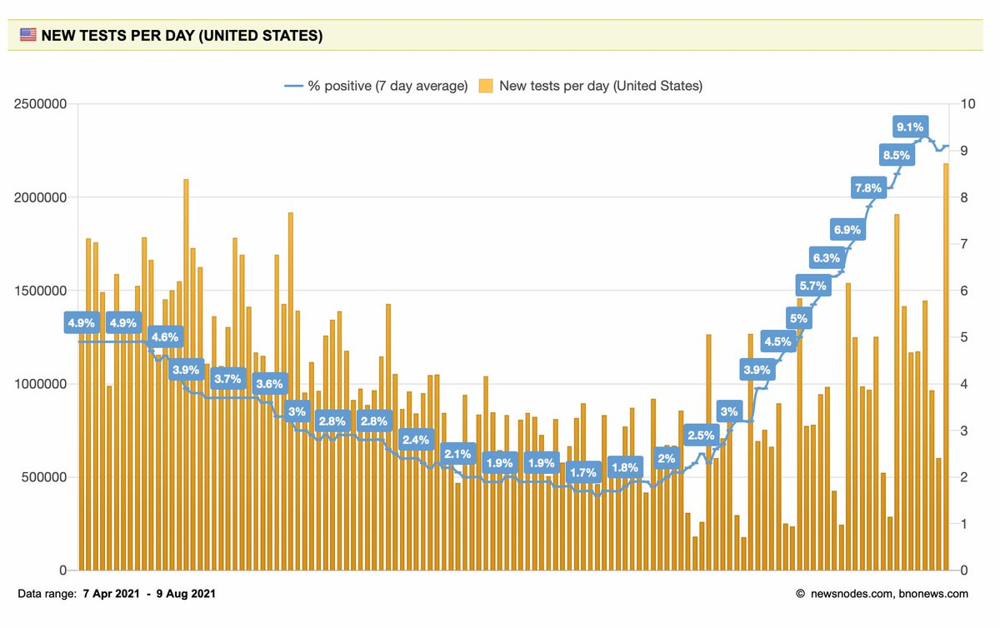</img></a><a href="E8b0MuTXMAo8n_D.jpg"  >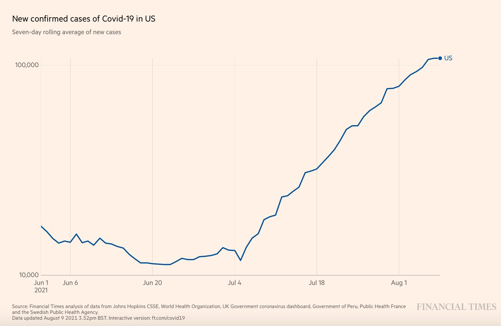</img></a>

---

<a href="https://twitter.com/erictopol/status/1425099040673341440" target="_blank" rel="noreferer">14:17 UCT</a>

Over 600,000 3rd shots have been given for age &gt;60 as cases are surging in Israel, with much higher vaccination % than US
https://www.ft.com/content/c0a111eb-c5b0-43f4-b569-5f7fd810a1b0 @FT by @MehulAtLarge 
@OurWorldInData 

<a href="E8b3c4wXEBIXCwt.jpg"  >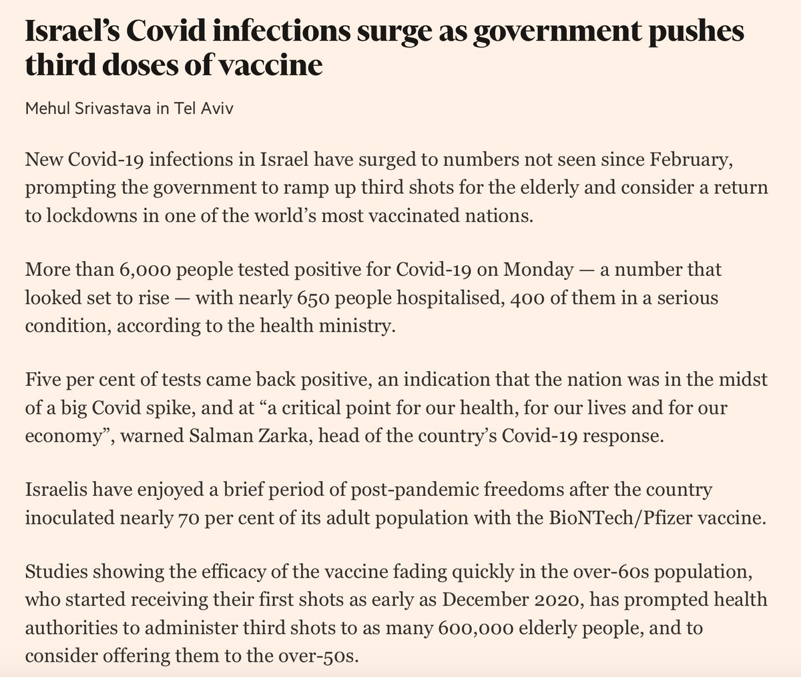</img></a><a href="E8b3zVWXoAUsHtc.jpg"  >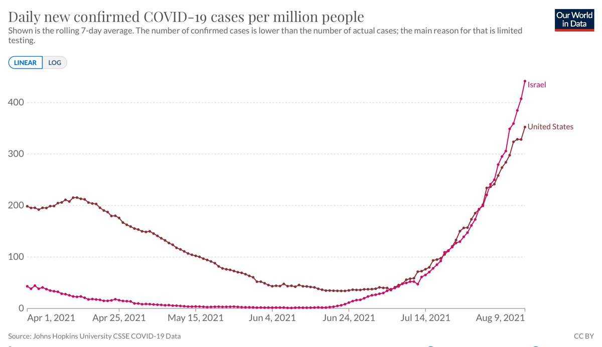</img></a>

---

<a href="https://twitter.com/erictopol/status/1425106336535040001" target="_blank" rel="noreferer">14:46 UCT</a>

Just published @ScienceTM 
In people with prior covid, 2 doses of mRNA vaccination provided a better immune response than 1 against major variants of concern (Beta, Gamma)
https://stm.sciencemag.org/content/early/2021/08/10/scitranslmed.abj0847 

<a href="E8b-iCdWEAs0hsx.jpg"  >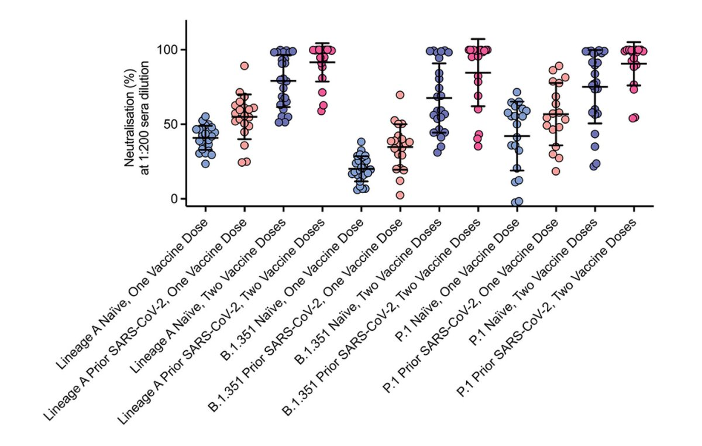</img></a>

---

<a href="https://twitter.com/erictopol/status/1425120334559072260" target="_blank" rel="noreferer">15:42 UCT</a>

The world's Delta wave normalized case growth is largely being driven by the US
@OurWorldInData 

<a href="E8cLWaZVUAMqiB4.jpg"  >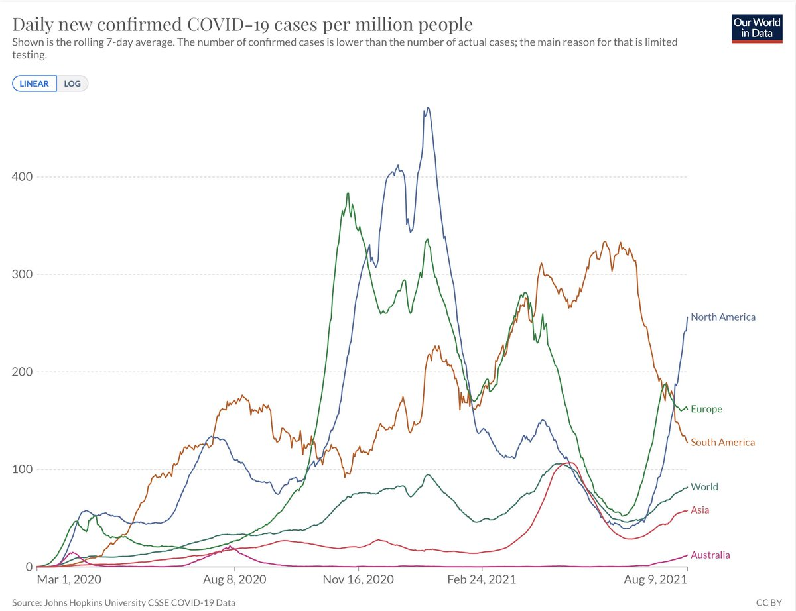</img></a>

---

<a href="https://twitter.com/erictopol/status/1425122320406892546" target="_blank" rel="noreferer">15:50 UCT</a>

Just out @Nature 
The contribution of rare genomic variants to common medical conditions is greater than has been generally appreciated; insights from the @uk_biobank &gt;280,000 exome sequences, &gt;18,000 complex traits
https://www.nature.com/articles/s41586-021-03855-y
by @SlavePetrovski and collaborators 

<a href="E8cMhcjVcAEB_Fc.jpg"  >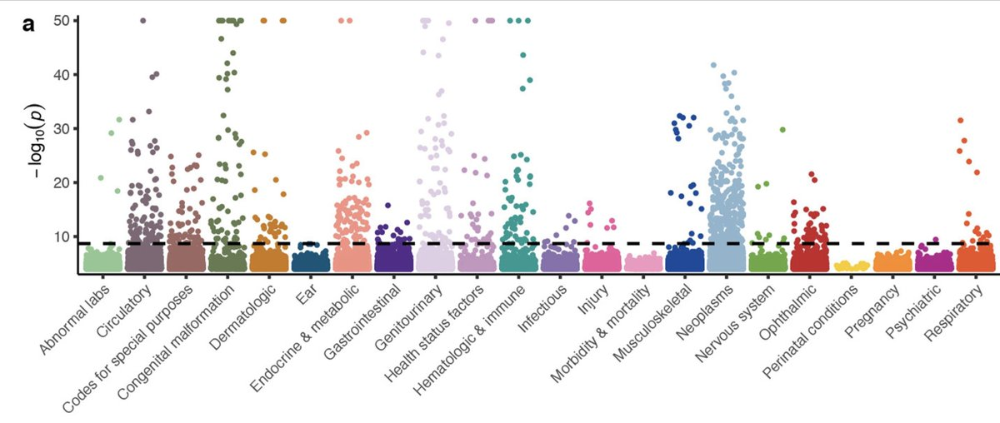</img></a>

---

<a href="https://twitter.com/erictopol/status/1425155135370502147" target="_blank" rel="noreferer">18:00 UCT</a>

Worst than worster.
This is like watching a never-ending horror movie 

<a href="E8cq3MmVkAE48fX.jpg"  >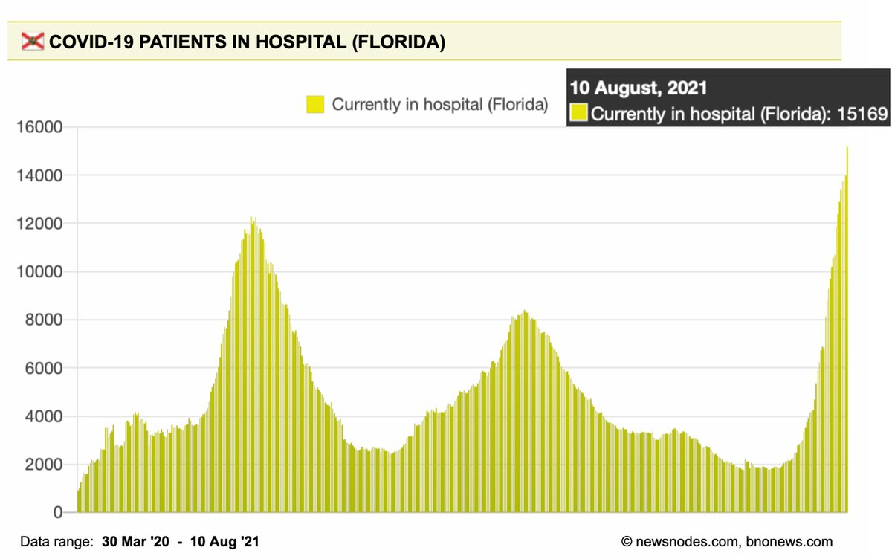</img></a>

---

<a href="https://twitter.com/erictopol/status/1425156586582937600" target="_blank" rel="noreferer">18:06 UCT</a>

Deaths are now rising substantially, near pandemic peak.
Test positivity is &gt;26% and rising. 

<a href="E8csC1pVgAEavfj.jpg"  >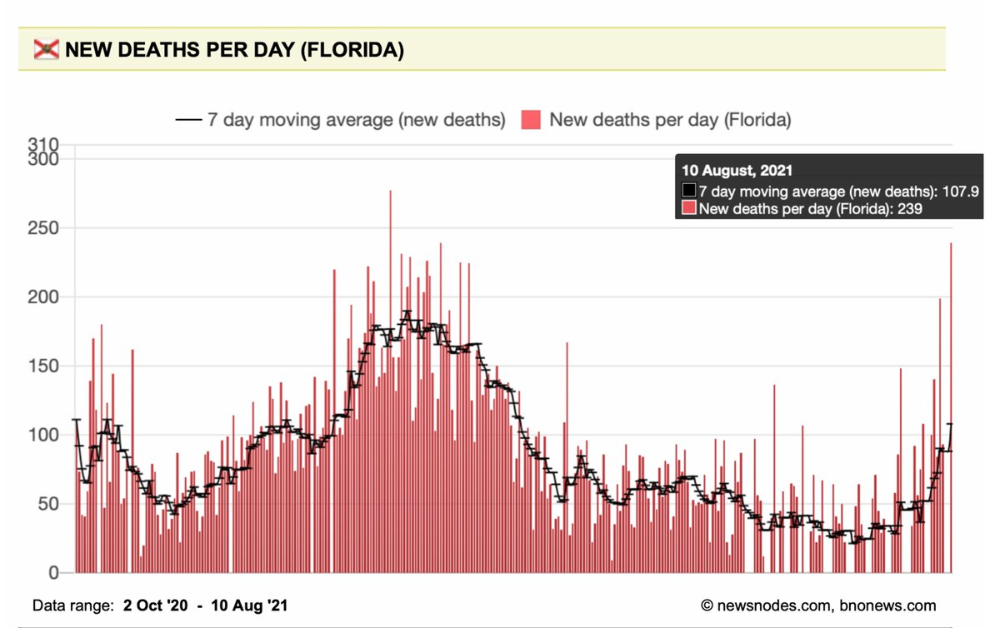</img></a>

---

<a href="https://twitter.com/erictopol/status/1425158399251992576" target="_blank" rel="noreferer">18:13 UCT</a>

Louisiana has now past their peak hospitalizations for the pandemic, including the horrific 1st wave 

<a href="E8ctvkXVEAMp_D2.jpg"  >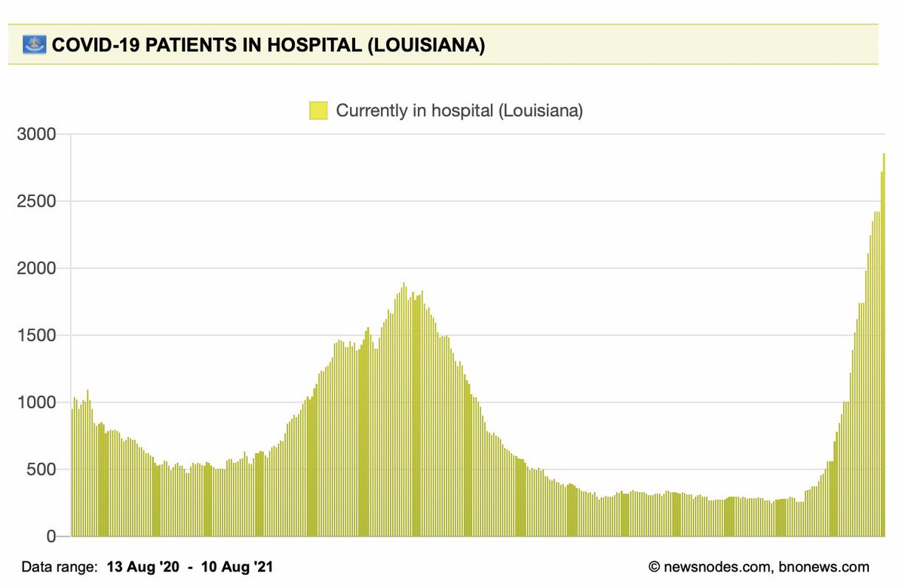</img></a><a href="E8ct-JYVIAIzpmr.png"  >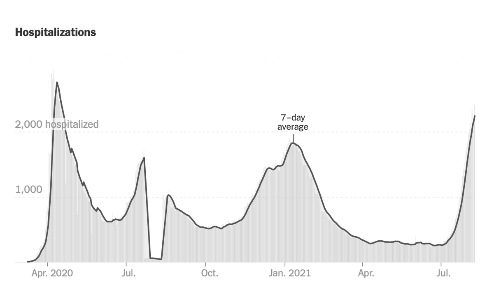</img></a>

---

<a href="https://twitter.com/erictopol/status/1425161008272740355" target="_blank" rel="noreferer">18:23 UCT</a>

Why are US Delta wave hospitalizations rising so quickly and more extensively compared w/ UK?
https://twitter.com/EricTopol/status/1424757740396695556 (my 1° concern)
This thread by @VictimofMaths aptly highlights it's not just our lower US % vaccinated, but also the age of the vaccinees
https://twitter.com/VictimOfMaths/status/1425109797750333449

---

<a href="https://twitter.com/erictopol/status/1425161596851032068" target="_blank" rel="noreferer">18:26 UCT</a>

RT @carothers_kelly: @EricTopol I live here. I sent my five year old twins back to school today and cried the entire way home.

---

<a href="https://twitter.com/erictopol/status/1425174714675126277" target="_blank" rel="noreferer">19:18 UCT</a>

At 2 months (57 days) after fully vaccinated @moderna_tx: 
Vaccine efficacy, as a function of cID50 neutralization titer
undetectable: 51%
100: 91%
1000: 96%
https://www.medrxiv.org/content/10.1101/2021.08.09.21261290v1 

<a href="E8c6TreVUAAqjYy.jpg"  >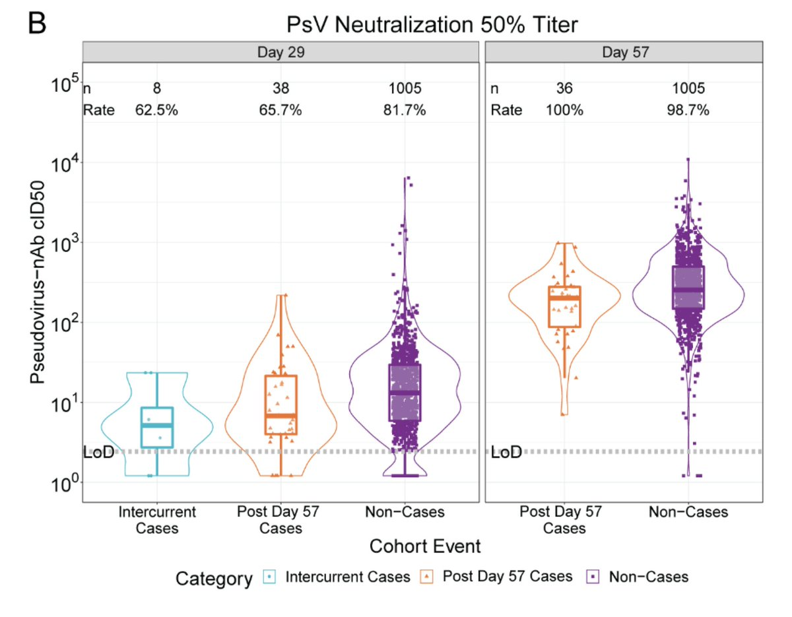</img></a><a href="E8c4_VYVkAUlJ3P.jpg"  >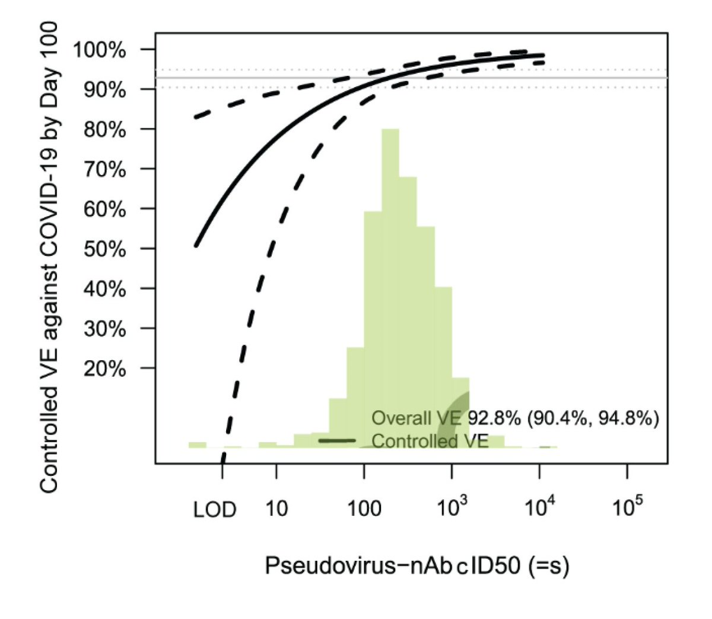</img></a>

---

<a href="https://twitter.com/erictopol/status/1425200518259875843" target="_blank" rel="noreferer">21:00 UCT</a>

Why is this an important finding?
It adds to the "waning immunity" narrative. That less ability to neutralize the virus w/ antibodies correlates w/vaccine efficacy. People with very low level of this marker (cID50 NT) had a big drop-off of vaccine efficacy

---

<a href="https://twitter.com/erictopol/status/1425201397448941568" target="_blank" rel="noreferer">21:04 UCT</a>

Debunking the myth that vaccination promotes mutations. Being fully vaccinated actually suppresses them 
https://www.medrxiv.org/content/10.1101/2021.08.08.21261768v1 

<a href="E8dU96RVcAMscya.jpg"  >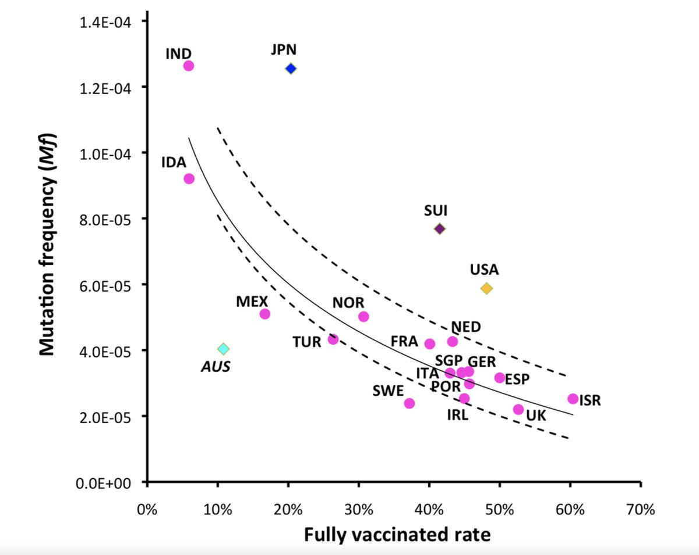</img></a>

---

<a href="https://twitter.com/erictopol/status/1425204507756044292" target="_blank" rel="noreferer">21:16 UCT</a>

Good: "Fully vaccinated people have made up as few as 0.1% of and as many as 5% of those hospitalized with the virus in those states, and as few as 0.2% and as many as 6 % of those who have died.
But: no Delta data
https://www.nytimes.com/interactive/2021/08/10/us/covid-breakthrough-infections-vaccines.html?action=click&module=Top%20Stories&pgtype=Homepage 

<a href="E8dXs7TUYAAn6i0.png"  >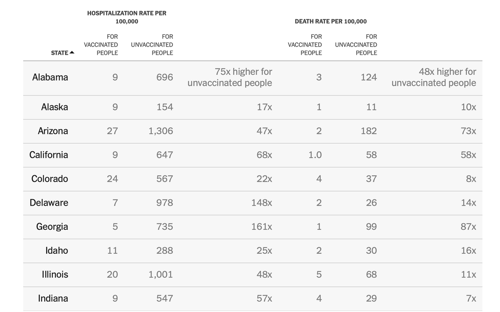</img></a>

---

<a href="https://twitter.com/erictopol/status/1425230814862708739" target="_blank" rel="noreferer">23:01 UCT</a>

The best comprehensive review of the asymptomatic status with Covid,  &gt;350 studies, just out @PNASNews 
https://www.pnas.org/content/118/34/e2109229118
Overall: true, never had symptoms 35%; children 47%
@Pratha_Sah @Alison_Galvani @MeaganCFitz @YaleSPH &amp; colleagues
(wonder what the rate is w/ Delta) 

<a href="E8duv7LVgAQ_UHp.jpg"  >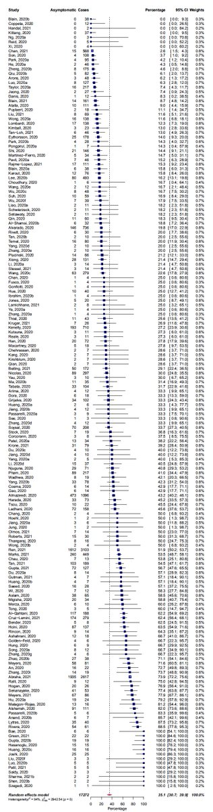</img></a>

---

<a href="https://twitter.com/erictopol/status/1425236066206846978" target="_blank" rel="noreferer">23:22 UCT</a>

The Delta strain is so very contagious. Could that be because it has a shortened interval—the time from one infection to the next? A rigorous study from Singapore suggests this is unlikely 
https://www.thelancet.com/journals/lancet/article/PIIS0140-6736(21)01697-4/fulltext#supplementaryMaterial
@sporeMOH @AdamJKucharski 

<a href="E8dyeZSVUAQsPrE.jpg"  >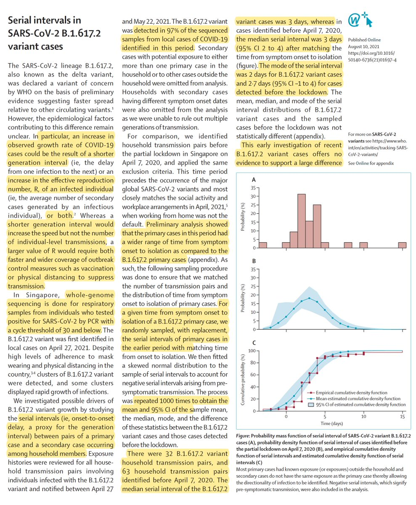</img></a><a href="E8dygNoVIAIRNzi.jpg"  >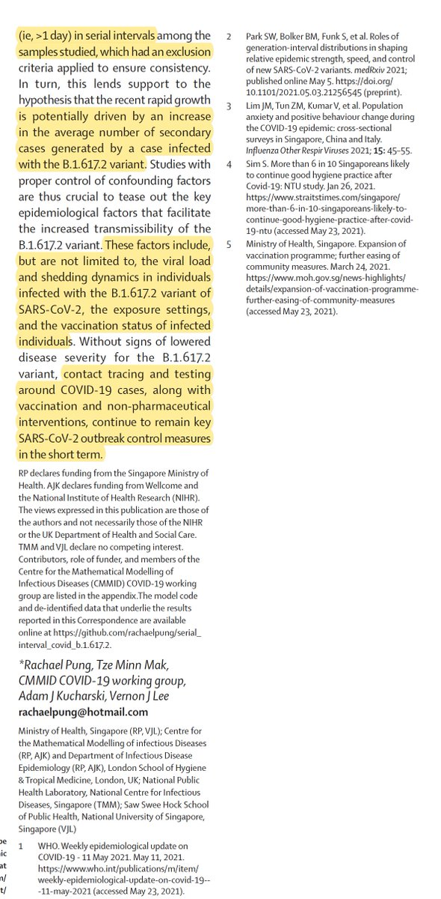</img></a><a href="E8dyo1oVcAEsZ45.jpg"  >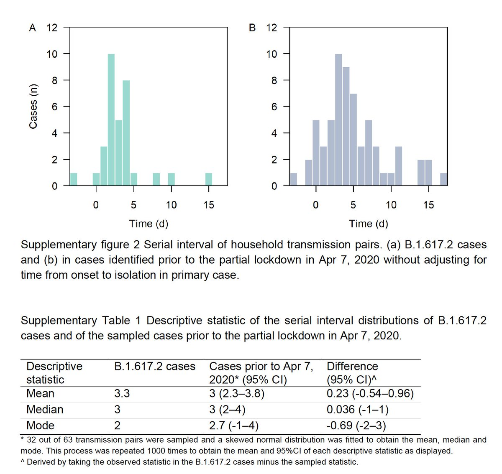</img></a>