+++
title = "Tweets by Eric Topol Aug 11"
Summary = ""
tags = ["Twitter"]
category = "Twitter"
+++

---

<a href="https://twitter.com/erictopol/status/1425252445546942466" target="_blank" rel="noreferer">00:27 UCT</a>

RT @DrBrianKeating: Dr. @EricTopol will see you now! All things🦠-19, his recent appearance on @SamHarrisOrg's podcast, #ArtificalIntelligen…

---

<a href="https://twitter.com/erictopol/status/1425278516283600898" target="_blank" rel="noreferer">02:10 UCT</a>

The US Delta wave, 10 August
Now nearly 74,000 patients hospitalized, which is a ~5X increase in 5 weeks, towering well above the 1st 2 waves, when vaccines were just a fantasy
1,238 deaths 
158,000 new cases
Devastating, and even more so knowing how so much was preventable 

<a href="E8eZgC1VEAUdMxD.jpg"  >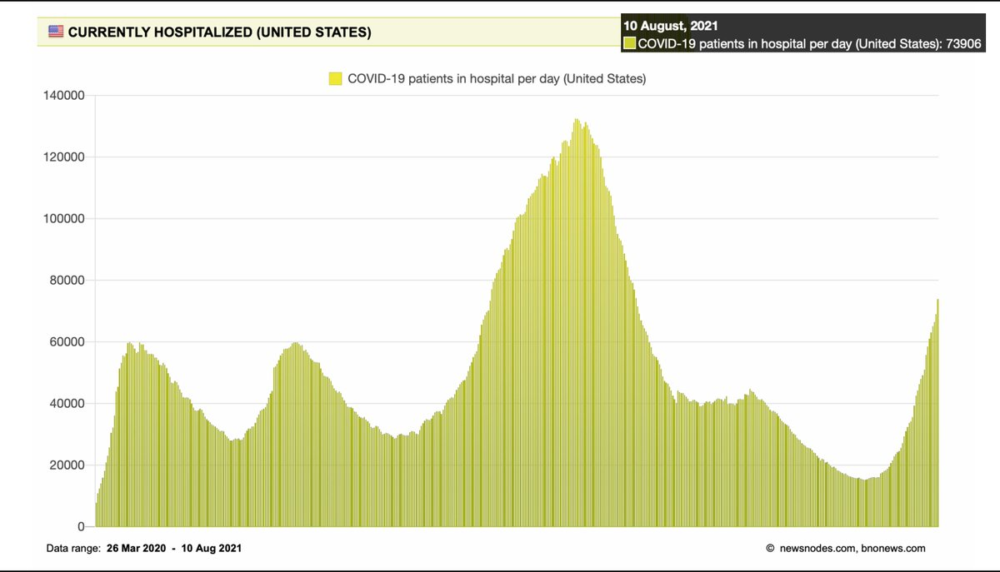</img></a>

---

<a href="https://twitter.com/erictopol/status/1425285139211251716" target="_blank" rel="noreferer">02:37 UCT</a>

@danieloran @PNASNews @Pratha_Sah @Alison_Galvani @MeaganCFitz @YaleSPH @YCIDMA Kudos to @danieloran, who nailed this over a year ago. We got a lot of flak for estimating it was 35%. After 350 studies now, his hard work has been validated

---

<a href="https://twitter.com/erictopol/status/1425324814122643459" target="_blank" rel="noreferer">05:14 UCT</a>

@apoorva_nyc “The vaccines were designed to prevent severe illness, not infection.”
All of the clinical trials which validated the vaccines had prevention of symptomatic infections as their primary endpoint.

https://www.nytimes.com/2020/09/22/opinion/covid-vaccine-coronavirus.html

---

<a href="https://twitter.com/erictopol/status/1425445765745299466" target="_blank" rel="noreferer">13:15 UCT</a>

Risk for breakthrough infection is 9-fold for unvaccinated
—The risk of an infection among fully vaccinated has increased 4.5-fold from 1 (pre-Delta) to 4.5 per 100,000 people
—The absolute and relative benefit of vaccination has markedly increased during the Delta wave 

<a href="E8gym5LVcAgk7aT.jpg"  >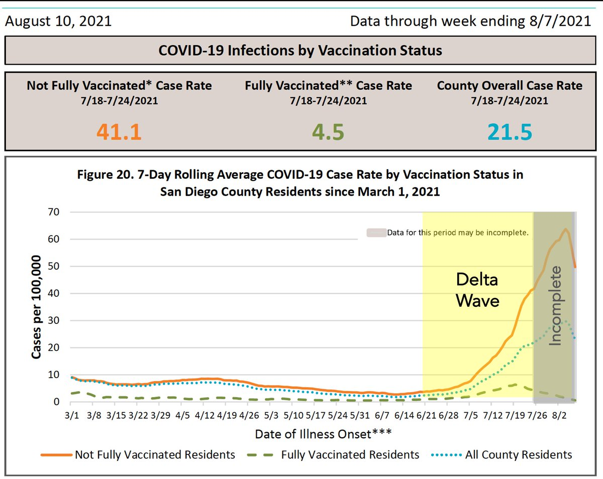</img></a>

---

<a href="https://twitter.com/erictopol/status/1425445763182592004" target="_blank" rel="noreferer">13:15 UCT</a>

Delta wave data in the US is hard to come by.
Here is the latest from San Diego County @SDCountyHHSA 
—Unvaccinated 50:1 odds for hospitalization
—The absolute rate has gone up for vaccinated with Delta
—But far more for unvaccinated
—Relative risk for unvaccinated has soared 

<a href="E8gw2WxUUAITXQr.jpg"  >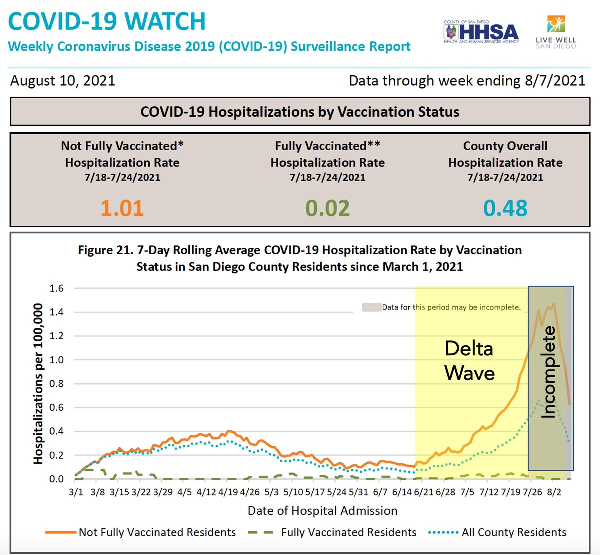</img></a>

---

<a href="https://twitter.com/erictopol/status/1425456983344238596" target="_blank" rel="noreferer">14:00 UCT</a>

These data (and much more) are collected for every patient admitted for covid hospitalization in the United States. It is unacceptable that they are not tracked  nationally and made available on a daily basis
https://www.theguardian.com/commentisfree/2021/aug/09/america-is-flying-blind-when-it-comes-to-the-delta-variant

---

<a href="https://twitter.com/erictopol/status/1425458272463515658" target="_blank" rel="noreferer">14:05 UCT</a>

RT @VirusesImmunity: Breakthrough infections are uncommon. However, you can get #longcovid from breakthrough infection. We don’t know how f…

---

<a href="https://twitter.com/erictopol/status/1425460046964486145" target="_blank" rel="noreferer">14:12 UCT</a>

Good graphic. Let’s stop the talk about how Delta is as contagious as chickenpox. It isn’t. It’s bad enough to be the most contagious respiratory virus . https://twitter.com/NPRGoatsandSoda/status/1425435405223186439

---

<a href="https://twitter.com/erictopol/status/1425471783944130562" target="_blank" rel="noreferer">14:58 UCT</a>

Delta breakthrough infections among 62 healthcare workers vaccinated in Vietnam
1. High viral loads. Many asymptomatic infections with similar viral loads
2. Low neutralizing antibodies
3. Transmission between vaccinated individuals
https://papers.ssrn.com/sol3/papers.cfm?abstract_id=3897733 

<a href="E8hKW-xUUAkm5aS.jpg"  >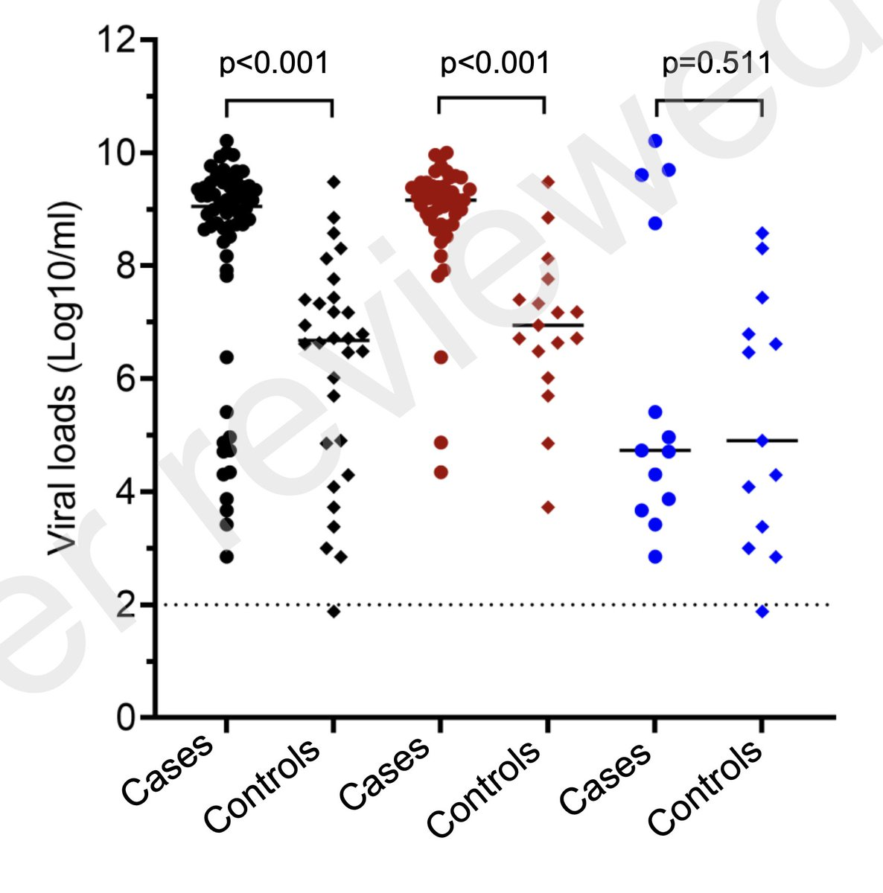</img></a><a href="E8hKZZLVEAQWL16.jpg"  >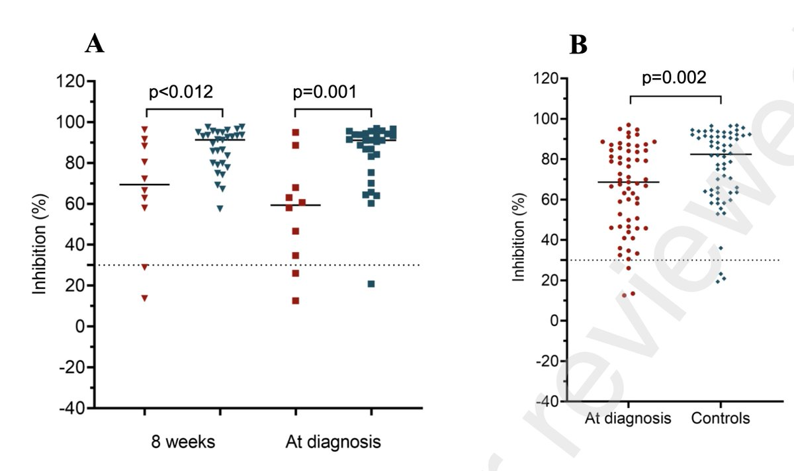</img></a><a href="E8hKbPPVgBEENDL.jpg"  >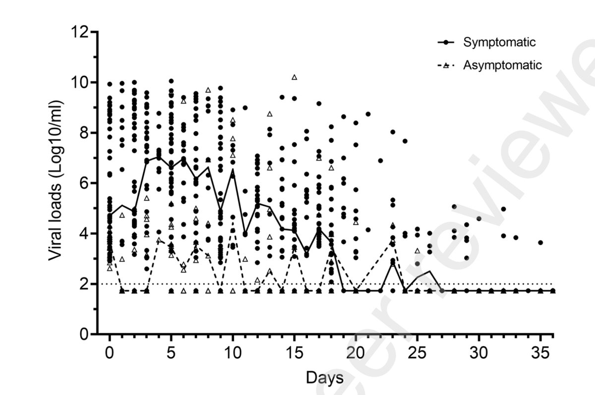</img></a>

---

<a href="https://twitter.com/erictopol/status/1425492860619481098" target="_blank" rel="noreferer">16:22 UCT</a>

There needs to be truth-telling about the reduced protection of mRNA vaccines vs symptomatic Delta infections. 
It was 95% pre-Delta. 
Many are claiming it's still ~80%.
It isn't. 
50-60% is best estimate from all sources (not US, since we don't have the data) 

<a href="E8hdr9pVEAI5cKE.jpg"  >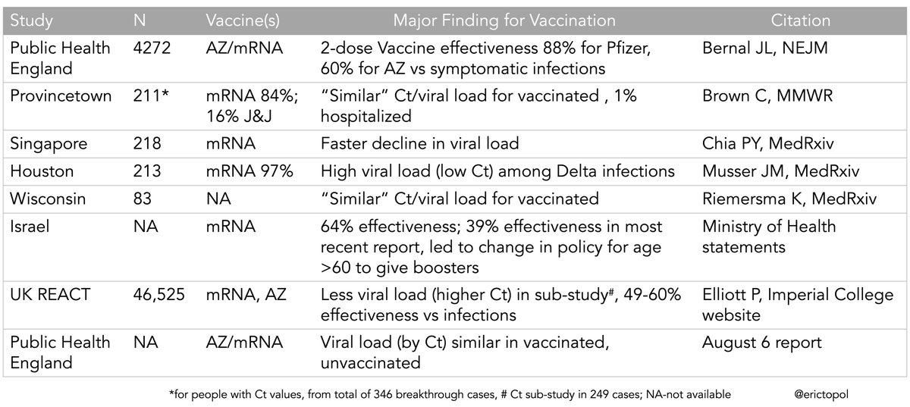</img></a>

---

<a href="https://twitter.com/erictopol/status/1425493540029620231" target="_blank" rel="noreferer">16:25 UCT</a>

Why is this important?
Because we need to protect the protected, the fully vaccinated.
Sure we want to get more people vaccinated, but truth engenders trust. And truth helps guide people to be safe, use masks, distance, ventilation and all the other tools we have and know helps.

---

<a href="https://twitter.com/erictopol/status/1425494532888567810" target="_blank" rel="noreferer">16:29 UCT</a>

Look at Israel's Delta case surge, a model country for vaccination, &gt;15 per cent points more of total population vaccinated than the US. That, in itself, tells us about the reduction of protection of mRNA vaccines vs cases/spread 

<a href="E8hfe1WUYAMd4Pq.jpg"  >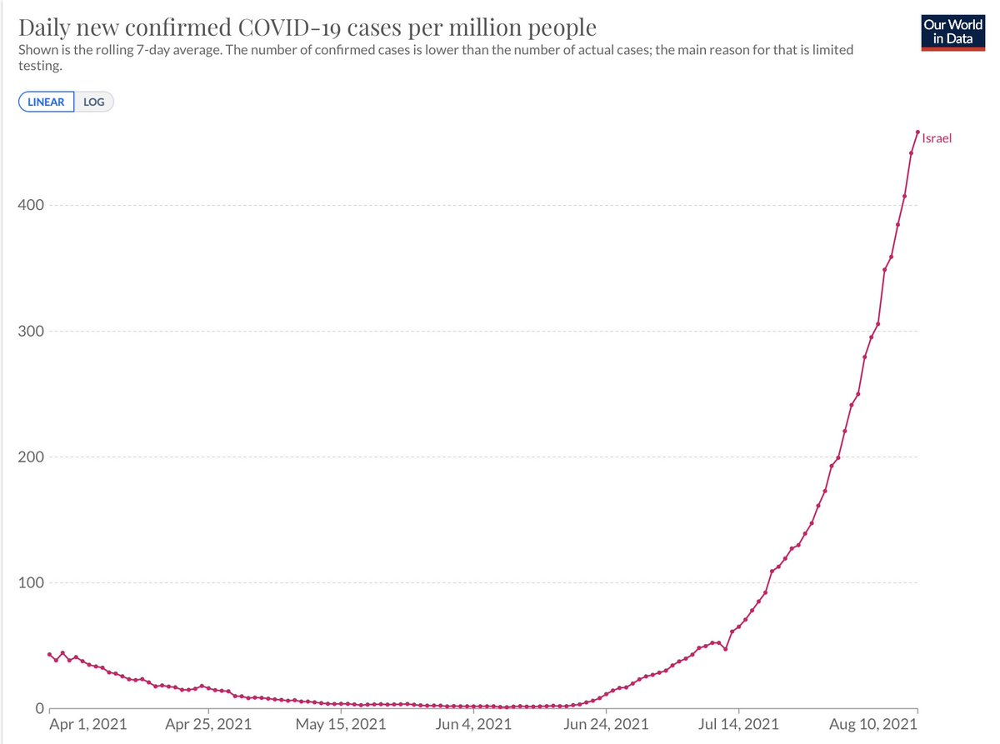</img></a>

---

<a href="https://twitter.com/erictopol/status/1425503401714933764" target="_blank" rel="noreferer">17:04 UCT</a>

@EdCara4 49-60% UK REACT
lower range asymptomatics to upper range symptomatics
Israel severe illness, age &gt; 60 below 

<a href="E8hnqj8VoAMo2a6.jpg"  >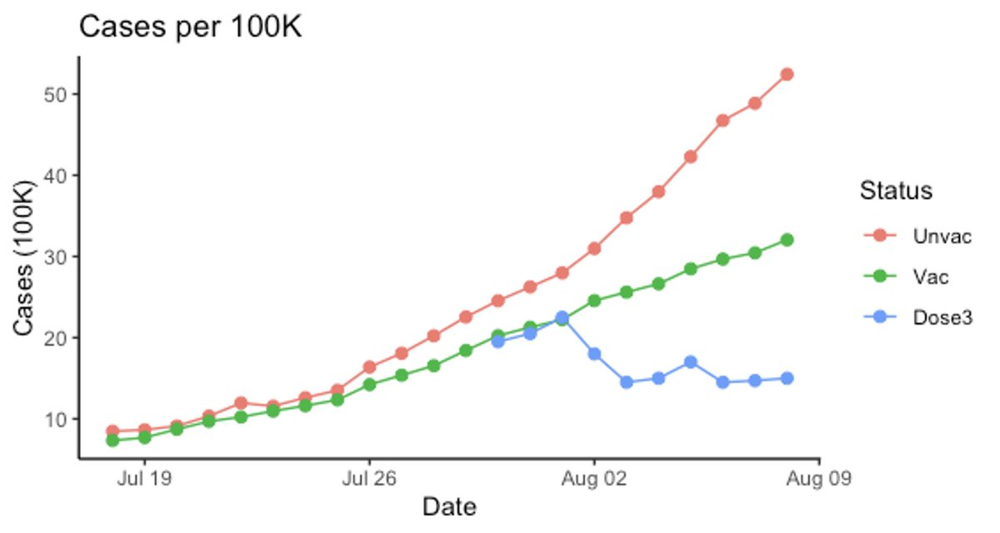</img></a>

---

<a href="https://twitter.com/erictopol/status/1425504883147362306" target="_blank" rel="noreferer">17:10 UCT</a>

@NateSilver538 Agree there's a lot of uncertainty, Nate. But without that certainty, continued assertions of very high protection are unhelpful. We would know precisely what the level of protection vs symptomatic infections was if we collected the data and did the proper studies

---

<a href="https://twitter.com/erictopol/status/1425507654919618566" target="_blank" rel="noreferer">17:21 UCT</a>

@leonidkruglyak @antonioregalado REACT is the best study, Leonid, including random sampling and the range of asymptomatic/mild to symptomatic infections of 49-60%, including mRNA. Israel's data are now less that that. What is your estimate?

---

<a href="https://twitter.com/erictopol/status/1425510556497108994" target="_blank" rel="noreferer">17:32 UCT</a>

I stand by my estimate, which includes soon to be published preprints with US data even lower than this range.
But the protection vs hospitalization and death is solid, holding up well, and is the reason why everyone should be vaccinated

---

<a href="https://twitter.com/erictopol/status/1425524452947677185" target="_blank" rel="noreferer">18:28 UCT</a>

@ashishkjha Thanks, Ashish
REACT upper range 60%, includes mRNA
Israel currently lower
I'll send you a preprint to review that'll post soon

---

<a href="https://twitter.com/erictopol/status/1425532329099886593" target="_blank" rel="noreferer">18:59 UCT</a>

@ashishkjha I'm sure you saw this one posted a few days ago with 42% for Pfizer vs Delta infections
https://www.medrxiv.org/content/10.1101/2021.08.06.21261707v2

---

<a href="https://twitter.com/erictopol/status/1425536128468230150" target="_blank" rel="noreferer">19:14 UCT</a>

It would be hard to envision this happening in the post-vaccination era, each day getting worse than anytime since the pandemic began 

<a href="E8iFfOhVcAMvAAt.jpg"  >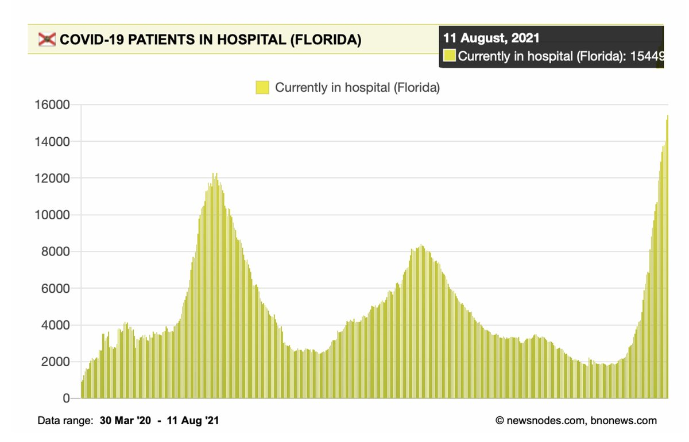</img></a>

---

<a href="https://twitter.com/erictopol/status/1425537104575041537" target="_blank" rel="noreferer">19:18 UCT</a>

@NuritBaytch That's right. Not at all confident about this big gap vs Moderna with the matching methodology used. But it is a replication of the Israeli (Pfizer) data of ~40% and it is time to stop denying the reduction in protection vs symptomatic infections with Delta

---

<a href="https://twitter.com/erictopol/status/1425557631230349318" target="_blank" rel="noreferer">20:39 UCT</a>

In the land of enough vaccines for every American and then some.....
Louisiana
Off-the-chart, vertical, highest hospitalizations for the pandemic
120/100,000 people: #1 cases/capita of any state/country worldwide 

<a href="E8iYmUsUcAQhIIY.jpg"  >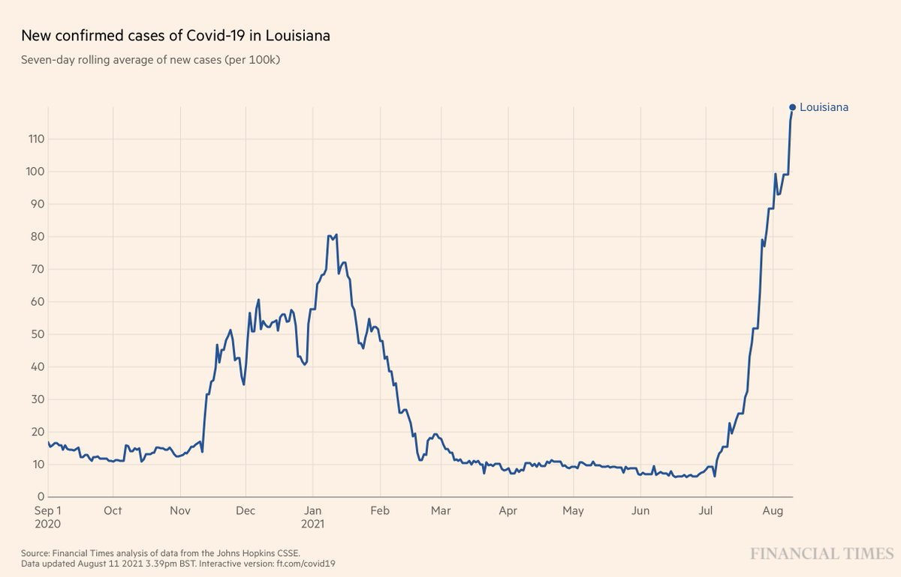</img></a><a href="E8iY3q1VoAI_pNJ.jpg"  >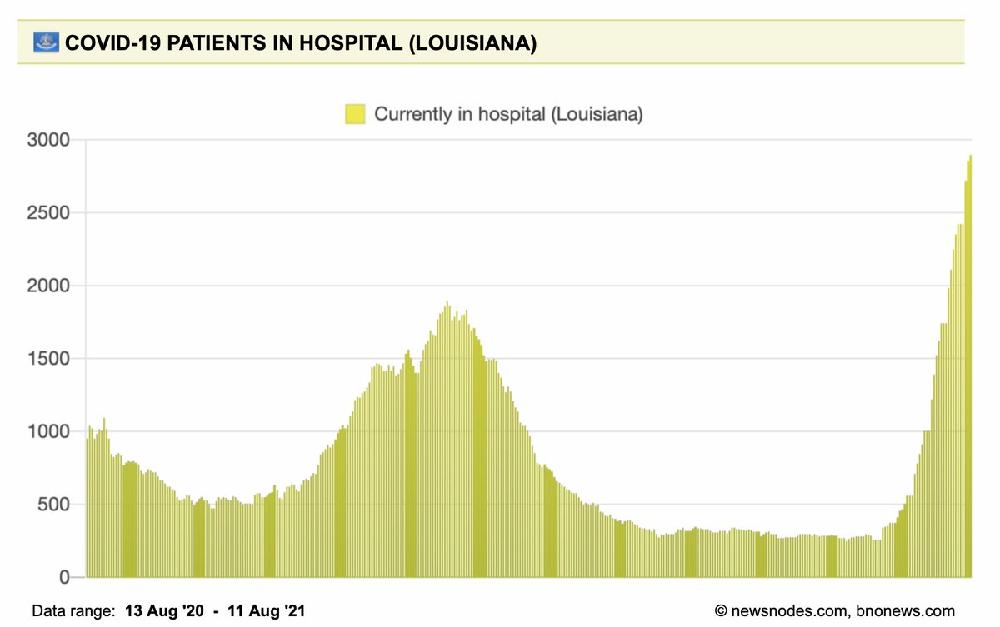</img></a>

---

<a href="https://twitter.com/erictopol/status/1425563354702172169" target="_blank" rel="noreferer">21:02 UCT</a>

Just published @NEJM 
A randomized trial of a 3rd dose of mRNA vaccine for people who have had an organ-transplant shows markedly improved immune response compared w/ placebo (&lt;-and why it's ideal to have this arm)
https://www.nejm.org/doi/full/10.1056/NEJMc2111462?query=featured_home 

<a href="E8ic44HWUAsA8zp.jpg"  >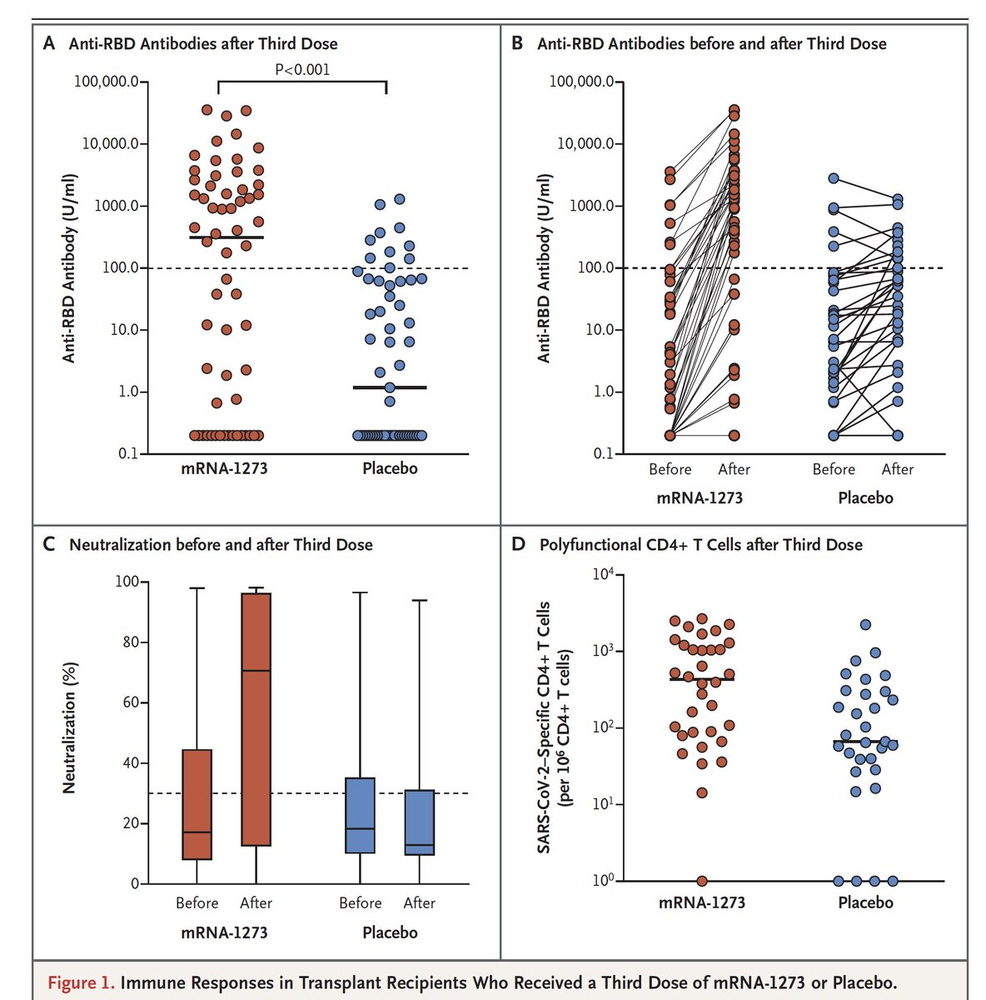</img></a>

---

<a href="https://twitter.com/erictopol/status/1425564329768783874" target="_blank" rel="noreferer">21:06 UCT</a>

The @moderna_tx covid vaccine trial in 3,732 teens, placebo-controlled, published today @NEJM with both excellent safety profile and efficacy vs covid, and immune  response as least as good as young adults https://www.nejm.org/doi/full/10.1056/NEJMoa2109522?query=featured_home 

<a href="E8ifHk8WEAELTyz.jpg"  >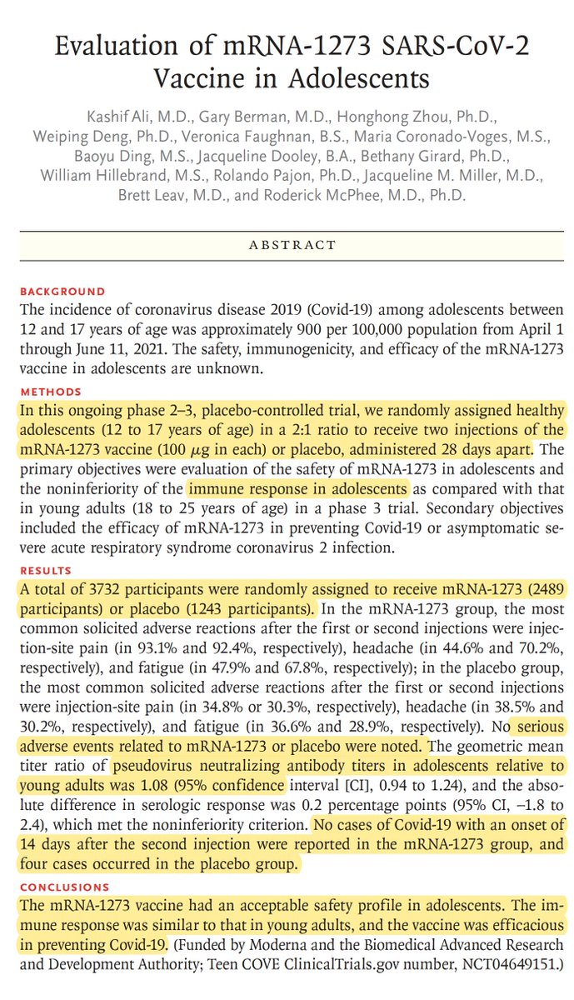</img></a><a href="E8id415XEAYQfp4.jpg"  >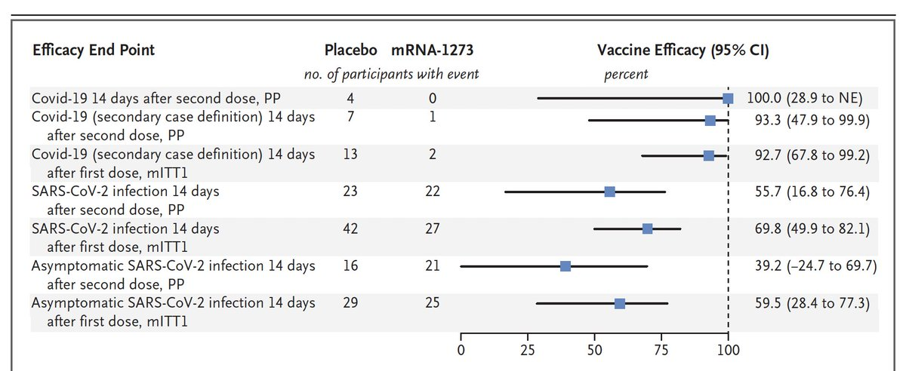</img></a>

---

<a href="https://twitter.com/erictopol/status/1425583390888136710" target="_blank" rel="noreferer">22:22 UCT</a>

More data summarized here, and more to come out soon
The Mayo Clinic study of 42% Pfizer vaccine efffectiveness vs Delta infections noted 

<a href="E8iwPGgVkAAt0-T.jpg"  >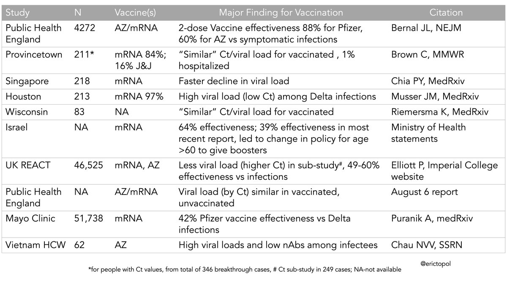</img></a>

---

<a href="https://twitter.com/erictopol/status/1425589829069271041" target="_blank" rel="noreferer">22:47 UCT</a>

New and important data on Delta breakthrough infections, large Qatar experience and follow-up of &gt; 1.2 million vaccinees https://www.medrxiv.org/content/10.1101/2021.08.11.21261885v1
 2-doses vaccine effectiveness vs infections
Pfizer 53.5%
Moderna 84.8%
Either 57.2%
(replicates gap of recent Mayo Clinic study) 

<a href="E8i2HYZUYAE-lvE.png"  >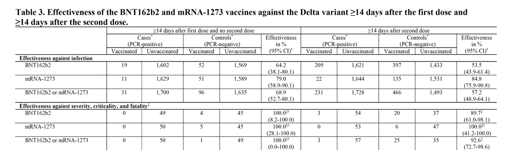</img></a>

---

<a href="https://twitter.com/erictopol/status/1425598379174752256" target="_blank" rel="noreferer">23:21 UCT</a>

Important footnote to the new Qatar study    May not be full explanation but likely contributes https://twitter.com/BobWood12/status/1425595052655529988

