+++
title = "Tweets by Eric Topol Aug 12"
Summary = ""
tags = ["Twitter"]
category = "Twitter"
+++

---

<a href="https://twitter.com/erictopol/status/1425610846927917063" target="_blank" rel="noreferer">00:11 UCT</a>

Simplified table of the 5 reported studies for 2-dose mRNA vaccine effectiveness vs Delta infections. The Mayo &amp; Qatar studies did not account for time from vaccination (Pfizer longer duration). Infection definitions vary.  UK data: 8-12 wks btwn doses, others 3 wks 
More to come  https://twitter.com/EricTopol/status/1425492860619481098

<a href="E8jI2b_VEAEkkZg.jpg"  >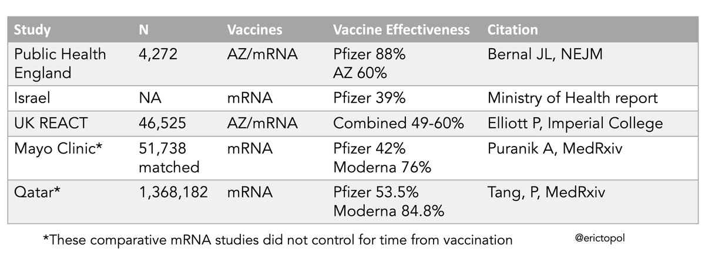</img></a>

---

<a href="https://twitter.com/erictopol/status/1425629387823542272" target="_blank" rel="noreferer">01:25 UCT</a>

Hospitalizations.
Already ~60% of peak pandemic.
Beyond twice the normalized peak of the Delta waves in UK and Israel. 

<a href="E8jZHibVIAIeAbp.jpg"  >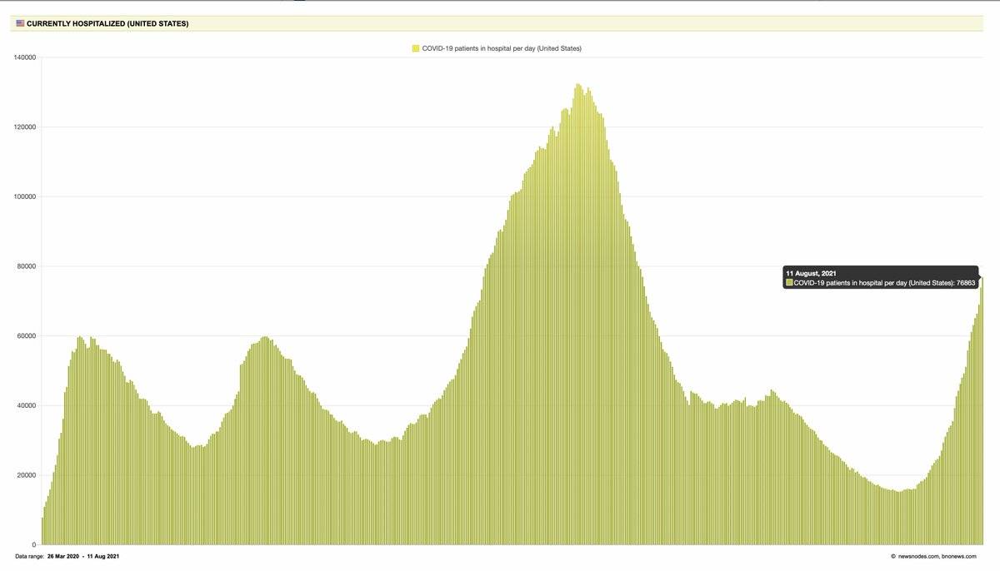</img></a><a href="E8jaP3tVcAIQQd9.jpg"  >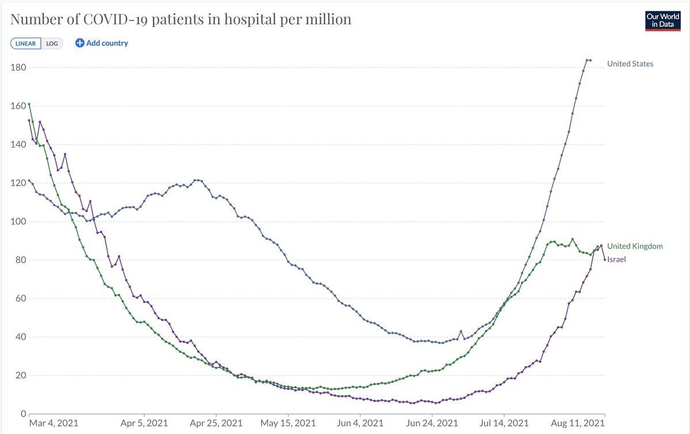</img></a>

---

<a href="https://twitter.com/erictopol/status/1425630114478387203" target="_blank" rel="noreferer">01:28 UCT</a>

RT @veeslerlab: Sharing our latest preprint on #SARSCoV2 B.1.617.2 (delta), B.1.617.2+ (delta+) and B.1.617.1 (kappa) variants led by @Dr_M…

---

<a href="https://twitter.com/erictopol/status/1425648823552991233" target="_blank" rel="noreferer">02:42 UCT</a>

@FerreiraVHF Great study! And to show the value of the placebo arm here, too. And the same day that the FDA approved boosters for immunocompromised, another reflection of your work 🙏 https://www.nytimes.com/2021/08/11/us/politics/third-vaccine-dose-approval.html?action=click&module=Top%20Stories&pgtype=Homepage by @SharonLNYT @noahweiland

---

<a href="https://twitter.com/erictopol/status/1425783776169193474" target="_blank" rel="noreferer">11:38 UCT</a>

@apoorva_nyc That’s not severe illness, which was my point.

---

<a href="https://twitter.com/erictopol/status/1425798861591777284" target="_blank" rel="noreferer">12:38 UCT</a>

The diagnosis and denial of waning immunity from Delta infections (*does not pertain to hospitalizations or deaths*)
In July, @IsraelMOH issued a report that showed a marked decline in mRNA vaccine (@Pfizer) protection vs Delta infections, down to 40%. That was met with disbelief 

<a href="E8lrJSxVcAMbBZr.jpg"  >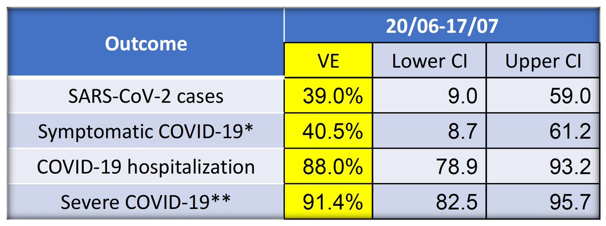</img></a>

---

<a href="https://twitter.com/erictopol/status/1425798866729795589" target="_blank" rel="noreferer">12:38 UCT</a>

There are now 5 mRNA vaccine effectiveness studies for preventing Delta infections, and more on the way. Except for @PHE_UK, all show a marked reduction, particularly for @Pfizer, but the @moderna_tx comparison is confounded by its later administration (less chance to see waning) 

<a href="E8lrtYHVkAAUXp6.jpg"  >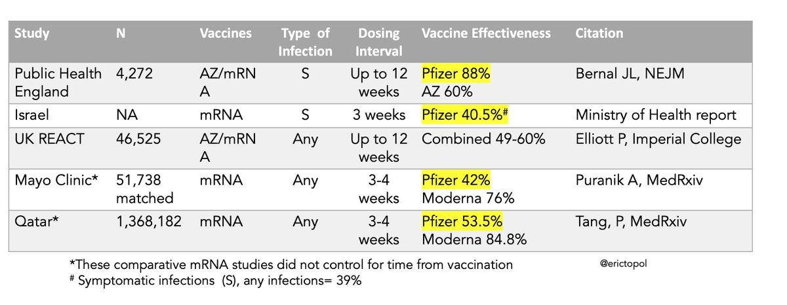</img></a>

---

<a href="https://twitter.com/erictopol/status/1425798871045705730" target="_blank" rel="noreferer">12:38 UCT</a>

This reduction of protection is quite different from the 6-month follow up of the Pfizer and Moderna pivotal trials which showed modest decline, but were against the original strain, not Delta
https://www.medrxiv.org/content/10.1101/2021.07.28.21261159v1.full.pdf
https://www.nytimes.com/2021/08/05/world/moderna-vaccine-efficacy.html 

<a href="E8luJZiVIAQ2YrL.jpg"  ></img></a>

---

<a href="https://twitter.com/erictopol/status/1425798876196327426" target="_blank" rel="noreferer">12:38 UCT</a>

This vulnerability to infections appears to be driven by time since vaccine, such as seen in this Israeli analysis. The age trend is noted, not statistically significant 
https://www.medrxiv.org/content/10.1101/2021.08.03.21261496v1__cf_chl_jschl_tk__=pmd_e2ea998b4d62d17a2afd596b60deedbd98393a3c-1628225627-0-gqNtZGzNAfijcnBszQfi 

<a href="E8lwJN5VcBI6ofh.jpg"  >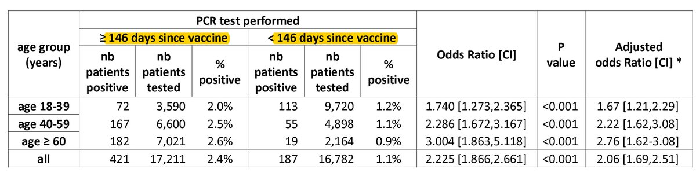</img></a>

---

<a href="https://twitter.com/erictopol/status/1425798879585325064" target="_blank" rel="noreferer">12:38 UCT</a>

Which brings me to the outlier @PHE_UK report which suggests there was preserved VE for Pfizer.  Again we  don't know the time from vaccination which may have been shorter. The longer spacing, up to 12 weeks, may have induced a stronger immune response.

---

<a href="https://twitter.com/erictopol/status/1425798878327050242" target="_blank" rel="noreferer">12:38 UCT</a>

Why the differences between Pfizer and Moderna?
They are likely considerably less and skewed due to longer time from Pfizer vaccine, not accounted for in the studies. But there may still be a gap, with the higher relative dose and slightly (1 week) longer spacing

---

<a href="https://twitter.com/erictopol/status/1425798884131934209" target="_blank" rel="noreferer">12:38 UCT</a>

Bottom line: There is clearcut evidence of waning immunity for mRNA vaccines vs Delta infections, pronounced with Pfizer, but very likely affecting Moderna too. My estimate yesterday of 50-60% was likely optimistic as we get beyond 6 months + more exposure.

---

<a href="https://twitter.com/erictopol/status/1425798882613620745" target="_blank" rel="noreferer">12:38 UCT</a>

The data for neutralizing antibody titer decline and its association with risk of Delta infection has become clear from multiple studies, such as the Vietnam report in healthcare workers with infections https://papers.ssrn.com/sol3/papers.cfm?abstract_id=3897733 

<a href="E8l0PK_VIAUmoV3.png"  >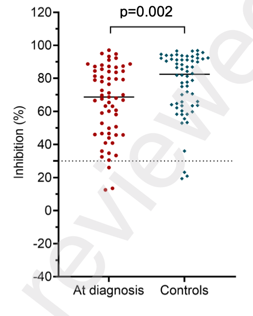</img></a>

---

<a href="https://twitter.com/erictopol/status/1425802929550749698" target="_blank" rel="noreferer">12:54 UCT</a>

@mugecevik @danieloran @PNASNews @Pratha_Sah @Alison_Galvani @MeaganCFitz @YaleSPH @YCIDMA @nicolamlow @BogochIsaac No. To set the record straight, we published at least one-third, which is fully aligned with the @YaleSPH comprehensive review. 

<a href="E8l3iCfUUAIznke.jpg"  >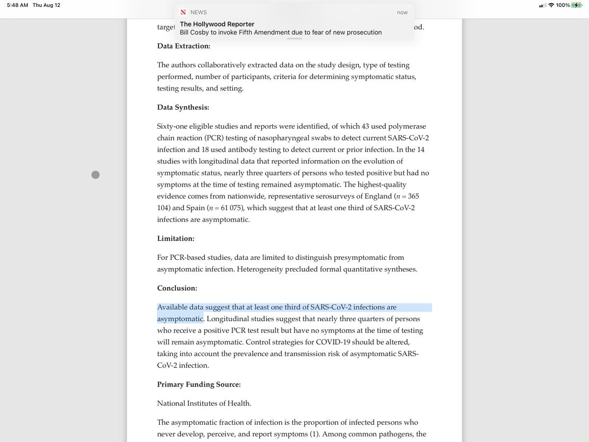</img></a>

---

<a href="https://twitter.com/erictopol/status/1425811237309349889" target="_blank" rel="noreferer">13:27 UCT</a>

@apoorva_nyc If the vaccines were “designed” to protect against severe illness, that should have been the primary endpoint of the pivotal clinical trials, but it wasn’t. They were woefully underpowered to detect an impact an severe illness, which is why we wrote the @nytopinion piece.

---

<a href="https://twitter.com/erictopol/status/1425814071861936141" target="_blank" rel="noreferer">13:38 UCT</a>

These findings are important regarding the consideration for boosters. Health care workers and older individuals  are the people most likely to now be &gt;5-6 months out from vaccination and are at increased risk for Delta infections

---

<a href="https://twitter.com/erictopol/status/1425817025360797701" target="_blank" rel="noreferer">13:50 UCT</a>

Delta deaths. 
With rare exceptions, people we have lost unnecessarily 

<a href="E8mEqGmUYAI7kiG.jpg"  >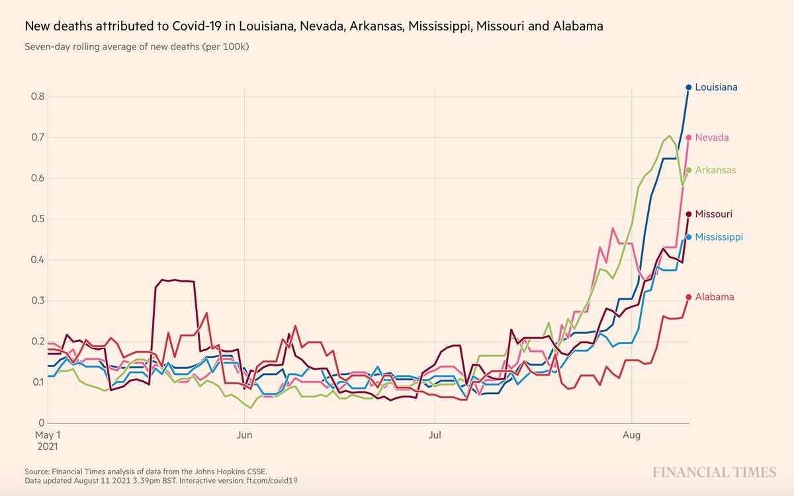</img></a>

---

<a href="https://twitter.com/erictopol/status/1425823943793938441" target="_blank" rel="noreferer">14:18 UCT</a>

@mugecevik @danieloran @PNASNews @Pratha_Sah @Alison_Galvani @MeaganCFitz @YaleSPH @YCIDMA @nicolamlow @BogochIsaac Maybe you need to read that paper:
"the asymptomatic infection rate may be as high as 40% to 45%. A conservative estimate would be 30% or higher to account for the presymptomatic admixture that has thus far not been adequately quantified."

---

<a href="https://twitter.com/erictopol/status/1425825440636162050" target="_blank" rel="noreferer">14:24 UCT</a>

RT @dwallacewells: The vaccines are still performing quite well in preventing severe disease. But with Delta they are doing much worse in s…

---

<a href="https://twitter.com/erictopol/status/1425838555893362688" target="_blank" rel="noreferer">15:16 UCT</a>

@notdred Wrong. My purpose was to shed light on the problem that has not been adequately acknowledged with considerable new data and more that is about to show up. I have previously written about the lack of data supporting boosters and wish they wouldn't be necessary.

---

<a href="https://twitter.com/erictopol/status/1425851083226705926" target="_blank" rel="noreferer">16:06 UCT</a>

The impact of mRNA vaccination doses on T cell priming vs #SARSCoV2. New @ImmunityCP 
Dose 2 important for people with no prior Covid, but single vaccine dose achieved this well with prior Covid
https://www.cell.com/immunity/fulltext/S1074-7613(21)00308-3 @markmpainter @WherryLab @SetteLab @EJohnWherry @ljiresearch 

<a href="E8mjKLvUYAENUJu.jpg"  >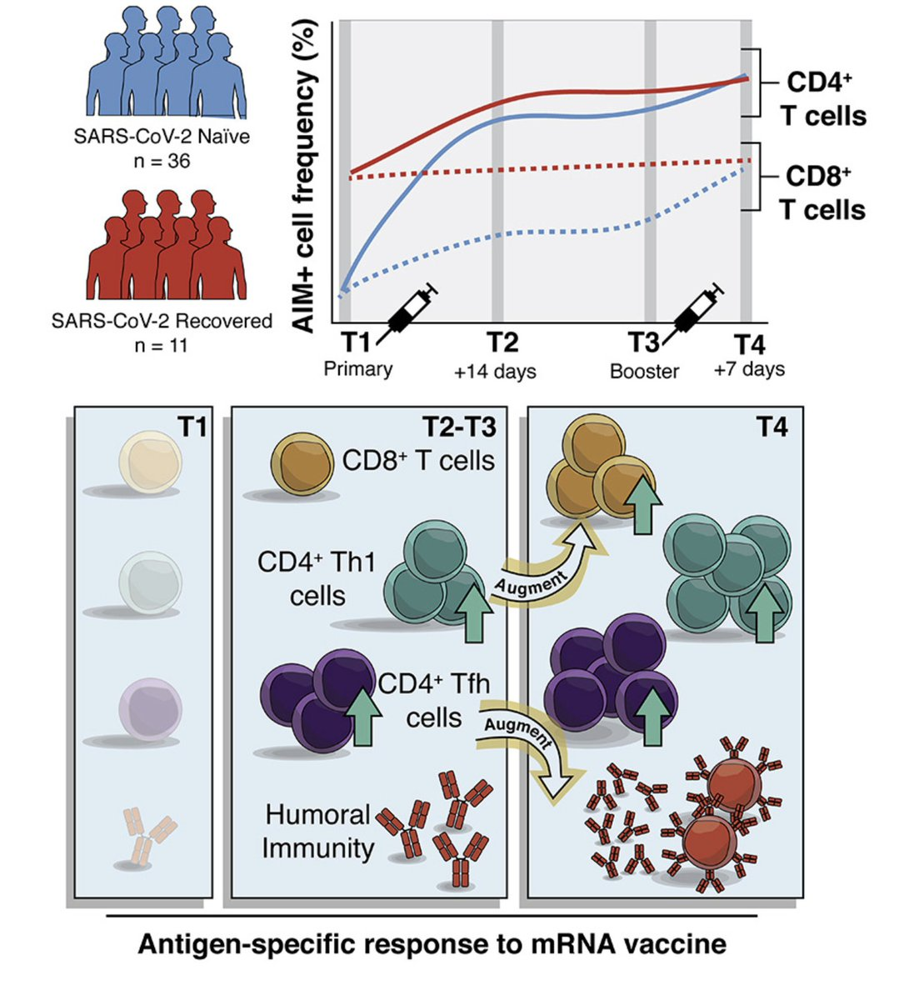</img></a>

---

<a href="https://twitter.com/erictopol/status/1425873808511041540" target="_blank" rel="noreferer">17:36 UCT</a>

A new study sheds light on viral load, viral culture, asymptomatic status among vaccinated w/Delta infections
"68% of individuals infected despite vaccination tested positive with Ct &lt;25, including at least 8 who were asymptomatic at the time of testing"
https://www.medrxiv.org/content/10.1101/2021.07.31.21261387v3 

<a href="E8m2zgUUcAIZk0J.jpg"  >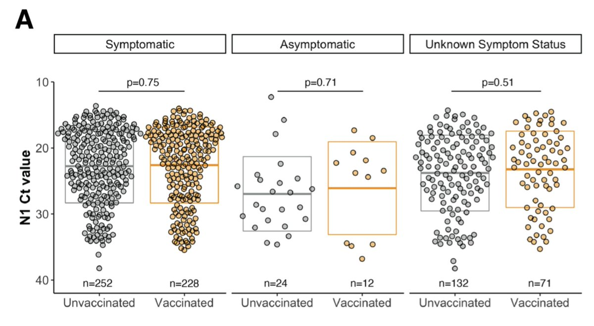</img></a><a href="E8m237GVgAImGf2.jpg"  >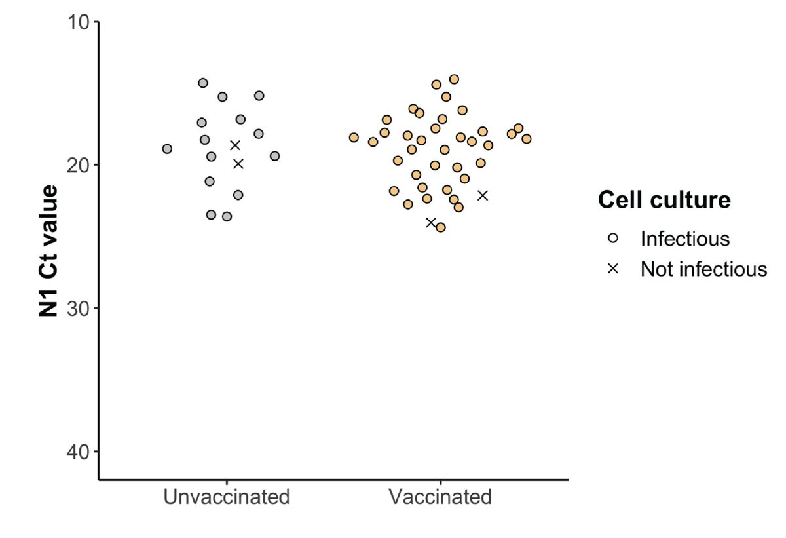</img></a><a href="E8m3ANnUYAEx70i.jpg"  >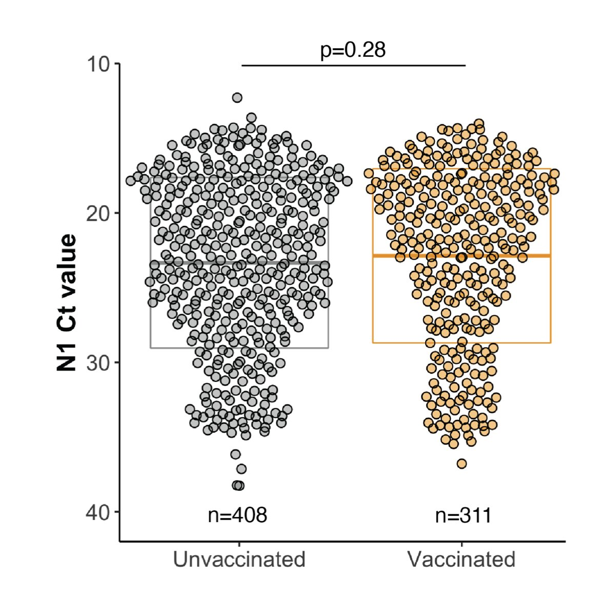</img></a>

---

<a href="https://twitter.com/erictopol/status/1425873813888147459" target="_blank" rel="noreferer">17:36 UCT</a>

“The bottom line is, this can happen — it can be true that vaccinated people can spread the virus. But we do not yet know what their relative role in overall community spread is" @nature
https://www.nature.com/articles/d41586-021-02187-1 

<a href="E8m4U8tUcAMVpoJ.jpg"  >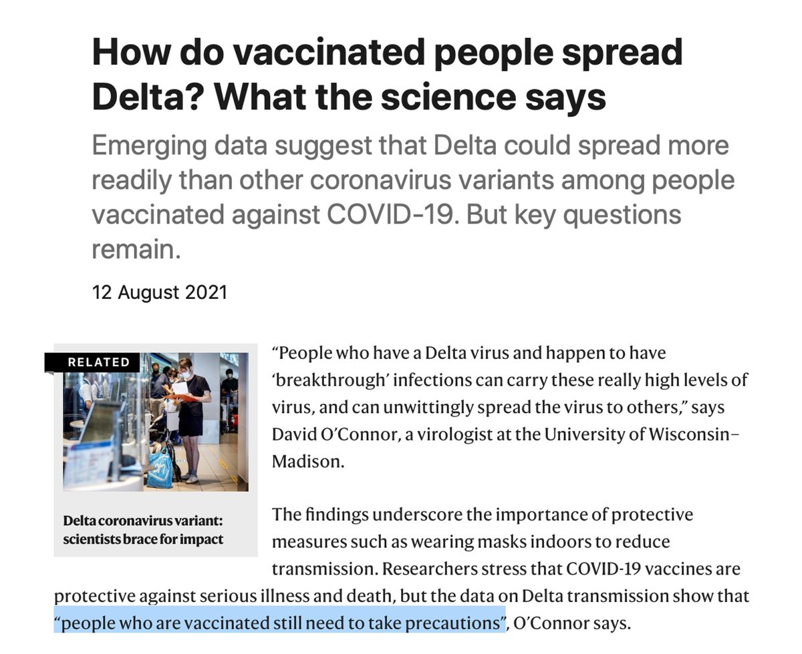</img></a>

---

<a href="https://twitter.com/erictopol/status/1425875777589972994" target="_blank" rel="noreferer">17:44 UCT</a>

We often tag @justsaysinmice when a report is only conducted in mice, not people.
We need #justsayitsDelta or not for covid findings. 
Pre-D posts are not particularly helpful unless it's for comparison sake.

---

<a href="https://twitter.com/erictopol/status/1425883710834962436" target="_blank" rel="noreferer">18:15 UCT</a>

Just published @ScienceMagazine 
Lab studies from people who got @moderna_tx 2-dose vaccines to assess response to variants, including Delta (B.1.617.2) at 7 months, showing a fairly durable response, albeit at lower levels of🦠binding, neutralization
https://science.sciencemag.org/content/early/2021/08/11/science.abj4176 

<a href="E8nAwhoUcAIy76W.jpg"  >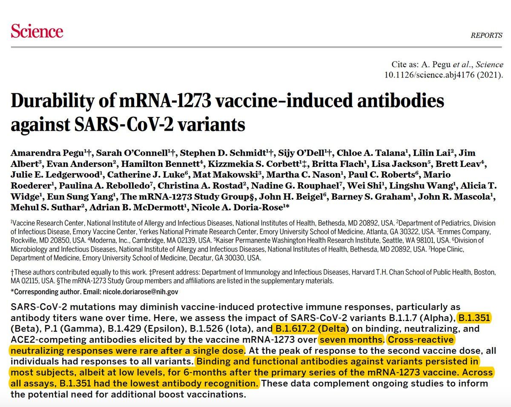</img></a><a href="E8nAyMsUUAE_1fa.jpg"  >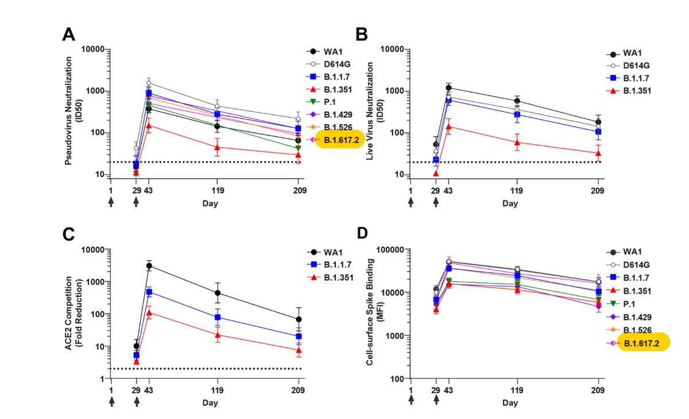</img></a><a href="E8nAzwyUYAceX3H.jpg"  >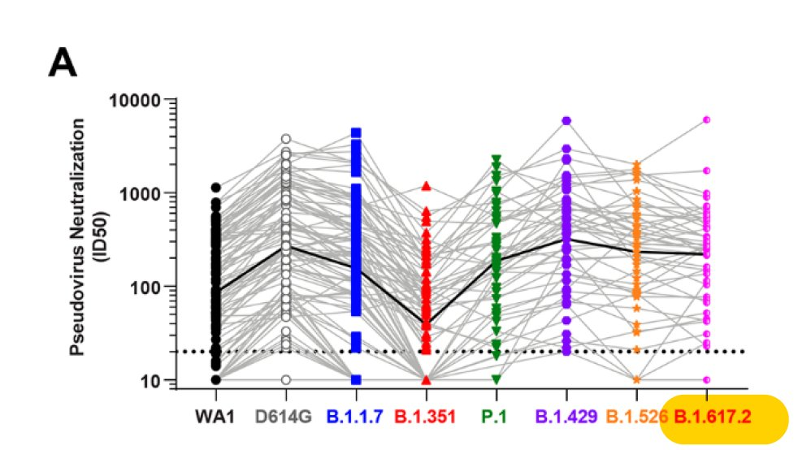</img></a><a href="E8nA1dFVkAAfu-u.jpg"  >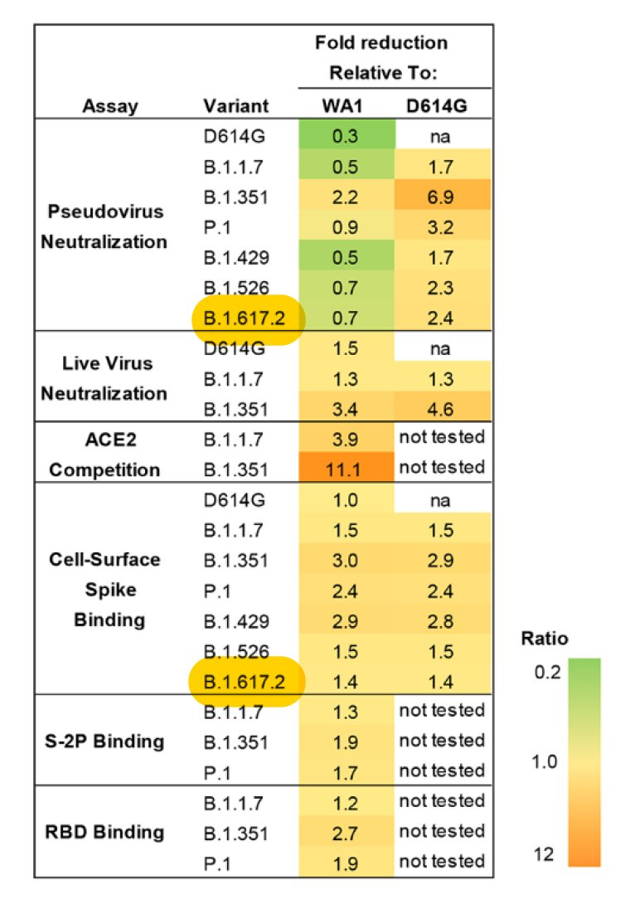</img></a>

---

<a href="https://twitter.com/erictopol/status/1425884971953123334" target="_blank" rel="noreferer">18:20 UCT</a>

Really, Florida?
Such a tragedy.
Now 4,000 hospitalizations over highest N and persistent sharp ascent of its Delta wave 

<a href="E8nC0USVcAYPo7n.jpg"  >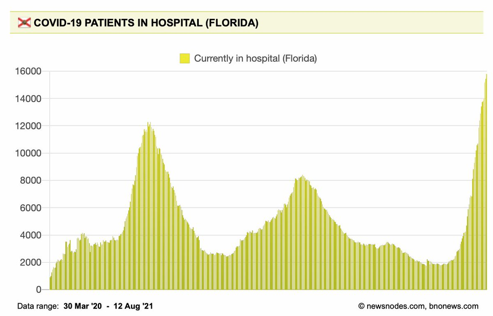</img></a>

---

<a href="https://twitter.com/erictopol/status/1425904764097757185" target="_blank" rel="noreferer">19:39 UCT</a>

Very good instructional infographic by @LaurenLeatherby @nytgraphics to convey the impact of per cent vaccinated or unvaccinated on Delta infection spread and outcomes https://www.nytimes.com/interactive/2021/08/12/science/covid-delta-breakthrough.html?smid=tw-nytimesscience&smtyp=cur w/ @nataliexdean, Cécile Viboud, and https://covid19scenariomodelinghub.org

---

<a href="https://twitter.com/erictopol/status/1425913941549453317" target="_blank" rel="noreferer">20:15 UCT</a>

RT @ashishkjha: @EricTopol With probably a week or 10 days of rising hospitalizations already baked in

This is a nightmare

---

<a href="https://twitter.com/erictopol/status/1425957995511382018" target="_blank" rel="noreferer">23:10 UCT</a>

A new prospective mix and match vaccine study shows the AZ, then Pfizer dosing has a stronger immune response than 2 doses of either vaccine, and the different regimens appear safe, replicating other reports
https://www.thelancet.com/journals/lanres/article/PIIS2213-2600(21)00357-X/fulltext @LancetRespirMed 

<a href="E8oFDUsVcAE7kg6.jpg"  >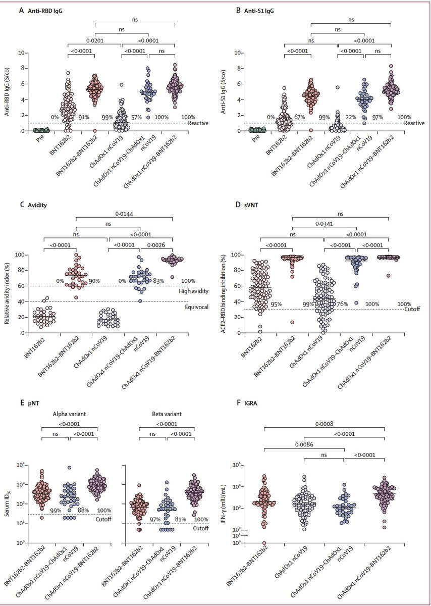</img></a>