+++
title = "Tweets by Eric Topol Aug 15"
Summary = ""
tags = ["Twitter"]
category = "Twitter"
+++

---

<a href="https://twitter.com/erictopol/status/1426696669836451841" target="_blank" rel="noreferer">00:06 UCT</a>

@Trent_A_Horton You are wrong
https://www.nytimes.com/interactive/2021/us/oregon-covid-cases.html 

<a href="E8ylDVBUUAEF1yv.png"  >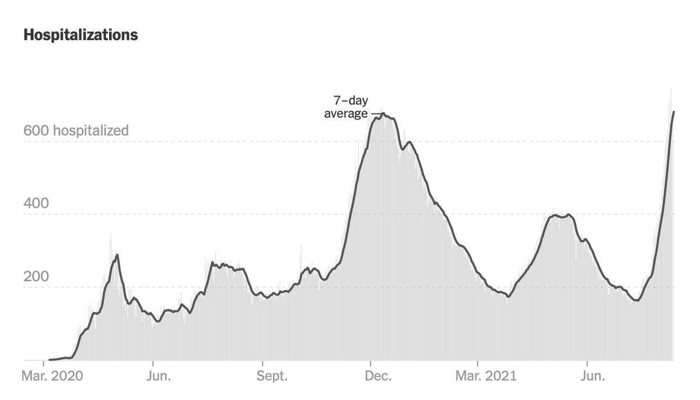</img></a>

---

<a href="https://twitter.com/erictopol/status/1426754774377005058" target="_blank" rel="noreferer">03:57 UCT</a>

@hthompsn Exactly. Well put. 🙏

---

<a href="https://twitter.com/erictopol/status/1426799271156731904" target="_blank" rel="noreferer">06:53 UCT</a>

Our covid times :-)
by @stephanpastis 

<a href="E80CV7OVoAMVaCg.jpg"  >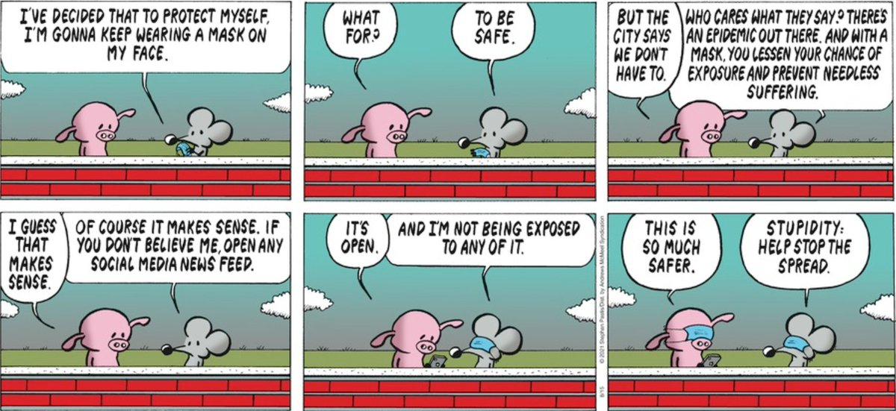</img></a>

---

<a href="https://twitter.com/erictopol/status/1426902842422353924" target="_blank" rel="noreferer">13:45 UCT</a>

Data are accruing to support the impact of boosters for reducing Delta breakthrough infections
Here by age ≥ 60
And below by restoring vaccine effectiveness to high levels (all age groups are now &gt; 6 months out, except teens who are newly vaccinated) https://twitter.com/BarakRaveh/status/1426858407592595466 https://twitter.com/segal_eran/status/1426835378292633602

---

<a href="https://twitter.com/erictopol/status/1426903429041950731" target="_blank" rel="noreferer">13:47 UCT</a>

Key graph via @BarakRaveh 

<a href="E81gt2OVcAEqDzt.jpg"  >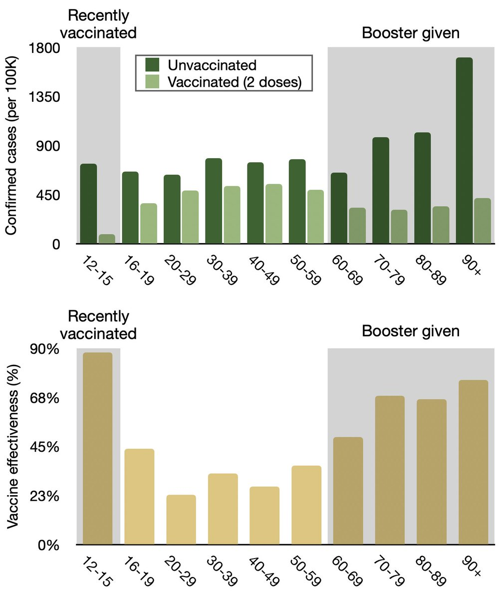</img></a>

---

<a href="https://twitter.com/erictopol/status/1426906782140493828" target="_blank" rel="noreferer">14:01 UCT</a>

Here in San Diego all COVID hospitalizations are tracked by vaccination status, and the Delta wave is properly partitioned. These odds look pretty good for how to avoid a hospitalization from the Delta strain @SDCountyHHSA 
(Hint: #VaccinesWork) https://twitter.com/SanDiegoCounty/status/1425909612239196162

---

<a href="https://twitter.com/erictopol/status/1426908690355945479" target="_blank" rel="noreferer">14:08 UCT</a>

If you’re thinking these are “just” infections, what about symptomatic infections? The @IsraelMOH reports have a shown close correlation, VE = vaccine effectiveness 

<a href="E81lx6jVUAMe2jx.jpg"  >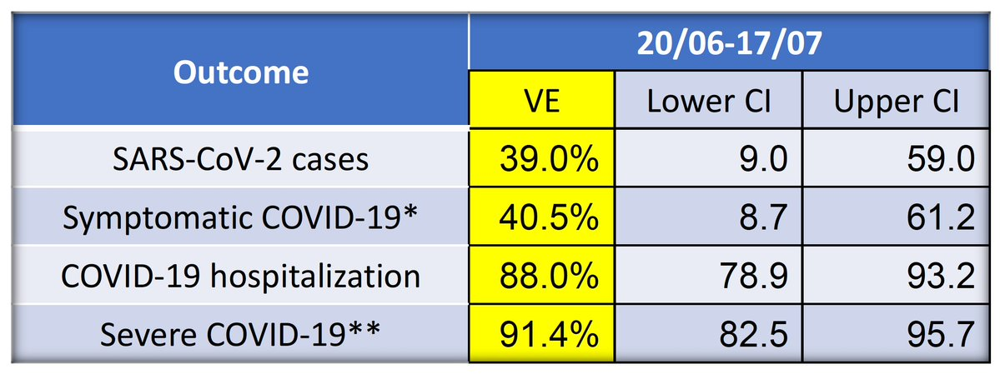</img></a>

---

<a href="https://twitter.com/erictopol/status/1426935347846340616" target="_blank" rel="noreferer">15:54 UCT</a>

Having already surpassed its pandemic peak of cases and hospitalizations, Mississippi's current trajectory is vertical—unbridled spread. The state's leadership has no effective plan to deal with it. This is America.
https://thehill.com/homenews/state-watch/567861-mississippi-governor-defends-covid-response-after-extending-state-of @thehill  by @natalie_prieb  @tatereeves 

<a href="E816NxhVoAI_MgE.jpg"  >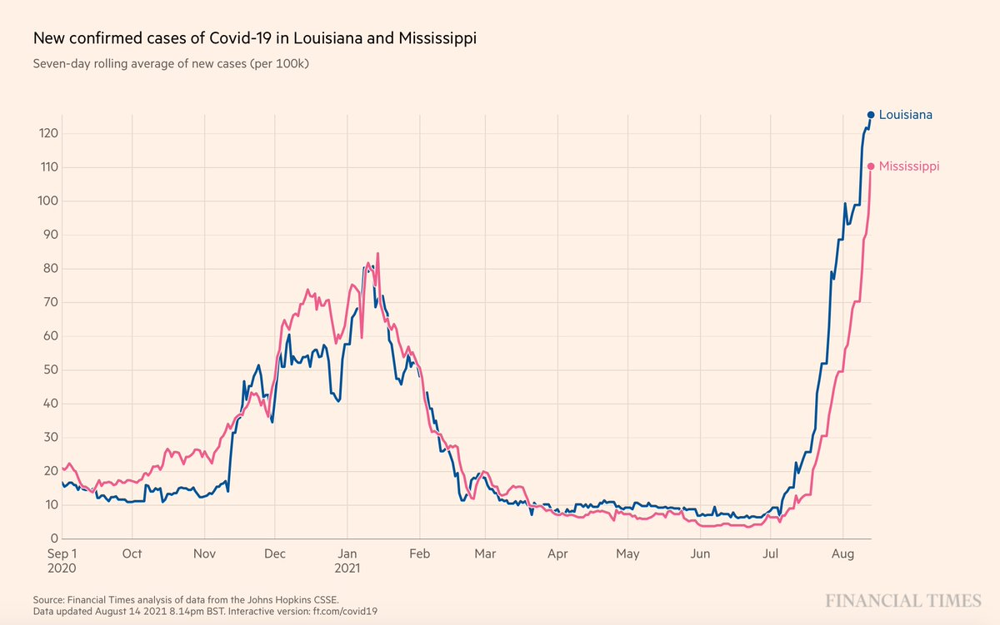</img></a><a href="E817v3xUUAcWQ0r.jpg"  >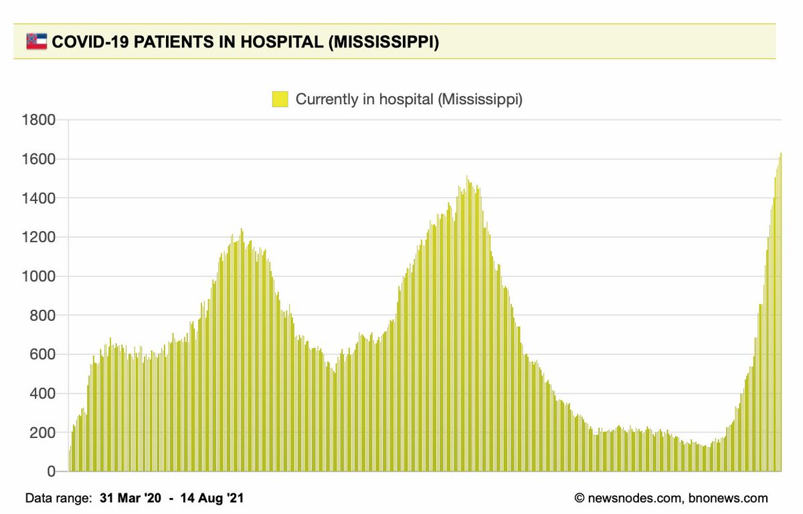</img></a>

---

<a href="https://twitter.com/erictopol/status/1426941542963367942" target="_blank" rel="noreferer">16:19 UCT</a>

RT @Atul_Gawande: "There were too many cases to count." The experience of fighting a pandemic with an underfunded and understaffed public h…

---

<a href="https://twitter.com/erictopol/status/1426950426088271872" target="_blank" rel="noreferer">16:54 UCT</a>

RT @ServitudeClass: This is very accurate. 

COVID Delta Variant: Our Biggest Challenge Yet with Eric Topol, MD https://youtu.be/haG1yKJVVAw via…

---

<a href="https://twitter.com/erictopol/status/1426954777137598469" target="_blank" rel="noreferer">17:11 UCT</a>

Why hasn't Israel had a Delta wave U-turn like the UK?  Possible explanations:
—It's a month behind
—Both countries high % fully vaccinated but Israel achieved very early; waning immunity w/ Delta 
—Vaccine dose spacing 3 wks is inferior to 8-12 wks for a durable immune response 

<a href="E82OwvMVkAY-zFI.jpg"  >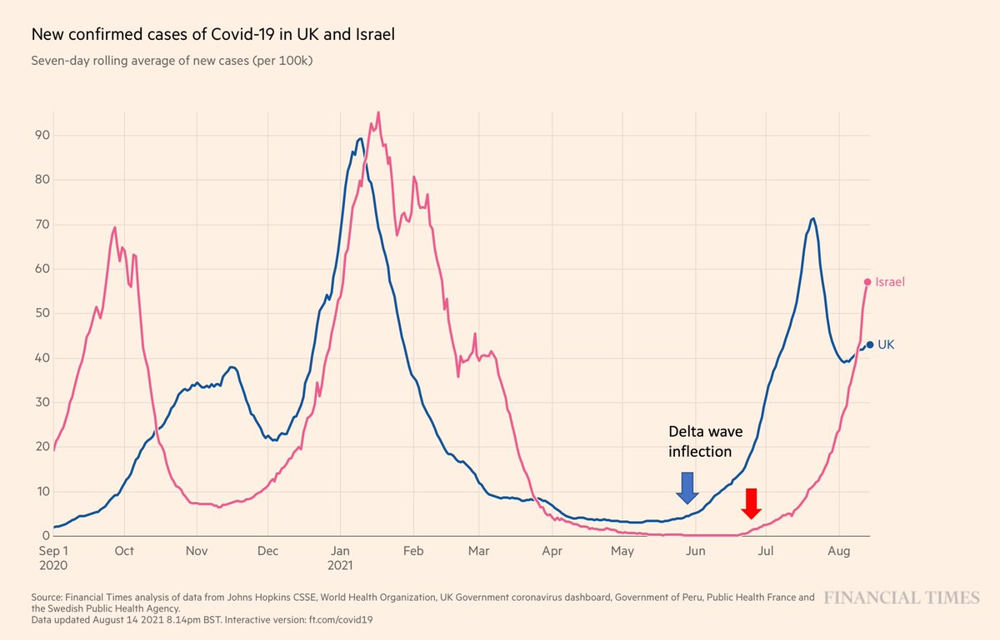</img></a><a href="E82PqG-VgAIURGm.jpg"  >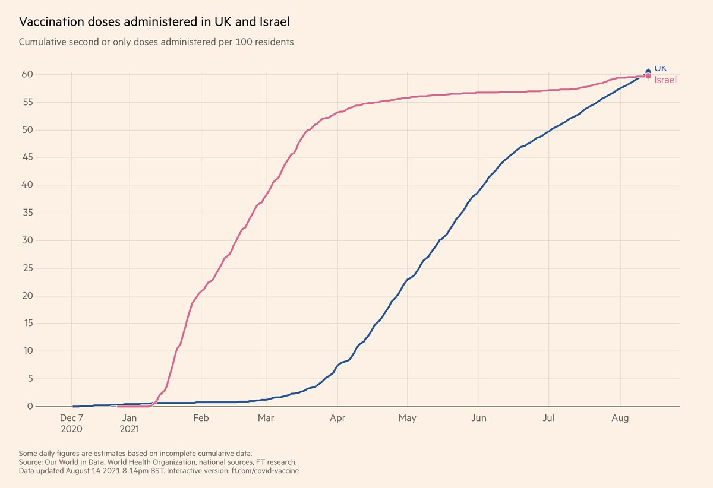</img></a>

---

<a href="https://twitter.com/erictopol/status/1426961714554163200" target="_blank" rel="noreferer">17:39 UCT</a>

The log-plot gives an enhanced view of trajectory for the 2 countries, and from more than an order of magnitude difference in baseline before Delta hit. 

<a href="E82Vpo1VEAcmG1C.jpg"  >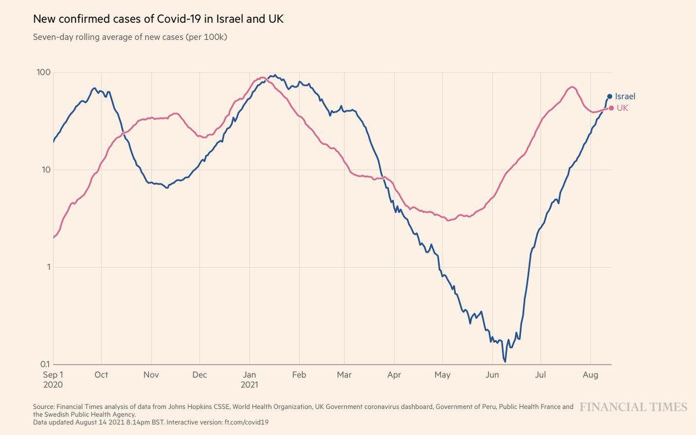</img></a>

---

<a href="https://twitter.com/erictopol/status/1426964025846362112" target="_blank" rel="noreferer">17:48 UCT</a>

@NateSilver538 Agree, that's possible. But, if anything, Israel has fared worse on a case/capita basis. Their testing levels have been fairly similar, especially in the Alpha and Delta waves. 

<a href="E82Xwm9UYAAW3LO.jpg"  >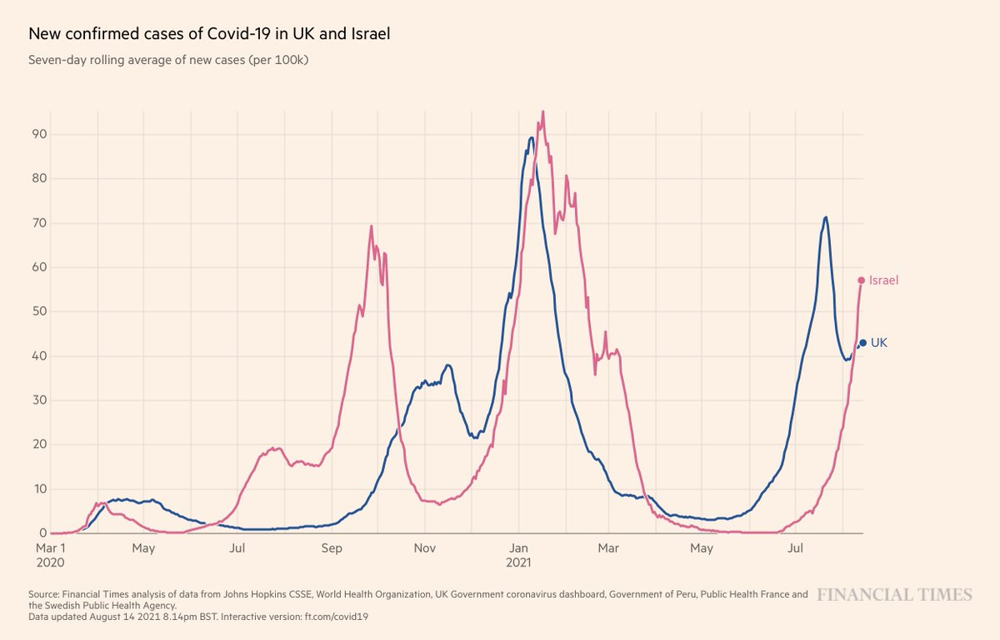</img></a>

---

<a href="https://twitter.com/erictopol/status/1426971389005754371" target="_blank" rel="noreferer">18:17 UCT</a>

What vaccination strategies lead to the highest level of neutralizing Ab, immune response, in rank order?
1. Prior covid + mRNA 1-dose
2. Adenoviral-vector vaccine 1st dose, mRNA 2nd dose
3. 2 doses mRNA
4. 2 doses adenoviral vector (AZ data)

---

<a href="https://twitter.com/erictopol/status/1426971394680578048" target="_blank" rel="noreferer">18:17 UCT</a>

Links to support
Hybrid (natural + vaccine)
https://science.sciencemag.org/content/372/6549/1392
by @profshanecrotty @ScienceMagazine 
Mix and match
https://twitter.com/EricTopol/status/1425957995511382018
https://www.nature.com/articles/s41591-021-01464-w
https://twitter.com/EricTopol/status/1421099253691150340 

<a href="E82cy42VEAMe5wg.jpg"  >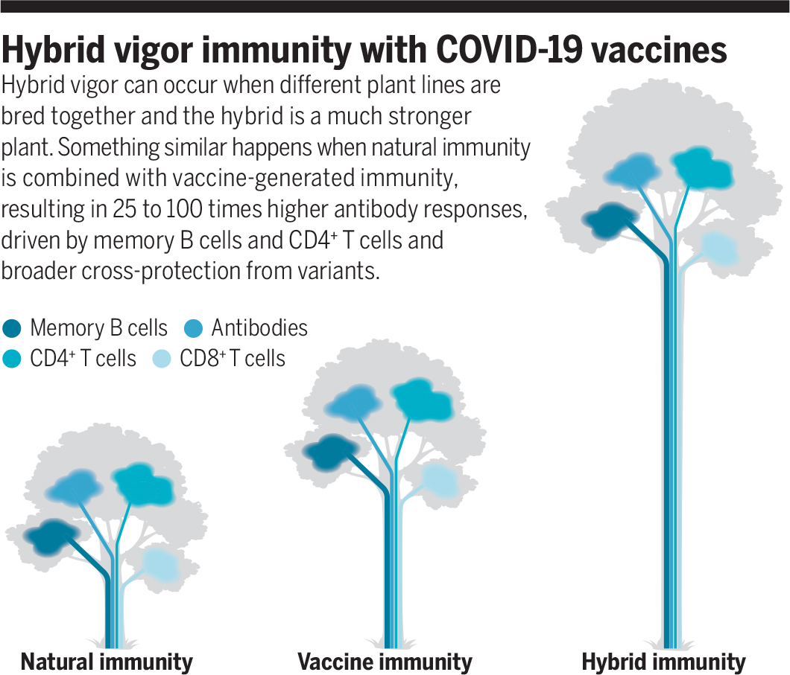</img></a><a href="E82d4JrUUAYTdSI.jpg"  >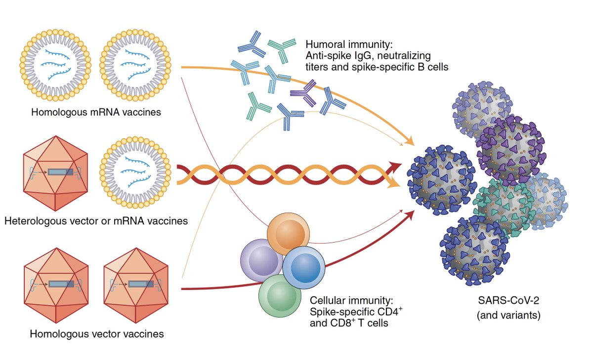</img></a><a href="E82eKM1VgAQ1BzY.jpg"  >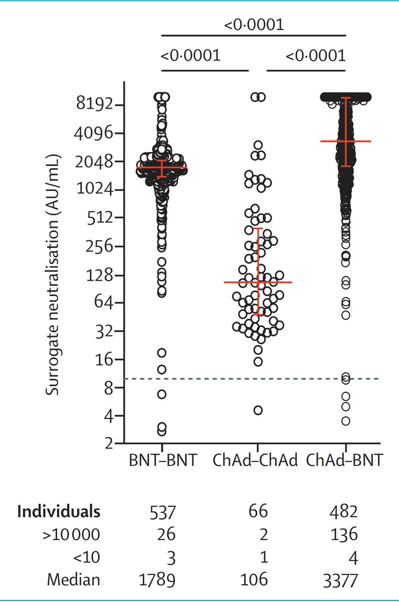</img></a>