+++
title = "Tweets by Eric Topol Aug 16"
Summary = ""
tags = ["Twitter"]
category = "Twitter"
+++

---

<a href="https://twitter.com/erictopol/status/1427059435197788162" target="_blank" rel="noreferer">00:07 UCT</a>

The problem we have is that there are more Americans with antibodies to vaccines, masks, distancing, ventilation, and best practices than vaccinated people with neutralizing antibodies to the 🦠.

---

<a href="https://twitter.com/erictopol/status/1427063313247002625" target="_blank" rel="noreferer">00:23 UCT</a>

And for the 168+ million Americans who are fully vaccinated, please don’t let your guard down, don’t give your acquired immunity a Delta stress test. Use all defenses we know and have against this fierce foe.

---

<a href="https://twitter.com/erictopol/status/1427075434487828483" target="_blank" rel="noreferer">01:11 UCT</a>

@brucequinnmd @jeremyfaust You got it. Thanks Bruce!

---

<a href="https://twitter.com/erictopol/status/1427103038804693002" target="_blank" rel="noreferer">03:00 UCT</a>

RT @CarlosdelRio7: Iceland has been a vaccination success. Why is it seeing a coronavirus surge? https://www.washingtonpost.com/world/europe/iceland-covid-surge-vaccines/2021/08/14/bdd88d04-fabd-11eb-911c-524bc8b68f17_story.html?tid=ss_tw Iceland proves vac…

---

<a href="https://twitter.com/erictopol/status/1427122964512657410" target="_blank" rel="noreferer">04:20 UCT</a>

@shannonwoodward @profshanecrotty @ScienceMagazine yes, very high levels of neutralizing antibodies and we're starting to see the  clinical impact
https://twitter.com/EricTopol/status/1426902842422353924

---

<a href="https://twitter.com/erictopol/status/1427254133380173829" target="_blank" rel="noreferer">13:01 UCT</a>

Our covid times :-) and :-(
by @BentSchwartz @NewYorker 

<a href="E86f_CKVUAYA5gd.jpg"  >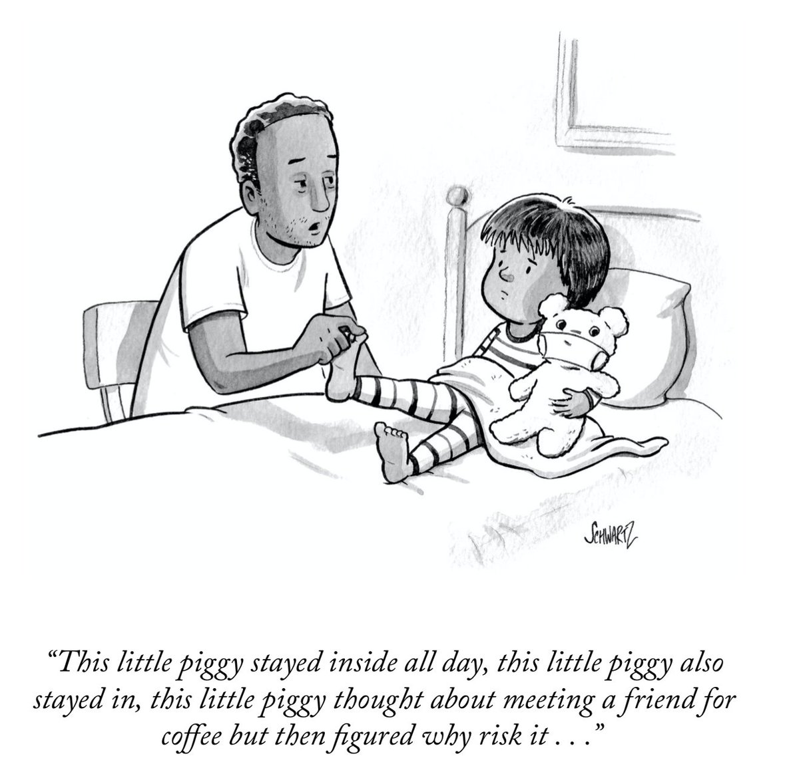</img></a>

---

<a href="https://twitter.com/erictopol/status/1427275340158701572" target="_blank" rel="noreferer">14:25 UCT</a>

It wasn't supposed to work this way.
Cases got down to zero in June after one of the most aggressive vaccination campaigns in the world.
Then came Delta. 

<a href="E86xnJKVUAMyXbP.jpg"  >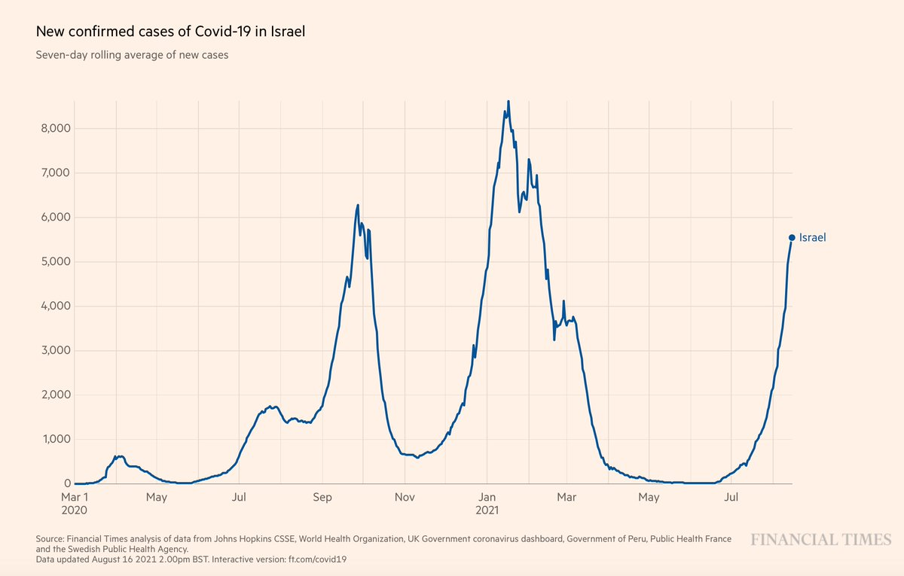</img></a>

---

<a href="https://twitter.com/erictopol/status/1427283383361499137" target="_blank" rel="noreferer">14:57 UCT</a>

The waning/vulnerability may have been made worse by the 3-week dosing schedule. In countries using 8-12 weeks (e.g. UK, Canada) vaccine effectiveness vs infections is ~80% to date. Beyond 6 months, VE vs infections has dropped in Israel, Qatar and in US studies w/ 3-week spacing

---

<a href="https://twitter.com/erictopol/status/1427283381067259922" target="_blank" rel="noreferer">14:57 UCT</a>

There is little evidence of waning immunity to the original strain at 6 months https://www.medrxiv.org/content/10.1101/2021.07.28.21261159v1.full.pdf
In contrast to what is becoming clear with Delta 

<a href="E862aGXVoAQtujo.jpg"  >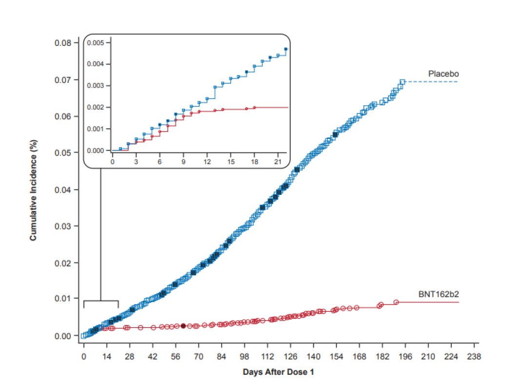</img></a>

---

<a href="https://twitter.com/erictopol/status/1427283389866856450" target="_blank" rel="noreferer">14:57 UCT</a>

Important to note this is about VE vs infections. The high VE vs hospitalizations and deaths, irrespective of dosing schedule or time from vaccine, can't be emphasized enough.

---

<a href="https://twitter.com/erictopol/status/1427287202757636098" target="_blank" rel="noreferer">15:12 UCT</a>

A new, large Ontario study of &gt;6000 households (&gt;1700 w/ secondary attacks) concludes that younger children (0-3 years) may transmit covid more than older (14-17); odds ratio 1.4
https://jamanetwork.com/journals/jamapediatrics/fullarticle/2783022 @JAMAPediatrics 

<a href="E869ZRHUYAY4ukt.jpg"  >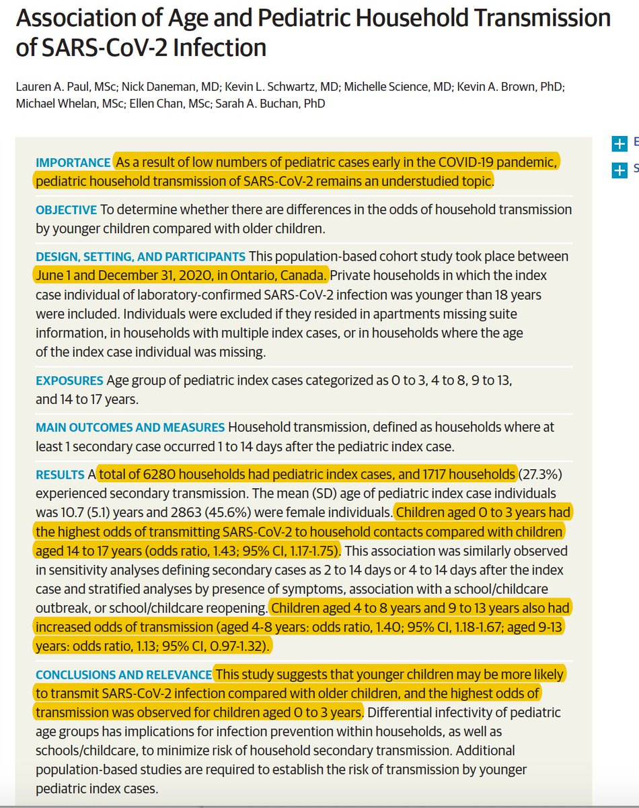</img></a><a href="E869bBXVoAIULiW.jpg"  >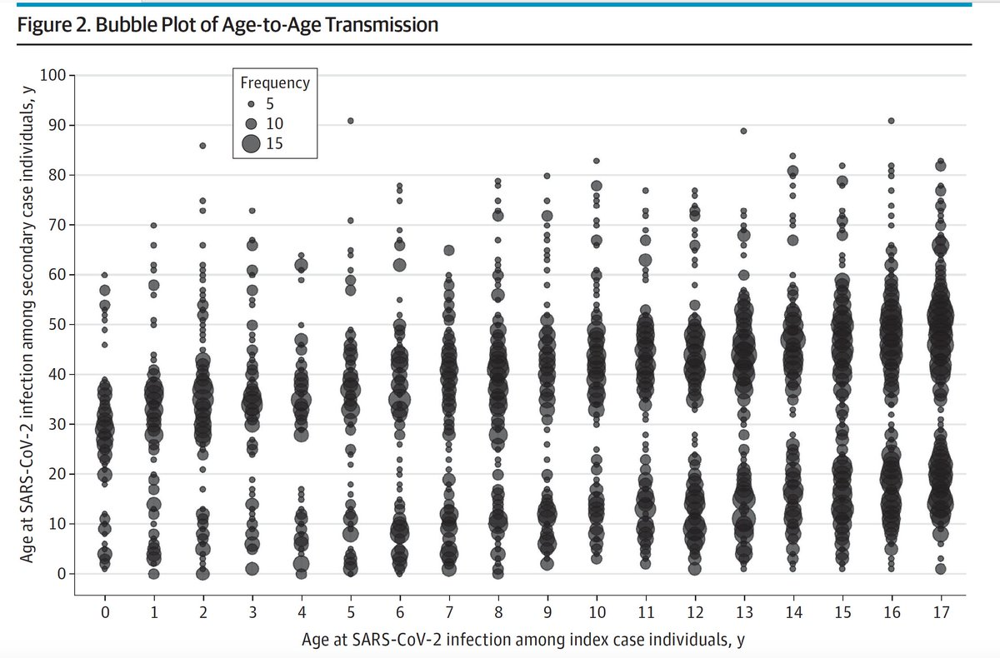</img></a>

---

<a href="https://twitter.com/erictopol/status/1427292262422114310" target="_blank" rel="noreferer">15:32 UCT</a>

"Reporting clinically significant symptoms, age younger than 60 years, female sex, receipt of Moderna vaccine, and prior SARS-CoV-2 exposure were independently associated with higher median IgG measurements, after adjusting for time after dose 2"--
 @Amanda_Debes @AaronMilstone

---

<a href="https://twitter.com/erictopol/status/1427292259913895939" target="_blank" rel="noreferer">15:32 UCT</a>

Antibodies to S1 spike protein after mRNA vaccines for @HopkinsMedicine healthcare workers
https://jamanetwork.com/journals/jamainternalmedicine/fullarticle/2782821
99.9% (953 of 954) developed antibodies (1 negative on an immunosuppressant med)
Correlates of higher levels 👇 

<a href="E87Cp9LVIAMrMEj.jpg"  >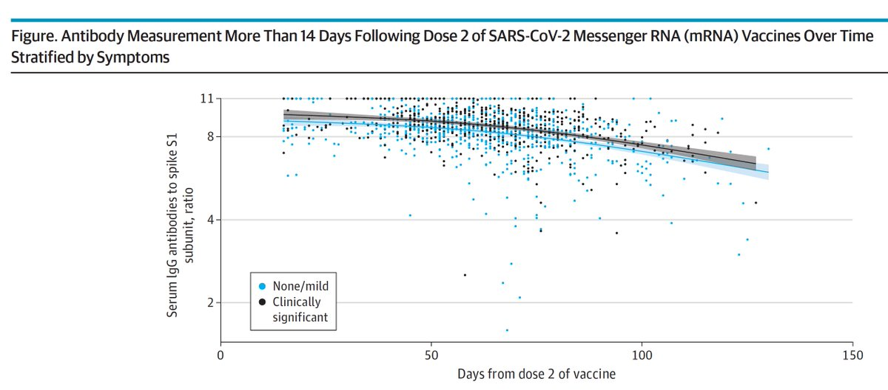</img></a>

---

<a href="https://twitter.com/erictopol/status/1427336757620592649" target="_blank" rel="noreferer">18:29 UCT</a>

An especially helpful accompanying editorial explainer for this report ("still there are some surprises in these data")
https://jamanetwork.com/journals/jamapediatrics/fullarticle/2783027 by @susancoffin and @davidrubinmd 

<a href="E87qnUkVUBELKyO.jpg"  >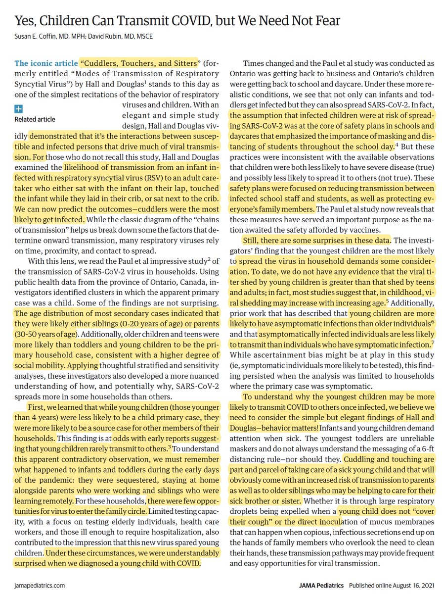</img></a>

---

<a href="https://twitter.com/erictopol/status/1427342828921769998" target="_blank" rel="noreferer">18:53 UCT</a>

Over 1 million people in Israel have now received 3rd shot boosters.
So far, all indicators support they are working to restore vaccine effectiveness vs infections to high levels, suppression of new cases 
Thanks @BarakRaveh and @dvir_a for posting the graphics 

<a href="E87urOUUcAA_Qt7.jpg"  >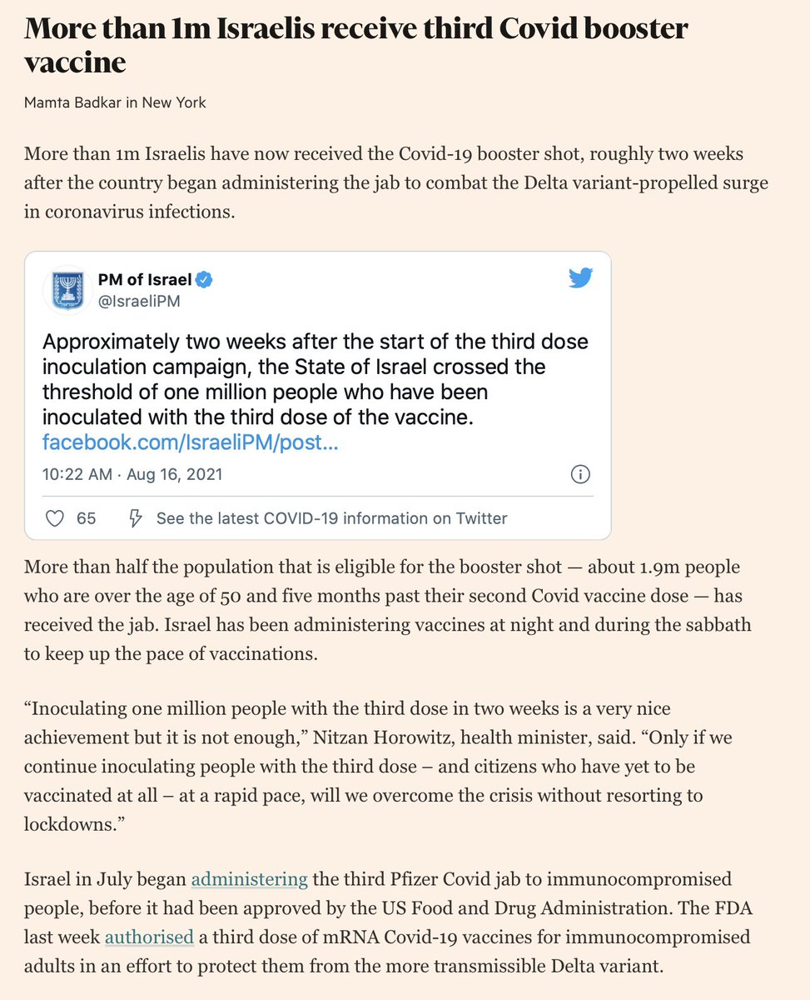</img></a><a href="E87wqF_VUCIrBy9.jpg"  >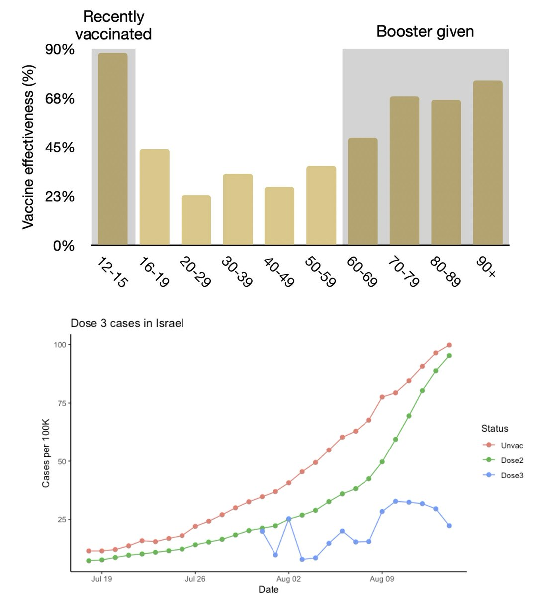</img></a>

---

<a href="https://twitter.com/erictopol/status/1427349779705581587" target="_blank" rel="noreferer">19:21 UCT</a>

Could oxidative stress ("redox imbalance") be the link between #LongCovid and myalgic encephalomyelitis/chronic fatigue syndrome (ME/CFS)?
A new perspective @PNASNews 
https://www.pnas.org/content/118/34/e2024358118 

<a href="E8721EkVUCAHoY9.jpg"  >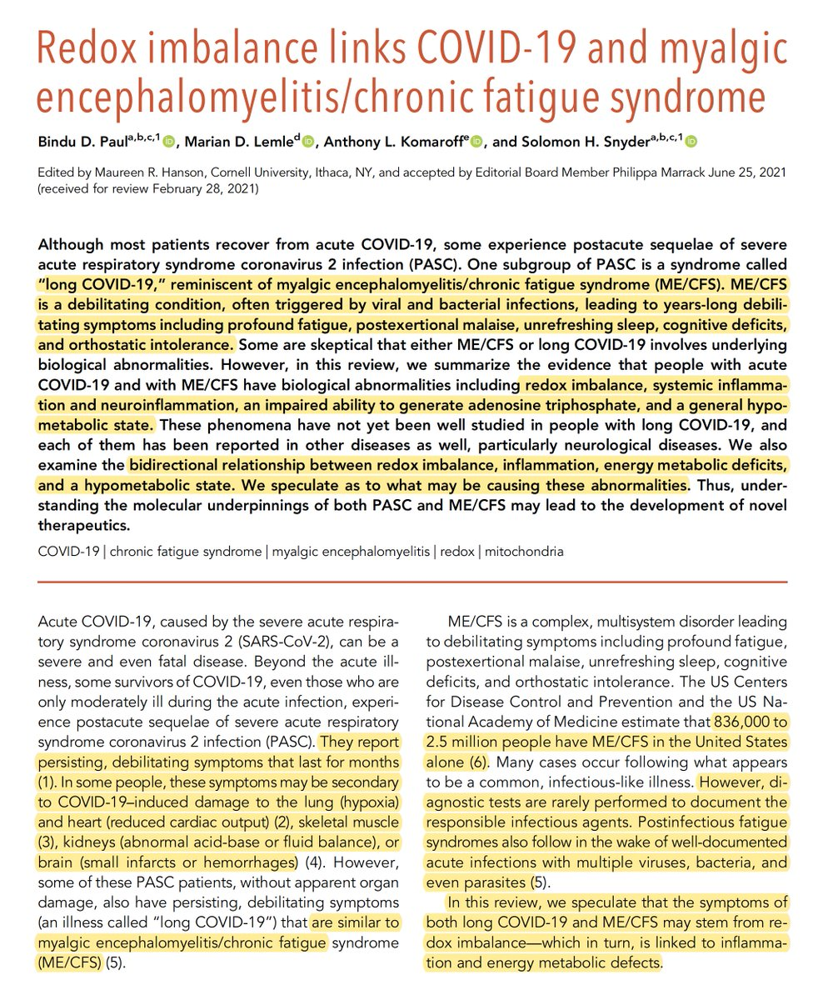</img></a><a href="E8722pVVUCA3jFz.jpg"  >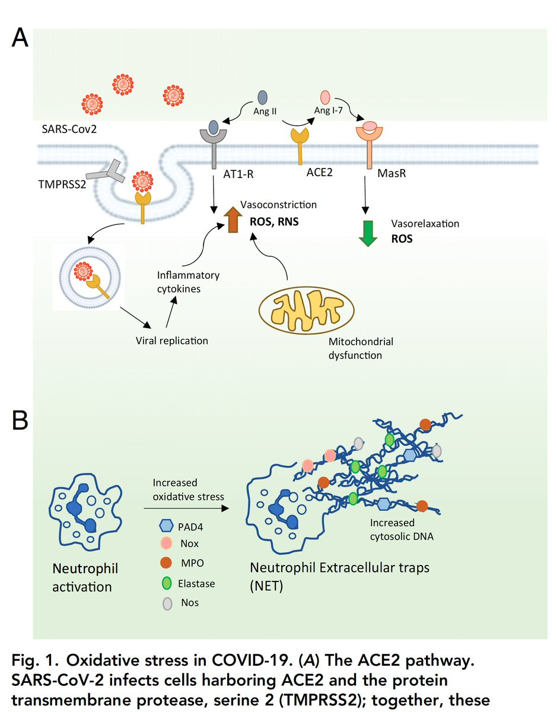</img></a><a href="E8724NcVUAosdSx.jpg"  >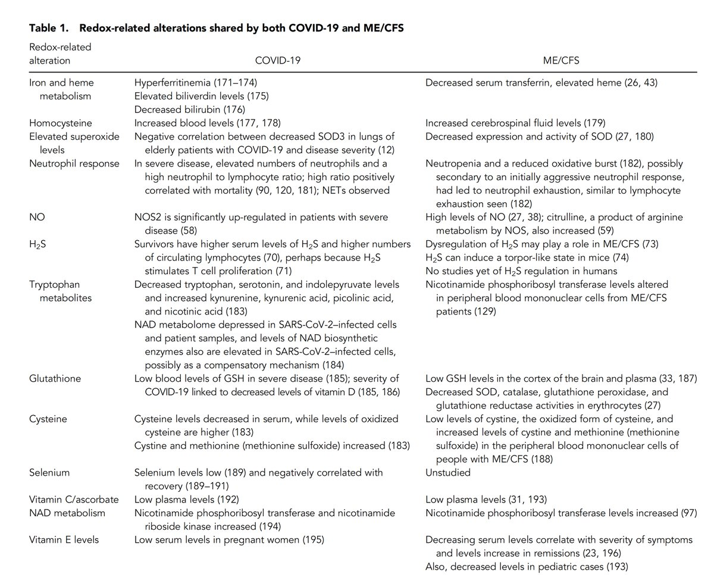</img></a><a href="E8725xtVUAUS5Oj.jpg"  >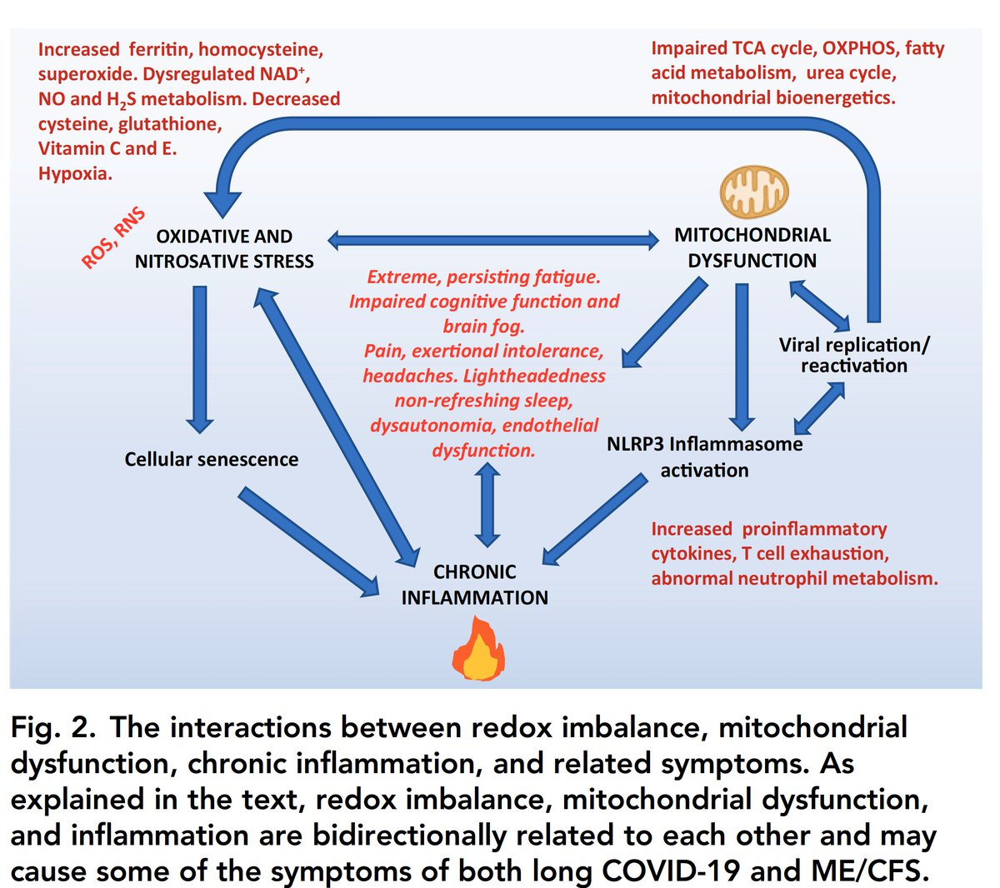</img></a>

---

<a href="https://twitter.com/erictopol/status/1427353451701293069" target="_blank" rel="noreferer">19:35 UCT</a>

Pretty sharp contrast with the United States, where most airlines won't even require vaccination for their employees. Unable to even get to first base. https://twitter.com/EricTopol/status/1426348331953885187

---

<a href="https://twitter.com/erictopol/status/1427357126461050889" target="_blank" rel="noreferer">19:50 UCT</a>

No wonder the gap keeps growing 

<a href="E879sxkVUAEKSTI.jpg"  >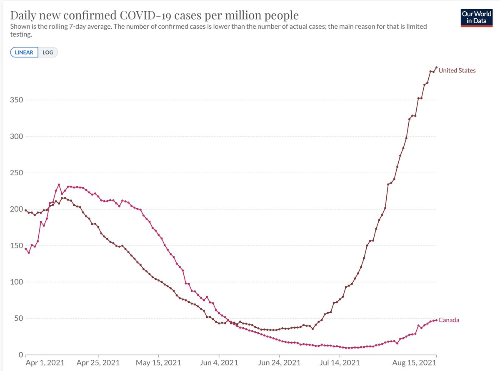</img></a>

---

<a href="https://twitter.com/erictopol/status/1427360644672606223" target="_blank" rel="noreferer">20:04 UCT</a>

Now tracking with Iran, where the fully vaccinated rate is 3.8% 

<a href="E88AyyiVUAsZ7FT.jpg"  >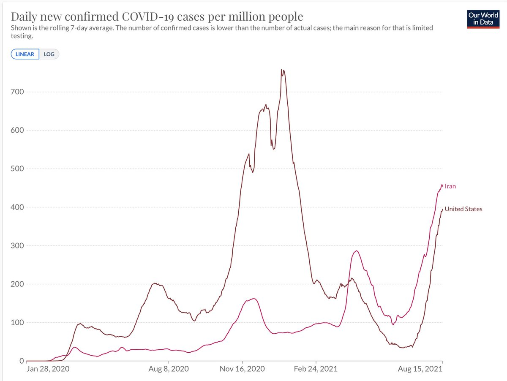</img></a>

---

<a href="https://twitter.com/erictopol/status/1427364813601067021" target="_blank" rel="noreferer">20:21 UCT</a>

You don't think Iran data is credible?
Look at the rest of the world. We're the outlier, underperforming, in case you haven't noticed. 
https://twitter.com/EricTopol/status/1426683286483464197

---

<a href="https://twitter.com/erictopol/status/1427371181481463824" target="_blank" rel="noreferer">20:46 UCT</a>

RT @kissane: Oregon, where I live, is in a serious covid surge, and OHSU (which handles a ton of our regional healthcare) has issued its ow…

---

<a href="https://twitter.com/erictopol/status/1427396988132200471" target="_blank" rel="noreferer">22:28 UCT</a>

This sums it up in the US pretty well.
https://www.ft.com/content/8138bbe4-3c45-469e-9a47-a67c7b0e3df5 Juxtaposed posting. 

<a href="E88hue2VEBAT1nR.jpg"  >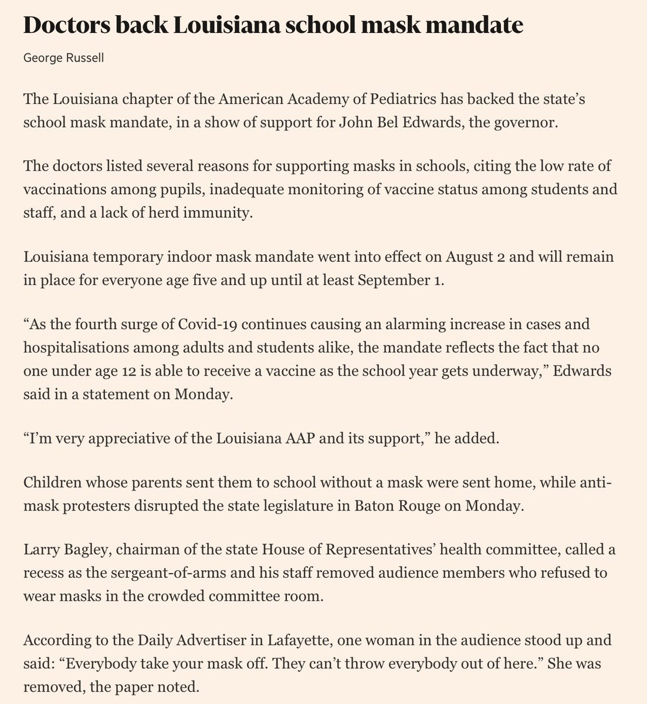</img></a><a href="E88hwGbVEBEtYaw.jpg"  >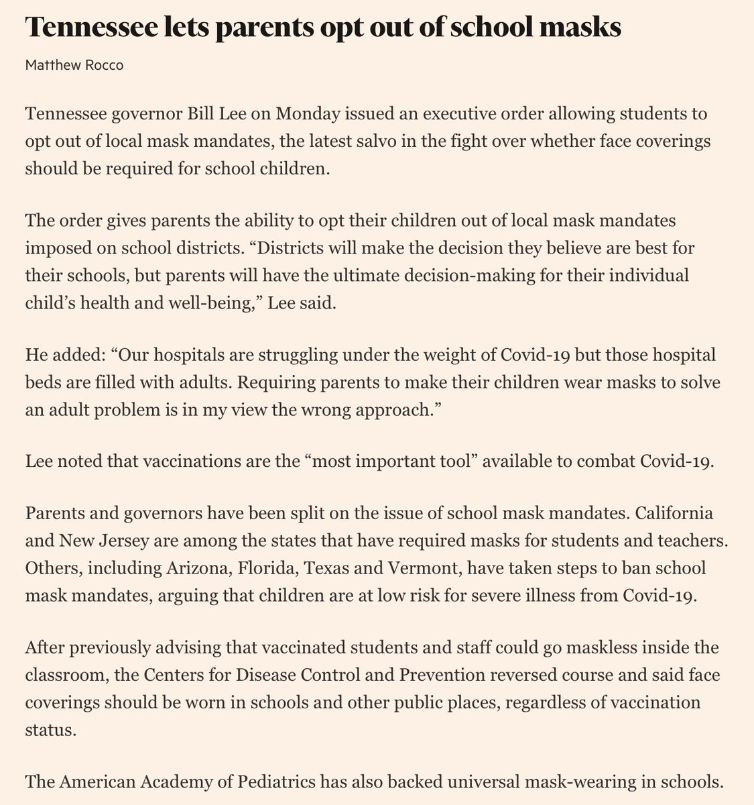</img></a>

---

<a href="https://twitter.com/erictopol/status/1427406564617379840" target="_blank" rel="noreferer">23:06 UCT</a>

What is the Delta &amp; vaccination story?
We don't have US data but it probably looks something like this
1. The risk of infections &amp; hospitalization have soared for unvaccinated
2. While breakthroughs have gotten more common, the absolute and relative benefit for 💉💉 is INCREASING 

<a href="E88ql_7UUAM2TjR.jpg"  >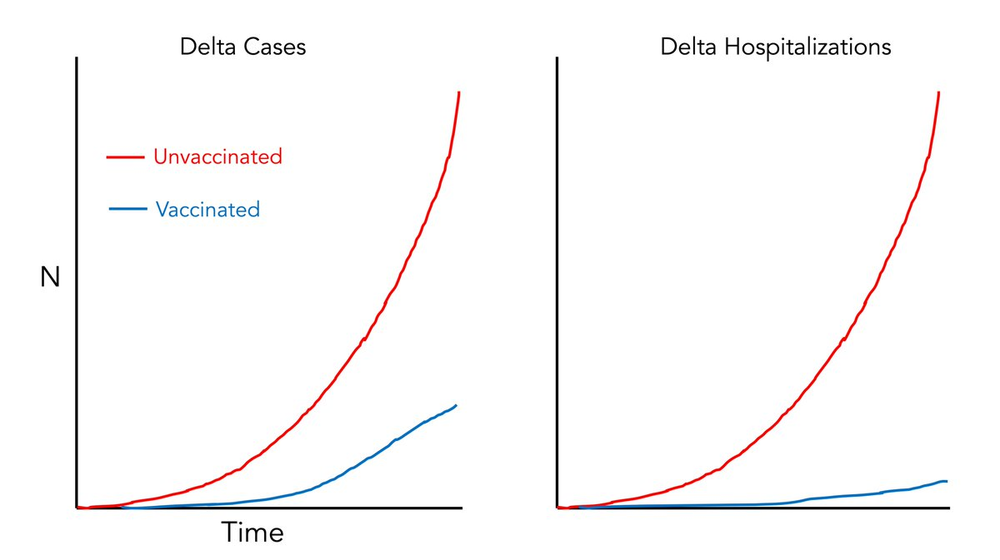</img></a>

---

<a href="https://twitter.com/erictopol/status/1427419825773572103" target="_blank" rel="noreferer">23:59 UCT</a>

If you would have told me we'd have 85,000 hospitalizations in a 4th wave, when there are free, very safe, highly effective vaccines (90% protective vs hospitalizations w/ Delta), and enough for everyone over age 12, I wouldn't believe you.
But here we are. And we're not done yet 

<a href="E882K1jUcAAZmy1.jpg"  >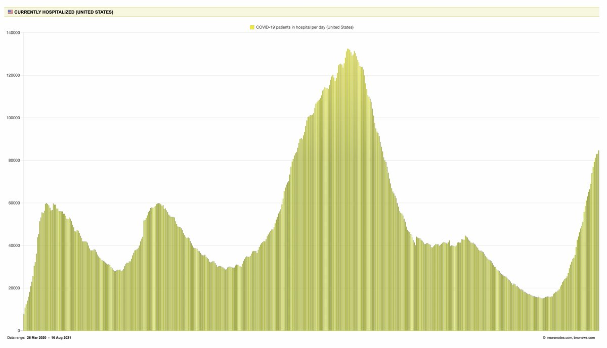</img></a>