+++
title = "Tweets by Eric Topol Aug 17"
Summary = ""
tags = ["Twitter"]
category = "Twitter"
+++

---

<a href="https://twitter.com/erictopol/status/1427446343665033240" target="_blank" rel="noreferer">01:45 UCT</a>

Learning from Israel's Delta wave
https://www.sciencemag.org/news/2021/08/grim-warning-israel-vaccination-blunts-does-not-defeat-delta @ScienceMagazine by @meredithwadman 
Getting max % fully vaccinated top priority
More mitigation
Boosters -&gt;prompt surge of antibodies, side effects in 4500 recipients were no worse, sometimes milder than 2nd shot (in 88%) 

<a href="E89LQ3wVoA8z8A9.jpg"  >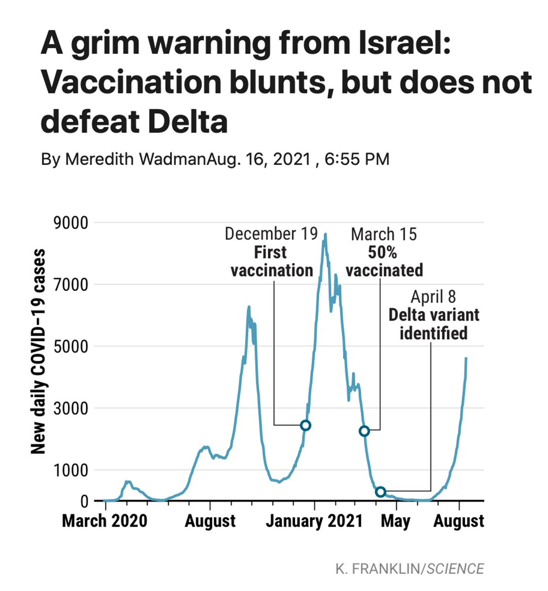</img></a>

---

<a href="https://twitter.com/erictopol/status/1427451054707286037" target="_blank" rel="noreferer">02:03 UCT</a>

RT @mmcornelius: Thank you to everyone who got vaccinated. And masked up since the beginning and are doing so again. You did your part. You…

---

<a href="https://twitter.com/erictopol/status/1427455226143932419" target="_blank" rel="noreferer">02:20 UCT</a>

That was rapid🦠sequencing (&lt;12 hr) in hospitals to diagnose B.1.621 in the midst of Delta.
Here's another very impressive application: maintaining zero covid in New Zealand
https://wwwnc.cdc.gov/eid/article/27/9/21-1097_article @Jemma_Geoghegan @AucklandUni and colleagues 

<a href="E89WdTEVoB8wowW.jpg"  >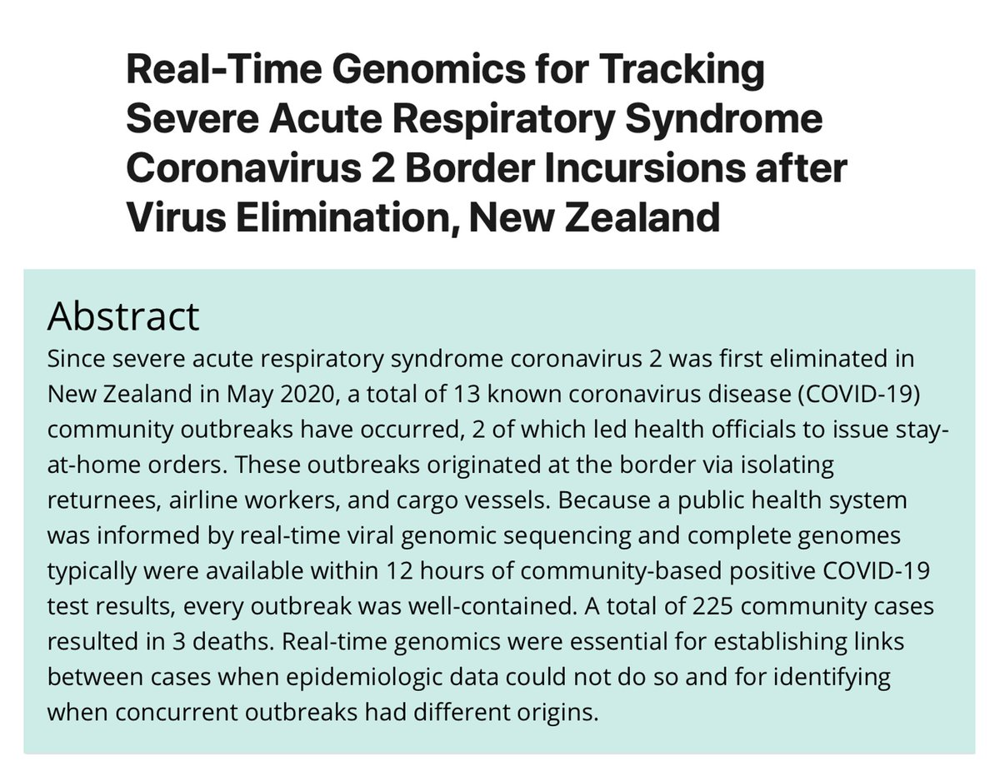</img></a>

---

<a href="https://twitter.com/erictopol/status/1427461038908137473" target="_blank" rel="noreferer">02:43 UCT</a>

Boosters to roll out to all Americans beginning next month, indexed by time from vaccination and level of risk, breaking @washingtonpost 
https://www.washingtonpost.com/health/2021/08/16/booster-shot-coronavirus/ 

<a href="E89cCP2VkAY41uv.png"  >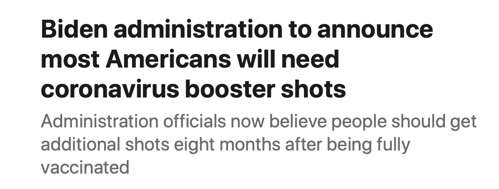</img></a>

---

<a href="https://twitter.com/erictopol/status/1427463201147424777" target="_blank" rel="noreferer">02:52 UCT</a>

This will roll out in the same sequence as the initial campaign, healthcare workers and by age groups. But it requires @US_FDA review of data for @Pfizer and @moderna_tx (i.e. may encounter delay for initiation)

---

<a href="https://twitter.com/erictopol/status/1427632692158468107" target="_blank" rel="noreferer">14:05 UCT</a>

A big US booster rollout is coming in the weeks ahead. I've put together some preliminary thoughts here for expectations and issues 

<a href="E8_3_4xXsAMu_84.png"  >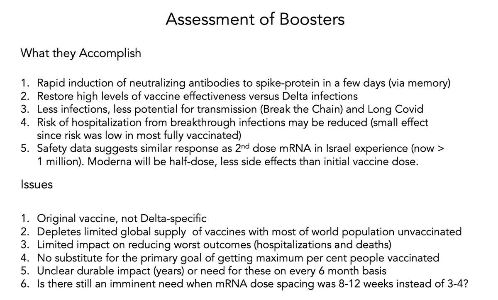</img></a>

---

<a href="https://twitter.com/erictopol/status/1427636657025605645" target="_blank" rel="noreferer">14:21 UCT</a>

There is some slowing of case growth in the US
(UK curve for context, recent modest ascent) 

<a href="E8_6yN5WEAsjAIH.jpg"  >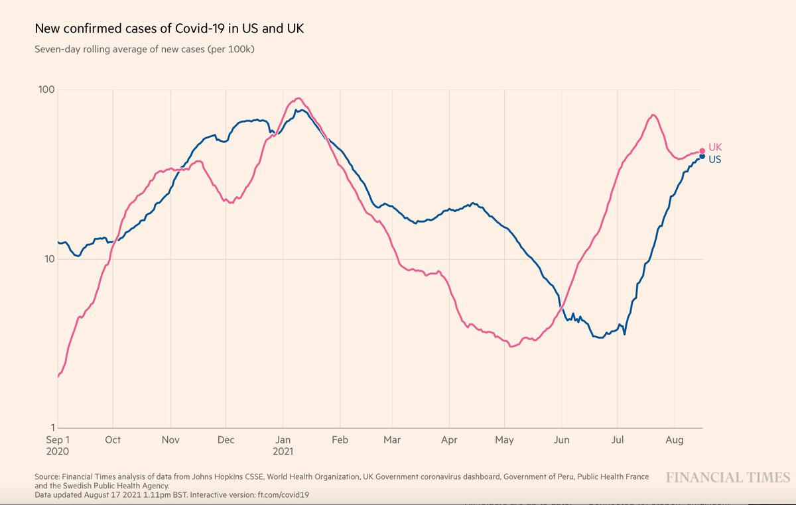</img></a>

---

<a href="https://twitter.com/erictopol/status/1427638422915670020" target="_blank" rel="noreferer">14:28 UCT</a>

Just published @ScienceMagazine 
The case for the animal origin of #SARSCoV2 
https://science.sciencemag.org/content/early/2021/08/16/science.abh0117 w/ @ScienceVisuals 

<a href="E8_9SDWWYAUBXRS.jpg"  >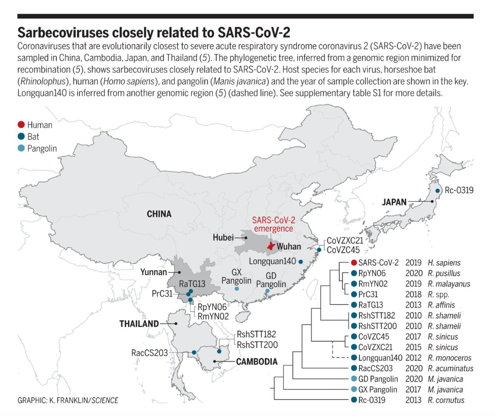</img></a>

---

<a href="https://twitter.com/erictopol/status/1427646822802247685" target="_blank" rel="noreferer">15:01 UCT</a>

Current top 5 cases/capita in the world for country/state population &gt; 1M
1.  Florida 138/100,000
2. Georgia (country) 121/100,000
3. Louisiana 116/100,000
4. Mississippi 115/100,000
5. Botswana 89/100,000
https://www.nytimes.com/interactive/2021/us/covid-cases.html?name=styln-coronavirus&region=TOP_BANNER&block=storyline_menu_recirc&action=click&pgtype=Interactive&variant=1_Show&is_new=false
https://newsnodes.com/worldmonitor/

---

<a href="https://twitter.com/erictopol/status/1427648377584553986" target="_blank" rel="noreferer">15:07 UCT</a>

@Boghuma That is the same as what I wrote, not understanding your disagreement

---

<a href="https://twitter.com/erictopol/status/1427651582057873409" target="_blank" rel="noreferer">15:20 UCT</a>

Our covid times :-)
by @Hilary_Price 

<a href="E9AJhqHVIAg6tpC.jpg"  >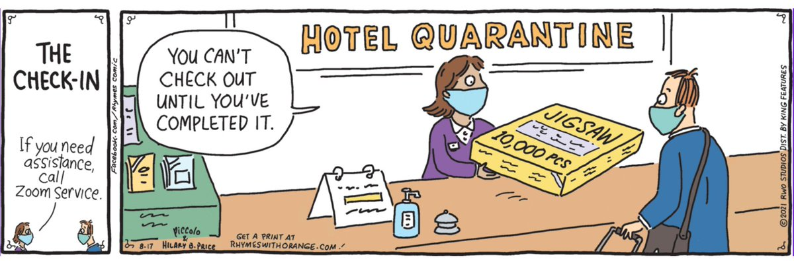</img></a>

---

<a href="https://twitter.com/erictopol/status/1427669546370961409" target="_blank" rel="noreferer">16:31 UCT</a>

New @ScienceMagazine, timely 
The struggle between vaccine nationalism and the need for global containment
https://science.sciencemag.org/content/early/2021/08/16/science.abj7364 by @thecewagnerlab @mcgillu @chadisaadroy @SineadEMorris @rebaker64 @JeremyFarrar @edwardcholmes @EvolveDotZoo @ZekeEmanuel and colleagues

---

<a href="https://twitter.com/erictopol/status/1427673536995282946" target="_blank" rel="noreferer">16:47 UCT</a>

Good graph to show the states that are driving the 4th wave hospitalizations beyond prior limits
https://www.nytimes.com/interactive/2021/08/17/us/covid-delta-hospitalizations.html?smid=tw-nytimes&smtyp=cur by @albertsun @giuliaheyward @nytgraphics 

<a href="E9Ac67XVcAAgOe0.jpg"  >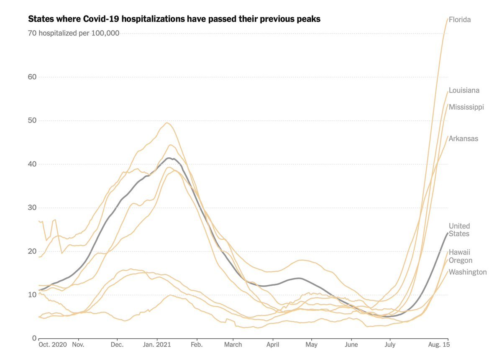</img></a>

---

<a href="https://twitter.com/erictopol/status/1427692477511737351" target="_blank" rel="noreferer">18:03 UCT</a>

"Amazingly, despite the 170+ year history of hand washing in medical hygiene, we were unable to find a single published research article on the flow physics of hand washing.” 
Until today
https://aip.scitation.org/doi/10.1063/5.0060307
@AIP_Publishing why vigorous HW for ≥20 seconds is optimal 

<a href="E9At9OKVUAMuJcw.jpg"  >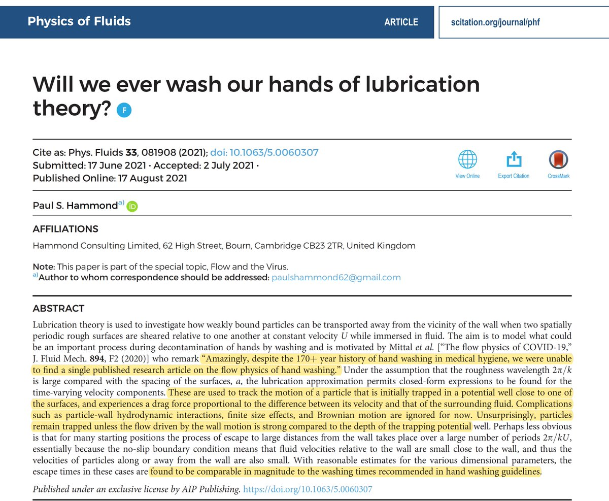</img></a><a href="E9At-jUUcAc3F7E.jpg"  >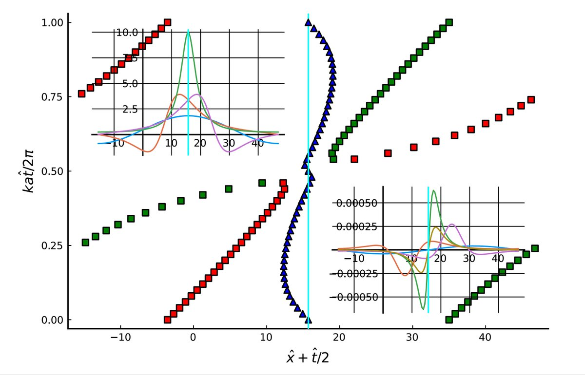</img></a>

---

<a href="https://twitter.com/erictopol/status/1427699225819635713" target="_blank" rel="noreferer">18:29 UCT</a>

Yet another step towards a pan-coronavirus vaccine (PCV)
Discovery of 2C08, an antibody which is active against all major variants, including Delta, in experimental infection model. Potential template for PCV
@ImmunityCP 
https://www.cell.com/immunity/fulltext/S1074-7613(21)00345-9 @TheBcellArtist @WUSTLmed 

<a href="E9Az50dVoAQq8IC.jpg"  >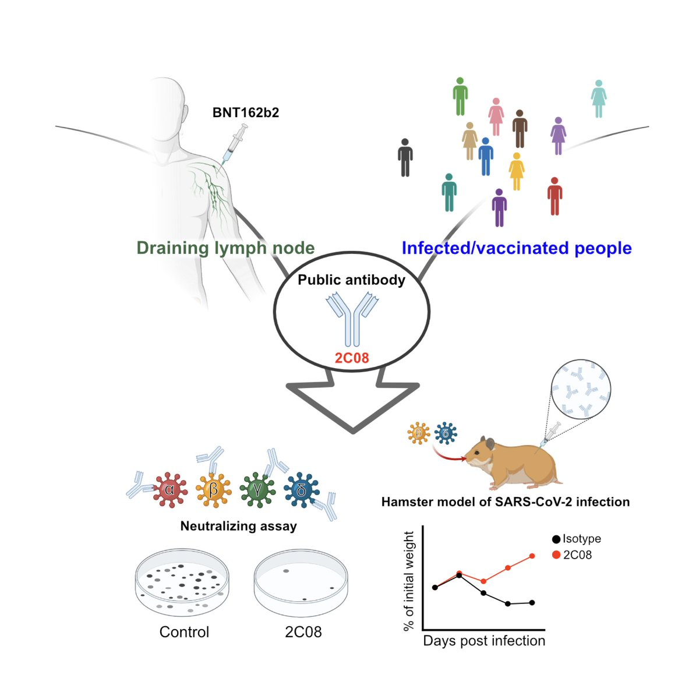</img></a>

---

<a href="https://twitter.com/erictopol/status/1427707990807748615" target="_blank" rel="noreferer">19:04 UCT</a>

Israel's 4th wave
An outstanding @FT editorial that succinctly summarizes the data, knowns, unknowns, boosters, need for masks among vaccinated
https://www.ft.com/content/572112fd-a713-4b0f-99be-bfcbf8506205 

<a href="E9A8RIfVoAIFWpq.jpg"  >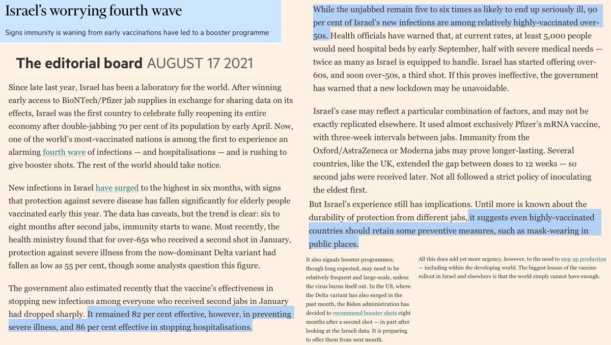</img></a>

---

<a href="https://twitter.com/erictopol/status/1427710133195313154" target="_blank" rel="noreferer">19:13 UCT</a>

@feldman_gil @FT Thanks Gil. Do you have this broken down by hospitalizations or does severe illness = hospitalizations?
Any data for symptomatic infections?

---

<a href="https://twitter.com/erictopol/status/1427712130371919877" target="_blank" rel="noreferer">19:21 UCT</a>

@feldman_gil @FT Thanks! It looks as though age &lt;60 more vulnerable for both severe and new cases, but waning immunity would be more for age &gt;60. Your thoughts?

---

<a href="https://twitter.com/erictopol/status/1427717898345148416" target="_blank" rel="noreferer">19:44 UCT</a>

@DrLeanaWen @PostOpinions Agree, Leana.
A 2nd dose with an mRNA should be quite protective and may even preempt a 3rd dose (we need data!)
https://twitter.com/EricTopol/status/1426971389005754371

---

<a href="https://twitter.com/erictopol/status/1427764114386944000" target="_blank" rel="noreferer">22:47 UCT</a>

Mix and match vaccines, AZ then mRNA (@BioNTech_Group) achieves a very strong immune response against the Delta variant. 
This is the 1st report to look at mix vs Delta, specifically.
https://www.thelancet.com/journals/lancet/article/PIIS0140-6736(21)01891-2/fulltext @TheLancet 

<a href="E9BvWhtUYAYF7ik.jpg"  >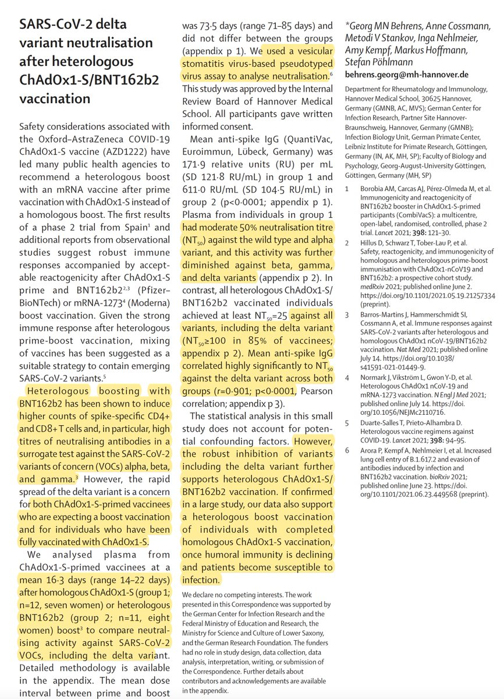</img></a><a href="E9BvY0BVIAAZ9_f.jpg"  >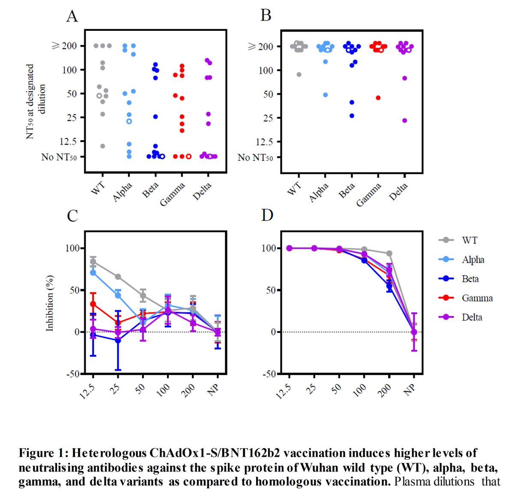</img></a>

---

<a href="https://twitter.com/erictopol/status/1427765619575857157" target="_blank" rel="noreferer">22:53 UCT</a>

The new reports adds on to a growing body of evidence about adenovirus-vector vaccine 1st, then mRNA 2nd dose, for a better immune response than from 2 doses of either (AZ + AZ or mRNA + mRNA). No data for benefit of reverse sequence (mRNA, then AZ)
https://twitter.com/EricTopol/status/1426971389005754371

---

<a href="https://twitter.com/erictopol/status/1427778368817098756" target="_blank" rel="noreferer">23:44 UCT</a>

Last week I mentioned there was more to the US Delta breakthrough infections and hospitalizations (H) than apparent via the CDC website and other sources. Since then the @nytimes looked into it
https://www.nytimes.com/2021/08/17/health/covid-vaccinated-infections.html
Still looking for all US (H) data...... 

<a href="E9B6vSqVoAkjksq.png"  >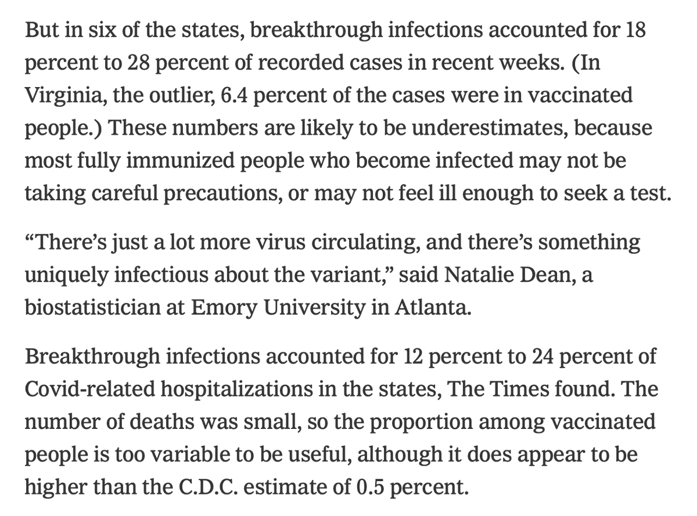</img></a>