+++
title = "Tweets by Eric Topol Aug 19"
Summary = ""
tags = ["Twitter"]
category = "Twitter"
+++

---

<a href="https://twitter.com/erictopol/status/1428172949131984896" target="_blank" rel="noreferer">01:52 UCT</a>

Now &gt;91,000 Americans hospitalized, 70% of the peak 3rd wave (when there were no vaccines).  At least 75,000 of these would have been avoided with vaccination. This is the story of the US 4th wave. 

<a href="E9Hfmv9VkAAaDXY.jpg"  >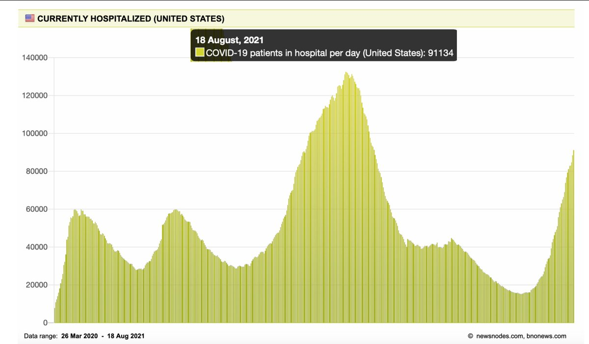</img></a>

---

<a href="https://twitter.com/erictopol/status/1428175998621650944" target="_blank" rel="noreferer">02:04 UCT</a>

Now leading the world in covid cases/capita
(the US state with the lowest vaccination rate) 

<a href="E9HmdgfVIAA-vVB.jpg"  >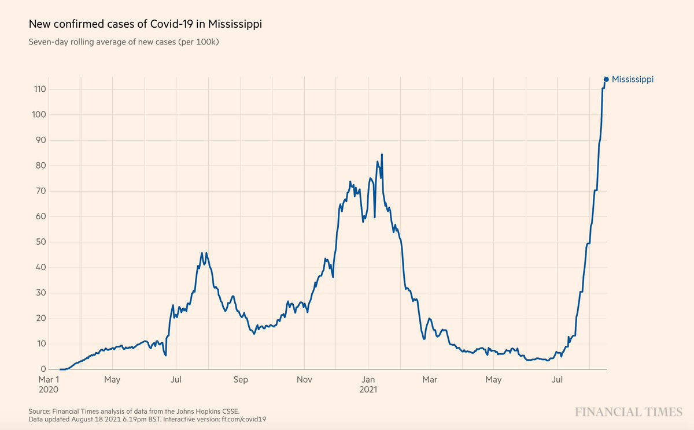</img></a>

---

<a href="https://twitter.com/erictopol/status/1428211823396876292" target="_blank" rel="noreferer">04:26 UCT</a>

New large UK study confirms attrition of @Pfizer vaccine effectiveness vs Delta infections over time https://www.bloomberg.com/news/articles/2021-08-18/covid-vaccines-are-less-effective-against-delta-in-u-k-study "By roughly 4 1/2 months after the 2nd dose, Pfizer’s shot will probably be about on par with Astra’s at preventing infections with a high viral burden" 

<a href="E9IG14qUcAE67WS.png"  >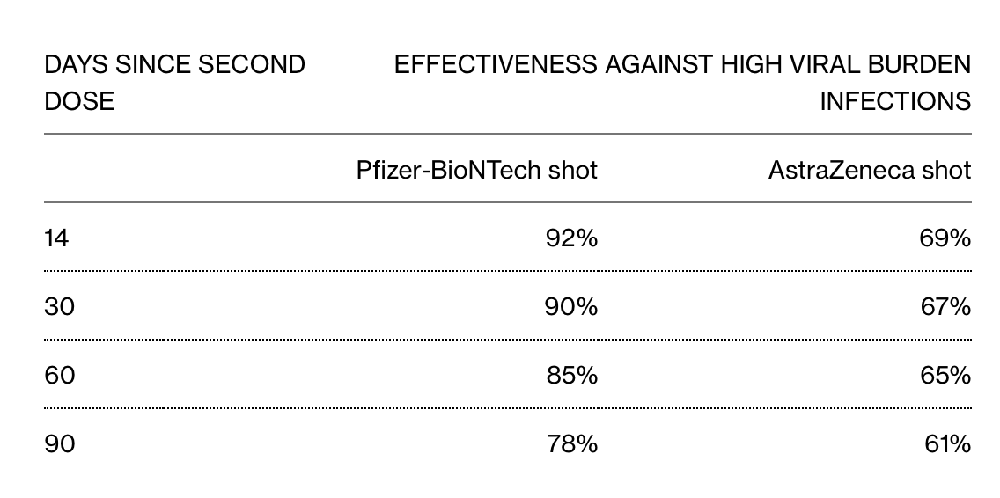</img></a>

---

<a href="https://twitter.com/erictopol/status/1428215212574793732" target="_blank" rel="noreferer">04:40 UCT</a>

Reminder (for the nth time) these data have nothing to do with effectiveness vs hospitalizations and death, which has been shown to remain high in multiple studies
More details of study here (@Reuters): 

<a href="E9IJ2rhUYAMGb_K.png"  >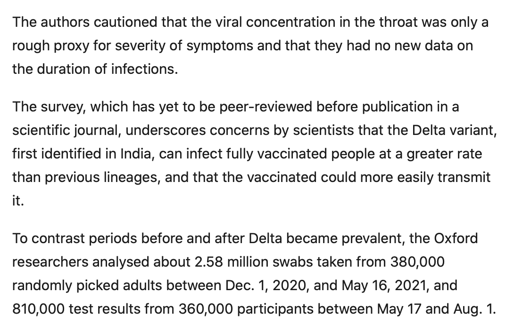</img></a>

---

<a href="https://twitter.com/erictopol/status/1428216300036190210" target="_blank" rel="noreferer">04:44 UCT</a>

1 more point, since the UK gave @Pfizer at 3-4 wks and 8-12 wks dosing schedules:
"The study also suggested that the time between doses did not affect effectiveness in preventing new infections" but unclear if this pertains to Delta infections or overall https://www.standard.co.uk/news/uk/delta-astrazeneca-pfizer-scientists-oxford-b951340.html

---

<a href="https://twitter.com/erictopol/status/1428339231764582411" target="_blank" rel="noreferer">12:53 UCT</a>

Link to the preprint https://www.ndm.ox.ac.uk/files/coronavirus/covid-19-infection-survey/finalfinalcombinedve20210816.pdf and better graph than in preprint to show the effect of time 
https://www.ft.com/content/49641651-e10a-45f6-a7cc-8b8c7b7a9710 by @hannahkuchler @jburnmurdoch @FT 

<a href="E9J6NyDVkAAXsw_.jpg"  >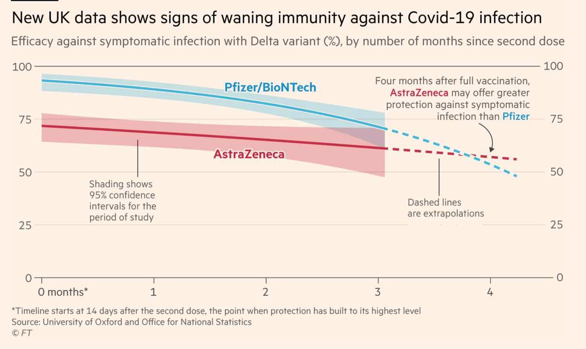</img></a>

---

<a href="https://twitter.com/erictopol/status/1428341915393531908" target="_blank" rel="noreferer">13:03 UCT</a>

Front page coverage today, with mention of new booster study that restored vaccine effectiveness vs infection in first group who received them (age &gt; 60) https://www.nytimes.com/2021/08/18/world/middleeast/israel-virus-infections-booster.html?searchResultPosition=1 by @IKershner  https://twitter.com/EricTopol/status/1428053327737090048

<a href="E9J8ZA8UcAkGKwl.jpg"  >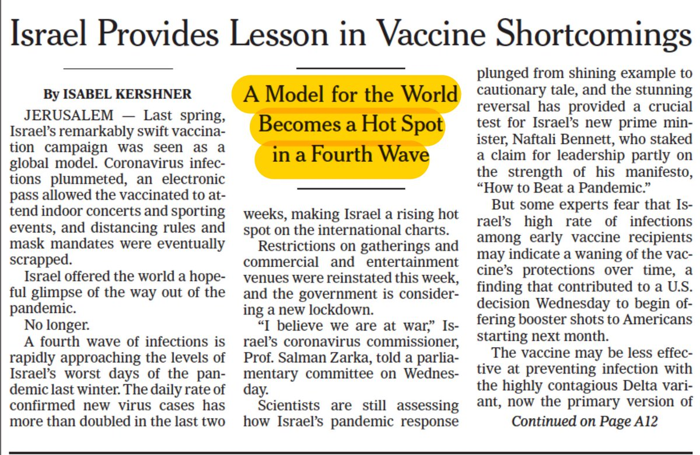</img></a><a href="E9J9PagVoAoyWzN.jpg"  >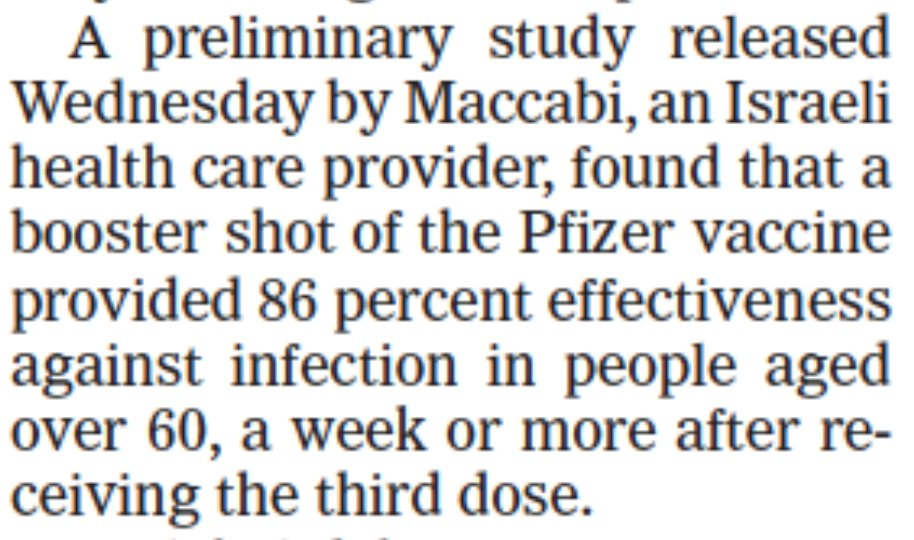</img></a>

---

<a href="https://twitter.com/erictopol/status/1428343210502356993" target="_blank" rel="noreferer">13:08 UCT</a>

Island nations &amp; states are getting particularly hard hit by Delta, some are highest cases/capita in the world
French Polynesia 396/100,00K
Guadeloupe 275/100,000K
Martinique 156/100,000K
Aruba 118/100,000K
Cuba  75/100,000K
-----
Hawaii 49/100,000K
US Virgin Islands 47/100,000K

---

<a href="https://twitter.com/erictopol/status/1428346743846887425" target="_blank" rel="noreferer">13:22 UCT</a>

A summary table of the studies that have assessed mRNA vaccine effectiveness (VE) for Delta infections, updated with reports from yesterday, overall in line with estimate ~50-60%;  *does not pertain* to high VE for hospitalizations or deaths 

<a href="E9J_7QbVIAEZ06F.png"  >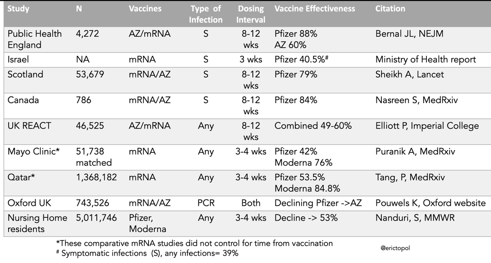</img></a>

---

<a href="https://twitter.com/erictopol/status/1428346750738210830" target="_blank" rel="noreferer">13:22 UCT</a>

And a graphic summary @FT of some of these reports https://www.ft.com/content/49641651-e10a-45f6-a7cc-8b8c7b7a9710
"Public Health England’s real-world studies in May painted a rosier picture...But the new studies appear more in line with research in Israel"
@hannahkuchler @jburnmurdoch 

<a href="E9KAnXIUYAMeC-D.jpg"  >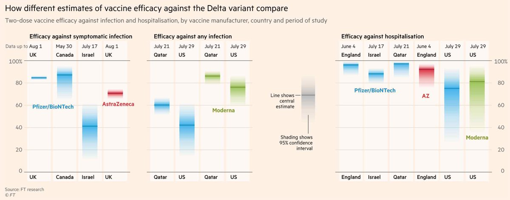</img></a>

---

<a href="https://twitter.com/erictopol/status/1428348199031369730" target="_blank" rel="noreferer">13:28 UCT</a>

@MJGerson Website provided at bottom right

---

<a href="https://twitter.com/erictopol/status/1428352319112970248" target="_blank" rel="noreferer">13:45 UCT</a>

@davidjlynch Hard to know, J&amp;J 1-dose vs AZ 2-doses

---

<a href="https://twitter.com/erictopol/status/1428355480850616320" target="_blank" rel="noreferer">13:57 UCT</a>

@gregggonsalves That’s what the aggregate data supports, at least right now, Gregg

---

<a href="https://twitter.com/erictopol/status/1428359657131679744" target="_blank" rel="noreferer">14:14 UCT</a>

Emphasizing Delta's high risk of pre-symptomatic transmission 
https://www.nature.com/articles/d41586-021-02259-2 @Nature 
https://www.medrxiv.org/content/10.1101/2021.08.12.21261991v1 note graphs unvaccinated, vaccinated, prior to symptom onset and comparison w/ ancestral strain 

<a href="E9KMJYRVgAUGD37.jpg"  >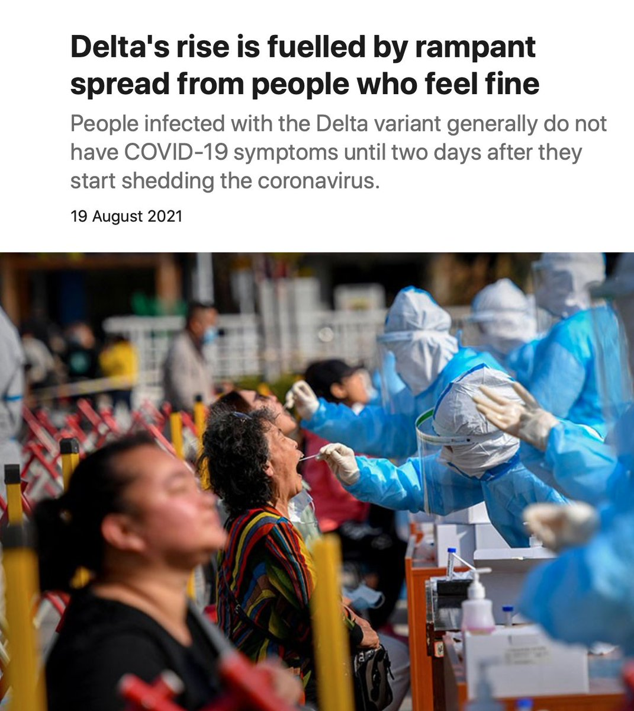</img></a><a href="E9KNMIyUYAM132V.jpg"  >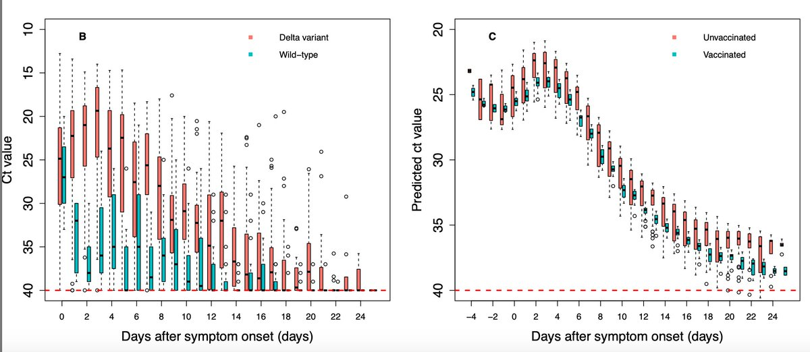</img></a>

---

<a href="https://twitter.com/erictopol/status/1428364743182413825" target="_blank" rel="noreferer">14:34 UCT</a>

@zeynep @ZoeMcLaren @hannahkuchler @jburnmurdoch @FT The short dosing schedule worked awfully well prior to Delta, which exposed a memory-deficit

---

<a href="https://twitter.com/erictopol/status/1428372360453787653" target="_blank" rel="noreferer">15:04 UCT</a>

@oaklandishdude @V2019N @pfizer It is broken down by age. Enough with the Simpson's paradox.

---

<a href="https://twitter.com/erictopol/status/1428385464734556161" target="_blank" rel="noreferer">15:56 UCT</a>

Here's another one, discovery of SARS2-38 mAb, a broad neutralizing antibody vs all the variants of concern. 3rd such study this week, all providing momentum towards a pan-coronavirus vaccine 
https://www.cell.com/immunity/fulltext/S1074-7613(21)00348-4 @ImmunityCP 

<a href="E9KknJgUUAMbVWD.jpg"  >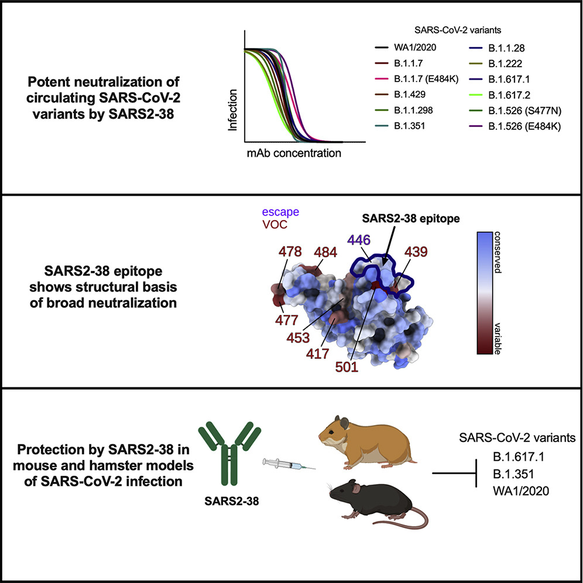</img></a>

---

<a href="https://twitter.com/erictopol/status/1428386917993705479" target="_blank" rel="noreferer">16:02 UCT</a>

More on the @NEJM report from yesterday, beginning of this thread
https://www.sciencemag.org/news/2021/08/covid-19-vaccines-may-trigger-superimmunity-people-who-had-sars-long-ago by @sciencecohen @ScienceMagazine @NewsfromScience 

<a href="E9KmTqQVEAEgw2o.jpg"  >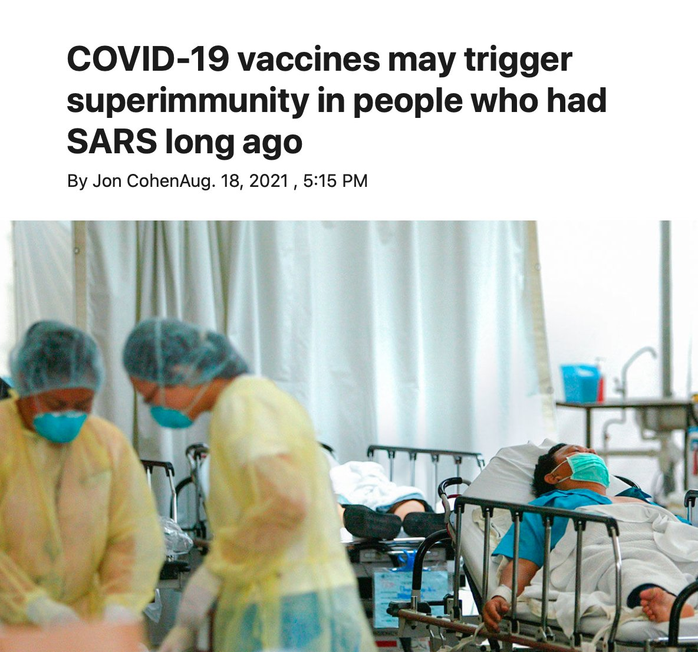</img></a>

---

<a href="https://twitter.com/erictopol/status/1428388041685491721" target="_blank" rel="noreferer">16:07 UCT</a>

The early studies predominantly used 8-12 week dosing schedule for Pfizer (cf Israel, US, Qatar 3 weeks), and it was theorized that could explain the preserved effectiveness vs infections. But the new @UniofOxford study says dosing interval did not play a role. Needs replication.

---

<a href="https://twitter.com/erictopol/status/1428392688768884736" target="_blank" rel="noreferer">16:25 UCT</a>

How can mRNA vaccine effectiveness have significant attrition vs infections but little vs hospitalizations?
Simplified
Prevent infections: neutralizing antibodies. Like System 1 thinking, fast, reflexive
Prevent pneumonia/severe illness: T cells, like System 2 thinking (Kahneman)

---

<a href="https://twitter.com/erictopol/status/1428406149745831941" target="_blank" rel="noreferer">17:18 UCT</a>

The US 4th (Delta) wave. 
The large and persistent hospitalization gap from UK and Israel reflects its inadequate rate of vaccination
@OurWorldInData 

<a href="E9K3kAdVoAEYzig.jpg"  >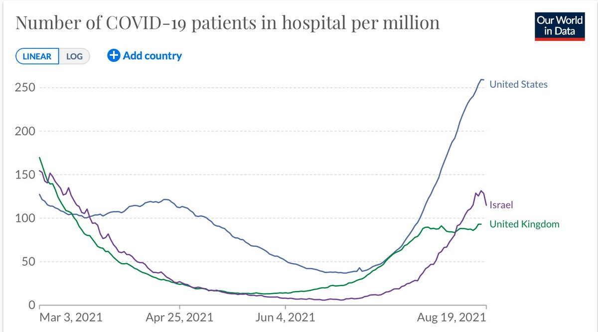</img></a>

---

<a href="https://twitter.com/erictopol/status/1428406265621868545" target="_blank" rel="noreferer">17:19 UCT</a>

@kaitlancollins How many were 3rd doses?

---

<a href="https://twitter.com/erictopol/status/1428411048592220165" target="_blank" rel="noreferer">17:38 UCT</a>

Arguing against the usefulness of boosters negates their impact for preventing infections, helping to block transmission, spread, the potential of #LongCovid, and some % hospitalizations/deaths.
That's separate from a global inequity objection.

---

<a href="https://twitter.com/erictopol/status/1428420581603479552" target="_blank" rel="noreferer">18:16 UCT</a>

What an outstanding new feature by @kakape on evolution of #SARSCoV2 variants and its potential path forward
https://science.sciencemag.org/content/373/6557/844
@ScienceMagazine @ScienceVisuals 👍🙏 

<a href="E9LEeXQVEAId9-l.jpg"  >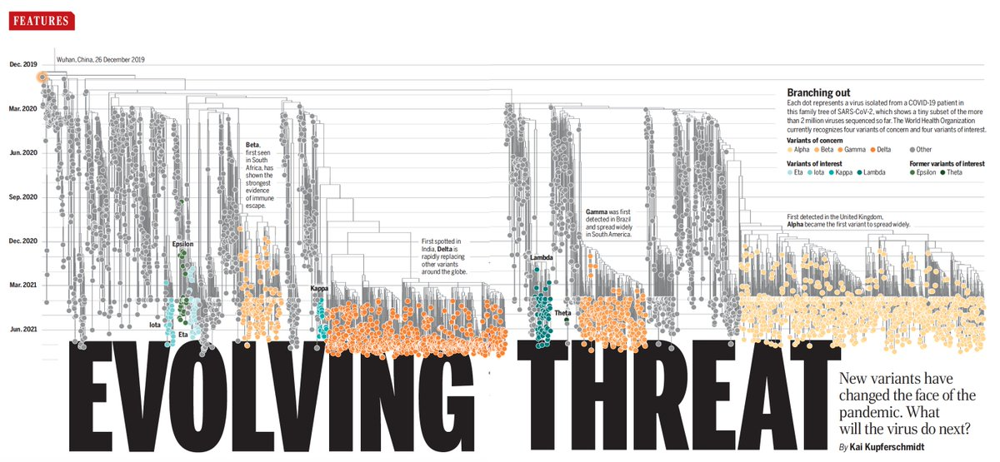</img></a><a href="E9LEgfbUUAEs_9k.jpg"  >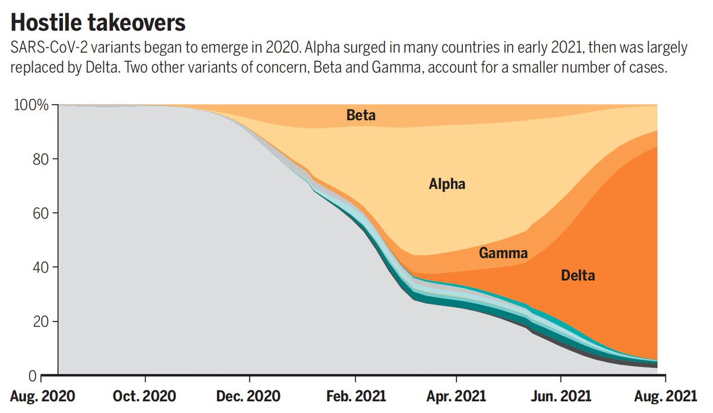</img></a><a href="E9LEiH6VUAAbNFI.jpg"  >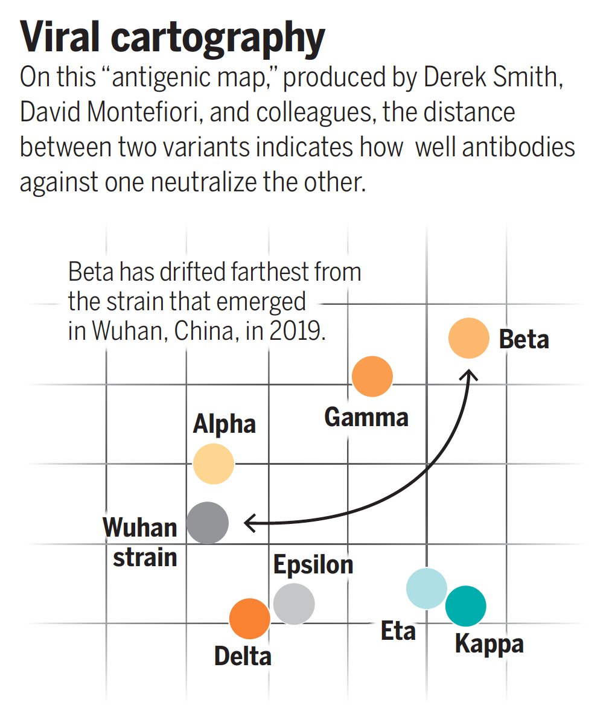</img></a><a href="E9LEjt2UUAQ5Ab4.jpg"  >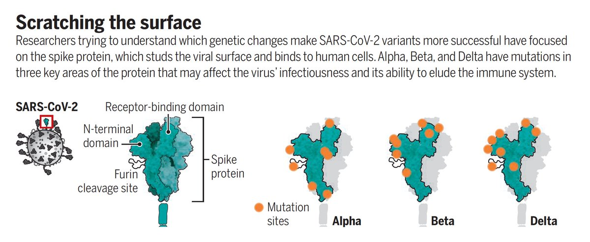</img></a>

---

<a href="https://twitter.com/erictopol/status/1428429838927286274" target="_blank" rel="noreferer">18:53 UCT</a>

Every day now the evidence from Israel for the benefit of boosters is mounting
https://twitter.com/erlichya/status/1428420675375706115 thread by @erlichya with @IsraelMOH slides from today
And this be @segal_eran  https://twitter.com/segal_eran/status/1428428502139822089

<a href="E9LNDgFVcAAcMyx.jpg"  >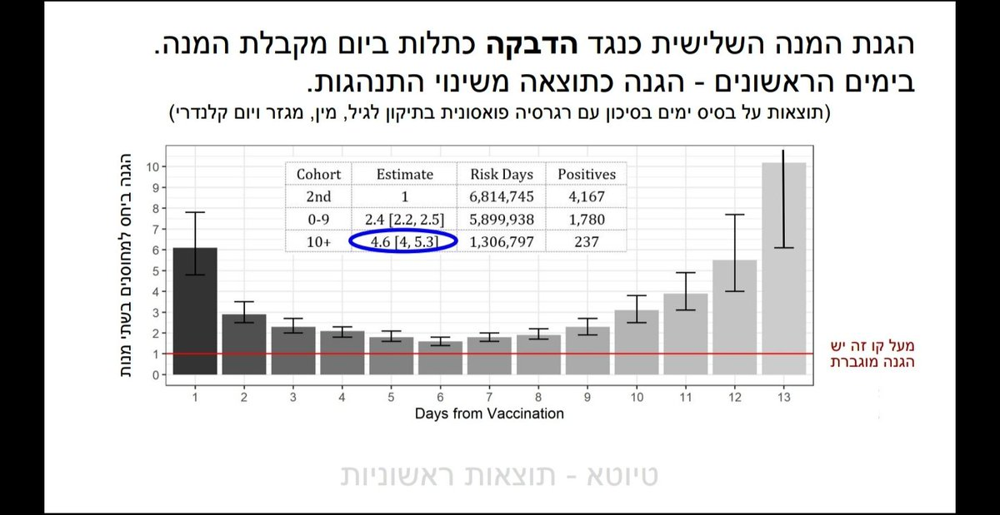</img></a>

---

<a href="https://twitter.com/erictopol/status/1428436660912484352" target="_blank" rel="noreferer">19:20 UCT</a>

I'm in clinic today and so impressed that every patient is coming in wearing N95 or KN95 masks 😷👍

---

<a href="https://twitter.com/erictopol/status/1428453189649534976" target="_blank" rel="noreferer">20:25 UCT</a>

Today 44% more Floridians are in the hospital than any time during the pandemic.
Fulfilling informal definition of "train wreck": a chaotic or disastrous situation 

<a href="E9Lh_viVgAYOXb-.jpg"  >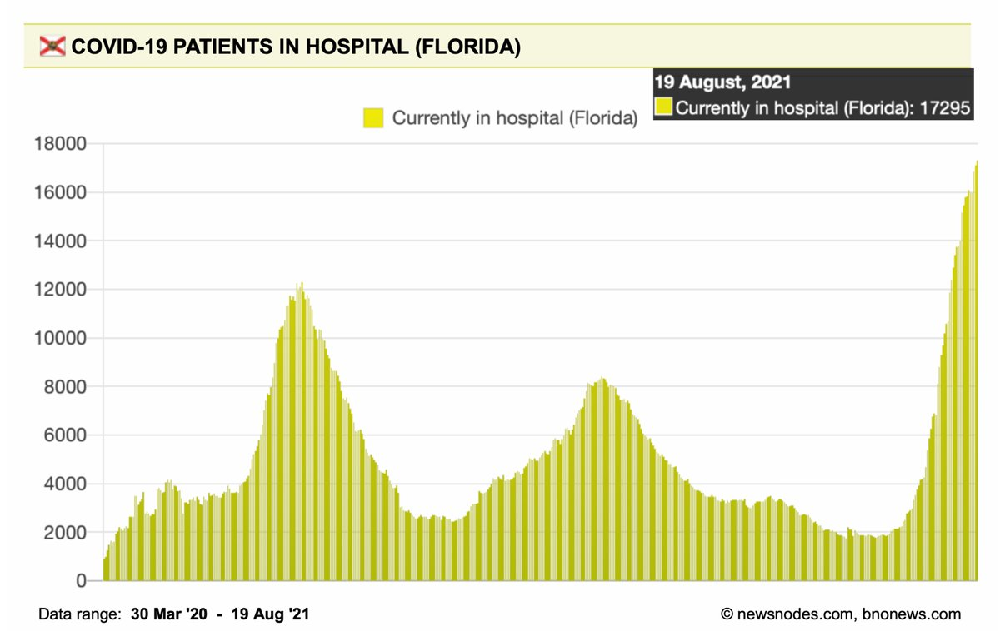</img></a>

---

<a href="https://twitter.com/erictopol/status/1428487950195515397" target="_blank" rel="noreferer">22:44 UCT</a>

A break from covid...
In the new issue @TheLancet, I had the privilege of working with @DrLesterColl on the #AI revolution in radiation oncology that is taking hold
https://www.thelancet.com/journals/lancet/article/PIIS0140-6736(21)01798-0/fulltext 

<a href="E9MB7TXUUAA6W8r.jpg"  >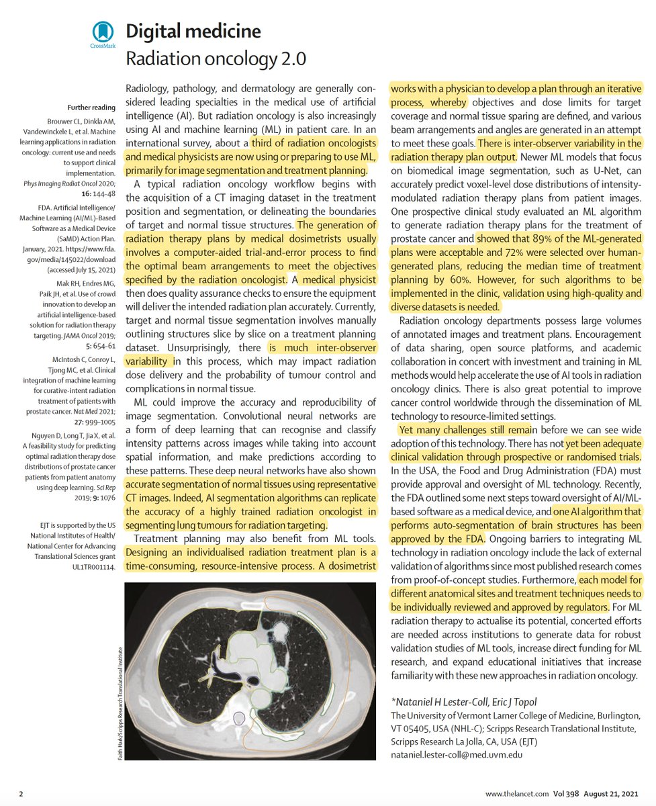</img></a>

---

<a href="https://twitter.com/erictopol/status/1428496744212361217" target="_blank" rel="noreferer">23:18 UCT</a>

Take notice of an effective defense against Delta.
One of the highest per cent fully vaccinated cities in the US— 70% of the population (higher than Israel, UK, Canada) —achieves a turnaround 👏👏  https://twitter.com/Bob_Wachter/status/1428411925315031047

<a href="E9MJYJIUcAAxNfx.jpg"  >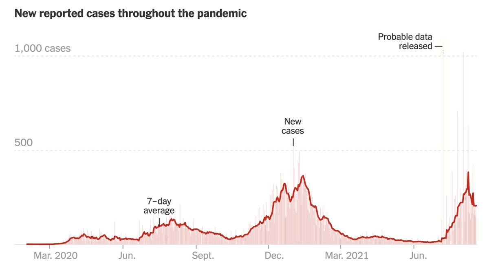</img></a>