+++
title = "Tweets by Eric Topol Aug 20"
Summary = ""
tags = ["Twitter"]
category = "Twitter"
+++

---

<a href="https://twitter.com/erictopol/status/1428529840680931329" target="_blank" rel="noreferer">01:30 UCT</a>

Updated Oregon Delta wave data are informative of  impact of vaccination and breakthrough infections
—Breakthrough cases went up 7-fold from a low baseline
—Unvaccinated cases went up &gt;8-fold
—The absolute relative benefit of vaccination markedly increased
https://www.oregon.gov/oha/covid19/Documents/DataReports/Breakthrough-Case-Report-08-19-2021.pdf 

<a href="E9MlitaVoAErZ5K.jpg"  >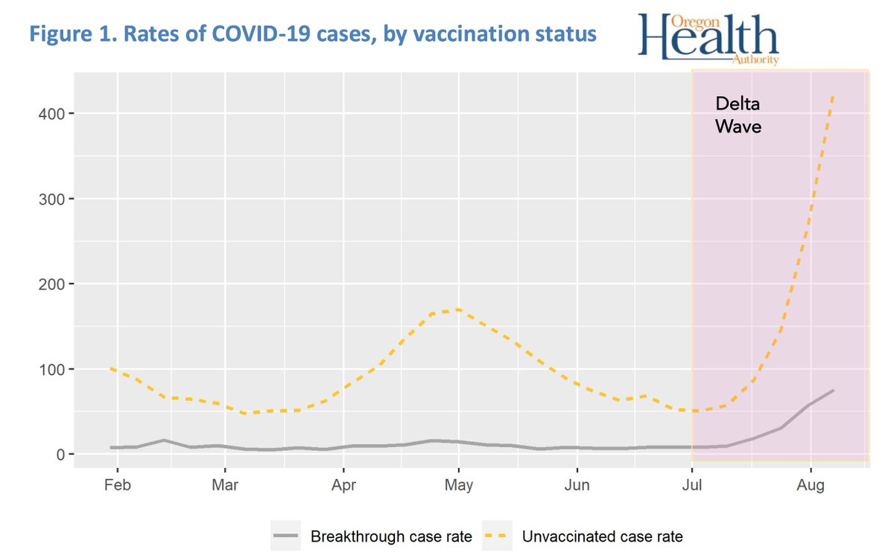</img></a>

---

<a href="https://twitter.com/erictopol/status/1428529845860929544" target="_blank" rel="noreferer">01:30 UCT</a>

All breakthroughs by age
5.8% hospitalized, 0.8% deaths 

<a href="E9MoHZsVkAEkVv2.jpg"  >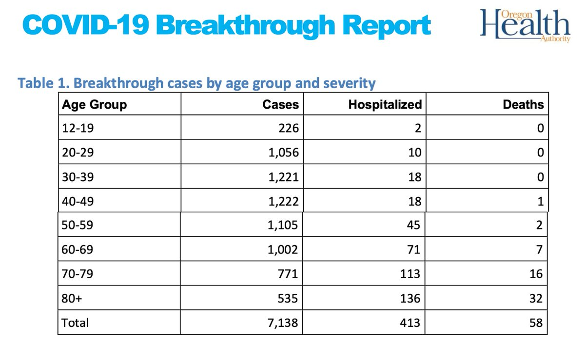</img></a>

---

<a href="https://twitter.com/erictopol/status/1428710953168764936" target="_blank" rel="noreferer">13:30 UCT</a>

When there's 93,000 covid patients in US hospitals, it's hard to find any good news. 
A hint here. 

<a href="E9PM67EVIAUyYh_.jpg"  >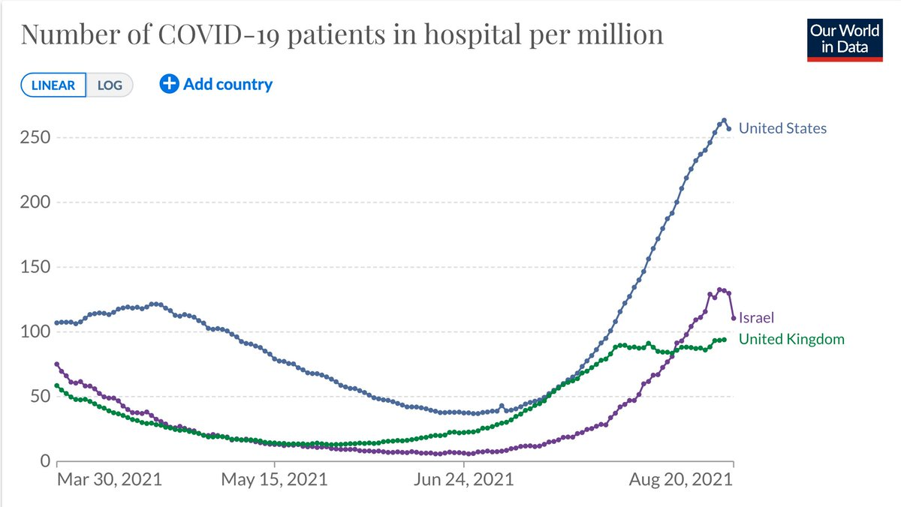</img></a>

---

<a href="https://twitter.com/erictopol/status/1428712842555842570" target="_blank" rel="noreferer">13:37 UCT</a>

The US could sure learn a lot from Germany and Canada for how to deal with Delta 

<a href="E9POsUiVIAYVBF-.jpg"  >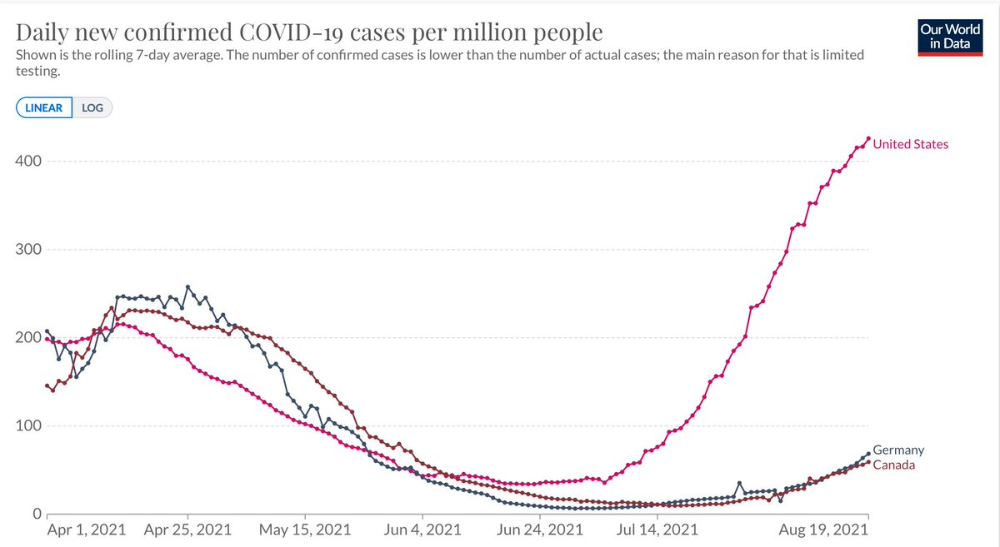</img></a><a href="E9POuBCVUAoy03q.jpg"  >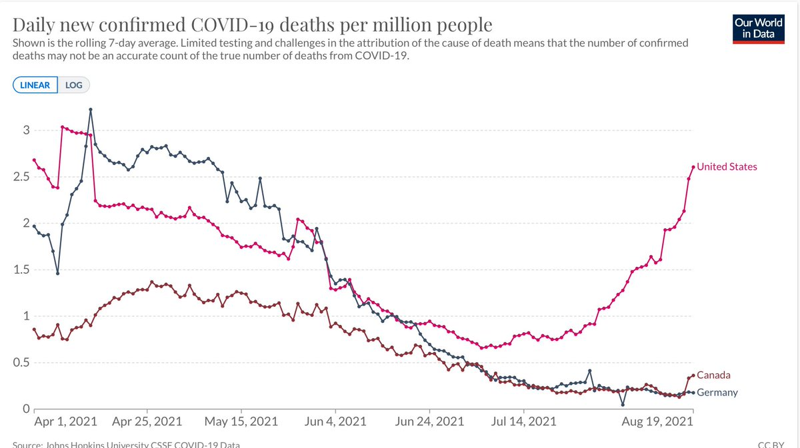</img></a>

---

<a href="https://twitter.com/erictopol/status/1428721427830644747" target="_blank" rel="noreferer">14:11 UCT</a>

Beyond evidence for preventing symptomatic infections, Israel's booster rollout now showing sign of a flattening of the curve for severe illness https://twitter.com/segal_eran/status/1428655714822762502

---

<a href="https://twitter.com/erictopol/status/1428726972641812488" target="_blank" rel="noreferer">14:33 UCT</a>

How to understand the fundamental mechanism, at the atomic level, of #SARSCoV2 entry and infection?
https://www.nature.com/articles/s41557-021-00758-3
It took supercomputer-movies to determine that a glycan gate is essential for the spike to open and achieve cell entry  @Terrasztain @RommieAmaro @ltchong 

<a href="E9PY_uoVcAQ2Q0A.png"  >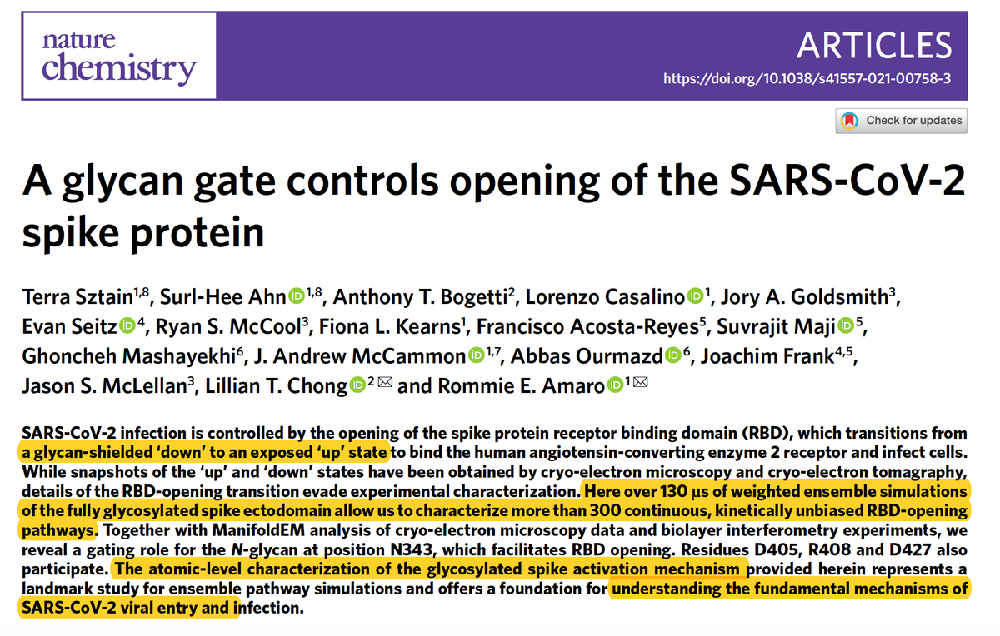</img></a><a href="E9PZBAnVcAE17wN.jpg"  >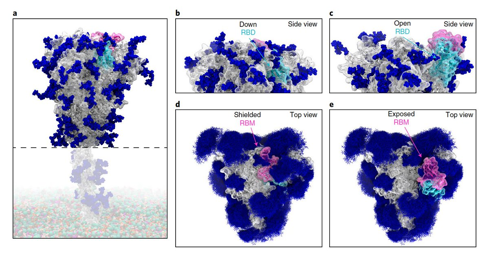</img></a>

---

<a href="https://twitter.com/erictopol/status/1428730843699105798" target="_blank" rel="noreferer">14:49 UCT</a>

"Mississippi, the unhealthiest, poorest, least-educated state in the nation"—@williams_paige @NewYorker 
The pandemic that laid bare US health inequities continues in its vaccination phase. And it's tragic.
https://www.newyorker.com/news/us-journal/mississippis-hospital-system-is-rapidly-approaching-statewide-failure 

<a href="E9PSgzbUYAUe3gl.jpg"  >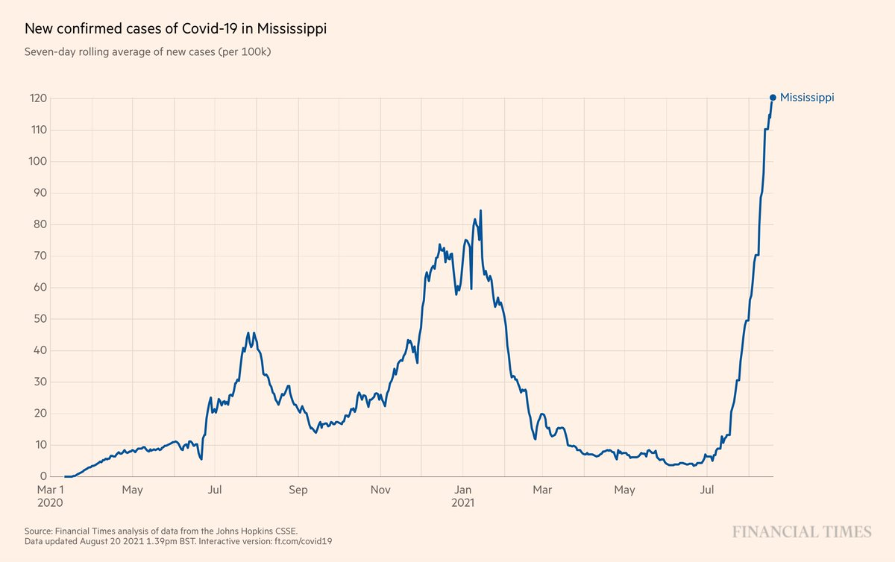</img></a>

---

<a href="https://twitter.com/erictopol/status/1428735897168596998" target="_blank" rel="noreferer">15:09 UCT</a>

There are still no data published for the 2 widely used Chinese vaccines for level of protection vs Delta, which is dominant throughout the world
https://www.nytimes.com/2021/08/20/business/economy/china-vaccine-us-covid-diplomacy.html by @suilee and @stevenleemyers 

<a href="E9PiCKJVkAEAt-N.jpg"  ></img></a>

---

<a href="https://twitter.com/erictopol/status/1428742237802749952" target="_blank" rel="noreferer">15:34 UCT</a>

RT @chrishendel: Extremely important article today by @propublica's @jenny_deam &amp; @biancafortis 

“The world changed,” said @EricTopol, dir…

---

<a href="https://twitter.com/erictopol/status/1428766946556669952" target="_blank" rel="noreferer">17:12 UCT</a>

Good explainer on Delta's P681R mutation today @nature by @ewencallaway 
https://www.nature.com/articles/d41586-021-02275-2  https://twitter.com/EricTopol/status/1426574639728185348

<a href="E9P_v_hVcAAt7r5.jpg"  >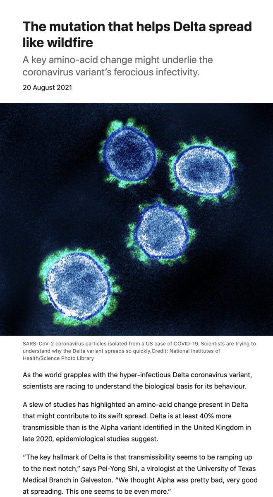</img></a>

---

<a href="https://twitter.com/erictopol/status/1428770579281178629" target="_blank" rel="noreferer">17:27 UCT</a>

The evidence that supports Delta breakthrough infections ability to spread (and why fully vaccinated people need to 😷 up)
https://www.nationalgeographic.com/science/article/evidence-mounts-that-people-with-breakthrough-infections-can-spread-delta-easily @NatGeo by @Ecquis w/ studies and input by @GuptaR_lab and @KasenRiemersma

---

<a href="https://twitter.com/erictopol/status/1428776963829747712" target="_blank" rel="noreferer">17:52 UCT</a>

What works to reduce #SARSCoV2 aerosol transmission in schools?
Opening windows: 14-fold decrease
Surgical face masks: 8-fold decrease
[Natural ventilation, face masks, HEPA filtration]: 
≥ 30-fold decrease
Details here, preprint
https://www.medrxiv.org/content/10.1101/2021.08.17.21262169v1

---

<a href="https://twitter.com/erictopol/status/1428788215389908993" target="_blank" rel="noreferer">18:37 UCT</a>

New reports on interferon (IFN) and Covid-19
1. IFN Auto-antibodies in ~14% of patients w/ critical Covid, and are present pre-Covid, increasing with age (&gt;6% for over age 80)
https://immunology.sciencemag.org/content/6/62/eabl4340 @SciImmunology 

<a href="E9QSVdyUYAMT4hS.jpg"  >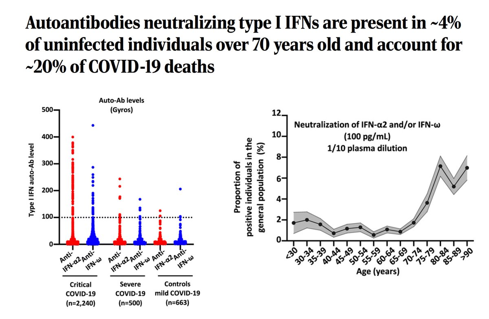</img></a>

---

<a href="https://twitter.com/erictopol/status/1428788219961765890" target="_blank" rel="noreferer">18:37 UCT</a>

2. Interferons play different, opposing roles by anatomic sites (and it's complicated) https://www.cell.com/cell/pdf/S0092-8674(21)00990-9.pdf?_returnURL=https%3A%2F%2Flinkinghub.elsevier.com%2Fretrieve%2Fpii%2FS0092867421009909%3Fshowall%3Dtrue @CellCellPress 

<a href="E9QSdYIVIAc6fpB.jpg"  >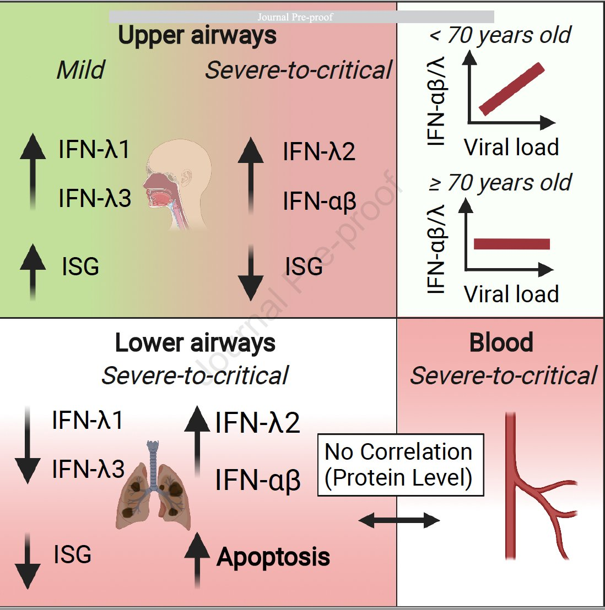</img></a>

---

<a href="https://twitter.com/erictopol/status/1428790213237563393" target="_blank" rel="noreferer">18:45 UCT</a>

The first group of Israelis to receive boosters were age ≥60. The impact is apparent with divergence of the curves.  https://twitter.com/AArgoetti/status/1428736481514901505

<a href="E9QUWEsVUAA76Va.png"  >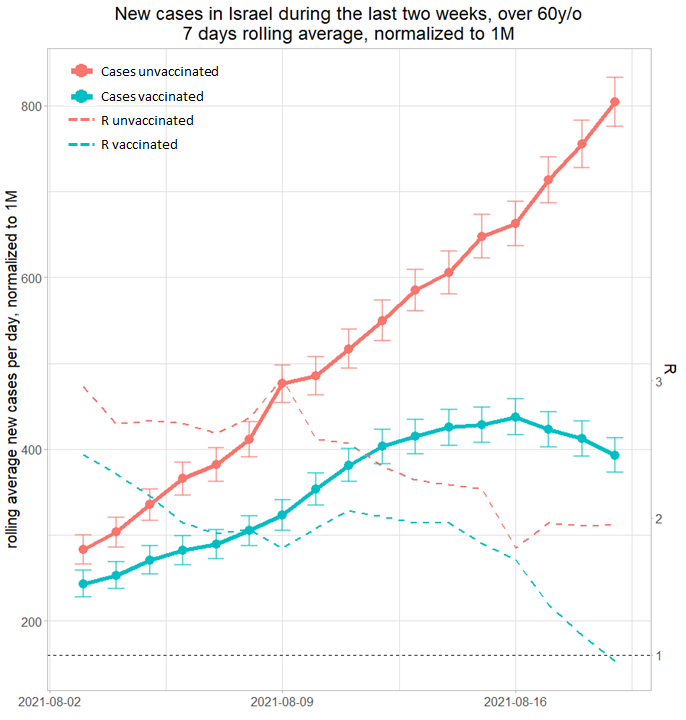</img></a>

---

<a href="https://twitter.com/erictopol/status/1428800006387945472" target="_blank" rel="noreferer">19:24 UCT</a>

There will be plenty of "boosters" for people who are fully vaccinated. Some will be in the form of a shot. Others will be via a visit with Delta. Either way, immunity to the 🦠will get revved up.

---

<a href="https://twitter.com/erictopol/status/1428837384209141760" target="_blank" rel="noreferer">21:52 UCT</a>

You know you're numb when you think ~100 less hospitalizations in Florida is a good trend 

<a href="E9Q_62hVoAI9ePC.jpg"  >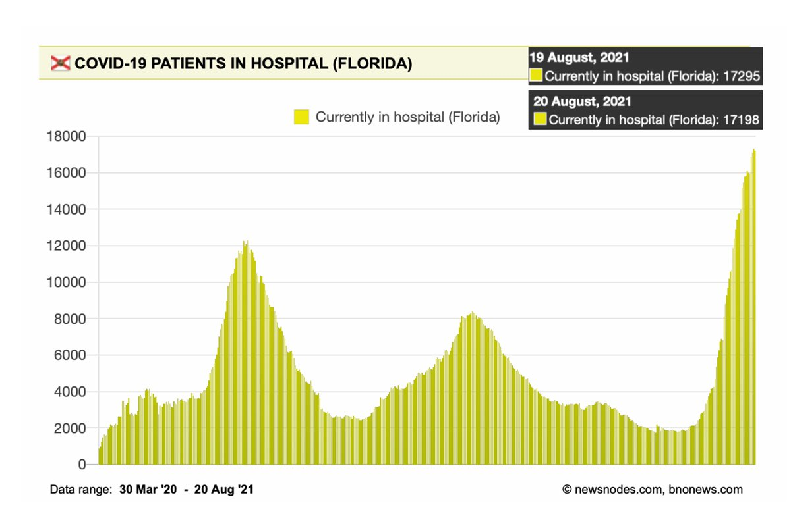</img></a>

---

<a href="https://twitter.com/erictopol/status/1428846323629838339" target="_blank" rel="noreferer">22:28 UCT</a>

This doesn't look good
https://www.wsbtv.com/news/local/metro-atlanta-school-districts-report-nearly-7000-cases-covid-19-first-weeks/KO37EA3M5NDRFPGCGVEY6OIA4U/ 

<a href="E9RIH7xVoAcFouA.jpg"  >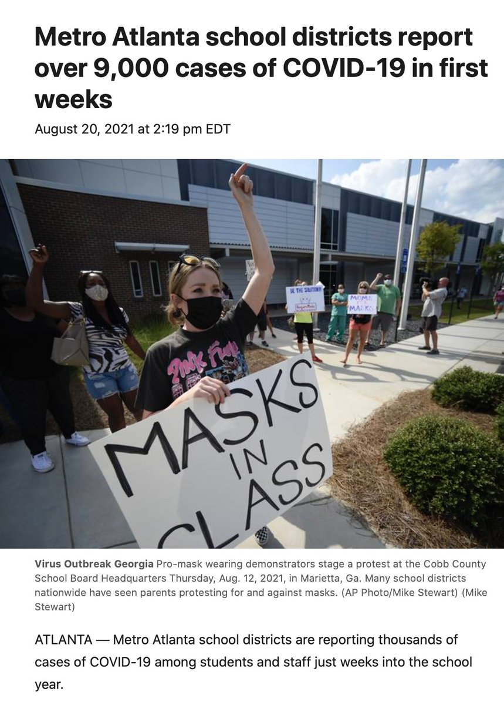</img></a>

---

<a href="https://twitter.com/erictopol/status/1428853393049546755" target="_blank" rel="noreferer">22:56 UCT</a>

Monday, full @US_FDA approval for 1st mRNA vaccine, expected
https://www.nytimes.com/2021/08/20/us/politics/fda-pfizer-covid-vaccine-full-approval.html
That's great. But if only it had been May 23rd instead of August 23rd, it would have made a world of difference to defend against Delta.

---

<a href="https://twitter.com/erictopol/status/1428858047582007301" target="_blank" rel="noreferer">23:14 UCT</a>

@US_FDA It was overdue back then. Afterwards, they got "all hands on deck" which surely helped. For the life of me, I'll never understand, why, for the #1 public health issue, this didn't happen much sooner.
https://www.nytimes.com/2021/07/01/opinion/fda-vaccines-full-approval.html @nytopinion 

<a href="E9RR_85UUAQ3paW.jpg"  >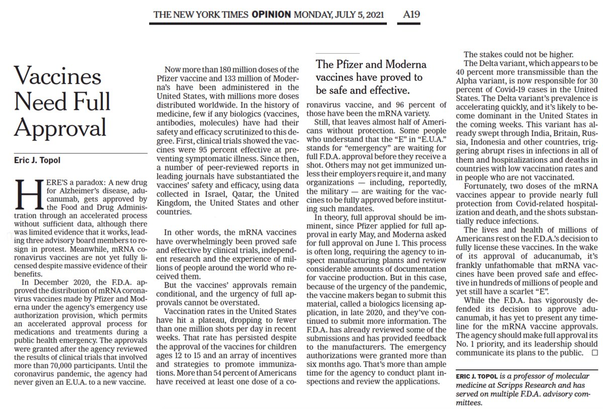</img></a>