+++
title = "Tweets by Eric Topol Aug 21"
Summary = ""
tags = ["Twitter"]
category = "Twitter"
+++

---

<a href="https://twitter.com/erictopol/status/1428894943267889153" target="_blank" rel="noreferer">01:41 UCT</a>

A multicenter randomized trial of awake prone positioning versus standard care for Covid respiratory failure shows significant reduction for the need of intubation and the incidence of treatment failure
https://www.thelancet.com/journals/lanres/article/PIIS2213-2600(21)00356-8/fulltext @LancetRespirMed 

<a href="E9R0M3HUcAADvEE.jpg"  >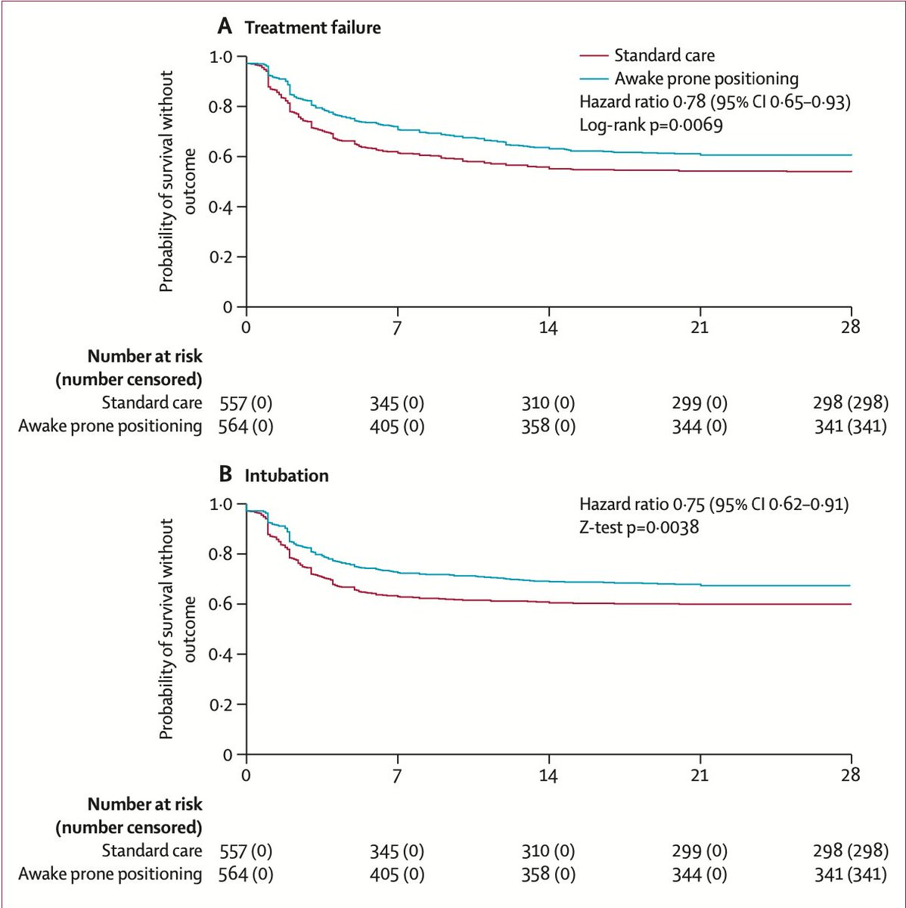</img></a>

---

<a href="https://twitter.com/erictopol/status/1428907639388327937" target="_blank" rel="noreferer">02:31 UCT</a>

Free, effective, but little talk on monoclonal antibodies
https://www.washingtonpost.com/health/covid-monoclonal-abbott/2021/08/19/a39a0b5e-0029-11ec-a664-4f6de3e17ff0_story.html by @LennyMBernstein and @lauriemcginley2 w/ @DrNunezSmith46 @JGPharmD 

<a href="E9R_k61UYAI0_Op.png"  >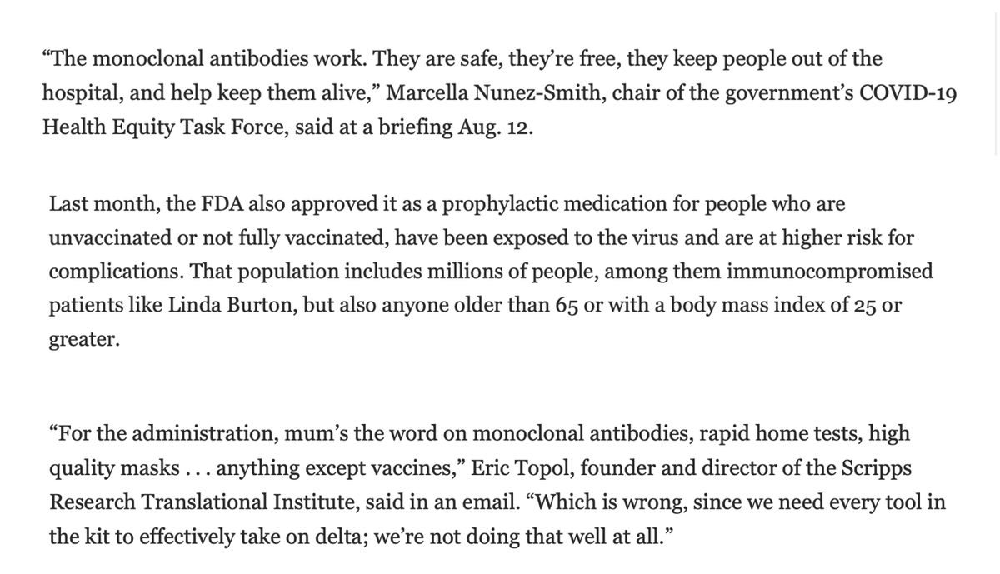</img></a>

---

<a href="https://twitter.com/erictopol/status/1429078038931664904" target="_blank" rel="noreferer">13:48 UCT</a>

While the debate about boosters ensues, the imminent FDA full approval will usher in millions of prescriptions by doctors for them
https://www.wsj.com/articles/fda-poised-to-give-full-approval-of-pfizer-vaccine-next-week-11629498450?mod=hp_lead_pos1 
How many of the recent increase of US vaccinations to &gt; 1 million/day were 3rd shots, but not properly tracked? 

<a href="E9UZIsLVcAIEO52.jpg"  >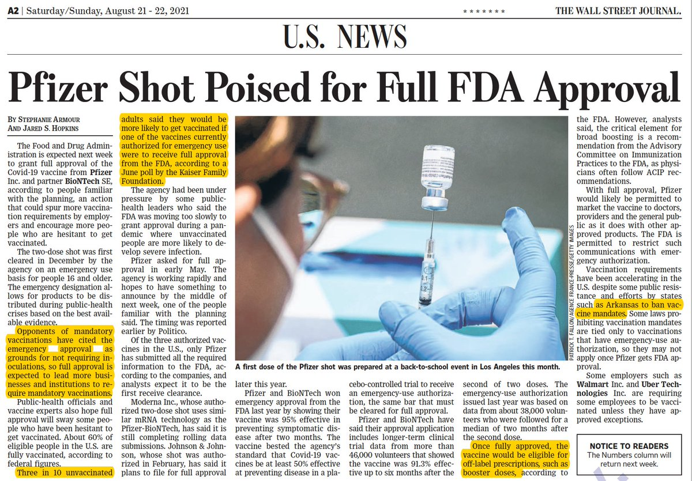</img></a>

---

<a href="https://twitter.com/erictopol/status/1429083817550049287" target="_blank" rel="noreferer">14:11 UCT</a>

Throughout the pandemic, these states have tracked closely together (with the exception of the Mardi Gras superspreader). In the Delta wave, they are all still on the rise for new cases 

<a href="E9UeS-oVUAovpT2.jpg"  >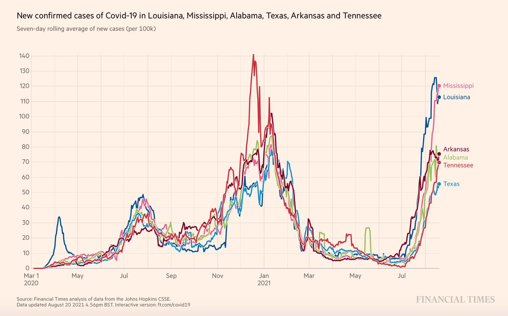</img></a>

---

<a href="https://twitter.com/erictopol/status/1429083820540661762" target="_blank" rel="noreferer">14:11 UCT</a>

For more on the Mardi Gras outbreak, an in-depth  assessment in this recent @CellCellPress paper https://www.cell.com/cell/fulltext/S0092-8674(21)00889-8

---

<a href="https://twitter.com/erictopol/status/1429094335325229073" target="_blank" rel="noreferer">14:53 UCT</a>

Our covid times :-)
by Joe Heller 

<a href="E9UprkUVUA0XX5T.jpg"  >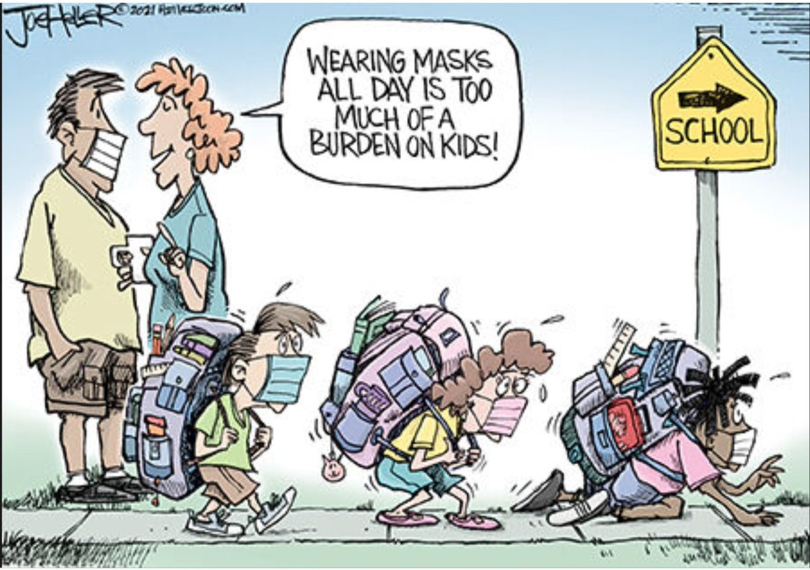</img></a>

---

<a href="https://twitter.com/erictopol/status/1429100848274046977" target="_blank" rel="noreferer">15:19 UCT</a>

Less than 2 weeks later.
Metastasis  https://twitter.com/EricTopol/status/1424561159508619266

<a href="E9Uvl2EUcAsERhQ.jpg"  >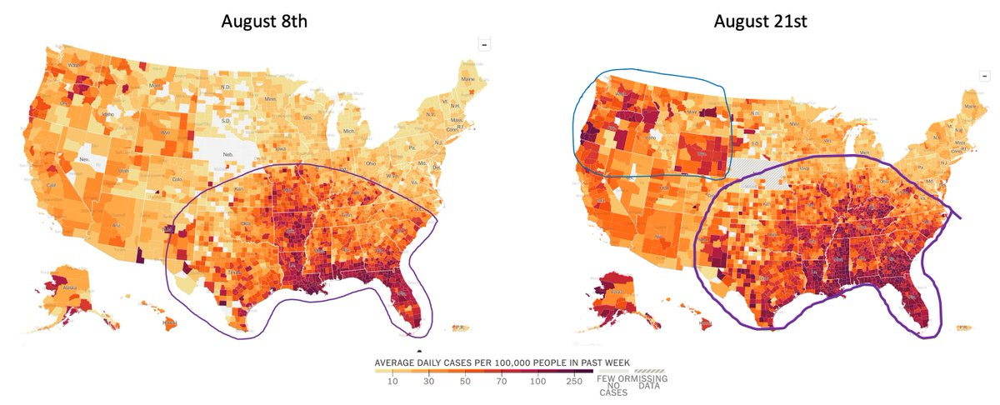</img></a>

---

<a href="https://twitter.com/erictopol/status/1429112412410576901" target="_blank" rel="noreferer">16:05 UCT</a>

Where are we headed with #AI for healthcare?
We spoke with @JeffDean, head of @GoogleAI and one of the luminaries, who, even as a high school student, was way ahead of the curve, writing software to track disease outbreaks
https://www.medscape.com/viewarticle/954956
w/ @cuttingforstone +transcript

---

<a href="https://twitter.com/erictopol/status/1429120556784181250" target="_blank" rel="noreferer">16:37 UCT</a>

We're very fortunate that #SARSCoV2 monoclonal antibodies are holding up so well against even the most immune evasive variant, Beta (B.1.351)
https://www.cell.com/cell-reports/fulltext/S2211-1247(21)01123-2 @CellReports @WeizmannScience 

<a href="E9VALKsUYAEyZLB.jpg"  >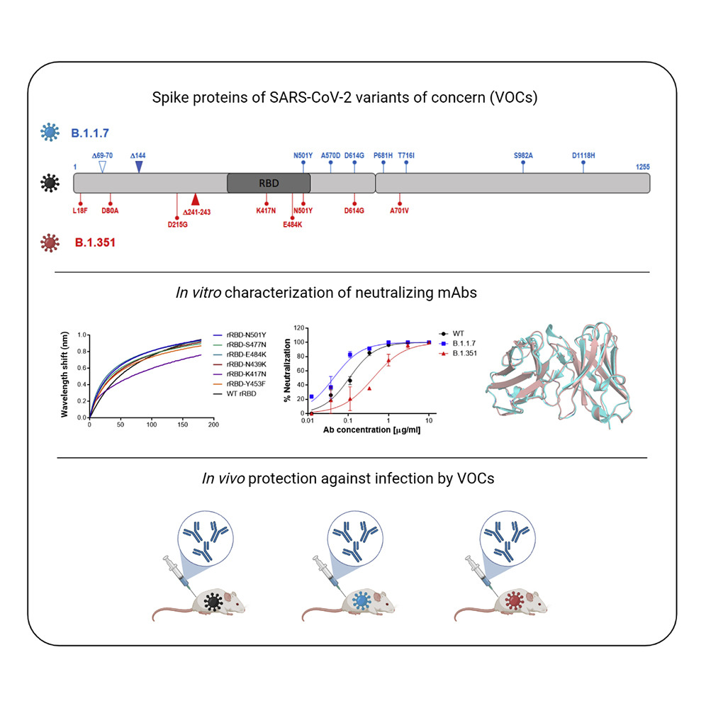</img></a>

---

<a href="https://twitter.com/erictopol/status/1429125703878934531" target="_blank" rel="noreferer">16:58 UCT</a>

In the coming weeks, we'll turn the corner on the US Delta wave. But that doesn't mean we'll drop back to baseline. A full court press is needed to build a much stronger immunity wall 

<a href="E9VF7YzUYAIcOXZ.jpg"  >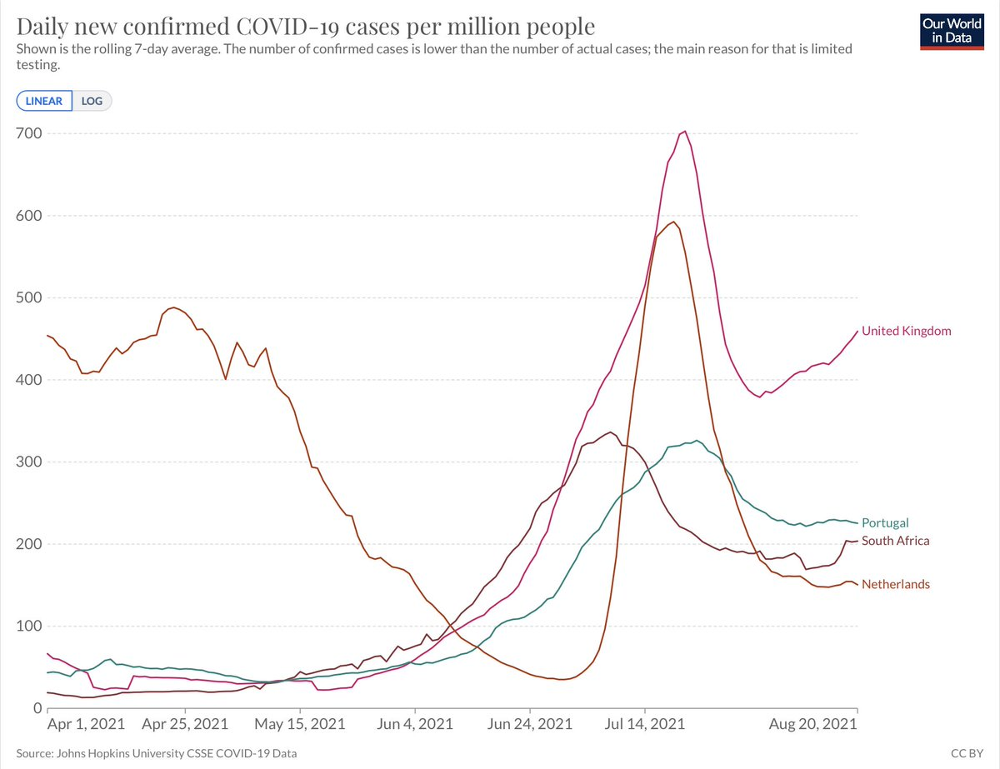</img></a>

---

<a href="https://twitter.com/erictopol/status/1429132405986631680" target="_blank" rel="noreferer">17:24 UCT</a>

This is a phenomenal accomplishment. Just think what it could have been without resistance to the most impressive biomedical triumph in history.
Thanks for your indefatigable efforts @WHCOVIDResponse 🙏 https://twitter.com/WHCOS/status/1429121548959559680

---

<a href="https://twitter.com/erictopol/status/1429141726266990597" target="_blank" rel="noreferer">18:01 UCT</a>

Why do 2 states with almost the same 50% vaccination have such remarkably divergent curves for cases and hospitalizations, with Michigan being one of the lowest in the country?
Supports the impact of natural infection immunity from the Alpha wave in Michigan 

<a href="E9VTcnIVIAErHGO.jpg"  >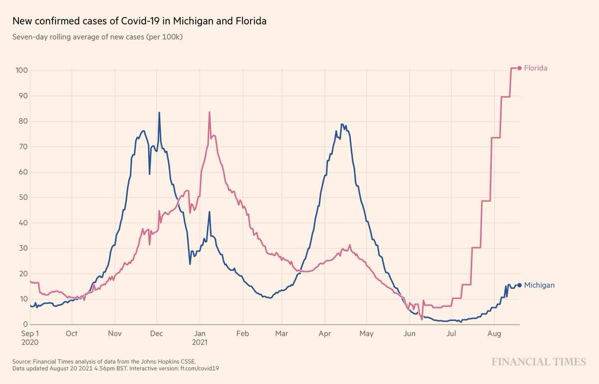</img></a><a href="E9VUjXvUUAMhFtV.jpg"  >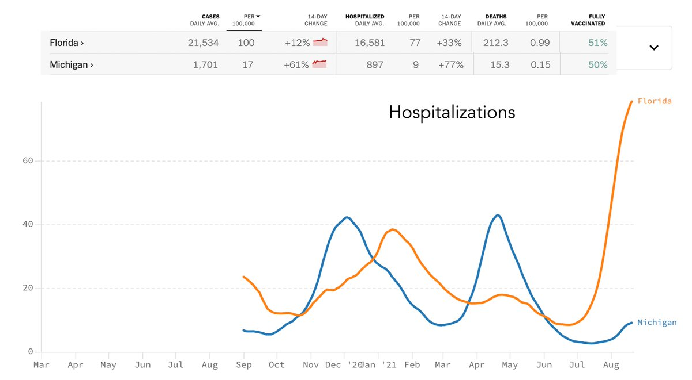</img></a>

---

<a href="https://twitter.com/erictopol/status/1429153560629968901" target="_blank" rel="noreferer">18:48 UCT</a>

RT @Farzad_MD: Great interview between @EricTopol @cuttingforstone
and @JeffDean

I also can't not think of epi-info (which he wrote as a h…

---

<a href="https://twitter.com/erictopol/status/1429166127834304516" target="_blank" rel="noreferer">19:38 UCT</a>

It's about time a direct counter-offensive to vaccine misinformation appeared. Good on @RWalensky, taking it on
 https://www.motherjones.com/politics/2021/08/cdc-director-dings-hannity-for-false-vaccine-claim/ @MotherJones by @dfriedman33

---

<a href="https://twitter.com/erictopol/status/1429169884198445057" target="_blank" rel="noreferer">19:53 UCT</a>

That was a year ago. 

<a href="E9VuQJcUcAEYKLw.jpg"  >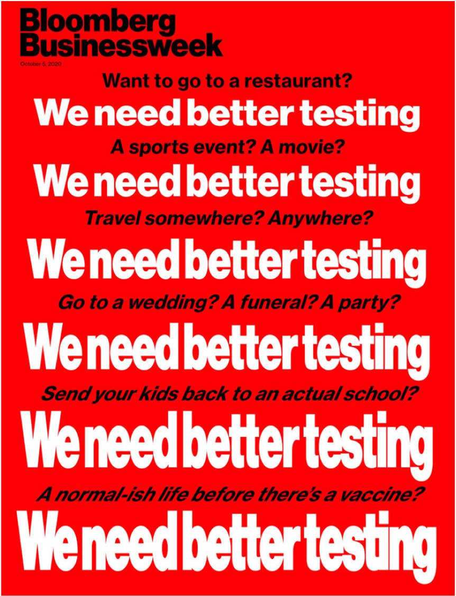</img></a>

---

<a href="https://twitter.com/erictopol/status/1429192543531503616" target="_blank" rel="noreferer">21:23 UCT</a>

File under Delta, not predicted. 

<a href="E9WCn3GVoAEzpvI.jpg"  >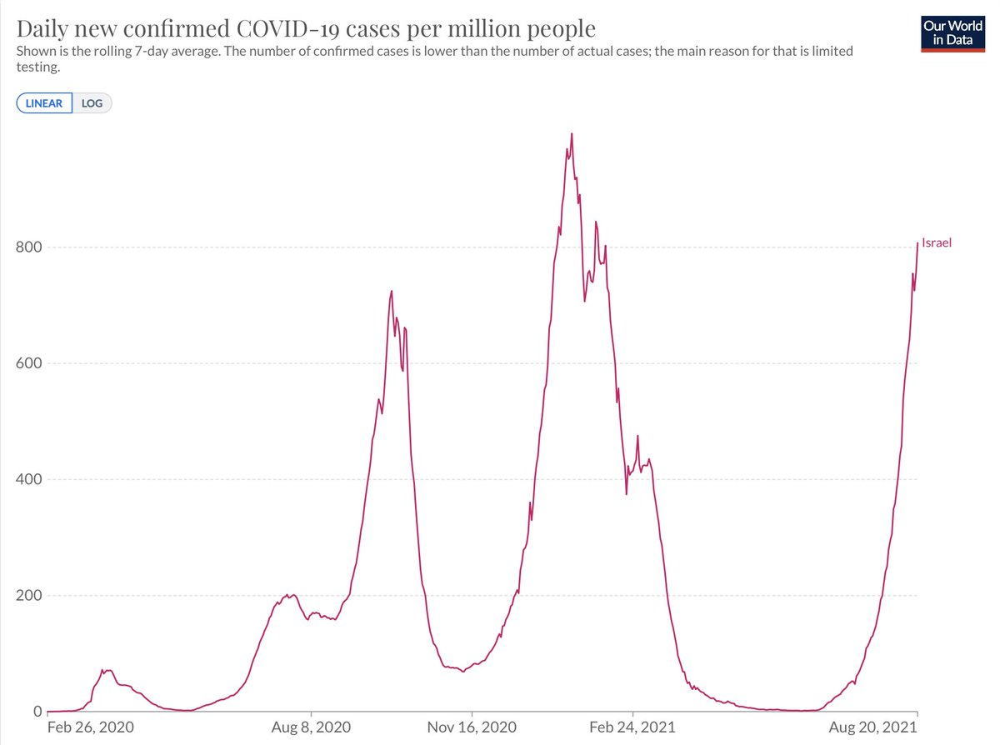</img></a><a href="E9WDBasVoAIj_hq.jpg"  >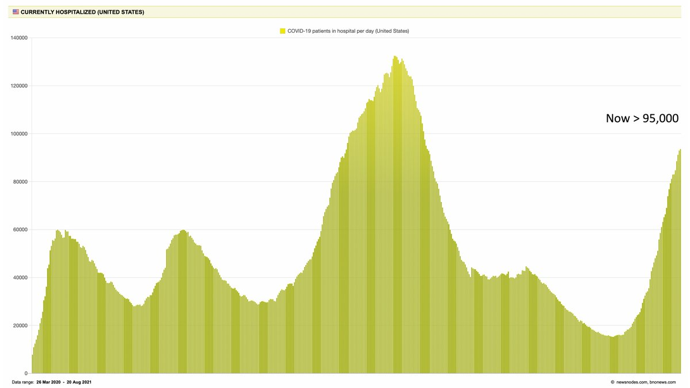</img></a>

---

<a href="https://twitter.com/erictopol/status/1429196142215012352" target="_blank" rel="noreferer">21:38 UCT</a>

@yaneerbaryam Thanks, Captain Obvious.
No one predicted this ability of Delta to override vaccinations, to this extent, in these countries. Simply adds to how formidable a challenge it has turned out to reckon with.

---

<a href="https://twitter.com/erictopol/status/1429197894960107520" target="_blank" rel="noreferer">21:45 UCT</a>

Let me make this clear.
Israel got to zero covid and is a model country for vaccination.
The US, unlike Israel and the UK that suppressed 75% of hospitalizations during their Delta wave (vs Alpha), is &gt;75% of its peak.
Findings that reinforce has formidable Delta is to deal with.

---

<a href="https://twitter.com/erictopol/status/1429205485807312896" target="_blank" rel="noreferer">22:15 UCT</a>

Current top 10 in the world
https://newsnodes.com/worldmonitor/ 

<a href="E9WOvYYVcAcrkJv.jpg"  >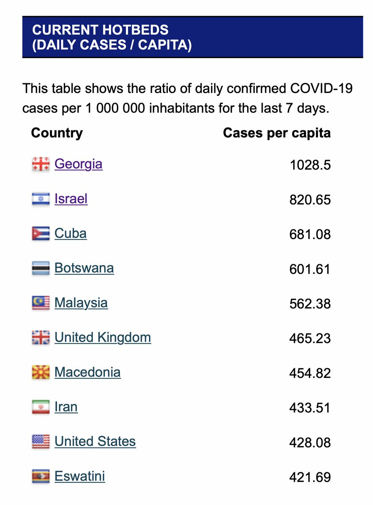</img></a>