+++
title = "Tweets by Eric Topol Aug 22"
Summary = ""
tags = ["Twitter"]
category = "Twitter"
+++

---

<a href="https://twitter.com/erictopol/status/1429252397029728265" target="_blank" rel="noreferer">01:21 UCT</a>

There was little evidence of decline of vaccine efficacy in the 6 month follow-up of @Pfizer/@BioNTech_Group pivotal trial (6 mos, 91%), pre-Delta
https://www.medrxiv.org/content/10.1101/2021.07.28.21261159v1
In contrast, in Israel, with Delta that dropped to ~40% in vaccinees &gt; 6 months out. Now on the way back up  https://twitter.com/EricTopol/status/1428790213237563393

<a href="E9W5d4sVkAUpTkF.jpg"  >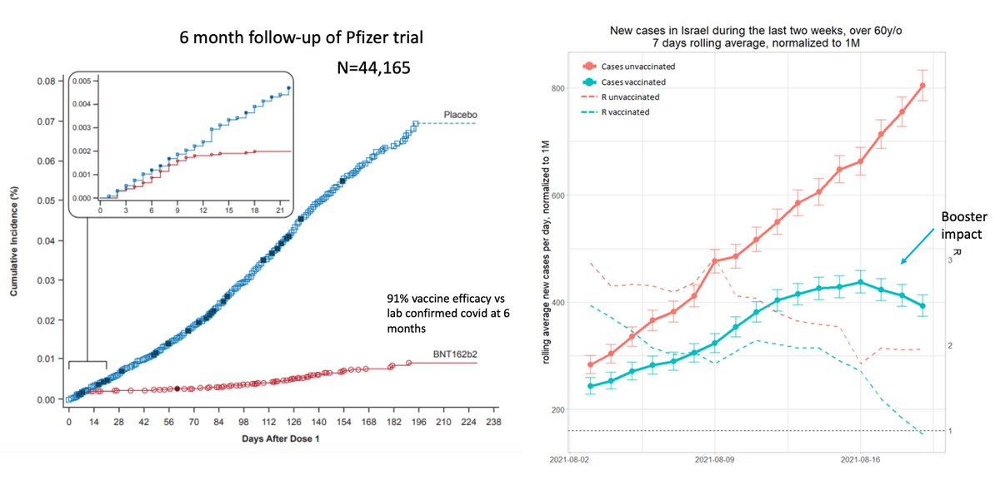</img></a>

---

<a href="https://twitter.com/erictopol/status/1429255460352237577" target="_blank" rel="noreferer">01:33 UCT</a>

Today in Florida
Hospitalizations increased.
Test positivity is 37.2%.
https://newsnodes.com/us_state/FL 

<a href="E9W8QIJVgAITi9y.jpg"  >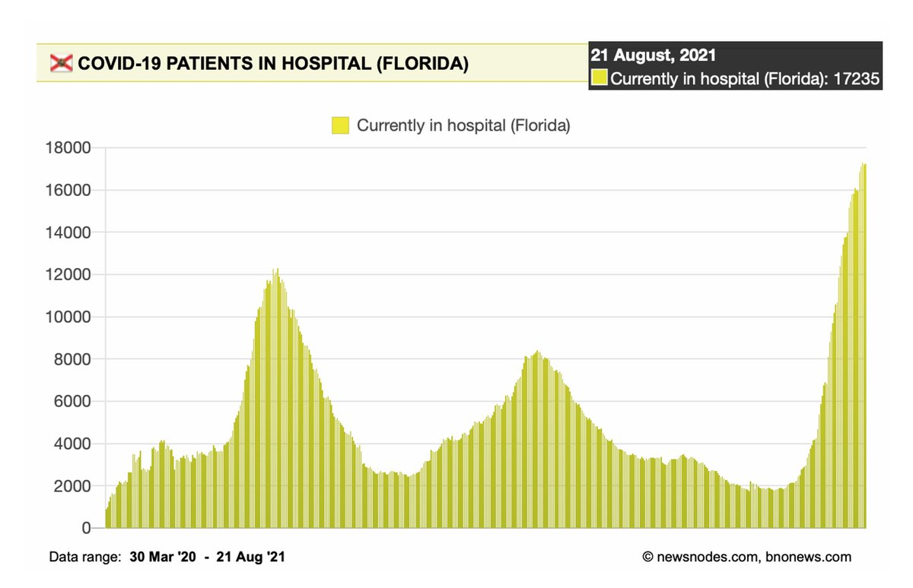</img></a><a href="E9W77qmVcAI6X8Q.jpg"  >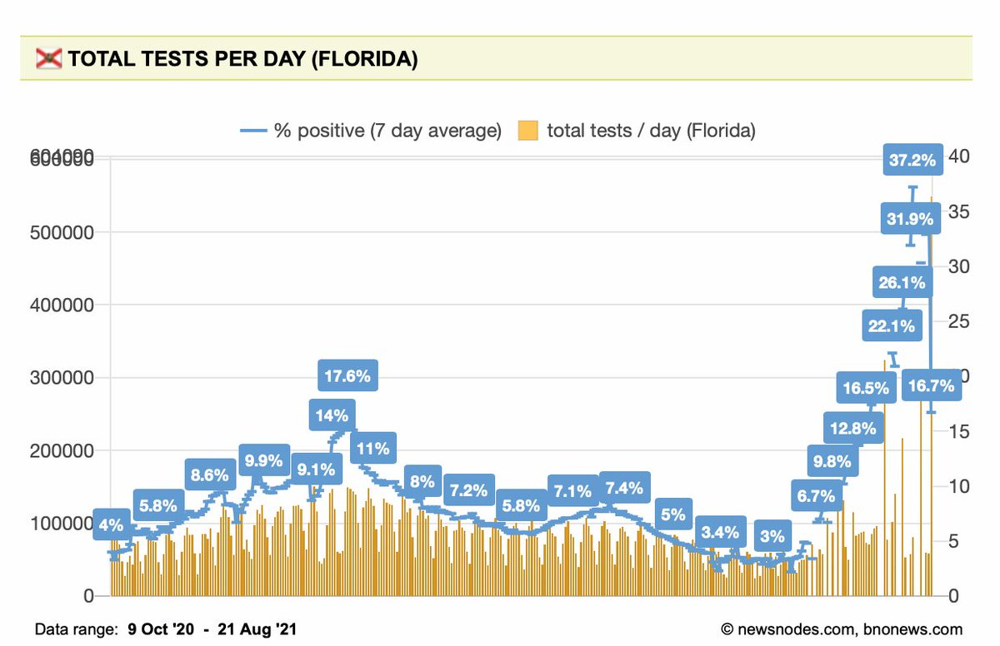</img></a>

---

<a href="https://twitter.com/erictopol/status/1429458907240357888" target="_blank" rel="noreferer">15:02 UCT</a>

Important work/finding by @Corine_GvK and @ErasmusMC team. Breakthrough (nearly all Delta) infections in healthcare workers had less viral culture positivity than primary infections despite similar Ct, viral load. Documents another benefit of vaccination: less infectious. Short🧵 https://twitter.com/Corine_GvK/status/1429370550888116230

---

<a href="https://twitter.com/erictopol/status/1429470022347362304" target="_blank" rel="noreferer">15:46 UCT</a>

A study of &gt;7,000 people with serial #SARSCoV2 IgG antibodies to 6+ months after @Pfizer vaccination or prior covid shows early advantage of vaccination but  attrition later. No data on combined impact 
https://www.medrxiv.org/content/10.1101/2021.08.19.21262111v1.full.pdf 

<a href="E9Z-FK3VIAcqQ4o.jpg"  >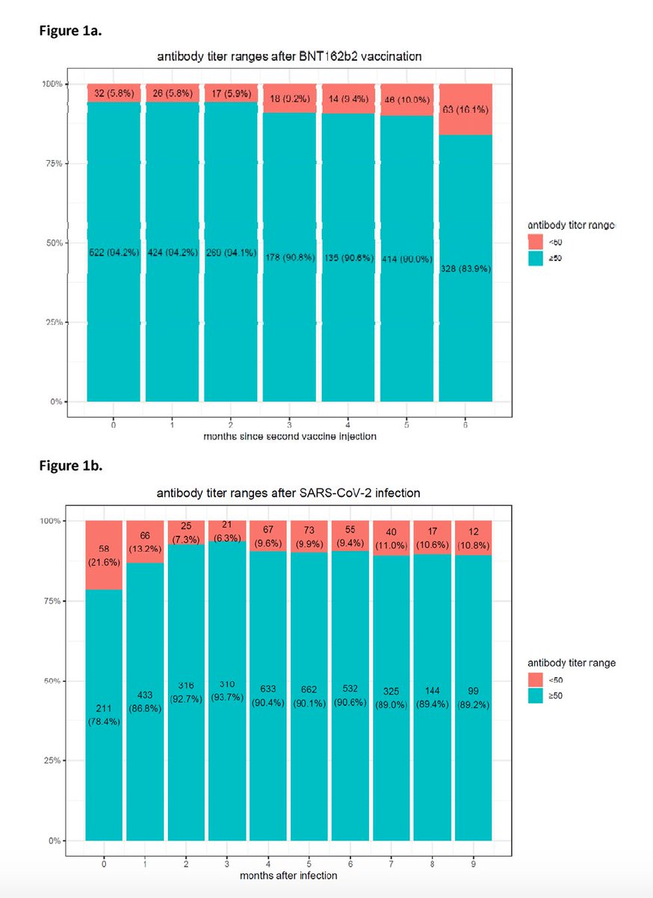</img></a><a href="E9Z_Ch6UUAElc1t.jpg"  >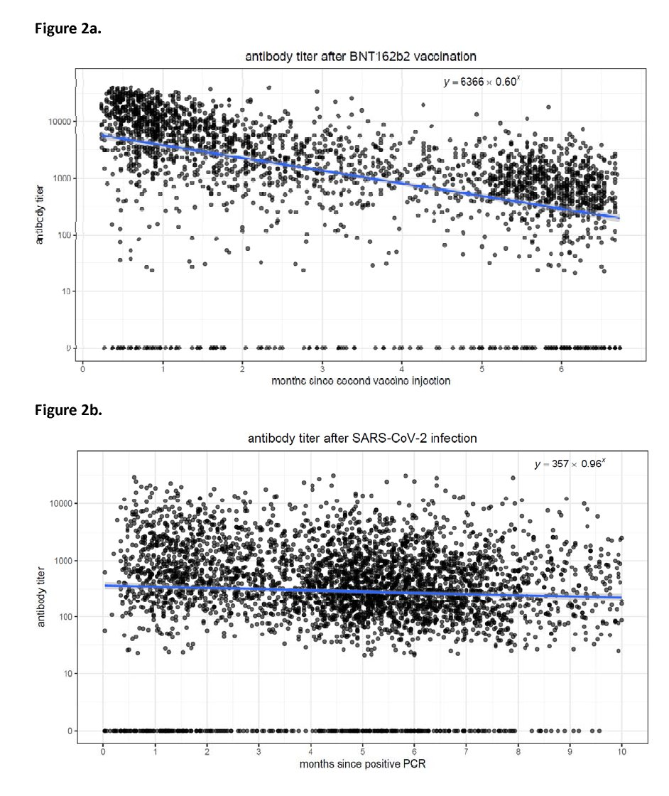</img></a>

---

<a href="https://twitter.com/erictopol/status/1429471843224756225" target="_blank" rel="noreferer">15:53 UCT</a>

Case growth slowing in the US, now tracking with the UK, while no sign of let up in Israel
(testing in the US is &lt;1/4th these countries per capita) 

<a href="E9aA-NKVoAMVmrE.jpg"  >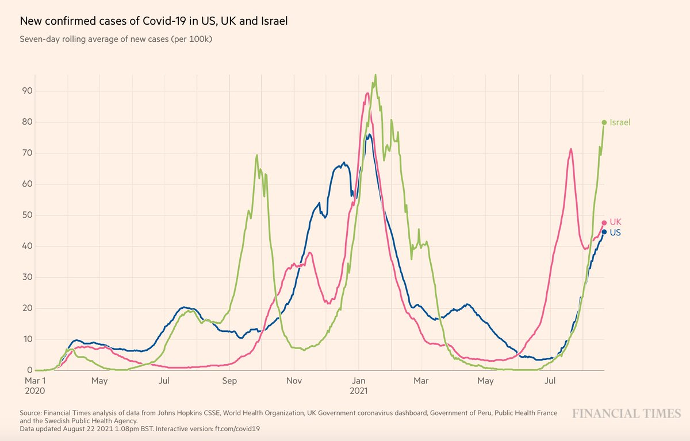</img></a>

---

<a href="https://twitter.com/erictopol/status/1429477608639504388" target="_blank" rel="noreferer">16:16 UCT</a>

Obviating the testing confounder, a look at hospitalizations. More evidence of a plateau reached in US, yet at far higher levels than UK or Israel.
@OurWorldInData 

<a href="E9aFjlgUcAY6nJX.jpg"  >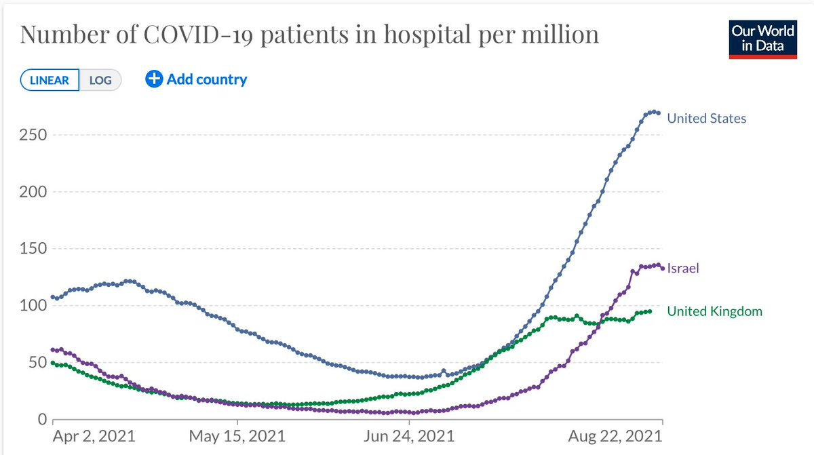</img></a>

---

<a href="https://twitter.com/erictopol/status/1429490863852298240" target="_blank" rel="noreferer">17:09 UCT</a>

True 
"If you’re vaccinated, your immune system is ready, it’s better equipped, and it usually kicks the virus’s ass.”—@angie_rasmussen 
Then, why not always? And what is the real breakthrough risk?
https://www.newyorker.com/science/medical-dispatch/have-you-already-had-a-breakthrough-covid-infection @DhruvKhullar @NewYorker w/ @NussenzweigL @JenniferNuzzo

---

<a href="https://twitter.com/erictopol/status/1429497339840851973" target="_blank" rel="noreferer">17:34 UCT</a>

More data from @BarakRaveh via @IsraelMOH dashboard on daily trend towards restoration of vaccine effectiveness (VE) vs infections with boosters by age group. Note &lt;30% VE in 20-49 age groups w/o booster.  https://twitter.com/BarakRaveh/status/1429350666623913989 

<a href="E9aYPfXVcAAZPoY.jpg"  >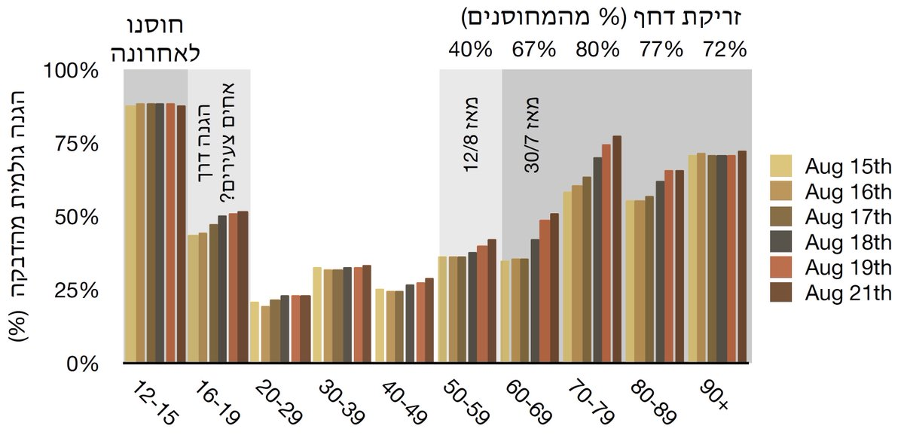</img></a>

---

<a href="https://twitter.com/erictopol/status/1429506880200577027" target="_blank" rel="noreferer">18:12 UCT</a>

Covid hospitalization rate and % total population fully vaccinated 
Canada 67%   2/100,000K
US 51%           27/100,000K
Intra-US
Vermont 67%  4/100,000K
Florida 51%    78/100,000K
@OurWorldInData 

<a href="E9agQExVcAAq75w.jpg"  >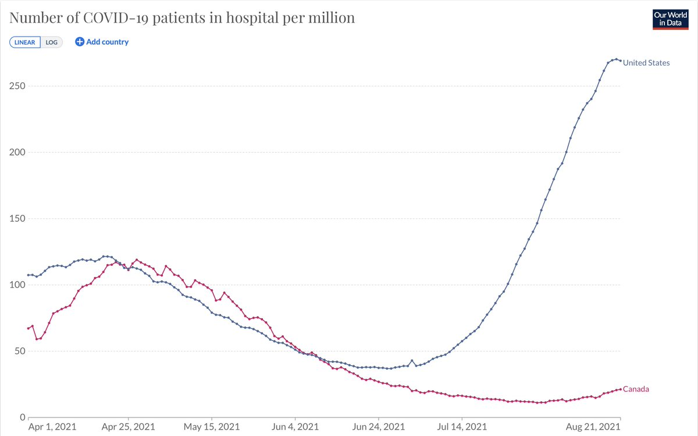</img></a>

---

<a href="https://twitter.com/erictopol/status/1429509131774226433" target="_blank" rel="noreferer">18:21 UCT</a>

No conclusions are/were made. I just present the data. Obviously behavior, mitigation measures play a big role. That isn't quantified or I would have added it!

---

<a href="https://twitter.com/erictopol/status/1429523296349872131" target="_blank" rel="noreferer">19:18 UCT</a>

Take note. Keep your guard up. Don't give your vaccination a Delta stress test.
(aligns with prior posts that we don't have a true handle on US Delta breakthroughs, and concern Dr. Sauza raises with our healthcare workforce) https://twitter.com/drmeowza/status/1429221776270135296

---

<a href="https://twitter.com/erictopol/status/1429525708565487616" target="_blank" rel="noreferer">19:27 UCT</a>

To reiterate, prior to Delta mRNA vaccines had well over 90% effectiveness vs infections, approaching the unexpected goal of achieving mucosal/sterilization  immunity.
With Delta, that has dropped to ~50% in many recent studies 

<a href="E9axvCTVgAEchZI.jpg"  >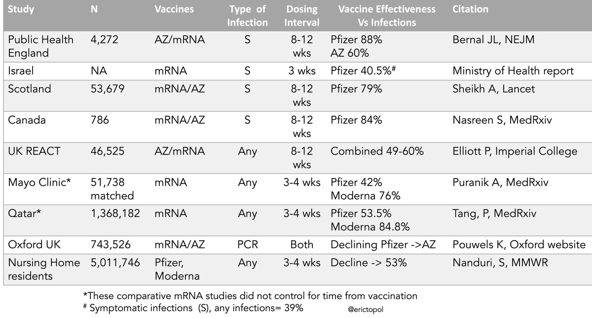</img></a>

---

<a href="https://twitter.com/erictopol/status/1429533181162582019" target="_blank" rel="noreferer">19:57 UCT</a>

The mRNA vaccine story was by no means fast. Both it and lipid nanoparticles for its delivery took several decades
https://www.nature.com/articles/s41578-021-00358-0?utm_source=twitter&utm_medium=social&utm_content=organic&utm_campaign=NGMT_USG_JC01_GL_NRJournals 

<a href="E9a2t4vVgAIanHa.jpg"  >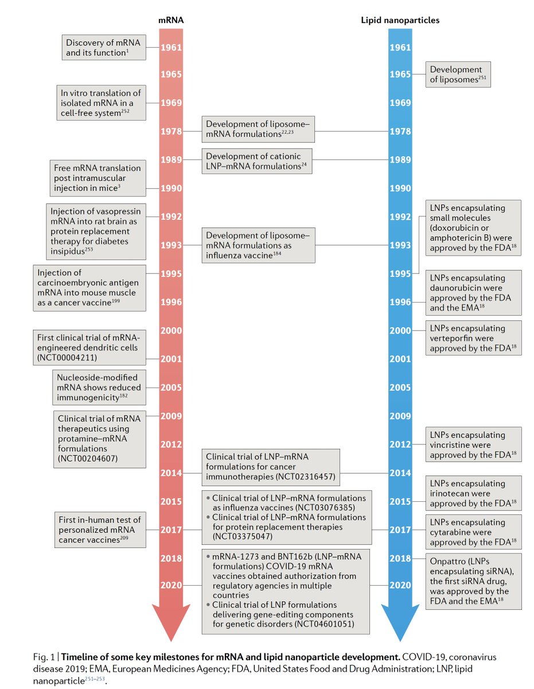</img></a>

---

<a href="https://twitter.com/erictopol/status/1429533184065040384" target="_blank" rel="noreferer">19:57 UCT</a>

This table summarizes how extensive mRNA testing has been for 7 other infectious diseases, cancers, and genetic disorders. And while published this month, still not up-to-date. 
This is not "experimental gene therapy" —that is  fabricated disinformation by anti-vaxxers 

<a href="E9a3zjTVgAIQAhZ.jpg"  >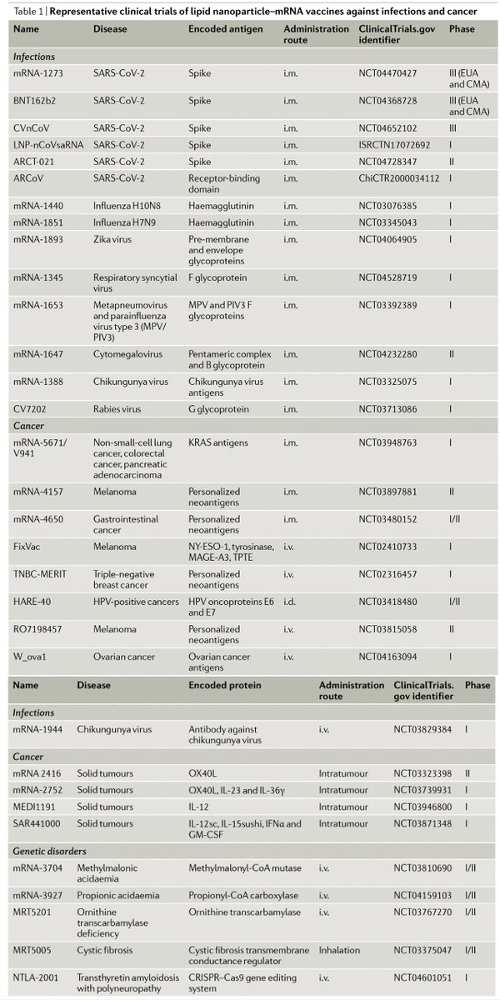</img></a>

---

<a href="https://twitter.com/erictopol/status/1429542303157284865" target="_blank" rel="noreferer">20:33 UCT</a>

RT @devisridhar: Delta is different to the original virus- and changed how we can manage it. 

With original SARS-CoV-2, Pfizer &amp; Moderna w…

---

<a href="https://twitter.com/erictopol/status/1429563377978802178" target="_blank" rel="noreferer">21:57 UCT</a>

Not the 1st report of outdoor wedding + Delta, and others from weeks ago
https://twitter.com/EricTopol/status/1416047347641905153

