+++
title = "Tweets by Eric Topol Aug 24"
Summary = ""
tags = ["Twitter"]
category = "Twitter"
+++

---

<a href="https://twitter.com/erictopol/status/1429966829150081025" target="_blank" rel="noreferer">00:40 UCT</a>

Thrilled to see this richly deserved recognition for 
@PeterHotez, my friend, and the indefatigable warrior fighting the pandemic misinformation, among many other noble efforts https://twitter.com/ChrisJansing/status/1429926750444736513

---

<a href="https://twitter.com/erictopol/status/1429968347341357058" target="_blank" rel="noreferer">00:46 UCT</a>

Another mandate, Chicago.
And when to we follow suit with Canada to require vaccination for all air and rail passengers? 

<a href="E9hEaCWVIAAmKls.jpg"  >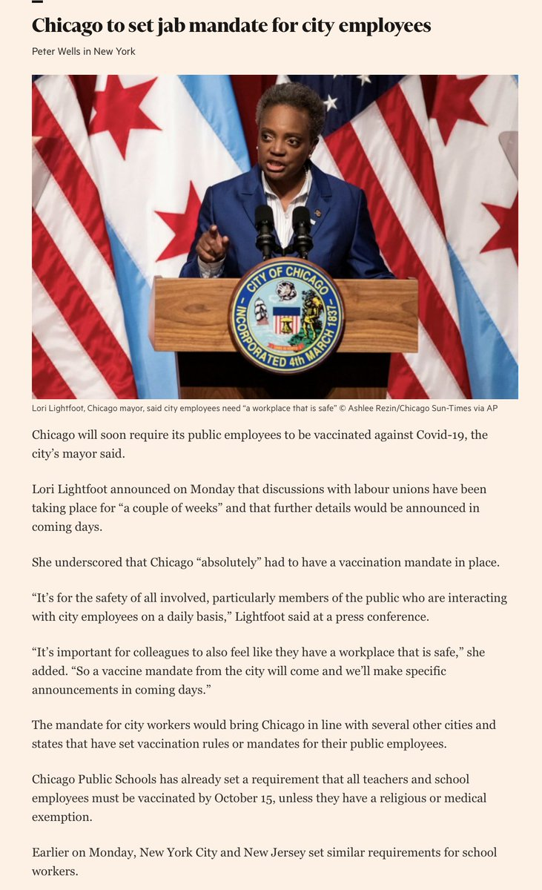</img></a><a href="E9hEbWYVUAE2T1m.jpg"  ></img></a>

---

<a href="https://twitter.com/erictopol/status/1429977888967729170" target="_blank" rel="noreferer">01:24 UCT</a>

A reminder about Ivermectin, the anti-parasite pill that  in Mississippi accounts for 70% of recent calls to its poison control center
https://www.npr.org/2021/08/23/1030208101/mississippi-livestock-drug-ivermectin-covid-misinformation
The main study supporting its use had to be withdrawn due to "plagiarism and data manipulation"
https://www.nature.com/articles/d41586-021-02081-w 

<a href="E9hM2WvVoAg64FS.jpg"  >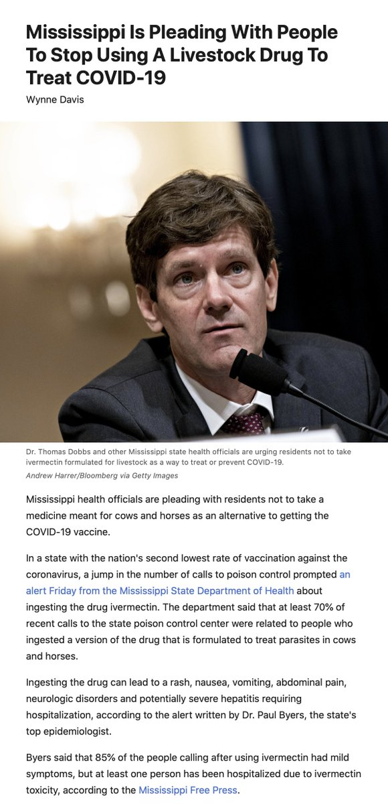</img></a><a href="E9hM3vRUUAAXhW8.jpg"  >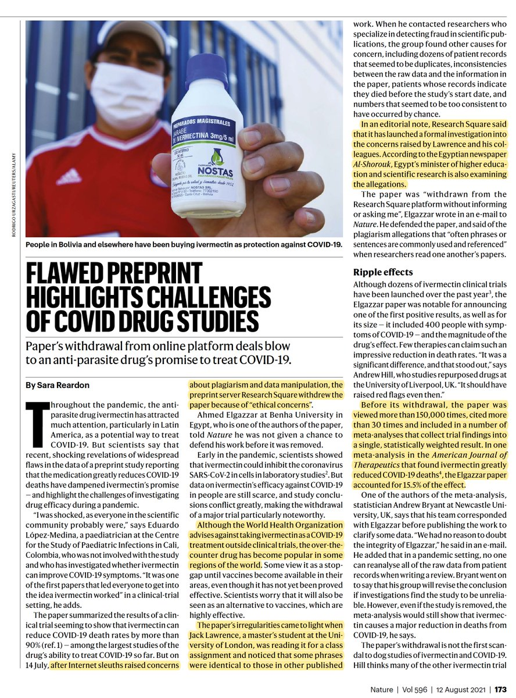</img></a>

---

<a href="https://twitter.com/erictopol/status/1429996140179574786" target="_blank" rel="noreferer">02:37 UCT</a>

Video of #SARSCoV2 infecting brain cells (gray blobs) with cell fusion, hijacking, and explosive release of copies for more invasions
https://www.nytimes.com/2021/08/22/science/microscopic-bat-brain-virus.html?smtyp=cur&smid=tw-nytimesscience @NYTScience @AndrewJacobsNYT by @aicher_sophie and @Delphine_Planas @institutpasteur @justsaysinrats @NikonSmallWorld 

<a href="https://twitter.com/erictopol/status/1429996140179574786" target="_blank" rel="noreferer">Annimation or video</a>

---

<a href="https://twitter.com/erictopol/status/1430023331743371269" target="_blank" rel="noreferer">04:25 UCT</a>

US covid hospitalizations reached nearly 96,000 today.
That's 74% of pandemic peak, despite some recent reduction in rate of rise
https://newsnodes.com/us 

<a href="E9h1tL6VkAgCdOf.jpg"  >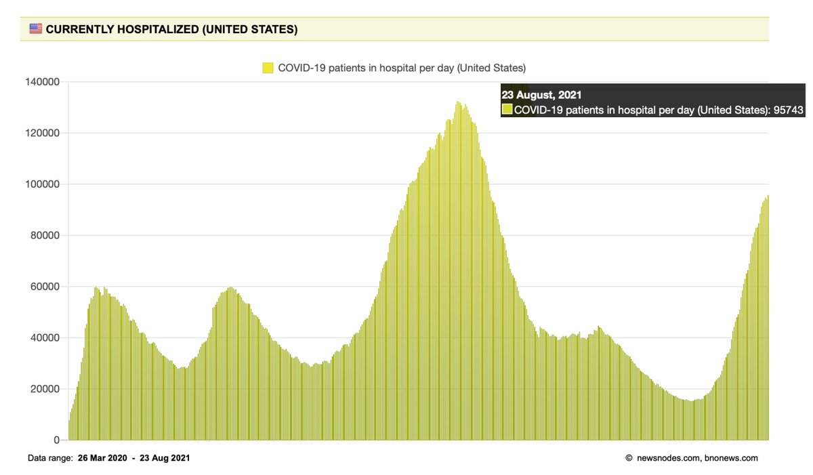</img></a>

---

<a href="https://twitter.com/erictopol/status/1430152073442516995" target="_blank" rel="noreferer">12:56 UCT</a>

Our covid times
by @stephanpastis 

<a href="E9jrtU6VUAA0Nuz.jpg"  >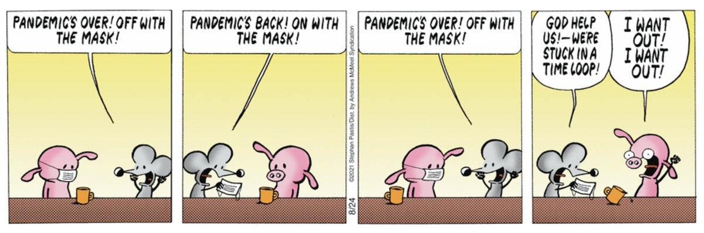</img></a>

---

<a href="https://twitter.com/erictopol/status/1430158459673006081" target="_blank" rel="noreferer">13:22 UCT</a>

How much more do we have to learn from studies here and multiple other countries to institute frequent rapid testing for universities and schools?
https://www.nytimes.com/2021/08/22/health/university-illinois-covid.html @kchangnyt 

<a href="E9jv-bhUUAYKUYm.jpg"  >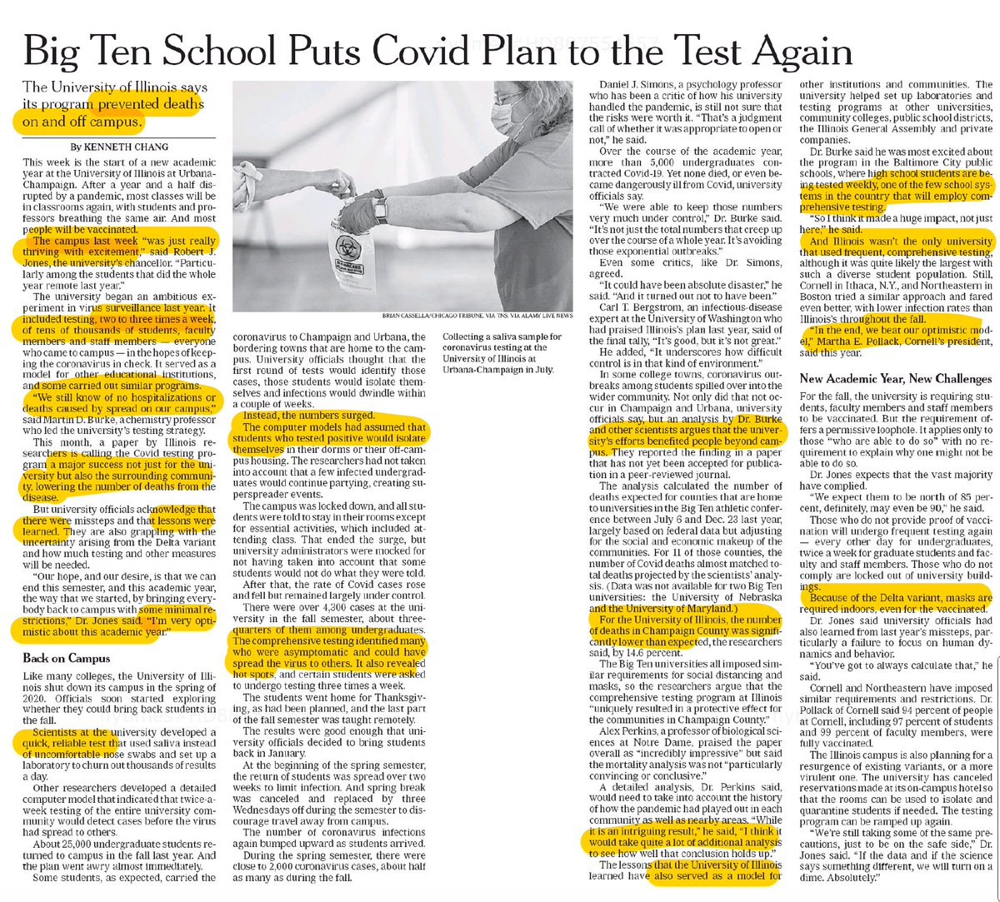</img></a><a href="E9jxfN7VIAMSZ-f.jpg"  >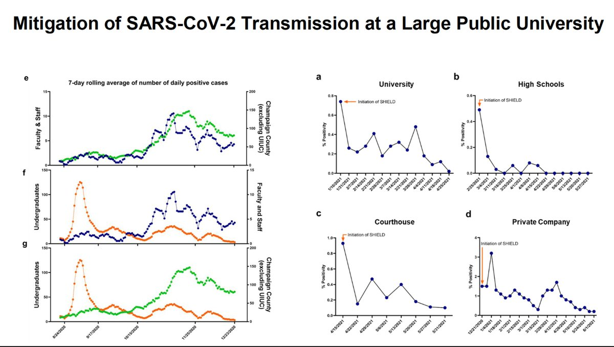</img></a>

---

<a href="https://twitter.com/erictopol/status/1430162196860870658" target="_blank" rel="noreferer">13:36 UCT</a>

About 1.6 million Israelis have received booster shots.
There’s been a flattening of the curves for severe illness and hospitalizations. 
Awaiting further follow-up and full analysis but this early look is encouraging. https://twitter.com/segal_eran/status/1430068336109441034

---

<a href="https://twitter.com/erictopol/status/1430165344648376340" target="_blank" rel="noreferer">13:49 UCT</a>

Debunking 7 of the multitude of myths and disinformation about covid vaccines https://www.sandiegouniontribune.com/news/health/story/2021-08-20/vax-facts-7-common-coronavirus-vaccine-myths-debunked by @JonathanWosen @sdut 

<a href="E9j3XY-XMAEdy-G.jpg"  >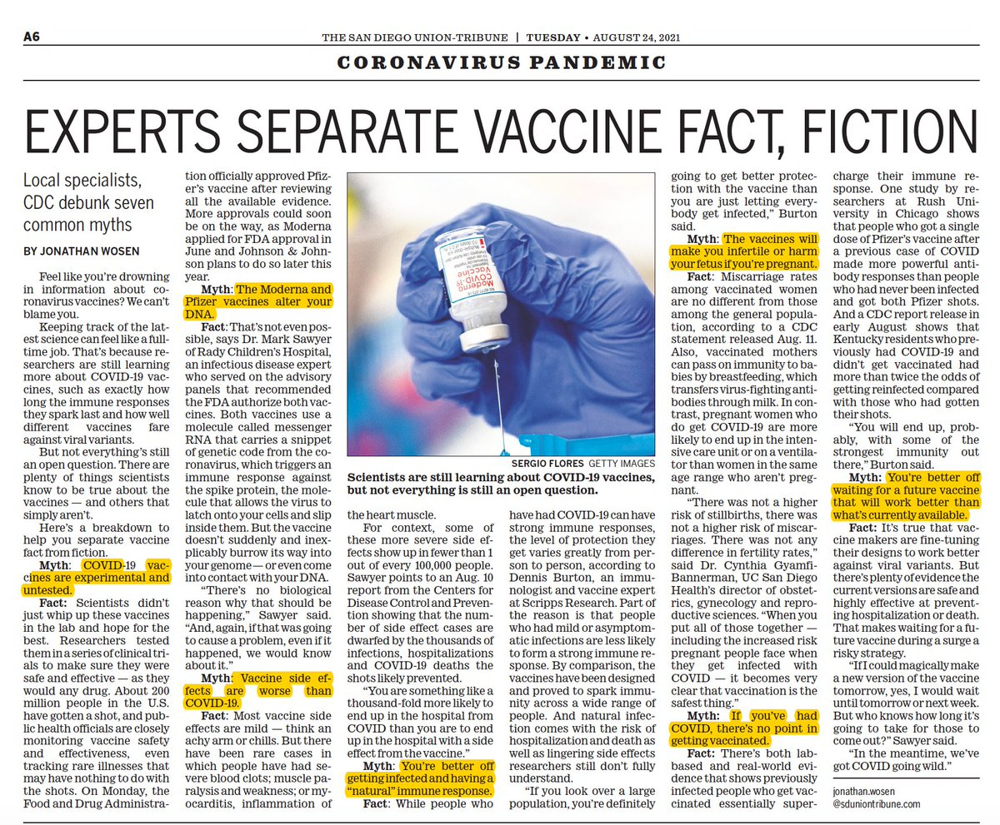</img></a>

---

<a href="https://twitter.com/erictopol/status/1430171289432567827" target="_blank" rel="noreferer">14:13 UCT</a>

Just published @ScienceTM 
https://stm.sciencemag.org/content/early/2021/08/23/scitranslmed.abh2624.full
284 patients w/ Covid:  type I IFN-specific autoantibodies in 25% with critical or severe disease, none with moderate disease; single cell RNA-seq of &gt;600,000 cells -&gt; role of ISG-1 gene and deficient response 

<a href="E9j847rXsBAFhFq.jpg"  >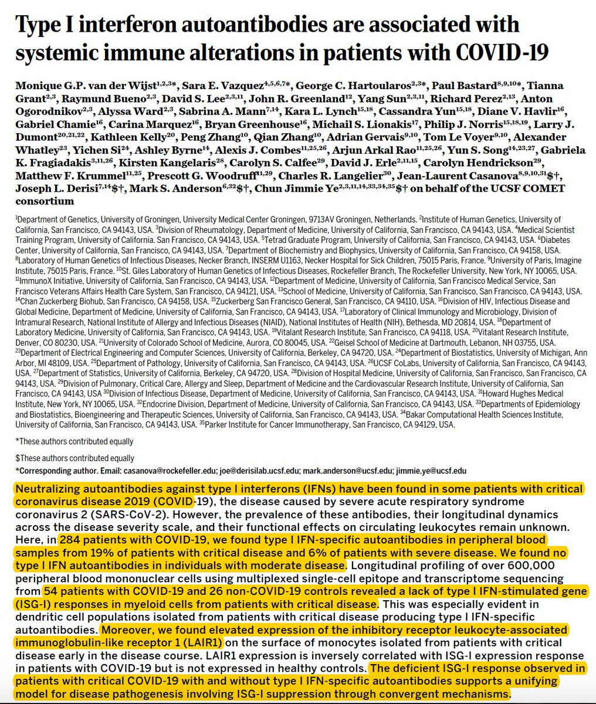</img></a><a href="E9j86_HWEBAIDjZ.png"  >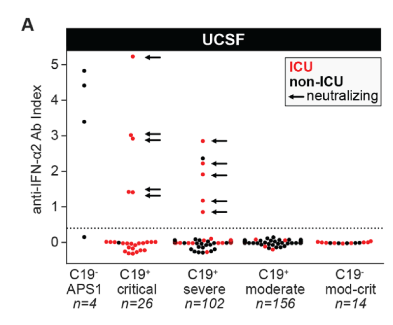</img></a>

---

<a href="https://twitter.com/erictopol/status/1430175639026479115" target="_blank" rel="noreferer">14:30 UCT</a>

Our covid times :-) 

<a href="E9kBGKoWUAglqy7.jpg"  >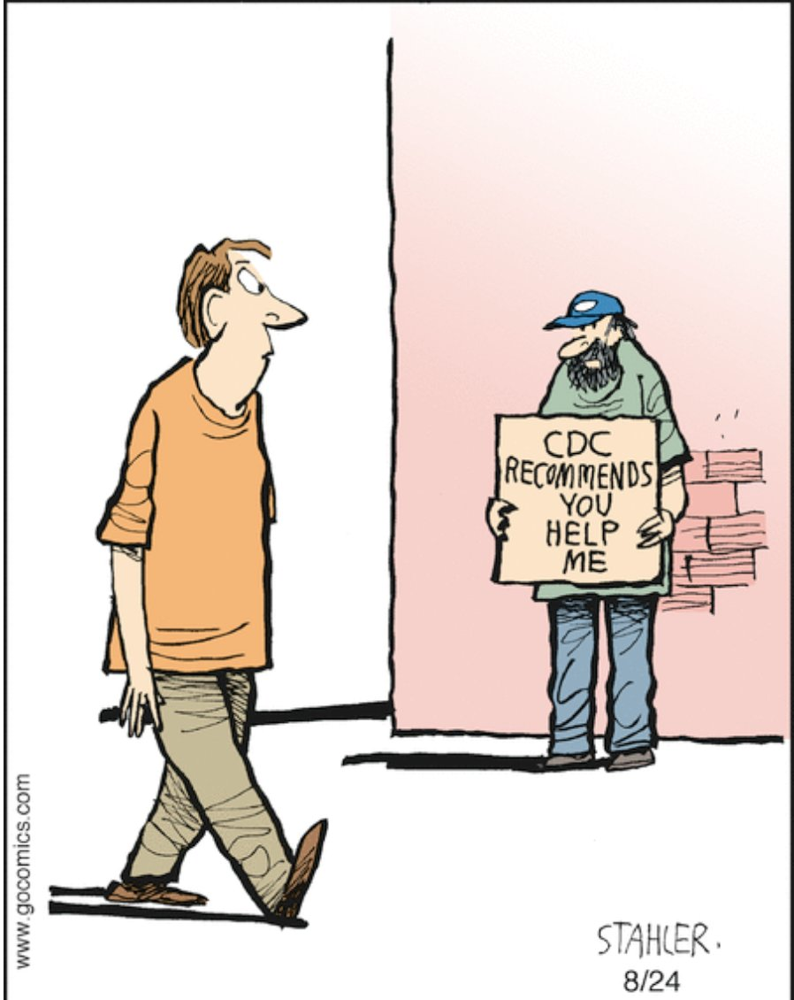</img></a>

---

<a href="https://twitter.com/erictopol/status/1430177332170477571" target="_blank" rel="noreferer">14:37 UCT</a>

The striking contrast of the Delta wave impact in the US compared with the UK
https://www.nytimes.com/interactive/2021/08/24/world/vaccines-seniors.html 

<a href="E9kCc2oXMAwl7_7.jpg"  >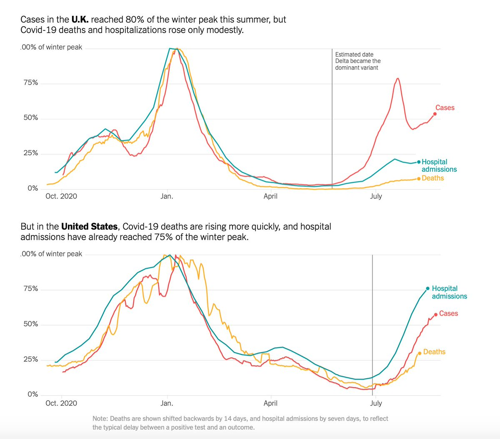</img></a>

---

<a href="https://twitter.com/erictopol/status/1430180291163918338" target="_blank" rel="noreferer">14:48 UCT</a>

The UK suppressed hospitalizations by 75%
The US has already reached 75% of its pandemic peak of hospitalizations

---

<a href="https://twitter.com/erictopol/status/1430181673384153098" target="_blank" rel="noreferer">14:54 UCT</a>

There's this today, too, by @LittleMoiz 

<a href="E9kGla2XMAELHIG.png"  >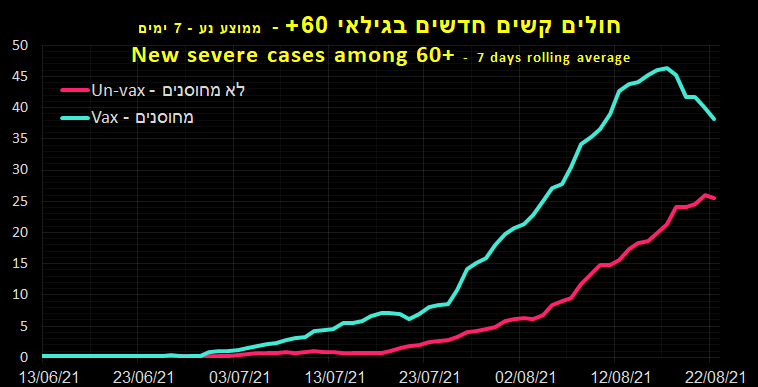</img></a>

---

<a href="https://twitter.com/erictopol/status/1430199339834478592" target="_blank" rel="noreferer">16:04 UCT</a>

With further evolution of Delta, there could be considerably more resistance to vaccines. 3 of 4 mutations (w/ Delta) studied here have already been seen @GISAID 
https://www.biorxiv.org/content/10.1101/2021.08.22.457114v1 the case for a Delta-specific vaccine 

<a href="E9kWjsjVcAUYbbn.jpg"  >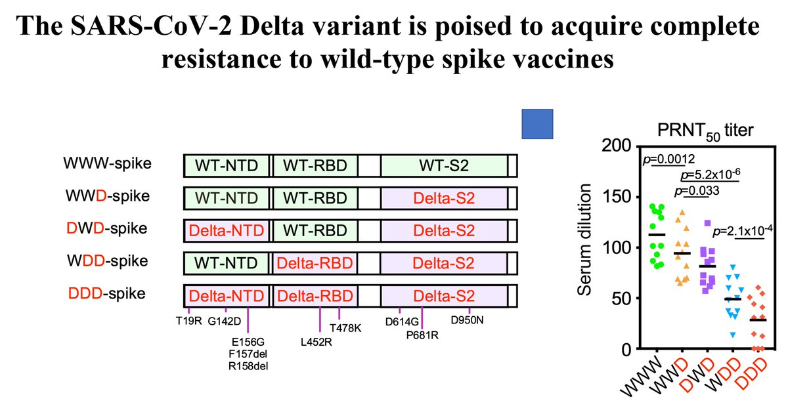</img></a>

---

<a href="https://twitter.com/erictopol/status/1430208810153504770" target="_blank" rel="noreferer">16:42 UCT</a>

6-month follow up of @BioNTech_Group/@Pfizer vaccination in a Kaiser Permanente cohort of  &gt;3.3 million: attrition of effectiveness over time vs infections, for Delta (-&gt; 53% at 4 months), yet high maintained protection vs hospitalizations (93%)
https://papers.ssrn.com/sol3/papers.cfm?abstract_id=3909743 

<a href="E9kd7RfVoAMQmzY.jpg"  >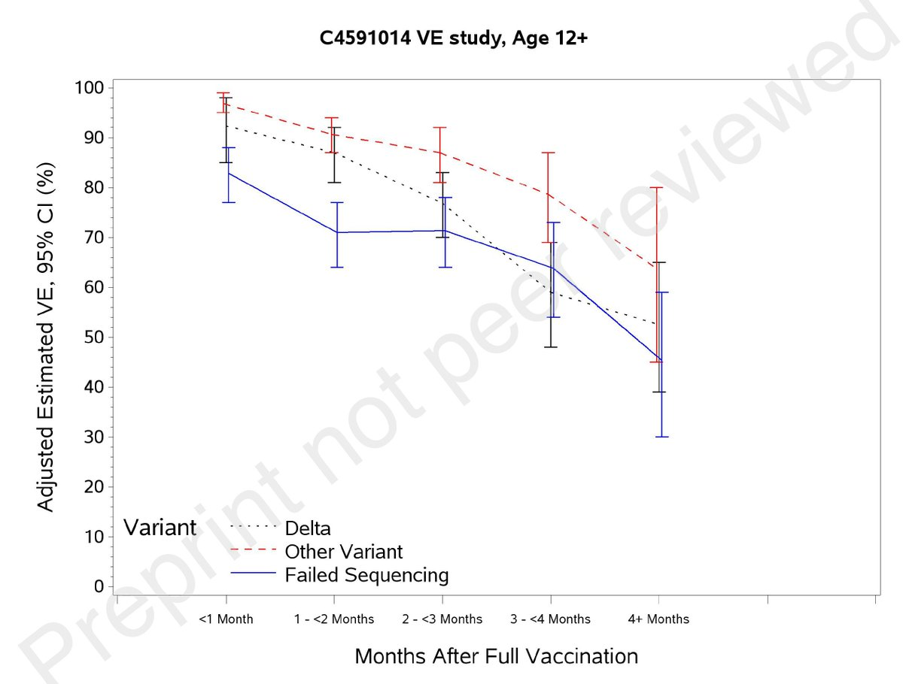</img></a><a href="E9kd8lmUUAQ53sB.jpg"  >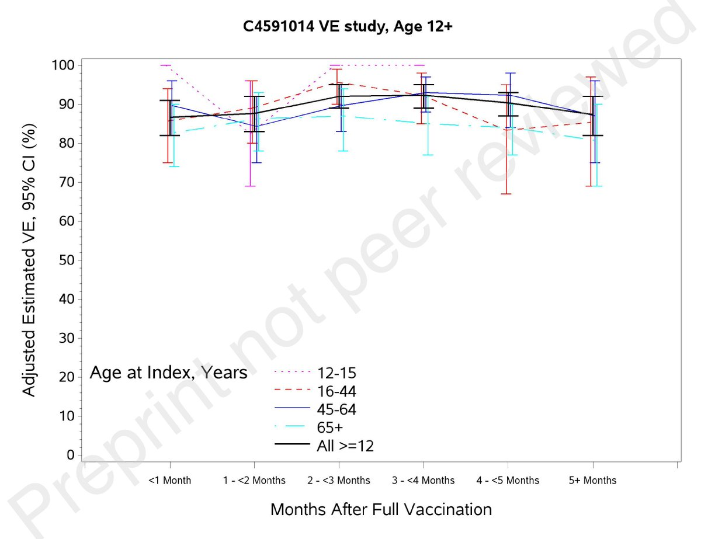</img></a>

---

<a href="https://twitter.com/erictopol/status/1430211589831946242" target="_blank" rel="noreferer">16:53 UCT</a>

The authors conclude "Reductions in effectiveness against SARS-CoV-2 infections over time are likely primarily due to waning rather than Delta escaping vaccine protection"
But we saw very little waning pre-Delta in 6-month follow-up of the large, randomized pivotal trial (91%)

---

<a href="https://twitter.com/erictopol/status/1430212931753443332" target="_blank" rel="noreferer">16:58 UCT</a>

Very good critique thread by @macroliter on this report
https://twitter.com/macroliter/status/1430182166294585352

---

<a href="https://twitter.com/erictopol/status/1430215410700357632" target="_blank" rel="noreferer">17:08 UCT</a>

Contrast w/ @Pfizer trial follow-up, pre-Delta
"VE against COVID-19 was 91% (95% CI 89.0-93.2) through up to 6 months of follow-up"
https://www.medrxiv.org/content/10.1101/2021.07.28.21261159v1
Hard to dissect the time vs Delta or their interaction that accounts for the VE decline, but appears Delta is playing a role 

<a href="E9kkxiSUcAIwcxf.jpg"  >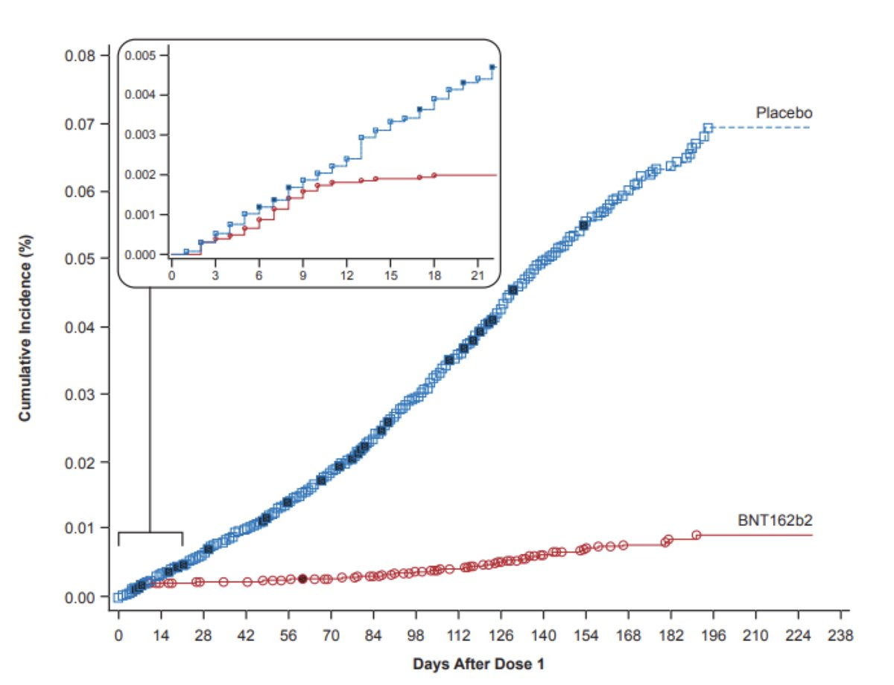</img></a>

---

<a href="https://twitter.com/erictopol/status/1430218080936886280" target="_blank" rel="noreferer">17:18 UCT</a>

The effect of time from vaccination and Delta in frontline health care workers, a new @CDCMMWR report 
Decline in effectiveness vs infections (any) from 91% to 66% (point estimates), pre to intra-Delta wave
https://www.cdc.gov/mmwr/volumes/70/wr/mm7034e4.htm?s_cid=mm7034e4_w 

<a href="E9knUPoVIAATvh6.jpg"  >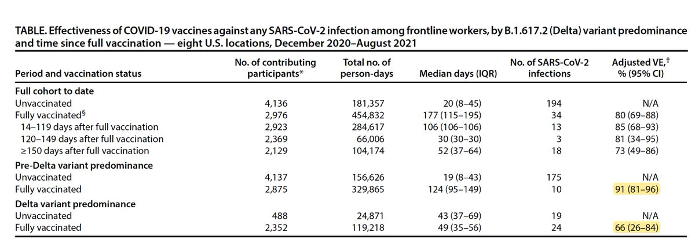</img></a>

---

<a href="https://twitter.com/erictopol/status/1430219266691780615" target="_blank" rel="noreferer">17:23 UCT</a>

65% Pfizer, 33% Moderna, 2% J&amp;J
Data not broken down by vaccine

75% of Delta infections were symptomatic among vaccinated, 95% among unvaccinated 

<a href="E9ko1e0VUAUq26s.png"  >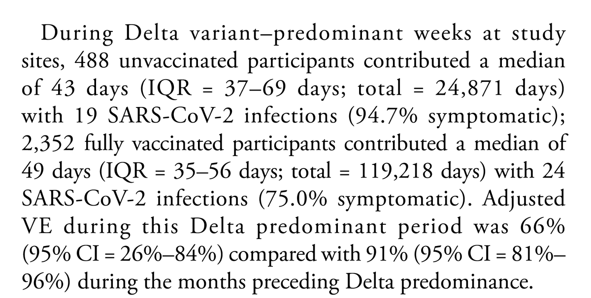</img></a>

---

<a href="https://twitter.com/erictopol/status/1430219726161018881" target="_blank" rel="noreferer">17:25 UCT</a>

RT @hankgreen: The Pfizer vaccine becomes significantly less effective at preventing infections of  COVID (especially the delta variant) ov…

---

<a href="https://twitter.com/erictopol/status/1430241779001925632" target="_blank" rel="noreferer">18:53 UCT</a>

A new study of neutralizing antibodies, memory B &amp; T cells after mRNA vaccination, with or without prior Covid.
Helps to explain dichotomy of infection susceptibility d/t waning of antibodies and preserved protection vs severe illness d/t memory B, T cells
https://www.biorxiv.org/content/10.1101/2021.08.23.457229v1 

<a href="E9k721GVgAUFVzK.jpg"  >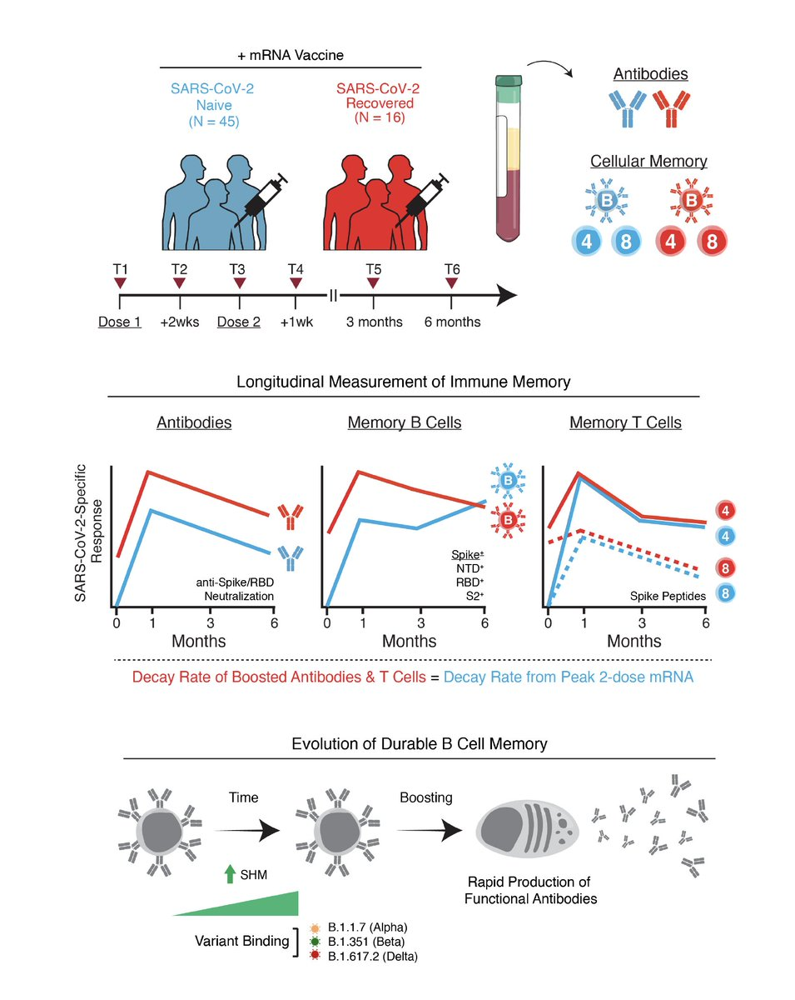</img></a>

---

<a href="https://twitter.com/erictopol/status/1430247342796464135" target="_blank" rel="noreferer">19:15 UCT</a>

These side-by-side graphs are quite helpful to show the differences in outcomes during Delta waves between the 3 countries, and particularly the UK's ability to suppress hospitalizations 

<a href="E9lCESTUYAEqv53.jpg"  >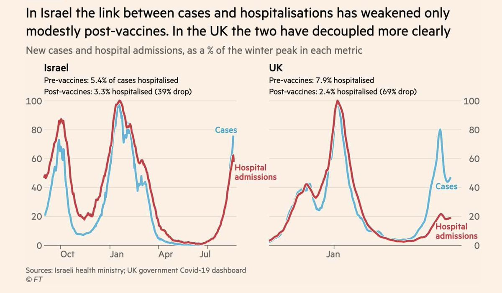</img></a><a href="E9lCMtdVEAMWNWn.jpg"  ></img></a>

---

<a href="https://twitter.com/erictopol/status/1430247340506451968" target="_blank" rel="noreferer">19:15 UCT</a>

The US Delta wave hospitalization curve is flattening, yet at a level that is 2X Israel, which is starting to descend, and 3X UK 

<a href="E9lA1p0VUAUcMqt.jpg"  >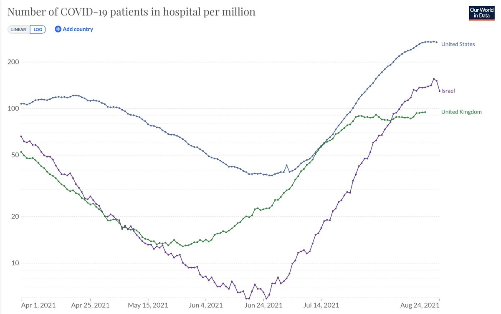</img></a>

---

<a href="https://twitter.com/erictopol/status/1430255659300265989" target="_blank" rel="noreferer">19:48 UCT</a>

The same pattern in LA County as seen in other US counties and states (no national data)
The Delta wave (and time from vaccination) associated with a rise in breakthroughs yet steady snd strong protection from hospitalizations, age-adjusted
https://www.cdc.gov/mmwr/volumes/70/wr/mm7034e5.htm?s_cid=mm7034e5_w @CDCMMWR 

<a href="E9lJ0feUcAAxKGO.jpg"  >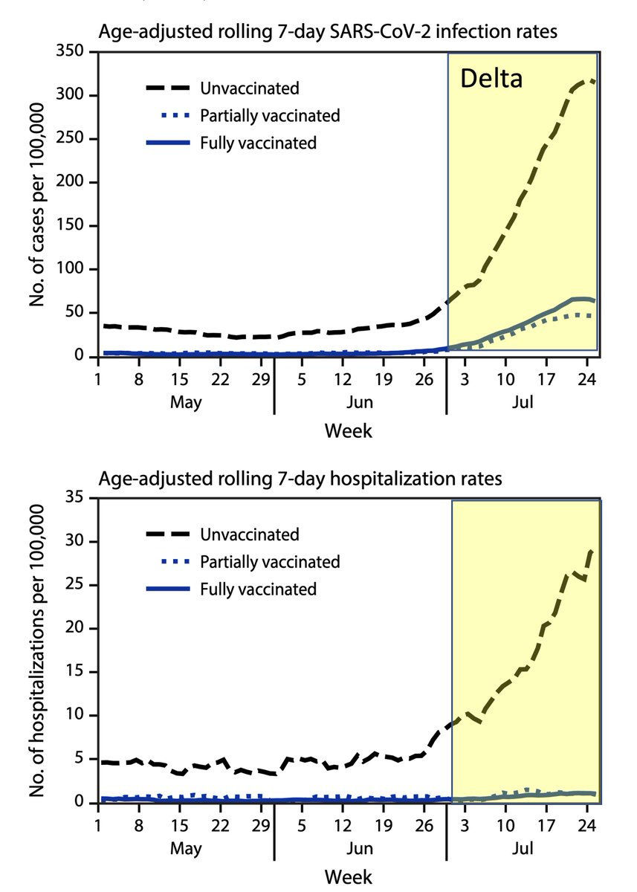</img></a>

---

<a href="https://twitter.com/erictopol/status/1430258765660508161" target="_blank" rel="noreferer">20:00 UCT</a>

@paulg I think multiple factors played a role: the much better vaccination rate in aged (vs US), the 8-12 week dose spacing, more mitigation measures, and more recent vaccination than Israel, whereby waning issues may yet surface

---

<a href="https://twitter.com/erictopol/status/1430295708737806336" target="_blank" rel="noreferer">22:27 UCT</a>

This is the right message, from the lead author @ashley_fowlkes 
https://www.nytimes.com/live/2021/08/24/world/covid-delta-variant-vaccine
Key points
1. Benefit of vaccination markedly increases w/ Delta, relative &amp; absolute, for both infections &amp; hospitalizations
2. Fully vaccinated ≠ fully protected. Use mitigation measures! 

<a href="E9ltRKPVkAEDcBD.png"  >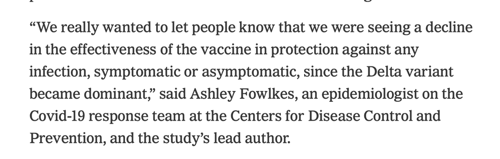</img></a>

---

<a href="https://twitter.com/erictopol/status/1430297511667798017" target="_blank" rel="noreferer">22:34 UCT</a>

@dlGgSyeTaGaiN @ashley_fowlkes And it's correct, does not contradict in any way. 
Breakthroughs rise.  The benefit of vaccination gradient grows. 

<a href="E9lv_jsVoAMvJXl.jpg"  >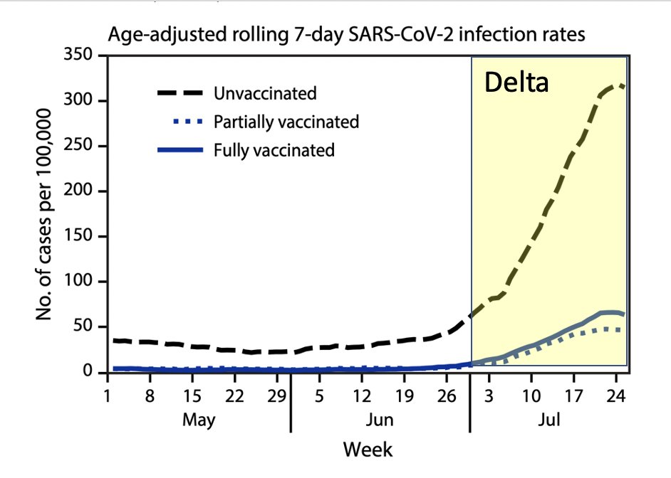</img></a>

---

<a href="https://twitter.com/erictopol/status/1430300129832030212" target="_blank" rel="noreferer">22:44 UCT</a>

New @TheLancet 
The most comprehensive global study of hypertension, &gt;100 million people, ~30 years, 184 countries
It has doubled in frequency and remains poorly controlled, untreated, and undiagnosed w/ much geographic variability
https://www.thelancet.com/journals/lancet/article/PIIS0140-6736(21)01330-1/fulltext 

<a href="E9lyJy6UYAMVYLF.jpg"  >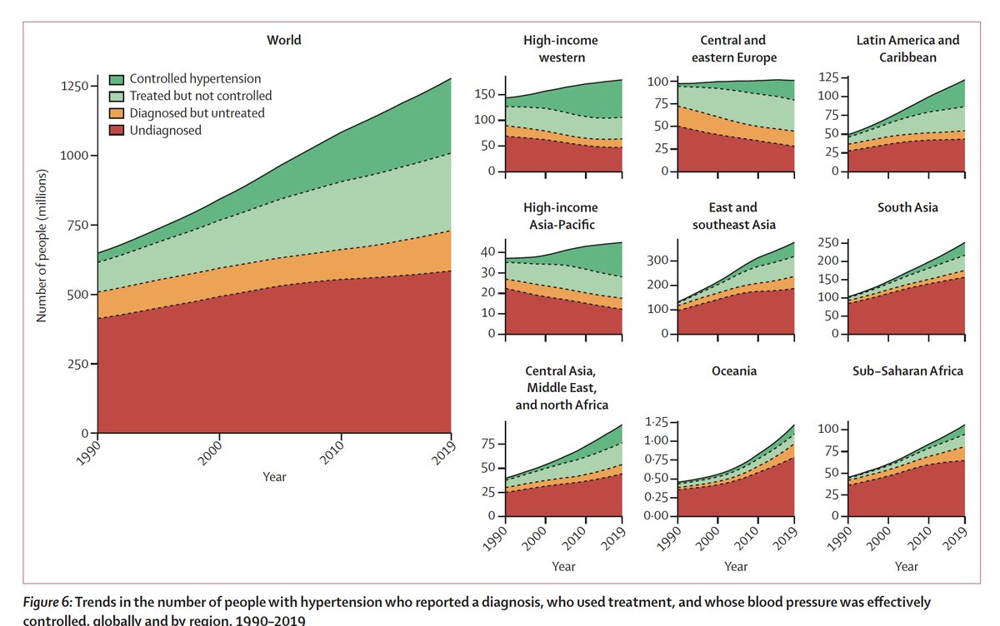</img></a>

---

<a href="https://twitter.com/erictopol/status/1430304450871062531" target="_blank" rel="noreferer">23:02 UCT</a>

@drjohnwhyte @CDCMMWR They did report symptomatic, as I put in the thread.

---

<a href="https://twitter.com/erictopol/status/1430308012103639045" target="_blank" rel="noreferer">23:16 UCT</a>

@ashley_fowlkes Since you are tweeting about Covid matters, I naturally thought you were the epidemiologist. Sorry for the mis-tag.

