+++
title = "Tweets by Eric Topol Aug 25"
Summary = ""
tags = ["Twitter"]
category = "Twitter"
+++

---

<a href="https://twitter.com/erictopol/status/1430339373938053125" target="_blank" rel="noreferer">01:20 UCT</a>

Sign of vaccine waning in new UK report among earliest vaccinees in ZOE COVID study of 1.2 million participants https://www.bbc.com/news/health-58322882 @bbchealth @timspector
Protection from infection:
Pfizer 88% -&gt; 74% at 4 months
AZ  77% -&gt; 67% at 3 months 

<a href="E9mUieGVEAEKe-t.jpg"  >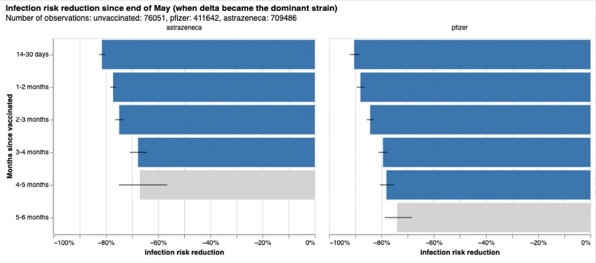</img></a><a href="E9mWAxWVoAIOjAQ.jpg"  >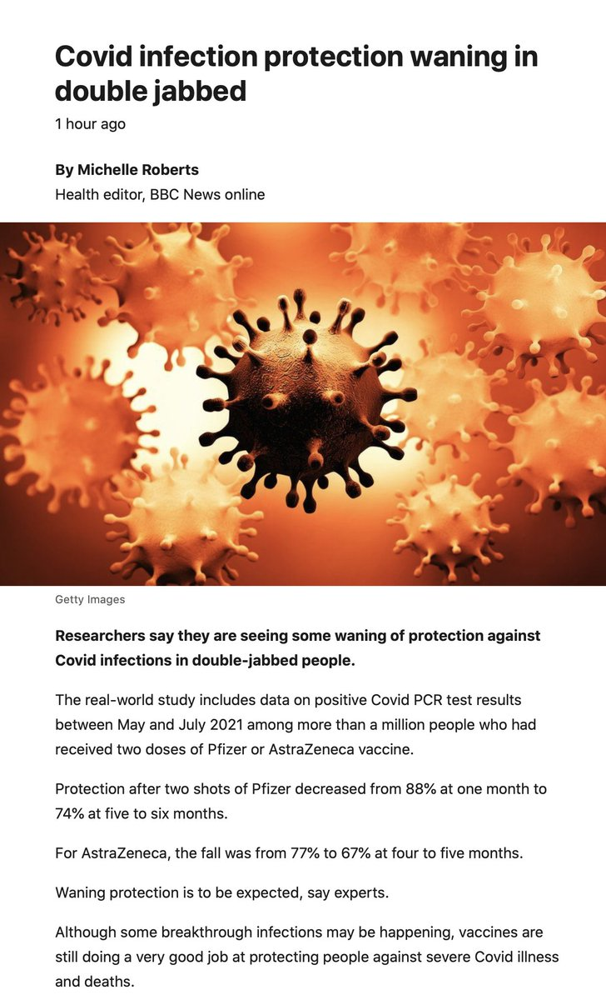</img></a>

---

<a href="https://twitter.com/erictopol/status/1430351141292810241" target="_blank" rel="noreferer">02:07 UCT</a>

@AArgoetti Any update on this important graph?

---

<a href="https://twitter.com/erictopol/status/1430362071535738884" target="_blank" rel="noreferer">02:51 UCT</a>

Top 5 covid cases/capita places (country or state) in the world, current, population &gt; 1M
1. Mississippi 118/100,000
2. Georgia (country) 116/100,000
3. Louisiana 100/100,000
4. Florida 99/100,000
5. Israel 91/100,000

---

<a href="https://twitter.com/erictopol/status/1430378121555955714" target="_blank" rel="noreferer">03:54 UCT</a>

In the vaccine era, I never thought this would be possible
Approaching 100,000 US hospitalizations
And the most ICU patients, &gt; 25,000, since the pandemic began here, per @BNODesk 
https://newsnodes.com/us
and that at least 85,000 of these were 💉💉fully preventable 

<a href="E9m4yUwUYAcVadt.jpg"  >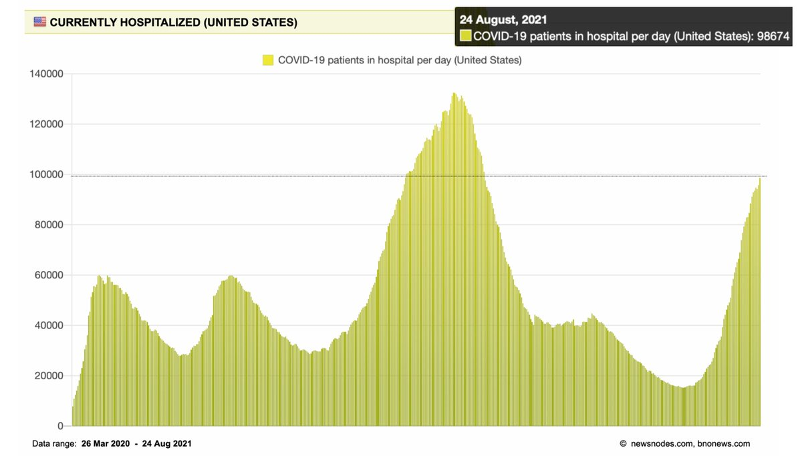</img></a>

---

<a href="https://twitter.com/erictopol/status/1430509891660120064" target="_blank" rel="noreferer">12:38 UCT</a>

Minimal data about 2nd dose if J&amp;J vaccine getting a lot of PR and attention, based on 17 participants antibody levels and unrelated to Delta infections. Where are the results from their 2-dose trial?
https://www.nytimes.com/live/2021/08/25/world/covid-delta-variant-vaccine#j-j-johnson-and-johnson-second-dose-booster-shot 

<a href="E9owkvvVkAA6oQT.png"  >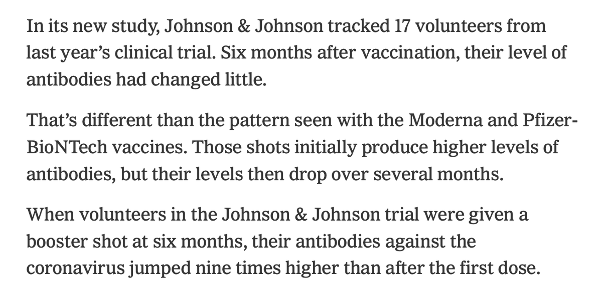</img></a>

---

<a href="https://twitter.com/erictopol/status/1430511512595025932" target="_blank" rel="noreferer">12:44 UCT</a>

And I love this one:"didn't specify exactly when or how many subjects received the second dose" 😉
https://www.wsj.com/articles/j-j-says-covid-19-booster-shots-after-eight-months-supported-by-data-11629888301?mod=hp_lead_pos1 

<a href="E9oyT6eVgAAOQrH.jpg"  >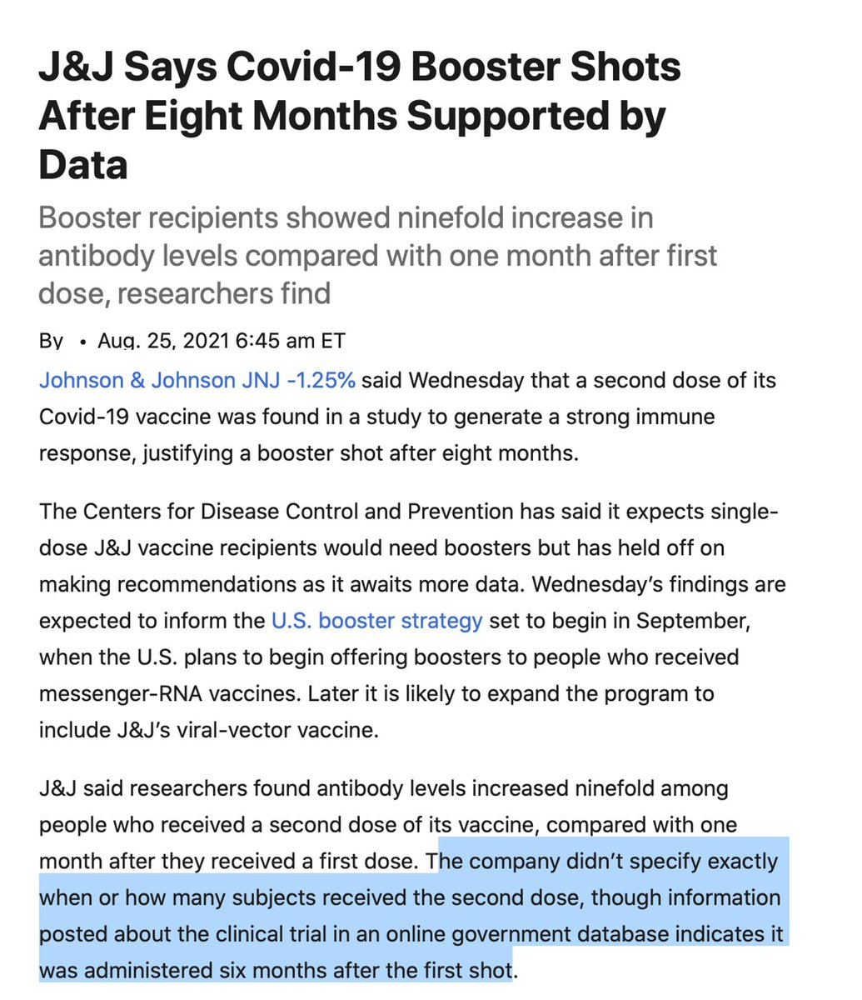</img></a>

---

<a href="https://twitter.com/erictopol/status/1430525915960811520" target="_blank" rel="noreferer">13:42 UCT</a>

A bright spot in Mississippi, the surprise #1
https://www.wsj.com/articles/ole-miss-college-football-vaccination-rates-lane-kiffin-11629775774?mod=searchresults_pos2&page=1 by @lainehiggins17 

<a href="E9o_TmAUYAAA9hH.jpg"  >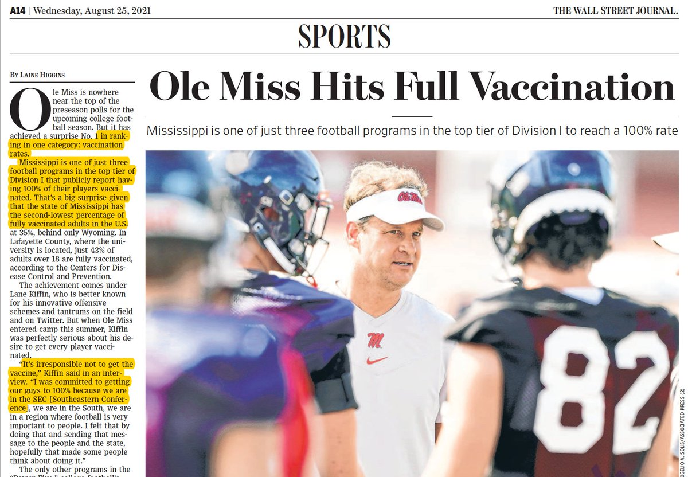</img></a>

---

<a href="https://twitter.com/erictopol/status/1430527260679806978" target="_blank" rel="noreferer">13:47 UCT</a>

Quite the headline
https://www.vanityfair.com/news/2021/08/kristi-noem-south-dakota-covid @VanityFair by @besslevin and it's not @TheOnion 

<a href="E9pA0qCVoAIeFUj.jpg"  ></img></a>

---

<a href="https://twitter.com/erictopol/status/1430532842212053001" target="_blank" rel="noreferer">14:09 UCT</a>

Breakthrough infections in Bahrain among over 1 million vaccinees, including Delta wave, comparison of 4 different vaccines and outcomes among unvaccinated https://www.researchsquare.com/article/rs-828021/v1
particular vulnerability of Sinopharm noted 
@DrSidMukherjee and colleagues 

<a href="E9pFuMrVEAYK9zb.jpg"  >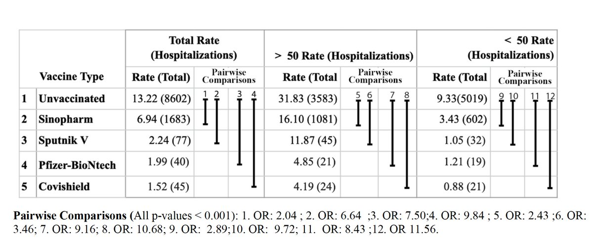</img></a>

---

<a href="https://twitter.com/erictopol/status/1430537146889211904" target="_blank" rel="noreferer">14:26 UCT</a>

RT @HelenBranswell: The mixed blessing of the 95% VE: When Pfizer &amp; Moderna reported late last year that their Covid vaccines were highly e…

---

<a href="https://twitter.com/erictopol/status/1430539661932302338" target="_blank" rel="noreferer">14:36 UCT</a>

@BobLu6 @DrSidMukherjee Thank you!

---

<a href="https://twitter.com/erictopol/status/1430541531455258632" target="_blank" rel="noreferer">14:44 UCT</a>

A very consistent pattern of vaccination protection and breakthroughs in the Delta wave
Here New York City, via @BobLu6 
1. Breakthrough (B) cases increase but so does the protection grow for vaccines
2. Modest rise in B hospitalizations but marked and increase protection by 💉💉 

<a href="E9pM9PFVUAcXGgJ.jpg"  >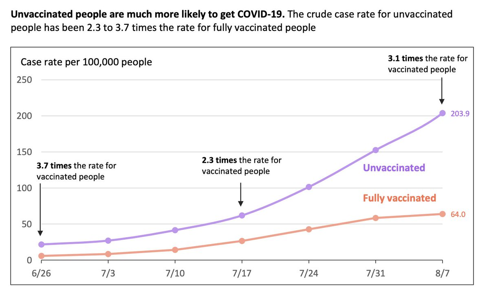</img></a><a href="E9pM-oHVkAM1r0p.jpg"  >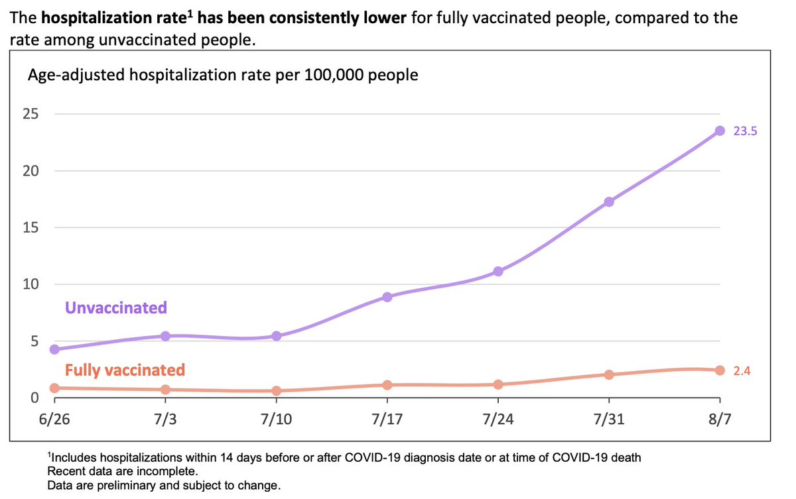</img></a>

---

<a href="https://twitter.com/erictopol/status/1430546308608061442" target="_blank" rel="noreferer">15:03 UCT</a>

As seen in Los Angeles County (largest in US) from CDC report yesterday and previous posts of San Diego Country, state of Oregon, and others
https://twitter.com/EricTopol/status/1430255659300265989

---

<a href="https://twitter.com/erictopol/status/1430549394542129159" target="_blank" rel="noreferer">15:15 UCT</a>

RT @michaelmina_lab: The continued message that breakthroughs are rare ultimately shoots us in the foot. They aren’t rare &amp; public is seein…

---

<a href="https://twitter.com/erictopol/status/1430561660696109062" target="_blank" rel="noreferer">16:04 UCT</a>

Unfortunately, we do not have any national data (as explained why, by @ErinBanco @Politico today ) https://twitter.com/ErinBanco/status/1430519352059731970 
And August will bring in more Delta infections than seen in July, but the overall outlook is the same
https://twitter.com/EricTopol/status/1427406564617379840

---

<a href="https://twitter.com/erictopol/status/1430564205892050945" target="_blank" rel="noreferer">16:14 UCT</a>

One of the most important advances in life science in many years. Accurately predicting 3D protein structure. #AI
https://twitter.com/erictopol/status/1415732633305190405?lang=en 

<a href="E9ph5hrUUAMOsyd.jpg"  >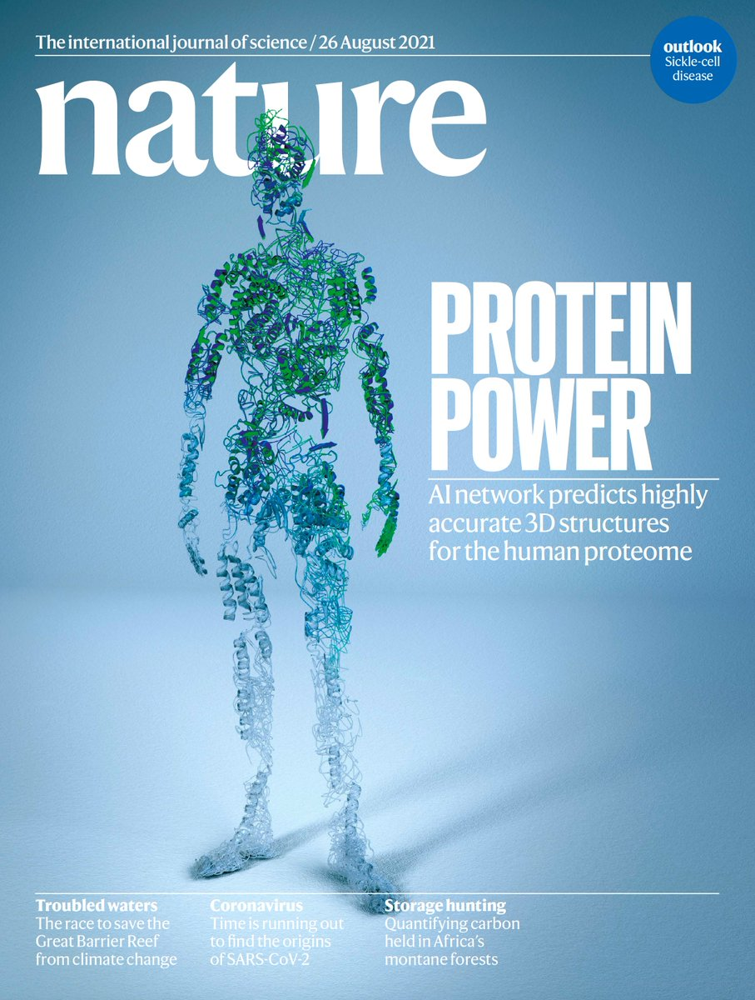</img></a><a href="E9ph-vJUcAk71We.jpg"  ></img></a>

---

<a href="https://twitter.com/erictopol/status/1430567401553207296" target="_blank" rel="noreferer">16:27 UCT</a>

Taking note of a &gt;20-fold less hospitalizations for Canada vs US in the Delta wave
@OurWorldInData 

<a href="E9plSmLVUAIgpgW.jpg"  >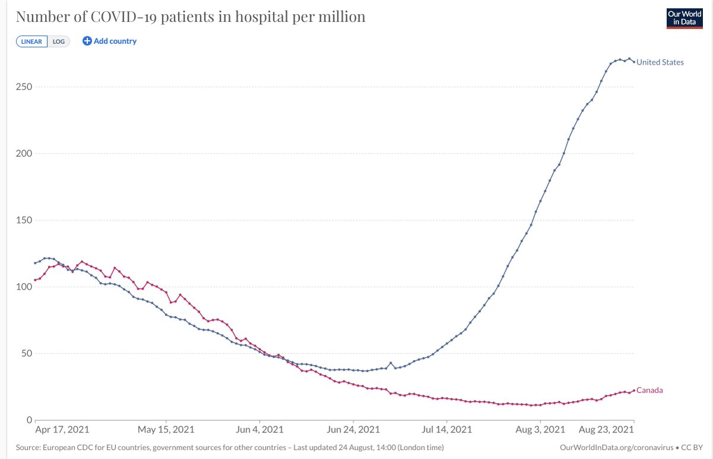</img></a>

---

<a href="https://twitter.com/erictopol/status/1430575586708058116" target="_blank" rel="noreferer">16:59 UCT</a>

From a global perspective, these comparative data from Bahrain are quite important. Sinopharm and Sputnik vaccines are used widely throughout the world, but little data on their effectiveness has been published to date, especially w/r to Delta (none).

---

<a href="https://twitter.com/erictopol/status/1430581936246775809" target="_blank" rel="noreferer">17:24 UCT</a>

With the @Pfizer/@BioNTech_Group vaccine, significantly higher levels of receptor binding domain antibodies induced with the 8-12 week dose spacing compared with 3-6 weeks
https://assets.researchsquare.com/files/rs-793234/v1/2615242f-5371-4194-9ae8-b318aa7ea59c.pdf?c=1629821723 

<a href="E9pyUZgVIAQ55SY.jpg"  >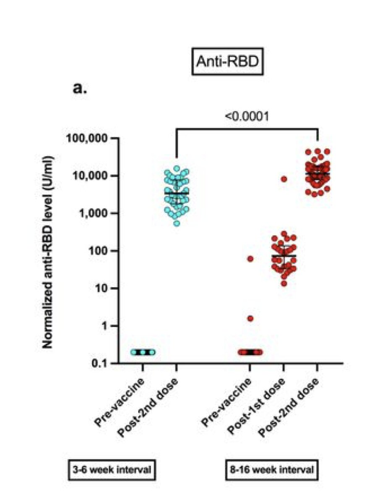</img></a>

---

<a href="https://twitter.com/erictopol/status/1430583737167740929" target="_blank" rel="noreferer">17:31 UCT</a>

The largest healthcare company in the world makes headlines everywhere for a "9-fold antibody response" in 17 people. Incredible. Is that the best you can offer @JNJNews? 

<a href="E9p0I4mUUAYR36R.jpg"  >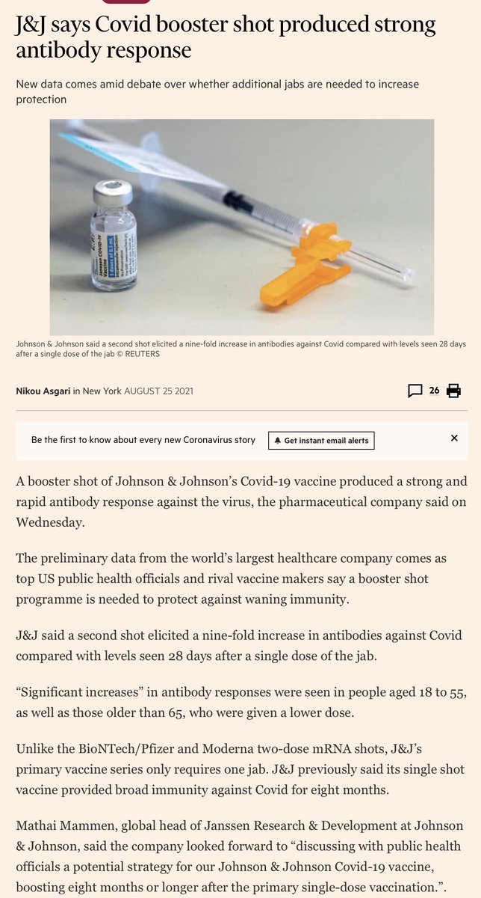</img></a><a href="E9p0KRTUYAIDx5y.jpg"  >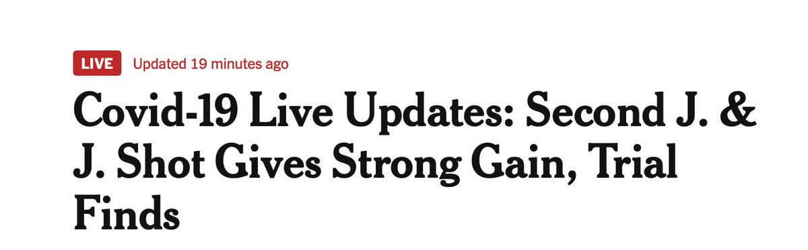</img></a><a href="E9p0LtzUUAII57m.jpg"  >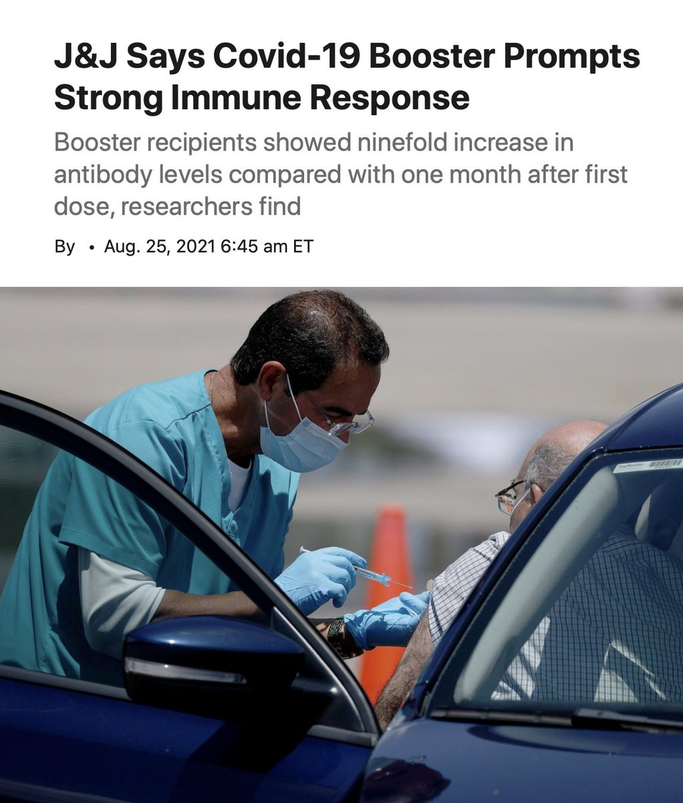</img></a>

---

<a href="https://twitter.com/erictopol/status/1430595189526065152" target="_blank" rel="noreferer">18:17 UCT</a>

In Israel's Delta wave, a comparison of natural infection immunity versus 2-dose Pfizer mRNA vaccination for reinfection or breakthrough infections, respectively.
https://www.medrxiv.org/content/10.1101/2021.08.24.21262415v1

---

<a href="https://twitter.com/erictopol/status/1430595888552890369" target="_blank" rel="noreferer">18:20 UCT</a>

@Laurie_Garrett @Bob_Wachter But that admixes pre-Delta with Delta, which are very different
Better way to show the data
https://twitter.com/EricTopol/status/1430541531455258632

---

<a href="https://twitter.com/erictopol/status/1430621957226074113" target="_blank" rel="noreferer">20:03 UCT</a>

There are issues interpreting this study, but one support point for their findings is the steadiness of levels of antibodies for natural infection vs post-vaccination waning, as noted recently, that may be particularly important regarding Delta
https://twitter.com/EricTopol/status/1429470022347362304

---

<a href="https://twitter.com/erictopol/status/1430622940333101056" target="_blank" rel="noreferer">20:07 UCT</a>

Waning of immunity becomes manifest at 5-6 months, not 8 months, so this at least aligns with the data
https://www.wsj.com/articles/biden-administration-plans-covid-19-vaccine-boosters-at-six-months-instead-of-eight-11629919356?mod=djemalertNEWS 

<a href="E9qX2cwVEAAH1v7.jpg"  >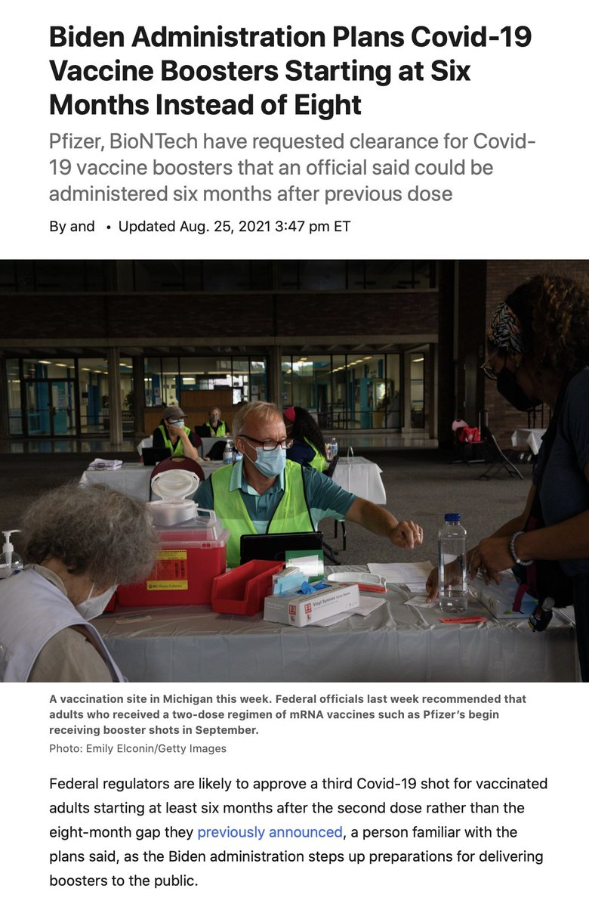</img></a>

---

<a href="https://twitter.com/erictopol/status/1430636357626466307" target="_blank" rel="noreferer">21:01 UCT</a>

Just out @NEJM 
Important large study of Pfizer mRNA vaccination (&gt;884,000 people and controls)  vs Covid infection (&gt;173,000 people and controls) provides clear evidence of safety for 💉side-effects, and compared w/ Covid
https://www.nejm.org/?query=featured_home&doi=10.1056%2FNEJMoa2110475 

<a href="E9qjqYVVEAEerqn.jpg"  >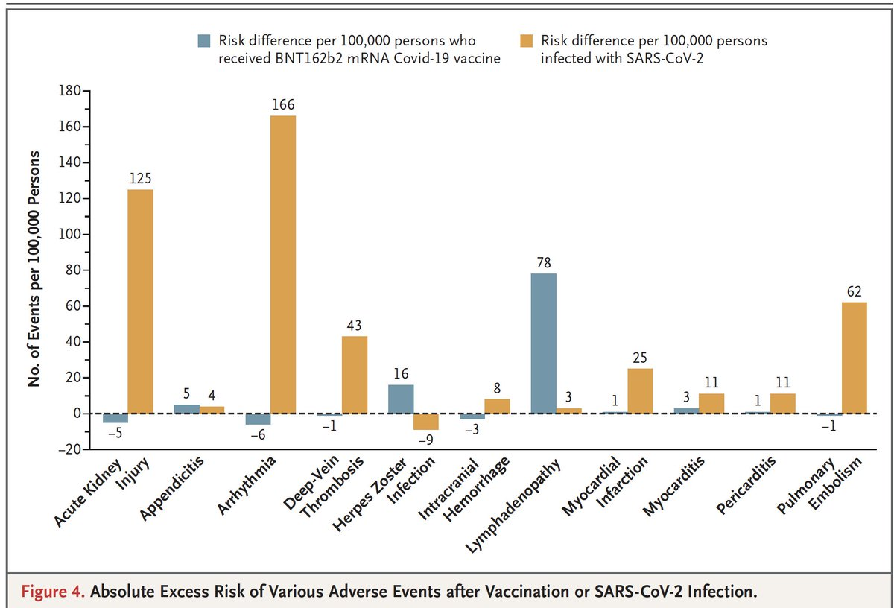</img></a>

---

<a href="https://twitter.com/erictopol/status/1430637672440029185" target="_blank" rel="noreferer">21:06 UCT</a>

The differences in risk ratios
Vaccines increased lymph node enlargement (as expected), myocarditis (but much than Covid); small increase for Herpes Zoster infection, appendicitis
 
Covid increased the risk for kidney injury, stroke, myocarditis, arrhythmia, heart attack, DVT, PE 

<a href="E9qkUwBUUAEfAMr.jpg"  >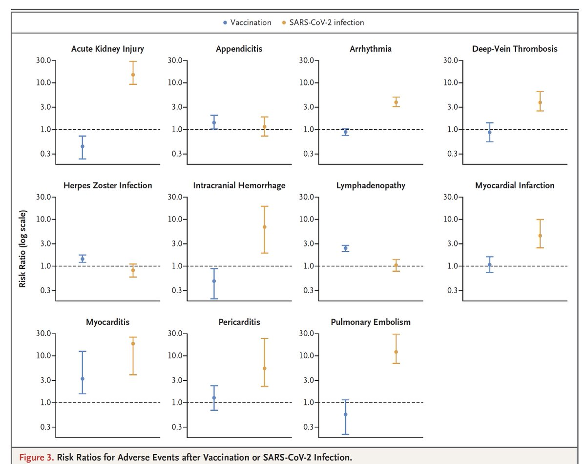</img></a>

---

<a href="https://twitter.com/erictopol/status/1430640946111082498" target="_blank" rel="noreferer">21:19 UCT</a>

I really enjoyed this thought-provoking discussion with @MSFreePress's @nickjudin about the situation in Mississippi, Delta, and where we go from here https://twitter.com/nickjudin/status/1430578477116313607

---

<a href="https://twitter.com/erictopol/status/1430653035873669122" target="_blank" rel="noreferer">22:07 UCT</a>

Getting data out of @Pfizer on the booster shot effect is not helping matters.
The 1st time they presented data was in their earnings report, 23 people, yet unpublished (below)
Today, 306 people: antibodies "jumped more than 3 times higher than the level after the second dose" 

<a href="E9qytIUVkAIOwBn.jpg"  >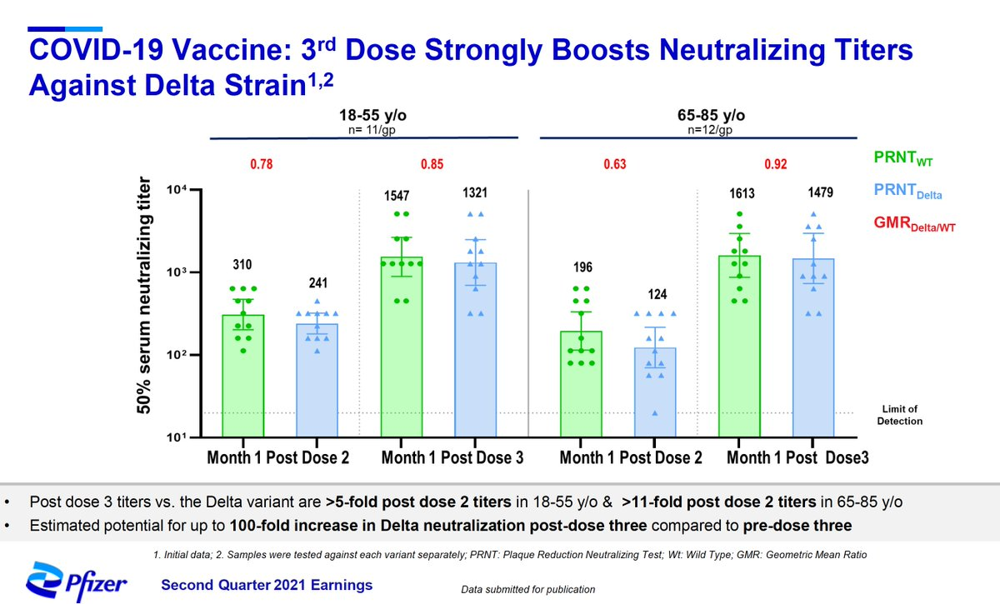</img></a><a href="E9qyuryVIAAU0Wt.png"  >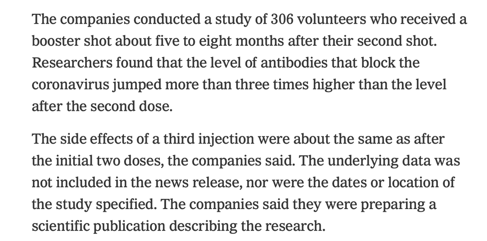</img></a>

---

<a href="https://twitter.com/erictopol/status/1430656990569590786" target="_blank" rel="noreferer">22:23 UCT</a>

The politicization of vaccination is a/the major factor responsible for where we are now in the US pandemic
New results of @YouGov @TheEconomist poll, h/t @gelliottmorris 

<a href="E9q25NLVUAIbKZJ.jpg"  >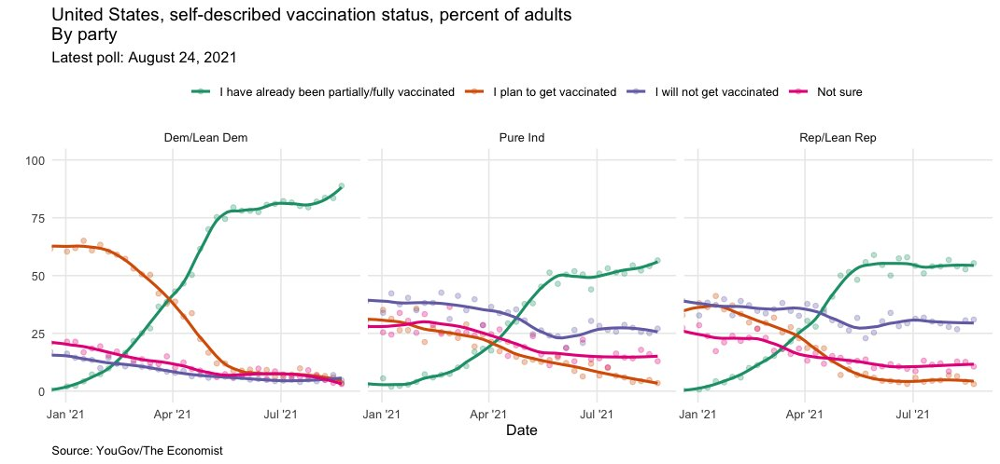</img></a>