+++
title = "Tweets by Eric Topol Aug 26"
Summary = ""
tags = ["Twitter"]
category = "Twitter"
+++

---

<a href="https://twitter.com/erictopol/status/1430707848044892166" target="_blank" rel="noreferer">01:45 UCT</a>

This isn't going to help a US turnaround.
Texas, our 2nd most populous state, is nearing its pandemic high in hospitalizations with &gt;14% test positivity, and only modest signs of slowing spread. 

<a href="E9rkJodUcAEk8Xd.jpg"  >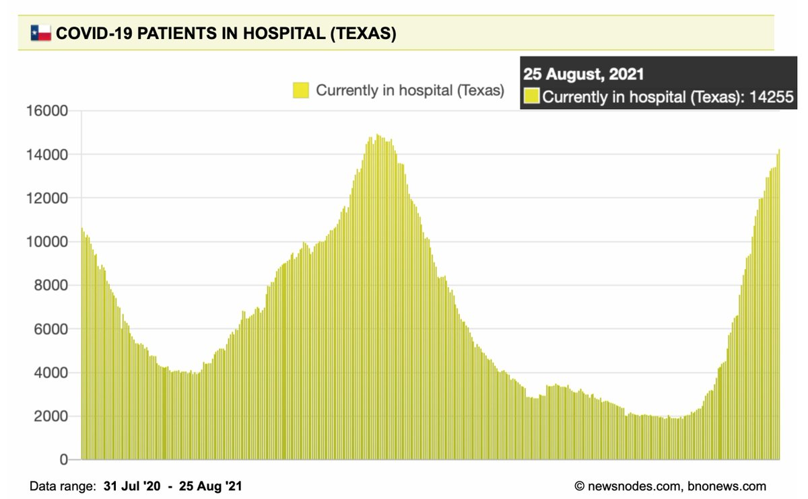</img></a><a href="E9rk7P6VUAUzb0y.jpg"  >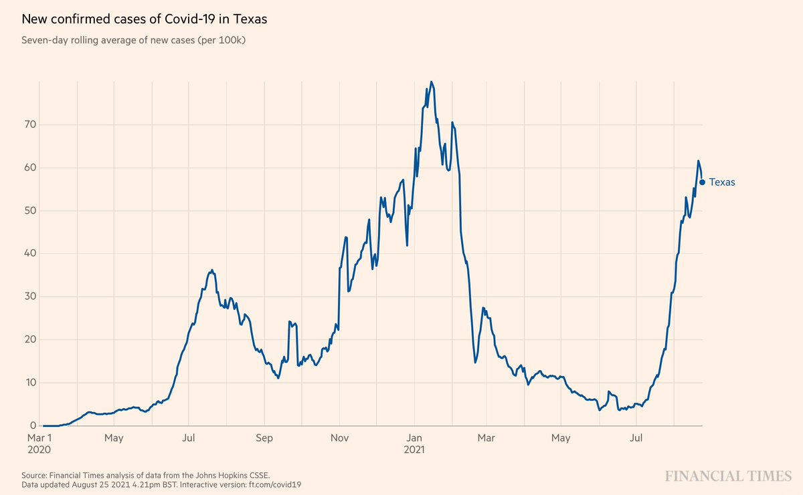</img></a>

---

<a href="https://twitter.com/erictopol/status/1430715978162130946" target="_blank" rel="noreferer">02:17 UCT</a>

In the land of a surfeit of free vaccines, this is the dark day when we crossed the line of over 100,000 hospitalizations, more than 25,000 patients in the ICU (highest for the pandemic), over 1300 deaths, and over 186,000 new cases. 

<a href="E9rsIBkVcAA8Jj2.jpg"  >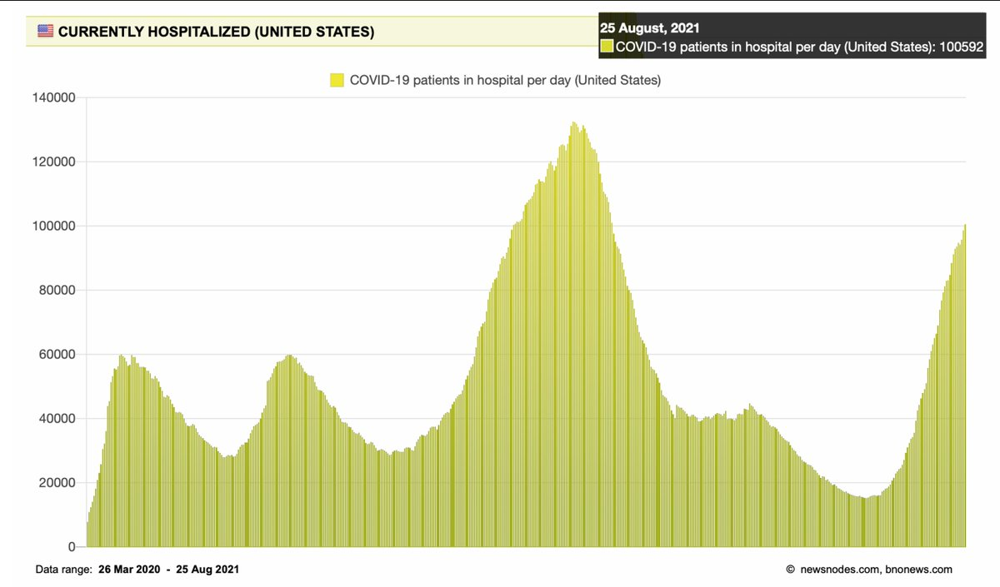</img></a>

---

<a href="https://twitter.com/erictopol/status/1430733625046171650" target="_blank" rel="noreferer">03:27 UCT</a>

@williams_paige @nickjudin Many thanks!

---

<a href="https://twitter.com/erictopol/status/1430746257153138698" target="_blank" rel="noreferer">04:17 UCT</a>

@CarlosdelRio7 @RealTimeCOVID19 @profshanecrotty It should be; it should have been done many months ago!

---

<a href="https://twitter.com/erictopol/status/1430748303252103174" target="_blank" rel="noreferer">04:25 UCT</a>

How to manage a Delta wave?
Iceland. 78% total population fully vaccinated.
A+ 

<a href="E9sJB17UYAAeQMs.jpg"  >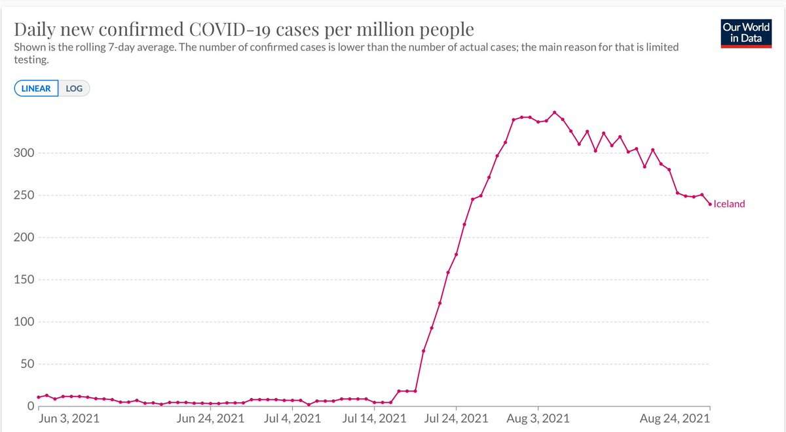</img></a><a href="E9sJDNVVEAsEbEZ.jpg"  >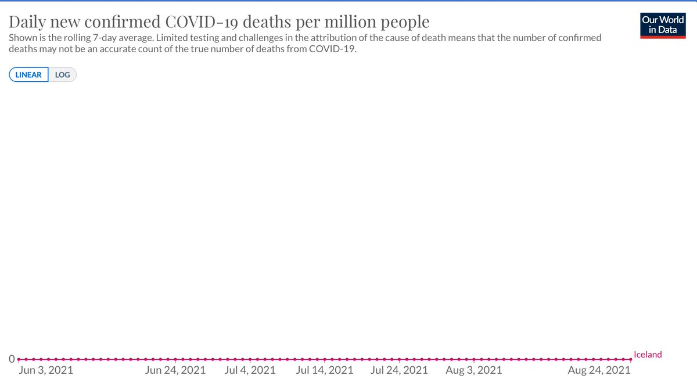</img></a>

---

<a href="https://twitter.com/erictopol/status/1430750810795696130" target="_blank" rel="noreferer">04:35 UCT</a>

@FayCortez Big difference in vaccination for Iceland vs Israel. And yes, other factors in play.

---

<a href="https://twitter.com/erictopol/status/1430752640506363905" target="_blank" rel="noreferer">04:43 UCT</a>

@Infoseepage OK. I checked OurWorldinData and FT sites for the 77% (81% with at least 1 dose) so not clear why there’s a difference. Thanks. And your point about not protecting the aged is of course critical.

---

<a href="https://twitter.com/erictopol/status/1430887998548156418" target="_blank" rel="noreferer">13:40 UCT</a>

Singapore, the highest fully vaccinated country in the world, with 8.8 million people, crushed its Delta wave,
@OurWorldInData 

<a href="E9uIE5CUUAs0Py9.jpg"  >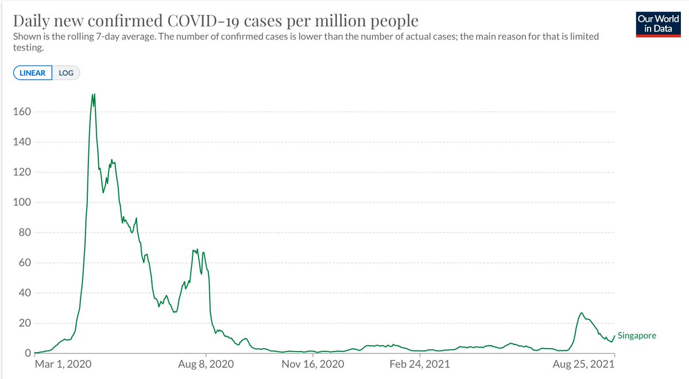</img></a><a href="E9uIu8OVUAkA-IW.jpg"  >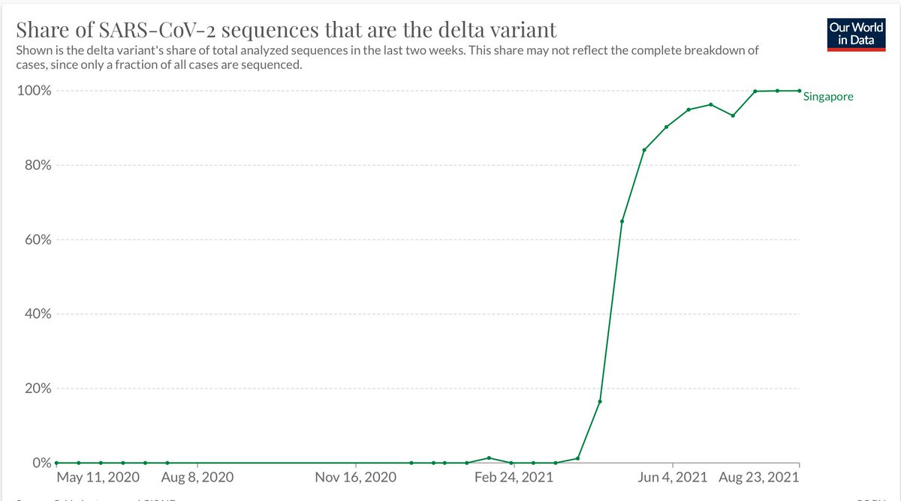</img></a>

---

<a href="https://twitter.com/erictopol/status/1430889648180535302" target="_blank" rel="noreferer">13:47 UCT</a>

There is a mask mandate plus free medical grade and N95 masks https://www.straitstimes.com/singapore/health/free-masks-out-of-stock-by-noon-at-some-locations-temasek-foundation-says 

<a href="E9uKTq5UcAEzC5M.jpg"  >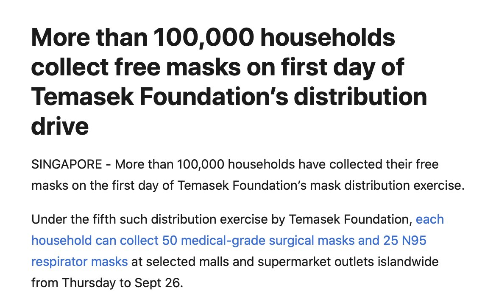</img></a>

---

<a href="https://twitter.com/erictopol/status/1430890654708617221" target="_blank" rel="noreferer">13:51 UCT</a>

Sorry, error 8.8 million vaccine doses, 5.9 million people

---

<a href="https://twitter.com/erictopol/status/1430909841237712904" target="_blank" rel="noreferer">15:07 UCT</a>

Just published @Nature 
By the end of 2020, 31% of Americans had Covid.
Some parts of the US (e.g. Dakotas) &gt; 60%; LA 52%
In-depth analysis of all 3,142 counties
@SenPei_CU @ColumbiaMSPH and colleagues
https://www.nature.com/articles/s41586-021-03914-4 

<a href="E9ua7nLVIAEsh66.jpg"  >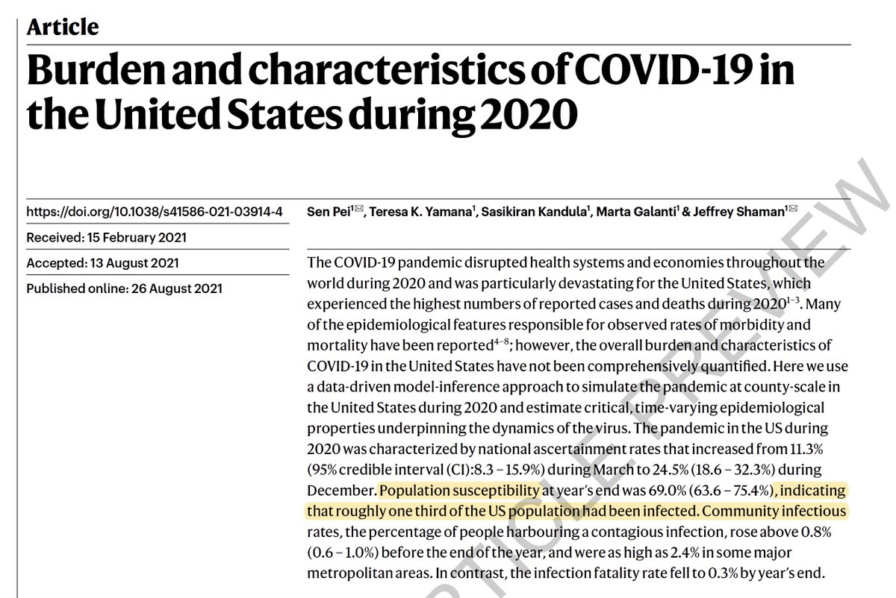</img></a>

---

<a href="https://twitter.com/erictopol/status/1430928655379615746" target="_blank" rel="noreferer">16:22 UCT</a>

Both 99% Delta, 15-fold difference in deaths
[not just % vaccinated (59% vs 51%) but who (advanced age %), how (spacing, mixing) and mitigation measures] 

<a href="E9utptMVoAo88GC.jpg"  >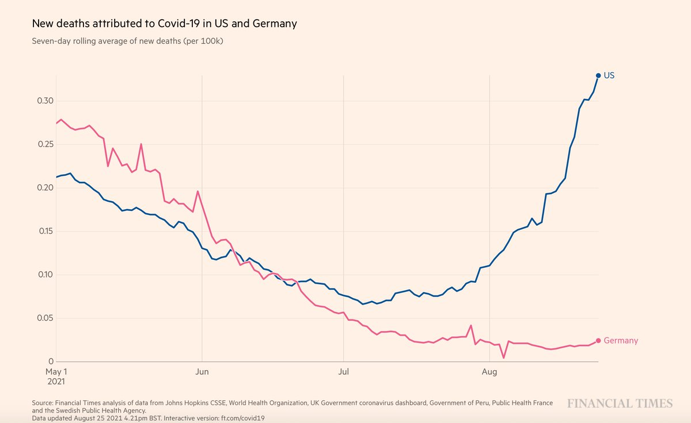</img></a>

---

<a href="https://twitter.com/erictopol/status/1430930985344897032" target="_blank" rel="noreferer">16:31 UCT</a>

Hello @LeaderMcConnell 

<a href="E9uwFWPUcAEg1D2.jpg"  >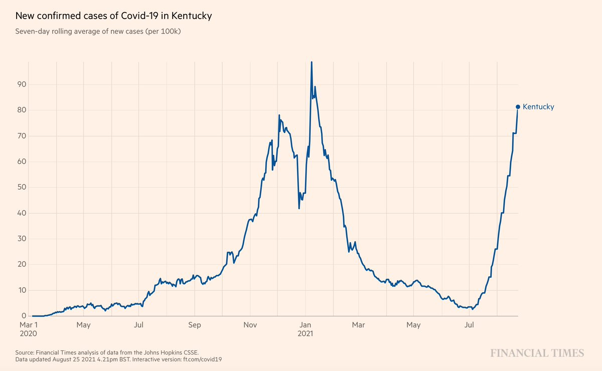</img></a>

---

<a href="https://twitter.com/erictopol/status/1430935398662828032" target="_blank" rel="noreferer">16:49 UCT</a>

This report is certainly controversial. 2 good threads discussing issues of interpretation
@aricaroline 
https://twitter.com/aricaroline/status/1430902716922880020
@andrew_croxford 
https://twitter.com/andrew_croxford/status/1430799815693250562

---

<a href="https://twitter.com/erictopol/status/1430945112599646215" target="_blank" rel="noreferer">17:27 UCT</a>

Several weeks ago it seemed there was a pattern of fairly rapid ascent and descent.
Now it's different, the challenge of returning to baseline after a Delta wave
@OurWorldInData 

<a href="E9u8NNBVkAIt8N7.jpg"  >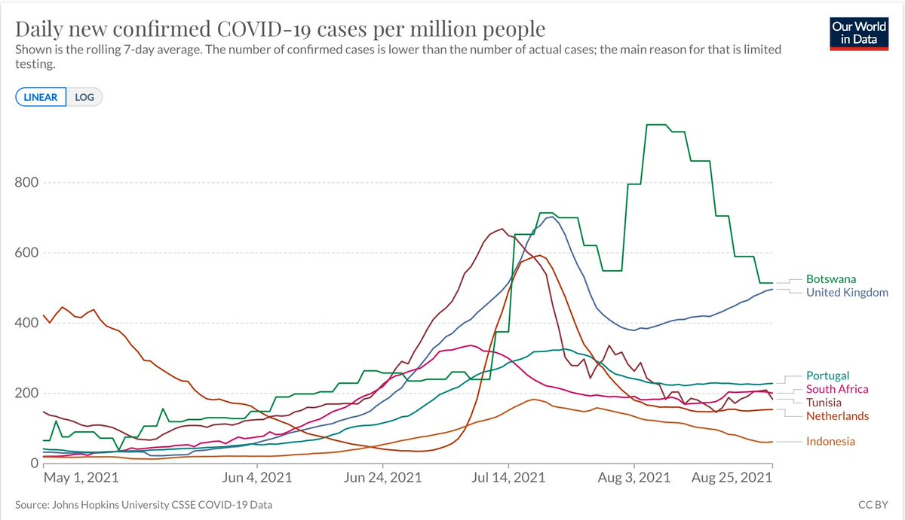</img></a>

---

<a href="https://twitter.com/erictopol/status/1430946141265223683" target="_blank" rel="noreferer">17:32 UCT</a>

RT @johnkrafcik: @EricTopol We've been in Germany for several weeks this summer. They mask rigorously and in most areas specific N95-level…

---

<a href="https://twitter.com/erictopol/status/1430955956305760258" target="_blank" rel="noreferer">18:11 UCT</a>

Just published @ScienceMagazine  
A phenomenal, tour de force review of aerosol transmission of respiratory viruses, from the experts. #COVIDisAirborne 
 http://science.sciencemag.org/content/373/6558/eabd9149.full w/ @ScienceVisuals 

<a href="E9vBT1WVoAA3kXS.jpg"  >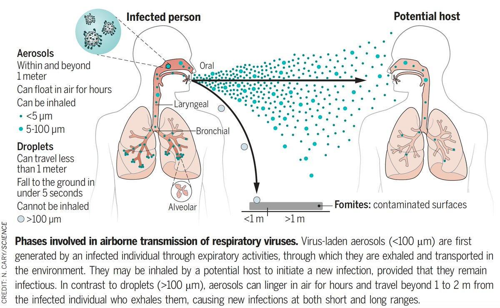</img></a><a href="E9vBV9NVcAI8IP4.jpg"  >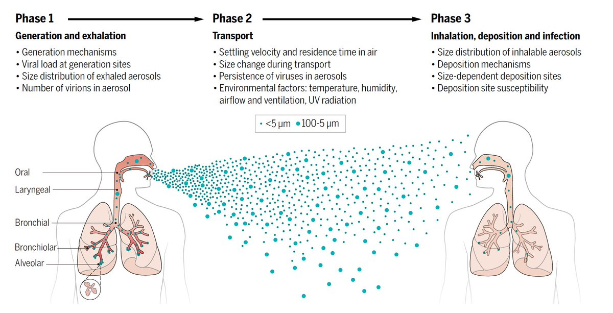</img></a><a href="E9vBXpbVUAMfObb.jpg"  >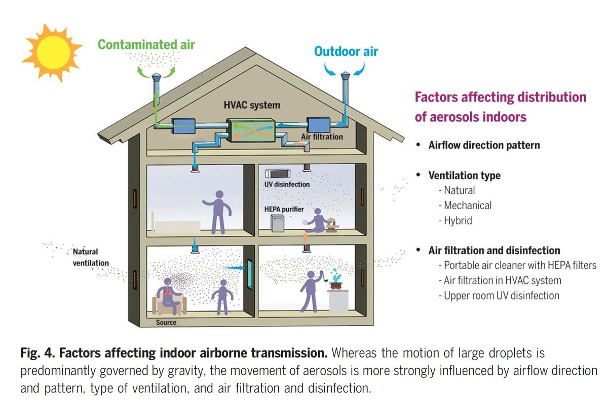</img></a><a href="E9vBZWjVoAQmJ0H.jpg"  >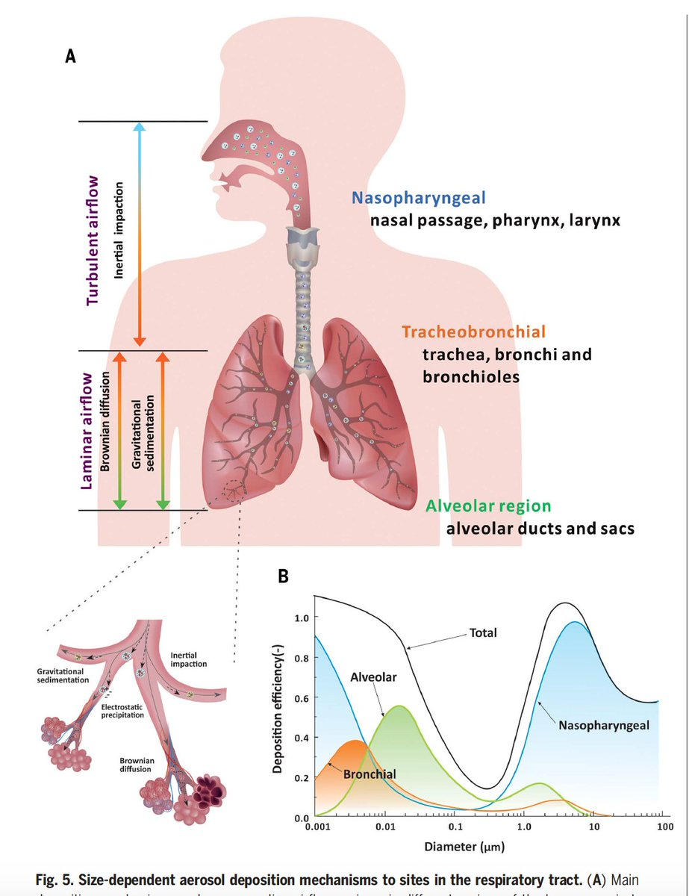</img></a>

---

<a href="https://twitter.com/erictopol/status/1430962537911123970" target="_blank" rel="noreferer">18:37 UCT</a>

It's ★★★★★ on a 4-scale 

<a href="E9vLxL6UUAEJv9u.jpg"  >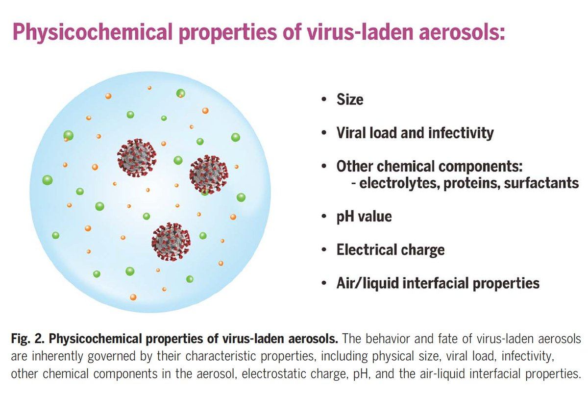</img></a><a href="E9vMRXHVoAELoyA.png"  >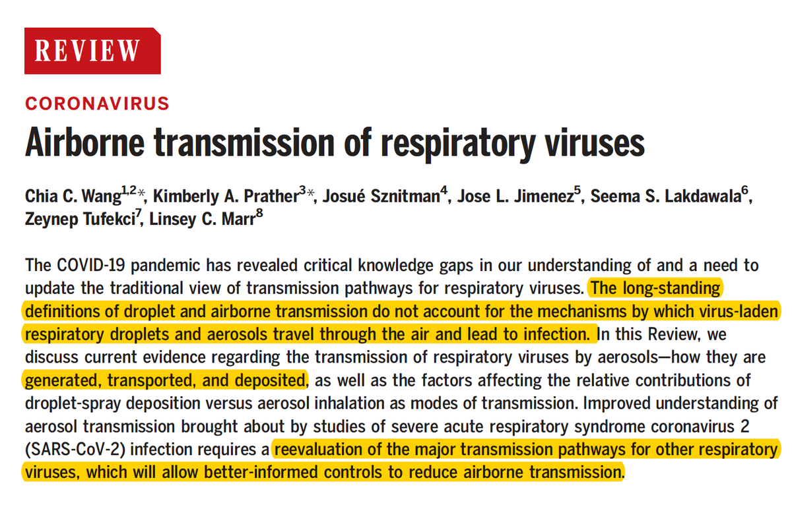</img></a><a href="E9vMTFVUYAABmIQ.jpg"  >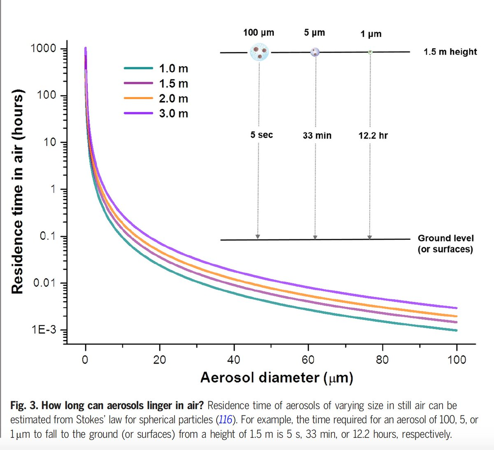</img></a><a href="E9vMUuuVIAERbVg.png"  >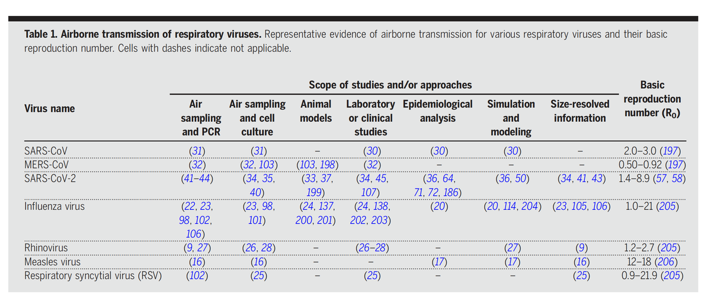</img></a>

---

<a href="https://twitter.com/erictopol/status/1430979888643678208" target="_blank" rel="noreferer">19:46 UCT</a>

New data from J&amp;J vaccine to show durable, stable levels of neutralizing antibodies after single dose out to 8-9 months, and booster effect (at 6 months) with a 2nd dose with the 9-fold increase (widely reported in press release, media yesterday)
https://www.medrxiv.org/content/10.1101/2021.08.25.21262569v1 

<a href="E9vZmuJVoAIsXYA.jpg"  >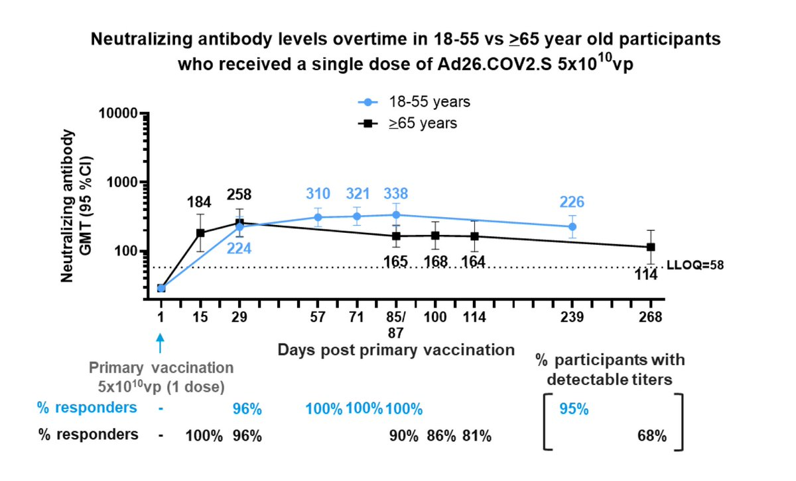</img></a><a href="E9vZsZ-VgAAtoTV.jpg"  >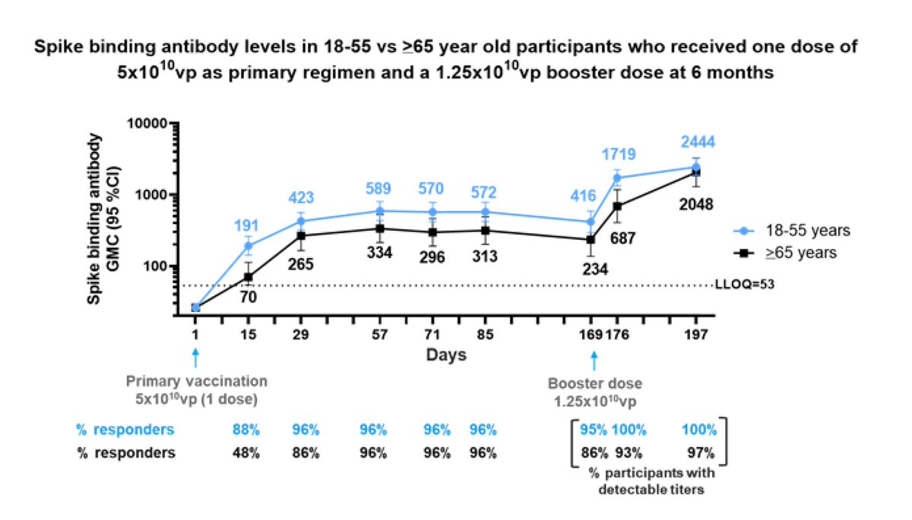</img></a>

---

<a href="https://twitter.com/erictopol/status/1430995627115106306" target="_blank" rel="noreferer">20:48 UCT</a>

Colleges and universities must require vaccination. With full FDA approval, only 753 of ~4000 have done so thus far. It shouldn't require the struggle as reviewed here
http://science.sciencemag.org/content/373/6558/945
@ScienceMagazine 

<a href="E9vqqpZUUAMdA7B.jpg"  >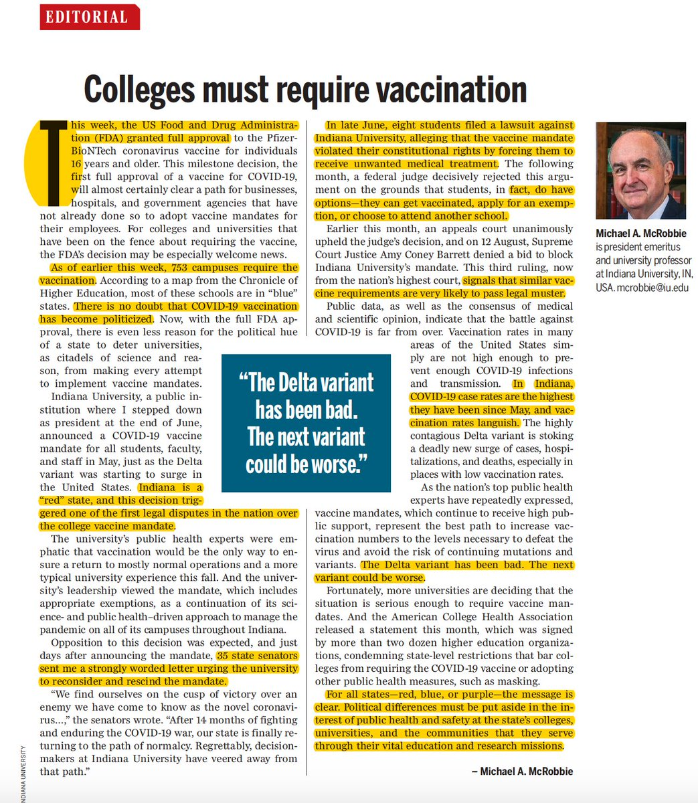</img></a>

---

<a href="https://twitter.com/erictopol/status/1430999763504164866" target="_blank" rel="noreferer">21:05 UCT</a>

That was last week.
This week: predicting RNA structures with #AI 
http://science.sciencemag.org/content/373/6558/1047
@raphaeljlt @StanfordAILab @DrorLab @amw_stanford @RDasLab  @ramyarangan  http://science.sciencemag.org/content/373/6558/964
@ScienceMagazine @UNC Kevin Weeks explainer 

<a href="E9vs_YyVkAAaeCR.jpg"  ></img></a><a href="E9vtqcQVgAARSWS.jpg"  >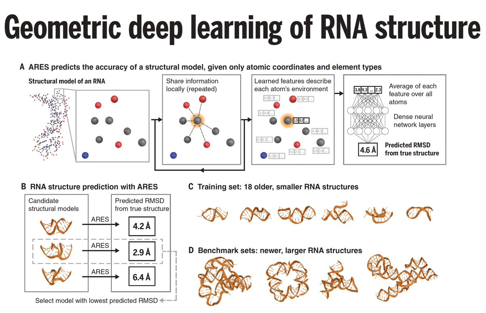</img></a><a href="E9vtsUNVgAAkF-C.jpg"  >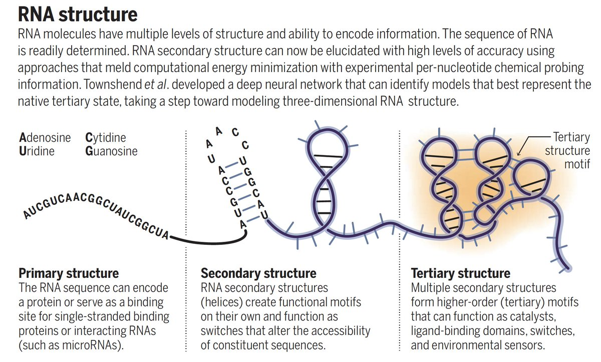</img></a>

---

<a href="https://twitter.com/erictopol/status/1431019825136951297" target="_blank" rel="noreferer">22:24 UCT</a>

@erlichya @OurWorldInData Thanks. I didn't know about that site, Yaniv.
Deleted my post due to incorrect data.

---

<a href="https://twitter.com/erictopol/status/1431020414331875329" target="_blank" rel="noreferer">22:27 UCT</a>

@erlichya @OurWorldInData Will do. Thanks!

---

<a href="https://twitter.com/erictopol/status/1431024735580655619" target="_blank" rel="noreferer">22:44 UCT</a>

Just published @TheLancet
Largest longitudinal cohort follow-up of hospitalized covid survivors for #LongCovid data 
https://www.thelancet.com/journals/lancet/article/PIIS0140-6736(21)01755-4/fulltext
Excellent contextual editorial
https://www.thelancet.com/journals/lancet/article/PIIS0140-6736(21)01900-0/fulltext 

<a href="E9wDEoRVUAI7KVL.jpg"  >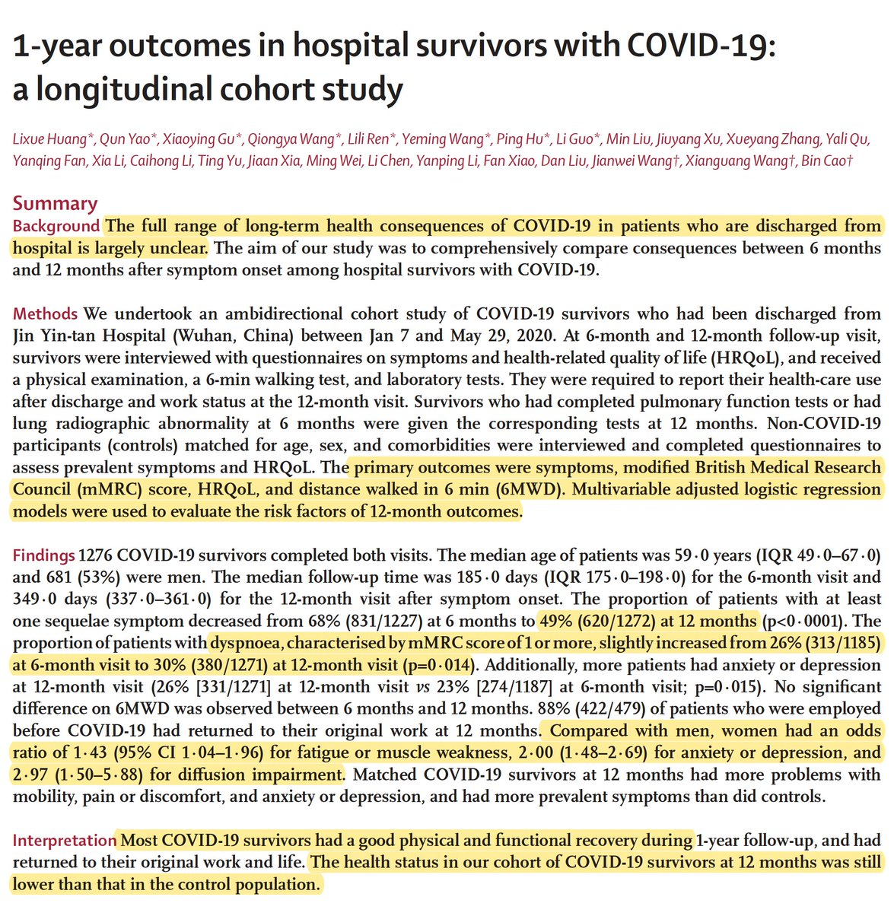</img></a><a href="E9wEWSYVEAU9KOy.jpg"  >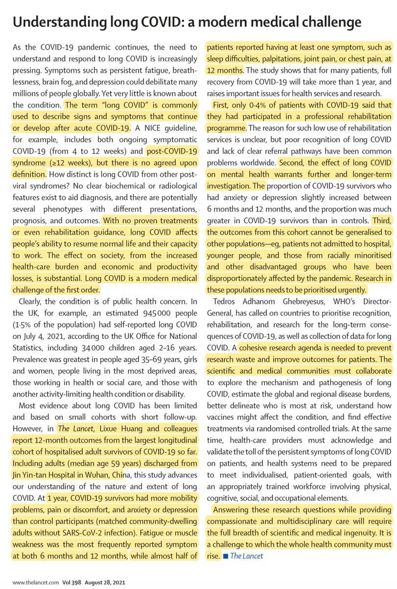</img></a>

---

<a href="https://twitter.com/erictopol/status/1431028624342142980" target="_blank" rel="noreferer">22:59 UCT</a>

Today, on CoronaVac," and variants of concern, @TheLancetInfDis
https://www.thelancet.com/journals/laninf/article/PIIS1473-3099(21)00568-5/fulltext
"Delta most refractory to neutralization"
"Low degree of neutralization-afforded protection mounted by CoronaVac when compared with natural infection" 

<a href="E9wH9X9UcAIAG8c.jpg"  >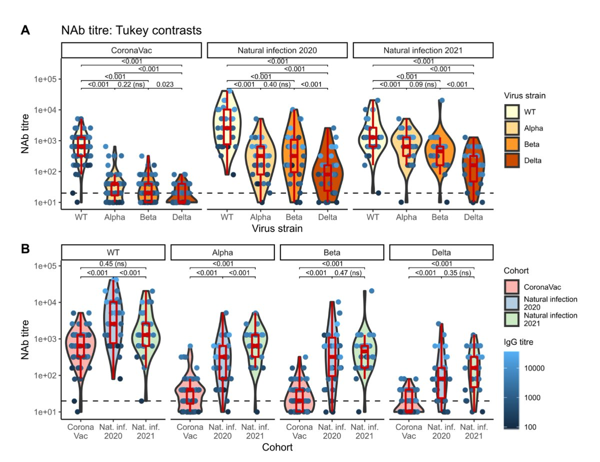</img></a><a href="E9wIoH4VoAEh0vx.jpg"  >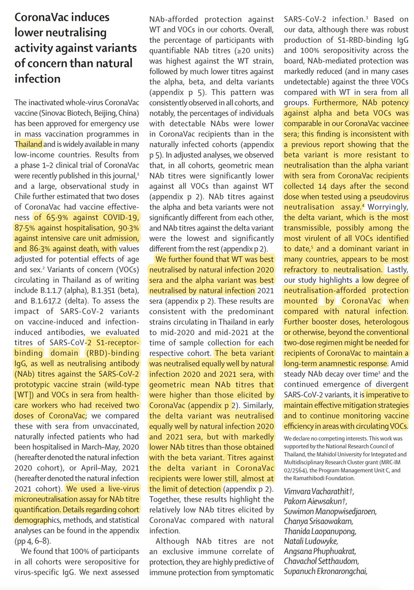</img></a>

---

<a href="https://twitter.com/erictopol/status/1431037872262422533" target="_blank" rel="noreferer">23:36 UCT</a>

Beyond mandates at colleges
@FT Editorial Board
https://www.ft.com/content/8c96e965-b446-4e0e-a9c6-03251623cfad

@NewYorker by @JeannieSGersen https://www.newyorker.com/news/our-columnists/should-the-government-impose-a-national-vaccination-mandate?utm_source=nl&utm_brand=tny&utm_mailing=TNY_Daily_082621&utm_campaign=aud-dev&utm_medium=email&bxid=5cec251ffc942d3ada0912af&cndid=17835076&hasha=6c307430bfef9a2cb162d3d9f33b6ec8&hashb=f8cf3ac38d651349ef48fb9af47a5e1068049d0d&hashc=a4037f18a77dcfb5b548c03001040222dcb7e301276a619f95d0dd66bd867645&esrc=Auto_Subs&utm_content=B&utm_term=TNY_Daily 

<a href="E9wQlL1VoAMHa8P.jpg"  >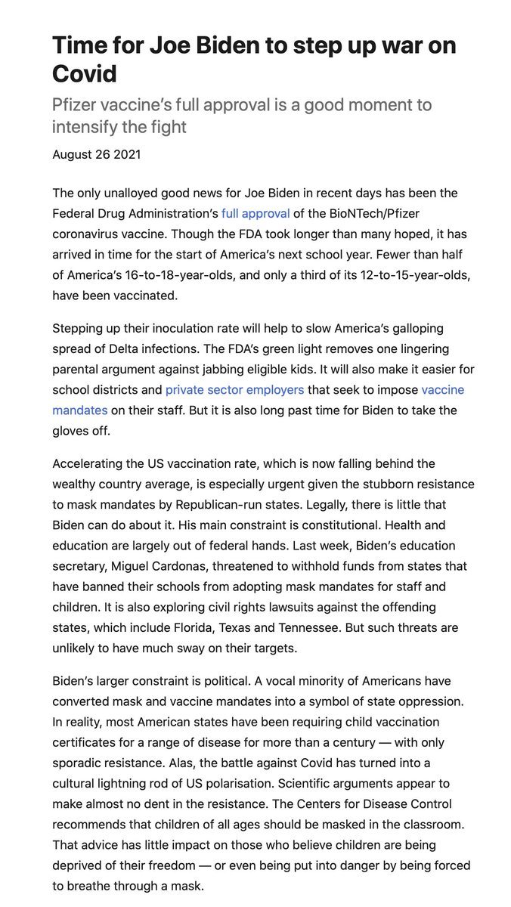</img></a><a href="E9wRCT_VgAEFBvf.jpg"  >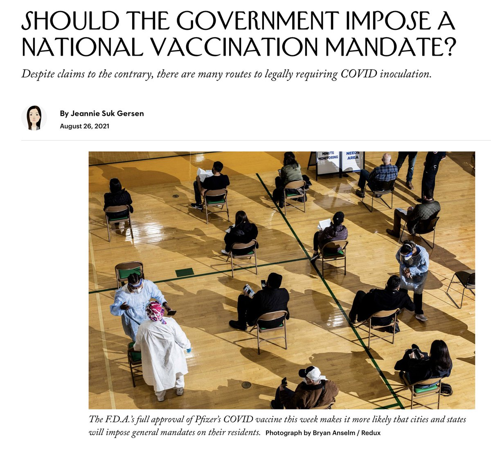</img></a>