+++
title = "Tweets by Eric Topol Aug 28"
Summary = ""
tags = ["Twitter"]
category = "Twitter"
+++

---

<a href="https://twitter.com/erictopol/status/1431419286317256705" target="_blank" rel="noreferer">00:52 UCT</a>

The accompanying editorial for this important paper, the first to nail down and quantify Delta's increased virulence https://www.thelancet.com/journals/laninf/article/PIIS1473-3099(21)00474-6/fulltext by @JeromeLechien
And a very good thread by @kallmemeg 
https://twitter.com/kallmemeg/status/1431388312372142082 

<a href="E91rPj8VIAMZBTR.jpg"  >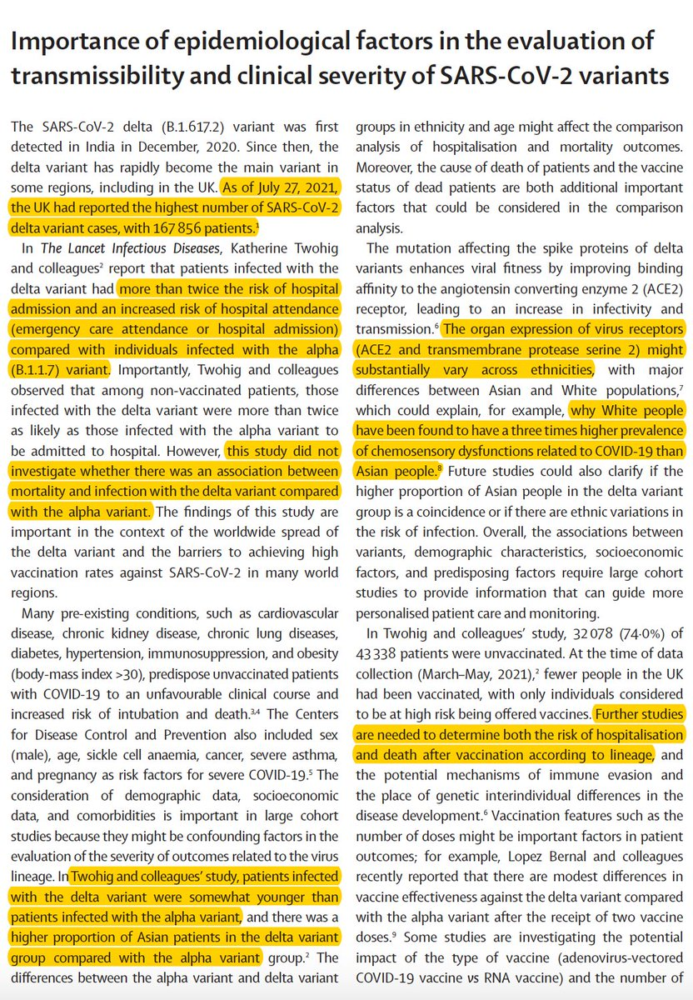</img></a><a href="E91rRIUVEAIMsD1.jpg"  >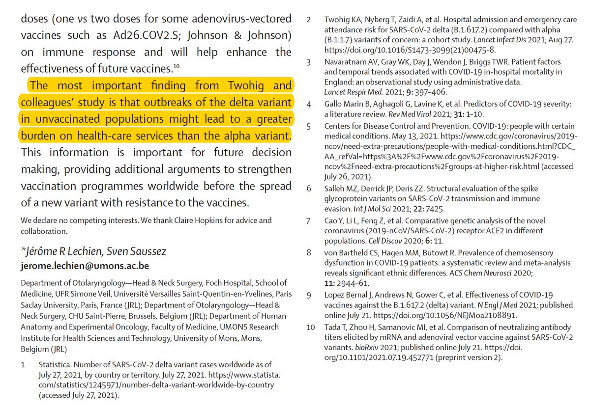</img></a>

---

<a href="https://twitter.com/erictopol/status/1431426389362630660" target="_blank" rel="noreferer">01:20 UCT</a>

Delta US hospitalizations are &gt;100,000 now and mainly driven, but not exclusively, in states with low vaccination rates. But Hawaii, Oregon and Washington have reached new pandemic records. Texas is about to. 

<a href="E91wt_cUYAAm-Ze.jpg"  >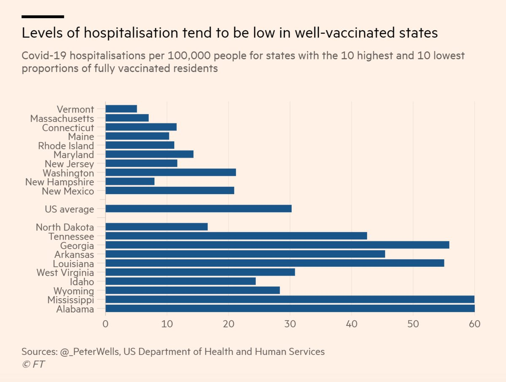</img></a><a href="E91wzq0VEAA46kU.jpg"  >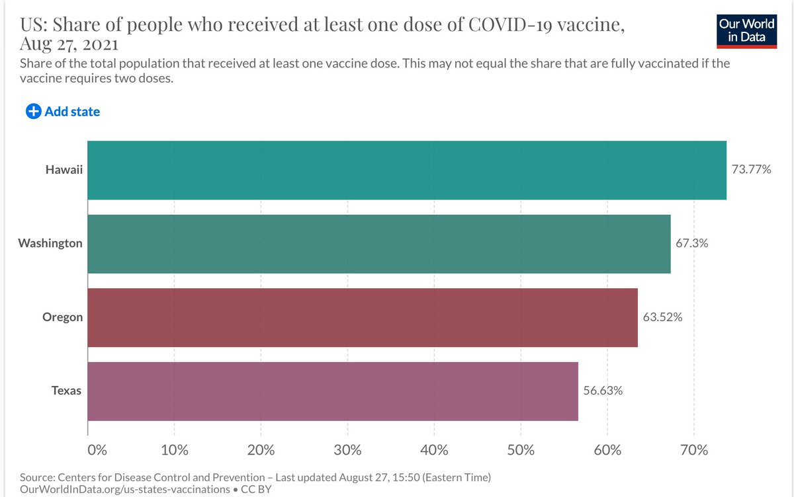</img></a>

---

<a href="https://twitter.com/erictopol/status/1431426395121405952" target="_blank" rel="noreferer">01:20 UCT</a>

Good summary of the dire situation at many FL, LA hospitals and how patients are often sicker, more in ICU, longer stays and the shift to younger patients than previous waves https://www.ft.com/content/02924ab7-fbe6-4025-a112-ee9657c5ddcd by @_PeterWells @FT 

<a href="E91xD89VEAIBwAM.jpg"  >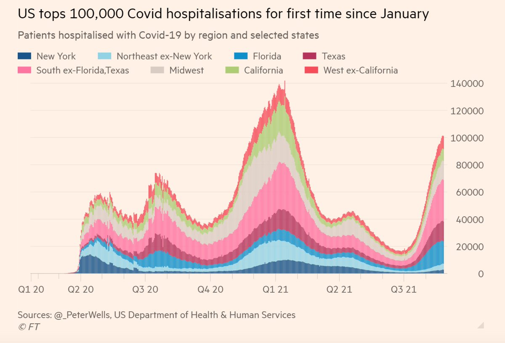</img></a>

---

<a href="https://twitter.com/erictopol/status/1431438126640103424" target="_blank" rel="noreferer">02:06 UCT</a>

Delta is running circles around our weak defense.
Pushing towards 200,000 new cases and over 1,800 deaths today 

<a href="E9186NTUcAEH0yQ.jpg"  >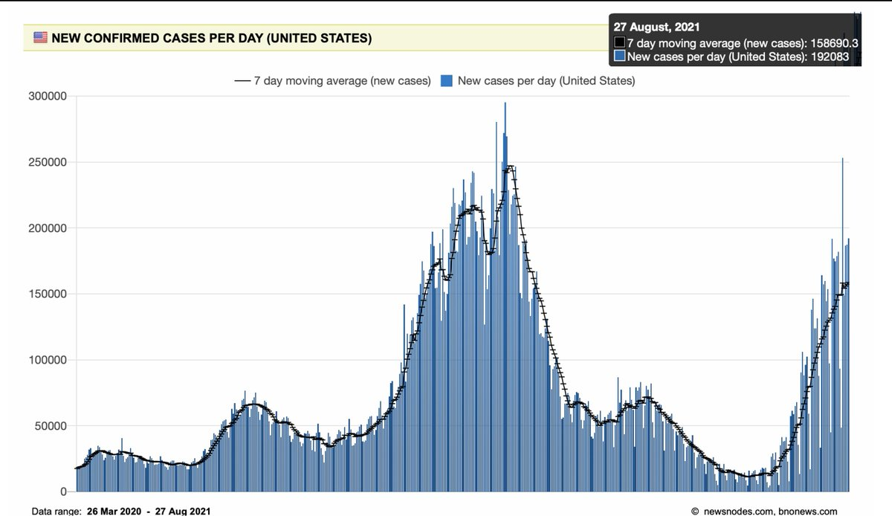</img></a><a href="E919I5wVgAAXLHv.jpg"  >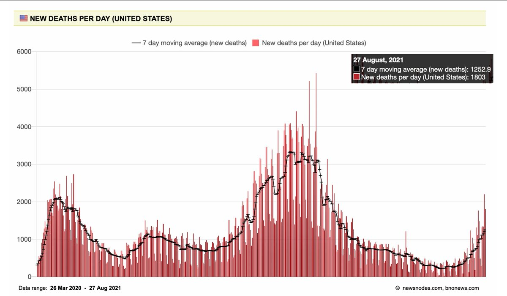</img></a>

---

<a href="https://twitter.com/erictopol/status/1431446592012242946" target="_blank" rel="noreferer">02:40 UCT</a>

@DrGiroir @CDCDirector @POTUS Prior covid is important for natural immunity.  But your strong assertion here is imprudent and unfounded to make make such a claim. There are significant limitations of that preprint study, and you may want to read about them https://www.sciencemag.org/news/2021/08/having-sars-cov-2-once-confers-much-greater-immunity-vaccine-no-infection-parties

---

<a href="https://twitter.com/erictopol/status/1431607057078054912" target="_blank" rel="noreferer">13:18 UCT</a>

Our covid times
by @Patbagley and @MatttDavies 

<a href="E94WrsrVIAgm_WI.jpg"  >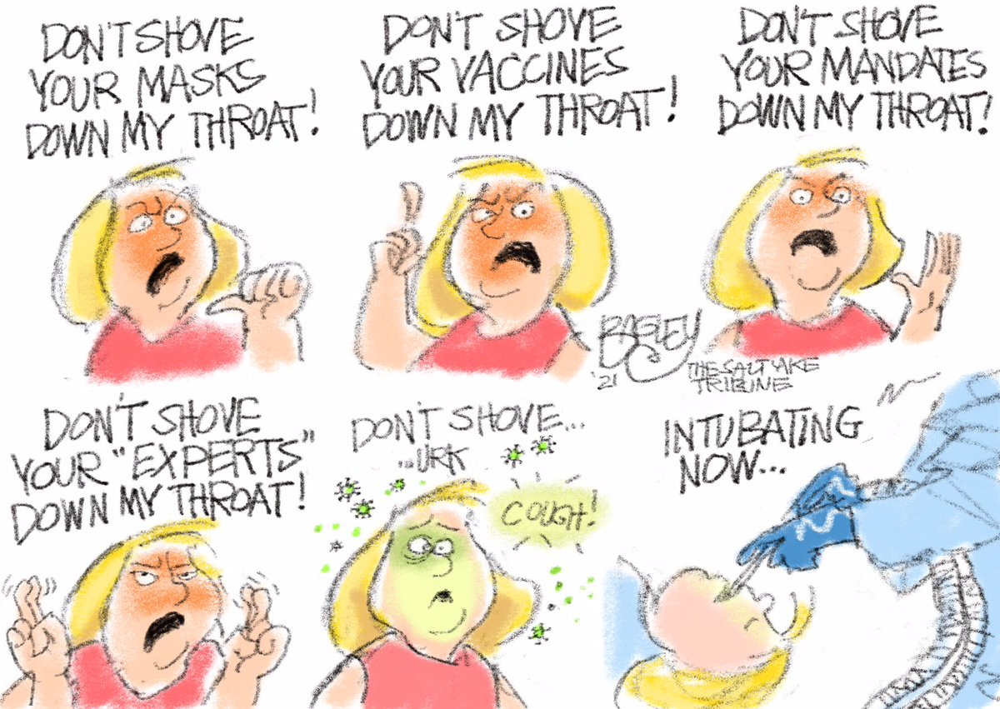</img></a><a href="E94W7SLVQAM4u4x.jpg"  >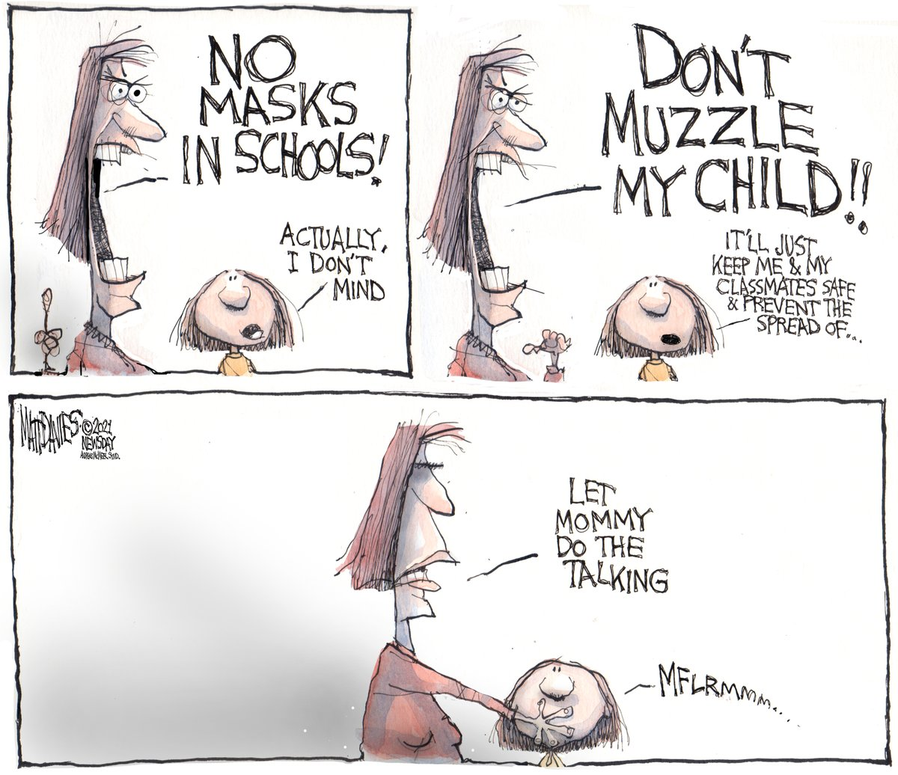</img></a>

---

<a href="https://twitter.com/erictopol/status/1431611453602029574" target="_blank" rel="noreferer">13:35 UCT</a>

First mover disadvantage

Waning immunity, 3 week dose-spacing, insufficient population vaccinated, and other factors contributing to  this unexpected outcome. 

<a href="E94aYgFUUAoX-RN.jpg"  >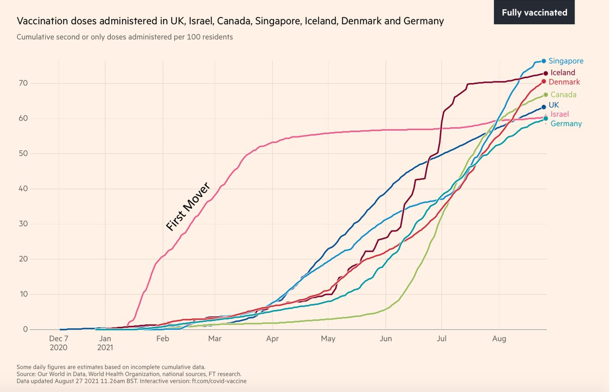</img></a><a href="E94ab34UUAgFSmR.jpg"  >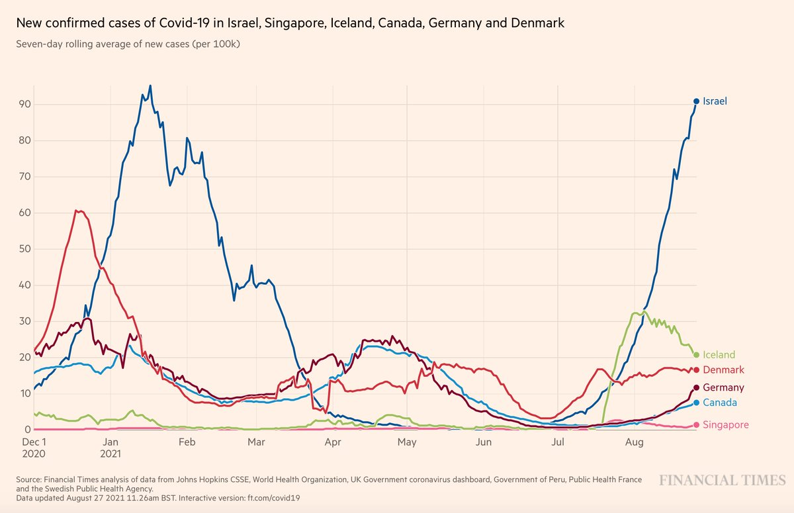</img></a>

---

<a href="https://twitter.com/erictopol/status/1431612963274715138" target="_blank" rel="noreferer">13:41 UCT</a>

Dose-spacing immune response data, 1 potential factor
https://twitter.com/EricTopol/status/1430581936246775809

---

<a href="https://twitter.com/erictopol/status/1431613429974908928" target="_blank" rel="noreferer">13:43 UCT</a>

@erlichya Understood, but that's the point....not enough of total population vaccinated as a potential contributory factor

---

<a href="https://twitter.com/erictopol/status/1431623165495496719" target="_blank" rel="noreferer">14:22 UCT</a>

An important new study from Qatar on waning of the Pfizer vaccine's protection against symptomatic infection at 6 months to &lt;50%, with preserved effectiveness vs hospitalization, adds to a growing body of consistent evidence for this dichotomy  
https://www.medrxiv.org/content/10.1101/2021.08.25.21262584v1 

<a href="E94kNcpVkAIWpoJ.png"  >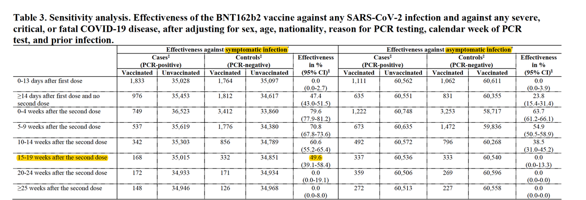</img></a>

---

<a href="https://twitter.com/erictopol/status/1431628349525278721" target="_blank" rel="noreferer">14:42 UCT</a>

This week's Kaiser Permanente @KPSCalResearch report from &gt;3.3 million people showed a decline of Pfizer  vaccine effectiveness against infections to 53%[95% CI 38,65] at ≥4 months yet preserved 93% VE against hospitalizations https://papers.ssrn.com/sol3/papers.cfm?abstract_id=3909743 @KPSCALnews 

<a href="E94n5rWUUAImQY0.jpg"  >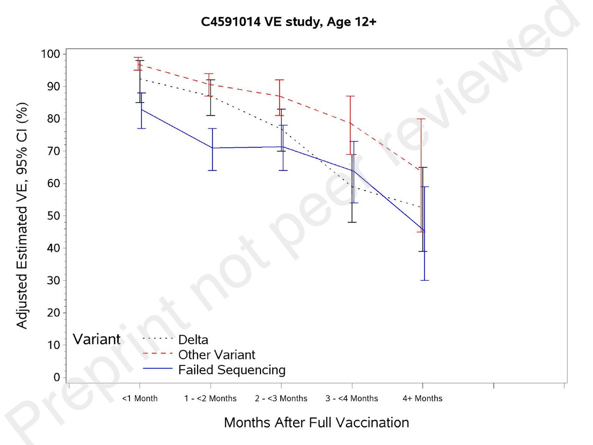</img></a>

---

<a href="https://twitter.com/erictopol/status/1431628354646523909" target="_blank" rel="noreferer">14:42 UCT</a>

A new @CDCMMWR in health care workers for both Pfizer and Moderna vaccines https://www.cdc.gov/mmwr/volumes/70/wr/mm7034e4.htm found a decline to 66% effectiveness against infection, 75% of which were symptomatic 

<a href="E94qNlmVIAMMYfl.jpg"  >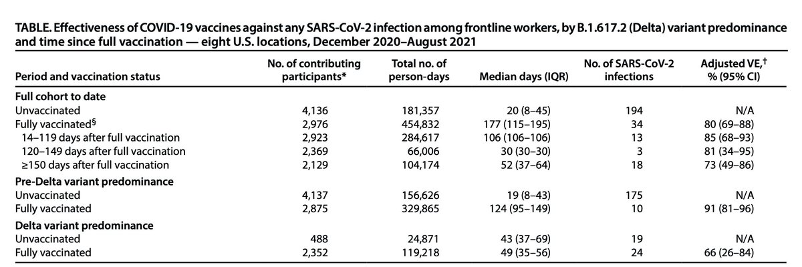</img></a>

---

<a href="https://twitter.com/erictopol/status/1431636104902414338" target="_blank" rel="noreferer">15:13 UCT</a>

I have been writing about this hard truth issue for weeks now w/strong denial and critique that I’ve “conflated” infections and they’re without symptoms. That’s false. The vaccinated need to know about vulnerability to breakthrough infections. Truth bolsters confidence and trust.

---

<a href="https://twitter.com/erictopol/status/1431640389614669834" target="_blank" rel="noreferer">15:30 UCT</a>

RT @tmprowell: This is wrong &amp; will unfortunately be misunderstood &amp; misused. Imagine "#SARSCoV2 infection--&gt;natural immunity" as an invest…

---

<a href="https://twitter.com/erictopol/status/1431642757756424194" target="_blank" rel="noreferer">15:40 UCT</a>

Debunking another vaccine myth and disinformation. There is no ADE. https://twitter.com/Dereklowe/status/1430867815343529987

---

<a href="https://twitter.com/erictopol/status/1431655206392000522" target="_blank" rel="noreferer">16:29 UCT</a>

The outlier
https://newsnodes.com/worldmonitor/ 

<a href="E95CfXqVQAEFc20.jpg"  >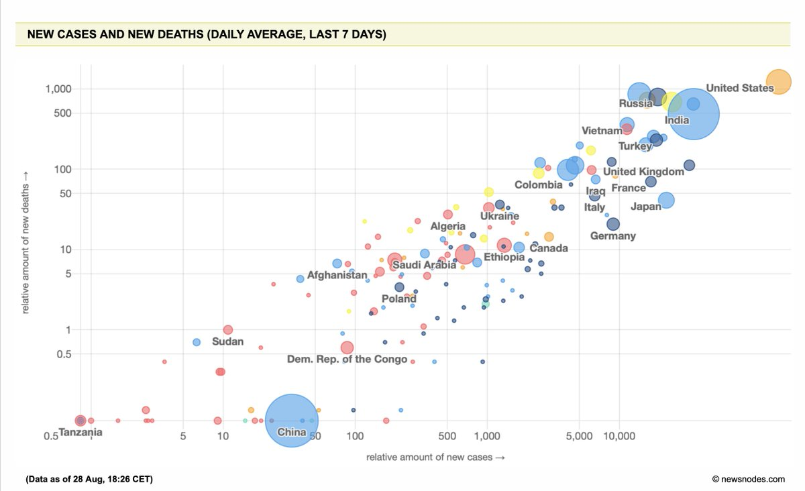</img></a>

---

<a href="https://twitter.com/erictopol/status/1431655943742234624" target="_blank" rel="noreferer">16:32 UCT</a>

@kellywind @mutemouth0 Exactly.

---

<a href="https://twitter.com/erictopol/status/1431658238651486211" target="_blank" rel="noreferer">16:41 UCT</a>

Vaccines have their limit: people.
https://www.washingtonpost.com/opinions/2021/08/28/vaccines-can-only-do-so-much-rest-is-up-people/
by @washingtonpost ed board 

<a href="E95FWuyVEAsIFjz.png"  >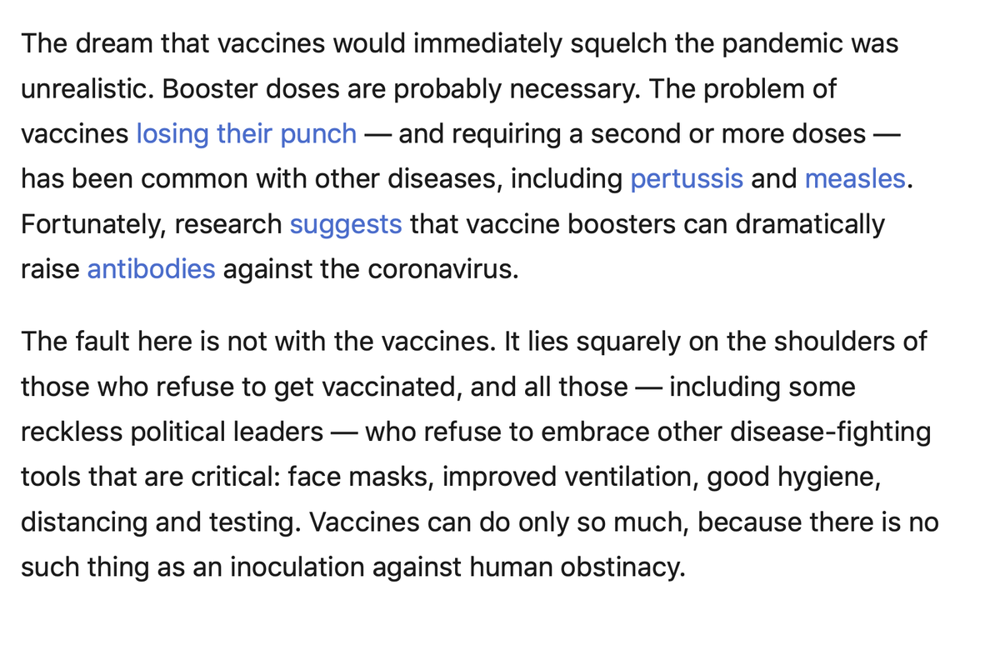</img></a>

---

<a href="https://twitter.com/erictopol/status/1431673065344176131" target="_blank" rel="noreferer">17:40 UCT</a>

This phenomenon remains unexplained. If the main driver is simply waning immunity, these countries that are 3 months behind Israel may subsequently manifest this problem.

---

<a href="https://twitter.com/erictopol/status/1431680512179924995" target="_blank" rel="noreferer">18:10 UCT</a>

Florida became the epicenter of the US Delta wave, with cases, hospitalizations and deaths that all towered above its 3rd wave when there were no vaccinations. Why?
https://www.nytimes.com/2021/08/28/us/florida-coronavirus-covid-19-vaccines-variant.html by @PatriciaMazzei @benjmueller @gebeloffnyt 

<a href="E95ZkaTVcAMHzv6.jpg"  >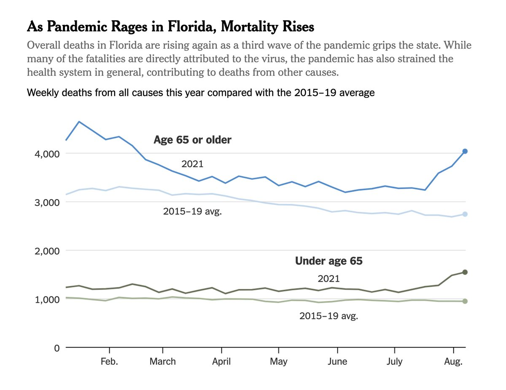</img></a><a href="E95Zl9yVEAIu9YK.jpg"  >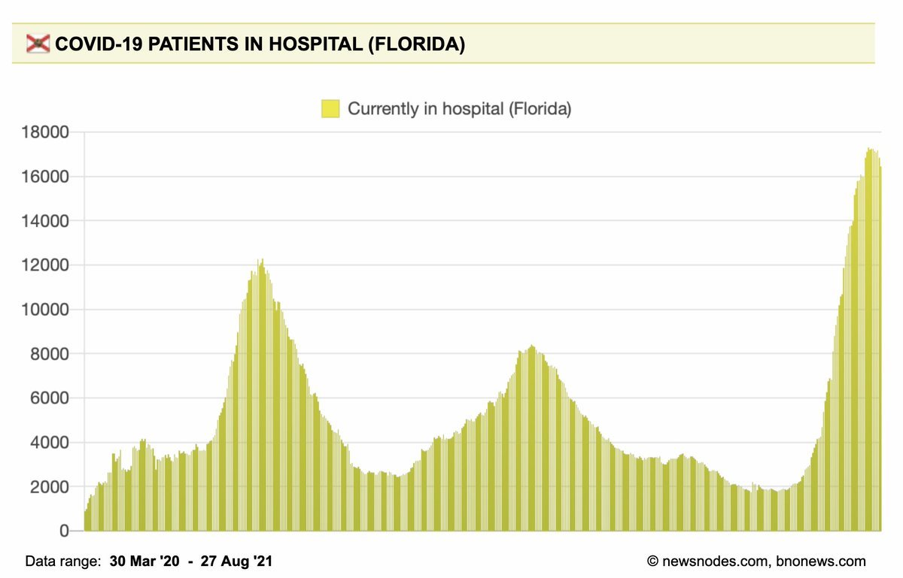</img></a>

---

<a href="https://twitter.com/erictopol/status/1431709021883432961" target="_blank" rel="noreferer">20:03 UCT</a>

This is good. But we desperately need to get tens of millions more Americans vaccinated. To get 80% fully vaccinated across all eligible age groups. Much work to do, but that's how we'll get durable containment.  https://twitter.com/cyrusshahpar46/status/1431707190784528386

<a href="E95zV6ZUUAEhKGx.jpg"  >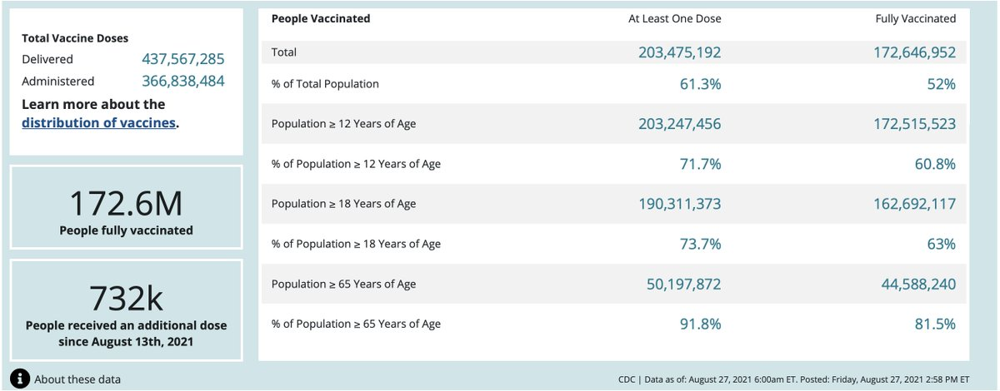</img></a>

---

<a href="https://twitter.com/erictopol/status/1431747854461116417" target="_blank" rel="noreferer">22:37 UCT</a>

What about the risk of automimunne conditions and Covid?
An excellent new review @TheLancetRheum 
? risk of infection, hospitalization, death; Glucocorticoids increased risk, cytokine inhibitors, vaccination impact
 https://www.thelancet.com/journals/lanrhe/article/PIIS2665-9913(21)00247-2/fulltext 

<a href="E96WQYBVIAEZacC.jpg"  >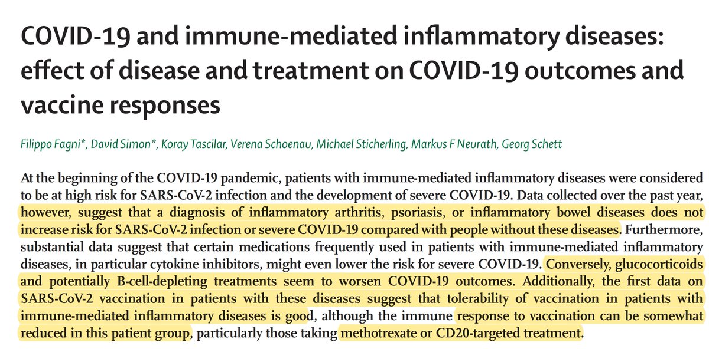</img></a><a href="E96WSAQVQAc5VPr.jpg"  >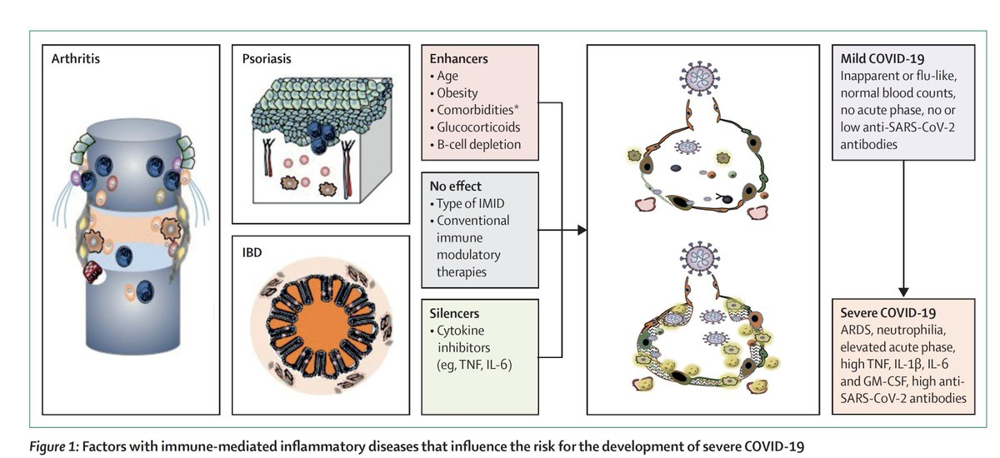</img></a><a href="E96WrkYVUAAlOhz.jpg"  >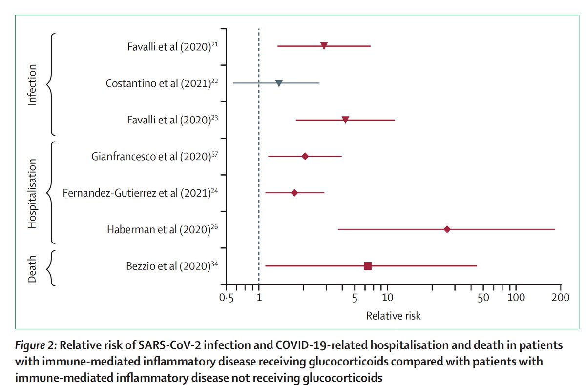</img></a><a href="E96WVOfUUAIRKgK.jpg"  ></img></a>