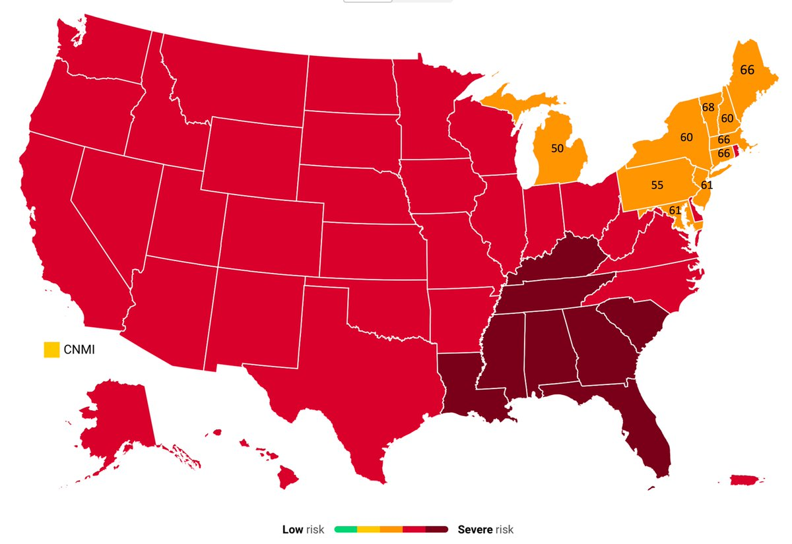
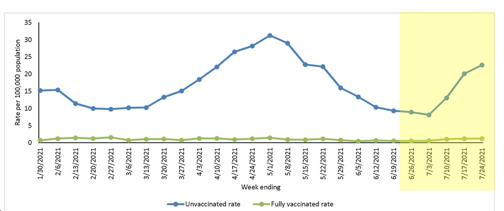
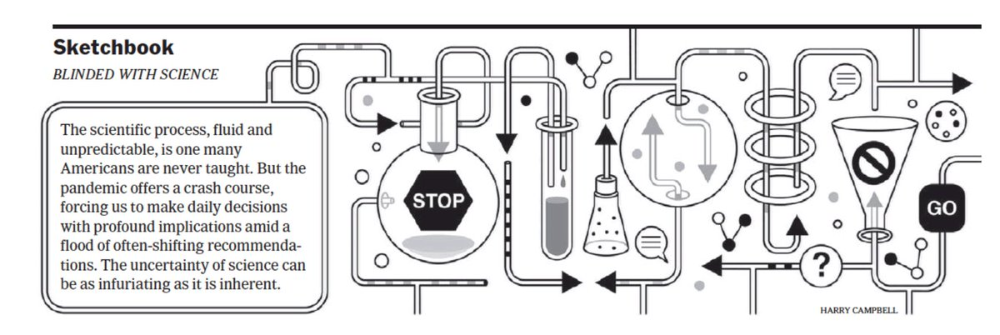
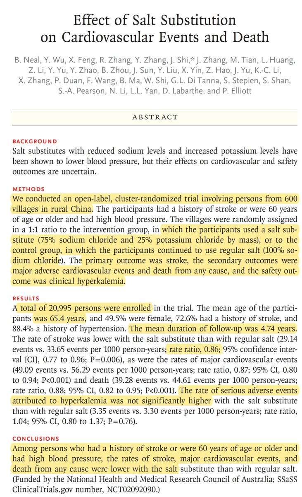
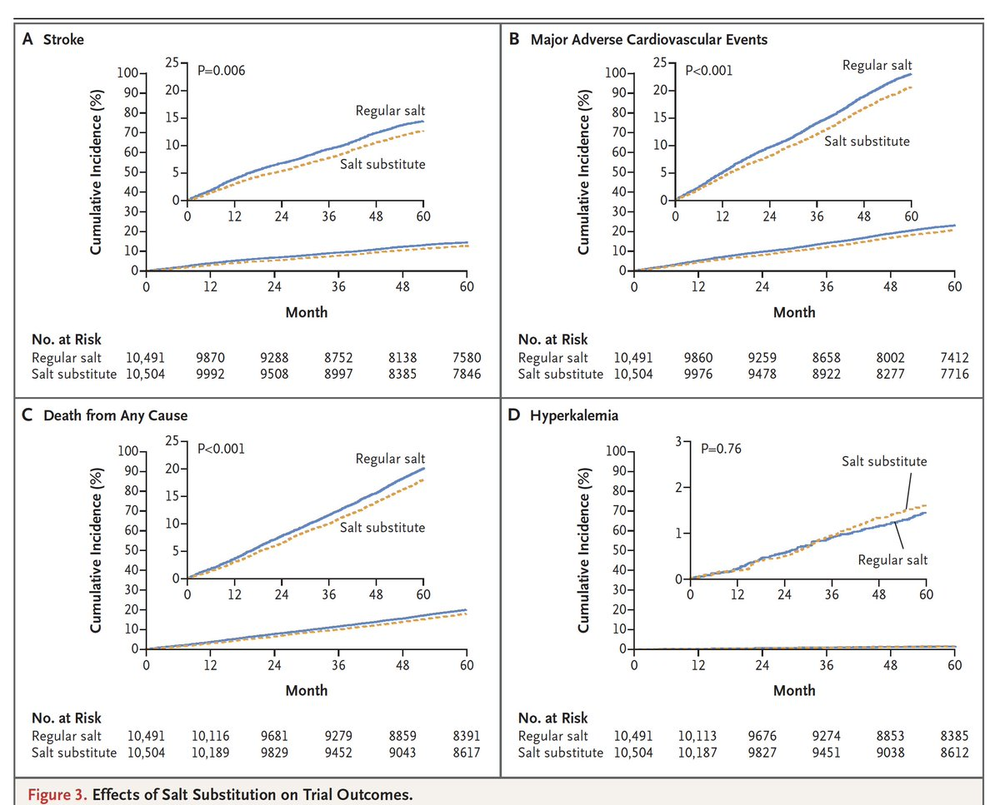
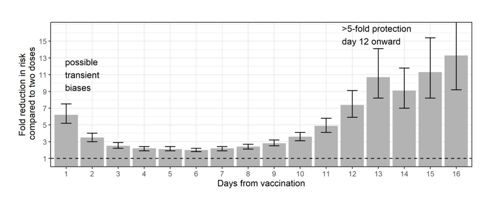
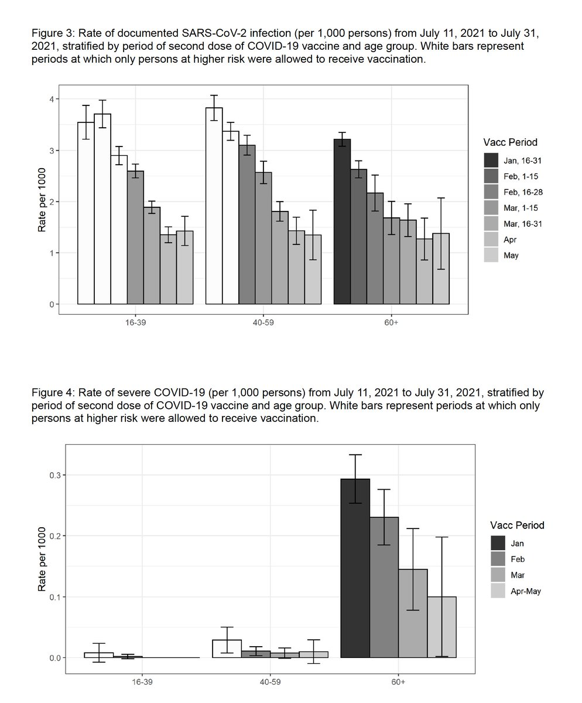
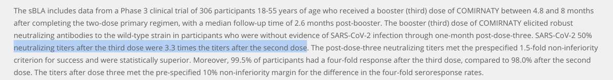
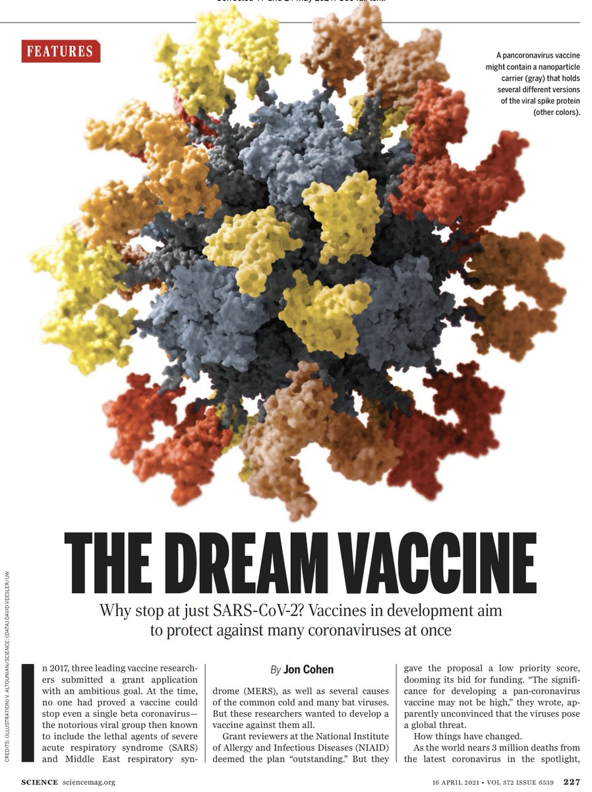

+++
title = "Tweets by Eric Topol Aug 29"
Summary = ""
tags = ["Twitter"]
category = "Twitter"
+++

---

<a href="https://twitter.com/erictopol/status/1431777277025521669" target="_blank" rel="noreferer">00:34 UCT</a>

Why does Michigan, which has a considerably lower vaccination rate than the New England states (shown here), have one of the lowest US case rates (= Vermont, 20/100,000) and hospitalization rates (11/100K)?
Prior covid immunity from its hard-hit Alpha wave may be playing a role. 

<a href="E96wW1PUUAIZNKk.jpg"  ></img></a>

---

<a href="https://twitter.com/erictopol/status/1431848492238991360" target="_blank" rel="noreferer">05:17 UCT</a>

February. Now it’s hard to read.
Thanks @michaelmina_lab for all you have done to try to get this on track https://twitter.com/EricTopol/status/1362883049466122240

---

<a href="https://twitter.com/erictopol/status/1431986723639025668" target="_blank" rel="noreferer">14:26 UCT</a>

Hospitalizations in 8 states, &gt;250 hospitals, during the US Delta wave
"For June 27 - July 24, hospitalization rates were ≥10 times higher in unvaccinated persons compared with vaccinated persons for all age groups across all weeks"
https://www.medrxiv.org/content/10.1101/2021.08.27.21262356v1 #VaccinesWork 

<a href="E99vykRVcAAvAbW.jpg"  ></img></a>

---

<a href="https://twitter.com/erictopol/status/1432001742011392011" target="_blank" rel="noreferer">15:26 UCT</a>

@wkdragon88 Thanks, William. How did you pull this data together?

---

<a href="https://twitter.com/erictopol/status/1432004324276662272" target="_blank" rel="noreferer">15:36 UCT</a>

This, in today's @nytimes print edition 

<a href="E9-AVmTVgAAuUjl.jpg"  ></img></a>

---

<a href="https://twitter.com/erictopol/status/1432024527140175873" target="_blank" rel="noreferer">16:57 UCT</a>

Salt substitute really worked well to reduce major cardiovascular events in a large randomized trial conducted in China 
@NEJM today #ESCCongress2021 
https://www.nejm.org/doi/full/10.1056/NEJMoa2105675?query=featured_home 

<a href="E9-SV9PVIA0uF3v.jpg"  ></img></a><a href="E9-SXUUUUAMSjbj.jpg"  ></img></a>

---

<a href="https://twitter.com/erictopol/status/1432030605554814986" target="_blank" rel="noreferer">17:21 UCT</a>

Israel's booster shot program opened to all age ≥12, 5 months out 
https://www.jpost.com/israel-news/covid-19-in-israel-number-of-serious-patients-rises-again-hospital-strike-goes-on-678025
"those who received a booster are ten times more protected from infection and serious symptoms compared to those who just got two doses"—Dr, Sharon Alroy-Preis @Jerusalem_Post

---

<a href="https://twitter.com/erictopol/status/1432033828021813249" target="_blank" rel="noreferer">17:34 UCT</a>

Israeli data for 1 million people, age &gt; 60, 4 million person-days with no booster vs 3.4 million person-days with booster
&gt;10-fold reduction of severe illness
~11 fold reduction of infections
Preprint by @MiloLabWIS @IsraelMoH and colleagues just posted
https://www.gov.il/BlobFolder/reports/vaccine-efficacy-safety-follow-up-committee/he/files_publications_corona_booster-27082021.pdf 

<a href="E9-atI9VIAYGSyn.jpg"  ></img></a>

---

<a href="https://twitter.com/erictopol/status/1432035402815209474" target="_blank" rel="noreferer">17:40 UCT</a>

"This brings vaccine efficacy for booster-vaccinated individuals to ~95%, similar to the original "fresh" vaccine efficacy reported agains the Alpha strain"

"For people with &gt;12-days lag btwn the booster vaxx &amp;severe illness...decreased relative risk of severe disease 15.5 fold"

---

<a href="https://twitter.com/erictopol/status/1432054828633444358" target="_blank" rel="noreferer">18:57 UCT</a>

Another new Israeli preprint quantifies the extent to waning immunity, for both infections and severe illness, by age group. Bottom figure for age &gt; 60, the earliest group to receive vaccination
https://www.gov.il/BlobFolder/reports/vaccine-efficacy-safety-follow-up-committee/he/files_publications_corona_immunity-waning-082021.pdf 

<a href="E9-tzKCVkAQ4jUh.jpg"  ></img></a>

---

<a href="https://twitter.com/erictopol/status/1432072295288213509" target="_blank" rel="noreferer">20:06 UCT</a>

The preliminary findings from Israel today of the booster &gt;10-fold reduction of severe illness aligns with the what has been established for primary vaccination efficacy and neutralizing level antibodies https://twitter.com/EricTopol/status/1413925899443916800

---

<a href="https://twitter.com/erictopol/status/1432084373906419713" target="_blank" rel="noreferer">20:54 UCT</a>

Here are the Pfizer neutralizing antibody results from a 306 participant study of their booster (otherwise unpublished to date), &gt;3 times the levels of 2nd dose response, with 1 month follow-up (median follow-up time 2.6 months)
https://www.pfizer.com/news/press-release/press-release-detail/pfizer-and-biontech-initiate-rolling-submission 

<a href="E9_IeAcUUAQzuwD.jpg"  ></img></a>

---

<a href="https://twitter.com/erictopol/status/1432093892141195265" target="_blank" rel="noreferer">21:32 UCT</a>

@Samooner There's remarkable potential for a near universal, pan-coronavirus vaccine, but we need to make that #1 priority 
A great summary by @sciencecohen @ScienceMagazine 
https://www.sciencemag.org/news/2021/04/vaccines-can-protect-against-many-coronaviruses-could-prevent-another-pandemic

---

<a href="https://twitter.com/erictopol/status/1432094639553540098" target="_blank" rel="noreferer">21:35 UCT</a>

Initial impressions from a couple of weeks ago still hold, with more pronounced impact on protection from severe illness than projected (if today's @IsraelMOH report in age &gt; 60 extends over follow-up time and across all age groups) https://twitter.com/EricTopol/status/1427632692158468107

---

<a href="https://twitter.com/erictopol/status/1432096471587778560" target="_blank" rel="noreferer">21:43 UCT</a>

Stop the dreaming. 
We should be going after this flat out. 
https://www.sciencemag.org/news/2021/04/vaccines-can-protect-against-many-coronaviruses-could-prevent-another-pandemic @ScienceMagazine @sciencecohen 

<a href="E9_Tl5JUUAQE7d0.jpg"  ></img></a>