+++
title = "Tweets by Eric Topol Aug 30"
Summary = ""
tags = ["Twitter"]
category = "Twitter"
+++

---

<a href="https://twitter.com/erictopol/status/1432138204535164933" target="_blank" rel="noreferer">00:28 UCT</a>

Booster uncertainty: in countries that used 8-12 week  dose spacing that induces a better B and T cell memory response, it remains unclear if/when a 3rd shot would be useful

---

<a href="https://twitter.com/erictopol/status/1432141559592411136" target="_blank" rel="noreferer">00:42 UCT</a>

@jeremyfaust @BogochIsaac @Jerusalem_Post That's right. I wrote 60+ and that's all there is now.  I  have no explanation for their policy going down to all age 12 without compelling data.
https://twitter.com/EricTopol/status/1432033828021813249

---

<a href="https://twitter.com/erictopol/status/1432142375678144514" target="_blank" rel="noreferer">00:45 UCT</a>

@jeremyfaust @BogochIsaac @Jerusalem_Post And the US seems to be following suit without data in hand. No less a baseless 8 months time cutoff.

---

<a href="https://twitter.com/erictopol/status/1432145480109019137" target="_blank" rel="noreferer">00:57 UCT</a>

RT @DFisman: Thought-provoking thread. https://twitter.com/EricTopol/status/1429835698765324289

---

<a href="https://twitter.com/erictopol/status/1432165665004081156" target="_blank" rel="noreferer">02:17 UCT</a>

Hopefully, ~100,000 US hospitalizations will be the peak of the Delta wave. For the past 4 days, the number of inpatients has been gradually decreasing 

<a href="E-ASxQfVkAI0lcA.jpg"  >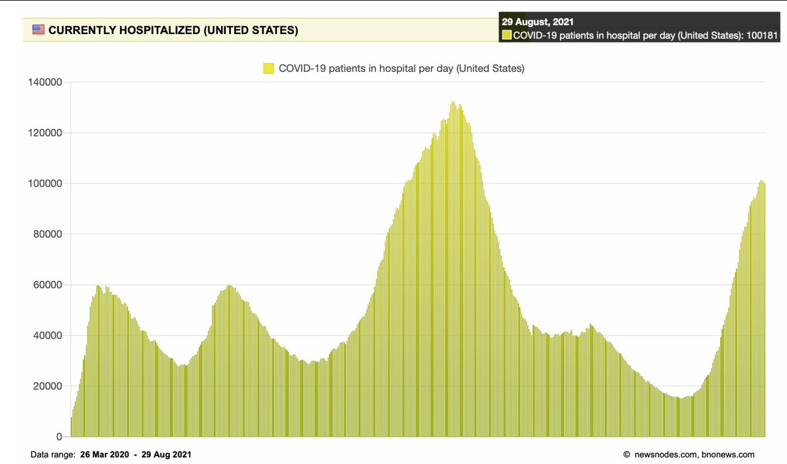</img></a>

---

<a href="https://twitter.com/erictopol/status/1432173768403677184" target="_blank" rel="noreferer">02:50 UCT</a>

@JoyHenningsenMD Thank you!

---

<a href="https://twitter.com/erictopol/status/1432333442838978562" target="_blank" rel="noreferer">13:24 UCT</a>

What a fully vaccinated 80% of total population can achieve in the Delta wave
Congratulations 🇸🇬 

<a href="E-CrbF-VIAQ09d9.jpg"  >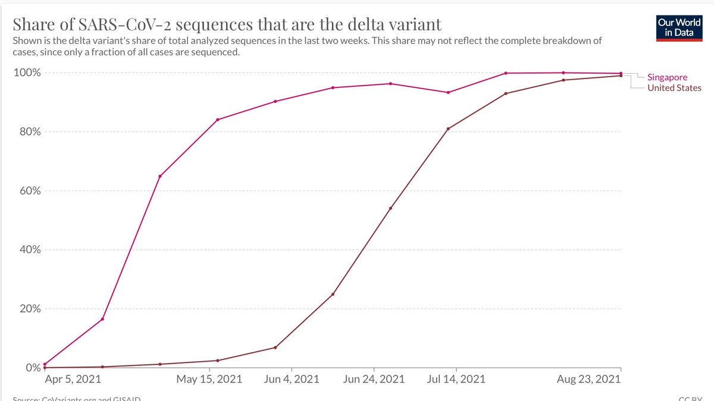</img></a><a href="E-CrdPLVQAQiGt2.jpg"  >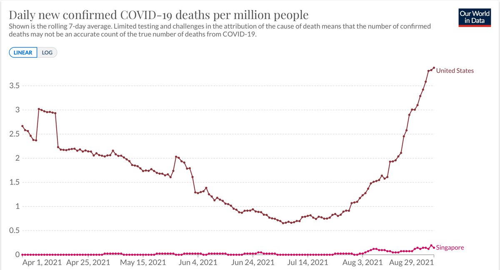</img></a><a href="E-CrfDiVQAYsuti.jpg"  >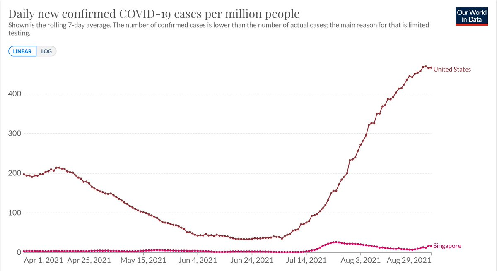</img></a><a href="E-CrhSmVcAEqHJg.jpg"  >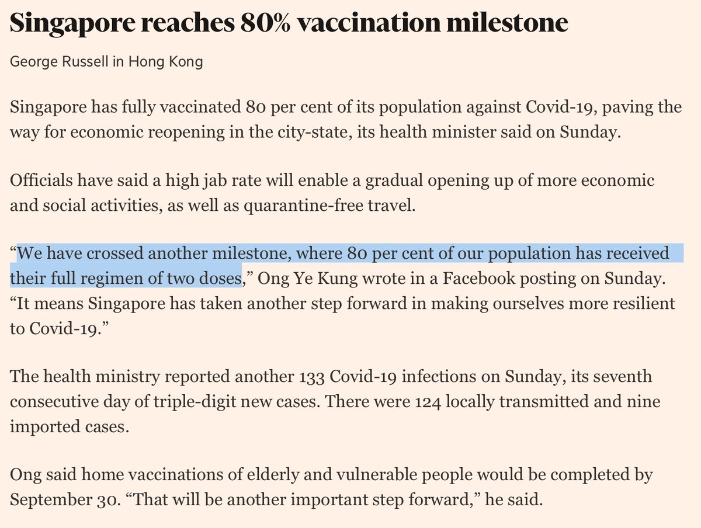</img></a>

---

<a href="https://twitter.com/erictopol/status/1432334687733571587" target="_blank" rel="noreferer">13:29 UCT</a>

@TimFullerton not according to their report, total population

---

<a href="https://twitter.com/erictopol/status/1432337023822487562" target="_blank" rel="noreferer">13:38 UCT</a>

The path to 80% (vs 52%) 

<a href="E-CupIYVIAk5Niy.jpg"  >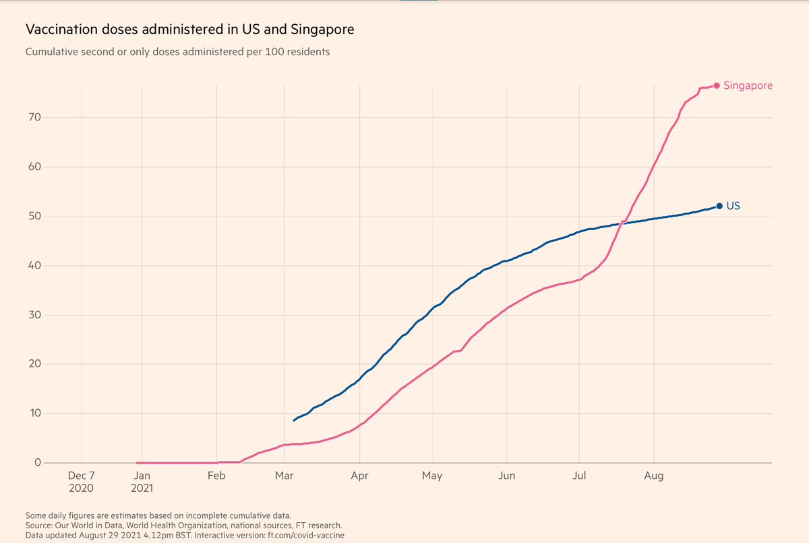</img></a>

---

<a href="https://twitter.com/erictopol/status/1432339989635895298" target="_blank" rel="noreferer">13:50 UCT</a>

After exceeding 100,000 hospitalizations, the US shows early signs of a possible descent, at 2-3 fold level attained compared with the UK and Israel 

<a href="E-Cw9NzVEA0WKpd.jpg"  >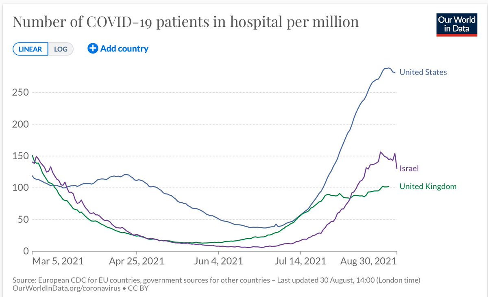</img></a>

---

<a href="https://twitter.com/erictopol/status/1432350710033616897" target="_blank" rel="noreferer">14:33 UCT</a>

@glehman11 Wrong. Israel is not 78% of their total population vaccinated. Try 62%

---

<a href="https://twitter.com/erictopol/status/1432355854301351945" target="_blank" rel="noreferer">14:53 UCT</a>

.@RandPaul strikes again.
After the @US_FDA  had their best public communication of the pandemic, Paul finds a new excuse for why there are no data to support the use of Ivermectin. 

<a href="E-C_jQtVUAI1llS.jpg"  >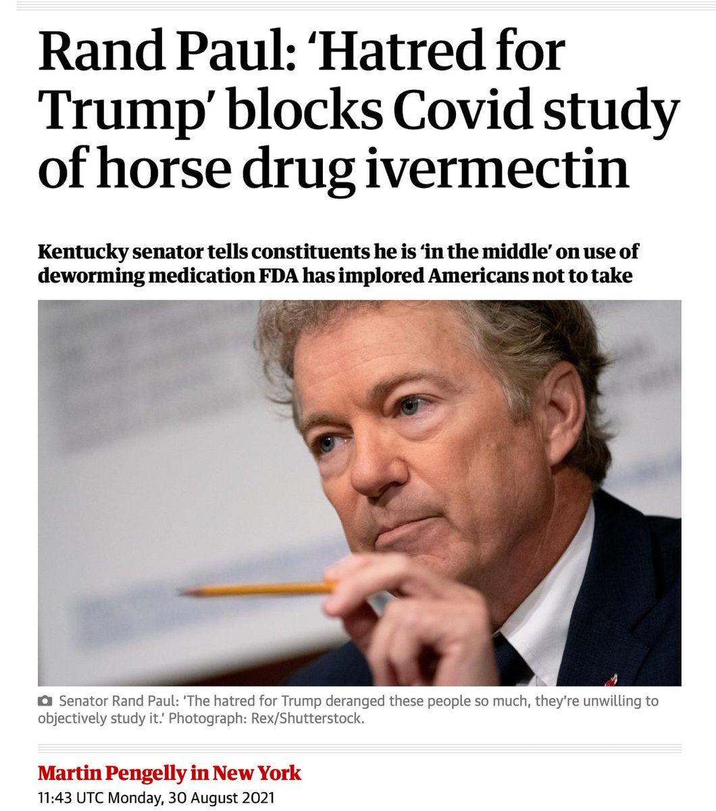</img></a><a href="E-C_l3UVIAIyhmH.jpg"  >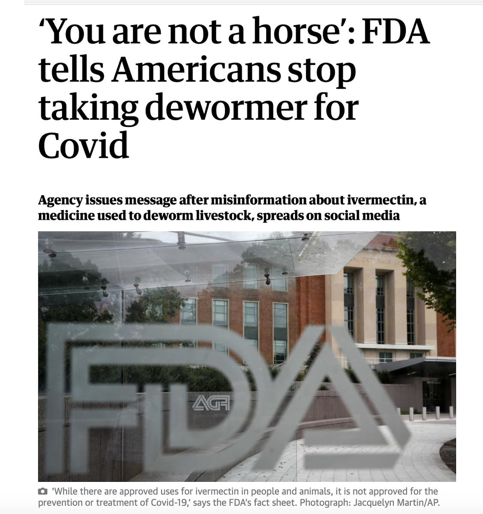</img></a>

---

<a href="https://twitter.com/erictopol/status/1432361333954023428" target="_blank" rel="noreferer">15:15 UCT</a>

Another example of hybrid immunity—prior Covid plus vaccine—benefit with respect to durability of antibody levels to 10 months, in health care workers @JAMANetworkOpen 
https://jamanetwork.com/journals/jamanetworkopen/fullarticle/2783618
Confirmed prior covid needs to be recognized by @CDCgov as = one dose of vaccine 

<a href="E-DC8qaVcAkuXR7.jpg"  >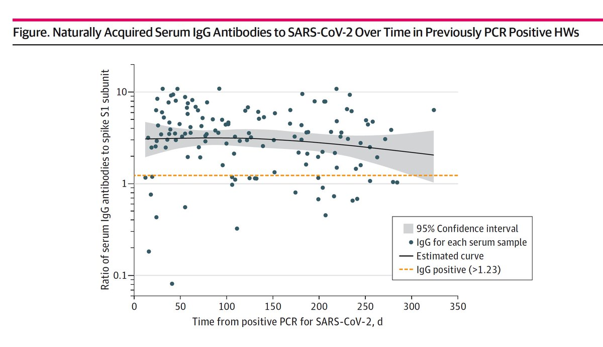</img></a>

---

<a href="https://twitter.com/erictopol/status/1432366248101179399" target="_blank" rel="noreferer">15:35 UCT</a>

And @SciReports today on Prior Covid + vaccination and variants of concern (concordant with a recent @ScienceTM report that 2 doses may be needed vs variants with immune escape)
https://www.nature.com/articles/s41598-021-96879-3 

<a href="E-DIsUQVkAU0pWG.jpg"  >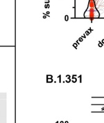</img></a>

---

<a href="https://twitter.com/erictopol/status/1432367070197338114" target="_blank" rel="noreferer">15:38 UCT</a>

fixed figure 

<a href="E-DKOE3VkAYR1Gn.jpg"  >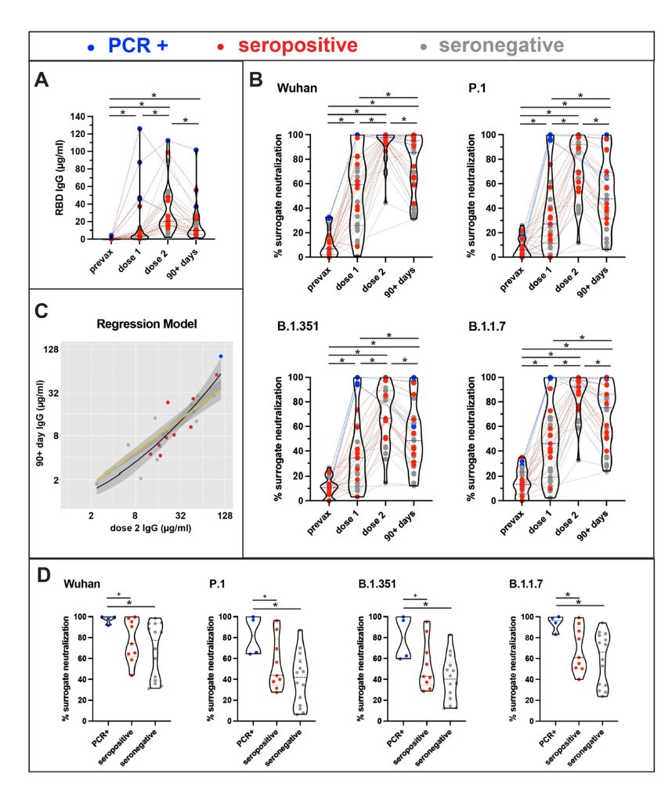</img></a>

---

<a href="https://twitter.com/erictopol/status/1432405355791740930" target="_blank" rel="noreferer">18:10 UCT</a>

It's an #AI of cells day
"Architectural surgery" w/transfer learning
https://www.nature.com/articles/s41587-021-01001-7#Sec50 @NatureBiotech @fabian_theis @ICBmunich 
@MohammadLotfol1
Live cell segmentation resource
https://www.nature.com/articles/s41592-021-01249-6#Sec27 @naturemethods 

<a href="E-DrtsVUYAEZSDP.png"  >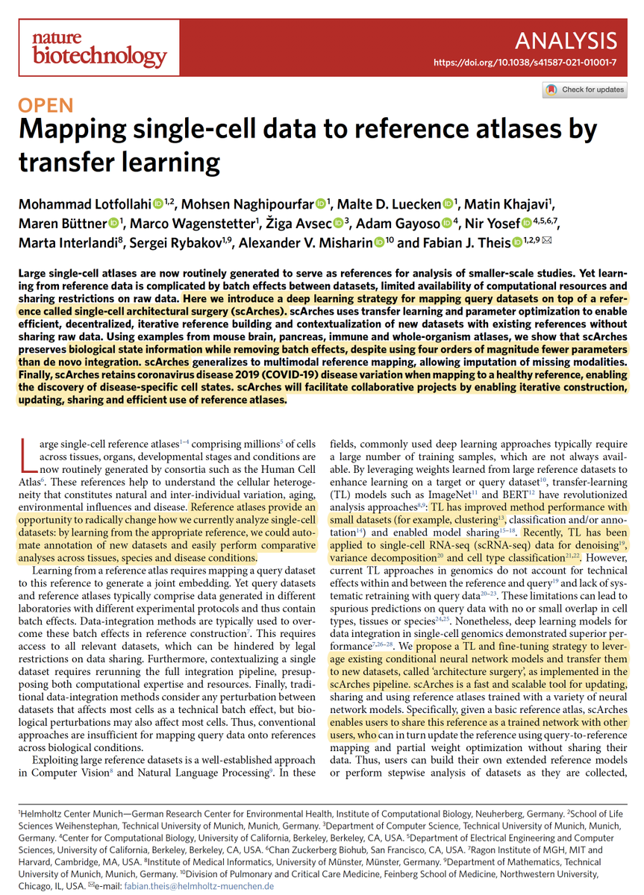</img></a><a href="E-DrvAdUUAAuHts.jpg"  >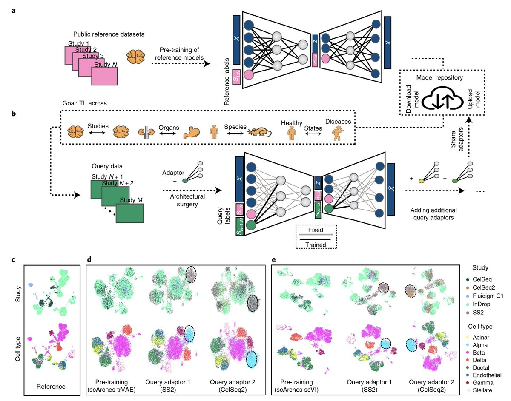</img></a><a href="E-DsZvXVcAUwsNo.jpg"  >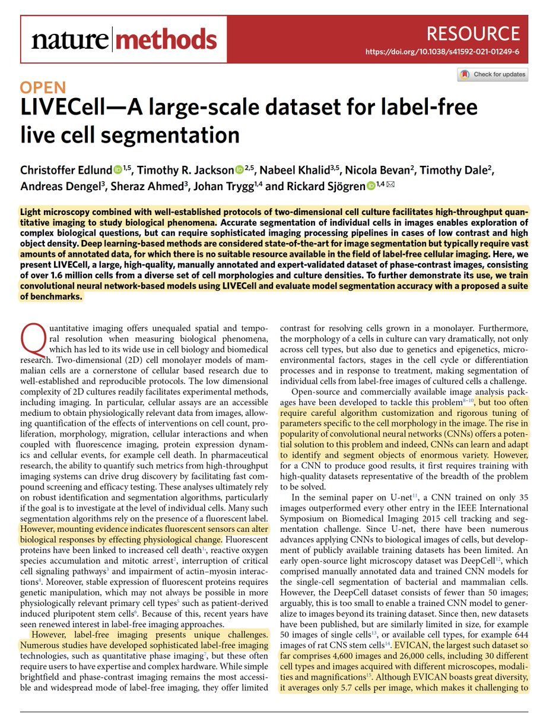</img></a><a href="E-DsbECVEAQ46gq.jpg"  >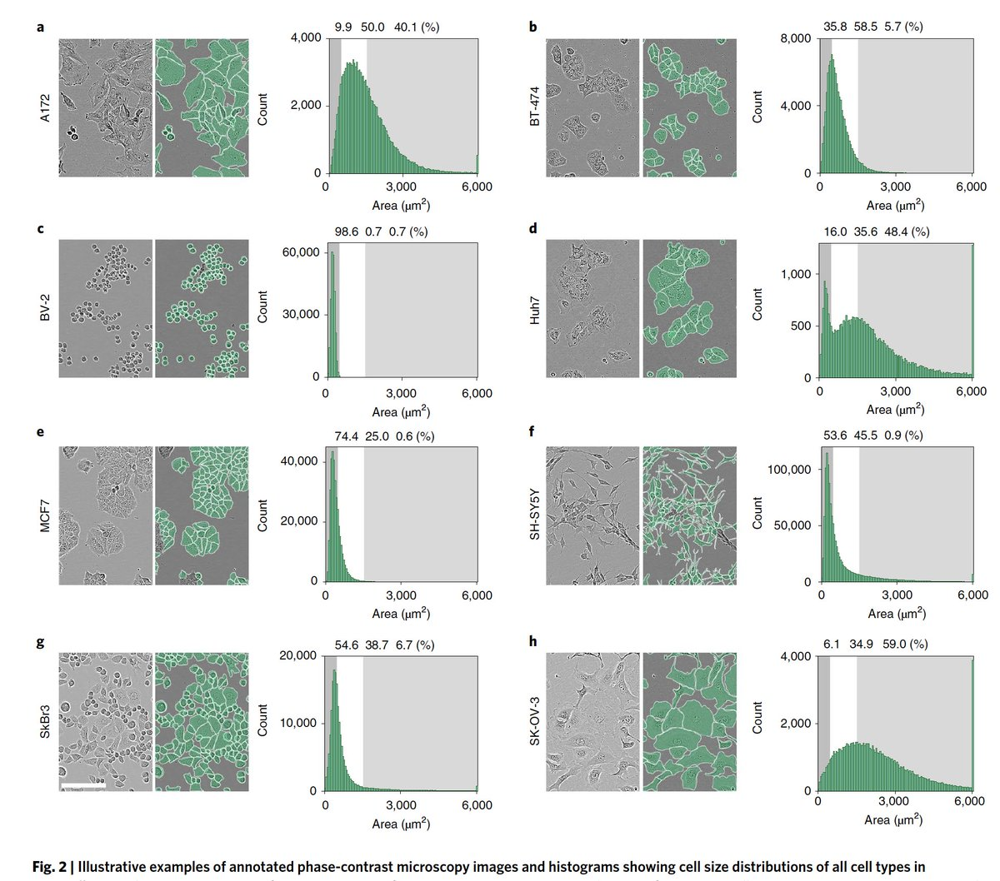</img></a>

---

<a href="https://twitter.com/erictopol/status/1432414115654340609" target="_blank" rel="noreferer">18:45 UCT</a>

Antibodies to #SARSCoV2 receptor binding domain in saliva induced from prior covid, mRNA vaccine and J&amp;J vaccine. High levels of IgG in mRNA vaccinated. Salivary IgA also measured in this study.
https://www.medrxiv.org/content/10.1101/2021.08.22.21262168v1 

<a href="E-D056rUUAElHBD.jpg"  >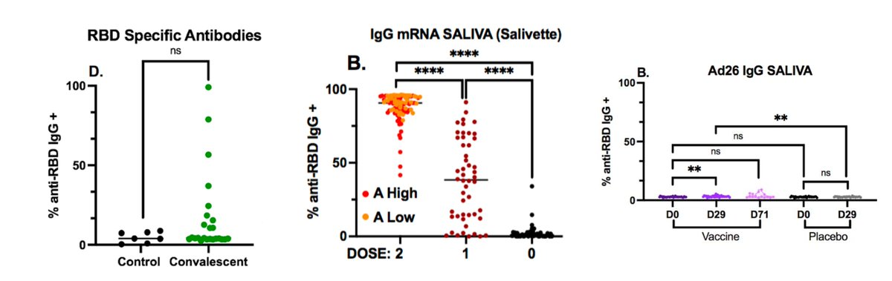</img></a>

---

<a href="https://twitter.com/erictopol/status/1432432171268984833" target="_blank" rel="noreferer">19:56 UCT</a>

A big update for http://outbreak.info today, our @scrippsresearch @ScrippsRTI global tracking of genomic variants, mutations, epidemiology
Kudos to @flaneuseks @DiseaseOutbreak @gkay92 @andrewsu K Andersen and colleagues for their herculean efforts
Here: Delta lineage variants 

<a href="E-EEz7OVcAIfz5v.jpg"  >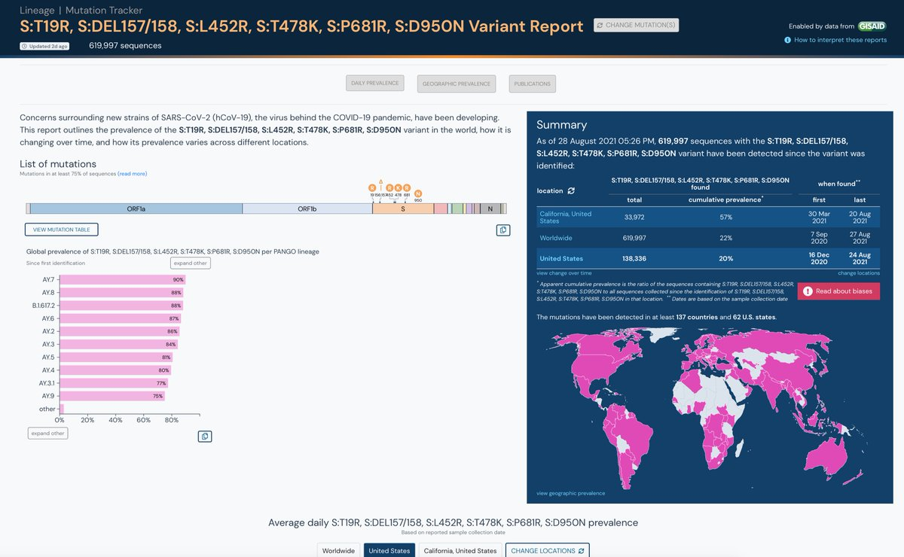</img></a>

---

<a href="https://twitter.com/erictopol/status/1432436808042749952" target="_blank" rel="noreferer">20:15 UCT</a>

The antibody response to vaccines among &gt;1600 health care workers:
--@Moderna_tx significantly exceeded Pfizer
 (median titer 3836 vs 1444 U/mL)
--Prior covid higher than no prior infection
 (median titer 9461 vs 1613 U/ML)
https://jamanetwork.com/journals/jama/fullarticle/2783797… 
@JAMA_current 

<a href="E-EJmYQVEAMcMzz.jpg"  >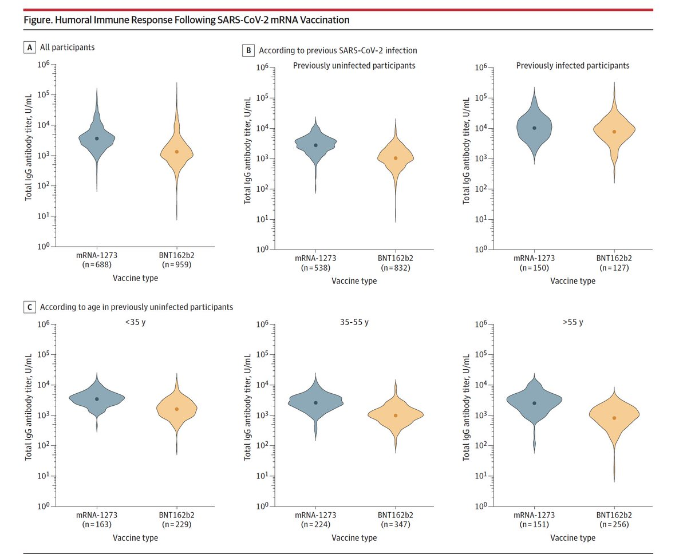</img></a>

---

<a href="https://twitter.com/erictopol/status/1432440157748150273" target="_blank" rel="noreferer">20:28 UCT</a>

@ImmunoFever Impressive. As was your explanation about why and the whole unique study. Thanks for this outstanding and illuminating work 🙏

---

<a href="https://twitter.com/erictopol/status/1432442043519827970" target="_blank" rel="noreferer">20:36 UCT</a>

After ascending to an unprecedented level of hospitalizations, a descent has finally started. 
And test positivity reduced now to 12.5%
https://newsnodes.com/us_state/FL 

<a href="E-EOaFdVcAI96W9.jpg"  >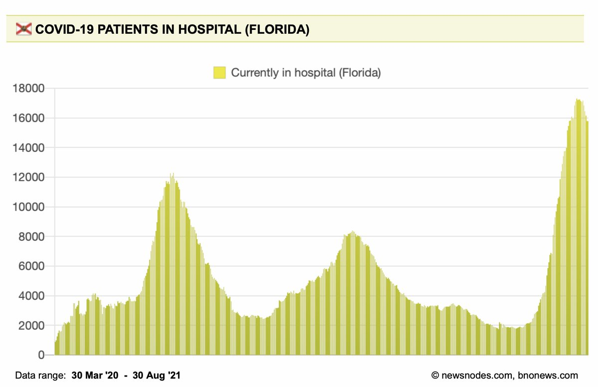</img></a>

---

<a href="https://twitter.com/erictopol/status/1432445214103244801" target="_blank" rel="noreferer">20:48 UCT</a>

The United States stands out in the global Delta wave
@OurWorldInData 
A wealth of vaccines and a relative dearth of vaccinees. 

<a href="E-EQKsvVgAEYxif.jpg"  >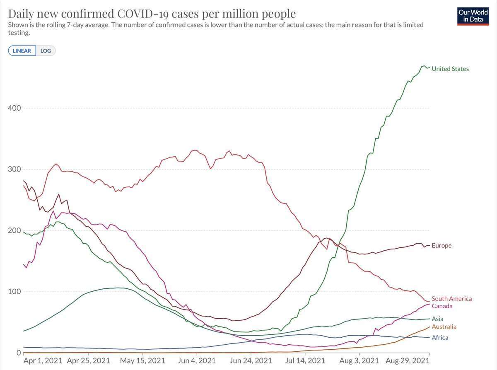</img></a>

---

<a href="https://twitter.com/erictopol/status/1432451902130638850" target="_blank" rel="noreferer">21:15 UCT</a>

@maggiekb1 They were really low. Then came Delta. Where are those data?

---

<a href="https://twitter.com/erictopol/status/1432461708606377986" target="_blank" rel="noreferer">21:54 UCT</a>

On understanding #LongCovid 
"Let not post-COVID-19 sequelae become our encephalitis lethargically of this century."
https://www.acpjournals.org/doi/10.7326/M21-3072
@AnnalsofIM by @PaulPauwaert 

<a href="E-Ef3IZVQAQEwF-.jpg"  >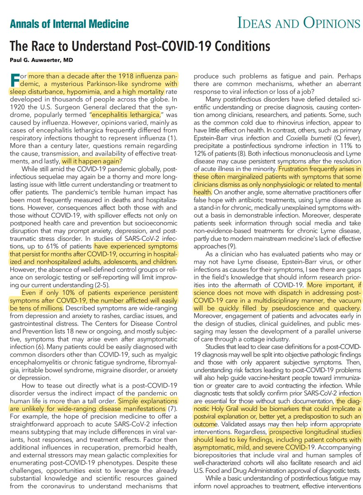</img></a><a href="E-Ef4wYVEAE1RrC.jpg"  >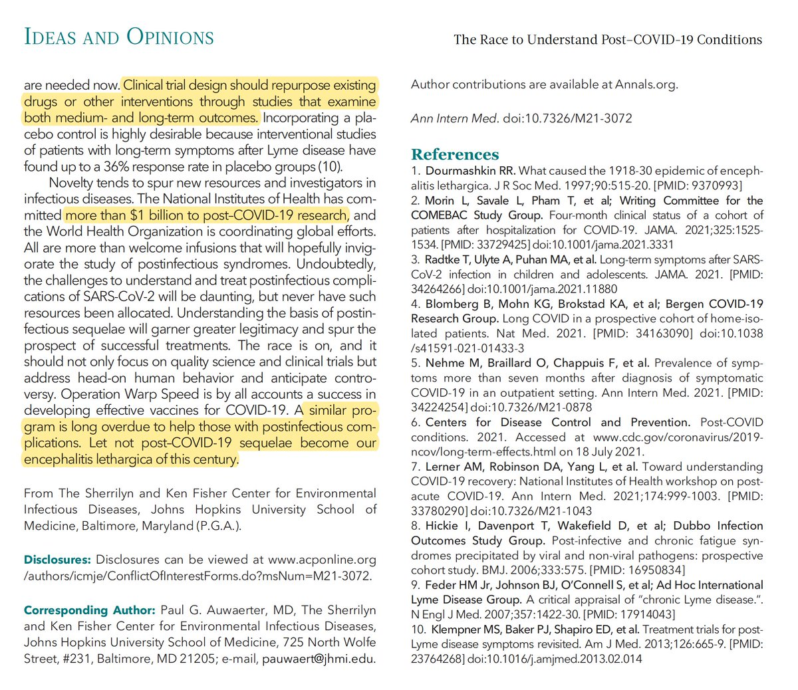</img></a>

---

<a href="https://twitter.com/erictopol/status/1432462767655587841" target="_blank" rel="noreferer">21:58 UCT</a>

damn auto-incorrect. lethargica
not lethargically

---

<a href="https://twitter.com/erictopol/status/1432466653925679105" target="_blank" rel="noreferer">22:13 UCT</a>

Two things we'd be far better off had they not occurred 
Top: https://science.sciencemag.org/content/373/6557/844
@ScienceMagazine @kakape @ScienceVisuals @nirja_desai
Bottom: H/T @macroliter 

<a href="E-EkzRjUUAED-Ev.jpg"  >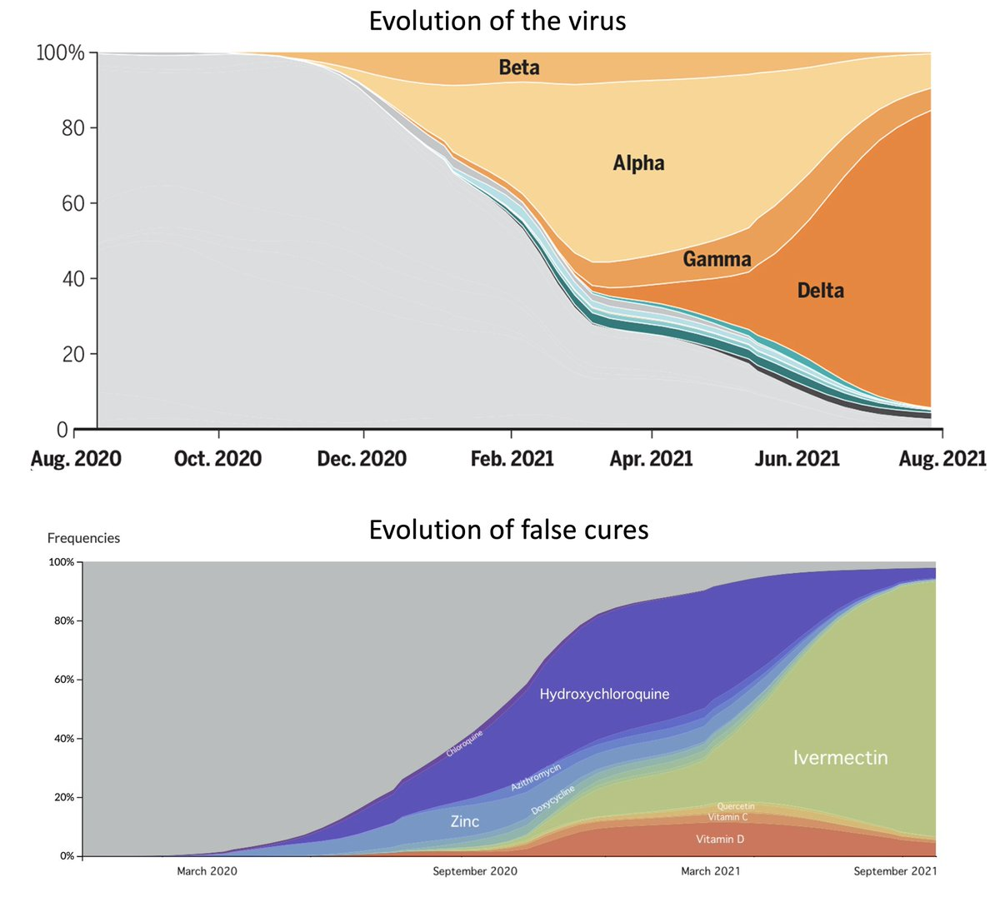</img></a>

---

<a href="https://twitter.com/erictopol/status/1432479752854536199" target="_blank" rel="noreferer">23:06 UCT</a>

RT @cuttingforstone: wonderful chat with Robin Cook MD, on Medical Thrillers, Healthcare and his career. With my cohost @EricTopol @Medscap…

